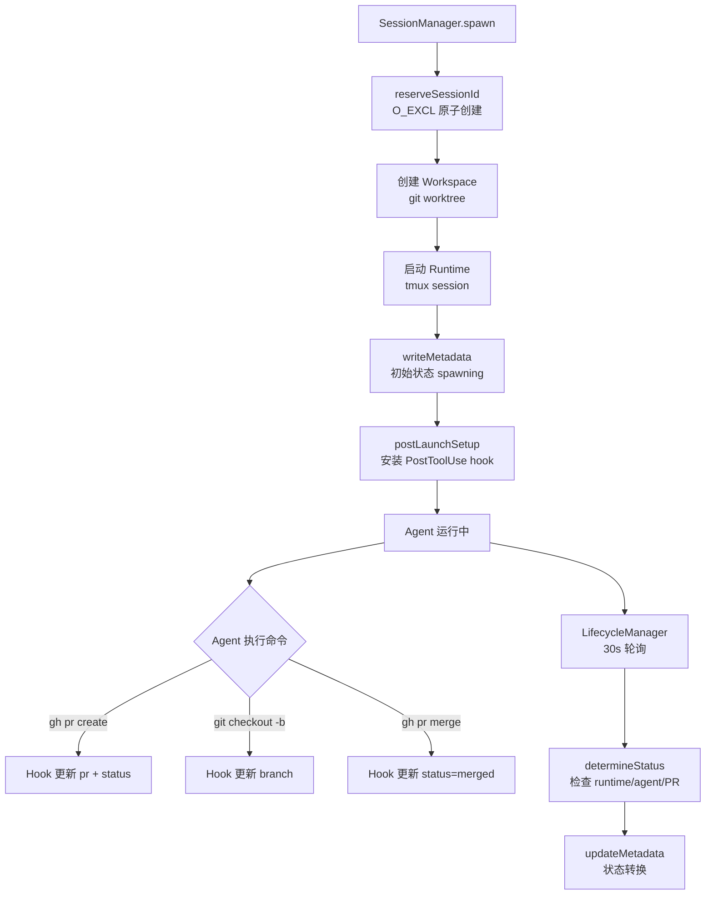
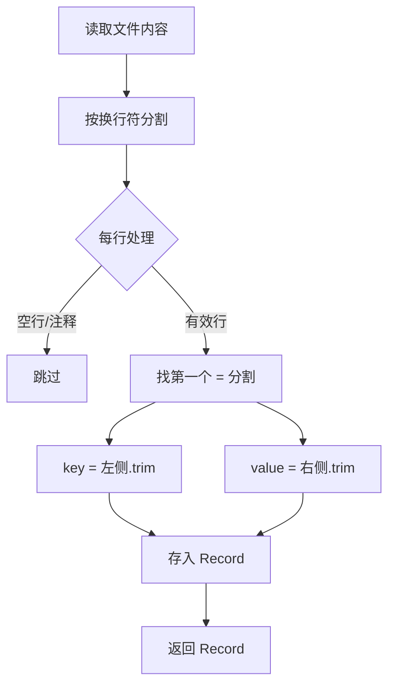

# PD-06.07 AgentOrchestrator — Flat-File 会话元数据持久化

> 文档编号：PD-06.07
> 来源：AgentOrchestrator `packages/core/src/metadata.ts` `packages/core/src/paths.ts` `packages/plugins/agent-claude-code/src/index.ts`
> GitHub：https://github.com/ComposioHQ/agent-orchestrator.git
> 问题域：PD-06 记忆持久化 Memory Persistence
> 状态：可复用方案

---

## 第 1 章 问题与动机

### 1.1 核心问题

多 Agent 编排系统需要在以下场景中可靠地持久化会话状态：

1. **会话恢复**：Agent 进程崩溃或被 kill 后，需要从元数据恢复上下文并重新启动
2. **跨进程状态同步**：Agent 在 tmux 中运行 git/gh 命令时，编排器需要实时感知 PR 创建、分支切换等状态变化
3. **多项目隔离**：同一台机器上可能运行多个项目的多个 Agent 会话，元数据不能互相污染
4. **生命周期追踪**：编排器的 Lifecycle Manager 需要轮询每个会话的状态（spawning → working → pr_open → merged），驱动自动化反应

传统方案（数据库、Redis）对于 CLI 工具来说过重。agent-orchestrator 选择了极简的 flat-file key=value 格式，兼顾了 bash 脚本可读性和 TypeScript 程序化访问。

### 1.2 AgentOrchestrator 的解法概述

1. **Flat-file key=value 格式**：每个会话一个文件，内容是 `key=value` 行，bash `source` 可直接读取（`packages/core/src/metadata.ts:42-54`）
2. **Hash-based 目录隔离**：用 `sha256(configDir).slice(0,12)` 生成 12 字符哈希，确保多项目目录不冲突（`packages/core/src/paths.ts:20-25`）
3. **Atomic reserveSessionId**：用 `O_EXCL` 标志原子创建文件，防止并发 spawn 时 ID 冲突（`packages/core/src/metadata.ts:264-274`）
4. **Archive-on-delete**：删除会话时自动归档到 `archive/` 子目录，支持后续恢复（`packages/core/src/metadata.ts:191-204`）
5. **PostToolUse Hook 自动更新**：通过 Claude Code 的 PostToolUse 钩子，Agent 执行 `gh pr create` 或 `git checkout -b` 时自动更新元数据（`packages/plugins/agent-claude-code/src/index.ts:31-167`）

### 1.3 设计思想

| 设计原则 | 具体实现 | 理由 | 替代方案 |
|----------|----------|------|----------|
| 格式极简 | key=value 纯文本，一行一字段 | bash 脚本可直接 source，调试时 cat 即可查看 | JSON/YAML（需解析器） |
| 原子性保护 | O_EXCL 创建 + temp+mv 更新 | 防止并发写入和中断导致数据损坏 | 文件锁 flock（跨平台差异大） |
| 目录级隔离 | sha256 哈希前缀 + .origin 碰撞检测 | 多项目共存不冲突，哈希碰撞可检测 | 项目名直接做目录（可能重名） |
| 被动式更新 | PostToolUse hook 监听 Agent 命令输出 | 无需 Agent 主动上报，零侵入 | Agent SDK 集成（耦合度高） |
| 归档而非删除 | archive/ 子目录 + ISO 时间戳后缀 | 支持会话恢复和审计追溯 | 软删除标记（文件数不减少） |

---

## 第 2 章 源码实现分析

### 2.1 架构概览

```
~/.agent-orchestrator/
├── {hash}-{projectId}/           # 项目级隔离目录
│   ├── .origin                   # 存储 configPath，用于碰撞检测
│   ├── sessions/                 # 活跃会话元数据
│   │   ├── ao-1                  # key=value 格式文件
│   │   ├── ao-2
│   │   └── archive/              # 归档的已结束会话
│   │       ├── ao-1_2025-02-26T12-34-56-789Z
│   │       └── ao-2_2025-02-27T08-00-00-000Z
│   └── worktrees/                # Git worktree 工作区
│       ├── ao-1/
│       └── ao-2/
```



### 2.2 核心实现

#### 2.2.1 Flat-File 解析与序列化



对应源码 `packages/core/src/metadata.ts:42-64`：

```typescript
function parseMetadataFile(content: string): Record<string, string> {
  const result: Record<string, string> = {};
  for (const line of content.split("\n")) {
    const trimmed = line.trim();
    if (!trimmed || trimmed.startsWith("#")) continue;
    const eqIndex = trimmed.indexOf("=");
    if (eqIndex === -1) continue;
    const key = trimmed.slice(0, eqIndex).trim();
    const value = trimmed.slice(eqIndex + 1).trim();
    if (key) result[key] = value;
  }
  return result;
}

function serializeMetadata(data: Record<string, string>): string {
  return (
    Object.entries(data)
      .filter(([, v]) => v !== undefined && v !== "")
      .map(([k, v]) => `${k}=${v}`)
      .join("\n") + "\n"
  );
}
```

关键细节：只用第一个 `=` 做分隔符，value 中可以包含 `=`（如 PR URL 中的查询参数）。

#### 2.2.2 原子 Session ID 预留

```mermaid
graph TD
    A[spawn 请求] --> B[listMetadata 获取已有 ID]
    B --> C[计算下一个编号 num]
    C --> D[reserveSessionId<br/>O_WRONLY|O_CREAT|O_EXCL]
    D -->|成功| E[返回 true, 继续 spawn]
    D -->|EEXIST| F[num++ 重试]
    F -->|< 10 次| D
    F -->|>= 10 次| G[抛出异常]
```

对应源码 `packages/core/src/metadata.ts:264-274`：

```typescript
export function reserveSessionId(dataDir: string, sessionId: SessionId): boolean {
  const path = metadataPath(dataDir, sessionId);
  mkdirSync(dirname(path), { recursive: true });
  try {
    const fd = openSync(path, constants.O_WRONLY | constants.O_CREAT | constants.O_EXCL);
    closeSync(fd);
    return true;
  } catch {
    return false;
  }
}
```

`O_EXCL` 是 POSIX 标准的原子文件创建标志：如果文件已存在则失败，不存在则创建。这比 `existsSync + writeFileSync` 的 check-then-act 模式安全得多，消除了 TOCTOU 竞态。

#### 2.2.3 PostToolUse Hook 自动更新

```mermaid
graph TD
    A[Agent 执行 Bash 命令] --> B[Claude Code PostToolUse 触发]
    B --> C[metadata-updater.sh 接收 JSON stdin]
    C --> D{解析 tool_name}
    D -->|非 Bash| E[输出 {} 退出]
    D -->|Bash| F{匹配命令模式}
    F -->|gh pr create| G[提取 PR URL<br/>更新 pr + status=pr_open]
    F -->|git checkout -b| H[提取分支名<br/>更新 branch]
    F -->|gh pr merge| I[更新 status=merged]
    F -->|其他| J[静默退出]
    G --> K[update_metadata_key<br/>sed + temp + mv]
    H --> K
    I --> K
```

对应源码 `packages/plugins/agent-claude-code/src/index.ts:89-112`：

```bash
update_metadata_key() {
  local key="$1"
  local value="$2"
  local temp_file="${metadata_file}.tmp"
  local escaped_value=$(echo "$value" | sed 's/[&|\\/]/\\&/g')

  if grep -q "^$key=" "$metadata_file" 2>/dev/null; then
    sed "s|^$key=.*|$key=$escaped_value|" "$metadata_file" > "$temp_file"
  else
    cp "$metadata_file" "$temp_file"
    echo "$key=$value" >> "$temp_file"
  fi

  mv "$temp_file" "$metadata_file"  # Atomic replace
}
```

Hook 通过 `AO_SESSION` 和 `AO_DATA_DIR` 环境变量定位元数据文件，这两个变量在 spawn 时注入到 tmux 环境中（`packages/core/src/session-manager.ts:480-481`）。

### 2.3 实现细节

**会话恢复流程**（`packages/core/src/session-manager.ts:920-974`）：

1. 遍历所有项目的 sessions 目录，查找活跃元数据
2. 若未找到，回退到 archive 目录查找最新归档
3. 从归档恢复时，重新创建活跃元数据文件
4. 重建 Session 对象，验证可恢复性（非 merged 状态）
5. 销毁旧 runtime，创建新 runtime 并传入 `--resume` 命令

**路径安全**：`validateSessionId` 使用 `/^[a-zA-Z0-9_-]+$/` 正则防止路径遍历攻击（`packages/core/src/metadata.ts:67-73`）。

**Hash 碰撞检测**：`.origin` 文件存储原始 configPath，每次 spawn 时校验，碰撞时抛出明确错误（`packages/core/src/paths.ts:173-194`）。

**JSONL 尾部读取**：`readLastJsonlEntry` 从文件末尾反向读取 4KB 块，避免加载 100MB+ 的完整 JSONL 文件（`packages/core/src/utils.ts:90-110`）。

---

## 第 3 章 迁移指南

### 3.1 迁移清单

**阶段 1：基础元数据层**
- [ ] 实现 `parseMetadataFile` / `serializeMetadata` 解析器（~30 行）
- [ ] 实现 `readMetadata` / `writeMetadata` / `updateMetadata` CRUD 操作
- [ ] 添加 `validateSessionId` 路径遍历防护
- [ ] 设计目录结构：`~/.your-tool/{instanceId}/sessions/{sessionId}`

**阶段 2：原子性与并发安全**
- [ ] 实现 `reserveSessionId` 使用 `O_EXCL` 原子创建
- [ ] 实现 `updateMetadata` 的 read-merge-write 模式
- [ ] 在 hook 脚本中使用 `temp + mv` 原子替换

**阶段 3：归档与恢复**
- [ ] 实现 `deleteMetadata` 的 archive-on-delete 逻辑
- [ ] 实现 `readArchivedMetadataRaw` 按时间戳排序查找最新归档
- [ ] 实现 restore 流程：archive → 重建活跃文件 → 重启 runtime

**阶段 4：自动状态同步（可选）**
- [ ] 编写 PostToolUse hook 脚本监听 git/gh 命令
- [ ] 在 spawn 时注入 `AO_SESSION` / `AO_DATA_DIR` 环境变量
- [ ] 配置 `.claude/settings.json` 注册 hook

### 3.2 适配代码模板

以下是一个可直接复用的 TypeScript 元数据管理模块：

```typescript
import { readFileSync, writeFileSync, existsSync, mkdirSync,
         unlinkSync, openSync, closeSync, constants } from "node:fs";
import { join, dirname } from "node:path";

// ---- 类型 ----
type SessionId = string;
interface SessionMeta {
  status: string;
  branch: string;
  workdir: string;
  [key: string]: string | undefined;
}

// ---- 解析 ----
const VALID_ID = /^[a-zA-Z0-9_-]+$/;

function parse(content: string): Record<string, string> {
  const r: Record<string, string> = {};
  for (const line of content.split("\n")) {
    const t = line.trim();
    if (!t || t.startsWith("#")) continue;
    const eq = t.indexOf("=");
    if (eq === -1) continue;
    const k = t.slice(0, eq).trim();
    const v = t.slice(eq + 1).trim();
    if (k) r[k] = v;
  }
  return r;
}

function serialize(data: Record<string, string>): string {
  return Object.entries(data)
    .filter(([, v]) => v !== undefined && v !== "")
    .map(([k, v]) => `${k}=${v}`)
    .join("\n") + "\n";
}

// ---- CRUD ----
function metaPath(dir: string, id: SessionId): string {
  if (!VALID_ID.test(id)) throw new Error(`Invalid session ID: ${id}`);
  return join(dir, id);
}

export function read(dir: string, id: SessionId): Record<string, string> | null {
  const p = metaPath(dir, id);
  if (!existsSync(p)) return null;
  return parse(readFileSync(p, "utf-8"));
}

export function write(dir: string, id: SessionId, data: Record<string, string>): void {
  const p = metaPath(dir, id);
  mkdirSync(dirname(p), { recursive: true });
  writeFileSync(p, serialize(data), "utf-8");
}

export function update(dir: string, id: SessionId, updates: Record<string, string>): void {
  let existing = read(dir, id) ?? {};
  for (const [k, v] of Object.entries(updates)) {
    if (v === "") { delete existing[k]; } else { existing[k] = v; }
  }
  write(dir, id, existing);
}

// ---- 原子预留 ----
export function reserve(dir: string, id: SessionId): boolean {
  const p = metaPath(dir, id);
  mkdirSync(dirname(p), { recursive: true });
  try {
    const fd = openSync(p, constants.O_WRONLY | constants.O_CREAT | constants.O_EXCL);
    closeSync(fd);
    return true;
  } catch { return false; }
}

// ---- 归档 ----
export function remove(dir: string, id: SessionId, archive = true): void {
  const p = metaPath(dir, id);
  if (!existsSync(p)) return;
  if (archive) {
    const archDir = join(dir, "archive");
    mkdirSync(archDir, { recursive: true });
    const ts = new Date().toISOString().replace(/[:.]/g, "-");
    writeFileSync(join(archDir, `${id}_${ts}`), readFileSync(p, "utf-8"));
  }
  unlinkSync(p);
}
```

### 3.3 适用场景

| 场景 | 适用度 | 说明 |
|------|--------|------|
| CLI 工具的会话状态管理 | ⭐⭐⭐ | 零依赖，bash 可读，完美适配 |
| 多 Agent 编排器 | ⭐⭐⭐ | 原子 ID 预留 + 目录隔离解决并发问题 |
| 开发者工具的配置持久化 | ⭐⭐ | 适合少量 KV 数据，不适合复杂查询 |
| 高并发 Web 服务 | ⭐ | 无事务支持，不适合高写入场景 |
| 需要全文搜索的知识库 | ⭐ | 无索引能力，需配合其他存储 |

---

## 第 4 章 测试用例

```python
import os
import tempfile
import pytest
from pathlib import Path


def parse_metadata(content: str) -> dict[str, str]:
    """Python port of parseMetadataFile."""
    result = {}
    for line in content.split("\n"):
        t = line.strip()
        if not t or t.startswith("#"):
            continue
        eq = t.find("=")
        if eq == -1:
            continue
        k = t[:eq].strip()
        v = t[eq + 1:].strip()
        if k:
            result[k] = v
    return result


def serialize_metadata(data: dict[str, str]) -> str:
    """Python port of serializeMetadata."""
    lines = [f"{k}={v}" for k, v in data.items() if v]
    return "\n".join(lines) + "\n"


class TestParseMetadata:
    def test_basic_kv(self):
        content = "status=working\nbranch=feat/login\n"
        result = parse_metadata(content)
        assert result == {"status": "working", "branch": "feat/login"}

    def test_value_with_equals(self):
        """Values can contain = (e.g., URLs with query params)."""
        content = "pr=https://github.com/org/repo/pull/42?expand=1\n"
        result = parse_metadata(content)
        assert result["pr"] == "https://github.com/org/repo/pull/42?expand=1"

    def test_comments_and_empty_lines(self):
        content = "# comment\n\nstatus=done\n  \n# another\nbranch=main\n"
        result = parse_metadata(content)
        assert result == {"status": "done", "branch": "main"}

    def test_empty_content(self):
        assert parse_metadata("") == {}
        assert parse_metadata("\n\n") == {}


class TestReserveSessionId:
    def test_atomic_reserve(self, tmp_path: Path):
        sessions_dir = tmp_path / "sessions"
        sessions_dir.mkdir()
        meta_path = sessions_dir / "ao-1"

        # First reserve succeeds
        fd = os.open(str(meta_path), os.O_WRONLY | os.O_CREAT | os.O_EXCL)
        os.close(fd)
        assert meta_path.exists()

        # Second reserve fails (EEXIST)
        with pytest.raises(FileExistsError):
            os.open(str(meta_path), os.O_WRONLY | os.O_CREAT | os.O_EXCL)

    def test_concurrent_reserve(self, tmp_path: Path):
        """Simulate concurrent spawn: only one wins."""
        sessions_dir = tmp_path / "sessions"
        sessions_dir.mkdir()
        results = []
        for _ in range(5):
            try:
                fd = os.open(
                    str(sessions_dir / "ao-1"),
                    os.O_WRONLY | os.O_CREAT | os.O_EXCL,
                )
                os.close(fd)
                results.append(True)
            except FileExistsError:
                results.append(False)
        assert results.count(True) == 1


class TestArchiveOnDelete:
    def test_archive_preserves_content(self, tmp_path: Path):
        sessions_dir = tmp_path / "sessions"
        sessions_dir.mkdir()
        meta_path = sessions_dir / "ao-1"
        meta_path.write_text("status=working\nbranch=feat/x\n")

        # Archive
        archive_dir = sessions_dir / "archive"
        archive_dir.mkdir()
        import datetime
        ts = datetime.datetime.now().isoformat().replace(":", "-").replace(".", "-")
        archive_path = archive_dir / f"ao-1_{ts}"
        archive_path.write_text(meta_path.read_text())
        meta_path.unlink()

        # Verify
        assert not meta_path.exists()
        assert archive_path.exists()
        restored = parse_metadata(archive_path.read_text())
        assert restored["status"] == "working"
        assert restored["branch"] == "feat/x"


class TestUpdateMetadata:
    def test_merge_updates(self, tmp_path: Path):
        meta_path = tmp_path / "ao-1"
        meta_path.write_text("status=working\nbranch=feat/x\n")

        existing = parse_metadata(meta_path.read_text())
        existing["pr"] = "https://github.com/org/repo/pull/42"
        existing["status"] = "pr_open"
        meta_path.write_text(serialize_metadata(existing))

        result = parse_metadata(meta_path.read_text())
        assert result["pr"] == "https://github.com/org/repo/pull/42"
        assert result["status"] == "pr_open"
        assert result["branch"] == "feat/x"

    def test_delete_key_with_empty_string(self, tmp_path: Path):
        meta_path = tmp_path / "ao-1"
        meta_path.write_text("status=working\nbranch=feat/x\npr=url\n")

        existing = parse_metadata(meta_path.read_text())
        del existing["pr"]  # Simulate empty string deletion
        meta_path.write_text(serialize_metadata(existing))

        result = parse_metadata(meta_path.read_text())
        assert "pr" not in result
```

---

## 第 5 章 跨域关联

| 关联域 | 关系类型 | 说明 |
|--------|----------|------|
| PD-01 上下文管理 | 协同 | JSONL 尾部读取（readLastJsonlEntry）用于活动检测，避免加载完整对话历史 |
| PD-02 多 Agent 编排 | 依赖 | SessionManager 的 spawn/restore/kill 依赖元数据 CRUD；LifecycleManager 轮询元数据驱动状态机 |
| PD-05 沙箱隔离 | 协同 | Hash-based 目录结构实现项目级文件系统隔离，每个项目独立的 sessions/ 和 worktrees/ |
| PD-09 Human-in-the-Loop | 协同 | LifecycleManager 通过元数据状态（needs_input/stuck）触发人工介入通知 |
| PD-10 中间件管道 | 依赖 | PostToolUse hook 是 Claude Code 中间件管道的一环，metadata-updater.sh 作为管道中的一个处理器 |
| PD-11 可观测性 | 协同 | JSONL 文件中的 costUSD/usage 字段被 extractCost 聚合，提供会话级成本追踪 |

---

## 第 6 章 来源文件索引

| 文件 | 行范围 | 关键实现 |
|------|--------|----------|
| `packages/core/src/metadata.ts` | L1-L275 | 完整的 flat-file 元数据 CRUD：parse/serialize/read/write/update/delete/archive/reserve |
| `packages/core/src/metadata.ts` | L42-L54 | parseMetadataFile：key=value 解析器，支持注释和空行 |
| `packages/core/src/metadata.ts` | L57-L64 | serializeMetadata：Record → key=value 序列化 |
| `packages/core/src/metadata.ts` | L160-L185 | updateMetadata：read-merge-write 更新模式，空字符串删除键 |
| `packages/core/src/metadata.ts` | L191-L204 | deleteMetadata：archive-on-delete，ISO 时间戳命名 |
| `packages/core/src/metadata.ts` | L264-L274 | reserveSessionId：O_EXCL 原子创建防并发冲突 |
| `packages/core/src/paths.ts` | L20-L25 | generateConfigHash：sha256 12 字符哈希 |
| `packages/core/src/paths.ts` | L84-L111 | 目录结构生成：projectBase/sessions/worktrees/archive |
| `packages/core/src/paths.ts` | L173-L194 | validateAndStoreOrigin：.origin 文件碰撞检测 |
| `packages/core/src/types.ts` | L959-L975 | SessionMetadata 接口定义：14 个字段 |
| `packages/core/src/utils.ts` | L90-L110 | readLastJsonlEntry：反向读取 JSONL 末尾条目 |
| `packages/core/src/session-manager.ts` | L315-L555 | spawn 流程：reserve → workspace → runtime → writeMetadata → hook |
| `packages/core/src/session-manager.ts` | L920-L974 | restore 流程：查找活跃/归档 → 重建 → 验证 → 重启 |
| `packages/core/src/lifecycle-manager.ts` | L182-L260 | determineStatus：多源状态推断（runtime/agent/PR/CI） |
| `packages/plugins/agent-claude-code/src/index.ts` | L31-L167 | METADATA_UPDATER_SCRIPT：PostToolUse hook bash 脚本 |
| `packages/plugins/agent-claude-code/src/index.ts` | L497-L575 | setupHookInWorkspace：hook 安装与 settings.json 配置 |

---

## 第 7 章 横向对比维度

```json comparison_data
{
  "project": "AgentOrchestrator",
  "dimensions": {
    "记忆结构": "flat-file key=value，每会话一文件，14 字段 SessionMetadata",
    "更新机制": "PostToolUse hook 被动监听 + LifecycleManager 30s 轮询主动推断",
    "事实提取": "bash 正则匹配 git/gh 命令输出提取 PR URL 和分支名",
    "存储方式": "纯文件系统，~/.agent-orchestrator/{hash}-{projectId}/sessions/",
    "注入方式": "环境变量 AO_SESSION + AO_DATA_DIR 注入到 tmux 运行时",
    "生命周期管理": "archive-on-delete + ISO 时间戳归档 + restore 从归档重建",
    "成本追踪": "JSONL 尾部读取 costUSD/usage 字段聚合会话级成本",
    "缓存失效策略": "无缓存层，每次直接读文件，依赖文件系统一致性",
    "并发安全": "O_EXCL 原子 ID 预留 + temp+mv 原子写入",
    "碰撞检测": ".origin 文件存储 configPath，sha256 哈希碰撞时抛出明确错误"
  }
}
```

### 域元数据补充

```json domain_metadata
{
  "solution_summary": "AgentOrchestrator 用 flat-file key=value 格式 + O_EXCL 原子预留 + PostToolUse hook 被动更新实现零依赖会话元数据持久化",
  "description": "CLI 工具场景下用纯文件系统替代数据库实现轻量级会话状态管理",
  "sub_problems": [
    "并发 ID 预留：多个 spawn 请求同时到达时如何保证 session ID 唯一性",
    "被动状态同步：Agent 运行时状态变化如何零侵入地同步到编排器",
    "归档恢复：已删除会话如何从归档中重建并恢复运行"
  ],
  "best_practices": [
    "O_EXCL 优于 check-then-act：POSIX 原子创建消除 TOCTOU 竞态，比 existsSync+writeFileSync 安全",
    "Hook 被动更新优于 Agent 主动上报：PostToolUse 钩子零侵入监听命令输出，无需修改 Agent 代码",
    "归档而非软删除：物理归档到 archive/ 子目录，既减少活跃文件数又保留恢复能力"
  ]
}
```
