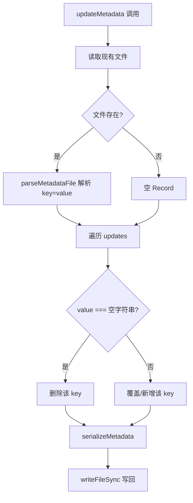
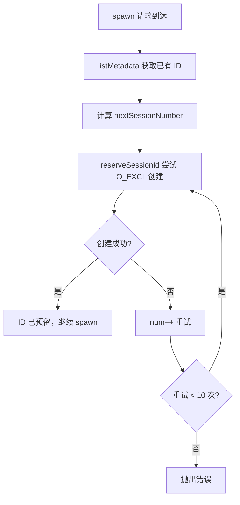

# PD-06.AO AgentOrchestrator — Flat-File 会话元数据持久化

> 文档编号：PD-06.AO
> 来源：AgentOrchestrator `packages/core/src/metadata.ts`
> GitHub：https://github.com/ComposioHQ/agent-orchestrator.git
> 问题域：PD-06 记忆持久化 Memory Persistence
> 状态：可复用方案

---

## 第 1 章 问题与动机

### 1.1 核心问题

Agent 编排器需要在多个维度持久化会话状态：

1. **会话生命周期追踪** — 每个 Agent 会话从 spawning → working → pr_open → merged 经历 16 种状态，编排器重启后必须恢复全部状态
2. **跨进程状态同步** — Agent（如 Claude Code）运行在独立的 tmux 会话中，其 git/gh 操作（创建分支、提交 PR）需要零侵入地同步回编排器
3. **并发 ID 安全** — 多个 spawn 请求可能同时到达，session ID 必须原子分配
4. **归档与恢复** — 已 kill 的会话需要可恢复，要求元数据不丢失
5. **多项目隔离** — 同一台机器上可能运行多个项目的编排器，元数据必须按项目隔离

传统方案（数据库、Redis）对于一个 CLI 工具来说过重。Agent Orchestrator 选择了极简的 flat-file key=value 方案，兼顾了 bash 脚本兼容性和 TypeScript 类型安全。

### 1.2 AgentOrchestrator 的解法概述

1. **Flat-file key=value 格式** — 每个会话一个文件，格式为 `key=value`（一行一对），bash `source` 可直接读取（`packages/core/src/metadata.ts:42-54`）
2. **SHA256 哈希目录隔离** — 用 `sha256(configDir).slice(0,12)` 生成 12 位哈希前缀，每个项目的元数据存储在 `~/.agent-orchestrator/{hash}-{projectId}/sessions/` 下（`packages/core/src/paths.ts:20-25`）
3. **O_EXCL 原子 ID 预留** — 用 `openSync(path, O_WRONLY | O_CREAT | O_EXCL)` 原子创建文件，防止并发 spawn 的 ID 碰撞（`packages/core/src/metadata.ts:264-274`）
4. **PostToolUse Hook 被动同步** — 在 Agent 工作区注入 bash hook 脚本，拦截 `gh pr create`、`git checkout -b` 等命令的输出，自动更新元数据（`packages/plugins/agent-claude-code/src/index.ts:31-167`）
5. **Archive-on-delete 归档机制** — 删除会话时自动复制到 `archive/` 子目录（带 ISO 时间戳），支持从归档恢复（`packages/core/src/metadata.ts:191-240`）

### 1.3 设计思想

| 设计原则 | 具体实现 | 理由 | 替代方案 |
|----------|----------|------|----------|
| 极简存储 | key=value 纯文本文件 | CLI 工具无需数据库依赖，bash 脚本可直接 source | SQLite、LevelDB |
| 原子并发 | O_EXCL 文件创建 | 操作系统级原子性，无需锁服务 | flock、数据库事务 |
| 零侵入同步 | PostToolUse bash hook | Agent 无需修改代码，hook 拦截 stdout 提取信息 | Agent SDK 回调、轮询 |
| 目录级隔离 | SHA256 哈希前缀 | 不同 config 路径自动隔离，支持多实例 | 数据库 schema 隔离 |
| 可恢复删除 | archive/ + ISO 时间戳 | 误删可恢复，时间戳天然排序 | 软删除标记位 |
| 路径安全 | 正则校验 session ID | 防止路径穿越攻击 | 白名单 + 编码 |

---

## 第 2 章 源码实现分析

### 2.1 架构概览

Agent Orchestrator 的持久化层由三个核心模块组成：

```
┌─────────────────────────────────────────────────────────────────┐
│                    Session Manager (CRUD)                        │
│  packages/core/src/session-manager.ts                           │
│  spawn() → reserveId → createWorkspace → launchRuntime → write  │
│  list()  → scanDirs → readMeta → enrichWithRuntime              │
│  kill()  → destroyRuntime → destroyWorkspace → archiveMeta      │
│  restore() → readArchive → recreateWorkspace → relaunch         │
└──────────────┬──────────────────────────────────┬───────────────┘
               │                                  │
    ┌──────────▼──────────┐          ┌────────────▼────────────┐
    │   Metadata Layer    │          │   Path Resolution       │
    │   metadata.ts       │          │   paths.ts              │
    │                     │          │                         │
    │  read/write/update  │          │  SHA256 hash → dir      │
    │  reserve (O_EXCL)   │          │  session/tmux naming    │
    │  delete + archive   │          │  .origin collision det  │
    │  list sessions      │          │                         │
    └─────────────────────┘          └─────────────────────────┘
               │
    ┌──────────▼──────────────────────────────────────────────┐
    │   File System                                           │
    │   ~/.agent-orchestrator/{hash}-{projectId}/             │
    │     ├── sessions/                                       │
    │     │   ├── int-1          (active session metadata)    │
    │     │   ├── int-2                                       │
    │     │   └── archive/                                    │
    │     │       └── int-1_2024-01-15T10-30-00-000Z          │
    │     ├── worktrees/                                      │
    │     └── .origin            (collision detection)        │
    └─────────────────────────────────────────────────────────┘
```

### 2.2 核心实现

#### 2.2.1 元数据读写与 Merge 更新



对应源码 `packages/core/src/metadata.ts:160-184`：

```typescript
export function updateMetadata(
  dataDir: string,
  sessionId: SessionId,
  updates: Partial<Record<string, string>>,
): void {
  const path = metadataPath(dataDir, sessionId);
  let existing: Record<string, string> = {};

  if (existsSync(path)) {
    existing = parseMetadataFile(readFileSync(path, "utf-8"));
  }

  // Merge updates — remove keys set to empty string
  for (const [key, value] of Object.entries(updates)) {
    if (value === undefined) continue;
    if (value === "") {
      const { [key]: _, ...rest } = existing;
      existing = rest;
    } else {
      existing[key] = value;
    }
  }

  mkdirSync(dirname(path), { recursive: true });
  writeFileSync(path, serializeMetadata(existing), "utf-8");
}
```

关键设计：空字符串作为"删除"语义，`undefined` 表示"不修改"。这让调用方可以精确控制哪些字段更新、哪些删除、哪些保持不变。

#### 2.2.2 原子 Session ID 预留



对应源码 `packages/core/src/metadata.ts:264-274`：

```typescript
export function reserveSessionId(dataDir: string, sessionId: SessionId): boolean {
  const path = metadataPath(dataDir, sessionId);
  mkdirSync(dirname(path), { recursive: true });
  try {
    const fd = openSync(path, constants.O_WRONLY | constants.O_CREAT | constants.O_EXCL);
    closeSync(fd);
    return true;
  } catch {
    return false;
  }
}
```

`O_EXCL` 标志保证：如果文件已存在，`openSync` 会抛出 `EEXIST` 错误。这是操作系统级的原子性保证，无需额外的锁机制。调用方（`session-manager.ts:366-383`）在循环中最多重试 10 次。

#### 2.2.3 PostToolUse Hook 被动状态同步

```mermaid
graph TD
    A[Agent 执行 Bash 命令] --> B[Claude Code PostToolUse Hook 触发]
    B --> C[metadata-updater.sh 接收 JSON stdin]
    C --> D{解析 tool_name}
    D -->|非 Bash| E[输出 {} 退出]
    D -->|Bash| F{匹配命令模式}
    F -->|gh pr create| G[提取 PR URL → 更新 pr + status=pr_open]
    F -->|git checkout -b| H[提取 branch → 更新 branch]
    F -->|gh pr merge| I[更新 status=merged]
    F -->|其他| J[输出 {} 退出]
    G --> K[sed 原子替换 metadata 文件]
    H --> K
    I --> K
```

对应源码 `packages/plugins/agent-claude-code/src/index.ts:31-167`，这是一个完整的 bash 脚本，被写入 `.claude/metadata-updater.sh`。核心的命令检测逻辑（`index.ts:118-166`）：

```bash
# Detect: gh pr create
if [[ "$command" =~ ^gh[[:space:]]+pr[[:space:]]+create ]]; then
  pr_url=$(echo "$output" | grep -Eo 'https://github[.]com/[^/]+/[^/]+/pull/[0-9]+' | head -1)
  if [[ -n "$pr_url" ]]; then
    update_metadata_key "pr" "$pr_url"
    update_metadata_key "status" "pr_open"
    echo '{"systemMessage": "Updated metadata: PR created at '"$pr_url"'"}'
    exit 0
  fi
fi

# Detect: git checkout -b <branch> or git switch -c <branch>
if [[ "$command" =~ ^git[[:space:]]+checkout[[:space:]]+-b[[:space:]]+([^[:space:]]+) ]] || \
   [[ "$command" =~ ^git[[:space:]]+switch[[:space:]]+-c[[:space:]]+([^[:space:]]+) ]]; then
  branch="${BASH_REMATCH[1]}"
  if [[ -n "$branch" ]]; then
    update_metadata_key "branch" "$branch"
    exit 0
  fi
fi
```

Hook 通过 `sed` + `mv` 实现原子更新（`index.ts:90-112`），先写临时文件再 `mv` 替换，防止写入中断导致数据损坏。

### 2.3 实现细节

**生命周期管理器的状态同步**（`packages/core/src/lifecycle-manager.ts:436-521`）：

Lifecycle Manager 每 30 秒轮询所有会话，通过 `determineStatus()` 综合判断状态（runtime 存活、agent 活动、PR 状态、CI 状态、review 状态），检测到状态变化时调用 `updateMetadata()` 持久化新状态：

```typescript
// lifecycle-manager.ts:449-453
const project = config.projects[session.projectId];
if (project) {
  const sessionsDir = getSessionsDir(config.configPath, project.path);
  updateMetadata(sessionsDir, session.id, { status: newStatus });
}
```

**会话恢复流程**（`packages/core/src/session-manager.ts:920-1107`）：

恢复分为 10 步：搜索活跃元数据 → 回退到归档 → 重建活跃文件 → 构建 Session 对象 → 运行时状态检测 → 验证可恢复性 → 检查工作区 → 销毁旧运行时 → 获取恢复命令 → 更新元数据。关键的归档恢复逻辑：

```typescript
// session-manager.ts:961-974
if (fromArchive) {
  writeMetadata(sessionsDir, sessionId, {
    worktree: raw["worktree"] ?? "",
    branch: raw["branch"] ?? "",
    status: raw["status"] ?? "killed",
    tmuxName: raw["tmuxName"],
    issue: raw["issue"],
    pr: raw["pr"],
    summary: raw["summary"],
    project: raw["project"],
    createdAt: raw["createdAt"],
    runtimeHandle: raw["runtimeHandle"],
  });
}
```

**16 态状态机**（`packages/core/src/types.ts:26-42`）：

```
spawning → working → pr_open → review_pending → approved → mergeable → merged
                  ↘ ci_failed    ↗ changes_requested
                  ↘ needs_input
                  ↘ stuck
                  ↘ errored → killed → (restore) → spawning
                  ↘ done
                  ↘ terminated
```

终态集合 `TERMINAL_STATUSES`（`types.ts:94-101`）：killed, terminated, done, cleanup, errored, merged。其中 merged 是唯一不可恢复的终态（`NON_RESTORABLE_STATUSES`，`types.ts:107`）。

---

## 第 3 章 迁移指南

### 3.1 迁移清单

**阶段 1：基础元数据层（1 个文件）**

- [ ] 实现 `parseMetadataFile()` / `serializeMetadata()` — key=value 解析器
- [ ] 实现 `readMetadata()` / `writeMetadata()` / `updateMetadata()` — CRUD 操作
- [ ] 实现 `reserveSessionId()` — O_EXCL 原子预留
- [ ] 实现 `validateSessionId()` — 路径穿越防护（正则 `^[a-zA-Z0-9_-]+$`）
- [ ] 定义 `SessionMetadata` 接口 — 按需裁剪字段

**阶段 2：目录结构与隔离（1 个文件）**

- [ ] 实现 `generateConfigHash()` — SHA256 前 12 位
- [ ] 实现 `getSessionsDir()` / `getProjectBaseDir()` — 路径计算
- [ ] 实现 `validateAndStoreOrigin()` — 哈希碰撞检测
- [ ] 创建 `.origin` 文件机制

**阶段 3：归档与恢复**

- [ ] 实现 `deleteMetadata(archive=true)` — 带时间戳归档
- [ ] 实现 `readArchivedMetadataRaw()` — 按时间戳排序读取最新归档
- [ ] 在 session manager 的 restore 流程中集成归档读取

**阶段 4：被动状态同步（可选）**

- [ ] 编写 PostToolUse hook bash 脚本
- [ ] 实现 `setupWorkspaceHooks()` — 注入 hook 到 Agent 工作区
- [ ] 配置 Agent 的 settings.json 注册 hook

### 3.2 适配代码模板

以下是一个可直接运行的 TypeScript 元数据层实现，从 Agent Orchestrator 提炼：

```typescript
// metadata.ts — 可独立使用的 flat-file 元数据层
import {
  readFileSync, writeFileSync, existsSync,
  mkdirSync, unlinkSync, readdirSync, statSync,
  openSync, closeSync, constants,
} from "node:fs";
import { join, dirname } from "node:path";

const VALID_ID = /^[a-zA-Z0-9_-]+$/;

function validateId(id: string): void {
  if (!VALID_ID.test(id)) throw new Error(`Invalid ID: ${id}`);
}

function parse(content: string): Record<string, string> {
  const result: Record<string, string> = {};
  for (const line of content.split("\n")) {
    const trimmed = line.trim();
    if (!trimmed || trimmed.startsWith("#")) continue;
    const eq = trimmed.indexOf("=");
    if (eq === -1) continue;
    const key = trimmed.slice(0, eq).trim();
    const value = trimmed.slice(eq + 1).trim();
    if (key) result[key] = value;
  }
  return result;
}

function serialize(data: Record<string, string>): string {
  return Object.entries(data)
    .filter(([, v]) => v !== undefined && v !== "")
    .map(([k, v]) => `${k}=${v}`)
    .join("\n") + "\n";
}

export function read(dir: string, id: string): Record<string, string> | null {
  validateId(id);
  const path = join(dir, id);
  if (!existsSync(path)) return null;
  return parse(readFileSync(path, "utf-8"));
}

export function write(dir: string, id: string, data: Record<string, string>): void {
  validateId(id);
  const path = join(dir, id);
  mkdirSync(dirname(path), { recursive: true });
  writeFileSync(path, serialize(data), "utf-8");
}

export function update(dir: string, id: string, updates: Record<string, string>): void {
  validateId(id);
  const path = join(dir, id);
  let existing: Record<string, string> = {};
  if (existsSync(path)) existing = parse(readFileSync(path, "utf-8"));
  for (const [key, value] of Object.entries(updates)) {
    if (value === "") { delete existing[key]; }
    else { existing[key] = value; }
  }
  mkdirSync(dirname(path), { recursive: true });
  writeFileSync(path, serialize(existing), "utf-8");
}

export function reserve(dir: string, id: string): boolean {
  validateId(id);
  const path = join(dir, id);
  mkdirSync(dirname(path), { recursive: true });
  try {
    const fd = openSync(path, constants.O_WRONLY | constants.O_CREAT | constants.O_EXCL);
    closeSync(fd);
    return true;
  } catch { return false; }
}

export function remove(dir: string, id: string, archive = true): void {
  validateId(id);
  const path = join(dir, id);
  if (!existsSync(path)) return;
  if (archive) {
    const archiveDir = join(dir, "archive");
    mkdirSync(archiveDir, { recursive: true });
    const ts = new Date().toISOString().replace(/[:.]/g, "-");
    writeFileSync(join(archiveDir, `${id}_${ts}`), readFileSync(path, "utf-8"));
  }
  unlinkSync(path);
}

export function list(dir: string): string[] {
  if (!existsSync(dir)) return [];
  return readdirSync(dir).filter(name =>
    name !== "archive" && !name.startsWith(".") &&
    VALID_ID.test(name) &&
    statSync(join(dir, name)).isFile()
  );
}
```

### 3.3 适用场景

| 场景 | 适用度 | 说明 |
|------|--------|------|
| CLI Agent 编排器 | ⭐⭐⭐ | 完美匹配：无数据库依赖，bash 兼容，原子并发 |
| 单机多 Agent 管理 | ⭐⭐⭐ | SHA256 哈希隔离天然支持多项目 |
| 分布式 Agent 集群 | ⭐ | 不适合：flat-file 无法跨机器同步，需要数据库 |
| 高频状态更新（>10次/秒） | ⭐ | 不适合：每次更新都是全文件读写，I/O 开销大 |
| 需要复杂查询的场景 | ⭐ | 不适合：无索引，只能全量扫描 |
| 需要事务保证的场景 | ⭐⭐ | 部分适合：O_EXCL 保证创建原子性，但 update 非原子 |

---

## 第 4 章 测试用例

```typescript
import { describe, it, expect, beforeEach, afterEach } from "vitest";
import { mkdtempSync, rmSync, readFileSync, existsSync } from "node:fs";
import { join } from "node:path";
import { tmpdir } from "node:os";
import { read, write, update, reserve, remove, list } from "./metadata";

describe("FlatFile Metadata", () => {
  let dir: string;

  beforeEach(() => {
    dir = mkdtempSync(join(tmpdir(), "meta-test-"));
  });

  afterEach(() => {
    rmSync(dir, { recursive: true, force: true });
  });

  describe("read/write", () => {
    it("should write and read back metadata", () => {
      write(dir, "session-1", { status: "working", branch: "feat/foo" });
      const meta = read(dir, "session-1");
      expect(meta).toEqual({ status: "working", branch: "feat/foo" });
    });

    it("should return null for non-existent session", () => {
      expect(read(dir, "nope")).toBeNull();
    });

    it("should reject path traversal IDs", () => {
      expect(() => read(dir, "../etc/passwd")).toThrow("Invalid ID");
    });
  });

  describe("update (merge)", () => {
    it("should merge updates preserving existing keys", () => {
      write(dir, "s1", { status: "working", branch: "main" });
      update(dir, "s1", { status: "pr_open", pr: "https://github.com/o/r/pull/1" });
      const meta = read(dir, "s1");
      expect(meta?.status).toBe("pr_open");
      expect(meta?.branch).toBe("main"); // preserved
      expect(meta?.pr).toBe("https://github.com/o/r/pull/1");
    });

    it("should delete keys set to empty string", () => {
      write(dir, "s1", { status: "working", pr: "url" });
      update(dir, "s1", { pr: "" });
      const meta = read(dir, "s1");
      expect(meta?.pr).toBeUndefined();
      expect(meta?.status).toBe("working");
    });
  });

  describe("reserve (O_EXCL)", () => {
    it("should succeed on first call", () => {
      expect(reserve(dir, "new-1")).toBe(true);
    });

    it("should fail on duplicate", () => {
      reserve(dir, "new-1");
      expect(reserve(dir, "new-1")).toBe(false);
    });

    it("should handle concurrent reservations", async () => {
      const results = await Promise.all(
        Array.from({ length: 10 }, (_, i) => 
          Promise.resolve(reserve(dir, `race-${i % 3}`))
        )
      );
      // Each unique ID should succeed exactly once
      const grouped = { "race-0": 0, "race-1": 0, "race-2": 0 };
      results.forEach((ok, i) => { if (ok) grouped[`race-${i % 3}` as keyof typeof grouped]++; });
      expect(grouped["race-0"]).toBe(1);
      expect(grouped["race-1"]).toBe(1);
      expect(grouped["race-2"]).toBe(1);
    });
  });

  describe("remove + archive", () => {
    it("should archive before deleting", () => {
      write(dir, "s1", { status: "killed" });
      remove(dir, "s1", true);
      expect(existsSync(join(dir, "s1"))).toBe(false);
      const archiveFiles = list(join(dir, "archive")).length;
      // Archive dir should have the file (but list() filters archive/)
      expect(existsSync(join(dir, "archive"))).toBe(true);
    });

    it("should skip archive when archive=false", () => {
      write(dir, "s1", { status: "killed" });
      remove(dir, "s1", false);
      expect(existsSync(join(dir, "s1"))).toBe(false);
      expect(existsSync(join(dir, "archive"))).toBe(false);
    });
  });

  describe("list", () => {
    it("should list session files excluding archive and dotfiles", () => {
      write(dir, "s1", { status: "working" });
      write(dir, "s2", { status: "pr_open" });
      const sessions = list(dir);
      expect(sessions).toContain("s1");
      expect(sessions).toContain("s2");
      expect(sessions).not.toContain("archive");
    });
  });
});
```

---

## 第 5 章 跨域关联

| 关联域 | 关系类型 | 说明 |
|--------|----------|------|
| PD-01 上下文管理 | 协同 | JSONL 会话文件的 tail 读取（`parseJsonlFileTail`，`index.ts:264-307`）用于提取摘要和成本，是上下文管理的一部分 |
| PD-02 多 Agent 编排 | 依赖 | Session Manager 是编排器的核心，元数据持久化是编排状态的唯一真相源 |
| PD-03 容错与重试 | 协同 | `reserveSessionId` 的 10 次重试循环（`session-manager.ts:370-383`）、spawn 失败时的资源清理链 |
| PD-04 工具系统 | 依赖 | PostToolUse Hook 依赖 Claude Code 的 hook 系统（`settings.json` 中的 `hooks.PostToolUse`） |
| PD-07 质量检查 | 协同 | Lifecycle Manager 通过 SCM 插件检测 CI 状态和 review 决策，结果持久化到元数据的 status 字段 |
| PD-10 中间件管道 | 协同 | PostToolUse hook 本质上是一个中间件，拦截 Agent 的工具调用输出并注入副作用 |
| PD-11 可观测性 | 协同 | `extractCost()` 从 JSONL 聚合 token 用量和成本估算（`index.ts:339-383`），`AgentSessionInfo` 携带成本数据 |

---

## 第 6 章 来源文件索引

| 文件 | 行范围 | 关键实现 |
|------|--------|----------|
| `packages/core/src/metadata.ts` | L1-L275 | 完整元数据 CRUD：parse/serialize/read/write/update/delete/reserve/list/archive |
| `packages/core/src/paths.ts` | L1-L195 | SHA256 哈希目录结构、session/tmux 命名、.origin 碰撞检测 |
| `packages/core/src/types.ts` | L22-L171 | SessionId/SessionStatus/ActivityState/Session/SessionMetadata 类型定义 |
| `packages/core/src/types.ts` | L94-L126 | TERMINAL_STATUSES/NON_RESTORABLE_STATUSES/isTerminalSession/isRestorable |
| `packages/core/src/session-manager.ts` | L116-L157 | metadataToSession — 从 key=value 重建 Session 对象 |
| `packages/core/src/session-manager.ts` | L315-L559 | spawn() — 完整的会话创建流程含 reserveId + writeMetadata |
| `packages/core/src/session-manager.ts` | L750-L808 | kill() — 销毁运行时/工作区 + archiveMetadata |
| `packages/core/src/session-manager.ts` | L920-L1107 | restore() — 10 步归档恢复流程 |
| `packages/core/src/lifecycle-manager.ts` | L172-L607 | 状态机轮询 + updateMetadata 持久化状态转换 |
| `packages/plugins/agent-claude-code/src/index.ts` | L31-L167 | PostToolUse hook bash 脚本（metadata-updater.sh） |
| `packages/plugins/agent-claude-code/src/index.ts` | L497-L575 | setupHookInWorkspace — 注入 hook 到 .claude/settings.json |
| `packages/plugins/agent-claude-code/src/index.ts` | L705-L730 | getSessionInfo — 从 JSONL 提取摘要和成本 |

---

## 第 7 章 横向对比维度

> **重要：** 本章用于自动填充 Butcher Wiki 的横向对比表。

```json comparison_data
{
  "project": "AgentOrchestrator",
  "dimensions": {
    "记忆结构": "flat-file key=value 纯文本，每会话一个文件",
    "更新机制": "read-merge-write 全文件更新，空字符串语义删除",
    "事实提取": "PostToolUse bash hook 从命令输出正则提取 PR/branch",
    "存储方式": "文件系统 ~/.agent-orchestrator/{hash}-{projectId}/sessions/",
    "注入方式": "环境变量 AO_SESSION + AO_DATA_DIR 传递路径",
    "生命周期管理": "16 态状态机 + 30s 轮询 + archive-on-delete",
    "并发安全": "O_EXCL 原子文件创建，10 次重试循环",
    "碰撞检测": "SHA256 哈希 + .origin 文件校验防止目录碰撞",
    "版本控制": "无版本控制，archive/ 目录按 ISO 时间戳保留历史",
    "MCP 协议集成": "无 MCP，通过 Claude Code PostToolUse hook 集成"
  }
}
```

### 域元数据补充

```json domain_metadata
{
  "solution_summary": "AgentOrchestrator 用 flat-file key=value 文件 + O_EXCL 原子预留 + PostToolUse bash hook 实现零数据库依赖的会话状态持久化",
  "description": "CLI 编排器场景下无数据库依赖的轻量级状态持久化",
  "sub_problems": [
    "Hook 注入兼容：不同 Agent（Claude/Codex/Aider）的 hook 配置格式差异如何统一抽象",
    "元数据与运行时状态一致性：metadata 文件记录 working 但 runtime 已 exited 时的检测与修正",
    "跨项目会话发现：如何在不预知项目列表的情况下扫描所有项目的会话目录"
  ],
  "best_practices": [
    "O_EXCL 优于 flock：文件创建级原子性比文件锁更轻量且无死锁风险",
    "空字符串作删除语义：update 接口中空字符串表示删除 key，undefined 表示不修改，比 null/delete 标记更直观",
    "归档用 ISO 时间戳命名：天然字典序排序，无需额外索引即可找到最新归档"
  ]
}
```
