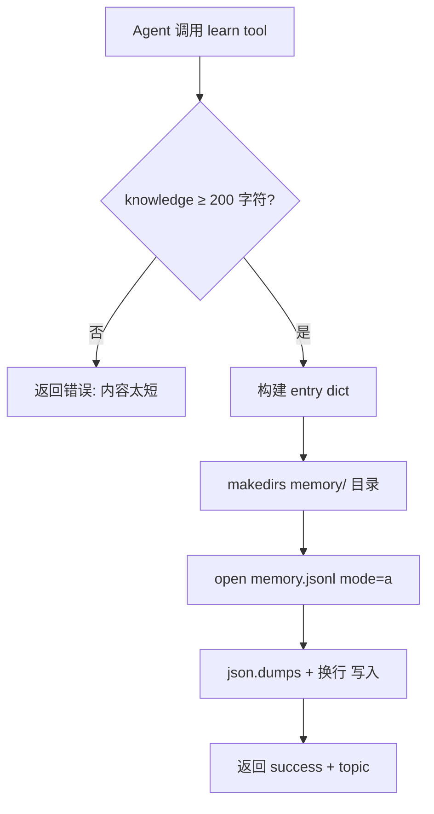
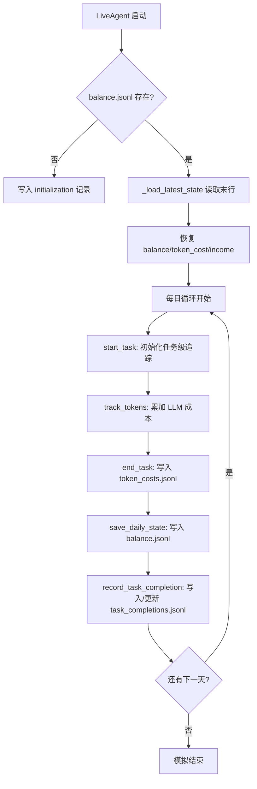
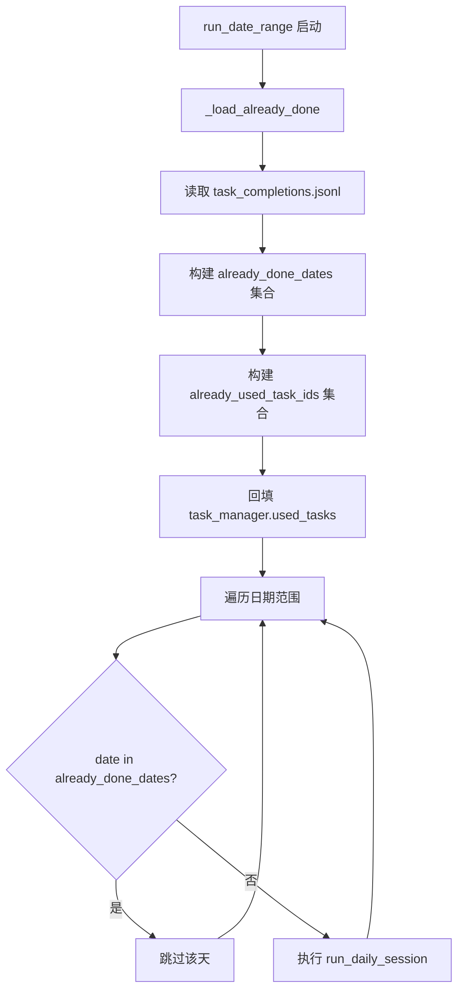

# PD-06.CW ClawWork — JSONL 追加式记忆与经济状态持久化

> 文档编号：PD-06.CW
> 来源：ClawWork `clawmode_integration/tools.py`, `livebench/tools/tool_livebench.py`, `livebench/agent/economic_tracker.py`
> GitHub：https://github.com/HKUDS/ClawWork.git
> 问题域：PD-06 记忆持久化 Memory Persistence
> 状态：可复用方案

---

## 第 1 章 问题与动机

### 1.1 核心问题

ClawWork 是一个经济生存模拟平台（LiveBench），多个 AI Agent 在其中通过"工作"和"学习"两种活动维持经济平衡。核心挑战在于：

1. **知识跨会话积累**：Agent 每天执行一个活动（work 或 learn），学习获得的知识必须跨天持久化，否则每天都从零开始，无法形成知识复利
2. **经济状态连续性**：余额、token 消耗、任务完成记录必须在进程重启后精确恢复，否则 Agent 可能重复执行已完成的任务或丢失收入记录
3. **双格式记忆并存**：系统同时存在 JSONL（结构化追加）和 Markdown（人类可读追加）两种记忆格式，分别服务于不同的消费场景
4. **断点续跑**：长时间模拟（数百天）中途中断后，必须能从上次完成的日期精确恢复，不重复、不遗漏

### 1.2 ClawWork 的解法概述

1. **JSONL 追加式记忆**：`LearnTool` 将学习内容以 `{date, timestamp, topic, knowledge}` 结构追加到 `memory.jsonl`（`clawmode_integration/tools.py:300-312`），每条记忆独立一行，天然支持增量写入
2. **Markdown 追加式记忆**：MCP 工具层的 `save_to_memory()` 使用 `memory.md` 格式，以 Markdown 分隔符追加（`livebench/tools/tool_livebench.py:342-353`），面向 Agent 上下文注入时更易阅读
3. **三文件经济状态持久化**：`EconomicTracker` 维护 `balance.jsonl`（每日快照）、`token_costs.jsonl`（每任务成本明细）、`task_completions.jsonl`（任务完成记录），三者协同实现完整经济状态恢复（`livebench/agent/economic_tracker.py:52-54`）
4. **task_completions 驱动断点续跑**：`_load_already_done()` 读取 `task_completions.jsonl` 构建已完成日期和任务 ID 集合，跳过已执行的天数（`livebench/agent/live_agent.py:895-932`）
5. **Agent 主动检索记忆**：记忆不自动注入 system prompt，而是通过 `get_memory()` 工具由 Agent 按需拉取（`livebench/tools/tool_livebench.py:279-316`），避免 token 浪费

### 1.3 设计思想

| 设计原则 | 具体实现 | 理由 | 替代方案 |
|----------|----------|------|----------|
| 追加优先 | JSONL append-only 写入 | 无锁、无事务、崩溃安全（最多丢失最后一行） | SQLite WAL（更重但支持查询） |
| 按需检索 | Agent 调用 get_memory() 工具 | 避免每次对话注入全部记忆浪费 token | 自动注入最近 N 条（简单但不灵活） |
| 双格式并存 | JSONL（结构化）+ MD（可读） | 不同消费者需求不同：API 解析 vs Agent 阅读 | 统一 JSONL + 渲染层（更一致但多一层） |
| 幂等续跑 | task_completions 作为 source of truth | 只记录成功完成的任务，API 错误不写入 | 基于日期文件存在性判断（不够精确） |
| 最小长度门控 | knowledge ≥ 200 字符 | 防止 Agent 写入无意义的短记忆 | 无门控（记忆质量不可控） |

---

## 第 2 章 源码实现分析

### 2.1 架构概览

ClawWork 的记忆持久化分为两个独立子系统：**知识记忆**和**经济状态**，共享同一个 `data_path` 根目录但使用不同子目录。

```
livebench/data/agent_data/{signature}/
├── memory/
│   ├── memory.jsonl          ← LearnTool 写入（结构化）
│   └── memory.md             ← save_to_memory 写入（Markdown）
├── economic/
│   ├── balance.jsonl          ← 每日余额快照
│   ├── token_costs.jsonl      ← 每任务成本明细
│   └── task_completions.jsonl ← 任务完成记录（断点续跑依据）
├── work/
│   ├── tasks.jsonl            ← 任务分配记录
│   └── evaluations.jsonl      ← 评估结果
├── decisions/
│   └── decisions.jsonl        ← 每日活动决策
├── logs/
│   ├── errors.jsonl           ← 错误日志
│   ├── warnings.jsonl         ← 警告日志
│   └── info.jsonl             ← 信息日志
└── terminal_logs/
    └── {date}.log             ← 终端输出日志
```

组件关系：

```
┌─────────────────────────────────────────────────────────────┐
│                      LiveAgent 主循环                        │
│  run_date_range() → run_daily_session() × N days            │
├──────────┬──────────────┬───────────────────────────────────┤
│          │              │                                    │
│  ┌───────▼───────┐  ┌──▼──────────────┐  ┌────────────────┐│
│  │  LearnTool    │  │ EconomicTracker │  │ LiveBenchLogger ││
│  │  (memory.jsonl│  │ (3× JSONL files)│  │ (4× JSONL logs) ││
│  │   追加写入)   │  │  追加 + 重写)   │  │  追加写入)      ││
│  └───────┬───────┘  └──┬──────────────┘  └────────┬────────┘│
│          │              │                          │         │
│  ┌───────▼───────┐  ┌──▼──────────────┐  ┌───────▼────────┐│
│  │ save_to_memory│  │ _load_latest_   │  │ _write_log()   ││
│  │ (memory.md    │  │  state()        │  │ JSONL append   ││
│  │  MD 追加)     │  │ _load_already_  │  │                ││
│  └───────────────┘  │  done()         │  └────────────────┘│
│                     └─────────────────┘                     │
├─────────────────────────────────────────────────────────────┤
│                    FastAPI Server (读取层)                    │
│  /api/agents/{sig}/learning  → 解析 memory.jsonl            │
│  /api/agents/{sig}/economic  → 解析 balance.jsonl           │
│  /api/leaderboard            → 聚合所有 agent 数据          │
└─────────────────────────────────────────────────────────────┘
```

### 2.2 核心实现

#### 2.2.1 LearnTool — JSONL 追加式知识记忆



对应源码 `clawmode_integration/tools.py:287-319`：

```python
class LearnTool(Tool):
    """Learn something new and add it to the knowledge base."""

    async def execute(self, **kwargs: Any) -> str:
        topic: str = kwargs.get("topic", "")
        knowledge: str = kwargs.get("knowledge", "")

        if len(knowledge) < 200:
            return json.dumps({
                "error": "Knowledge content too short. Minimum 200 characters required.",
                "current_length": len(knowledge),
            })

        data_path = self._state.data_path
        date = self._state.current_date

        memory_dir = os.path.join(data_path, "memory")
        os.makedirs(memory_dir, exist_ok=True)

        entry = {
            "date": date,
            "timestamp": datetime.now().isoformat(),
            "topic": topic,
            "knowledge": knowledge,
        }

        memory_file = os.path.join(memory_dir, "memory.jsonl")
        with open(memory_file, "a", encoding="utf-8") as fh:
            fh.write(json.dumps(entry, ensure_ascii=False) + "\n")

        return json.dumps({
            "success": True,
            "topic": topic,
            "knowledge_length": len(knowledge),
            "message": f"Learned about: {topic}",
        })
```

关键设计点：
- `ensure_ascii=False` 支持多语言知识存储
- `mode="a"` 追加模式，无需读取已有内容
- 每条记忆包含 `date`（模拟日期）和 `timestamp`（真实时间戳）双时间维度

#### 2.2.2 EconomicTracker — 三文件经济状态持久化



对应源码 `livebench/agent/economic_tracker.py:105-116`（状态恢复）：

```python
def _load_latest_state(self) -> None:
    """Load latest economic state from balance file"""
    with open(self.balance_file, "r") as f:
        for line in f:
            record = json.loads(line)

    # Latest record (last line wins)
    self.current_balance = record["balance"]
    self.total_token_cost = record["total_token_cost"]
    self.total_work_income = record["total_work_income"]
    self.total_trading_profit = record["total_trading_profit"]
```

#### 2.2.3 断点续跑 — task_completions 驱动



对应源码 `livebench/agent/live_agent.py:895-932`：

```python
def _load_already_done(self) -> tuple:
    already_done_dates: set = set()
    already_used_task_ids: set = set()

    completions_file = os.path.join(self.data_path, "economic", "task_completions.jsonl")
    if not os.path.exists(completions_file):
        return already_done_dates, already_used_task_ids

    with open(completions_file, "r", encoding="utf-8") as f:
        for line in f:
            line = line.strip()
            if not line:
                continue
            try:
                rec = json.loads(line)
                date = rec.get("date")
                task_id = rec.get("task_id")
                if date:
                    already_done_dates.add(date)
                if task_id:
                    already_used_task_ids.add(task_id)
                    self.task_manager.used_tasks.add(task_id)
                    if date:
                        self.task_manager.daily_tasks[date] = task_id
            except (json.JSONDecodeError, KeyError):
                pass

    return already_done_dates, already_used_task_ids
```

### 2.3 实现细节

**task_completions 的幂等更新**（`economic_tracker.py:678-732`）：`record_task_completion()` 在写入新记录前，先读取整个文件过滤掉同 `task_id` 的旧记录，再重写文件。这保证了同一任务的重试不会产生重复条目：

```python
def record_task_completion(self, task_id, work_submitted, wall_clock_seconds, ...):
    record = { "task_id": task_id, "date": date, ... }
    
    # Read existing, drop prior entry for this task_id
    existing_lines = []
    with open(self.task_completions_file, "r") as f:
        for line in f:
            entry = json.loads(line.strip())
            if entry.get("task_id") != task_id:
                existing_lines.append(line.strip())
    
    # Rewrite with updated record
    with open(self.task_completions_file, "w") as f:
        for line in existing_lines:
            f.write(line + "\n")
        f.write(json.dumps(record) + "\n")
```

**API 层记忆读取**（`livebench/api/server.py:426-461`）：`/api/agents/{signature}/learning` 端点解析 JSONL 并同时返回结构化 `entries` 数组和渲染后的 Markdown `memory` 字符串，前端可按需选择展示格式。

**日志持久化**（`livebench/utils/logger.py:41-63`）：`LiveBenchLogger` 使用与记忆相同的 JSONL 追加模式，按级别分文件（errors/warnings/info/debug），每条日志包含 timestamp、signature、level、message、context、exception 六个字段。

---

## 第 3 章 迁移指南

### 3.1 迁移清单

**阶段 1：基础记忆持久化（1 个文件）**
- [ ] 创建 `MemoryStore` 类，封装 JSONL 追加写入和全量读取
- [ ] 定义记忆条目 schema：`{timestamp, topic, content, metadata}`
- [ ] 实现 `append()` 方法（追加写入）和 `load_all()` 方法（全量读取）
- [ ] 添加最小长度校验（防止低质量记忆）

**阶段 2：经济/状态持久化（3 个文件）**
- [ ] 创建 `StateTracker` 类，管理 balance + costs + completions 三个 JSONL 文件
- [ ] 实现 `_load_latest_state()` 从 balance 文件末行恢复状态
- [ ] 实现 `record_completion()` 带幂等去重（读取-过滤-重写）
- [ ] 实现 `save_checkpoint()` 写入每日快照

**阶段 3：断点续跑**
- [ ] 实现 `load_already_done()` 从 completions 文件构建已完成集合
- [ ] 在主循环中跳过已完成的任务/日期
- [ ] 回填 task manager 的 used_tasks 集合防止重复分配

**阶段 4：API 读取层**
- [ ] 实现 JSONL 解析端点，返回结构化条目 + 渲染后文本
- [ ] 添加文件监听（mtime 轮询）实现实时推送

### 3.2 适配代码模板

以下是可直接复用的 JSONL 记忆存储模板：

```python
"""Portable JSONL memory store inspired by ClawWork's LearnTool pattern."""

import json
import os
from datetime import datetime
from dataclasses import dataclass, asdict
from typing import List, Optional, Dict, Any


@dataclass
class MemoryEntry:
    """Single memory entry with dual timestamp."""
    topic: str
    content: str
    sim_date: str  # Simulation/logical date
    timestamp: str  # Real wall-clock time
    metadata: Optional[Dict[str, Any]] = None


class JSONLMemoryStore:
    """Append-only JSONL memory store with minimum quality gate."""

    def __init__(self, data_dir: str, min_content_length: int = 200):
        self.memory_file = os.path.join(data_dir, "memory", "memory.jsonl")
        self.min_content_length = min_content_length
        os.makedirs(os.path.dirname(self.memory_file), exist_ok=True)

    def append(self, topic: str, content: str, sim_date: str = "",
               metadata: Optional[Dict[str, Any]] = None) -> MemoryEntry:
        """Append a memory entry. Raises ValueError if content too short."""
        if len(content) < self.min_content_length:
            raise ValueError(
                f"Content too short ({len(content)} < {self.min_content_length})"
            )

        entry = MemoryEntry(
            topic=topic,
            content=content,
            sim_date=sim_date or datetime.now().strftime("%Y-%m-%d"),
            timestamp=datetime.now().isoformat(),
            metadata=metadata,
        )

        with open(self.memory_file, "a", encoding="utf-8") as f:
            f.write(json.dumps(asdict(entry), ensure_ascii=False) + "\n")

        return entry

    def load_all(self) -> List[MemoryEntry]:
        """Load all memory entries."""
        if not os.path.exists(self.memory_file):
            return []

        entries = []
        with open(self.memory_file, "r", encoding="utf-8") as f:
            for line in f:
                if line.strip():
                    data = json.loads(line)
                    entries.append(MemoryEntry(**data))
        return entries

    def load_by_topic(self, topic_keyword: str) -> List[MemoryEntry]:
        """Simple keyword filter on topic field."""
        return [e for e in self.load_all()
                if topic_keyword.lower() in e.topic.lower()]

    def render_markdown(self) -> str:
        """Render all memories as Markdown for LLM context injection."""
        entries = self.load_all()
        if not entries:
            return ""
        sections = []
        for e in entries:
            sections.append(f"## {e.topic} ({e.sim_date})\n{e.content}")
        return "\n\n---\n\n".join(sections)


class CompletionTracker:
    """Idempotent task completion tracker (ClawWork pattern)."""

    def __init__(self, data_dir: str):
        self.completions_file = os.path.join(data_dir, "completions.jsonl")
        os.makedirs(os.path.dirname(self.completions_file), exist_ok=True)

    def record(self, task_id: str, **kwargs) -> None:
        """Record completion, replacing any prior entry for same task_id."""
        record = {"task_id": task_id, "timestamp": datetime.now().isoformat(), **kwargs}

        existing = []
        if os.path.exists(self.completions_file):
            with open(self.completions_file, "r", encoding="utf-8") as f:
                for line in f:
                    if line.strip():
                        entry = json.loads(line)
                        if entry.get("task_id") != task_id:
                            existing.append(line.strip())

        with open(self.completions_file, "w", encoding="utf-8") as f:
            for line in existing:
                f.write(line + "\n")
            f.write(json.dumps(record) + "\n")

    def get_done_ids(self) -> set:
        """Get set of completed task IDs for resume logic."""
        if not os.path.exists(self.completions_file):
            return set()
        done = set()
        with open(self.completions_file, "r", encoding="utf-8") as f:
            for line in f:
                if line.strip():
                    entry = json.loads(line)
                    tid = entry.get("task_id")
                    if tid:
                        done.add(tid)
        return done
```

### 3.3 适用场景

| 场景 | 适用度 | 说明 |
|------|--------|------|
| 单 Agent 日志式记忆 | ⭐⭐⭐ | 完美匹配：追加写入、全量读取、无并发 |
| 多 Agent 共享记忆 | ⭐ | 不适合：无锁机制，多进程写同一文件会交错 |
| 需要语义检索的记忆 | ⭐ | 不适合：JSONL 只支持全量扫描，无向量索引 |
| 经济/状态断点续跑 | ⭐⭐⭐ | 完美匹配：completions 文件驱动幂等恢复 |
| 高频写入（>100次/秒） | ⭐⭐ | 可用但需注意文件系统 flush 延迟 |
| 记忆量 >10MB | ⭐⭐ | 全量读取开始变慢，需考虑分片或索引 |

---

## 第 4 章 测试用例

```python
"""Tests for ClawWork-style JSONL memory persistence."""

import json
import os
import tempfile
import pytest
from datetime import datetime


class TestJSONLMemoryStore:
    """Test the JSONL append-only memory pattern."""

    def setup_method(self):
        self.tmpdir = tempfile.mkdtemp()
        # Inline minimal implementation for testing
        self.memory_file = os.path.join(self.tmpdir, "memory", "memory.jsonl")
        os.makedirs(os.path.dirname(self.memory_file), exist_ok=True)

    def _append_entry(self, topic: str, knowledge: str, date: str = "2027-01-01"):
        entry = {
            "date": date,
            "timestamp": datetime.now().isoformat(),
            "topic": topic,
            "knowledge": knowledge,
        }
        with open(self.memory_file, "a", encoding="utf-8") as f:
            f.write(json.dumps(entry, ensure_ascii=False) + "\n")
        return entry

    def _load_entries(self):
        if not os.path.exists(self.memory_file):
            return []
        entries = []
        with open(self.memory_file, "r", encoding="utf-8") as f:
            for line in f:
                if line.strip():
                    entries.append(json.loads(line))
        return entries

    def test_append_creates_file(self):
        """First append creates the file."""
        self._append_entry("Python", "x" * 200)
        assert os.path.exists(self.memory_file)

    def test_append_preserves_order(self):
        """Multiple appends maintain insertion order."""
        self._append_entry("Topic A", "a" * 200, "2027-01-01")
        self._append_entry("Topic B", "b" * 200, "2027-01-02")
        self._append_entry("Topic C", "c" * 200, "2027-01-03")
        entries = self._load_entries()
        assert len(entries) == 3
        assert entries[0]["topic"] == "Topic A"
        assert entries[2]["topic"] == "Topic C"

    def test_unicode_support(self):
        """Non-ASCII content is preserved."""
        self._append_entry("中文主题", "这是一段中文知识内容" * 20)
        entries = self._load_entries()
        assert entries[0]["topic"] == "中文主题"
        assert "中文知识内容" in entries[0]["knowledge"]

    def test_minimum_length_gate(self):
        """Knowledge below 200 chars should be rejected at tool level."""
        short_knowledge = "too short"
        assert len(short_knowledge) < 200  # Verify precondition

    def test_dual_timestamp(self):
        """Each entry has both simulation date and real timestamp."""
        self._append_entry("Test", "x" * 200, date="2027-06-15")
        entry = self._load_entries()[0]
        assert entry["date"] == "2027-06-15"
        assert "T" in entry["timestamp"]  # ISO format


class TestCompletionTracker:
    """Test idempotent task completion tracking."""

    def setup_method(self):
        self.tmpdir = tempfile.mkdtemp()
        self.completions_file = os.path.join(self.tmpdir, "task_completions.jsonl")

    def _record(self, task_id, **kwargs):
        record = {"task_id": task_id, "timestamp": datetime.now().isoformat(), **kwargs}
        existing = []
        if os.path.exists(self.completions_file):
            with open(self.completions_file, "r") as f:
                for line in f:
                    if line.strip():
                        entry = json.loads(line)
                        if entry.get("task_id") != task_id:
                            existing.append(line.strip())
        with open(self.completions_file, "w") as f:
            for line in existing:
                f.write(line + "\n")
            f.write(json.dumps(record) + "\n")

    def _load_all(self):
        if not os.path.exists(self.completions_file):
            return []
        entries = []
        with open(self.completions_file, "r") as f:
            for line in f:
                if line.strip():
                    entries.append(json.loads(line))
        return entries

    def test_idempotent_update(self):
        """Re-recording same task_id replaces old entry."""
        self._record("task_001", score=0.5)
        self._record("task_001", score=0.9)
        entries = self._load_all()
        assert len(entries) == 1
        assert entries[0]["score"] == 0.9

    def test_multiple_tasks_preserved(self):
        """Different task_ids coexist."""
        self._record("task_001", score=0.8)
        self._record("task_002", score=0.7)
        self._record("task_003", score=0.9)
        entries = self._load_all()
        assert len(entries) == 3

    def test_resume_set(self):
        """Can build done-set for resume logic."""
        self._record("task_001")
        self._record("task_002")
        done = set()
        for entry in self._load_all():
            done.add(entry["task_id"])
        assert done == {"task_001", "task_002"}

    def test_empty_file_resume(self):
        """Resume from empty/missing file returns empty set."""
        entries = self._load_all()
        assert entries == []
```

---

## 第 5 章 跨域关联

| 关联域 | 关系类型 | 说明 |
|--------|----------|------|
| PD-01 上下文管理 | 协同 | 记忆注入是上下文管理的一部分：ClawWork 的 `get_memory()` 工具让 Agent 按需拉取记忆到上下文窗口，避免自动注入导致的 token 浪费 |
| PD-03 容错与重试 | 依赖 | 断点续跑依赖 `task_completions.jsonl` 的幂等写入；API 错误的任务不写入 completions，确保下次重试 |
| PD-04 工具系统 | 协同 | `LearnTool` 和 `get_memory()` 作为 Tool ABC 子类注册到工具系统，记忆读写通过工具调用触发而非框架自动执行 |
| PD-07 质量检查 | 协同 | 200 字符最小长度门控是记忆质量的第一道防线；经济系统的 0.6 评估分阈值决定是否记录收入 |
| PD-11 可观测性 | 协同 | `LiveBenchLogger` 使用相同的 JSONL 追加模式持久化日志；`EconomicTracker` 的 `token_costs.jsonl` 同时服务于成本追踪和可观测性 |

---

## 第 6 章 来源文件索引

| 文件 | 行范围 | 关键实现 |
|------|--------|----------|
| `clawmode_integration/tools.py` | L252-319 | LearnTool 类：JSONL 追加式知识记忆写入 |
| `clawmode_integration/tools.py` | L29-41 | ClawWorkState dataclass：共享状态定义 |
| `livebench/tools/tool_livebench.py` | L279-316 | get_memory() MCP 工具：Markdown 格式记忆读取 |
| `livebench/tools/tool_livebench.py` | L320-367 | save_to_memory() MCP 工具：Markdown 格式记忆写入 |
| `livebench/tools/tool_livebench.py` | L371+ | learn_from_web()：Web 搜索 + 自动存储记忆 |
| `livebench/agent/economic_tracker.py` | L12-54 | EconomicTracker 初始化：三文件路径定义 |
| `livebench/agent/economic_tracker.py` | L85-116 | initialize() + _load_latest_state()：状态恢复 |
| `livebench/agent/economic_tracker.py` | L117-156 | start_task() + end_task()：任务级成本追踪 |
| `livebench/agent/economic_tracker.py` | L288-356 | _save_task_record()：合并式任务成本记录 |
| `livebench/agent/economic_tracker.py` | L358-421 | add_work_income()：带评估阈值的收入记录 |
| `livebench/agent/economic_tracker.py` | L438-513 | save_daily_state() + _save_balance_record()：每日快照 |
| `livebench/agent/economic_tracker.py` | L678-732 | record_task_completion()：幂等去重写入 |
| `livebench/agent/live_agent.py` | L895-932 | _load_already_done()：断点续跑逻辑 |
| `livebench/api/server.py` | L426-461 | /api/agents/{sig}/learning：记忆 API 端点 |
| `livebench/api/server.py` | L464-502 | /api/agents/{sig}/economic：经济数据 API |
| `livebench/api/server.py` | L747-804 | watch_agent_files()：mtime 轮询文件监听 |
| `livebench/utils/logger.py` | L14-63 | LiveBenchLogger：JSONL 分级日志持久化 |
| `livebench/utils/logger.py` | L160-199 | setup_terminal_log() + terminal_print()：终端日志 |
| `livebench/prompts/live_agent_prompt.py` | L199-203 | 系统 prompt 中记忆工具的引导说明 |
| `livebench/prompts/live_agent_prompt.py` | L487-534 | 学习会话 prompt：记忆工具使用指引 |

---

## 第 7 章 横向对比维度

> **重要：** 本章用于自动填充 Butcher Wiki 的横向对比表。

```json comparison_data
{
  "project": "ClawWork",
  "dimensions": {
    "记忆结构": "双格式并存：JSONL（topic+knowledge+date+timestamp）+ Markdown（分隔符追加）",
    "更新机制": "纯追加 append-only，无更新/删除操作",
    "事实提取": "Agent 自主决定学习内容，200 字符最小门控",
    "存储方式": "本地文件系统 JSONL，按 agent signature 目录隔离",
    "注入方式": "Agent 主动调用 get_memory() 工具按需拉取，不自动注入",
    "生命周期管理": "无过期机制，记忆永久保留",
    "并发安全": "单 Agent 单进程，无锁设计",
    "记忆检索": "全量读取 + 关键词过滤，无向量索引",
    "经验结构化": "三文件分离：balance/token_costs/task_completions",
    "存储后端委托": "直接文件 I/O，无抽象层",
    "记忆增长控制": "无控制机制，纯追加无限增长"
  }
}
```

### 域元数据补充

```json domain_metadata
{
  "solution_summary": "ClawWork 用 JSONL+Markdown 双格式追加式记忆配合三文件经济状态持久化，通过 task_completions 驱动幂等断点续跑",
  "description": "经济模拟场景下记忆与状态的轻量级文件持久化方案",
  "sub_problems": [
    "双格式记忆一致性：JSONL 和 Markdown 两种格式并存时如何保证内容同步",
    "经济状态多文件原子性：balance/costs/completions 三文件更新的一致性保证",
    "评估阈值与记忆关联：工作评估分数如何影响记忆价值判断和学习策略调整"
  ],
  "best_practices": [
    "task_completions 作为断点续跑唯一依据：只记录成功完成的任务，API 错误不写入",
    "幂等去重写入：record_task_completion 先读取过滤再重写，保证同一 task_id 只有一条记录",
    "Agent 主动检索优于自动注入：通过工具调用让 Agent 决定何时需要记忆，节省 token"
  ]
}
```
