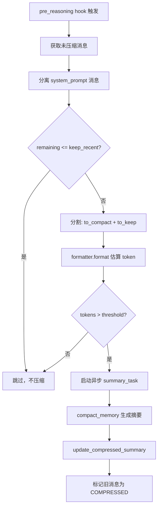
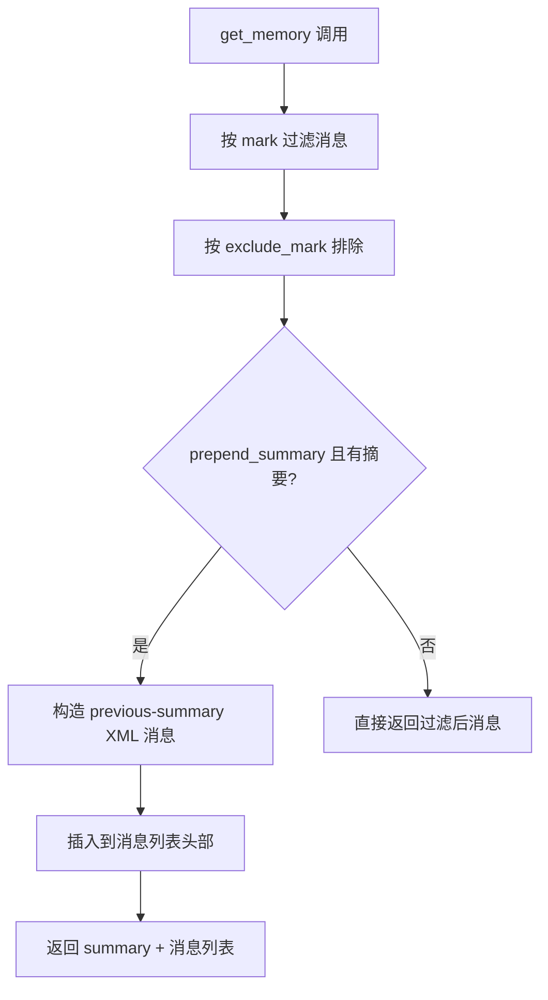

# PD-06.07 CoPaw — ReMe 语义记忆与 SafeJSON 会话持久化

> 文档编号：PD-06.07
> 来源：CoPaw `src/copaw/agents/memory/memory_manager.py`
> GitHub：https://github.com/agentscope-ai/CoPaw.git
> 问题域：PD-06 记忆持久化 Memory Persistence
> 状态：可复用方案

---

## 第 1 章 问题与动机

### 1.1 核心问题

Agent 在多轮对话中面临两个层次的记忆持久化挑战：

1. **短期对话记忆**：上下文窗口有限，长对话需要压缩摘要以保持连贯性，同时不丢失关键信息
2. **长期语义记忆**：Agent 需要跨会话记住用户偏好、历史决策、工作进展等结构化知识，并能通过语义搜索快速检索

CoPaw 作为一个多渠道（Discord/钉钉/飞书/QQ/iMessage/Console）Agent 框架，还面临额外挑战：不同渠道的 session_id 格式各异（如 `discord:dm:12345`），需要安全地映射到文件系统路径。

### 1.2 CoPaw 的解法概述

CoPaw 采用**三层记忆架构**，将短期对话、长期语义、会话状态分离处理：

1. **CoPawInMemoryMemory** — 扩展 AgentScope 的 InMemoryMemory，增加压缩摘要注入和 state_dict 序列化（`copaw_memory.py:12`）
2. **MemoryManager（继承 ReMeFb）** — 集成 ReMe 库实现语义记忆，支持 Chroma/本地向量存储 + 全文检索双模式，通过文件监听自动索引 MEMORY.md（`memory_manager.py:445`）
3. **SafeJSONSession** — 跨平台安全的 JSON 会话持久化，sanitize 文件名中的非法字符（`session.py:30`）

辅助机制：
4. **MemoryCompactionHook** — pre_reasoning 钩子自动检测 token 用量并触发压缩（`hooks/memory_compaction.py:65`）
5. **AgentMdManager** — 管理 working/memory 目录下的 Markdown 文件读写（`agent_md_manager.py:10`）

### 1.3 设计思想

| 设计原则 | 具体实现 | 理由 | 替代方案 |
|----------|----------|------|----------|
| 继承复用 | MemoryManager 继承 ReMeFb，零代码获得向量索引+FTS | 避免重复实现 embedding/检索逻辑 | 自建向量检索层 |
| 平台自适应 | `MEMORY_STORE_BACKEND=auto`：Windows 用 local，其他用 Chroma | Chroma 在 Windows 上有兼容问题 | 强制统一后端 |
| 钩子驱动压缩 | pre_reasoning hook 检测 token 超阈值自动 compact | 对 Agent 主逻辑零侵入 | 在 reply() 中硬编码检查 |
| 文件名安全 | SafeJSONSession 用正则替换 `\/:*?"<>|` 为 `--` | 多渠道 session_id 含冒号等非法字符 | URL encode |
| 双模式检索 | 向量搜索 + FTS 并存，向量不可用时降级到 FTS | embedding API 不一定配置 | 仅向量搜索 |

---

## 第 2 章 源码实现分析

### 2.1 架构概览

CoPaw 的记忆系统由三个独立但协作的子系统组成：

```
┌─────────────────────────────────────────────────────────────┐
│                      CoPawAgent                              │
│  ┌──────────────────┐  ┌──────────────────┐                 │
│  │ CoPawInMemoryMemory│  │  MemoryManager   │                │
│  │  (短期对话记忆)    │  │  (长期语义记忆)   │                │
│  │                    │  │  extends ReMeFb   │                │
│  │ • content[]        │  │                   │                │
│  │ • _compressed_     │  │ • Chroma/Local    │                │
│  │   summary          │  │ • FTS 全文检索    │                │
│  │ • state_dict()     │  │ • File Watcher    │                │
│  │ • load_state_dict()│  │   (MEMORY.md)     │                │
│  └────────┬───────────┘  └────────┬──────────┘                │
│           │                       │                           │
│  ┌────────▼───────────────────────▼──────────┐               │
│  │         MemoryCompactionHook               │               │
│  │  pre_reasoning: token count → compact      │               │
│  └────────────────────┬──────────────────────┘               │
└───────────────────────┼──────────────────────────────────────┘
                        │
              ┌─────────▼─────────┐
              │  SafeJSONSession   │
              │  (会话状态持久化)   │
              │  ~/.copaw/sessions/│
              │  {uid}_{sid}.json  │
              └───────────────────┘
```

### 2.2 核心实现

#### 2.2.1 MemoryManager 初始化与双模式检索

```mermaid
graph TD
    A[MemoryManager.__init__] --> B{EMBEDDING_API_KEY 存在?}
    B -->|是| C[vector_enabled = True]
    B -->|否| D[vector_enabled = False, 仅 FTS]
    C --> E{MEMORY_STORE_BACKEND}
    D --> E
    E -->|auto + Windows| F[backend = local]
    E -->|auto + 其他| G[backend = chroma]
    E -->|手动指定| H[backend = 用户值]
    F --> I[super().__init__ 初始化 ReMeFb]
    G --> I
    H --> I
    I --> J[配置 file_watcher 监听 MEMORY.md]
    J --> K[注册 read/write/edit 工具到 toolkit]
```

对应源码 `src/copaw/agents/memory/memory_manager.py:452-534`：

```python
class MemoryManager(ReMeFb):
    def __init__(self, *args, working_dir: str, **kwargs):
        if not _REME_AVAILABLE:
            raise RuntimeError("reme package not installed.")

        config = load_config()
        max_input_length = config.agents.running.max_input_length
        self._memory_compact_threshold = int(
            max_input_length * MEMORY_COMPACT_RATIO * 0.9,
        )

        (embedding_api_key, embedding_base_url, embedding_model_name,
         embedding_dimensions, embedding_cache_enabled) = self.get_emb_envs()

        vector_enabled = bool(embedding_api_key)
        fts_enabled = os.environ.get("FTS_ENABLED", "true").lower() == "true"

        memory_store_backend = os.environ.get("MEMORY_STORE_BACKEND", "auto")
        if memory_store_backend == "auto":
            memory_backend = "local" if platform.system() == "Windows" else "chroma"
        else:
            memory_backend = memory_store_backend

        super().__init__(
            working_dir=working_dir,
            default_file_store_config={
                "backend": memory_backend,
                "store_name": "copaw",
                "vector_enabled": vector_enabled,
                "fts_enabled": fts_enabled,
            },
            default_file_watcher_config={
                "watch_paths": [
                    str(working_path / "MEMORY.md"),
                    str(working_path / "memory.md"),
                    str(working_path / "memory"),
                ],
            },
        )
```

关键设计点：
- `MEMORY_COMPACT_RATIO`（默认 0.7）× `max_input_length`（默认 128K）× 0.9 安全系数 = 压缩阈值约 80K tokens（`memory_manager.py:467-471`）
- 文件监听器同时监听 `MEMORY.md`、`memory.md` 和 `memory/` 目录，覆盖大小写和目录两种组织方式（`memory_manager.py:527-530`）
- embedding 配置通过环境变量注入，默认使用阿里云 DashScope 的 `text-embedding-v4`（`memory_manager.py:556-577`）

#### 2.2.2 MemoryCompactionHook 自动压缩



对应源码 `src/copaw/agents/hooks/memory_compaction.py:102-204`：

```python
class MemoryCompactionHook:
    def __init__(self, memory_manager, memory_compact_threshold, keep_recent=10):
        self.memory_manager = memory_manager
        self.memory_compact_threshold = memory_compact_threshold
        self.keep_recent = keep_recent

    async def __call__(self, agent, kwargs):
        messages = await agent.memory.get_memory(
            exclude_mark=_MemoryMark.COMPRESSED, prepend_summary=False,
        )
        system_prompt_messages = []
        for msg in messages:
            if msg.role == "system":
                system_prompt_messages.append(msg)
            else:
                break

        remaining_messages = messages[len(system_prompt_messages):]
        if len(remaining_messages) <= self.keep_recent:
            return None

        # 确保分割点不会破坏 tool_use/tool_result 配对
        keep_length = self.keep_recent
        while keep_length > 0 and not check_valid_messages(
            remaining_messages[-keep_length:],
        ):
            keep_length -= 1

        messages_to_compact = remaining_messages[:-keep_length]
        prompt = await agent.formatter.format(msgs=messages_to_compact)
        estimated_tokens = await safe_count_message_tokens(prompt)

        if estimated_tokens > self.memory_compact_threshold:
            self.memory_manager.add_async_summary_task(messages=messages_to_compact)
            compact_content = await self.memory_manager.compact_memory(
                messages_to_summarize=messages_to_compact,
                previous_summary=agent.memory.get_compressed_summary(),
            )
            await agent.memory.update_compressed_summary(compact_content)
            await agent.memory.update_messages_mark(
                new_mark=_MemoryMark.COMPRESSED,
                msg_ids=[msg.id for msg in messages_to_compact],
            )
```

#### 2.2.3 CoPawInMemoryMemory 摘要注入



对应源码 `src/copaw/agents/memory/copaw_memory.py:12-78`：

```python
class CoPawInMemoryMemory(InMemoryMemory):
    async def get_memory(self, mark=None, exclude_mark=_MemoryMark.COMPRESSED,
                         prepend_summary=True, **_kwargs):
        filtered_content = [
            (msg, marks) for msg, marks in self.content
            if mark is None or mark in marks
        ]
        if exclude_mark is not None:
            filtered_content = [
                (msg, marks) for msg, marks in filtered_content
                if exclude_mark not in marks
            ]
        if prepend_summary and self._compressed_summary:
            previous_summary = f"""
<previous-summary>
{self._compressed_summary}
</previous-summary>
The above is a summary of our previous conversation.
Use it as context to maintain continuity.""".strip()
            return [Msg("user", previous_summary, "user"),
                    *[msg for msg, _ in filtered_content]]
        return [msg for msg, _ in filtered_content]

    def state_dict(self):
        return {
            "content": [[msg.to_dict(), marks] for msg, marks in self.content],
            "_compressed_summary": self._compressed_summary,
        }

    def load_state_dict(self, state_dict, strict=True):
        self.content = []
        for item in state_dict.get("content", []):
            if isinstance(item, (tuple, list)) and len(item) == 2:
                msg_dict, marks = item
                self.content.append((Msg.from_dict(msg_dict), marks))
            elif isinstance(item, dict):
                # 兼容旧版本
                self.content.append((Msg.from_dict(item), []))
```

### 2.3 实现细节

#### SafeJSONSession 跨平台文件名安全

`session.py:19-51` 实现了一个简洁的文件名 sanitize 方案：

```python
_UNSAFE_FILENAME_RE = re.compile(r'[\\/:*?"<>|]')

def sanitize_filename(name: str) -> str:
    return _UNSAFE_FILENAME_RE.sub("--", name)

class SafeJSONSession(JSONSession):
    def _get_save_path(self, session_id: str, user_id: str) -> str:
        os.makedirs(self.save_dir, exist_ok=True)
        safe_sid = sanitize_filename(session_id)
        safe_uid = sanitize_filename(user_id) if user_id else ""
        if safe_uid:
            file_path = f"{safe_uid}_{safe_sid}.json"
        else:
            file_path = f"{safe_sid}.json"
        return os.path.join(self.save_dir, file_path)
```

这样 `discord:dm:12345` 会被映射为 `discord--dm--12345.json`，避免 Windows 文件系统报错。

#### JsonChatRepository 原子写入

`repo/json_repo.py:50-69` 使用 tmp + replace 模式保证写入原子性：

```python
async def save(self, chats_file: ChatsFile) -> None:
    self._path.parent.mkdir(parents=True, exist_ok=True)
    tmp_path = self._path.with_suffix(self._path.suffix + ".tmp")
    payload = chats_file.model_dump(mode="json")
    tmp_path.write_text(
        json.dumps(payload, ensure_ascii=False, indent=2, sort_keys=True),
        encoding="utf-8",
    )
    tmp_path.replace(self._path)  # 原子替换
```

#### memory_search 工具闭包注入

`tools/memory_search.py:7-69` 使用闭包模式将 MemoryManager 实例绑定到工具函数：

```python
def create_memory_search_tool(memory_manager):
    async def memory_search(query: str, max_results: int = 5,
                            min_score: float = 0.1) -> ToolResponse:
        if memory_manager is None:
            return ToolResponse(content=[TextBlock(type="text",
                text="Error: Memory manager is not enabled.")])
        return await memory_manager.memory_search(
            query=query, max_results=max_results, min_score=min_score)
    return memory_search
```

Agent 通过 `toolkit.register_tool_function(memory_search_tool)` 注册后，LLM 可直接调用 `memory_search` 工具进行语义检索。


---

## 第 3 章 迁移指南

### 3.1 迁移清单

**阶段 1：会话持久化（1 天）**
- [ ] 实现 SafeJSONSession 或等效的文件名 sanitize + JSON 序列化
- [ ] 实现 state_dict / load_state_dict 接口用于 Agent 状态快照
- [ ] 配置 sessions 目录路径（默认 `~/.yourapp/sessions/`）

**阶段 2：短期记忆压缩（2 天）**
- [ ] 实现 InMemoryMemory 扩展，支持 compressed_summary 注入
- [ ] 实现 MemoryCompactionHook，配置 token 阈值和 keep_recent 参数
- [ ] 集成 LLM 摘要生成（compact_memory 方法）
- [ ] 实现 mark 机制标记已压缩消息

**阶段 3：长期语义记忆（3 天）**
- [ ] 集成 ReMe 或等效向量检索库（Chroma/FAISS/本地）
- [ ] 配置 embedding 模型（API key、base URL、维度）
- [ ] 实现文件监听器自动索引 MEMORY.md
- [ ] 注册 memory_search 工具供 Agent 调用
- [ ] 实现 FTS 降级路径（无 embedding API 时）

### 3.2 适配代码模板

#### 最小可用的会话持久化

```python
import os
import re
import json
from pathlib import Path
from typing import Any

_UNSAFE_RE = re.compile(r'[\\/:*?"<>|]')

def sanitize_filename(name: str) -> str:
    """将非法文件名字符替换为 --"""
    return _UNSAFE_RE.sub("--", name)

class SimpleSessionStore:
    """最小会话持久化，支持 state_dict 序列化"""

    def __init__(self, save_dir: str = "~/.myagent/sessions"):
        self.save_dir = Path(save_dir).expanduser()
        self.save_dir.mkdir(parents=True, exist_ok=True)

    def _get_path(self, session_id: str, user_id: str = "") -> Path:
        safe_sid = sanitize_filename(session_id)
        safe_uid = sanitize_filename(user_id) if user_id else ""
        name = f"{safe_uid}_{safe_sid}.json" if safe_uid else f"{safe_sid}.json"
        return self.save_dir / name

    def save(self, session_id: str, user_id: str, state: dict[str, Any]) -> None:
        path = self._get_path(session_id, user_id)
        tmp = path.with_suffix(".json.tmp")
        tmp.write_text(json.dumps(state, ensure_ascii=False, indent=2), encoding="utf-8")
        tmp.replace(path)  # 原子替换

    def load(self, session_id: str, user_id: str) -> dict[str, Any] | None:
        path = self._get_path(session_id, user_id)
        if not path.exists():
            return None
        return json.loads(path.read_text(encoding="utf-8"))
```

#### 记忆压缩钩子模板

```python
from dataclasses import dataclass
from typing import Protocol

class Memory(Protocol):
    async def get_memory(self, exclude_mark: str | None = None,
                         prepend_summary: bool = True) -> list: ...
    async def update_compressed_summary(self, summary: str) -> None: ...
    def get_compressed_summary(self) -> str: ...

@dataclass
class CompactionHook:
    """token 超阈值时自动压缩旧消息"""
    threshold: int = 80_000
    keep_recent: int = 3

    async def __call__(self, agent, kwargs) -> None:
        messages = await agent.memory.get_memory(
            exclude_mark="COMPRESSED", prepend_summary=False)

        # 分离 system prompt
        sys_msgs = [m for m in messages if m.role == "system"]
        rest = messages[len(sys_msgs):]
        if len(rest) <= self.keep_recent:
            return

        to_compact = rest[:-self.keep_recent]
        token_count = sum(count_tokens(m) for m in to_compact)
        if token_count <= self.threshold:
            return

        # 调用 LLM 生成摘要
        prev = agent.memory.get_compressed_summary()
        summary = await llm_summarize(to_compact, previous_summary=prev)
        await agent.memory.update_compressed_summary(summary)
        # 标记已压缩消息
        for m in to_compact:
            m.marks.append("COMPRESSED")
```

### 3.3 适用场景

| 场景 | 适用度 | 说明 |
|------|--------|------|
| 多渠道 Agent（Discord/钉钉/飞书） | ⭐⭐⭐ | SafeJSONSession 专为多渠道 session_id 设计 |
| 长对话 Agent（>50 轮） | ⭐⭐⭐ | 自动压缩 + 摘要注入保持上下文连贯 |
| 知识密集型 Agent | ⭐⭐⭐ | MEMORY.md 文件监听 + 语义搜索 |
| 轻量单会话 Agent | ⭐⭐ | 架构偏重，可只用 SafeJSONSession 部分 |
| 高并发多用户 | ⭐ | JSON 文件无锁，不适合高并发写入 |

---

## 第 4 章 测试用例

```python
import json
import os
import pytest
import tempfile
from pathlib import Path
from unittest.mock import AsyncMock, MagicMock, patch

# ---- SafeJSONSession 测试 ----

class TestSanitizeFilename:
    def test_colon_replacement(self):
        """多渠道 session_id 中的冒号应被替换"""
        from copaw.app.runner.session import sanitize_filename
        assert sanitize_filename("discord:dm:12345") == "discord--dm--12345"

    def test_windows_chars(self):
        from copaw.app.runner.session import sanitize_filename
        assert sanitize_filename('file<name>with"bad*chars') == "file--name--with--bad--chars"

    def test_safe_name_unchanged(self):
        from copaw.app.runner.session import sanitize_filename
        assert sanitize_filename("normal-name_123") == "normal-name_123"


class TestSafeJSONSession:
    def test_get_save_path_with_user(self, tmp_path):
        from copaw.app.runner.session import SafeJSONSession
        session = SafeJSONSession(save_dir=str(tmp_path))
        path = session._get_save_path("discord:dm:123", "user:456")
        assert path.endswith("user--456_discord--dm--123.json")

    def test_get_save_path_without_user(self, tmp_path):
        from copaw.app.runner.session import SafeJSONSession
        session = SafeJSONSession(save_dir=str(tmp_path))
        path = session._get_save_path("session-abc", "")
        assert path.endswith("session-abc.json")


# ---- CoPawInMemoryMemory 测试 ----

class TestCoPawInMemoryMemory:
    @pytest.fixture
    def memory(self):
        from copaw.agents.memory.copaw_memory import CoPawInMemoryMemory
        return CoPawInMemoryMemory()

    @pytest.mark.asyncio
    async def test_get_memory_with_summary(self, memory):
        """压缩摘要应以 <previous-summary> 标签注入"""
        memory._compressed_summary = "用户偏好深色主题"
        msg = MagicMock(role="user", id="1")
        memory.content = [(msg, [])]
        result = await memory.get_memory(prepend_summary=True)
        assert len(result) == 2
        assert "<previous-summary>" in result[0].content

    @pytest.mark.asyncio
    async def test_get_memory_excludes_compressed(self, memory):
        """标记为 COMPRESSED 的消息应被排除"""
        msg1 = MagicMock(role="user", id="1")
        msg2 = MagicMock(role="user", id="2")
        memory.content = [(msg1, ["COMPRESSED"]), (msg2, [])]
        result = await memory.get_memory(exclude_mark="COMPRESSED",
                                          prepend_summary=False)
        assert len(result) == 1

    def test_state_dict_roundtrip(self, memory):
        """state_dict 序列化/反序列化应保持一致"""
        from agentscope.message import Msg
        msg = Msg("user", "hello", "user")
        memory.content = [(msg, ["mark1"])]
        memory._compressed_summary = "test summary"
        state = memory.state_dict()
        new_memory = memory.__class__()
        new_memory.load_state_dict(state)
        assert len(new_memory.content) == 1
        assert new_memory._compressed_summary == "test summary"

    def test_load_state_dict_backward_compat(self, memory):
        """旧版本 state_dict（无 marks）应兼容加载"""
        from agentscope.message import Msg
        msg = Msg("user", "hello", "user")
        state = {"content": [msg.to_dict()]}
        memory.load_state_dict(state)
        assert len(memory.content) == 1
        assert memory.content[0][1] == []  # marks 为空列表


# ---- JsonChatRepository 原子写入测试 ----

class TestJsonChatRepository:
    @pytest.mark.asyncio
    async def test_atomic_write(self, tmp_path):
        """写入应通过 tmp + replace 保证原子性"""
        from copaw.app.runner.repo.json_repo import JsonChatRepository
        from copaw.app.runner.models import ChatsFile
        repo = JsonChatRepository(tmp_path / "chats.json")
        cf = ChatsFile(version=1, chats=[])
        await repo.save(cf)
        assert (tmp_path / "chats.json").exists()
        assert not (tmp_path / "chats.json.tmp").exists()  # tmp 已被替换
```


---

## 第 5 章 跨域关联

| 关联域 | 关系类型 | 说明 |
|--------|----------|------|
| PD-01 上下文管理 | 强依赖 | MemoryCompactionHook 的 token 阈值计算直接依赖 `max_input_length × MEMORY_COMPACT_RATIO`，压缩摘要注入是上下文管理的核心手段 |
| PD-04 工具系统 | 协同 | `memory_search` 和 `memory_get` 作为 Agent 工具注册到 Toolkit，通过闭包绑定 MemoryManager 实例 |
| PD-08 搜索与检索 | 协同 | ReMe 的向量搜索 + FTS 双模式检索是记忆检索的底层实现，`min_score` 参数控制检索质量 |
| PD-09 Human-in-the-Loop | 协同 | `/compact`、`/new`、`/clear` 等命令让用户手动控制记忆生命周期 |
| PD-10 中间件管道 | 依赖 | MemoryCompactionHook 通过 AgentScope 的 `register_instance_hook("pre_reasoning")` 注册，是中间件管道的一个节点 |
| PD-11 可观测性 | 协同 | `/history` 命令展示 token 用量、上下文占比、消息详情，是记忆系统的可观测性入口 |

---

## 第 6 章 来源文件索引

| 文件 | 行范围 | 关键实现 |
|------|--------|----------|
| `src/copaw/agents/memory/memory_manager.py` | L445-L534 | MemoryManager 类定义、ReMeFb 继承、双模式初始化 |
| `src/copaw/agents/memory/memory_manager.py` | L614-L723 | compact_memory 摘要生成、ReActAgent 调用 LLM |
| `src/copaw/agents/memory/memory_manager.py` | L838-L923 | memory_search / memory_get 工具方法 |
| `src/copaw/agents/memory/copaw_memory.py` | L12-L116 | CoPawInMemoryMemory：摘要注入、state_dict 序列化、旧版兼容 |
| `src/copaw/agents/memory/agent_md_manager.py` | L10-L128 | AgentMdManager：working/memory 目录 Markdown 文件管理 |
| `src/copaw/app/runner/session.py` | L16-L51 | SafeJSONSession：文件名 sanitize、跨平台路径生成 |
| `src/copaw/app/runner/repo/json_repo.py` | L12-L69 | JsonChatRepository：原子写入（tmp + replace） |
| `src/copaw/app/runner/runner.py` | L25-L217 | AgentRunner：MemoryManager 生命周期管理、session 加载/保存 |
| `src/copaw/agents/hooks/memory_compaction.py` | L65-L204 | MemoryCompactionHook：token 估算、自动压缩、mark 标记 |
| `src/copaw/agents/react_agent.py` | L49-L244 | CoPawAgent：记忆系统组装、hook 注册、memory_search 工具注册 |
| `src/copaw/agents/tools/memory_search.py` | L7-L69 | create_memory_search_tool 闭包工厂 |
| `src/copaw/agents/command_handler.py` | L89-L364 | CommandHandler：/compact /new /clear /history 命令处理 |
| `src/copaw/constant.py` | L49-L56 | MEMORY_COMPACT_KEEP_RECENT、MEMORY_COMPACT_RATIO 常量 |

---

## 第 7 章 横向对比维度

> **重要：** 本章用于自动填充 Butcher Wiki 的横向对比表。

```json comparison_data
{
  "project": "CoPaw",
  "dimensions": {
    "记忆结构": "三层分离：InMemoryMemory 短期 + ReMe 长期语义 + SafeJSON 会话状态",
    "更新机制": "pre_reasoning Hook 自动检测 token 超阈值触发压缩",
    "事实提取": "ReMe 库文件监听 MEMORY.md 自动索引，Agent 通过 memory_search 工具检索",
    "存储方式": "Chroma/本地向量库 + FTS 双模式，会话 JSON 文件原子写入",
    "注入方式": "<previous-summary> XML 标签包裹摘要注入对话头部",
    "生命周期管理": "/compact /new /clear 命令 + Hook 自动压缩 + start/close 生命周期",
    "记忆检索": "memory_search 语义搜索 + memory_get 片段读取，min_score 阈值过滤",
    "双检索后端切换": "vector_enabled 控制向量搜索，fts_enabled 控制全文检索，可独立开关",
    "存储后端委托": "MEMORY_STORE_BACKEND=auto 按平台自适应，Windows→local 其他→chroma",
    "多渠道会话隔离": "SafeJSONSession sanitize session_id，按 channel+user_id+session_id 三元组隔离",
    "记忆增长控制": "COMPRESSED mark 标记旧消息排除，keep_recent 保留最近 N 条",
    "并发安全": "tmp + replace 原子写入，单机无跨进程锁"
  }
}
```

### 域元数据补充

```json domain_metadata
{
  "solution_summary": "CoPaw 继承 ReMe 库实现 Chroma/本地双后端语义记忆，通过 pre_reasoning Hook 自动压缩 + SafeJSONSession 跨平台会话持久化",
  "description": "多渠道 Agent 的会话 ID 安全映射与平台自适应存储后端选择",
  "sub_problems": [
    "多渠道 session_id 文件名安全：含冒号等特殊字符的 session_id 如何安全映射到文件系统路径",
    "平台自适应后端选择：同一代码在 Windows/Linux/macOS 上如何自动选择兼容的向量存储后端",
    "摘要注入格式设计：压缩摘要以何种标签格式注入对话上下文才能让 LLM 正确理解其为历史摘要",
    "tool_use/tool_result 配对完整性：压缩分割点如何避免破坏工具调用与结果的配对关系"
  ],
  "best_practices": [
    "闭包工厂注册工具：用 create_memory_search_tool 闭包绑定 MemoryManager 实例，避免全局状态",
    "XML 标签包裹摘要：<previous-summary> 标签让 LLM 明确区分摘要与实际对话",
    "0.9 安全系数：压缩阈值在 ratio 基础上再乘 0.9，预留 token 余量防止溢出",
    "check_valid_messages 分割校验：压缩分割前验证保留消息的完整性，防止 tool_use 与 tool_result 被拆散"
  ]
}
```
