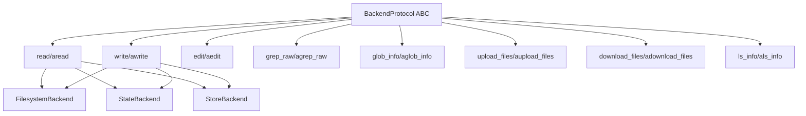
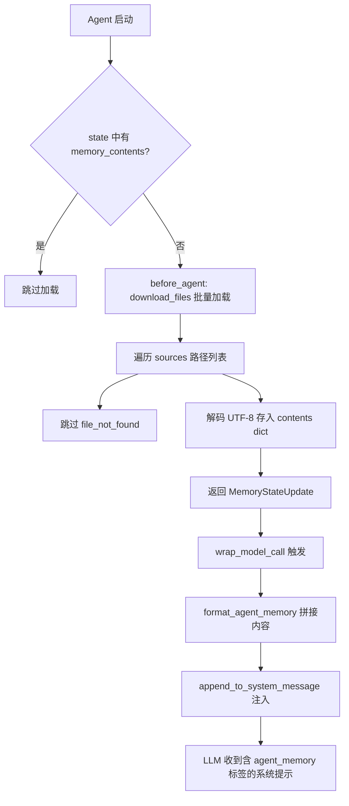
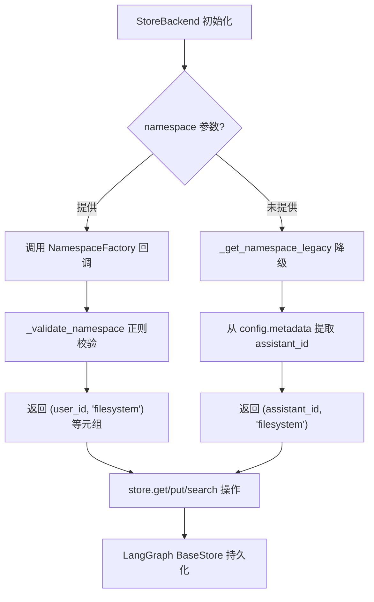

# PD-06.29 DeepAgents — 三后端可插拔记忆与中间件注入持久化

> 文档编号：PD-06.29
> 来源：DeepAgents `libs/deepagents/deepagents/middleware/memory.py`, `backends/store.py`, `backends/state.py`
> GitHub：https://github.com/langchain-ai/deepagents.git
> 问题域：PD-06 记忆持久化 Memory Persistence
> 状态：可复用方案

---

## 第 1 章 问题与动机

### 1.1 核心问题

Agent 系统需要在不同生命周期范围内持久化记忆：线程内临时状态（单次对话）、跨线程持久存储（跨会话）、以及本地文件系统直接读写（CLI 场景）。传统方案往往将存储后端硬编码，导致切换存储策略时需要大量重构。同时，记忆内容如何注入到 LLM 的系统提示中，以及 Agent 如何通过工具调用自主更新记忆，也是关键的工程问题。

DeepAgents 面临的具体挑战：
1. **多部署场景**：同一 Agent 代码需要在 CLI（文件系统）、Web 服务（LangGraph Store）、测试（内存状态）三种环境下运行
2. **记忆注入时机**：AGENTS.md 文件内容需要在每次 Agent 执行前加载，但不应重复加载
3. **记忆自主更新**：Agent 需要通过 `edit_file` 工具调用自主更新 AGENTS.md，形成学习闭环
4. **命名空间隔离**：多 Agent 共享同一 Store 时需要防止记忆交叉污染

### 1.2 DeepAgents 的解法概述

1. **三后端统一协议**：`BackendProtocol` 抽象基类定义 read/write/edit/grep/glob/upload/download 7 类操作，`FilesystemBackend`、`StateBackend`、`StoreBackend` 三个实现分别覆盖文件系统、线程内状态、跨线程持久化场景（`backends/protocol.py:167`）
2. **中间件注入模式**：`MemoryMiddleware` 在 `before_agent` 钩子中通过 `download_files` 批量加载 AGENTS.md 文件，在 `wrap_model_call` 中将内容注入系统提示的 `<agent_memory>` 标签（`middleware/memory.py:238-320`）
3. **SkillsMiddleware 渐进式披露**：技能文件通过相同的后端协议加载，仅在系统提示中展示元数据摘要，Agent 按需读取完整内容（`middleware/skills.py:603-835`）
4. **命名空间工厂**：`StoreBackend` 通过 `NamespaceFactory` 回调动态生成命名空间元组，支持 `(user_id, "filesystem")` 等多级隔离，并用正则校验防止通配符注入（`backends/store.py:49-94`）
5. **CompositeBackend 路由**：按路径前缀将操作路由到不同后端，如 `/memories/` 走 StoreBackend、`/temp/` 走 StateBackend（`backends/composite.py:1-18`）

### 1.3 设计思想

| 设计原则 | 具体实现 | 理由 | 替代方案 |
|----------|----------|------|----------|
| 协议驱动 | `BackendProtocol` ABC 定义 7 类操作 + async 对应方法 | 新后端只需实现协议即可接入，零修改上层代码 | 直接依赖具体类（耦合度高） |
| 中间件管道 | `before_agent` → `wrap_model_call` 两阶段注入 | 加载与注入解耦，支持跳过已加载状态 | 在 Agent 构造函数中硬编码加载逻辑 |
| 文件即记忆 | AGENTS.md 作为记忆载体，Agent 通过 edit_file 更新 | 人类可读可编辑，版本控制友好 | 数据库/向量库存储（对人类不透明） |
| 命名空间隔离 | `NamespaceFactory` 回调 + 正则校验 | 运行时动态决定隔离粒度，防注入 | 硬编码 tenant_id（不灵活） |
| 渐进式披露 | Skills 只展示 name+description，按需读取 SKILL.md | 节省 token，避免系统提示膨胀 | 全量加载所有技能内容（浪费 token） |

---

## 第 2 章 源码实现分析

### 2.1 架构概览

DeepAgents 的记忆持久化架构分为三层：后端协议层、中间件层、组合路由层。

```
┌─────────────────────────────────────────────────────────┐
│                    Agent Runtime                         │
│  ┌──────────────┐  ┌──────────────┐  ┌───────────────┐  │
│  │ MemoryMiddle │  │ SkillsMiddle │  │ SubAgentMiddle│  │
│  │    ware      │  │    ware      │  │    ware       │  │
│  └──────┬───────┘  └──────┬───────┘  └───────────────┘  │
│         │                 │                              │
│         ▼                 ▼                              │
│  ┌─────────────────────────────────┐                     │
│  │      BackendProtocol (ABC)      │                     │
│  │  read/write/edit/grep/glob/     │                     │
│  │  upload/download + async twins  │                     │
│  └──────┬──────────┬───────┬───────┘                     │
│         │          │       │                             │
│    ┌────▼───┐ ┌────▼──┐ ┌─▼──────────┐                  │
│    │Filesys │ │State  │ │Store       │                   │
│    │Backend │ │Backend│ │Backend     │                   │
│    │(磁盘)  │ │(内存) │ │(LangGraph) │                   │
│    └────────┘ └───────┘ └────────────┘                   │
│         ▲          ▲          ▲                          │
│         └──────────┼──────────┘                          │
│              ┌─────▼─────┐                               │
│              │Composite  │                               │
│              │Backend    │  路径前缀路由                   │
│              └───────────┘                               │
└─────────────────────────────────────────────────────────┘
```

### 2.2 核心实现

#### 2.2.1 BackendProtocol — 统一存储协议



对应源码 `libs/deepagents/deepagents/backends/protocol.py:167-417`：

```python
class BackendProtocol(abc.ABC):
    """Protocol for pluggable memory backends (single, unified).

    All file data is represented as dicts with the following structure:
    {
        "content": list[str], # Lines of text content
        "created_at": str, # ISO format timestamp
        "modified_at": str, # ISO format timestamp
    }
    """

    def read(self, file_path: str, offset: int = 0, limit: int = 2000) -> str:
        raise NotImplementedError

    async def aread(self, file_path: str, offset: int = 0, limit: int = 2000) -> str:
        return await asyncio.to_thread(self.read, file_path, offset, limit)

    def write(self, file_path: str, content: str) -> WriteResult:
        raise NotImplementedError

    def edit(self, file_path: str, old_string: str, new_string: str,
             replace_all: bool = False) -> EditResult:
        raise NotImplementedError

    def download_files(self, paths: list[str]) -> list[FileDownloadResponse]:
        raise NotImplementedError
```

关键设计：每个同步方法都有 `async` 对应版本，默认实现通过 `asyncio.to_thread` 桥接，子类可覆盖提供原生异步实现（如 `StoreBackend.aread` 使用 `store.aget`）。

#### 2.2.2 MemoryMiddleware — AGENTS.md 加载与注入



对应源码 `libs/deepagents/deepagents/middleware/memory.py:238-320`：

```python
class MemoryMiddleware(AgentMiddleware[MemoryState, ContextT, ResponseT]):
    state_schema = MemoryState

    def __init__(self, *, backend: BACKEND_TYPES, sources: list[str]) -> None:
        self._backend = backend
        self.sources = sources

    def before_agent(self, state, runtime, config):
        if "memory_contents" in state:
            return None  # 幂等：已加载则跳过
        backend = self._get_backend(state, runtime, config)
        contents: dict[str, str] = {}
        results = backend.download_files(list(self.sources))
        for path, response in zip(self.sources, results, strict=True):
            if response.error == "file_not_found":
                continue
            if response.content is not None:
                contents[path] = response.content.decode("utf-8")
        return MemoryStateUpdate(memory_contents=contents)

    def modify_request(self, request):
        contents = request.state.get("memory_contents", {})
        agent_memory = self._format_agent_memory(contents)
        new_system_message = append_to_system_message(
            request.system_message, agent_memory
        )
        return request.override(system_message=new_system_message)
```

注入的系统提示模板（`memory.py:97-156`）包含详细的 `<memory_guidelines>` 指导 Agent 何时更新记忆、何时不更新，以及通过 `edit_file` 工具写回 AGENTS.md 的示例。

#### 2.2.3 StoreBackend — 跨线程持久化与命名空间隔离



对应源码 `libs/deepagents/deepagents/backends/store.py:97-199`：

```python
class StoreBackend(BackendProtocol):
    """Uses LangGraph's Store for persistent, cross-conversation storage."""

    def __init__(self, runtime, *, namespace=None):
        self.runtime = runtime
        self._namespace = namespace

    def _get_namespace(self) -> tuple[str, ...]:
        if self._namespace is not None:
            state = getattr(self.runtime, "state", None)
            ctx = BackendContext(state=state, runtime=self.runtime)
            return _validate_namespace(self._namespace(ctx))
        return self._get_namespace_legacy()

    def _search_store_paginated(self, store, namespace, *,
                                 query=None, filter=None, page_size=100):
        all_items = []
        offset = 0
        while True:
            page_items = store.search(namespace, query=query,
                                       filter=filter, limit=page_size, offset=offset)
            if not page_items:
                break
            all_items.extend(page_items)
            if len(page_items) < page_size:
                break
            offset += page_size
        return all_items
```

命名空间校验（`store.py:53-94`）使用正则 `^[A-Za-z0-9\-_.@+:~]+$` 过滤每个组件，明确拒绝 `*`、`?`、`[`、`]` 等通配符字符，防止 glob 注入攻击。

### 2.3 实现细节

**StateBackend 的 files_update 模式**：StateBackend 不直接修改 LangGraph 状态（状态必须通过 Command 对象更新），而是在 `WriteResult`/`EditResult` 中返回 `files_update` 字典，由上层框架合并到状态中（`state.py:117-132`）。这是一个精巧的设计——后端不需要知道 LangGraph 的状态更新机制。

**后端工厂模式**：中间件接受 `BackendProtocol | Callable[[ToolRuntime], BackendProtocol]` 类型，对于需要运行时信息的后端（如 StateBackend 需要 `runtime.state`），传入工厂函数 `lambda rt: StateBackend(rt)`（`memory.py:194-216`）。

**PrivateStateAttr 标记**：`MemoryState.memory_contents` 和 `SkillsState.skills_metadata` 使用 `Annotated[..., PrivateStateAttr]` 标记，确保这些内部状态不会泄露到父 Agent 或最终输出中（`memory.py:80-88`）。

**分页搜索**：`StoreBackend._search_store_paginated` 自动处理 BaseStore 的分页限制，以 100 条为一页循环获取直到结果耗尽（`store.py:243-288`）。

---

## 第 3 章 迁移指南

### 3.1 迁移清单

**阶段 1：后端协议层（1 个文件）**
- [ ] 定义 `BackendProtocol` ABC，包含 read/write/edit/download_files 核心方法
- [ ] 定义 `WriteResult`、`EditResult`、`FileDownloadResponse` 数据类
- [ ] 每个同步方法提供 `asyncio.to_thread` 默认异步实现

**阶段 2：后端实现（按需选择）**
- [ ] `FilesystemBackend`：直接读写本地文件，适合 CLI 场景
- [ ] `StateBackend`：基于 LangGraph state dict，线程内临时存储
- [ ] `StoreBackend`：基于 LangGraph BaseStore，跨线程持久化
- [ ] `CompositeBackend`：路径前缀路由，组合多个后端

**阶段 3：中间件注入层**
- [ ] 实现 `MemoryMiddleware`，在 `before_agent` 中加载记忆文件
- [ ] 实现 `modify_request` 将记忆内容注入系统提示
- [ ] 设计 `<agent_memory>` + `<memory_guidelines>` 提示模板

**阶段 4：记忆自更新闭环**
- [ ] 确保 Agent 有 `edit_file` 工具可写回 AGENTS.md
- [ ] 在 memory_guidelines 中指导 Agent 何时更新/不更新记忆

### 3.2 适配代码模板

```python
"""可直接复用的三后端记忆中间件模板"""
import abc
import asyncio
from dataclasses import dataclass
from typing import Any, TypedDict


# === 后端协议 ===
@dataclass
class DownloadResponse:
    path: str
    content: bytes | None = None
    error: str | None = None


@dataclass
class WriteResult:
    error: str | None = None
    path: str | None = None


class BackendProtocol(abc.ABC):
    @abc.abstractmethod
    def read(self, path: str) -> str: ...

    @abc.abstractmethod
    def write(self, path: str, content: str) -> WriteResult: ...

    @abc.abstractmethod
    def download_files(self, paths: list[str]) -> list[DownloadResponse]: ...

    async def adownload_files(self, paths: list[str]) -> list[DownloadResponse]:
        return await asyncio.to_thread(self.download_files, paths)


# === 文件系统后端 ===
class FilesystemBackend(BackendProtocol):
    def __init__(self, root_dir: str = "."):
        self.root = root_dir

    def read(self, path: str) -> str:
        with open(f"{self.root}/{path}") as f:
            return f.read()

    def write(self, path: str, content: str) -> WriteResult:
        with open(f"{self.root}/{path}", "w") as f:
            f.write(content)
        return WriteResult(path=path)

    def download_files(self, paths: list[str]) -> list[DownloadResponse]:
        results = []
        for p in paths:
            try:
                content = self.read(p).encode("utf-8")
                results.append(DownloadResponse(path=p, content=content))
            except FileNotFoundError:
                results.append(DownloadResponse(path=p, error="file_not_found"))
        return results


# === 记忆中间件 ===
class MemoryMiddleware:
    """加载 AGENTS.md 并注入系统提示"""

    TEMPLATE = "<agent_memory>\n{memory}\n</agent_memory>"

    def __init__(self, backend: BackendProtocol, sources: list[str]):
        self.backend = backend
        self.sources = sources
        self._loaded: dict[str, str] = {}

    def load(self) -> dict[str, str]:
        """before_agent 阶段调用"""
        if self._loaded:
            return self._loaded
        results = self.backend.download_files(self.sources)
        for path, resp in zip(self.sources, results):
            if resp.error is None and resp.content:
                self._loaded[path] = resp.content.decode("utf-8")
        return self._loaded

    def inject(self, system_prompt: str) -> str:
        """wrap_model_call 阶段调用"""
        contents = self.load()
        if not contents:
            return system_prompt
        memory = "\n\n".join(
            f"{path}\n{text}" for path, text in contents.items()
        )
        return system_prompt + "\n\n" + self.TEMPLATE.format(memory=memory)


# === 使用示例 ===
backend = FilesystemBackend(root_dir="/workspace")
memory = MemoryMiddleware(
    backend=backend,
    sources=["~/.deepagents/AGENTS.md", "./.deepagents/AGENTS.md"],
)
system_prompt = memory.inject("You are a helpful assistant.")
```

### 3.3 适用场景

| 场景 | 适用度 | 说明 |
|------|--------|------|
| CLI 编码助手 | ⭐⭐⭐ | FilesystemBackend + AGENTS.md 是最自然的选择 |
| Web 多租户 Agent | ⭐⭐⭐ | StoreBackend + NamespaceFactory 提供租户隔离 |
| 测试环境 | ⭐⭐⭐ | StateBackend 纯内存，无副作用 |
| 混合存储需求 | ⭐⭐⭐ | CompositeBackend 按路径路由到不同后端 |
| 需要向量检索的记忆 | ⭐ | 当前方案是全文加载，不支持语义检索 |
| 高频写入场景 | ⭐⭐ | 文件级写入粒度较粗，不适合高频小更新 |

---

## 第 4 章 测试用例

```python
"""基于 DeepAgents 真实接口的测试用例"""
import pytest
from dataclasses import dataclass
from unittest.mock import MagicMock, patch


# === 测试 BackendProtocol 实现 ===

class TestFilesystemBackend:
    def test_download_existing_file(self, tmp_path):
        """正常路径：下载存在的文件"""
        (tmp_path / "AGENTS.md").write_text("# My Agent Memory")
        backend = FilesystemBackend(root_dir=str(tmp_path))
        results = backend.download_files(["AGENTS.md"])
        assert len(results) == 1
        assert results[0].error is None
        assert results[0].content == b"# My Agent Memory"

    def test_download_missing_file(self, tmp_path):
        """边界情况：文件不存在返回 file_not_found"""
        backend = FilesystemBackend(root_dir=str(tmp_path))
        results = backend.download_files(["nonexistent.md"])
        assert results[0].error == "file_not_found"
        assert results[0].content is None

    def test_write_prevents_overwrite(self, tmp_path):
        """防御性设计：已存在文件不允许 write"""
        (tmp_path / "existing.md").write_text("old")
        backend = FilesystemBackend(root_dir=str(tmp_path))
        result = backend.write("existing.md", "new")
        assert result.error is not None
        assert "already exists" in result.error


# === 测试 MemoryMiddleware ===

class TestMemoryMiddleware:
    def test_load_skips_missing_sources(self, tmp_path):
        """降级行为：缺失的 source 被跳过而非报错"""
        (tmp_path / "a.md").write_text("memory A")
        backend = FilesystemBackend(root_dir=str(tmp_path))
        mw = MemoryMiddleware(backend=backend, sources=["a.md", "missing.md"])
        contents = mw.load()
        assert "a.md" in contents
        assert "missing.md" not in contents

    def test_inject_formats_agent_memory_tag(self, tmp_path):
        """注入格式：包含 <agent_memory> 标签"""
        (tmp_path / "mem.md").write_text("remember this")
        backend = FilesystemBackend(root_dir=str(tmp_path))
        mw = MemoryMiddleware(backend=backend, sources=["mem.md"])
        result = mw.inject("base prompt")
        assert "<agent_memory>" in result
        assert "remember this" in result

    def test_idempotent_load(self, tmp_path):
        """幂等性：多次 load 不重复下载"""
        (tmp_path / "mem.md").write_text("data")
        backend = FilesystemBackend(root_dir=str(tmp_path))
        mw = MemoryMiddleware(backend=backend, sources=["mem.md"])
        first = mw.load()
        second = mw.load()
        assert first is second  # 同一对象引用


# === 测试命名空间校验 ===

class TestNamespaceValidation:
    def test_valid_namespace(self):
        """正常路径：合法命名空间通过校验"""
        from deepagents.backends.store import _validate_namespace
        result = _validate_namespace(("user-123", "filesystem"))
        assert result == ("user-123", "filesystem")

    def test_reject_wildcard_injection(self):
        """安全性：通配符字符被拒绝"""
        from deepagents.backends.store import _validate_namespace
        with pytest.raises(ValueError, match="disallowed characters"):
            _validate_namespace(("user*", "filesystem"))

    def test_reject_empty_namespace(self):
        """边界情况：空命名空间被拒绝"""
        from deepagents.backends.store import _validate_namespace
        with pytest.raises(ValueError, match="must not be empty"):
            _validate_namespace(())
```

---

## 第 5 章 跨域关联

| 关联域 | 关系类型 | 说明 |
|--------|----------|------|
| PD-01 上下文管理 | 协同 | MemoryMiddleware 注入的 AGENTS.md 内容占用上下文窗口，SummarizationMiddleware 负责压缩对话历史，两者共同管理 token 预算 |
| PD-04 工具系统 | 依赖 | Agent 通过 `edit_file` 工具写回 AGENTS.md 实现记忆自更新，工具系统是记忆闭环的关键路径 |
| PD-05 沙箱隔离 | 协同 | FilesystemBackend 的 `virtual_mode` 提供路径级隔离，SandboxBackendProtocol 扩展了 BackendProtocol 增加 `execute` 能力 |
| PD-09 Human-in-the-Loop | 协同 | memory_guidelines 中明确要求 Agent 在缺少上下文时主动询问用户，而非假设；HITL 中间件可审查 edit_file 操作 |
| PD-10 中间件管道 | 依赖 | MemoryMiddleware 和 SkillsMiddleware 都是 AgentMiddleware 子类，依赖中间件管道的 before_agent → wrap_model_call 生命周期 |
| PD-02 多 Agent 编排 | 协同 | StoreBackend 的 NamespaceFactory 支持 per-assistant 隔离，SubAgentMiddleware 可为子 Agent 配置独立的记忆后端 |

---

## 第 6 章 来源文件索引

| 文件 | 行范围 | 关键实现 |
|------|--------|----------|
| `libs/deepagents/deepagents/backends/protocol.py` | L167-L517 | BackendProtocol ABC + SandboxBackendProtocol + 数据类定义 |
| `libs/deepagents/deepagents/backends/store.py` | L40-L628 | StoreBackend 跨线程持久化 + NamespaceFactory + 分页搜索 |
| `libs/deepagents/deepagents/backends/state.py` | L28-L233 | StateBackend 线程内临时存储 + files_update 模式 |
| `libs/deepagents/deepagents/backends/filesystem.py` | L32-L725 | FilesystemBackend 文件系统读写 + virtual_mode + ripgrep 搜索 |
| `libs/deepagents/deepagents/backends/composite.py` | L1-L80 | CompositeBackend 路径前缀路由 |
| `libs/deepagents/deepagents/middleware/memory.py` | L80-L355 | MemoryMiddleware + MemoryState + MEMORY_SYSTEM_PROMPT 模板 |
| `libs/deepagents/deepagents/middleware/skills.py` | L134-L839 | SkillsMiddleware + SkillMetadata + 渐进式披露 |
| `libs/deepagents/deepagents/middleware/_utils.py` | L1-L24 | append_to_system_message 工具函数 |
| `libs/deepagents/deepagents/backends/__init__.py` | L1-L25 | 后端模块导出 |
| `libs/deepagents/deepagents/middleware/__init__.py` | L1-L19 | 中间件模块导出 |

---

## 第 7 章 横向对比维度

```json comparison_data
{
  "project": "DeepAgents",
  "dimensions": {
    "记忆结构": "AGENTS.md 纯 Markdown 文件，人类可读可编辑",
    "更新机制": "Agent 通过 edit_file 工具自主写回 AGENTS.md",
    "事实提取": "依赖 LLM 在 memory_guidelines 指导下自主判断",
    "存储方式": "三后端可插拔：文件系统/LangGraph State/LangGraph Store",
    "注入方式": "中间件 wrap_model_call 注入 <agent_memory> 标签到系统提示",
    "生命周期管理": "before_agent 幂等加载，PrivateStateAttr 防泄露",
    "存储后端委托": "BackendProtocol ABC + 工厂函数零配置适配宿主框架",
    "记忆检索": "全文加载注入，无语义检索，依赖 LLM 上下文理解",
    "模块化导入": "CompositeBackend 路径前缀路由组合多后端",
    "角色记忆隔离": "NamespaceFactory 动态生成命名空间元组实现 per-assistant 隔离",
    "记忆增长控制": "无自动控制，依赖人工编辑 AGENTS.md 或 Agent 自主精简",
    "并发安全": "StoreBackend 委托 LangGraph BaseStore 事务保证",
    "碰撞检测": "命名空间正则校验拒绝通配符字符防注入"
  }
}
```

### 域元数据补充

```json domain_metadata
{
  "solution_summary": "DeepAgents 通过 BackendProtocol 三后端可插拔协议 + MemoryMiddleware 中间件注入 AGENTS.md 到系统提示，Agent 通过 edit_file 工具自主更新记忆形成学习闭环",
  "description": "记忆后端的可插拔协议设计与中间件注入模式，支持文件/状态/存储三种生命周期",
  "sub_problems": [
    "记忆自更新闭环：Agent 如何通过工具调用自主判断并写回记忆文件",
    "渐进式技能披露：如何在系统提示中只展示技能摘要而非全量内容以节省 token",
    "后端工厂延迟绑定：需要运行时信息的后端如何通过工厂函数延迟初始化"
  ],
  "best_practices": [
    "文件即记忆：AGENTS.md 作为记忆载体，人类可读可编辑，版本控制友好",
    "幂等加载：before_agent 检查 state 中是否已有记忆内容，避免重复下载",
    "命名空间正则校验：拒绝通配符字符防止 glob 注入攻击"
  ]
}
```
