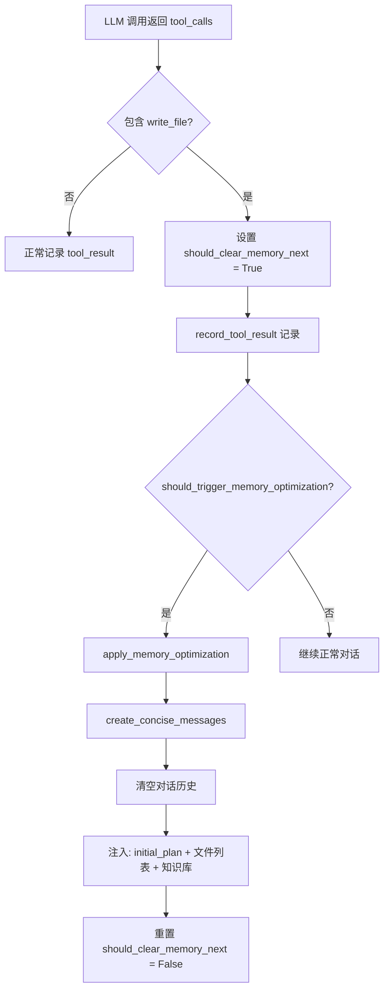
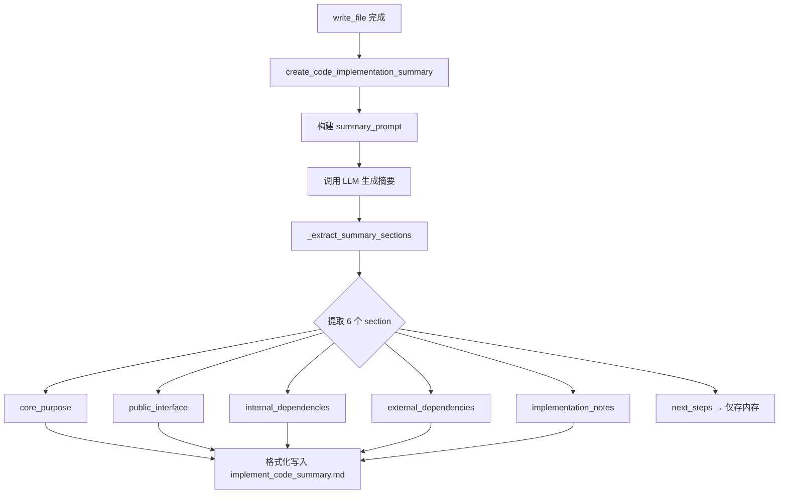
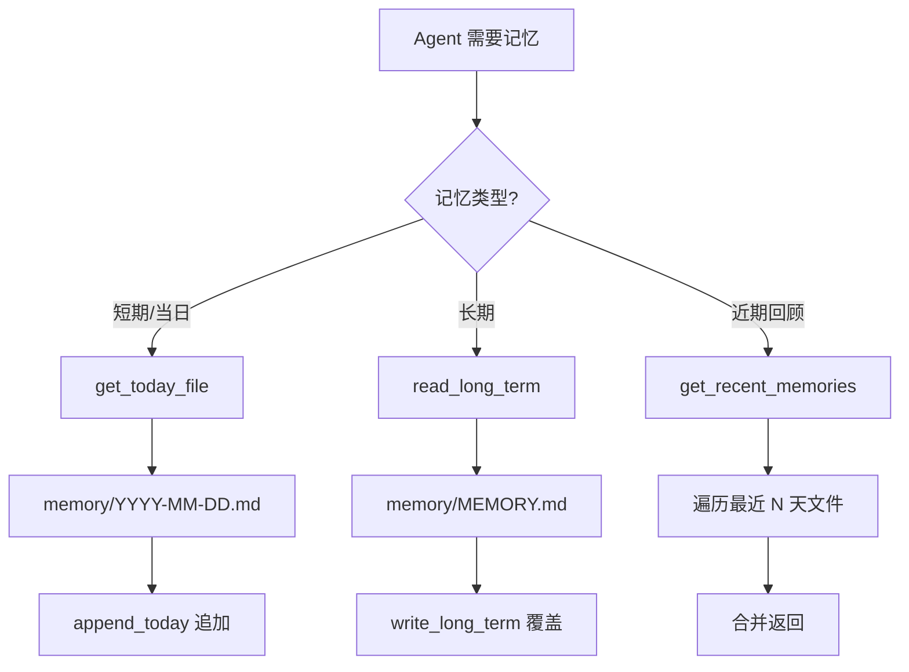
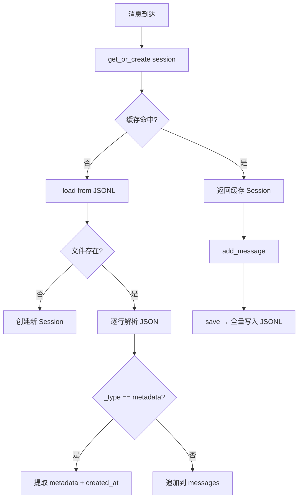

# PD-06.04 DeepCode — 双层记忆系统：代码摘要持久化 + 日志式会话管理

> 文档编号：PD-06.04
> 来源：DeepCode `workflows/agents/memory_agent_concise.py` `nanobot/nanobot/agent/memory.py` `nanobot/nanobot/session/manager.py`
> GitHub：https://github.com/HKUDS/DeepCode.git
> 问题域：PD-06 记忆持久化 Memory Persistence
> 状态：可复用方案

---

## 第 1 章 问题与动机

### 1.1 核心问题

在长时间运行的代码生成 Agent 工作流中，LLM 的上下文窗口是有限的。当 Agent 需要逐文件实现一个完整项目时（可能涉及数十个文件、上百轮迭代），对话历史会迅速膨胀，导致：

1. **上下文溢出**：对话历史超过模型窗口限制，早期关键信息被截断
2. **信息丢失**：已实现文件的接口签名、依赖关系在后续轮次中不可见
3. **重复实现**：Agent 忘记已完成的文件，重复生成相同代码
4. **跨会话断裂**：nanobot 聊天场景中，不同会话间无法共享上下文

DeepCode 面对的是一个典型的"长程代码生成"场景——从论文到完整代码实现，需要数十轮 LLM 调用。每轮生成一个文件后，之前的对话历史就成了负担而非资产。

### 1.2 DeepCode 的解法概述

DeepCode 实现了一个**双层记忆系统**，分别服务于两个不同的子系统：

1. **ConciseMemoryAgent（工作流层）**：面向代码生成工作流，核心策略是"write_file 触发清洗"——每次写入文件后，用 LLM 生成该文件的结构化摘要，追加到 `implement_code_summary.md`，然后清空对话历史，仅保留 system_prompt + initial_plan + 最新摘要（`memory_agent_concise.py:71-76`）
2. **MemoryStore + SessionManager（nanobot 层）**：面向聊天 Agent，MemoryStore 提供 daily notes + MEMORY.md 长期记忆，SessionManager 用 JSONL 格式持久化会话历史（`nanobot/nanobot/agent/memory.py:9` + `nanobot/nanobot/session/manager.py:58`）

两层记忆互不干扰，各自服务于不同的 Agent 运行模式。

### 1.3 设计思想

| 设计原则 | 具体实现 | 理由 | 替代方案 |
|----------|----------|------|----------|
| LLM 驱动摘要 | 每次 write_file 后调用 LLM 生成结构化摘要 | 人工摘要粒度不够，LLM 能提取接口签名和依赖关系 | 手动 add_fact / 正则提取 |
| 事件驱动清洗 | write_file 检测触发 memory optimization | 精确控制清洗时机，避免过早或过晚 | 固定轮次清洗 / token 计数触发 |
| 追加式持久化 | implement_code_summary.md 用 append 模式 | 保留完整实现历史，支持回溯 | 覆盖写入只保留最新 |
| 日期分片 | daily notes 按 YYYY-MM-DD.md 分文件 | 天然的时间索引，便于检索近期记忆 | 单文件追加 / 数据库 |
| JSONL 会话 | 每行一条 JSON 消息 | 流式追加友好，部分损坏不影响其他消息 | SQLite / JSON 数组 |
| 双层隔离 | 工作流记忆和聊天记忆完全独立 | 不同场景的记忆需求差异大 | 统一记忆层 |

---

## 第 2 章 源码实现分析

### 2.1 架构概览

DeepCode 的记忆系统分为两个独立子系统：

```
┌─────────────────────────────────────────────────────────────┐
│                    DeepCode 双层记忆架构                      │
├─────────────────────────────┬───────────────────────────────┤
│   工作流层 (Workflow)        │   聊天层 (Nanobot)             │
│                             │                               │
│  ConciseMemoryAgent         │  MemoryStore                  │
│  ├─ write_file 事件检测      │  ├─ daily notes (YYYY-MM-DD)  │
│  ├─ LLM 摘要生成            │  ├─ MEMORY.md 长期记忆         │
│  ├─ implement_code_summary  │  └─ get_recent_memories(7d)   │
│  └─ 对话历史清洗             │                               │
│                             │  SessionManager               │
│  read_code_mem 工具          │  ├─ JSONL 持久化              │
│  └─ 查询已实现文件摘要       │  ├─ 内存缓存                   │
│                             │  └─ channel:chat_id 索引       │
├─────────────────────────────┴───────────────────────────────┤
│                    文件系统存储                                │
│  {target_dir}/implement_code_summary.md                      │
│  {workspace}/memory/YYYY-MM-DD.md + MEMORY.md                │
│  ~/.nanobot/sessions/{key}.jsonl                             │
└─────────────────────────────────────────────────────────────┘
```

### 2.2 核心实现

#### 2.2.1 ConciseMemoryAgent：write_file 触发的记忆清洗



对应源码 `workflows/agents/memory_agent_concise.py:1497-1534`：

```python
def record_tool_result(
    self, tool_name: str, tool_input: Dict[str, Any], tool_result: Any
):
    # Detect write_file calls to trigger memory clearing
    if tool_name == "write_file":
        self.last_write_file_detected = True
        self.should_clear_memory_next = True

    # Only record specific tools that provide essential information
    essential_tools = [
        "read_code_mem",   # Read code summary
        "read_file",       # Read file contents
        "write_file",      # Write file contents
        "execute_python",  # Execute Python code
        "execute_bash",    # Execute bash commands
        "search_code",     # Search code patterns
        "search_reference_code",
        "get_file_structure",
    ]

    if tool_name in essential_tools:
        tool_record = {
            "tool_name": tool_name,
            "tool_input": tool_input,
            "tool_result": tool_result,
            "timestamp": time.time(),
        }
        self.current_round_tool_results.append(tool_record)
```

工作流主循环中的集成 `workflows/code_implementation_workflow.py:382-415`：

```python
# Record essential tool results in concise memory agent
for tool_call, tool_result in zip(response["tool_calls"], tool_results):
    memory_agent.record_tool_result(
        tool_name=tool_call["name"],
        tool_input=tool_call["input"],
        tool_result=tool_result.get("result"),
    )

# Apply memory optimization immediately after write_file detection
if memory_agent.should_trigger_memory_optimization(
    messages, code_agent.get_files_implemented_count()
):
    files_implemented_count = code_agent.get_files_implemented_count()
    current_system_message = code_agent.get_system_prompt()
    messages = memory_agent.apply_memory_optimization(
        current_system_message, messages, files_implemented_count
    )
```

#### 2.2.2 LLM 驱动的代码摘要生成



对应源码 `workflows/agents/memory_agent_concise.py:994-1061`：

```python
async def create_code_implementation_summary(
    self, client, client_type: str, file_path: str,
    implementation_content: str, files_implemented: int,
) -> str:
    # Record the file implementation first
    self.record_file_implementation(file_path, implementation_content)

    # Create prompt for LLM summary
    summary_prompt = self._create_code_summary_prompt(
        file_path, implementation_content, files_implemented
    )
    summary_messages = [{"role": "user", "content": summary_prompt}]

    # Get LLM-generated summary
    llm_response = await self._call_llm_for_summary(
        client, client_type, summary_messages
    )
    llm_summary = llm_response.get("content", "")

    # Extract different sections from LLM summary
    sections = self._extract_summary_sections(llm_summary)

    # Store Next Steps in temporary variable (not saved to file)
    self.current_next_steps = sections.get("next_steps", "")

    # Format and save to implement_code_summary.md (append mode)
    formatted_summary = self._format_code_implementation_summary(
        file_path, file_summary_content.strip(), files_implemented
    )
    await self._save_code_summary_to_file(formatted_summary, file_path)
    return formatted_summary
```

#### 2.2.3 MemoryStore：日期分片 + 长期记忆



对应源码 `nanobot/nanobot/agent/memory.py:9-110`：

```python
class MemoryStore:
    def __init__(self, workspace: Path):
        self.workspace = workspace
        self.memory_dir = ensure_dir(workspace / "memory")
        self.memory_file = self.memory_dir / "MEMORY.md"

    def get_today_file(self) -> Path:
        return self.memory_dir / f"{today_date()}.md"

    def append_today(self, content: str) -> None:
        today_file = self.get_today_file()
        if today_file.exists():
            existing = today_file.read_text(encoding="utf-8")
            content = existing + "\n" + content
        else:
            header = f"# {today_date()}\n\n"
            content = header + content
        today_file.write_text(content, encoding="utf-8")

    def get_recent_memories(self, days: int = 7) -> str:
        memories = []
        today = datetime.now().date()
        for i in range(days):
            date = today - timedelta(days=i)
            date_str = date.strftime("%Y-%m-%d")
            file_path = self.memory_dir / f"{date_str}.md"
            if file_path.exists():
                content = file_path.read_text(encoding="utf-8")
                memories.append(content)
        return "\n\n---\n\n".join(memories)
```

#### 2.2.4 SessionManager：JSONL 持久化



对应源码 `nanobot/nanobot/session/manager.py:58-155`：

```python
class SessionManager:
    def __init__(self, workspace: Path):
        self.workspace = workspace
        self.sessions_dir = ensure_dir(Path.home() / ".nanobot" / "sessions")
        self._cache: dict[str, Session] = {}

    def _load(self, key: str) -> Session | None:
        path = self._get_session_path(key)
        if not path.exists():
            return None
        messages = []
        metadata = {}
        created_at = None
        with open(path) as f:
            for line in f:
                line = line.strip()
                if not line:
                    continue
                data = json.loads(line)
                if data.get("_type") == "metadata":
                    metadata = data.get("metadata", {})
                    created_at = datetime.fromisoformat(data["created_at"]) if data.get("created_at") else None
                else:
                    messages.append(data)
        return Session(key=key, messages=messages, created_at=created_at or datetime.now(), metadata=metadata)

    def save(self, session: Session) -> None:
        path = self._get_session_path(session.key)
        with open(path, "w") as f:
            metadata_line = {
                "_type": "metadata",
                "created_at": session.created_at.isoformat(),
                "updated_at": session.updated_at.isoformat(),
                "metadata": session.metadata,
            }
            f.write(json.dumps(metadata_line) + "\n")
            for msg in session.messages:
                f.write(json.dumps(msg) + "\n")
        self._cache[session.key] = session
```

### 2.3 实现细节

**read_code_mem 工具**：ConciseMemoryAgent 通过 MCP 工具 `read_code_mem` 暴露摘要查询能力。LLM 在实现新文件前可调用此工具查询已实现文件的接口签名和依赖关系（`config/mcp_tool_definitions.py:89-105`）。

**文件追踪与去重**：ConciseMemoryAgent 维护 `all_files_list`（从计划或目录提取）和 `implemented_files`（已完成列表），通过模糊路径匹配（`get_unimplemented_files` 方法，`memory_agent_concise.py:1929-1995`）判断文件是否已实现，支持部分路径匹配和路径边界检查。

**Next Steps 分离存储**：LLM 生成的摘要中 `next_steps` 部分仅存储在内存变量 `self.current_next_steps` 中，不写入文件。这避免了持久化文件中包含过时的"下一步"建议（`memory_agent_concise.py:1036-1038`）。

**多 LLM 提供商支持**：`_call_llm_for_summary` 方法支持 Anthropic、OpenAI、Google 三种 LLM 客户端，通过 `client_type` 参数路由（`memory_agent_concise.py:1363-1475`）。


---

## 第 3 章 迁移指南

### 3.1 迁移清单

**阶段 1：基础记忆层（MemoryStore 模式）**
- [ ] 创建 `memory/` 目录结构
- [ ] 实现 MemoryStore 类：daily notes + 长期记忆
- [ ] 实现 `get_recent_memories(days)` 滑动窗口检索
- [ ] 集成到 Agent 的 system prompt 注入

**阶段 2：会话持久化（SessionManager 模式）**
- [ ] 定义 Session dataclass（key, messages, metadata）
- [ ] 实现 JSONL 读写（metadata 行 + 消息行）
- [ ] 添加内存缓存层
- [ ] 实现 `get_history(max_messages)` 截断

**阶段 3：工作流记忆（ConciseMemoryAgent 模式）**
- [ ] 实现事件驱动的记忆清洗（write_file 触发）
- [ ] 集成 LLM 摘要生成（结构化 prompt）
- [ ] 实现 `implement_code_summary.md` 追加写入
- [ ] 实现 `read_code_mem` 工具供 LLM 查询
- [ ] 实现文件追踪（all_files_list vs implemented_files）

### 3.2 适配代码模板

#### 模板 1：日期分片记忆存储

```python
from datetime import datetime, timedelta
from pathlib import Path


class DailyMemoryStore:
    """日期分片记忆存储 — 移植自 DeepCode MemoryStore"""

    def __init__(self, workspace: Path):
        self.memory_dir = workspace / "memory"
        self.memory_dir.mkdir(parents=True, exist_ok=True)
        self.long_term_file = self.memory_dir / "MEMORY.md"

    def _today_file(self) -> Path:
        return self.memory_dir / f"{datetime.now().strftime('%Y-%m-%d')}.md"

    def append_today(self, content: str) -> None:
        """追加当日记忆"""
        today = self._today_file()
        if today.exists():
            existing = today.read_text(encoding="utf-8")
            today.write_text(existing + "\n" + content, encoding="utf-8")
        else:
            header = f"# {datetime.now().strftime('%Y-%m-%d')}\n\n"
            today.write_text(header + content, encoding="utf-8")

    def get_recent(self, days: int = 7) -> str:
        """获取最近 N 天记忆"""
        parts = []
        today = datetime.now().date()
        for i in range(days):
            f = self.memory_dir / f"{(today - timedelta(days=i)).strftime('%Y-%m-%d')}.md"
            if f.exists():
                parts.append(f.read_text(encoding="utf-8"))
        return "\n\n---\n\n".join(parts)

    def read_long_term(self) -> str:
        return self.long_term_file.read_text(encoding="utf-8") if self.long_term_file.exists() else ""

    def write_long_term(self, content: str) -> None:
        self.long_term_file.write_text(content, encoding="utf-8")

    def get_context(self) -> str:
        """获取完整记忆上下文（长期 + 当日）"""
        parts = []
        lt = self.read_long_term()
        if lt:
            parts.append(f"## Long-term Memory\n{lt}")
        today = self._today_file()
        if today.exists():
            parts.append(f"## Today\n{today.read_text(encoding='utf-8')}")
        return "\n\n".join(parts)
```

#### 模板 2：事件驱动记忆清洗器

```python
from typing import Any


class EventDrivenMemoryCleaner:
    """事件驱动记忆清洗 — 移植自 DeepCode ConciseMemoryAgent"""

    def __init__(self, initial_context: str, summary_file: str):
        self.initial_context = initial_context
        self.summary_file = summary_file
        self._should_clear = False
        self._implemented = []

    def on_tool_call(self, tool_name: str, tool_input: dict, tool_result: Any) -> None:
        """记录工具调用，检测触发事件"""
        if tool_name == "write_file":
            self._should_clear = True
            file_path = tool_input.get("file_path", "")
            if file_path and file_path not in self._implemented:
                self._implemented.append(file_path)

    def should_optimize(self) -> bool:
        return self._should_clear

    def optimize(self, messages: list[dict], knowledge_base: str) -> list[dict]:
        """清洗对话历史，注入精简上下文"""
        if not self._should_clear:
            return messages

        self._should_clear = False
        return [
            {"role": "user", "content": (
                f"**Plan:**\n{self.initial_context}\n\n"
                f"**Implemented:** {', '.join(self._implemented)}\n\n"
                f"**Knowledge Base:**\n{knowledge_base}\n\n"
                "Continue implementing the next file."
            )}
        ]

    def append_summary(self, file_path: str, summary: str) -> None:
        """追加摘要到持久化文件"""
        with open(self.summary_file, "a", encoding="utf-8") as f:
            f.write(f"\n{'=' * 60}\n## {file_path}\n{'=' * 60}\n\n{summary}\n\n")
```

### 3.3 适用场景

| 场景 | 适用度 | 说明 |
|------|--------|------|
| 长程代码生成（数十文件） | ⭐⭐⭐ | ConciseMemoryAgent 的核心场景，write_file 触发清洗最有效 |
| 聊天 Agent 跨会话记忆 | ⭐⭐⭐ | MemoryStore + SessionManager 直接适用 |
| 单文件代码修改 | ⭐ | 无需记忆清洗，普通对话即可 |
| 多 Agent 协作 | ⭐⭐ | 需要扩展为共享记忆，当前方案是单 Agent 设计 |
| RAG 知识库构建 | ⭐⭐ | 日期分片可作为文档索引的补充 |

---

## 第 4 章 测试用例

```python
import json
import tempfile
from datetime import datetime, timedelta
from pathlib import Path
from unittest.mock import AsyncMock, MagicMock

import pytest


class TestMemoryStore:
    """测试 MemoryStore 日期分片记忆"""

    def setup_method(self):
        self.tmpdir = Path(tempfile.mkdtemp())
        # 内联 MemoryStore 逻辑以脱离项目依赖
        self.memory_dir = self.tmpdir / "memory"
        self.memory_dir.mkdir(parents=True, exist_ok=True)
        self.memory_file = self.memory_dir / "MEMORY.md"

    def _today_file(self) -> Path:
        return self.memory_dir / f"{datetime.now().strftime('%Y-%m-%d')}.md"

    def test_append_today_creates_file(self):
        """首次追加应创建带日期头的文件"""
        today = self._today_file()
        assert not today.exists()
        header = f"# {datetime.now().strftime('%Y-%m-%d')}\n\n"
        today.write_text(header + "first note", encoding="utf-8")
        assert today.exists()
        content = today.read_text(encoding="utf-8")
        assert "first note" in content
        assert datetime.now().strftime("%Y-%m-%d") in content

    def test_append_today_accumulates(self):
        """多次追加应累积内容"""
        today = self._today_file()
        today.write_text("note1", encoding="utf-8")
        existing = today.read_text(encoding="utf-8")
        today.write_text(existing + "\nnote2", encoding="utf-8")
        content = today.read_text(encoding="utf-8")
        assert "note1" in content
        assert "note2" in content

    def test_long_term_read_write(self):
        """长期记忆读写"""
        assert not self.memory_file.exists()
        self.memory_file.write_text("long term fact", encoding="utf-8")
        assert self.memory_file.read_text(encoding="utf-8") == "long term fact"

    def test_recent_memories_window(self):
        """滑动窗口应只返回指定天数内的记忆"""
        today = datetime.now().date()
        for i in range(10):
            date = today - timedelta(days=i)
            f = self.memory_dir / f"{date.strftime('%Y-%m-%d')}.md"
            f.write_text(f"day-{i}", encoding="utf-8")

        # 只取最近 3 天
        parts = []
        for i in range(3):
            date = today - timedelta(days=i)
            f = self.memory_dir / f"{date.strftime('%Y-%m-%d')}.md"
            if f.exists():
                parts.append(f.read_text(encoding="utf-8"))
        result = "\n---\n".join(parts)
        assert "day-0" in result
        assert "day-2" in result
        assert "day-5" not in result


class TestSessionManager:
    """测试 SessionManager JSONL 持久化"""

    def setup_method(self):
        self.tmpdir = Path(tempfile.mkdtemp())
        self.sessions_dir = self.tmpdir / "sessions"
        self.sessions_dir.mkdir(parents=True, exist_ok=True)

    def _session_path(self, key: str) -> Path:
        safe_key = key.replace(":", "_")
        return self.sessions_dir / f"{safe_key}.jsonl"

    def test_save_and_load_session(self):
        """保存后应能完整加载"""
        path = self._session_path("telegram:123")
        messages = [
            {"role": "user", "content": "hello", "timestamp": datetime.now().isoformat()},
            {"role": "assistant", "content": "hi", "timestamp": datetime.now().isoformat()},
        ]
        with open(path, "w") as f:
            meta = {"_type": "metadata", "created_at": datetime.now().isoformat(),
                    "updated_at": datetime.now().isoformat(), "metadata": {}}
            f.write(json.dumps(meta) + "\n")
            for msg in messages:
                f.write(json.dumps(msg) + "\n")

        loaded_messages = []
        with open(path) as f:
            for line in f:
                data = json.loads(line.strip())
                if data.get("_type") != "metadata":
                    loaded_messages.append(data)
        assert len(loaded_messages) == 2
        assert loaded_messages[0]["content"] == "hello"

    def test_get_history_truncation(self):
        """get_history 应截断到 max_messages"""
        messages = [{"role": "user", "content": f"msg-{i}"} for i in range(100)]
        max_messages = 10
        recent = messages[-max_messages:]
        assert len(recent) == 10
        assert recent[0]["content"] == "msg-90"

    def test_delete_session(self):
        """删除会话应移除文件"""
        path = self._session_path("test:456")
        path.write_text('{"_type":"metadata"}\n')
        assert path.exists()
        path.unlink()
        assert not path.exists()


class TestConciseMemoryOptimization:
    """测试 ConciseMemoryAgent 记忆清洗逻辑"""

    def test_write_file_triggers_clear(self):
        """write_file 调用应触发记忆清洗标志"""
        should_clear = False
        last_write_detected = False

        # Simulate record_tool_result
        tool_name = "write_file"
        if tool_name == "write_file":
            last_write_detected = True
            should_clear = True

        assert last_write_detected
        assert should_clear

    def test_non_write_tool_no_trigger(self):
        """非 write_file 工具不应触发清洗"""
        should_clear = False
        for tool in ["read_file", "execute_python", "search_code"]:
            if tool == "write_file":
                should_clear = True
        assert not should_clear

    def test_summary_append_mode(self):
        """摘要应以追加模式写入"""
        tmpfile = Path(tempfile.mktemp(suffix=".md"))
        for i in range(3):
            with open(tmpfile, "a", encoding="utf-8") as f:
                f.write(f"\n{'=' * 40}\n## File {i}\n{'=' * 40}\n\nSummary {i}\n")
        content = tmpfile.read_text(encoding="utf-8")
        assert "File 0" in content
        assert "File 2" in content
        assert content.count("=" * 40) == 6  # 3 files × 2 separators
        tmpfile.unlink()

    def test_unimplemented_files_tracking(self):
        """未实现文件追踪应正确过滤已实现文件"""
        all_files = ["src/a.py", "src/b.py", "src/c.py", "src/d.py"]
        implemented = ["src/a.py", "src/c.py"]
        unimplemented = [f for f in all_files if f not in implemented]
        assert unimplemented == ["src/b.py", "src/d.py"]
```


---

## 第 5 章 跨域关联

| 关联域 | 关系类型 | 说明 |
|--------|----------|------|
| PD-01 上下文管理 | 强依赖 | ConciseMemoryAgent 的核心目的就是管理上下文窗口——write_file 触发清洗本质上是一种上下文压缩策略 |
| PD-03 容错与重试 | 协同 | `_call_llm_for_summary` 中 OpenAI 客户端有 max_tokens → max_completion_tokens 的降级重试（`memory_agent_concise.py:1401-1417`） |
| PD-04 工具系统 | 协同 | `read_code_mem` 作为 MCP 工具暴露给 LLM，是记忆系统的查询接口（`config/mcp_tool_definitions.py:89-105`） |
| PD-07 质量检查 | 协同 | 摘要中的 `public_interface` 和 `internal_dependencies` 可用于后续文件实现的依赖验证 |
| PD-11 可观测性 | 协同 | `get_memory_statistics` 方法提供完整的记忆系统运行指标，包括压缩率、文件进度等（`memory_agent_concise.py:1867-1897`） |

---

## 第 6 章 来源文件索引

| 文件 | 行范围 | 关键实现 |
|------|--------|----------|
| `workflows/agents/memory_agent_concise.py` | L27-L42 | ConciseMemoryAgent 类定义与核心哲学 |
| `workflows/agents/memory_agent_concise.py` | L71-L76 | write_file 触发标志位 |
| `workflows/agents/memory_agent_concise.py` | L994-L1061 | LLM 驱动的代码摘要生成 |
| `workflows/agents/memory_agent_concise.py` | L1165-L1240 | 摘要 section 提取器 |
| `workflows/agents/memory_agent_concise.py` | L1322-L1361 | implement_code_summary.md 追加写入 |
| `workflows/agents/memory_agent_concise.py` | L1497-L1534 | 工具调用记录与 write_file 检测 |
| `workflows/agents/memory_agent_concise.py` | L1546-L1679 | create_concise_messages 清洗逻辑 |
| `workflows/agents/memory_agent_concise.py` | L1681-L1704 | 知识库读取 |
| `workflows/agents/memory_agent_concise.py` | L1929-L1995 | 未实现文件模糊匹配 |
| `nanobot/nanobot/agent/memory.py` | L9-L110 | MemoryStore 完整实现 |
| `nanobot/nanobot/session/manager.py` | L14-L56 | Session dataclass 定义 |
| `nanobot/nanobot/session/manager.py` | L58-L155 | SessionManager JSONL 持久化 |
| `nanobot/nanobot/utils/helpers.py` | L7-L10 | ensure_dir 工具函数 |
| `nanobot/nanobot/utils/helpers.py` | L52-L54 | today_date 日期格式化 |
| `config/mcp_tool_definitions.py` | L89-L105 | read_code_mem MCP 工具定义 |
| `workflows/code_implementation_workflow.py` | L319-L325 | ConciseMemoryAgent 初始化 |
| `workflows/code_implementation_workflow.py` | L382-L415 | 工作流主循环中的记忆优化集成 |

---

## 第 7 章 横向对比维度

> **重要：** 本章用于自动填充 Butcher Wiki 的横向对比表。

```json comparison_data
{
  "project": "DeepCode",
  "dimensions": {
    "记忆结构": "双层：ConciseMemoryAgent（工作流摘要）+ MemoryStore（daily notes + MEMORY.md）",
    "更新机制": "事件驱动：write_file 工具调用触发清洗 + LLM 摘要生成",
    "事实提取": "LLM 结构化摘要：6 section（core_purpose/public_interface/dependencies/notes/next_steps）",
    "存储方式": "Markdown 追加（implement_code_summary.md）+ 日期分片 MD + JSONL 会话",
    "注入方式": "清洗后注入 initial_plan + 文件列表 + 知识库；read_code_mem MCP 工具按需查询",
    "循环检测": "文件追踪去重：all_files_list vs implemented_files 模糊路径匹配",
    "成本追踪": "get_memory_statistics 提供压缩率和文件进度指标",
    "多提供商摘要": "摘要生成支持 Anthropic/OpenAI/Google 三种 LLM 客户端路由"
  }
}
```

### 域元数据补充

```json domain_metadata
{
  "solution_summary": "DeepCode 用 write_file 事件驱动的 ConciseMemoryAgent 清洗对话历史，LLM 生成 6-section 结构化摘要追加到 implement_code_summary.md，配合 MemoryStore 日期分片和 JSONL 会话持久化",
  "description": "长程代码生成场景下的事件驱动记忆清洗与结构化摘要持久化",
  "sub_problems": [
    "摘要结构化：如何将代码实现摘要拆分为可查询的结构化 section",
    "文件进度追踪：在记忆清洗后如何准确追踪已实现/未实现文件列表"
  ],
  "best_practices": [
    "Next Steps 与持久化分离：LLM 生成的 next_steps 仅存内存不写文件，避免过时建议污染知识库",
    "事件驱动优于轮次驱动：以 write_file 调用而非固定轮次触发记忆清洗，精确匹配实际需要",
    "模糊路径匹配追踪文件：支持部分路径匹配和路径边界检查，容忍 LLM 生成的路径不一致"
  ]
}
```
