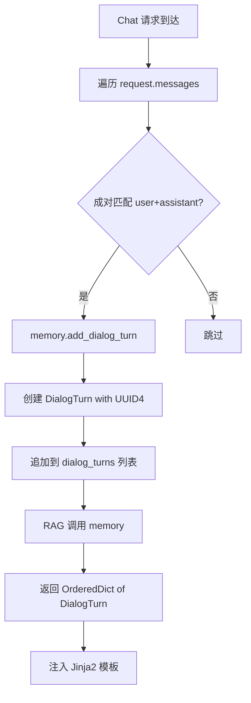
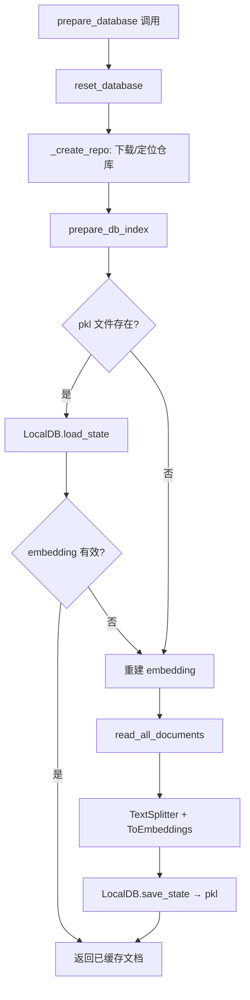

# PD-06.06 DeepWiki — 三层记忆持久化与对话历史管理

> 文档编号：PD-06.06
> 来源：DeepWiki `api/rag.py` `api/data_pipeline.py` `api/api.py`
> GitHub：https://github.com/AsyncFuncAI/deepwiki-open.git
> 问题域：PD-06 记忆持久化 Memory Persistence
> 状态：可复用方案

---

## 第 1 章 问题与动机

### 1.1 核心问题

RAG 系统需要在多轮对话中保持上下文连贯性，同时将仓库文档的 embedding 持久化以避免重复计算。DeepWiki 面临三个层次的记忆需求：

1. **对话记忆**：用户在同一会话中的多轮问答需要上下文保持，否则每次提问都是"失忆"状态
2. **文档索引持久化**：对一个仓库的文档进行 embedding 计算成本高昂（尤其大仓库），需要将结果缓存到磁盘
3. **Wiki 缓存**：生成的 Wiki 结构和页面内容需要持久化，避免重复生成

这三层记忆的生命周期、存储介质、失效策略各不相同，需要分层设计。

### 1.2 DeepWiki 的解法概述

DeepWiki 采用**三层分离**的记忆架构：

1. **L1 对话记忆**（进程内）：`Memory` 类管理 `DialogTurn` 列表，纯内存存储，随 RAG 实例生命周期存在（`api/rag.py:51-141`）
2. **L2 文档索引**（pkl 文件）：`DatabaseManager` 使用 adalflow `LocalDB` 将 split+embed 后的文档序列化为 pickle 文件，路径 `~/.adalflow/databases/{repo}.pkl`（`api/data_pipeline.py:712-913`）
3. **L3 Wiki 缓存**（JSON 文件）：生成的 Wiki 结构以 JSON 存储在 `~/.adalflow/wikicache/` 目录，按 `{type}_{owner}_{repo}_{lang}` 命名（`api/api.py:405-457`）

### 1.3 设计思想

| 设计原则 | 具体实现 | 理由 | 替代方案 |
|----------|----------|------|----------|
| 分层存储 | L1 内存 / L2 pkl / L3 JSON | 不同数据的访问频率和生命周期不同 | 统一用数据库（过重） |
| 惰性加载 | `prepare_db_index` 先检查 pkl 是否存在 | 避免重复 embedding 计算 | 每次都重新计算（浪费） |
| 客户端驱动历史 | 前端发送完整 messages 数组重建对话 | 服务端无状态，水平扩展简单 | 服务端维护 session（有状态） |
| 文件系统即数据库 | pkl + JSON 文件，无外部依赖 | 部署简单，单机场景足够 | Redis/PostgreSQL（运维成本） |
| 防御性编程 | Memory 类多处 try-except + 自动恢复 | adalflow 底层 Conversation 类有 bug | 信任框架不做保护（会崩溃） |

---

## 第 2 章 源码实现分析

### 2.1 架构概览

DeepWiki 的记忆系统由三个独立层组成，各层之间无直接依赖：

```
┌─────────────────────────────────────────────────────────┐
│                    Chat Endpoint                         │
│         (simple_chat.py / websocket_wiki.py)             │
│                                                          │
│  request.messages[] ──→ memory.add_dialog_turn()         │
│  memory() ──→ conversation_history ──→ LLM prompt        │
├─────────────────────────────────────────────────────────┤
│  L1: Memory (进程内)          api/rag.py:51-141          │
│  ┌──────────────────────────────────────────────┐       │
│  │ CustomConversation                            │       │
│  │   dialog_turns: List[DialogTurn]              │       │
│  │     ├─ id: UUID4                              │       │
│  │     ├─ user_query: UserQuery                  │       │
│  │     └─ assistant_response: AssistantResponse   │       │
│  └──────────────────────────────────────────────┘       │
├─────────────────────────────────────────────────────────┤
│  L2: DatabaseManager (pkl)    api/data_pipeline.py       │
│  ┌──────────────────────────────────────────────┐       │
│  │ LocalDB (adalflow)                            │       │
│  │   ~/.adalflow/databases/{repo}.pkl            │       │
│  │   Documents + Embeddings (FAISS-ready)        │       │
│  └──────────────────────────────────────────────┘       │
├─────────────────────────────────────────────────────────┤
│  L3: WikiCache (JSON)         api/api.py:405-457         │
│  ┌──────────────────────────────────────────────┐       │
│  │ ~/.adalflow/wikicache/                        │       │
│  │   deepwiki_cache_{type}_{owner}_{repo}_{lang} │       │
│  │   WikiStructure + GeneratedPages              │       │
│  └──────────────────────────────────────────────┘       │
└─────────────────────────────────────────────────────────┘
```

### 2.2 核心实现

#### 2.2.1 L1 对话记忆：Memory 类



对应源码 `api/rag.py:51-141`：

```python
class Memory(adal.core.component.DataComponent):
    """Simple conversation management with a list of dialog turns."""

    def __init__(self):
        super().__init__()
        self.current_conversation = CustomConversation()

    def call(self) -> Dict:
        """Return the conversation history as a dictionary."""
        all_dialog_turns = {}
        try:
            if hasattr(self.current_conversation, 'dialog_turns'):
                if self.current_conversation.dialog_turns:
                    for i, turn in enumerate(self.current_conversation.dialog_turns):
                        if hasattr(turn, 'id') and turn.id is not None:
                            all_dialog_turns[turn.id] = turn
        except Exception as e:
            logger.error(f"Error accessing dialog turns: {str(e)}")
            try:
                self.current_conversation = CustomConversation()
            except Exception as e2:
                logger.error(f"Failed to recover: {str(e2)}")
        return all_dialog_turns

    def add_dialog_turn(self, user_query: str, assistant_response: str) -> bool:
        dialog_turn = DialogTurn(
            id=str(uuid4()),
            user_query=UserQuery(query_str=user_query),
            assistant_response=AssistantResponse(response_str=assistant_response),
        )
        self.current_conversation.dialog_turns.append(dialog_turn)
        return True
```

客户端驱动的历史重建（`api/simple_chat.py:139-149`）：

```python
# Process previous messages to build conversation history
for i in range(0, len(request.messages) - 1, 2):
    if i + 1 < len(request.messages):
        user_msg = request.messages[i]
        assistant_msg = request.messages[i + 1]
        if user_msg.role == "user" and assistant_msg.role == "assistant":
            request_rag.memory.add_dialog_turn(
                user_query=user_msg.content,
                assistant_response=assistant_msg.content
            )
```

对话历史通过 Jinja2 模板注入 LLM prompt（`api/prompts.py:31-44`）：

```python
RAG_TEMPLATE = r"""<START_OF_SYS_PROMPT>
{system_prompt}
{output_format_str}
<END_OF_SYS_PROMPT>
{# OrderedDict of DialogTurn #}

<START_OF_CONVERSATION_HISTORY>

{{key}}.
User: {{dialog_turn.user_query.query_str}}
You: {{dialog_turn.assistant_response.response_str}}

<END_OF_CONVERSATION_HISTORY>

```

#### 2.2.2 L2 文档索引持久化：DatabaseManager



对应源码 `api/data_pipeline.py:831-913`：

```python
def prepare_db_index(self, embedder_type=None, ...) -> List[Document]:
    # check the database
    if self.repo_paths and os.path.exists(self.repo_paths["save_db_file"]):
        logger.info("Loading existing database...")
        try:
            self.db = LocalDB.load_state(self.repo_paths["save_db_file"])
            documents = self.db.get_transformed_data(key="split_and_embed")
            if documents:
                lengths = [_embedding_vector_length(doc) for doc in documents]
                non_empty = sum(1 for n in lengths if n > 0)
                if non_empty == 0:
                    logger.warning("Existing database contains no usable embeddings. Rebuilding...")
                else:
                    return documents  # 命中缓存，直接返回
        except Exception as e:
            logger.error(f"Error loading existing database: {e}")

    # prepare the database（缓存未命中）
    logger.info("Creating new database...")
    documents = read_all_documents(self.repo_paths["save_repo_dir"], ...)
    self.db = transform_documents_and_save_to_db(
        documents, self.repo_paths["save_db_file"], embedder_type=embedder_type
    )
    return self.db.get_transformed_data(key="split_and_embed")
```

存储路径构建（`api/data_pipeline.py:795-825`）：

```python
root_path = get_adalflow_default_root_path()  # ~/.adalflow
save_repo_dir = os.path.join(root_path, "repos", repo_name)
save_db_file = os.path.join(root_path, "databases", f"{repo_name}.pkl")
self.repo_paths = {
    "save_repo_dir": save_repo_dir,
    "save_db_file": save_db_file,
}
```

### 2.3 实现细节

#### Wiki 缓存层（L3）

Wiki 缓存使用简单的 JSON 文件存储，按 `{type}_{owner}_{repo}_{lang}` 维度隔离（`api/api.py:405-457`）：

```python
WIKI_CACHE_DIR = os.path.join(get_adalflow_default_root_path(), "wikicache")

def get_wiki_cache_path(owner, repo, repo_type, language) -> str:
    filename = f"deepwiki_cache_{repo_type}_{owner}_{repo}_{language}.json"
    return os.path.join(WIKI_CACHE_DIR, filename)

async def save_wiki_cache(data: WikiCacheRequest) -> bool:
    cache_path = get_wiki_cache_path(...)
    with open(cache_path, 'w', encoding='utf-8') as f:
        json.dump(payload.model_dump(), f, indent=2)
    return True
```

Wiki 缓存支持 CRUD 操作：GET 读取、POST 写入、DELETE 删除，并支持按语言维度隔离。

#### 数据转换管道

文档从原始文件到可检索 embedding 的完整管道（`api/data_pipeline.py:382-450`）：

```python
def prepare_data_pipeline(embedder_type=None):
    splitter = TextSplitter(**configs["text_splitter"])
    embedder = get_embedder(embedder_type=embedder_type)
    if embedder_type == 'ollama':
        embedder_transformer = OllamaDocumentProcessor(embedder=embedder)
    else:
        embedder_transformer = ToEmbeddings(embedder=embedder, batch_size=batch_size)
    data_transformer = adal.Sequential(splitter, embedder_transformer)
    return data_transformer

def transform_documents_and_save_to_db(documents, db_path, embedder_type=None):
    data_transformer = prepare_data_pipeline(embedder_type)
    db = LocalDB()
    db.register_transformer(transformer=data_transformer, key="split_and_embed")
    db.load(documents)
    db.transform(key="split_and_embed")
    db.save_state(filepath=db_path)  # 序列化为 pkl
    return db
```

---

## 第 3 章 迁移指南

### 3.1 迁移清单

**阶段 1：对话记忆（L1）**
- [ ] 定义 `DialogTurn` 数据类（user_query + assistant_response + id）
- [ ] 实现 `Memory` 类，管理 dialog_turns 列表
- [ ] 在 chat endpoint 中从 request.messages 重建对话历史
- [ ] 将对话历史注入 LLM prompt 模板

**阶段 2：文档索引持久化（L2）**
- [ ] 选择 embedding 模型和向量存储方案
- [ ] 实现文档读取 → 分片 → embedding 管道
- [ ] 实现 pkl/sqlite 持久化，支持缓存命中检查
- [ ] 添加 embedding 维度一致性校验

**阶段 3：结果缓存（L3）**
- [ ] 设计缓存键命名规则（按项目+语言等维度）
- [ ] 实现 JSON 文件读写 + CRUD API
- [ ] 添加缓存失效/删除机制

### 3.2 适配代码模板

以下是一个可直接复用的三层记忆系统骨架：

```python
"""三层记忆系统 — 从 DeepWiki 提炼的可复用模板"""
import os
import json
import pickle
from dataclasses import dataclass, field
from typing import Dict, List, Optional
from uuid import uuid4

# ── L1: 对话记忆 ──────────────────────────────────────

@dataclass
class DialogTurn:
    id: str
    user_query: str
    assistant_response: str

class ConversationMemory:
    """进程内对话记忆，随请求生命周期存在。"""

    def __init__(self):
        self.dialog_turns: List[DialogTurn] = []

    def add_turn(self, user_query: str, assistant_response: str) -> str:
        turn = DialogTurn(id=str(uuid4()), user_query=user_query, assistant_response=assistant_response)
        self.dialog_turns.append(turn)
        return turn.id

    def get_history(self) -> List[Dict]:
        return [{"user": t.user_query, "assistant": t.assistant_response} for t in self.dialog_turns]

    def format_for_prompt(self) -> str:
        lines = []
        for t in self.dialog_turns:
            lines.append(f"User: {t.user_query}\nAssistant: {t.assistant_response}")
        return "\n".join(lines)

    @classmethod
    def from_messages(cls, messages: List[Dict]) -> "ConversationMemory":
        """从前端发送的 messages 数组重建对话历史（客户端驱动模式）。"""
        mem = cls()
        for i in range(0, len(messages) - 1, 2):
            if i + 1 < len(messages):
                user_msg, asst_msg = messages[i], messages[i + 1]
                if user_msg.get("role") == "user" and asst_msg.get("role") == "assistant":
                    mem.add_turn(user_msg["content"], asst_msg["content"])
        return mem


# ── L2: 文档索引持久化 ────────────────────────────────

class DocumentIndex:
    """文档 embedding 索引的 pkl 持久化。"""

    def __init__(self, cache_dir: str = "~/.cache/doc_index"):
        self.cache_dir = os.path.expanduser(cache_dir)
        os.makedirs(self.cache_dir, exist_ok=True)

    def _cache_path(self, repo_id: str) -> str:
        return os.path.join(self.cache_dir, f"{repo_id}.pkl")

    def load_or_build(self, repo_id: str, build_fn) -> object:
        """惰性加载：缓存存在则加载，否则构建并保存。"""
        path = self._cache_path(repo_id)
        if os.path.exists(path):
            with open(path, "rb") as f:
                data = pickle.load(f)
                if self._validate(data):
                    return data
        # 缓存未命中或无效，重新构建
        data = build_fn()
        with open(path, "wb") as f:
            pickle.dump(data, f)
        return data

    def _validate(self, data) -> bool:
        """校验缓存数据有效性（如 embedding 维度一致性）。"""
        return data is not None and len(data) > 0

    def invalidate(self, repo_id: str):
        path = self._cache_path(repo_id)
        if os.path.exists(path):
            os.remove(path)


# ── L3: 结果缓存 ──────────────────────────────────────

class ResultCache:
    """JSON 文件缓存，按维度键隔离。"""

    def __init__(self, cache_dir: str = "~/.cache/result_cache"):
        self.cache_dir = os.path.expanduser(cache_dir)
        os.makedirs(self.cache_dir, exist_ok=True)

    def _key_to_path(self, **dims) -> str:
        parts = "_".join(f"{v}" for v in dims.values())
        return os.path.join(self.cache_dir, f"cache_{parts}.json")

    def get(self, **dims) -> Optional[Dict]:
        path = self._key_to_path(**dims)
        if os.path.exists(path):
            with open(path, "r", encoding="utf-8") as f:
                return json.load(f)
        return None

    def put(self, data: Dict, **dims):
        path = self._key_to_path(**dims)
        with open(path, "w", encoding="utf-8") as f:
            json.dump(data, f, indent=2, ensure_ascii=False)

    def delete(self, **dims) -> bool:
        path = self._key_to_path(**dims)
        if os.path.exists(path):
            os.remove(path)
            return True
        return False
```

### 3.3 适用场景

| 场景 | 适用度 | 说明 |
|------|--------|------|
| 单机 RAG 问答系统 | ⭐⭐⭐ | 完美匹配，三层分离清晰 |
| 多用户 SaaS 平台 | ⭐⭐ | L1 客户端驱动模式天然支持多用户，但 L2/L3 文件系统需改为数据库 |
| 高并发场景 | ⭐ | pkl 文件无并发保护，需加锁或换存储后端 |
| 需要跨会话记忆 | ⭐ | L1 是纯内存的，不支持跨会话持久化 |
| 离线文档索引 | ⭐⭐⭐ | L2 的惰性加载模式非常适合预构建索引 |

---

## 第 4 章 测试用例

```python
"""基于 DeepWiki 记忆持久化方案的测试用例"""
import os
import json
import pickle
import tempfile
import pytest
from unittest.mock import MagicMock, patch
from uuid import uuid4


# ── 模拟 DeepWiki 的核心数据结构 ──

class UserQuery:
    def __init__(self, query_str: str):
        self.query_str = query_str

class AssistantResponse:
    def __init__(self, response_str: str):
        self.response_str = response_str

class DialogTurn:
    def __init__(self, id: str, user_query: UserQuery, assistant_response: AssistantResponse):
        self.id = id
        self.user_query = user_query
        self.assistant_response = assistant_response

class CustomConversation:
    def __init__(self):
        self.dialog_turns = []

class Memory:
    def __init__(self):
        self.current_conversation = CustomConversation()

    def call(self):
        all_dialog_turns = {}
        for turn in self.current_conversation.dialog_turns:
            if hasattr(turn, 'id') and turn.id is not None:
                all_dialog_turns[turn.id] = turn
        return all_dialog_turns

    def add_dialog_turn(self, user_query: str, assistant_response: str) -> bool:
        dialog_turn = DialogTurn(
            id=str(uuid4()),
            user_query=UserQuery(query_str=user_query),
            assistant_response=AssistantResponse(response_str=assistant_response),
        )
        self.current_conversation.dialog_turns.append(dialog_turn)
        return True


# ── L1 对话记忆测试 ──

class TestMemory:
    def test_add_and_retrieve_dialog_turn(self):
        """正常路径：添加对话轮次并检索"""
        mem = Memory()
        result = mem.add_dialog_turn("What is Python?", "Python is a programming language.")
        assert result is True
        turns = mem.call()
        assert len(turns) == 1
        turn = list(turns.values())[0]
        assert turn.user_query.query_str == "What is Python?"
        assert turn.assistant_response.response_str == "Python is a programming language."

    def test_multiple_turns_preserve_order(self):
        """多轮对话保持顺序"""
        mem = Memory()
        mem.add_dialog_turn("Q1", "A1")
        mem.add_dialog_turn("Q2", "A2")
        mem.add_dialog_turn("Q3", "A3")
        turns = mem.call()
        assert len(turns) == 3
        queries = [t.user_query.query_str for t in turns.values()]
        assert queries == ["Q1", "Q2", "Q3"]

    def test_empty_memory_returns_empty_dict(self):
        """空记忆返回空字典"""
        mem = Memory()
        assert mem.call() == {}

    def test_each_turn_has_unique_id(self):
        """每个对话轮次有唯一 ID"""
        mem = Memory()
        mem.add_dialog_turn("Q1", "A1")
        mem.add_dialog_turn("Q2", "A2")
        turns = mem.call()
        ids = list(turns.keys())
        assert len(set(ids)) == 2  # 所有 ID 唯一

    def test_client_driven_history_rebuild(self):
        """模拟客户端驱动的历史重建（simple_chat.py 模式）"""
        messages = [
            {"role": "user", "content": "Hello"},
            {"role": "assistant", "content": "Hi there!"},
            {"role": "user", "content": "What is RAG?"},
            {"role": "assistant", "content": "RAG is..."},
            {"role": "user", "content": "Tell me more"},  # 当前查询，不入历史
        ]
        mem = Memory()
        for i in range(0, len(messages) - 1, 2):
            if i + 1 < len(messages):
                user_msg = messages[i]
                asst_msg = messages[i + 1]
                if user_msg["role"] == "user" and asst_msg["role"] == "assistant":
                    mem.add_dialog_turn(user_msg["content"], asst_msg["content"])
        turns = mem.call()
        assert len(turns) == 2  # 只有前两对，最后一条 user 消息不入历史


# ── L2 文档索引持久化测试 ──

class TestDatabasePersistence:
    def test_pkl_save_and_load(self):
        """pkl 文件保存和加载"""
        with tempfile.NamedTemporaryFile(suffix=".pkl", delete=False) as f:
            path = f.name
        try:
            data = [{"text": "hello", "vector": [0.1, 0.2, 0.3]}]
            with open(path, "wb") as f:
                pickle.dump(data, f)
            with open(path, "rb") as f:
                loaded = pickle.load(f)
            assert loaded == data
        finally:
            os.unlink(path)

    def test_cache_hit_skips_rebuild(self):
        """缓存命中时跳过重建"""
        with tempfile.NamedTemporaryFile(suffix=".pkl", delete=False) as f:
            path = f.name
        try:
            cached_data = [{"text": "cached", "vector": [1.0]}]
            with open(path, "wb") as f:
                pickle.dump(cached_data, f)
            # 模拟 prepare_db_index 的缓存命中逻辑
            if os.path.exists(path):
                with open(path, "rb") as f:
                    loaded = pickle.load(f)
                assert loaded == cached_data  # 命中缓存
        finally:
            os.unlink(path)


# ── L3 Wiki 缓存测试 ──

class TestWikiCache:
    def test_wiki_cache_save_and_load(self):
        """Wiki 缓存 JSON 保存和加载"""
        with tempfile.TemporaryDirectory() as tmpdir:
            cache_path = os.path.join(tmpdir, "deepwiki_cache_github_owner_repo_en.json")
            data = {"wiki_structure": {"id": "1", "title": "Test"}, "generated_pages": {}}
            with open(cache_path, "w", encoding="utf-8") as f:
                json.dump(data, f, indent=2)
            with open(cache_path, "r", encoding="utf-8") as f:
                loaded = json.load(f)
            assert loaded["wiki_structure"]["title"] == "Test"

    def test_wiki_cache_key_isolation(self):
        """不同语言的缓存互相隔离"""
        with tempfile.TemporaryDirectory() as tmpdir:
            def cache_path(lang):
                return os.path.join(tmpdir, f"deepwiki_cache_github_owner_repo_{lang}.json")
            # 写入英文和中文缓存
            for lang in ["en", "zh"]:
                with open(cache_path(lang), "w") as f:
                    json.dump({"lang": lang}, f)
            # 验证隔离
            with open(cache_path("en")) as f:
                assert json.load(f)["lang"] == "en"
            with open(cache_path("zh")) as f:
                assert json.load(f)["lang"] == "zh"

    def test_wiki_cache_delete(self):
        """Wiki 缓存删除"""
        with tempfile.TemporaryDirectory() as tmpdir:
            path = os.path.join(tmpdir, "test_cache.json")
            with open(path, "w") as f:
                json.dump({}, f)
            assert os.path.exists(path)
            os.remove(path)
            assert not os.path.exists(path)
```

---

## 第 5 章 跨域关联

| 关联域 | 关系类型 | 说明 |
|--------|----------|------|
| PD-01 上下文管理 | 协同 | L1 对话记忆直接影响 LLM 上下文窗口占用；对话历史过长时需要压缩策略配合 |
| PD-08 搜索与检索 | 依赖 | L2 文档索引是 FAISS 检索的前置条件；embedding 质量直接决定检索效果 |
| PD-04 工具系统 | 协同 | RAG 的 embedder 选择（OpenAI/Google/Ollama/Bedrock）通过配置驱动，类似工具注册模式 |
| PD-07 质量检查 | 协同 | L2 层的 embedding 维度一致性校验（`_validate_and_filter_embeddings`）是数据质量保障 |
| PD-03 容错与重试 | 协同 | Memory 类的多层 try-except + 自动恢复机制是容错设计的体现 |
| PD-11 可观测性 | 协同 | 各层均有详细的 logger.info/warning/error 日志，支持问题排查 |

---

## 第 6 章 来源文件索引

| 文件 | 行范围 | 关键实现 |
|------|--------|----------|
| `api/rag.py` | L14-27 | DialogTurn/UserQuery/AssistantResponse 数据类定义 |
| `api/rag.py` | L28-38 | CustomConversation 类（修复 adalflow bug） |
| `api/rag.py` | L51-141 | Memory 类：对话记忆管理核心 |
| `api/rag.py` | L153-248 | RAG 类：集成 Memory + DatabaseManager + Generator |
| `api/rag.py` | L345-414 | prepare_retriever：FAISS 检索器初始化 |
| `api/data_pipeline.py` | L382-424 | prepare_data_pipeline：TextSplitter + Embedder 管道 |
| `api/data_pipeline.py` | L426-450 | transform_documents_and_save_to_db：LocalDB 持久化 |
| `api/data_pipeline.py` | L712-760 | DatabaseManager 类定义 |
| `api/data_pipeline.py` | L777-829 | _create_repo：仓库下载与路径构建 |
| `api/data_pipeline.py` | L831-913 | prepare_db_index：惰性加载 + 缓存命中逻辑 |
| `api/api.py` | L90-110 | WikiCacheData/WikiCacheRequest Pydantic 模型 |
| `api/api.py` | L405-411 | Wiki 缓存目录与路径生成 |
| `api/api.py` | L413-457 | read_wiki_cache / save_wiki_cache 实现 |
| `api/api.py` | L461-538 | Wiki 缓存 CRUD API endpoints |
| `api/simple_chat.py` | L139-149 | 客户端驱动的对话历史重建 |
| `api/simple_chat.py` | L301-305 | 对话历史格式化注入 prompt |
| `api/prompts.py` | L31-57 | RAG_TEMPLATE：Jinja2 模板含对话历史注入 |
| `api/ollama_patch.py` | L62-105 | OllamaDocumentProcessor：单文档 embedding 处理 |

---

## 第 7 章 横向对比维度

> **重要：** 本章用于自动填充 Butcher Wiki 的横向对比表。

```json comparison_data
{
  "project": "DeepWiki",
  "dimensions": {
    "记忆结构": "三层分离：L1 DialogTurn 列表 / L2 LocalDB pkl / L3 JSON 文件",
    "更新机制": "L1 客户端驱动每次请求重建；L2 惰性加载缓存命中跳过",
    "事实提取": "无 LLM 提取，直接存储原始 user-assistant 对",
    "存储方式": "L1 内存 / L2 pickle 序列化 / L3 JSON 文件",
    "注入方式": "Jinja2 模板遍历 OrderedDict 注入对话历史",
    "生命周期管理": "L1 随请求 / L2 随仓库永久 / L3 手动删除",
    "缓存失效策略": "L2 检查 embedding 有效性；L3 仅手动 DELETE",
    "并发安全": "无并发保护，单进程文件读写",
    "粒度化嵌入": "TextSplitter 分片后逐片 embedding",
    "多渠道会话隔离": "L3 按 type+owner+repo+lang 四维度隔离"
  }
}
```

### 域元数据补充

```json domain_metadata
{
  "solution_summary": "DeepWiki 用三层分离架构管理记忆：L1 Memory 类管理 DialogTurn 对话历史（客户端驱动重建），L2 adalflow LocalDB 将文档 embedding 序列化为 pkl 文件实现跨会话复用，L3 JSON 文件缓存 Wiki 生成结果",
  "description": "RAG 系统中对话记忆与文档索引的分层持久化策略",
  "sub_problems": [
    "客户端驱动重建：服务端无状态时如何从前端 messages 数组高效重建对话上下文",
    "embedding 缓存有效性校验：加载已缓存的 pkl 后如何验证 embedding 维度一致性和非空性",
    "多 embedder 后端兼容：同一持久化层如何适配 OpenAI/Google/Ollama/Bedrock 不同 embedding 维度"
  ],
  "best_practices": [
    "惰性加载优先：先检查 pkl 缓存是否存在且有效，避免重复 embedding 计算",
    "客户端驱动无状态：对话历史由前端维护，服务端每次请求从 messages 重建，天然支持水平扩展",
    "embedding 维度校验：加载缓存后统计 non_empty/empty 数量，全空则触发重建而非返回无效数据",
    "多维度缓存键：按 repo_type+owner+repo+language 组合生成缓存文件名，避免不同维度数据互相覆盖"
  ]
}
```
