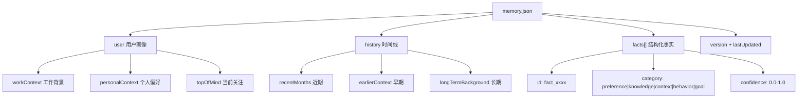
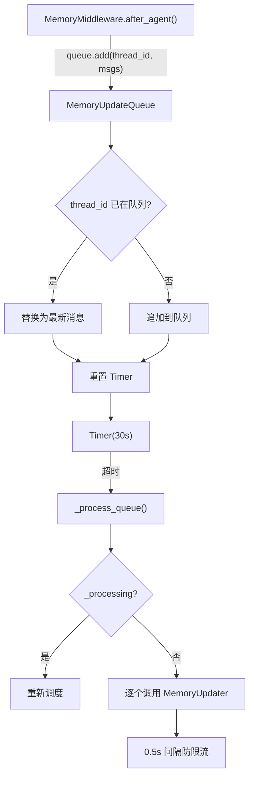
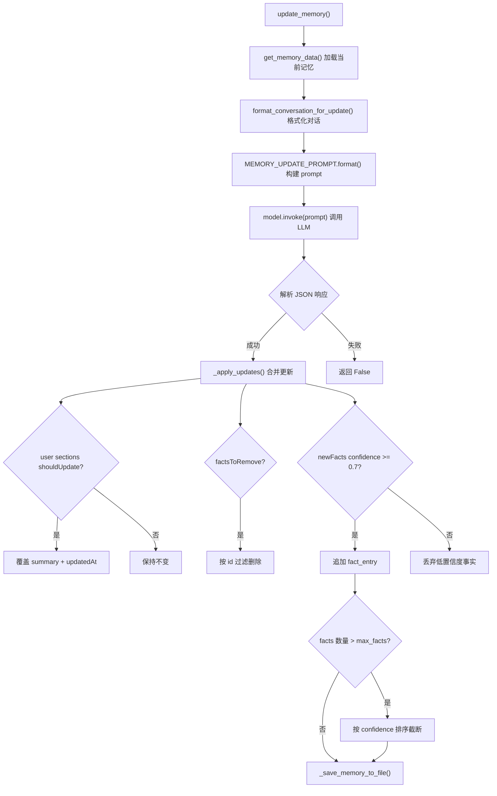
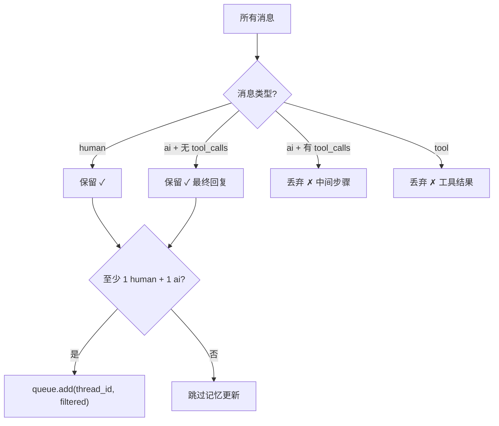

# PD-06.DF DeerFlow — LLM 驱动三层记忆与防抖队列持久化

> 文档编号：PD-06.DF
> 来源：DeerFlow 2.0 `backend/src/agents/memory/`
> GitHub：https://github.com/bytedance/deer-flow.git
> 问题域：PD-06 记忆持久化 Memory Persistence
> 状态：可复用方案

---

## 第 1 章 问题与动机

### 1.1 核心问题

Agent 对话系统面临一个根本矛盾：每次会话结束后，Agent 对用户的了解归零。用户反复提及的偏好、工作背景、技术栈选择等信息在下一次对话中完全丢失。这导致：

- **重复沟通成本**：用户每次都要重新说明自己的背景和偏好
- **个性化缺失**：Agent 无法根据用户历史行为调整回答风格和内容
- **上下文断裂**：跨会话的长期项目协作无法积累经验

核心挑战在于：如何从高频、碎片化的对话流中自动提取有价值的长期记忆，并在不影响实时对话性能的前提下完成持久化？

### 1.2 DeerFlow 的解法概述

DeerFlow 2.0 实现了一套完整的跨会话长期记忆系统，核心设计有 5 个要点：

1. **三层记忆结构**：用户画像（user）+ 时间线历史（history）+ 结构化事实（facts），定义在 `backend/src/agents/memory/updater.py:25-41`
2. **LLM 驱动提取**：用专门的 prompt 模板让 LLM 从对话中提取记忆更新，而非手动规则匹配，见 `backend/src/agents/memory/prompt.py:13-112`
3. **防抖队列批处理**：`MemoryUpdateQueue` 通过 threading.Timer 实现 30s 防抖窗口，同一 thread_id 的多次更新只保留最新一次，见 `backend/src/agents/memory/queue.py:21-55`
4. **中间件自动触发**：`MemoryMiddleware` 作为 Agent 执行后的 hook，自动过滤工具调用消息后入队，见 `backend/src/agents/middlewares/memory_middleware.py:53-107`
5. **tiktoken 精确注入**：注入 system prompt 时用 tiktoken 精确计算 token 数，超限按字符比例截断，见 `backend/src/agents/memory/prompt.py:165-230`

### 1.3 设计思想

| 设计原则 | 具体实现 | 理由 | 替代方案 |
|----------|----------|------|----------|
| LLM 提取优于规则匹配 | MEMORY_UPDATE_PROMPT 让 LLM 判断 shouldUpdate 和 confidence | 规则匹配无法捕获隐含偏好和上下文推断 | 正则/关键词提取（粒度太粗） |
| 异步不阻塞主流程 | MemoryUpdateQueue + threading.Timer 后台处理 | 记忆更新涉及 LLM 调用，不能阻塞用户对话 | 同步更新（延迟不可接受） |
| 置信度门控 | fact_confidence_threshold=0.7 过滤低价值事实 | 避免噪声信息污染记忆库 | 全量存储（记忆膨胀） |
| 原子写入 | temp file + rename 模式 | 防止写入中断导致 JSON 文件损坏 | 直接写入（有损坏风险） |
| 配置化 | 8 项 Pydantic 配置参数，支持运行时调整 | 不同场景需要不同的防抖窗口、token 预算等 | 硬编码常量 |

---

## 第 2 章 源码实现分析

### 2.1 架构概览

DeerFlow 的记忆系统由 4 个核心模块组成，通过中间件模式与 Agent 执行流程解耦：

```
┌─────────────────────────────────────────────────────────────┐
│                    Agent 执行流程                             │
│  User Message → LeadAgent → Tools → Response                │
└──────────────────────┬──────────────────────────────────────┘
                       │ after_agent hook
                       ▼
┌──────────────────────────────────┐
│      MemoryMiddleware            │
│  过滤 tool_calls → 保留 human/ai │
│  检查 thread_id → 入队           │
└──────────────────┬───────────────┘
                   │ queue.add()
                   ▼
┌──────────────────────────────────┐
│     MemoryUpdateQueue            │
│  thread_id 去重 → Timer 防抖     │
│  30s 窗口 → 批量处理             │
└──────────────────┬───────────────┘
                   │ _process_queue()
                   ▼
┌──────────────────────────────────┐
│       MemoryUpdater              │
│  加载当前记忆 → 构建 prompt       │
│  调用 LLM → 解析 JSON → 合并     │
└──────────────────┬───────────────┘
                   │ _save_memory_to_file()
                   ▼
┌──────────────────────────────────┐
│     memory.json (持久化)          │
│  user{3 sections} + history{3}   │
│  + facts[] + version + timestamp │
└──────────────────────────────────┘
                   │ get_memory_data() + mtime 缓存
                   ▼
┌──────────────────────────────────┐
│   format_memory_for_injection    │
│  tiktoken 计数 → 截断 → 注入     │
│  → system prompt <memory> 标签   │
└──────────────────────────────────┘
```

### 2.2 核心实现

#### 2.2.1 三层记忆数据结构



对应源码 `backend/src/agents/memory/updater.py:25-41`：

```python
def _create_empty_memory() -> dict[str, Any]:
    """Create an empty memory structure."""
    return {
        "version": "1.0",
        "lastUpdated": datetime.utcnow().isoformat() + "Z",
        "user": {
            "workContext": {"summary": "", "updatedAt": ""},
            "personalContext": {"summary": "", "updatedAt": ""},
            "topOfMind": {"summary": "", "updatedAt": ""},
        },
        "history": {
            "recentMonths": {"summary": "", "updatedAt": ""},
            "earlierContext": {"summary": "", "updatedAt": ""},
            "longTermBackground": {"summary": "", "updatedAt": ""},
        },
        "facts": [],
    }
```

这个三层结构的设计意图：
- **user** 层是"画像"——相对稳定的用户属性，更新频率低
- **history** 层是"时间线"——按时间衰减的交互历史，recentMonths 更新最频繁
- **facts** 层是"知识库"——离散的、可查询的事实条目，支持增删和置信度排序

#### 2.2.2 防抖队列与线程安全



对应源码 `backend/src/agents/memory/queue.py:36-77`：

```python
def add(self, thread_id: str, messages: list[Any]) -> None:
    config = get_memory_config()
    if not config.enabled:
        return

    context = ConversationContext(
        thread_id=thread_id,
        messages=messages,
    )

    with self._lock:
        # Check if this thread already has a pending update
        # If so, replace it with the newer one
        self._queue = [c for c in self._queue if c.thread_id != thread_id]
        self._queue.append(context)

        # Reset or start the debounce timer
        self._reset_timer()

def _reset_timer(self) -> None:
    config = get_memory_config()
    if self._timer is not None:
        self._timer.cancel()
    self._timer = threading.Timer(
        config.debounce_seconds,
        self._process_queue,
    )
    self._timer.daemon = True
    self._timer.start()
```

关键设计点：
- `self._lock` 保证多线程安全（FastAPI 的异步请求可能并发触发）
- `thread_id` 去重：同一会话的多次更新只保留最新消息列表
- `daemon=True`：Timer 线程不阻止进程退出
- `_processing` 标志位防止重入


#### 2.2.3 LLM 驱动的记忆更新与合并



对应源码 `backend/src/agents/memory/updater.py:175-232` 和 `234-302`：

```python
def update_memory(self, messages: list[Any], thread_id: str | None = None) -> bool:
    config = get_memory_config()
    if not config.enabled:
        return False
    if not messages:
        return False
    try:
        current_memory = get_memory_data()
        conversation_text = format_conversation_for_update(messages)
        if not conversation_text.strip():
            return False
        prompt = MEMORY_UPDATE_PROMPT.format(
            current_memory=json.dumps(current_memory, indent=2),
            conversation=conversation_text,
        )
        model = self._get_model()
        response = model.invoke(prompt)
        response_text = str(response.content).strip()
        # Remove markdown code blocks if present
        if response_text.startswith("```"):
            lines = response_text.split("\n")
            response_text = "\n".join(lines[1:-1] if lines[-1] == "```" else lines[1:])
        update_data = json.loads(response_text)
        updated_memory = self._apply_updates(current_memory, update_data, thread_id)
        return _save_memory_to_file(updated_memory)
    except json.JSONDecodeError as e:
        print(f"Failed to parse LLM response for memory update: {e}")
        return False
    except Exception as e:
        print(f"Memory update failed: {e}")
        return False
```

#### 2.2.4 中间件消息过滤

`MemoryMiddleware` 的关键设计是只保留"有意义的对话"——过滤掉工具调用中间步骤：



对应源码 `backend/src/agents/middlewares/memory_middleware.py:19-50`：

```python
def _filter_messages_for_memory(messages: list[Any]) -> list[Any]:
    filtered = []
    for msg in messages:
        msg_type = getattr(msg, "type", None)
        if msg_type == "human":
            filtered.append(msg)
        elif msg_type == "ai":
            tool_calls = getattr(msg, "tool_calls", None)
            if not tool_calls:
                filtered.append(msg)
    return filtered
```

### 2.3 实现细节

**mtime 缓存失效机制**：`get_memory_data()` 使用文件修改时间（`st_mtime`）作为缓存键，避免每次读取都解析 JSON 文件。当外部工具修改了 memory.json 时，下次读取自动感知变化（`updater.py:50-74`）。

**原子写入**：`_save_memory_to_file()` 先写入 `.tmp` 临时文件，再用 `Path.replace()` 原子替换。这保证即使写入过程中进程崩溃，原文件也不会损坏（`updater.py:137-142`）。

**消息截断**：`format_conversation_for_update()` 对超过 1000 字符的单条消息进行截断，防止 prompt 过长。多模态内容（list 类型）只提取 text 部分（`prompt.py:243-261`）。

**Pydantic 配置模型**：8 项参数全部通过 `MemoryConfig` 定义，支持从 YAML 配置文件加载（`memory_config.py:6-48`）：
- `enabled`: 全局开关
- `storage_path`: 存储路径（默认 `.deer-flow/memory.json`）
- `debounce_seconds`: 防抖窗口（1-300s，默认 30s）
- `model_name`: 记忆更新用的 LLM 模型
- `max_facts`: 事实上限（10-500，默认 100）
- `fact_confidence_threshold`: 置信度阈值（默认 0.7）
- `injection_enabled`: 注入开关
- `max_injection_tokens`: 注入 token 预算（100-8000，默认 2000）

**REST API 暴露**：通过 FastAPI router 提供 3 个端点（`gateway/routers/memory.py`）：
- `GET /api/memory` — 获取当前记忆数据
- `POST /api/memory/reload` — 强制重新加载
- `GET /api/memory/status` — 配置 + 数据一体返回

---

## 第 3 章 迁移指南

### 3.1 迁移清单

**阶段 1：核心记忆结构（1 个文件）**
- [ ] 定义 `MemoryConfig` Pydantic 模型（8 项参数）
- [ ] 实现 `_create_empty_memory()` 三层结构
- [ ] 实现 `_load_memory_from_file()` + `_save_memory_to_file()`（含原子写入）
- [ ] 实现 mtime 缓存机制

**阶段 2：LLM 更新引擎（2 个文件）**
- [ ] 编写 `MEMORY_UPDATE_PROMPT`（可直接复用 DeerFlow 的 prompt 模板）
- [ ] 实现 `MemoryUpdater._apply_updates()` 合并逻辑
- [ ] 实现 `format_conversation_for_update()` 消息格式化
- [ ] 实现 `format_memory_for_injection()` + tiktoken 计数

**阶段 3：异步队列（1 个文件）**
- [ ] 实现 `MemoryUpdateQueue` + threading.Timer 防抖
- [ ] 实现 thread_id 去重 + _processing 防重入
- [ ] 实现 `flush()` 和 `clear()` 用于测试和优雅关闭

**阶段 4：集成（2 个文件）**
- [ ] 实现 `MemoryMiddleware`（或等效的 hook/callback）
- [ ] 在 Agent 系统 prompt 中注入 `<memory>` 标签
- [ ] 可选：REST API 端点

### 3.2 适配代码模板

以下是一个最小可运行的记忆系统实现，可直接用于任何 Python Agent 框架：

```python
"""Minimal memory system adapted from DeerFlow 2.0."""
import json
import threading
import uuid
from datetime import datetime
from pathlib import Path
from typing import Any

try:
    import tiktoken
    _enc = tiktoken.get_encoding("cl100k_base")
    def count_tokens(text: str) -> int:
        return len(_enc.encode(text))
except ImportError:
    def count_tokens(text: str) -> int:
        return len(text) // 4

# --- Config ---
MEMORY_PATH = Path(".agent/memory.json")
DEBOUNCE_SECONDS = 30
MAX_FACTS = 100
CONFIDENCE_THRESHOLD = 0.7
MAX_INJECTION_TOKENS = 2000

# --- Storage ---
_cache: dict | None = None
_mtime: float | None = None

def load_memory() -> dict[str, Any]:
    global _cache, _mtime
    if MEMORY_PATH.exists():
        mt = MEMORY_PATH.stat().st_mtime
        if _cache and _mtime == mt:
            return _cache
        _cache = json.loads(MEMORY_PATH.read_text("utf-8"))
        _mtime = mt
        return _cache
    return {"version": "1.0", "user": {}, "history": {}, "facts": []}

def save_memory(data: dict[str, Any]) -> None:
    global _cache, _mtime
    MEMORY_PATH.parent.mkdir(parents=True, exist_ok=True)
    data["lastUpdated"] = datetime.utcnow().isoformat() + "Z"
    tmp = MEMORY_PATH.with_suffix(".tmp")
    tmp.write_text(json.dumps(data, indent=2, ensure_ascii=False), "utf-8")
    tmp.replace(MEMORY_PATH)
    _cache = data
    _mtime = MEMORY_PATH.stat().st_mtime

# --- Queue ---
class MemoryQueue:
    def __init__(self):
        self._q: dict[str, list] = {}
        self._lock = threading.Lock()
        self._timer: threading.Timer | None = None

    def add(self, thread_id: str, messages: list):
        with self._lock:
            self._q[thread_id] = messages
            if self._timer:
                self._timer.cancel()
            self._timer = threading.Timer(DEBOUNCE_SECONDS, self._flush)
            self._timer.daemon = True
            self._timer.start()

    def _flush(self):
        with self._lock:
            batch = dict(self._q)
            self._q.clear()
        for tid, msgs in batch.items():
            update_memory(msgs, tid)

_queue = MemoryQueue()

# --- Updater (需要接入你的 LLM 调用) ---
def update_memory(messages: list, thread_id: str) -> bool:
    """Replace this with your LLM call using MEMORY_UPDATE_PROMPT."""
    # llm_response = your_llm.invoke(prompt)
    # apply_updates(load_memory(), parse(llm_response))
    # save_memory(updated)
    return True

# --- Injection ---
def format_for_injection(max_tokens: int = MAX_INJECTION_TOKENS) -> str:
    mem = load_memory()
    parts = []
    for section in ["workContext", "personalContext", "topOfMind"]:
        s = mem.get("user", {}).get(section, {}).get("summary", "")
        if s:
            parts.append(f"- {section}: {s}")
    result = "\n".join(parts)
    if count_tokens(result) > max_tokens:
        ratio = len(result) / count_tokens(result)
        result = result[:int(max_tokens * ratio * 0.95)] + "\n..."
    return result
```

### 3.3 适用场景

| 场景 | 适用度 | 说明 |
|------|--------|------|
| 单用户 Agent 助手 | ⭐⭐⭐ | 最佳场景，JSON 文件存储足够 |
| 多用户 SaaS Agent | ⭐⭐ | 需要将 storage_path 改为按用户隔离，或换用数据库 |
| 高并发实时对话 | ⭐⭐ | 防抖队列能缓冲，但 threading.Timer 在高并发下可能需要换用 asyncio |
| 离线批处理 | ⭐ | 不适用，该方案面向实时对话流 |
| 多 Agent 协作 | ⭐⭐ | 记忆是全局单例，多 Agent 共享同一份记忆文件 |

---

## 第 4 章 测试用例

```python
"""Tests for DeerFlow memory system components."""
import json
import threading
import time
from datetime import datetime
from pathlib import Path
from unittest.mock import MagicMock, patch

import pytest


class TestMemoryDataStructure:
    """Test the three-layer memory structure."""

    def test_empty_memory_has_all_sections(self):
        """Verify empty memory contains user, history, facts."""
        from src.agents.memory.updater import _create_empty_memory
        mem = _create_empty_memory()
        assert "user" in mem
        assert "history" in mem
        assert "facts" in mem
        assert mem["version"] == "1.0"
        for section in ["workContext", "personalContext", "topOfMind"]:
            assert section in mem["user"]
            assert mem["user"][section]["summary"] == ""
        for section in ["recentMonths", "earlierContext", "longTermBackground"]:
            assert section in mem["history"]

    def test_fact_entry_structure(self):
        """Verify fact entries have required fields."""
        fact = {
            "id": f"fact_{uuid.uuid4().hex[:8]}",
            "content": "User prefers Python",
            "category": "preference",
            "confidence": 0.9,
            "createdAt": datetime.utcnow().isoformat() + "Z",
            "source": "thread_123",
        }
        assert fact["confidence"] >= 0.7
        assert fact["category"] in ["preference", "knowledge", "context", "behavior", "goal"]


class TestMemoryUpdateQueue:
    """Test debounce queue behavior."""

    def test_thread_id_dedup(self):
        """Same thread_id should replace previous entry."""
        from src.agents.memory.queue import MemoryUpdateQueue
        q = MemoryUpdateQueue()
        with patch.object(q, '_reset_timer'):
            q._queue = []
            q.add.__wrapped__ = None  # bypass config check
        # Simulate manual add
        q._queue = []
        q._queue.append(MagicMock(thread_id="t1", messages=["old"]))
        q._queue = [c for c in q._queue if c.thread_id != "t1"]
        q._queue.append(MagicMock(thread_id="t1", messages=["new"]))
        assert len(q._queue) == 1
        assert q._queue[0].messages == ["new"]

    def test_debounce_resets_timer(self):
        """Adding to queue should reset the timer."""
        from src.agents.memory.queue import MemoryUpdateQueue
        q = MemoryUpdateQueue()
        mock_timer = MagicMock()
        q._timer = mock_timer
        q._reset_timer()
        mock_timer.cancel.assert_called_once()
        assert q._timer is not None
        q.clear()

    def test_flush_processes_immediately(self):
        """flush() should process queue without waiting for timer."""
        from src.agents.memory.queue import MemoryUpdateQueue
        q = MemoryUpdateQueue()
        q._queue.append(MagicMock(thread_id="t1", messages=[]))
        with patch.object(q, '_process_queue') as mock_process:
            q.flush()
            mock_process.assert_called_once()


class TestMemoryApplyUpdates:
    """Test the _apply_updates merge logic."""

    def test_user_section_update_with_should_update_true(self):
        from src.agents.memory.updater import MemoryUpdater
        updater = MemoryUpdater()
        current = {"user": {"workContext": {"summary": "old", "updatedAt": ""}},
                   "history": {}, "facts": []}
        update = {"user": {"workContext": {"summary": "new work", "shouldUpdate": True}}}
        result = updater._apply_updates(current, update)
        assert result["user"]["workContext"]["summary"] == "new work"

    def test_low_confidence_facts_filtered(self):
        from src.agents.memory.updater import MemoryUpdater
        updater = MemoryUpdater()
        current = {"user": {}, "history": {}, "facts": []}
        update = {"newFacts": [
            {"content": "high conf", "confidence": 0.9},
            {"content": "low conf", "confidence": 0.3},
        ]}
        with patch("src.agents.memory.updater.get_memory_config") as mock_cfg:
            mock_cfg.return_value = MagicMock(fact_confidence_threshold=0.7, max_facts=100)
            result = updater._apply_updates(current, update)
        assert len(result["facts"]) == 1
        assert result["facts"][0]["content"] == "high conf"

    def test_max_facts_enforcement(self):
        from src.agents.memory.updater import MemoryUpdater
        updater = MemoryUpdater()
        facts = [{"id": f"f{i}", "content": f"fact {i}", "confidence": i * 0.1}
                 for i in range(15)]
        current = {"user": {}, "history": {}, "facts": facts}
        with patch("src.agents.memory.updater.get_memory_config") as mock_cfg:
            mock_cfg.return_value = MagicMock(fact_confidence_threshold=0.1, max_facts=10)
            result = updater._apply_updates(current, {"newFacts": []})
        assert len(result["facts"]) <= 10
        # Should keep highest confidence facts
        assert result["facts"][0]["confidence"] >= result["facts"][-1]["confidence"]


class TestMemoryInjection:
    """Test tiktoken-based injection formatting."""

    def test_empty_memory_returns_empty(self):
        from src.agents.memory.prompt import format_memory_for_injection
        assert format_memory_for_injection({}) == ""
        assert format_memory_for_injection(None) == ""

    def test_truncation_on_token_limit(self):
        from src.agents.memory.prompt import format_memory_for_injection
        mem = {
            "user": {"workContext": {"summary": "x" * 5000}},
            "history": {},
        }
        result = format_memory_for_injection(mem, max_tokens=100)
        assert result.endswith("...")

    def test_message_filter_removes_tool_calls(self):
        from src.agents.middlewares.memory_middleware import _filter_messages_for_memory
        human = MagicMock(type="human")
        ai_final = MagicMock(type="ai", tool_calls=None)
        ai_tool = MagicMock(type="ai", tool_calls=[{"name": "search"}])
        tool_msg = MagicMock(type="tool")
        result = _filter_messages_for_memory([human, ai_tool, tool_msg, ai_final])
        assert len(result) == 2  # human + ai_final
```


---

## 第 5 章 跨域关联

| 关联域 | 关系类型 | 说明 |
|--------|----------|------|
| PD-01 上下文管理 | 协同 | 记忆注入占用 system prompt token 预算（max_injection_tokens），需与上下文压缩策略协调 |
| PD-02 多 Agent 编排 | 协同 | MemoryMiddleware 挂载在 LeadAgent 的中间件链中，与 SummarizationMiddleware、ClarificationMiddleware 等共存 |
| PD-03 容错与重试 | 依赖 | MemoryUpdater 的 LLM 调用可能失败（JSON 解析错误、网络超时），当前仅 try-catch 打印日志，未接入重试机制 |
| PD-10 中间件管道 | 依赖 | 记忆系统通过 AgentMiddleware 基类的 after_agent hook 触发，依赖中间件管道的执行顺序（MemoryMiddleware 在 TitleMiddleware 之后） |
| PD-11 可观测性 | 协同 | 记忆更新的成功/失败通过 print 输出，可接入结构化日志追踪记忆更新频率和 LLM 调用成本 |

---

## 第 6 章 来源文件索引

| 文件 | 行范围 | 关键实现 |
|------|--------|----------|
| `backend/src/agents/memory/updater.py` | L1-317 | MemoryUpdater 核心类、三层记忆结构、原子写入、mtime 缓存 |
| `backend/src/agents/memory/queue.py` | L1-192 | MemoryUpdateQueue 防抖队列、threading.Timer、thread_id 去重 |
| `backend/src/agents/memory/prompt.py` | L1-262 | MEMORY_UPDATE_PROMPT 模板、tiktoken 计数、注入格式化、消息截断 |
| `backend/src/agents/memory/__init__.py` | L1-45 | 模块公开 API 导出 |
| `backend/src/agents/middlewares/memory_middleware.py` | L1-108 | MemoryMiddleware after_agent hook、消息过滤逻辑 |
| `backend/src/config/memory_config.py` | L1-70 | MemoryConfig Pydantic 模型（8 项参数）、全局单例 |
| `backend/src/gateway/routers/memory.py` | L1-202 | REST API 端点（GET/POST /api/memory） |
| `backend/src/agents/lead_agent/agent.py` | L211-212 | MemoryMiddleware 注册到中间件链 |
| `backend/src/agents/lead_agent/prompt.py` | L283-309 | _get_memory_context() 注入 system prompt |

---

## 第 7 章 横向对比维度

> **重要：** 本章用于自动填充 Butcher Wiki 的横向对比表。

```json comparison_data
{
  "project": "DeerFlow",
  "dimensions": {
    "记忆结构": "三层结构：user 画像（3 section）+ history 时间线（3 section）+ facts 事实数组",
    "更新机制": "MemoryUpdateQueue 防抖队列，30s Timer + thread_id 去重批处理",
    "事实提取": "LLM 驱动，5 类 category + 4 级 confidence，shouldUpdate 门控",
    "存储方式": "单 JSON 文件（.deer-flow/memory.json），temp+rename 原子写入",
    "注入方式": "system prompt <memory> 标签，tiktoken 精确计数 + 字符比例截断",
    "生命周期管理": "facts 按 confidence 排序截断至 max_facts，history 按时间分层覆盖",
    "并发安全": "threading.Lock + _processing 标志位防重入，daemon Timer",
    "记忆增长控制": "max_facts=100 硬上限 + confidence 排序淘汰低价值事实",
    "记忆检索": "无独立检索，全量注入 system prompt（受 max_injection_tokens 限制）",
    "缓存失效策略": "文件 st_mtime 比对，外部修改自动感知刷新缓存"
  }
}
```

### 域元数据补充

```json domain_metadata
{
  "solution_summary": "DeerFlow 用 MemoryMiddleware + 30s 防抖队列 + LLM 提取三层记忆（画像/时间线/事实），JSON 文件原子持久化，tiktoken 精确控制注入量",
  "description": "中间件驱动的异步记忆更新与 LLM 结构化提取",
  "sub_problems": [
    "消息过滤策略：如何从包含工具调用的完整对话中只提取有记忆价值的 human/ai 消息",
    "记忆更新 prompt 工程：如何设计 prompt 让 LLM 准确判断 shouldUpdate 并输出结构化 JSON",
    "防抖窗口调优：debounce_seconds 过短浪费 LLM 调用，过长导致记忆延迟"
  ],
  "best_practices": [
    "中间件触发优于显式调用：通过 after_agent hook 自动入队，Agent 代码零侵入",
    "mtime 缓存避免重复解析：用文件修改时间作为缓存键，外部修改自动感知",
    "REST API 暴露记忆状态：提供 GET/POST 端点便于调试和前端展示记忆内容"
  ]
}
```
