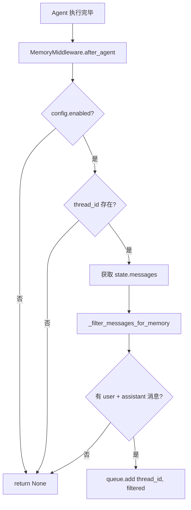
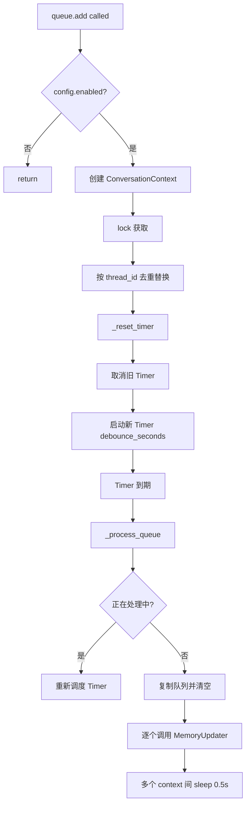
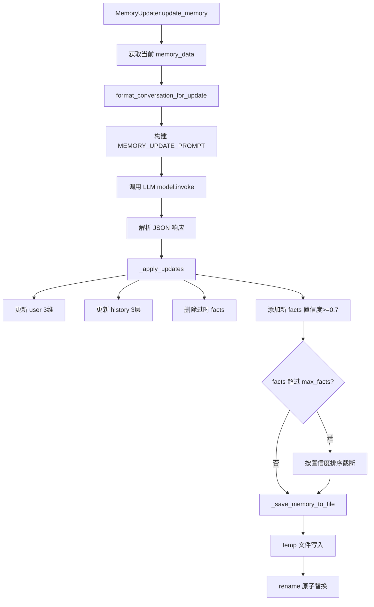

# PD-06.02 DeerFlow — 跨会话记忆持久化方案

> 文档编号：PD-06.02
> 来源：DeerFlow `backend/src/agents/memory/`
> GitHub：https://github.com/bytedance/deer-flow
> 问题域：PD-06 记忆持久化 Memory Persistence
> 状态：可复用方案

---

## 第 1 章 问题与动机（≥ 30 行）

### 1.1 核心问题

Agent 系统的对话是无状态的——每次新会话都从零开始，无法记住用户的偏好、工作背景和历史交互。这导致：

1. **重复沟通成本**：用户每次都要重新说明自己的技术栈、项目背景、偏好风格
2. **个性化缺失**：Agent 无法根据用户历史行为调整回答策略
3. **上下文断裂**：跨会话的长期任务无法延续，用户需要手动"提醒" Agent 之前的进展
4. **隐性知识丢失**：对话中隐含的偏好（如"用户倾向简洁回答"）无法被捕获和复用

核心挑战在于：如何在不增加用户负担的前提下，自动从对话中提取有价值的信息，并在后续会话中精准注入？

### 1.2 DeerFlow 的解法概述

DeerFlow 实现了一套完整的 **Middleware → Queue → Updater → Injection** 四阶段记忆管道：

1. **MemoryMiddleware** (`backend/src/agents/middlewares/memory_middleware.py:53`) — 作为 LangGraph AgentMiddleware，在每次 Agent 执行后自动拦截对话，过滤掉工具调用等中间消息，只保留用户输入和最终助手回复
2. **MemoryUpdateQueue** (`backend/src/agents/memory/queue.py:21`) — 防抖批处理队列，30s 窗口内同一 thread_id 的多次更新合并为一次，避免高频对话场景下的 LLM 调用浪费
3. **MemoryUpdater** (`backend/src/agents/memory/updater.py:158`) — 用 LLM 分析对话，提取事实（带置信度和分类），更新用户画像的 6 个维度（workContext / personalContext / topOfMind + 3 层历史），原子写入 memory.json
4. **Prompt Injection** (`backend/src/agents/lead_agent/prompt.py:283-309`) — 在系统 prompt 中注入 `<memory>` 标签，包含格式化后的用户上下文和历史摘要，受 token 上限控制

### 1.3 设计思想

| 设计原则 | 具体实现 | 理由 | 替代方案 |
|----------|----------|------|----------|
| 异步不阻塞 | Middleware 只入队，Timer 线程异步处理 | 记忆更新不应阻塞用户对话的响应速度 | 同步更新（会增加响应延迟） |
| 防抖合并 | 30s 窗口 + thread_id 去重替换 | 高频对话场景下避免每轮都调 LLM | 固定间隔轮询（不够灵活） |
| LLM 提取 | 用 MEMORY_UPDATE_PROMPT 让 LLM 结构化输出 | LLM 能捕获隐含偏好，比规则提取更智能 | 正则/关键词提取（粒度粗） |
| 置信度门控 | 0.7 阈值过滤低价值事实 | 不是所有信息都值得记住，避免噪声污染 | 全部存储（存储膨胀） |
| 原子写入 | temp + rename 模式 | 防止写入中断导致 memory.json 损坏 | 直接覆盖写（有数据丢失风险） |
| 配置化 | Pydantic BaseModel 8 项参数全可配 | 不同场景需要不同的防抖时间、事实上限等 | 硬编码常量（不灵活） |
| 分层记忆 | user(3维) + history(3层) + facts 三级结构 | 不同时间尺度的信息有不同的更新频率和用途 | 扁平 key-value（缺乏结构） |

---

## 第 2 章 源码实现分析（≥ 60 行，核心章节）

### 2.1 架构概览

DeerFlow 的记忆系统是一个四阶段异步管道，嵌入在 LangGraph Agent 的中间件层：

```
┌─────────────────────────────────────────────────────────────────┐
│                    LangGraph Agent Runtime                       │
│                                                                  │
│  ┌──────────┐    ┌─────────────────┐    ┌──────────────────┐    │
│  │  Agent    │───→│ MemoryMiddleware │───→│ MemoryUpdateQueue│    │
│  │ Execution │    │  (after_agent)   │    │  (debounce 30s)  │    │
│  └──────────┘    └─────────────────┘    └────────┬─────────┘    │
│                                                   │              │
│                                          Timer fires             │
│                                                   ↓              │
│                                         ┌─────────────────┐     │
│                                         │  MemoryUpdater   │     │
│                                         │  (LLM extract)   │     │
│                                         └────────┬────────┘     │
│                                                   │              │
│                                          atomic write            │
│                                                   ↓              │
│  ┌──────────────┐                      ┌─────────────────┐      │
│  │ System Prompt │←── injection ───────│  memory.json     │      │
│  │  <memory>     │                     │  (6维 + facts)   │      │
│  └──────────────┘                      └─────────────────┘      │
└─────────────────────────────────────────────────────────────────┘
```

**数据流：** Agent 执行完毕 → Middleware 过滤消息 → Queue 防抖入队 → Timer 触发 → Updater 调 LLM 提取 → 原子写入 JSON → 下次会话注入 System Prompt

### 2.2 核心实现

#### 2.2.1 消息过滤与入队



对应源码 `backend/src/agents/middlewares/memory_middleware.py:19-50`：

```python
def _filter_messages_for_memory(messages: list[Any]) -> list[Any]:
    """Filter messages to keep only user inputs and final assistant responses.
    Filters out:
    - Tool messages (intermediate tool call results)
    - AI messages with tool_calls (intermediate steps, not final responses)
    """
    filtered = []
    for msg in messages:
        msg_type = getattr(msg, "type", None)
        if msg_type == "human":
            filtered.append(msg)
        elif msg_type == "ai":
            tool_calls = getattr(msg, "tool_calls", None)
            if not tool_calls:
                filtered.append(msg)
    return filtered
```

这个过滤器的设计非常精准：只保留 human 消息和**没有 tool_calls 的** AI 消息。带 tool_calls 的 AI 消息是中间推理步骤（如"我需要搜索一下"），不包含对用户有价值的最终回答。这避免了将工具调用的噪声写入记忆。

#### 2.2.2 防抖队列机制



对应源码 `backend/src/agents/memory/queue.py:36-61`：

```python
def add(self, thread_id: str, messages: list[Any]) -> None:
    config = get_memory_config()
    if not config.enabled:
        return
    context = ConversationContext(
        thread_id=thread_id,
        messages=messages,
    )
    with self._lock:
        # 同一 thread_id 的旧请求被新请求替换（去重）
        self._queue = [c for c in self._queue if c.thread_id != thread_id]
        self._queue.append(context)
        self._reset_timer()  # 每次 add 都重置防抖计时器
```

关键设计点：
- **thread_id 去重**（`queue.py:55`）：同一会话的多轮对话只保留最新的完整消息列表，避免重复处理
- **Timer 重置**（`queue.py:63-77`）：每次 add 都取消旧 Timer 并启动新的，实现真正的防抖——只有对话"安静"了 30s 后才触发更新
- **处理中保护**（`queue.py:87-89`）：如果 `_processing=True`，不会并发处理，而是重新调度 Timer
- **daemon 线程**（`queue.py:76`）：Timer 设为 daemon，进程退出时自动清理

#### 2.2.3 LLM 记忆提取与原子写入



对应源码 `backend/src/agents/memory/updater.py:175-232`：

```python
def update_memory(self, messages: list[Any], thread_id: str | None = None) -> bool:
    config = get_memory_config()
    if not config.enabled:
        return False
    try:
        current_memory = get_memory_data()
        conversation_text = format_conversation_for_update(messages)
        prompt = MEMORY_UPDATE_PROMPT.format(
            current_memory=json.dumps(current_memory, indent=2),
            conversation=conversation_text,
        )
        model = self._get_model()
        response = model.invoke(prompt)
        response_text = str(response.content).strip()
        # 去除 markdown 代码块包裹
        if response_text.startswith("```"):
            lines = response_text.split("\n")
            response_text = "\n".join(lines[1:-1] if lines[-1] == "```" else lines[1:])
        update_data = json.loads(response_text)
        updated_memory = self._apply_updates(current_memory, update_data, thread_id)
        return _save_memory_to_file(updated_memory)
    except json.JSONDecodeError as e:
        print(f"Failed to parse LLM response for memory update: {e}")
        return False
```

### 2.3 实现细节

#### 记忆数据结构

DeerFlow 的 memory.json 采用三级结构（`updater.py:25-41`）：

```json
{
  "version": "1.0",
  "lastUpdated": "2024-01-15T10:30:00Z",
  "user": {
    "workContext": {"summary": "...", "updatedAt": "..."},
    "personalContext": {"summary": "...", "updatedAt": "..."},
    "topOfMind": {"summary": "...", "updatedAt": "..."}
  },
  "history": {
    "recentMonths": {"summary": "...", "updatedAt": "..."},
    "earlierContext": {"summary": "...", "updatedAt": "..."},
    "longTermBackground": {"summary": "...", "updatedAt": "..."}
  },
  "facts": [
    {"id": "fact_abc123", "content": "...", "category": "preference",
     "confidence": 0.9, "createdAt": "...", "source": "thread_xyz"}
  ]
}
```

**user 维度**（高频更新）：
- `workContext`：当前工作角色、项目、技术栈（2-3 句）
- `personalContext`：语言偏好、沟通风格、兴趣（1-2 句）
- `topOfMind`：3-5 个并发关注点（最频繁更新的维度）

**history 维度**（按时间衰减）：
- `recentMonths`：近 1-3 个月的详细活动（4-6 句）
- `earlierContext`：3-12 个月前的模式（3-5 句）
- `longTermBackground`：基础性的持久信息（2-4 句）

**facts 维度**（结构化事实）：
- 5 种分类：preference / knowledge / context / behavior / goal
- 置信度分级：0.9-1.0（明确陈述）、0.7-0.8（强推断）、0.5-0.6（弱推断，谨慎使用）
- 上限管理：超过 `max_facts`（默认 100）时按置信度排序截断

#### 缓存与失效机制

`get_memory_data()` 实现了基于文件 mtime 的缓存失效（`updater.py:50-74`）：

```python
def get_memory_data() -> dict[str, Any]:
    global _memory_data, _memory_file_mtime
    file_path = _get_memory_file_path()
    try:
        current_mtime = file_path.stat().st_mtime if file_path.exists() else None
    except OSError:
        current_mtime = None
    if _memory_data is None or _memory_file_mtime != current_mtime:
        _memory_data = _load_memory_from_file()
        _memory_file_mtime = current_mtime
    return _memory_data
```

这确保了：外部修改 memory.json 后，下次读取会自动刷新缓存；正常流程中则直接返回内存缓存，避免重复 IO。

#### Prompt 注入与 Token 控制

`format_memory_for_injection()` 将记忆格式化为系统 prompt 片段（`prompt.py:165-230`），使用 tiktoken 精确计算 token 数，超出 `max_injection_tokens`（默认 2000）时按比例截断。注入位置在 `SYSTEM_PROMPT_TEMPLATE` 的 `{memory_context}` 占位符处（`prompt.py:154`），包裹在 `<memory>` XML 标签中。


---

## 第 3 章 迁移指南（≥ 40 行）

### 3.1 迁移清单

**阶段 1：基础设施（1-2 天）**
- [ ] 创建 `MemoryConfig` Pydantic 模型，定义 8 项配置参数
- [ ] 实现 `memory.json` 的读写层（含原子写入 + mtime 缓存）
- [ ] 定义记忆数据结构（user 3维 + history 3层 + facts 列表）

**阶段 2：核心管道（2-3 天）**
- [ ] 实现 `MemoryUpdateQueue`（threading.Timer 防抖 + thread_id 去重）
- [ ] 编写 `MEMORY_UPDATE_PROMPT`（LLM 结构化提取 prompt）
- [ ] 实现 `MemoryUpdater`（调 LLM → 解析 JSON → apply_updates → 原子写入）
- [ ] 实现 `_apply_updates` 中的置信度门控和 max_facts 截断

**阶段 3：集成（1 天）**
- [ ] 实现 `MemoryMiddleware`（接入你的 Agent 框架的中间件/钩子机制）
- [ ] 实现 `format_memory_for_injection`（token 控制 + 格式化）
- [ ] 在系统 prompt 模板中添加 `{memory_context}` 占位符

**阶段 4：API 与前端（可选）**
- [ ] 添加 `/api/memory` REST 端点（查看/重载记忆数据）
- [ ] 前端记忆设置页面

### 3.2 适配代码模板

以下是一个可直接复用的最小化记忆系统实现，不依赖 LangGraph：

```python
"""Minimal memory system adapted from DeerFlow's design."""
import json
import threading
import uuid
from datetime import datetime
from pathlib import Path
from typing import Any

from pydantic import BaseModel, Field


class MemoryConfig(BaseModel):
    enabled: bool = True
    storage_path: str = "data/memory.json"
    debounce_seconds: int = 30
    max_facts: int = 100
    fact_confidence_threshold: float = 0.7
    max_injection_tokens: int = 2000


class MemoryStore:
    """Thread-safe memory store with atomic writes."""

    def __init__(self, config: MemoryConfig):
        self.config = config
        self._cache: dict | None = None
        self._mtime: float | None = None
        self._lock = threading.Lock()

    def _empty_memory(self) -> dict:
        return {
            "version": "1.0",
            "lastUpdated": "",
            "user": {
                "workContext": {"summary": "", "updatedAt": ""},
                "personalContext": {"summary": "", "updatedAt": ""},
                "topOfMind": {"summary": "", "updatedAt": ""},
            },
            "history": {
                "recentMonths": {"summary": "", "updatedAt": ""},
                "earlierContext": {"summary": "", "updatedAt": ""},
                "longTermBackground": {"summary": "", "updatedAt": ""},
            },
            "facts": [],
        }

    def load(self) -> dict:
        path = Path(self.config.storage_path)
        try:
            mtime = path.stat().st_mtime if path.exists() else None
        except OSError:
            mtime = None
        if self._cache is None or self._mtime != mtime:
            if path.exists():
                try:
                    self._cache = json.loads(path.read_text("utf-8"))
                except (json.JSONDecodeError, OSError):
                    self._cache = self._empty_memory()
            else:
                self._cache = self._empty_memory()
            self._mtime = mtime
        return self._cache

    def save(self, data: dict) -> bool:
        path = Path(self.config.storage_path)
        path.parent.mkdir(parents=True, exist_ok=True)
        data["lastUpdated"] = datetime.utcnow().isoformat() + "Z"
        temp = path.with_suffix(".tmp")
        try:
            temp.write_text(json.dumps(data, indent=2, ensure_ascii=False), "utf-8")
            temp.replace(path)  # atomic rename
            self._cache = data
            self._mtime = path.stat().st_mtime
            return True
        except OSError:
            return False


class DebouncedMemoryQueue:
    """Debounced queue that batches memory updates."""

    def __init__(self, config: MemoryConfig, updater_fn):
        self._config = config
        self._updater_fn = updater_fn
        self._queue: dict[str, list] = {}  # thread_id -> messages
        self._lock = threading.Lock()
        self._timer: threading.Timer | None = None

    def add(self, thread_id: str, messages: list):
        with self._lock:
            self._queue[thread_id] = messages  # 去重替换
            if self._timer:
                self._timer.cancel()
            self._timer = threading.Timer(
                self._config.debounce_seconds, self._flush
            )
            self._timer.daemon = True
            self._timer.start()

    def _flush(self):
        with self._lock:
            items = dict(self._queue)
            self._queue.clear()
            self._timer = None
        for tid, msgs in items.items():
            try:
                self._updater_fn(tid, msgs)
            except Exception as e:
                print(f"Memory update failed for {tid}: {e}")
```

### 3.3 适用场景

| 场景 | 适用度 | 说明 |
|------|--------|------|
| 多轮对话 Agent（客服/助手） | ⭐⭐⭐ | 最佳场景：高频交互，用户画像价值高 |
| 编程助手（IDE Agent） | ⭐⭐⭐ | 记住用户技术栈、代码风格、项目背景 |
| 研究型 Agent（单次深度任务） | ⭐⭐ | 任务间关联较弱，记忆价值中等 |
| 一次性工具调用 | ⭐ | 无跨会话需求，不需要记忆系统 |
| 多用户共享 Agent | ⭐⭐ | 需要按 user_id 隔离记忆文件，DeerFlow 当前是全局单文件 |

---

## 第 4 章 测试用例（≥ 20 行）

```python
"""Tests for DeerFlow-style memory system."""
import json
import tempfile
import threading
import time
from pathlib import Path
from unittest.mock import MagicMock, patch

import pytest


class TestMessageFiltering:
    """Test _filter_messages_for_memory logic."""

    def _make_msg(self, msg_type: str, content: str = "test", tool_calls=None):
        msg = MagicMock()
        msg.type = msg_type
        msg.content = content
        msg.tool_calls = tool_calls
        return msg

    def test_keeps_human_messages(self):
        msgs = [self._make_msg("human", "hello")]
        filtered = [m for m in msgs if m.type == "human" or (m.type == "ai" and not m.tool_calls)]
        assert len(filtered) == 1

    def test_keeps_final_ai_messages(self):
        msgs = [self._make_msg("ai", "answer", tool_calls=None)]
        filtered = [m for m in msgs if m.type == "human" or (m.type == "ai" and not m.tool_calls)]
        assert len(filtered) == 1

    def test_filters_ai_with_tool_calls(self):
        msgs = [self._make_msg("ai", "thinking", tool_calls=[{"name": "search"}])]
        filtered = [m for m in msgs if m.type == "human" or (m.type == "ai" and not m.tool_calls)]
        assert len(filtered) == 0

    def test_filters_tool_messages(self):
        msgs = [self._make_msg("tool", "result")]
        filtered = [m for m in msgs if m.type == "human" or (m.type == "ai" and not m.tool_calls)]
        assert len(filtered) == 0


class TestMemoryStore:
    """Test atomic write and cache invalidation."""

    def test_atomic_write_creates_file(self, tmp_path):
        path = tmp_path / "memory.json"
        data = {"version": "1.0", "facts": []}
        temp = path.with_suffix(".tmp")
        temp.write_text(json.dumps(data), "utf-8")
        temp.replace(path)
        assert path.exists()
        assert json.loads(path.read_text()) == data

    def test_cache_invalidation_on_external_edit(self, tmp_path):
        path = tmp_path / "memory.json"
        data1 = {"version": "1.0", "facts": [], "lastUpdated": "t1"}
        path.write_text(json.dumps(data1))
        mtime1 = path.stat().st_mtime
        # Simulate external edit
        time.sleep(0.1)
        data2 = {"version": "1.0", "facts": [{"id": "f1"}], "lastUpdated": "t2"}
        path.write_text(json.dumps(data2))
        mtime2 = path.stat().st_mtime
        assert mtime1 != mtime2  # mtime changed → cache should invalidate


class TestFactConfidenceGating:
    """Test confidence threshold filtering."""

    def test_high_confidence_fact_accepted(self):
        threshold = 0.7
        fact = {"content": "User prefers Python", "confidence": 0.9, "category": "preference"}
        assert fact["confidence"] >= threshold

    def test_low_confidence_fact_rejected(self):
        threshold = 0.7
        fact = {"content": "Maybe likes Java", "confidence": 0.5, "category": "preference"}
        assert fact["confidence"] < threshold

    def test_max_facts_truncation(self):
        max_facts = 3
        facts = [
            {"id": f"f{i}", "confidence": 0.5 + i * 0.1, "content": f"fact {i}"}
            for i in range(5)
        ]
        truncated = sorted(facts, key=lambda f: f["confidence"], reverse=True)[:max_facts]
        assert len(truncated) == 3
        assert truncated[0]["confidence"] == 0.9  # highest kept


class TestDebounceQueue:
    """Test debounce and thread_id dedup."""

    def test_thread_id_dedup(self):
        queue = []
        # Simulate add with dedup
        def add(tid, msgs):
            nonlocal queue
            queue = [c for c in queue if c[0] != tid]
            queue.append((tid, msgs))

        add("t1", ["msg1"])
        add("t1", ["msg2"])  # should replace
        assert len(queue) == 1
        assert queue[0][1] == ["msg2"]

    def test_debounce_timer_reset(self):
        fired = threading.Event()
        timer = threading.Timer(0.1, fired.set)
        timer.daemon = True
        timer.start()
        # Cancel and reset
        timer.cancel()
        timer2 = threading.Timer(0.2, fired.set)
        timer2.daemon = True
        timer2.start()
        assert not fired.is_set()  # not fired yet at 0.1s
        time.sleep(0.3)
        assert fired.is_set()  # fired after 0.2s
```

