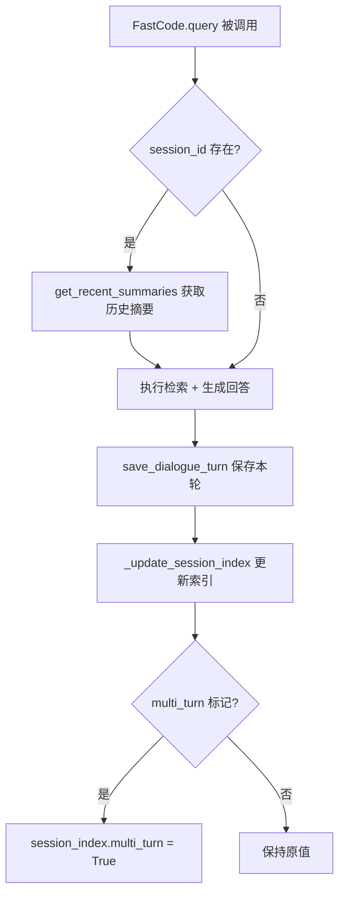
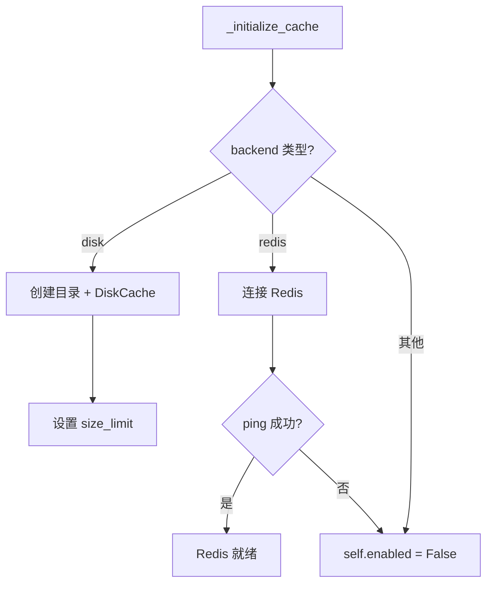
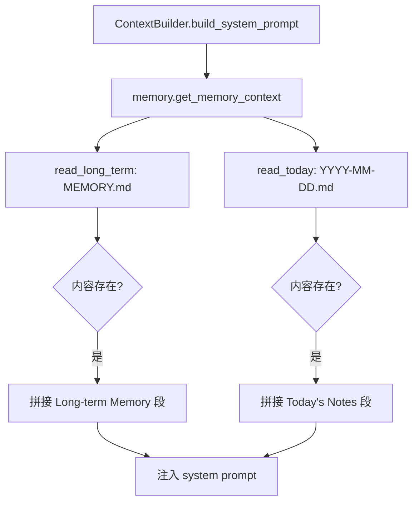
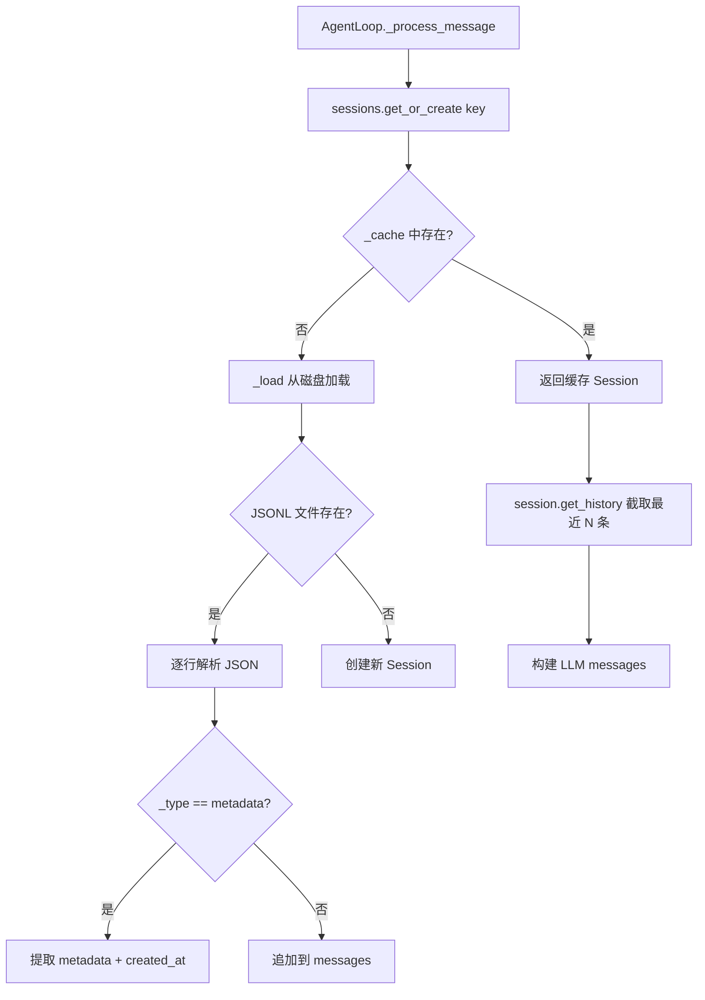

# PD-06.13 FastCode — 三层记忆与对话持久化

> 文档编号：PD-06.13
> 来源：FastCode `fastcode/cache.py` `nanobot/nanobot/agent/memory.py` `nanobot/nanobot/session/manager.py`
> GitHub：https://github.com/HKUDS/FastCode.git
> 问题域：PD-06 记忆持久化 Memory Persistence
> 状态：可复用方案

---

## 第 1 章 问题与动机

### 1.1 核心问题

Agent 系统在多轮对话、跨会话、跨子系统场景下，需要在不同层级持久化不同类型的信息：

1. **对话历史**：多轮代码问答中，前几轮的查询、回答、检索结果需要被后续轮次引用，以实现上下文连贯的代码理解
2. **Agent 工作记忆**：Agent 在执行任务过程中积累的每日笔记和长期知识（用户偏好、项目背景），需要跨会话保留
3. **会话状态**：多渠道（Telegram、飞书、CLI）接入时，每个渠道的对话历史需要独立持久化并支持恢复

FastCode 的独特之处在于它是一个**双子系统**架构：FastCode 核心（代码理解引擎）和 Nanobot（Agent 框架）各自有独立的记忆需求，但共享同一个用户交互流。

### 1.2 FastCode 的解法概述

FastCode 采用三层记忆架构，每层解决不同粒度的持久化需求：

1. **CacheManager（对话缓存层）**：基于 diskcache/Redis 的 KV 存储，以 `dialogue_{session_id}_turn_{N}` 为键持久化每轮对话的完整数据（query、answer、summary、retrieved_elements），支持 30 天 TTL 自动过期（`fastcode/cache.py:16-464`）
2. **MemoryStore（Agent 记忆层）**：基于文件系统的 Markdown 存储，分为每日笔记（`memory/YYYY-MM-DD.md`）和长期记忆（`MEMORY.md`），通过 `get_memory_context()` 注入 LLM 系统提示（`nanobot/nanobot/agent/memory.py:9-109`）
3. **SessionManager（会话持久化层）**：基于 JSONL 文件的会话历史存储，以 `channel:chat_id` 为键，支持多渠道独立会话和跨会话恢复（`nanobot/nanobot/session/manager.py:61-203`）

### 1.3 设计思想

| 设计原则 | 具体实现 | 理由 | 替代方案 |
|----------|----------|------|----------|
| 分层存储 | 三层各用不同后端（KV/文件/JSONL） | 不同数据类型有不同的访问模式和生命周期 | 统一用 SQLite（更复杂但查询更灵活） |
| 配置驱动 TTL | `dialogue_ttl` 从 config.yaml 读取，默认 30 天 | 不同场景对话保留时长不同 | 硬编码 TTL（不灵活） |
| 双后端可切换 | CacheManager 支持 disk/Redis 无缝切换 | 开发用 disk，生产用 Redis | 只支持一种后端 |
| 会话索引分离 | session_index 独立于 turn 数据存储 | 快速查询会话元数据而不加载全部轮次 | 每次遍历所有 turn 键 |
| JSONL 追加写入 | SessionManager 用 JSONL 而非 JSON | 支持增量写入，避免大文件全量重写 | JSON 全量写入（大会话性能差） |
| 内存缓存 + 磁盘持久化 | SessionManager 维护 `_cache` 字典 | 热会话直接内存读取，冷会话从磁盘加载 | 每次都读磁盘（慢） |

---

## 第 2 章 源码实现分析

### 2.1 架构概览

FastCode 的三层记忆系统在架构上分属两个子系统，通过 AgentLoop 和 FastCode 主类协调：

```
┌─────────────────────────────────────────────────────────────┐
│                      用户请求入口                            │
│              (Telegram / 飞书 / CLI / Web)                   │
└──────────────────────┬──────────────────────────────────────┘
                       │
          ┌────────────▼────────────┐
          │      AgentLoop          │
          │  (nanobot/agent/loop.py)│
          │                         │
          │  ┌───────────────────┐  │     ┌──────────────────────┐
          │  │  SessionManager   │◄─┼─────│ Layer 3: JSONL 会话   │
          │  │  (会话持久化层)    │  │     │ ~/.nanobot/sessions/  │
          │  └───────────────────┘  │     └──────────────────────┘
          │                         │
          │  ┌───────────────────┐  │     ┌──────────────────────┐
          │  │  ContextBuilder   │  │     │ Layer 2: Markdown 记忆│
          │  │  → MemoryStore    │◄─┼─────│ workspace/memory/     │
          │  │  (Agent 记忆层)   │  │     │ MEMORY.md + 日期.md   │
          │  └───────────────────┘  │     └──────────────────────┘
          └────────────┬────────────┘
                       │ (调用 FastCode 工具)
          ┌────────────▼────────────┐
          │      FastCode 主类       │
          │   (fastcode/main.py)    │
          │                         │
          │  ┌───────────────────┐  │     ┌──────────────────────┐
          │  │  CacheManager     │◄─┼─────│ Layer 1: diskcache/   │
          │  │  (对话缓存层)     │  │     │ Redis KV 存储         │
          │  └───────────────────┘  │     │ ./data/cache/         │
          └─────────────────────────┘     └──────────────────────┘
```

### 2.2 核心实现

#### Layer 1: CacheManager — 对话缓存层



对应源码 `fastcode/cache.py:209-260`：

```python
def save_dialogue_turn(self, session_id: str, turn_number: int,
                       query: str, answer: str, summary: str,
                       retrieved_elements: Optional[List[Dict[str, Any]]] = None,
                       metadata: Optional[Dict[str, Any]] = None) -> bool:
    if not self.enabled:
        return False
    try:
        turn_data = {
            "session_id": session_id,
            "turn_number": turn_number,
            "timestamp": time.time(),
            "query": query,
            "answer": answer,
            "summary": summary,
            "retrieved_elements": retrieved_elements or [],
            "metadata": metadata or {}
        }
        key = f"dialogue_{session_id}_turn_{turn_number}"
        self.set(key, turn_data, ttl=self.dialogue_ttl)
        multi_turn = (metadata or {}).get("multi_turn")
        self._update_session_index(session_id, turn_number, multi_turn=multi_turn)
        return True
    except Exception as e:
        self.logger.error(f"Failed to save dialogue turn: {e}")
        return False
```

CacheManager 的双后端初始化逻辑（`fastcode/cache.py:41-69`）：



对应源码 `fastcode/cache.py:41-69`：

```python
def _initialize_cache(self):
    if self.backend == "disk":
        Path(self.cache_directory).mkdir(parents=True, exist_ok=True)
        max_size_bytes = self.max_size_mb * 1024 * 1024
        self.cache = DiskCache(
            self.cache_directory,
            size_limit=max_size_bytes
        )
    elif self.backend == "redis":
        try:
            import redis
            self.cache = redis.Redis(
                host=os.getenv("REDIS_HOST", "localhost"),
                port=int(os.getenv("REDIS_PORT", 6379)),
                db=0, decode_responses=False
            )
            self.cache.ping()
        except Exception as e:
            self.enabled = False
    else:
        self.enabled = False
```

#### Layer 2: MemoryStore — Agent 记忆层



对应源码 `nanobot/nanobot/agent/memory.py:90-109`：

```python
def get_memory_context(self) -> str:
    parts = []
    long_term = self.read_long_term()
    if long_term:
        parts.append("## Long-term Memory\n" + long_term)
    today = self.read_today()
    if today:
        parts.append("## Today's Notes\n" + today)
    return "\n\n".join(parts) if parts else ""
```

每日笔记的追加写入（`nanobot/nanobot/agent/memory.py:32-44`）：

```python
def append_today(self, content: str) -> None:
    today_file = self.get_today_file()
    if today_file.exists():
        existing = today_file.read_text(encoding="utf-8")
        content = existing + "\n" + content
    else:
        header = f"# {today_date()}\n\n"
        content = header + content
    today_file.write_text(content, encoding="utf-8")
```

#### Layer 3: SessionManager — 会话持久化层



对应源码 `nanobot/nanobot/session/manager.py:100-134`：

```python
def _load(self, key: str) -> Session | None:
    path = self._get_session_path(key)
    if not path.exists():
        return None
    try:
        messages = []
        metadata = {}
        created_at = None
        with open(path) as f:
            for line in f:
                line = line.strip()
                if not line:
                    continue
                data = json.loads(line)
                if data.get("_type") == "metadata":
                    metadata = data.get("metadata", {})
                    created_at = datetime.fromisoformat(data["created_at"]) if data.get("created_at") else None
                else:
                    messages.append(data)
        return Session(
            key=key, messages=messages,
            created_at=created_at or datetime.now(),
            metadata=metadata
        )
    except Exception as e:
        logger.warning(f"Failed to load session {key}: {e}")
        return None
```

### 2.3 实现细节

**对话历史在查询流中的注入路径**（`fastcode/main.py:300-305`）：

查询时，FastCode 从 CacheManager 获取最近 N 轮摘要，传给 QueryProcessor 做查询改写，再传给 AnswerGenerator 做上下文感知回答：

```python
# fastcode/main.py:300-305
dialogue_history = []
if enable_multi_turn and session_id:
    history_summary_rounds = self.config.get("query", {}).get("history_summary_rounds", 10)
    dialogue_history = self.cache_manager.get_recent_summaries(session_id, history_summary_rounds)
```

**Session 的 JSONL 写入格式**（`nanobot/nanobot/session/manager.py:136-154`）：

第一行是 metadata 行（`_type: "metadata"`），后续每行是一条消息。这种设计允许 `list_sessions()` 只读第一行就获取会话元数据，无需加载全部消息。

**Session key 的命名规范**：`channel:chat_id`（如 `telegram:12345`、`feishu:group_abc`），通过 `safe_filename()` 转换为文件名安全格式存储在 `~/.nanobot/sessions/` 目录。

**CacheManager 的 session_index 设计**（`fastcode/cache.py:353-379`）：

每个 session 有一个独立的 index 键（`dialogue_session_{id}_index`），记录 `total_turns`、`created_at`、`last_updated`、`multi_turn` 标记。`multi_turn` 一旦设为 True 就不会回退，这是一个单向状态机设计。


---

## 第 3 章 迁移指南

### 3.1 迁移清单

**阶段 1：对话缓存层（CacheManager）**

- [ ] 安装依赖：`pip install diskcache` （可选 `redis`）
- [ ] 创建 `cache.py`，实现 `CacheManager` 类
- [ ] 配置 `cache` 段：`backend`、`ttl`、`dialogue_ttl`、`max_size_mb`、`cache_directory`
- [ ] 在主查询入口集成 `save_dialogue_turn` 和 `get_recent_summaries`
- [ ] 实现 session_index 的创建和更新逻辑

**阶段 2：Agent 记忆层（MemoryStore）**

- [ ] 创建 `memory.py`，实现 `MemoryStore` 类
- [ ] 定义 workspace 下的 `memory/` 目录结构
- [ ] 实现 `get_memory_context()` 并注入 LLM 系统提示
- [ ] 实现每日笔记的追加写入和历史回溯

**阶段 3：会话持久化层（SessionManager）**

- [ ] 创建 `session/manager.py`，实现 `Session` dataclass 和 `SessionManager`
- [ ] 定义 JSONL 文件格式（metadata 行 + message 行）
- [ ] 实现内存缓存 + 磁盘持久化的双层读取
- [ ] 在 AgentLoop 中集成 `get_or_create` 和 `save`

### 3.2 适配代码模板

以下是一个可直接复用的简化版三层记忆系统：

```python
"""三层记忆系统 — 从 FastCode 迁移的最小可用版本"""

import json
import time
import hashlib
from pathlib import Path
from datetime import datetime, timedelta
from dataclasses import dataclass, field
from typing import Any, Optional

from diskcache import Cache as DiskCache


# === Layer 1: 对话缓存层 ===

class DialogueCache:
    """基于 diskcache 的对话历史缓存，支持 TTL 自动过期"""

    def __init__(self, cache_dir: str = "./data/cache",
                 dialogue_ttl: int = 2592000,  # 30 days
                 max_size_mb: int = 1000):
        Path(cache_dir).mkdir(parents=True, exist_ok=True)
        self.cache = DiskCache(cache_dir, size_limit=max_size_mb * 1024 * 1024)
        self.dialogue_ttl = dialogue_ttl

    def save_turn(self, session_id: str, turn: int,
                  query: str, answer: str, summary: str) -> None:
        turn_data = {
            "session_id": session_id, "turn_number": turn,
            "timestamp": time.time(),
            "query": query, "answer": answer, "summary": summary,
        }
        self.cache.set(f"dlg_{session_id}_t{turn}", turn_data, expire=self.dialogue_ttl)
        # 更新 session index
        idx_key = f"dlg_idx_{session_id}"
        idx = self.cache.get(idx_key) or {"total_turns": 0, "created_at": time.time()}
        idx["total_turns"] = max(idx["total_turns"], turn)
        idx["last_updated"] = time.time()
        self.cache.set(idx_key, idx, expire=self.dialogue_ttl)

    def get_recent_summaries(self, session_id: str, n: int = 10) -> list[dict]:
        idx = self.cache.get(f"dlg_idx_{session_id}")
        if not idx:
            return []
        total = idx["total_turns"]
        start = max(1, total - n + 1)
        results = []
        for i in range(start, total + 1):
            turn = self.cache.get(f"dlg_{session_id}_t{i}")
            if turn:
                results.append({"turn": i, "query": turn["query"], "summary": turn["summary"]})
        return results


# === Layer 2: Agent 记忆层 ===

class MemoryStore:
    """基于 Markdown 文件的 Agent 记忆"""

    def __init__(self, workspace: Path):
        self.memory_dir = workspace / "memory"
        self.memory_dir.mkdir(parents=True, exist_ok=True)
        self.long_term_file = self.memory_dir / "MEMORY.md"

    def append_today(self, content: str) -> None:
        today = datetime.now().strftime("%Y-%m-%d")
        path = self.memory_dir / f"{today}.md"
        mode = "a" if path.exists() else "w"
        with open(path, mode, encoding="utf-8") as f:
            if mode == "w":
                f.write(f"# {today}\n\n")
            f.write(content + "\n")

    def get_context(self) -> str:
        parts = []
        if self.long_term_file.exists():
            parts.append("## Long-term Memory\n" + self.long_term_file.read_text(encoding="utf-8"))
        today = datetime.now().strftime("%Y-%m-%d")
        today_file = self.memory_dir / f"{today}.md"
        if today_file.exists():
            parts.append("## Today\n" + today_file.read_text(encoding="utf-8"))
        return "\n\n".join(parts)


# === Layer 3: 会话持久化层 ===

@dataclass
class Session:
    key: str
    messages: list[dict[str, Any]] = field(default_factory=list)
    created_at: datetime = field(default_factory=datetime.now)

    def add_message(self, role: str, content: str) -> None:
        self.messages.append({
            "role": role, "content": content,
            "timestamp": datetime.now().isoformat()
        })

    def get_history(self, max_messages: int = 50) -> list[dict]:
        recent = self.messages[-max_messages:]
        return [{"role": m["role"], "content": m["content"]} for m in recent]


class SessionManager:
    """JSONL 格式的会话持久化"""

    def __init__(self, sessions_dir: Path):
        self.sessions_dir = sessions_dir
        self.sessions_dir.mkdir(parents=True, exist_ok=True)
        self._cache: dict[str, Session] = {}

    def get_or_create(self, key: str) -> Session:
        if key in self._cache:
            return self._cache[key]
        session = self._load(key) or Session(key=key)
        self._cache[key] = session
        return session

    def _load(self, key: str) -> Session | None:
        path = self.sessions_dir / f"{key.replace(':', '_')}.jsonl"
        if not path.exists():
            return None
        messages, created_at = [], None
        with open(path) as f:
            for line in f:
                data = json.loads(line.strip())
                if data.get("_type") == "metadata":
                    created_at = datetime.fromisoformat(data["created_at"])
                else:
                    messages.append(data)
        return Session(key=key, messages=messages,
                       created_at=created_at or datetime.now())

    def save(self, session: Session) -> None:
        path = self.sessions_dir / f"{session.key.replace(':', '_')}.jsonl"
        with open(path, "w") as f:
            f.write(json.dumps({"_type": "metadata",
                                "created_at": session.created_at.isoformat()}) + "\n")
            for msg in session.messages:
                f.write(json.dumps(msg) + "\n")
        self._cache[session.key] = session
```

### 3.3 适用场景

| 场景 | 适用度 | 说明 |
|------|--------|------|
| 多轮代码问答系统 | ⭐⭐⭐ | CacheManager 的 summary 机制天然适合代码 QA 的上下文传递 |
| 多渠道 Agent 接入 | ⭐⭐⭐ | SessionManager 的 channel:chat_id 键设计直接支持 |
| 个人 AI 助手 | ⭐⭐⭐ | MemoryStore 的每日笔记 + 长期记忆模式非常适合 |
| 高并发生产环境 | ⭐⭐ | CacheManager 支持 Redis 后端，但 SessionManager 的文件写入无并发保护 |
| 需要语义检索记忆 | ⭐ | 三层均无向量检索能力，纯 KV/文件存储 |

---

## 第 4 章 测试用例

```python
"""基于 FastCode 真实函数签名的测试用例"""

import json
import time
import tempfile
from pathlib import Path
from datetime import datetime
import pytest


class TestCacheManagerDialogue:
    """测试 CacheManager 的对话持久化功能"""

    @pytest.fixture
    def cache_manager(self, tmp_path):
        from fastcode.cache import CacheManager
        config = {
            "cache": {
                "enabled": True,
                "backend": "disk",
                "ttl": 3600,
                "dialogue_ttl": 86400,
                "max_size_mb": 100,
                "cache_directory": str(tmp_path / "cache"),
                "cache_embeddings": False,
                "cache_queries": False,
            }
        }
        return CacheManager(config)

    def test_save_and_retrieve_dialogue_turn(self, cache_manager):
        """正常路径：保存并检索对话轮次"""
        cache_manager.save_dialogue_turn(
            session_id="test-session",
            turn_number=1,
            query="What does main.py do?",
            answer="It initializes the FastCode system.",
            summary="Asked about main.py functionality",
        )
        turn = cache_manager.get_dialogue_turn("test-session", 1)
        assert turn is not None
        assert turn["query"] == "What does main.py do?"
        assert turn["summary"] == "Asked about main.py functionality"

    def test_get_recent_summaries(self, cache_manager):
        """多轮摘要检索"""
        for i in range(1, 6):
            cache_manager.save_dialogue_turn(
                session_id="s1", turn_number=i,
                query=f"Q{i}", answer=f"A{i}", summary=f"Summary {i}",
            )
        summaries = cache_manager.get_recent_summaries("s1", num_rounds=3)
        assert len(summaries) == 3
        assert summaries[0]["turn_number"] == 3

    def test_session_index_multi_turn_flag(self, cache_manager):
        """multi_turn 标记的单向状态机"""
        cache_manager.save_dialogue_turn(
            session_id="s2", turn_number=1,
            query="Q1", answer="A1", summary="S1",
            metadata={"multi_turn": True},
        )
        idx = cache_manager._get_session_index("s2")
        assert idx["multi_turn"] is True

    def test_disabled_cache_returns_gracefully(self, tmp_path):
        """降级行为：缓存禁用时不报错"""
        config = {"cache": {"enabled": False}}
        cm = CacheManager(config)
        assert cm.save_dialogue_turn("s", 1, "q", "a", "s") is False
        assert cm.get_dialogue_history("s") == []

    def test_delete_session(self, cache_manager):
        """会话删除"""
        cache_manager.save_dialogue_turn(
            session_id="del-test", turn_number=1,
            query="Q", answer="A", summary="S",
        )
        assert cache_manager.delete_session("del-test") is True
        assert cache_manager.get_dialogue_turn("del-test", 1) is None


class TestMemoryStore:
    """测试 MemoryStore 的文件记忆功能"""

    @pytest.fixture
    def memory(self, tmp_path):
        from nanobot.nanobot.agent.memory import MemoryStore
        return MemoryStore(tmp_path)

    def test_append_and_read_today(self, memory):
        memory.append_today("Learned about FastCode caching")
        content = memory.read_today()
        assert "Learned about FastCode caching" in content

    def test_long_term_memory(self, memory):
        memory.write_long_term("User prefers Python 3.12")
        assert "Python 3.12" in memory.read_long_term()

    def test_get_memory_context_combines_both(self, memory):
        memory.write_long_term("Long-term fact")
        memory.append_today("Today's note")
        ctx = memory.get_memory_context()
        assert "Long-term Memory" in ctx
        assert "Today's Notes" in ctx

    def test_empty_memory_returns_empty(self, memory):
        assert memory.get_memory_context() == ""


class TestSessionManager:
    """测试 SessionManager 的 JSONL 持久化"""

    @pytest.fixture
    def manager(self, tmp_path):
        from nanobot.nanobot.session.manager import SessionManager
        return SessionManager(tmp_path)

    def test_create_and_persist_session(self, manager):
        session = manager.get_or_create("telegram:12345")
        session.add_message("user", "Hello")
        session.add_message("assistant", "Hi there!")
        manager.save(session)
        # 清除缓存，从磁盘重新加载
        manager._cache.clear()
        loaded = manager.get_or_create("telegram:12345")
        assert len(loaded.messages) == 2
        assert loaded.messages[0]["role"] == "user"

    def test_get_history_truncation(self, manager):
        session = manager.get_or_create("cli:test")
        for i in range(100):
            session.add_message("user", f"msg {i}")
        history = session.get_history(max_messages=10)
        assert len(history) == 10
        assert history[0]["content"] == "msg 90"

    def test_delete_session(self, manager):
        session = manager.get_or_create("test:del")
        session.add_message("user", "temp")
        manager.save(session)
        assert manager.delete("test:del") is True
        assert manager.delete("test:del") is False  # 已删除

    def test_list_sessions_reads_metadata_only(self, manager):
        session = manager.get_or_create("ch:1")
        session.add_message("user", "msg")
        manager.save(session)
        sessions = manager.list_sessions()
        assert len(sessions) >= 1
        assert "created_at" in sessions[0]
```


---

## 第 5 章 跨域关联

| 关联域 | 关系类型 | 说明 |
|--------|----------|------|
| PD-01 上下文管理 | 协同 | CacheManager 的 `get_recent_summaries` 通过摘要压缩历史，直接服务于上下文窗口管理；`history_summary_rounds` 配置控制注入 LLM 的历史轮数 |
| PD-04 工具系统 | 协同 | MemoryStore 通过 ContextBuilder 注入系统提示，为工具调用提供记忆上下文；FastCode 工具（`fastcode_query`）依赖 CacheManager 的多轮对话能力 |
| PD-08 搜索与检索 | 依赖 | 多轮对话中，前几轮的 `retrieved_elements` 被缓存在 CacheManager 中，后续轮次的查询改写依赖这些历史检索结果 |
| PD-09 Human-in-the-Loop | 协同 | SessionManager 的多渠道会话持久化支持用户在 Telegram/飞书等渠道与 Agent 交互，会话状态跨消息保持 |
| PD-11 可观测性 | 协同 | CacheManager 的 `get_stats()` 提供缓存命中率、存储大小等指标；`list_sessions()` 支持会话审计 |

---

## 第 6 章 来源文件索引

| 文件 | 行范围 | 关键实现 |
|------|--------|----------|
| `fastcode/cache.py` | L16-L27 | CacheManager 类定义，配置参数初始化 |
| `fastcode/cache.py` | L41-L69 | `_initialize_cache`：disk/Redis 双后端初始化 |
| `fastcode/cache.py` | L71-L76 | `_generate_key`：MD5 哈希键生成 |
| `fastcode/cache.py` | L78-L120 | `get`/`set`：双后端统一读写接口 |
| `fastcode/cache.py` | L209-L260 | `save_dialogue_turn`：对话轮次持久化核心 |
| `fastcode/cache.py` | L279-L320 | `get_dialogue_history`：按 session 检索历史 |
| `fastcode/cache.py` | L322-L351 | `get_recent_summaries`：摘要检索（注入 LLM） |
| `fastcode/cache.py` | L353-L379 | `_update_session_index`：会话索引维护 |
| `fastcode/cache.py` | L423-L463 | `list_sessions`：disk/Redis 会话枚举 |
| `nanobot/nanobot/agent/memory.py` | L9-L19 | MemoryStore 类定义，workspace 路径初始化 |
| `nanobot/nanobot/agent/memory.py` | L32-L44 | `append_today`：每日笔记追加写入 |
| `nanobot/nanobot/agent/memory.py` | L56-L80 | `get_recent_memories`：N 天历史回溯 |
| `nanobot/nanobot/agent/memory.py` | L90-L109 | `get_memory_context`：记忆上下文组装 |
| `nanobot/nanobot/session/manager.py` | L14-L58 | Session dataclass：消息存储与历史截取 |
| `nanobot/nanobot/session/manager.py` | L61-L76 | SessionManager 初始化，`_get_session_path` |
| `nanobot/nanobot/session/manager.py` | L100-L134 | `_load`：JSONL 文件解析与 Session 重建 |
| `nanobot/nanobot/session/manager.py` | L136-L154 | `save`：metadata 行 + messages 行写入 |
| `nanobot/nanobot/session/manager.py` | L176-L202 | `list_sessions`：只读 metadata 行的快速枚举 |
| `nanobot/nanobot/agent/loop.py` | L64 | AgentLoop 中 SessionManager 的注入 |
| `nanobot/nanobot/agent/loop.py` | L344 | `sessions.get_or_create(msg.session_key)` |
| `nanobot/nanobot/agent/loop.py` | L434-L437 | 会话保存：`session.add_message` + `sessions.save` |
| `nanobot/nanobot/agent/context.py` | L26 | ContextBuilder 中 MemoryStore 的初始化 |
| `nanobot/nanobot/agent/context.py` | L49 | `memory.get_memory_context()` 注入系统提示 |
| `fastcode/main.py` | L99 | FastCode 主类中 CacheManager 的初始化 |
| `fastcode/main.py` | L300-L305 | 查询时获取对话历史摘要 |
| `fastcode/main.py` | L406-L414 | 查询后保存对话轮次 |
| `config/config.yaml` | L183-L191 | 缓存配置段：backend、ttl、dialogue_ttl |

---

## 第 7 章 横向对比维度

> **重要：** 本章用于自动填充 Butcher Wiki 的横向对比表。

```json comparison_data
{
  "project": "FastCode",
  "dimensions": {
    "记忆结构": "三层分离：KV 对话缓存 + Markdown Agent 记忆 + JSONL 会话历史",
    "更新机制": "CacheManager 按轮次覆盖写入，MemoryStore 追加写入，SessionManager 全量重写",
    "事实提取": "无自动提取，依赖 Agent 主动调用 append_today/write_long_term",
    "存储方式": "diskcache/Redis + 文件系统 Markdown + JSONL 文件",
    "注入方式": "摘要注入 QueryProcessor + 记忆注入 system prompt + 历史注入 messages",
    "生命周期管理": "CacheManager 30天 TTL 自动过期，MemoryStore 永久，SessionManager 手动删除",
    "缓存失效策略": "diskcache size_limit 自动淘汰 + TTL 过期双重机制",
    "并发安全": "diskcache 内置文件锁，SessionManager 无并发保护",
    "多渠道会话隔离": "channel:chat_id 键设计，每渠道独立 JSONL 文件"
  }
}
```

### 域元数据补充

```json domain_metadata
{
  "solution_summary": "FastCode 三层分离架构：CacheManager 用 diskcache/Redis 持久化对话轮次(30天TTL)，MemoryStore 用 Markdown 文件存储 Agent 每日笔记+长期记忆，SessionManager 用 JSONL 持久化多渠道会话历史",
  "description": "双子系统（代码理解引擎+Agent框架）各自独立记忆需求的协调与分层",
  "sub_problems": [
    "双子系统记忆协调：代码理解引擎和 Agent 框架各自有独立记忆需求时如何分层而不冲突",
    "会话元数据快速枚举：如何在不加载全部消息的情况下快速列出所有会话的元信息",
    "多轮摘要注入策略：对话历史摘要应注入查询改写还是回答生成还是两者兼顾"
  ],
  "best_practices": [
    "JSONL 首行 metadata 设计：第一行存 _type:metadata，list_sessions 只读首行即可获取元信息",
    "multi_turn 单向状态机：会话一旦标记为多轮就不回退，避免状态抖动",
    "双后端统一接口：disk/Redis 通过 backend 字段切换，get/set 方法内部分支处理，调用方无感知"
  ]
}
```
