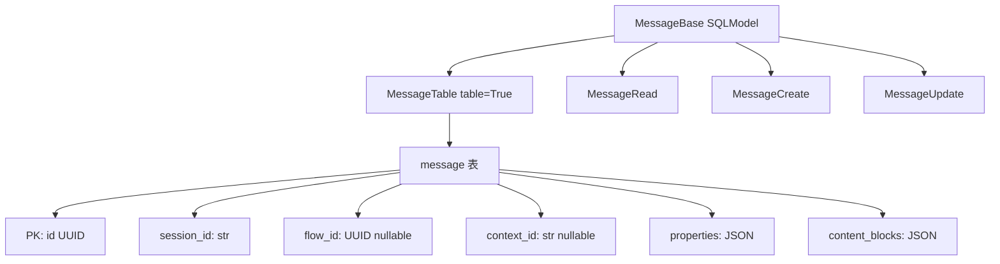
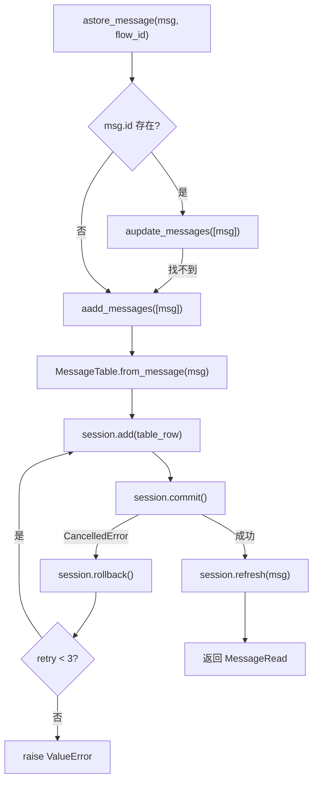
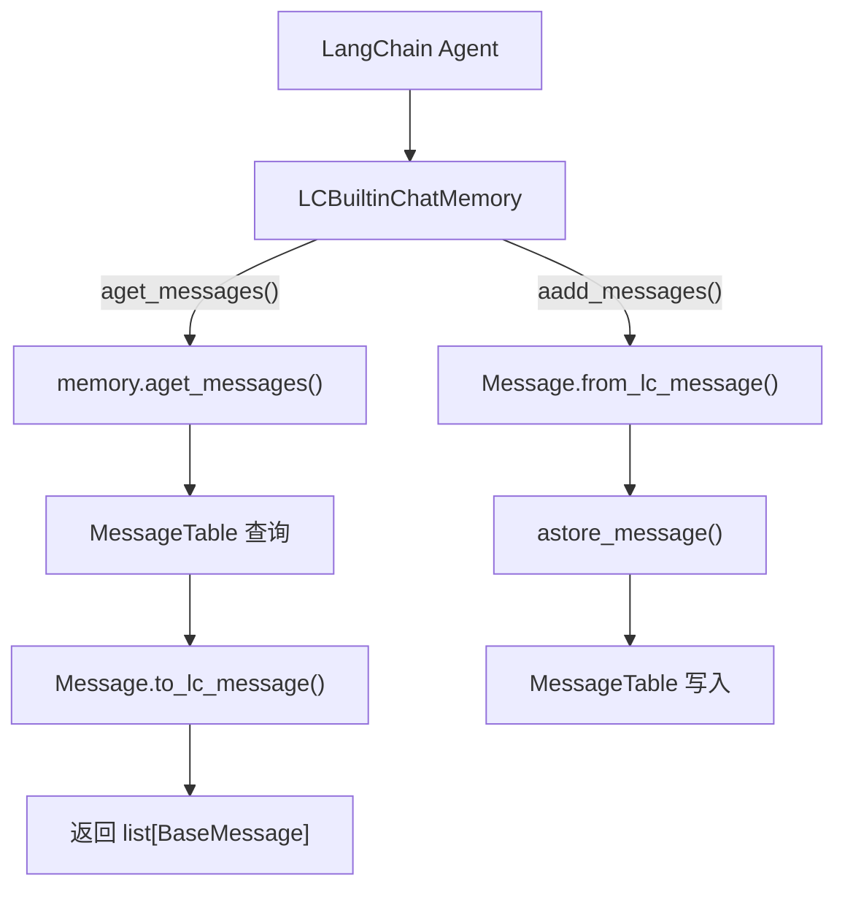

# PD-06.14 Langflow — SQLModel 消息持久化与三维会话查询

> 文档编号：PD-06.14
> 来源：Langflow `src/backend/base/langflow/memory.py`
> GitHub：https://github.com/langflow-ai/langflow.git
> 问题域：PD-06 记忆持久化 Memory Persistence
> 状态：可复用方案

---

## 第 1 章 问题与动机

### 1.1 核心问题

可视化 Agent 编排平台中，每个 Flow（工作流）可被多个用户在多个会话中反复调用。对话历史需要：

1. **持久化存储**：不能仅存内存，重启后必须恢复
2. **多维查询**：按 `session_id`（会话）、`flow_id`（工作流）、`context_id`（上下文）三个维度灵活过滤
3. **LangChain 兼容**：平台内置的 Memory 组件需要实现 `BaseChatMessageHistory` 接口，让 LangChain Agent 无缝使用
4. **Schema 演进**：随着功能迭代（content_blocks、properties、context_id），数据库表结构需要安全迁移
5. **异步并发安全**：多个 Flow 并行执行时，消息写入不能丢失或冲突

### 1.2 Langflow 的解法概述

Langflow 采用 **SQLModel + Alembic + AsyncSession** 三件套实现记忆持久化：

1. **MessageTable 模型**（`services/database/models/message/model.py:130`）：SQLModel ORM 模型，映射到 `message` 表，包含 sender/text/session_id/flow_id/context_id/properties/content_blocks 等字段
2. **模块级函数 API**（`memory.py:89-337`）：`aget_messages`/`aadd_messages`/`astore_message`/`adelete_messages` 四个核心异步函数，通过 `session_scope()` 上下文管理器获取数据库会话
3. **LCBuiltinChatMemory 适配器**（`memory.py:340-386`）：实现 LangChain 的 `BaseChatMessageHistory` 接口，将 LangChain 的 `BaseMessage` 与 Langflow 的 `Message` 双向转换
4. **Alembic 迁移链**：从 `325180f0c4e1`（创建 message 表）→ FK 约束移除 → `182e5471b900`（添加 context_id），安全演进 Schema
5. **CancelledError 重试**（`memory.py:179-228`）：`aadd_messagetables` 内置最多 3 次重试，处理 asyncio.CancelledError 导致的写入中断

### 1.3 设计思想

| 设计原则 | 具体实现 | 理由 | 替代方案 |
|----------|----------|------|----------|
| ORM 优于原始 SQL | SQLModel 定义 MessageTable，自动映射 | 类型安全 + 自动序列化 JSON 字段 | 原始 SQL + 手动序列化 |
| 模块级函数优于类方法 | `aget_messages()` 等为顶层 async 函数 | 任何组件都能直接 import 调用，无需实例化 | 单例 MemoryService 类 |
| 适配器模式兼容 LangChain | LCBuiltinChatMemory 包装 memory.py 函数 | 让 LangChain Agent 透明使用 Langflow 存储 | 要求用户自己实现 ChatHistory |
| FK 约束松绑 | 迁移移除 message→flow 外键 | 允许 Flow 删除后消息仍保留，避免级联删除 | 保留 FK + ON DELETE SET NULL |
| 三维查询模型 | session_id + flow_id + context_id | 同一 Flow 多会话、同一会话多上下文 | 单一 session_id 查询 |

---

## 第 2 章 源码实现分析

### 2.1 架构概览

```
┌─────────────────────────────────────────────────────────┐
│                    API Layer (FastAPI)                    │
│  monitor.py: GET/DELETE/PUT /monitor/messages             │
│  chat.py: build flow → store messages                     │
├─────────────────────────────────────────────────────────┤
│                  Memory Module (memory.py)                │
│  aget_messages() aadd_messages() astore_message()         │
│  adelete_messages() aupdate_messages()                    │
│  LCBuiltinChatMemory (LangChain adapter)                 │
├─────────────────────────────────────────────────────────┤
│              Database Layer (SQLModel + Alembic)          │
│  MessageTable ──→ "message" table                         │
│  session_scope() ──→ AsyncSession (commit/rollback)       │
│  DatabaseService ──→ SQLite/PostgreSQL engine              │
└─────────────────────────────────────────────────────────┘
```

核心数据流：Flow 执行 → 组件产出 Message → `astore_message()` → `MessageTable.from_message()` 转换 → `session.add()` + `session.commit()` → 持久化到 SQLite/PostgreSQL。

### 2.2 核心实现

#### 2.2.1 MessageTable 模型与三维查询



对应源码 `src/backend/base/langflow/services/database/models/message/model.py:18-176`：

```python
class MessageBase(SQLModel):
    timestamp: Annotated[datetime, str_to_timestamp_validator] = Field(
        default_factory=lambda: datetime.now(timezone.utc)
    )
    sender: str
    sender_name: str
    session_id: str
    context_id: str | None = Field(default=None)
    text: str = Field(sa_column=Column(Text))
    files: list[str] = Field(default_factory=list)
    error: bool = Field(default=False)
    edit: bool = Field(default=False)
    properties: Properties = Field(default_factory=Properties)
    category: str = Field(default="message")
    content_blocks: list[ContentBlock] = Field(default_factory=list)

class MessageTable(MessageBase, table=True):
    __tablename__ = "message"
    id: UUID = Field(default_factory=uuid4, primary_key=True)
    flow_id: UUID | None = Field(default=None)
    files: list[str] = Field(sa_column=Column(JSON))
    properties: dict | Properties = Field(
        default_factory=lambda: Properties().model_dump(), sa_column=Column(JSON)
    )
    content_blocks: list[dict | ContentBlock] = Field(
        default_factory=list, sa_column=Column(JSON)
    )
```

关键设计：`MessageBase` 作为共享基类，`MessageTable`（ORM 映射）、`MessageRead`（API 响应）、`MessageUpdate`（部分更新）均继承自它，实现了读写分离的 DTO 模式。

#### 2.2.2 动态查询构建器与消息存储



对应源码 `src/backend/base/langflow/memory.py:19-45`（动态查询）和 `memory.py:179-228`（重试写入）：

```python
def _get_variable_query(
    sender: str | None = None,
    sender_name: str | None = None,
    session_id: str | UUID | None = None,
    context_id: str | None = None,
    order_by: str | None = "timestamp",
    order: str | None = "DESC",
    flow_id: UUID | None = None,
    limit: int | None = None,
):
    stmt = select(MessageTable).where(MessageTable.error == False)
    if sender:
        stmt = stmt.where(MessageTable.sender == sender)
    if sender_name:
        stmt = stmt.where(MessageTable.sender_name == sender_name)
    if session_id:
        stmt = stmt.where(MessageTable.session_id == session_id)
    if context_id:
        stmt = stmt.where(MessageTable.context_id == context_id)
    if flow_id:
        stmt = stmt.where(MessageTable.flow_id == flow_id)
    if order_by:
        col = getattr(MessageTable, order_by).desc() if order == "DESC" \
              else getattr(MessageTable, order_by).asc()
        stmt = stmt.order_by(col)
    if limit:
        stmt = stmt.limit(limit)
    return stmt

async def aadd_messagetables(messages: list[MessageTable], session: AsyncSession,
                              retry_count: int = 0):
    max_retries = 3
    try:
        try:
            for message in messages:
                result = session.add(message)
                if asyncio.iscoroutine(result):
                    await result
            await session.commit()
        except asyncio.CancelledError:
            await session.rollback()
            if retry_count >= max_retries:
                raise ValueError("Add Message operation cancelled after multiple retries")
            return await aadd_messagetables(messages, session, retry_count + 1)
        for message in messages:
            await session.refresh(message)
    except asyncio.CancelledError as e:
        raise ValueError("Operation cancelled") from e
    # ... JSON 反序列化 properties/content_blocks
    return [MessageRead.model_validate(message, from_attributes=True) for message in new_messages]
```

#### 2.2.3 LangChain 适配器



对应源码 `src/backend/base/langflow/memory.py:340-386`：

```python
class LCBuiltinChatMemory(BaseChatMessageHistory):
    def __init__(self, flow_id: str, session_id: str,
                 context_id: str | None = None) -> None:
        self.flow_id = flow_id
        self.session_id = session_id
        self.context_id = context_id

    async def aget_messages(self) -> list[BaseMessage]:
        messages = await aget_messages(
            session_id=self.session_id, context_id=self.context_id,
        )
        return [m.to_lc_message() for m in messages if not m.error]

    async def aadd_messages(self, messages: Sequence[BaseMessage]) -> None:
        for lc_message in messages:
            message = Message.from_lc_message(lc_message)
            message.session_id = self.session_id
            message.context_id = self.context_id
            await astore_message(message, flow_id=self.flow_id)
```

### 2.3 实现细节

**Properties 与 ContentBlock 的 JSON 序列化**：`MessageTable` 将 `properties`（含 source、usage、feedback 等元数据）和 `content_blocks`（多模态内容块：text/code/media/tool_use/error/json）存储为 JSON 列。`field_validator` 在读取时自动将 JSON 字符串反序列化为 Pydantic 模型，`field_serializer` 在写入时序列化回 dict（`model.py:155-175`）。

**session_scope 事务管理**：所有数据库操作通过 `session_scope()` 上下文管理器（`deps.py:159-177`），内部委托给 `lfx.services.deps.session_scope`，确保 commit-on-success / rollback-on-error 语义。

**Monitor API 的用户隔离**：`api/v1/monitor.py:66-99` 的 `get_messages` 端点通过 `JOIN Flow WHERE Flow.user_id == current_user.id` 实现用户级数据隔离，防止跨用户读取消息。

**Schema 演进策略**：Alembic 迁移采用 "create temp → copy data → drop original → rename" 模式处理 SQLite 的 ALTER TABLE 限制（`1b8b740a6fa3` 迁移），同时用 `inspector.get_columns()` 做幂等检查（`182e5471b900` 迁移）。


---

## 第 3 章 迁移指南

### 3.1 迁移清单

**阶段 1：数据模型定义**
- [ ] 安装依赖：`sqlmodel`, `alembic`, `aiosqlite`（SQLite）或 `psycopg`（PostgreSQL）
- [ ] 定义 MessageBase 基类，包含 sender/text/session_id/timestamp 核心字段
- [ ] 定义 MessageTable（ORM 映射）、MessageRead（响应 DTO）、MessageUpdate（部分更新 DTO）
- [ ] 为 JSON 字段（properties、content_blocks）添加 field_validator/field_serializer

**阶段 2：存储层实现**
- [ ] 实现 session_scope() 上下文管理器（commit/rollback 语义）
- [ ] 实现 aget_messages()：动态查询构建，支持多维过滤
- [ ] 实现 aadd_messages()：批量写入 + CancelledError 重试
- [ ] 实现 astore_message()：upsert 语义（有 id 则更新，无则插入）
- [ ] 实现 adelete_messages()：按 session_id 或 context_id 删除

**阶段 3：LangChain 兼容（可选）**
- [ ] 实现 BaseChatMessageHistory 子类
- [ ] 实现 Message ↔ BaseMessage 双向转换

**阶段 4：Schema 迁移**
- [ ] 初始化 Alembic 配置
- [ ] 为新增字段编写迁移脚本（幂等检查 + SQLite 兼容）

### 3.2 适配代码模板

以下是一个可直接运行的最小化实现，基于 Langflow 的核心模式：

```python
"""Minimal memory persistence module inspired by Langflow."""
import asyncio
from contextlib import asynccontextmanager
from datetime import datetime, timezone
from uuid import UUID, uuid4

from sqlalchemy.ext.asyncio import AsyncEngine, async_sessionmaker, create_async_engine
from sqlmodel import JSON, Column, Field, SQLModel, Text, col, select
from sqlmodel.ext.asyncio.session import AsyncSession

# --- 1. 数据模型 ---

class MessageBase(SQLModel):
    timestamp: datetime = Field(default_factory=lambda: datetime.now(timezone.utc))
    sender: str
    sender_name: str
    session_id: str
    context_id: str | None = None
    text: str = Field(sa_column=Column(Text))
    error: bool = False
    properties: dict = Field(default_factory=dict, sa_column=Column(JSON))

class MessageTable(MessageBase, table=True):
    __tablename__ = "message"
    id: UUID = Field(default_factory=uuid4, primary_key=True)
    flow_id: UUID | None = None

class MessageRead(MessageBase):
    id: UUID
    flow_id: UUID | None = None

# --- 2. 会话管理 ---

_engine: AsyncEngine | None = None
_session_maker: async_sessionmaker | None = None

def init_db(database_url: str = "sqlite+aiosqlite:///memory.db"):
    global _engine, _session_maker
    _engine = create_async_engine(database_url)
    _session_maker = async_sessionmaker(_engine, class_=AsyncSession, expire_on_commit=False)

@asynccontextmanager
async def session_scope():
    async with _session_maker() as session:
        try:
            yield session
            await session.commit()
        except Exception:
            await session.rollback()
            raise

# --- 3. CRUD 操作 ---

async def aget_messages(
    session_id: str | None = None,
    flow_id: UUID | None = None,
    context_id: str | None = None,
    limit: int | None = None,
) -> list[MessageRead]:
    stmt = select(MessageTable).where(MessageTable.error == False)
    if session_id:
        stmt = stmt.where(MessageTable.session_id == session_id)
    if flow_id:
        stmt = stmt.where(MessageTable.flow_id == flow_id)
    if context_id:
        stmt = stmt.where(MessageTable.context_id == context_id)
    stmt = stmt.order_by(MessageTable.timestamp.desc())
    if limit:
        stmt = stmt.limit(limit)
    async with session_scope() as session:
        results = await session.exec(stmt)
        return [MessageRead.model_validate(r, from_attributes=True) for r in results]

async def aadd_message(
    text: str, sender: str, sender_name: str,
    session_id: str, flow_id: UUID | None = None,
    context_id: str | None = None,
    max_retries: int = 3,
) -> MessageRead:
    msg = MessageTable(
        text=text, sender=sender, sender_name=sender_name,
        session_id=session_id, flow_id=flow_id, context_id=context_id,
    )
    for attempt in range(max_retries + 1):
        try:
            async with session_scope() as session:
                session.add(msg)
                await session.flush()
                await session.refresh(msg)
                return MessageRead.model_validate(msg, from_attributes=True)
        except asyncio.CancelledError:
            if attempt >= max_retries:
                raise ValueError("Message write cancelled after retries") from None
            continue

async def adelete_messages(session_id: str) -> None:
    from sqlalchemy import delete
    async with session_scope() as session:
        await session.exec(
            delete(MessageTable)
            .where(col(MessageTable.session_id) == session_id)
        )
```

### 3.3 适用场景

| 场景 | 适用度 | 说明 |
|------|--------|------|
| 可视化 Agent 编排平台 | ⭐⭐⭐ | 完美匹配：多 Flow × 多会话 × 多上下文 |
| 单 Agent 对话应用 | ⭐⭐⭐ | 简化为 session_id 单维查询即可 |
| 多租户 SaaS | ⭐⭐⭐ | 通过 Flow→User JOIN 实现用户隔离 |
| 高并发实时聊天 | ⭐⭐ | SQLite 写锁可能成为瓶颈，需切换 PostgreSQL |
| 需要向量检索的记忆 | ⭐ | 纯关系型存储，无 embedding 支持，需额外集成 |

---

## 第 4 章 测试用例

```python
"""Tests for Langflow-style memory persistence."""
import asyncio
import pytest
from uuid import uuid4

# 假设上述适配代码已保存为 memory_store.py
from memory_store import (
    init_db, aget_messages, aadd_message, adelete_messages,
    MessageTable, session_scope,
)
from sqlmodel import SQLModel


@pytest.fixture(autouse=True)
async def setup_db():
    """每个测试使用独立的内存数据库。"""
    init_db("sqlite+aiosqlite:///:memory:")
    from memory_store import _engine
    async with _engine.begin() as conn:
        await conn.run_sync(SQLModel.metadata.create_all)
    yield
    async with _engine.begin() as conn:
        await conn.run_sync(SQLModel.metadata.drop_all)


class TestMessageCRUD:
    @pytest.mark.asyncio
    async def test_add_and_retrieve_message(self):
        """正常路径：写入消息后能按 session_id 查询到。"""
        flow_id = uuid4()
        msg = await aadd_message(
            text="Hello", sender="User", sender_name="Alice",
            session_id="sess-001", flow_id=flow_id,
        )
        assert msg.text == "Hello"
        assert msg.id is not None

        results = await aget_messages(session_id="sess-001")
        assert len(results) == 1
        assert results[0].sender_name == "Alice"

    @pytest.mark.asyncio
    async def test_multi_dimension_query(self):
        """三维查询：session_id + flow_id + context_id 组合过滤。"""
        flow_a, flow_b = uuid4(), uuid4()
        await aadd_message("msg1", "User", "A", "sess-1", flow_a, "ctx-1")
        await aadd_message("msg2", "User", "A", "sess-1", flow_a, "ctx-2")
        await aadd_message("msg3", "User", "B", "sess-1", flow_b, "ctx-1")

        # 按 context_id 过滤
        results = await aget_messages(session_id="sess-1", context_id="ctx-1")
        assert len(results) == 2

        # 按 flow_id 过滤
        results = await aget_messages(flow_id=flow_a)
        assert len(results) == 2

    @pytest.mark.asyncio
    async def test_delete_by_session(self):
        """删除：按 session_id 批量删除。"""
        await aadd_message("msg1", "User", "A", "sess-del")
        await aadd_message("msg2", "User", "A", "sess-del")
        await aadd_message("msg3", "User", "B", "sess-keep")

        await adelete_messages("sess-del")

        assert len(await aget_messages(session_id="sess-del")) == 0
        assert len(await aget_messages(session_id="sess-keep")) == 1

    @pytest.mark.asyncio
    async def test_error_messages_excluded(self):
        """边界情况：error=True 的消息不出现在查询结果中。"""
        async with session_scope() as session:
            msg = MessageTable(
                text="error msg", sender="Machine", sender_name="Bot",
                session_id="sess-err", error=True,
            )
            session.add(msg)

        results = await aget_messages(session_id="sess-err")
        assert len(results) == 0  # error 消息被 WHERE error=False 过滤

    @pytest.mark.asyncio
    async def test_limit_query(self):
        """边界情况：limit 参数限制返回数量。"""
        for i in range(10):
            await aadd_message(f"msg-{i}", "User", "A", "sess-limit")

        results = await aget_messages(session_id="sess-limit", limit=3)
        assert len(results) == 3

    @pytest.mark.asyncio
    async def test_cancelled_error_retry(self):
        """降级行为：CancelledError 触发重试最终成功。"""
        # 此测试验证重试逻辑的存在性
        # 实际 CancelledError 在 build_public_tmp 场景下触发
        msg = await aadd_message(
            text="retry test", sender="User", sender_name="Test",
            session_id="sess-retry",
        )
        assert msg.text == "retry test"
```


---

## 第 5 章 跨域关联

| 关联域 | 关系类型 | 说明 |
|--------|----------|------|
| PD-01 上下文管理 | 协同 | 记忆持久化为上下文注入提供数据源；`aget_messages(limit=N)` 控制注入量 |
| PD-02 多 Agent 编排 | 协同 | 多 Flow 并行执行时共享同一 message 表，通过 flow_id 隔离 |
| PD-03 容错与重试 | 依赖 | `aadd_messagetables` 的 CancelledError 重试机制直接属于容错范畴 |
| PD-04 工具系统 | 协同 | ContentBlock 中的 ToolContent 类型记录工具调用结果，持久化工具执行历史 |
| PD-07 质量检查 | 协同 | Properties.positive_feedback 字段支持用户对消息质量的反馈标记 |
| PD-10 中间件管道 | 协同 | Monitor API 的 session→message JOIN 查询可作为中间件的数据源 |
| PD-11 可观测性 | 协同 | Properties.usage（input_tokens/output_tokens）和 build_duration 提供 LLM 调用成本追踪 |

---

## 第 6 章 来源文件索引

| 文件 | 行范围 | 关键实现 |
|------|--------|----------|
| `src/backend/base/langflow/memory.py` | L19-45 | `_get_variable_query` 动态查询构建器 |
| `src/backend/base/langflow/memory.py` | L89-117 | `aget_messages` 异步消息检索 |
| `src/backend/base/langflow/memory.py` | L128-151 | `aadd_messages` 消息写入 + 类型校验 |
| `src/backend/base/langflow/memory.py` | L179-228 | `aadd_messagetables` CancelledError 重试 |
| `src/backend/base/langflow/memory.py` | L301-337 | `astore_message` upsert 语义 |
| `src/backend/base/langflow/memory.py` | L340-386 | `LCBuiltinChatMemory` LangChain 适配器 |
| `src/backend/base/langflow/services/database/models/message/model.py` | L18-127 | `MessageBase` + `from_message` 转换 |
| `src/backend/base/langflow/services/database/models/message/model.py` | L130-176 | `MessageTable` ORM 模型 + JSON 序列化 |
| `src/backend/base/langflow/services/database/models/message/crud.py` | L9-27 | `_update_message` 单条更新 |
| `src/backend/base/langflow/services/deps.py` | L159-177 | `session_scope` 事务上下文管理器 |
| `src/backend/base/langflow/services/database/service.py` | L42-78 | `DatabaseService` 引擎初始化 + 连接池 |
| `src/backend/base/langflow/services/session/service.py` | L14-64 | `SessionService` 缓存层会话管理 |
| `src/backend/base/langflow/api/v1/monitor.py` | L44-99 | Monitor API 消息查询 + 用户隔离 |
| `src/backend/base/langflow/api/v1/monitor.py` | L137-171 | `update_session_id` 会话重命名 |
| `src/backend/base/langflow/schema/properties.py` | L23-49 | `Properties` 模型（usage/feedback/state） |
| `src/backend/base/langflow/schema/content_block.py` | L27-62 | `ContentBlock` 多模态内容块 |
| `src/backend/base/langflow/alembic/versions/d066bfd22890_add_message_table.py` | L24-44 | 初始 message 表创建迁移 |
| `src/backend/base/langflow/alembic/versions/182e5471b900_add_context_message.py` | L21-40 | context_id 字段添加迁移 |
| `src/backend/base/langflow/alembic/versions/1b8b740a6fa3_remove_fk_constraint_in_message_.py` | L60-187 | FK 约束移除迁移（SQLite 兼容） |
| `src/backend/base/langflow/services/session/utils.py` | L9-18 | session_id 生成 + dict hash 计算 |

---

## 第 7 章 横向对比维度

> **重要：** 本章用于自动填充 Butcher Wiki 的横向对比表。

```json comparison_data
{
  "project": "Langflow",
  "dimensions": {
    "记忆结构": "MessageTable SQLModel 模型，含 text/sender/properties/content_blocks 字段",
    "更新机制": "upsert 语义：有 id 则 sqlmodel_update，无则 insert",
    "存储方式": "SQLite/PostgreSQL 关系型数据库，JSON 列存储元数据",
    "注入方式": "LCBuiltinChatMemory 适配 LangChain BaseChatMessageHistory",
    "生命周期管理": "按 session_id/context_id 批量删除，支持会话重命名",
    "并发安全": "AsyncSession + CancelledError 最多 3 次重试",
    "Schema 迁移": "Alembic 迁移链，SQLite 用 create-copy-rename 模式",
    "多渠道会话隔离": "session_id + flow_id + context_id 三维查询模型",
    "记忆检索": "动态 WHERE 子句构建，支持 sender/timestamp/limit 过滤",
    "记忆增长控制": "无自动清理，依赖 limit 参数和手动 delete API",
    "存储后端委托": "DatabaseService 统一管理引擎，session_scope 委托给 lfx",
    "事实提取": "无 LLM 提取，直接存储原始消息文本"
  }
}
```

### 域元数据补充

```json domain_metadata
{
  "solution_summary": "Langflow 用 SQLModel MessageTable + 三维查询（session_id/flow_id/context_id）实现可视化工作流的消息持久化，通过 LCBuiltinChatMemory 适配 LangChain 记忆接口",
  "description": "可视化编排平台中多 Flow 多会话的关系型消息持久化与 LangChain 兼容",
  "sub_problems": [
    "FK 约束松绑：Flow 删除后消息保留的外键策略选择",
    "CancelledError 写入中断：asyncio 取消信号导致 commit 失败的重试策略",
    "会话重命名：批量更新已有消息的 session_id 而不丢失关联",
    "多模态内容块序列化：ContentBlock 联合类型（text/code/media/tool_use）的 JSON 存储与反序列化"
  ],
  "best_practices": [
    "读写 DTO 分离：MessageTable/MessageRead/MessageUpdate 继承同一基类，避免 ORM 对象泄露到 API 层",
    "模块级函数优于单例服务：memory.py 的顶层函数让任何组件都能直接 import 调用，降低耦合",
    "error 消息默认过滤：查询时 WHERE error=False 自动排除错误消息，避免污染对话历史"
  ]
}
```

