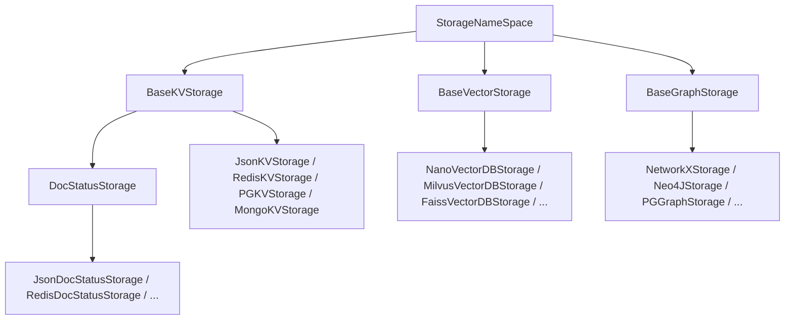
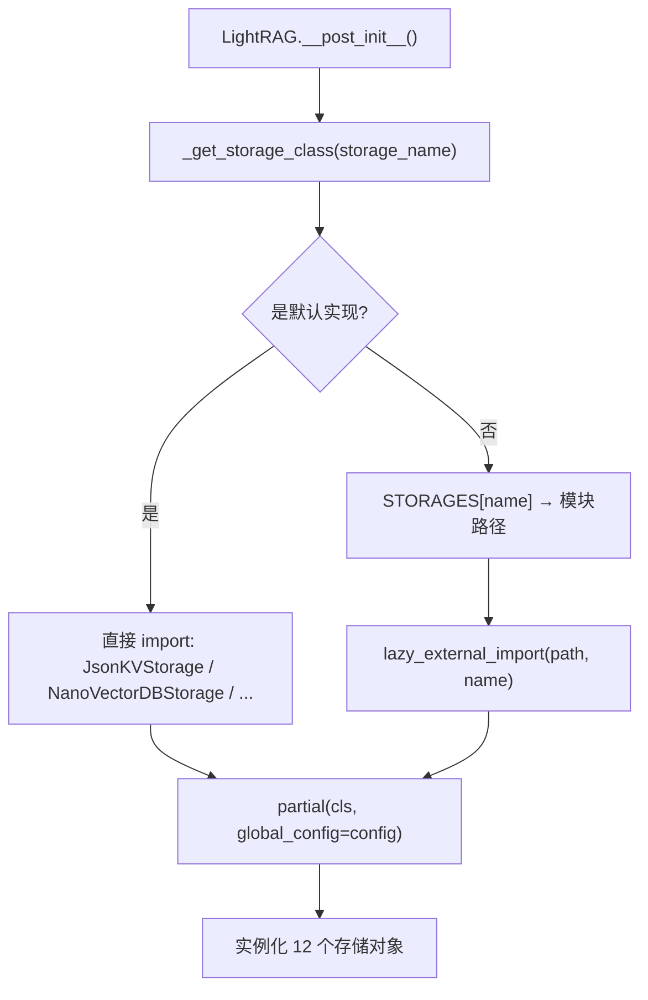
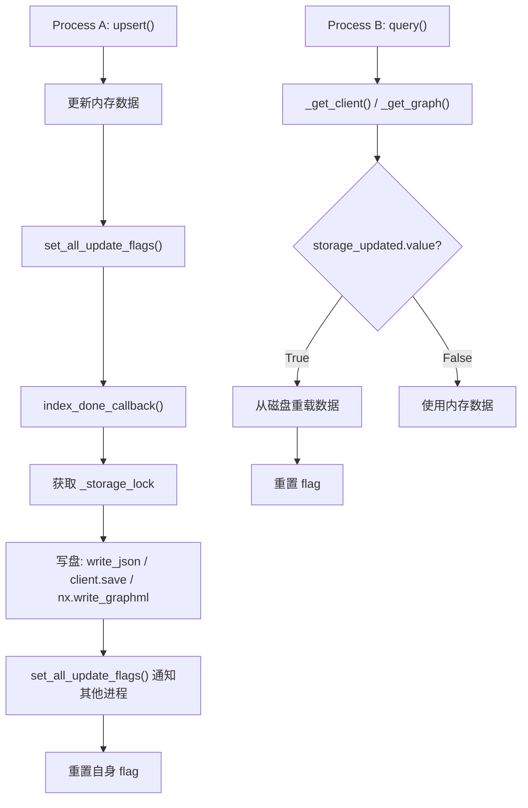

# PD-06.04 LightRAG — 四层可插拔存储抽象

> 文档编号：PD-06.04
> 来源：LightRAG `lightrag/base.py`, `lightrag/kg/__init__.py`, `lightrag/kg/shared_storage.py`
> GitHub：https://github.com/HKUDS/LightRAG.git
> 问题域：PD-06 记忆持久化 Memory Persistence
> 状态：可复用方案

---

## 第 1 章 问题与动机

### 1.1 核心问题

RAG 系统需要同时管理四种截然不同的数据形态：原始文档的 KV 元数据、向量嵌入、知识图谱的节点/边关系、以及文档处理状态。每种数据形态对存储后端的要求差异巨大——KV 需要快速精确查找，向量需要相似度检索，图需要遍历和度计算，状态需要按条件过滤。

更复杂的是，生产环境中不同团队对存储后端有不同偏好：有人用 PostgreSQL 统一管理，有人用 Redis 做缓存层，有人用 Neo4j 做图存储。如何让同一套 RAG 逻辑在不同存储后端间无缝切换，同时保证多进程部署下的数据一致性，是 LightRAG 要解决的核心持久化问题。

### 1.2 LightRAG 的解法概述

1. **四层抽象基类**：`StorageNameSpace` → `BaseKVStorage` / `BaseVectorStorage` / `BaseGraphStorage` / `DocStatusStorage`，每层定义标准接口契约（`lightrag/base.py:173-823`）
2. **STORAGES 注册表动态加载**：字符串名 → 模块路径映射，运行时按需 import 具体实现（`lightrag/kg/__init__.py:97-119`）
3. **Workspace 命名空间隔离**：通过 `{working_dir}/{workspace}/` 目录结构实现多租户数据物理隔离（`lightrag/kg/json_kv_impl.py:29-38`）
4. **延迟持久化 + Update Flag 跨进程协调**：内存操作 → `index_done_callback()` 批量落盘 → `set_all_update_flags()` 通知其他进程重载（`lightrag/kg/shared_storage.py:1176-1264`）
5. **KeyedUnifiedLock 统一锁管理**：支持 asyncio.Lock（单进程）和 multiprocessing.Lock（多进程）的透明切换（`lightrag/kg/shared_storage.py:529-654`）

### 1.3 设计思想

| 设计原则 | 具体实现 | 理由 | 替代方案 |
|----------|----------|------|----------|
| 接口与实现分离 | 4 个 ABC 基类定义契约，18+ 个具体实现 | 新增后端只需实现接口，不改核心逻辑 | 硬编码 if-else 分支 |
| 延迟持久化 | 内存操作 + `index_done_callback()` 批量写盘 | 避免每次 upsert 都触发 IO，提升吞吐 | 每次操作立即写盘 |
| 注册表模式 | `STORAGES` dict 映射类名→模块路径 | 支持懒加载，未使用的后端不会被 import | 全量 import 所有后端 |
| Workspace 物理隔离 | 目录级别隔离 `{wd}/{ws}/` | 简单可靠，不依赖数据库级别的租户隔离 | 数据库 schema 隔离 |
| 双层锁协调 | UnifiedLock 封装 asyncio + mp.Lock | 单进程用 asyncio 零开销，多进程自动升级 | 始终用 mp.Lock |

---

## 第 2 章 源码实现分析

### 2.1 架构概览

LightRAG 的存储层由三个核心组件构成：抽象基类层、注册表层、共享状态层。

```
┌─────────────────────────────────────────────────────────────────┐
│                     LightRAG 主类                                │
│  lightrag.py:561-658  12 个存储实例通过 partial() 注入配置        │
├─────────────────────────────────────────────────────────────────┤
│                    STORAGES 注册表                                │
│  kg/__init__.py:97-119  类名 → 模块路径映射，懒加载               │
├──────────┬──────────┬──────────┬──────────────────────────────────┤
│ KV 存储   │ 向量存储  │ 图存储    │ 文档状态存储                     │
│ Json     │ NanoVDB  │ NetworkX │ JsonDocStatus                    │
│ Redis    │ Milvus   │ Neo4j    │ RedisDocStatus                   │
│ PG       │ Faiss    │ PG       │ PGDocStatus                      │
│ Mongo    │ Qdrant   │ Mongo    │ MongoDocStatus                   │
│          │ PG       │ Memgraph │                                  │
├──────────┴──────────┴──────────┴──────────────────────────────────┤
│              shared_storage.py 共享状态层                          │
│  initialize_share_data() → _shared_dicts / _update_flags         │
│  KeyedUnifiedLock → 实体级细粒度锁                                │
│  NamespaceLock → 命名空间级锁                                     │
└─────────────────────────────────────────────────────────────────┘
```

### 2.2 核心实现

#### 2.2.1 四层抽象基类体系



对应源码 `lightrag/base.py:173-215`：

```python
@dataclass
class StorageNameSpace(ABC):
    namespace: str
    workspace: str
    global_config: dict[str, Any]

    async def initialize(self):
        """Initialize the storage"""
        pass

    async def finalize(self):
        """Finalize the storage"""
        pass

    @abstractmethod
    async def index_done_callback(self) -> None:
        """Commit the storage operations after indexing"""

    @abstractmethod
    async def drop(self) -> dict[str, str]:
        """Drop all data from storage and clean up resources"""
```

`StorageNameSpace` 是所有存储的根基类，定义了三个核心字段（`namespace`、`workspace`、`global_config`）和两个生命周期钩子（`initialize`/`finalize`），以及两个抽象方法（`index_done_callback`/`drop`）。每个具体存储类型在此基础上扩展自己的 CRUD 接口。

`BaseVectorStorage`（`lightrag/base.py:218-353`）额外定义了 `embedding_func`、`cosine_better_than_threshold`、向量压缩后缀生成等向量特有逻辑。`BaseGraphStorage`（`lightrag/base.py:405-702`）定义了节点/边的 CRUD 以及批量操作的默认实现（逐个调用，子类可覆盖为批量查询）。

#### 2.2.2 STORAGES 注册表与动态加载



对应源码 `lightrag/kg/__init__.py:97-119` 和 `lightrag/lightrag.py:1098-1120`：

```python
# kg/__init__.py:97-119 — 注册表
STORAGES = {
    "NetworkXStorage": ".kg.networkx_impl",
    "JsonKVStorage": ".kg.json_kv_impl",
    "NanoVectorDBStorage": ".kg.nano_vector_db_impl",
    "Neo4JStorage": ".kg.neo4j_impl",
    "MilvusVectorDBStorage": ".kg.milvus_impl",
    "MongoKVStorage": ".kg.mongo_impl",
    "RedisKVStorage": ".kg.redis_impl",
    "PGKVStorage": ".kg.postgres_impl",
    "FaissVectorDBStorage": ".kg.faiss_impl",
    "QdrantVectorDBStorage": ".kg.qdrant_impl",
    # ... 共 18 个实现
}

# lightrag.py:1098-1120 — 动态加载
def _get_storage_class(self, storage_name: str):
    if storage_name == "JsonKVStorage":
        from lightrag.kg.json_kv_impl import JsonKVStorage
        return JsonKVStorage
    # ... 其他默认实现直接 import
    else:
        import_path = STORAGES[storage_name]
        storage_class = lazy_external_import(import_path, storage_name)
        return storage_class
```

注册表同时配套 `STORAGE_IMPLEMENTATIONS`（`kg/__init__.py:1-42`）定义每种存储类型的合法实现列表和必需方法，以及 `STORAGE_ENV_REQUIREMENTS`（`kg/__init__.py:45-94`）定义每个实现所需的环境变量。`verify_storage_implementation()`（`kg/__init__.py:122-141`）在初始化时校验兼容性。

#### 2.2.3 延迟持久化与跨进程协调



对应源码 `lightrag/kg/nano_vector_db_impl.py:273-306`（向量存储的 `index_done_callback`）：

```python
async def index_done_callback(self) -> bool:
    """Save data to disk"""
    async with self._storage_lock:
        if self.storage_updated.value:
            # 被其他进程更新过，重载而非保存
            self._client = NanoVectorDB(
                self.embedding_func.embedding_dim,
                storage_file=self._client_file_name,
            )
            self.storage_updated.value = False
            return False

    async with self._storage_lock:
        try:
            self._client.save()
            await set_all_update_flags(self.namespace, workspace=self.workspace)
            self.storage_updated.value = False
            return True
        except Exception as e:
            logger.error(f"[{self.workspace}] Error saving data for {self.namespace}: {e}")
            return False
```

### 2.3 实现细节

**向量压缩策略**（`nano_vector_db_impl.py:129-133`）：NanoVectorDB 存储使用三级压缩管线 `float32 → float16 → zlib → base64`，在保持检索精度的同时将存储体积压缩约 4 倍。

**Workspace 目录隔离**：每个存储实现在 `__post_init__` 中根据 `workspace` 参数创建独立子目录。文件命名规则统一为 `{type}_{namespace}.{ext}`：
- KV: `kv_store_{namespace}.json`
- Vector: `vdb_{namespace}.json`
- Graph: `graph_{namespace}.graphml`

**12 个存储实例**（`lightrag.py:584-658`）：LightRAG 主类在初始化时创建 7 个 KV 存储（full_docs、text_chunks、full_entities、full_relations、entity_chunks、relation_chunks、llm_response_cache）、3 个向量存储（entities_vdb、relationships_vdb、chunks_vdb）、1 个图存储（chunk_entity_relation_graph）、1 个文档状态存储（doc_status），全部通过 `partial()` 注入 `global_config`。

**共享状态初始化**（`shared_storage.py:1176-1264`）：`initialize_share_data(workers)` 根据 worker 数量决定使用 `asyncio.Lock`（单进程）还是 `multiprocessing.Manager().Lock()`（多进程），创建共享字典 `_shared_dicts`、初始化标记 `_init_flags`、更新标记 `_update_flags`。

---

## 第 3 章 迁移指南

### 3.1 迁移清单

**阶段一：定义抽象层（1 天）**

- [ ] 定义 `StorageNameSpace` 基类，包含 `namespace`、`workspace`、`global_config` 三个字段
- [ ] 定义 `BaseKVStorage`、`BaseVectorStorage`、`BaseGraphStorage` 抽象基类
- [ ] 每个基类声明 `@abstractmethod` 的 CRUD 方法和 `index_done_callback()`
- [ ] 定义 `DocStatusStorage` 继承 `BaseKVStorage`，增加状态查询方法

**阶段二：实现默认后端（2 天）**

- [ ] 实现 `JsonKVStorage`：JSON 文件读写 + 内存缓存
- [ ] 实现 `NanoVectorDBStorage`：NanoVectorDB + Float16 压缩
- [ ] 实现 `NetworkXStorage`：GraphML 文件 + NetworkX 内存图
- [ ] 实现 `JsonDocStatusStorage`：JSON 文件 + 状态过滤

**阶段三：注册表与动态加载（0.5 天）**

- [ ] 创建 `STORAGES` 注册表字典（类名 → 模块路径）
- [ ] 实现 `_get_storage_class()` 方法：默认实现直接 import，其他走 `lazy_external_import`
- [ ] 实现 `verify_storage_implementation()` 校验兼容性

**阶段四：多进程协调（1 天）**

- [ ] 实现 `shared_storage.py`：`initialize_share_data(workers)` 初始化共享状态
- [ ] 实现 `UnifiedLock`：封装 asyncio.Lock 和 mp.Lock 的统一接口
- [ ] 实现 `KeyedUnifiedLock`：实体级细粒度锁，支持排序防死锁
- [ ] 实现 update flag 机制：`get_update_flag()` / `set_all_update_flags()`

### 3.2 适配代码模板

以下是一个最小可运行的四层存储抽象框架：

```python
"""可插拔存储抽象框架 — 从 LightRAG 提炼的最小实现"""
from abc import ABC, abstractmethod
from dataclasses import dataclass, field
from typing import Any, Dict, Optional
import asyncio
import json
import os


# ── 第 1 层：基类 ──────────────────────────────────────────

@dataclass
class StorageNameSpace(ABC):
    namespace: str
    workspace: str
    global_config: Dict[str, Any]

    async def initialize(self):
        pass

    async def finalize(self):
        pass

    @abstractmethod
    async def index_done_callback(self) -> None:
        """批量持久化入口"""

    @abstractmethod
    async def drop(self) -> Dict[str, str]:
        """清空所有数据"""


@dataclass
class BaseKVStorage(StorageNameSpace, ABC):
    @abstractmethod
    async def get_by_id(self, id: str) -> Optional[Dict[str, Any]]:
        ...

    @abstractmethod
    async def upsert(self, data: Dict[str, Dict[str, Any]]) -> None:
        ...

    @abstractmethod
    async def delete(self, ids: list[str]) -> None:
        ...


# ── 第 2 层：JSON 实现 ─────────────────────────────────────

@dataclass
class JsonKVStorage(BaseKVStorage):
    _data: Dict[str, Any] = field(default_factory=dict, init=False)
    _file_path: str = field(default="", init=False)
    _lock: asyncio.Lock = field(default_factory=asyncio.Lock, init=False)
    _dirty: bool = field(default=False, init=False)

    async def initialize(self):
        wd = self.global_config["working_dir"]
        ws_dir = os.path.join(wd, self.workspace) if self.workspace else wd
        os.makedirs(ws_dir, exist_ok=True)
        self._file_path = os.path.join(ws_dir, f"kv_store_{self.namespace}.json")
        if os.path.exists(self._file_path):
            with open(self._file_path, "r") as f:
                self._data = json.load(f)

    async def get_by_id(self, id: str) -> Optional[Dict[str, Any]]:
        async with self._lock:
            return self._data.get(id)

    async def upsert(self, data: Dict[str, Dict[str, Any]]) -> None:
        async with self._lock:
            self._data.update(data)
            self._dirty = True

    async def delete(self, ids: list[str]) -> None:
        async with self._lock:
            for id in ids:
                self._data.pop(id, None)
            self._dirty = True

    async def index_done_callback(self) -> None:
        async with self._lock:
            if self._dirty:
                with open(self._file_path, "w") as f:
                    json.dump(self._data, f, ensure_ascii=False)
                self._dirty = False

    async def drop(self) -> Dict[str, str]:
        async with self._lock:
            self._data.clear()
            self._dirty = True
        await self.index_done_callback()
        return {"status": "success", "message": "data dropped"}


# ── 第 3 层：注册表 ────────────────────────────────────────

STORAGES = {
    "JsonKVStorage": "my_project.storage.json_kv",
    # 新增后端只需在此注册
}

def get_storage_class(name: str):
    if name == "JsonKVStorage":
        return JsonKVStorage
    module_path = STORAGES[name]
    import importlib
    mod = importlib.import_module(module_path)
    return getattr(mod, name)
```

### 3.3 适用场景

| 场景 | 适用度 | 说明 |
|------|--------|------|
| RAG 系统需要多种存储后端 | ⭐⭐⭐ | 核心场景，四层抽象完美匹配 |
| 多租户 SaaS 部署 | ⭐⭐⭐ | Workspace 隔离机制开箱即用 |
| Gunicorn 多 Worker 部署 | ⭐⭐⭐ | shared_storage 的多进程协调专为此设计 |
| 单进程轻量部署 | ⭐⭐ | 可用但 shared_storage 层略显冗余 |
| 需要实时一致性的场景 | ⭐ | 延迟持久化模型不适合强一致性需求 |

---

## 第 4 章 测试用例

```python
"""基于 LightRAG 存储抽象的测试用例"""
import pytest
import asyncio
import json
import os
import tempfile
from unittest.mock import AsyncMock, MagicMock, patch


class TestStorageNameSpace:
    """测试存储命名空间基类"""

    def test_workspace_directory_isolation(self, tmp_path):
        """验证 workspace 创建独立子目录"""
        working_dir = str(tmp_path)
        workspace = "tenant_a"
        expected_dir = os.path.join(working_dir, workspace)

        # 模拟 JsonKVStorage.__post_init__ 的目录创建逻辑
        workspace_dir = os.path.join(working_dir, workspace)
        os.makedirs(workspace_dir, exist_ok=True)

        assert os.path.isdir(expected_dir)
        assert os.path.join(expected_dir, "kv_store_test.json") == \
            os.path.join(working_dir, workspace, "kv_store_test.json")

    def test_namespace_file_naming(self):
        """验证不同 namespace 生成不同文件名"""
        namespaces = ["full_docs", "text_chunks", "entities"]
        for ns in namespaces:
            assert f"kv_store_{ns}.json" == f"kv_store_{ns}.json"
            assert f"vdb_{ns}.json" == f"vdb_{ns}.json"
            assert f"graph_{ns}.graphml" == f"graph_{ns}.graphml"


class TestJsonKVStorage:
    """测试 JSON KV 存储实现"""

    @pytest.fixture
    def storage_config(self, tmp_path):
        return {
            "working_dir": str(tmp_path),
            "embedding_batch_num": 10,
        }

    @pytest.mark.asyncio
    async def test_upsert_and_get(self, storage_config, tmp_path):
        """正常路径：写入后能读取"""
        file_path = os.path.join(str(tmp_path), "kv_store_test.json")
        data = {}
        lock = asyncio.Lock()

        # 模拟 upsert
        async with lock:
            data.update({"doc1": {"content": "hello", "create_time": 1000}})

        # 模拟 get_by_id
        async with lock:
            result = data.get("doc1")

        assert result is not None
        assert result["content"] == "hello"

    @pytest.mark.asyncio
    async def test_index_done_callback_persists(self, tmp_path):
        """验证 index_done_callback 将数据写入磁盘"""
        file_path = os.path.join(str(tmp_path), "kv_store_test.json")
        data = {"doc1": {"content": "test"}}

        # 模拟 index_done_callback
        with open(file_path, "w") as f:
            json.dump(data, f)

        # 验证文件存在且内容正确
        with open(file_path, "r") as f:
            loaded = json.load(f)
        assert loaded["doc1"]["content"] == "test"

    @pytest.mark.asyncio
    async def test_drop_clears_data(self, tmp_path):
        """验证 drop 清空数据并持久化空状态"""
        file_path = os.path.join(str(tmp_path), "kv_store_test.json")
        data = {"doc1": {"content": "test"}}

        # 写入初始数据
        with open(file_path, "w") as f:
            json.dump(data, f)

        # 模拟 drop
        data.clear()
        with open(file_path, "w") as f:
            json.dump(data, f)

        with open(file_path, "r") as f:
            loaded = json.load(f)
        assert len(loaded) == 0


class TestStorageRegistry:
    """测试 STORAGES 注册表"""

    def test_all_implementations_have_module_path(self):
        """验证注册表中每个实现都有模块路径"""
        STORAGES = {
            "NetworkXStorage": ".kg.networkx_impl",
            "JsonKVStorage": ".kg.json_kv_impl",
            "NanoVectorDBStorage": ".kg.nano_vector_db_impl",
        }
        for name, path in STORAGES.items():
            assert path.startswith(".kg.")
            assert name.endswith("Storage")

    def test_verify_storage_implementation(self):
        """验证存储兼容性校验"""
        STORAGE_IMPLEMENTATIONS = {
            "KV_STORAGE": {
                "implementations": ["JsonKVStorage", "RedisKVStorage"],
                "required_methods": ["get_by_id", "upsert"],
            },
        }
        # 合法实现
        info = STORAGE_IMPLEMENTATIONS["KV_STORAGE"]
        assert "JsonKVStorage" in info["implementations"]
        # 非法实现
        assert "NetworkXStorage" not in info["implementations"]


class TestUpdateFlagMechanism:
    """测试跨进程更新标记机制"""

    @pytest.mark.asyncio
    async def test_update_flag_triggers_reload(self):
        """验证 update flag 为 True 时触发重载"""
        class MockFlag:
            def __init__(self):
                self.value = False

        flag = MockFlag()
        reloaded = False

        # 模拟 _get_client 逻辑
        flag.value = True  # 其他进程设置了 flag
        if flag.value:
            reloaded = True
            flag.value = False

        assert reloaded
        assert not flag.value

    @pytest.mark.asyncio
    async def test_no_reload_when_flag_false(self):
        """验证 flag 为 False 时不触发重载"""
        class MockFlag:
            def __init__(self):
                self.value = False

        flag = MockFlag()
        reloaded = False

        if flag.value:
            reloaded = True

        assert not reloaded
```
