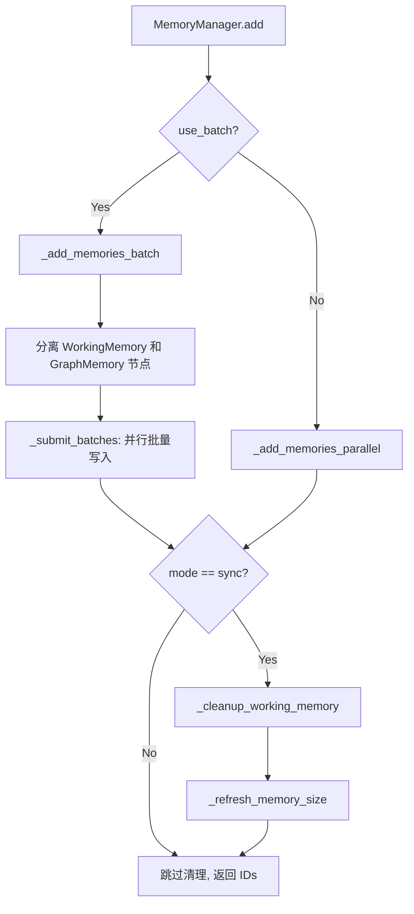
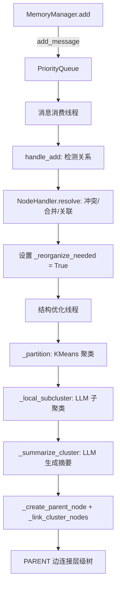

# PD-06.18 MemOS — TreeTextMemory 图数据库三级记忆持久化

> 文档编号：PD-06.18
> 来源：MemOS `src/memos/memories/textual/tree_text_memory/organize/manager.py`
> GitHub：https://github.com/MemTensor/MemOS.git
> 问题域：PD-06 记忆持久化 Memory Persistence
> 状态：可复用方案

---

## 第 1 章 问题与动机

### 1.1 核心问题

Agent 系统的记忆持久化面临三个根本挑战：

1. **记忆分层**：不同生命周期的记忆（临时工作记忆 vs 长期知识 vs 用户偏好）需要不同的存储策略和容量管理
2. **结构化组织**：扁平的记忆列表在规模增长后检索质量急剧下降，需要语义层级结构
3. **多租户隔离**：SaaS 场景下多用户的记忆必须严格隔离，同时支持跨 Cube 聚合查询

MemOS 将自己定位为"记忆操作系统"，核心思路是用图数据库（Neo4j）作为统一存储后端，通过 TreeTextMemory 树状结构管理 WorkingMemory / LongTermMemory / UserMemory 三级记忆，配合 GraphStructureReorganizer 后台线程自动构建语义层级。

### 1.2 MemOS 的解法概述

1. **三级记忆类型 + 容量上限**：WorkingMemory(20) / LongTermMemory(1500) / UserMemory(480)，每种类型有独立的 FIFO 清理策略（`manager.py:247-258`）
2. **Neo4j 图数据库持久化**：所有记忆节点和关系边存储在 Neo4j 中，支持向量相似度搜索、全文检索和子图遍历（`neo4j.py:75`）
3. **双线程后台重组**：GraphStructureReorganizer 启动消息消费线程 + 结构优化线程，用 KMeans 聚类 + LLM 摘要自动构建 PARENT 层级树（`reorganizer.py:81-106`）
4. **MemCube 多租户隔离**：SingleCubeView 封装单租户操作，CompositeCubeView 通过 fan-out 实现跨 Cube 并行写入和聚合搜索（`composite_cube.py:17-87`）
5. **load/dump JSON 序列化**：通过 `export_graph` / `import_graph` 实现图数据的完整导出导入，支持带/不带 embedding 的两种模式（`tree.py:427-464`）

### 1.3 设计思想

| 设计原则 | 具体实现 | 理由 | 替代方案 |
|----------|----------|------|----------|
| 图优先存储 | Neo4j 存储节点+边+向量 | 记忆天然有关联关系，图结构支持子图遍历和关系推理 | 向量库+KV 存储分离 |
| 容量驱动清理 | 每种记忆类型独立上限，80% 阈值触发清理 | 防止记忆无限膨胀，WorkingMemory 快速轮转 | 基于时间的 TTL 过期 |
| 后台异步重组 | 双线程 PriorityQueue 消息驱动 | 重组是 CPU 密集操作，不阻塞写入路径 | 同步重组（阻塞写入） |
| 多租户双模式 | multi_db 物理隔离 / shared_db 逻辑隔离 | 企业版用物理隔离，社区版用逻辑隔离 | 单一隔离模式 |
| Pydantic 类型安全 | 8 种 memory_type 枚举 + 4 级 metadata 继承 | 编译期捕获类型错误，序列化/反序列化自动验证 | dict 自由格式 |

---

## 第 2 章 源码实现分析

### 2.1 架构概览

MemOS 的记忆持久化架构分为四层：

```
┌─────────────────────────────────────────────────────────┐
│                   API Layer (SingleCubeView)             │
│  add_memories() / search_memories() / feedback()        │
├─────────────────────────────────────────────────────────┤
│              Memory Layer (TreeTextMemory)               │
│  add() / search() / load() / dump() / drop()           │
├──────────────────┬──────────────────────────────────────┤
│  MemoryManager   │  GraphStructureReorganizer           │
│  三级记忆写入     │  KMeans聚类 + LLM摘要 + PARENT树    │
│  容量清理         │  消息消费线程 + 结构优化线程          │
├──────────────────┴──────────────────────────────────────┤
│              Storage Layer (Neo4jGraphDB)                │
│  add_node() / add_nodes_batch() / search_by_embedding() │
│  export_graph() / import_graph() / get_subgraph()       │
└─────────────────────────────────────────────────────────┘
```

### 2.2 核心实现

#### 2.2.1 三级记忆写入与容量管理



对应源码 `src/memos/memories/textual/tree_text_memory/organize/manager.py:89-119`：

```python
def add(
    self,
    memories: list[TextualMemoryItem],
    user_name: str | None = None,
    mode: str = "sync",
    use_batch: bool = True,
) -> list[str]:
    added_ids: list[str] = []
    if use_batch:
        added_ids = self._add_memories_batch(memories, user_name)
    else:
        added_ids = self._add_memories_parallel(memories, user_name)

    if mode == "sync":
        self._cleanup_working_memory(user_name)
        self._refresh_memory_size(user_name=user_name)

    return added_ids
```

关键设计：每条记忆同时写入 WorkingMemory（临时缓冲）和目标类型（LongTermMemory/UserMemory），通过 `working_binding` 字段建立绑定关系。WorkingMemory 有 FIFO 清理（`manager.py:247-258`），保持最新 20 条。

#### 2.2.2 GraphStructureReorganizer 双线程后台重组



对应源码 `src/memos/memories/textual/tree_text_memory/organize/reorganizer.py:81-106`：

```python
class GraphStructureReorganizer:
    def __init__(self, graph_store, llm, embedder, is_reorganize):
        self.queue = PriorityQueue()  # Min-heap
        self.relation_detector = RelationAndReasoningDetector(
            self.graph_store, self.llm, self.embedder
        )
        self.resolver = NodeHandler(graph_store=graph_store, llm=llm, embedder=embedder)

        if self.is_reorganize:
            # 线程1: 消息驱动的关系检测
            self.thread = ContextThread(target=self._run_message_consumer_loop)
            self.thread.start()
            # 线程2: 定期结构优化（每100秒）
            self._stop_scheduler = False
            self._is_optimizing = {"LongTermMemory": False, "UserMemory": False}
            self.structure_optimizer_thread = ContextThread(
                target=self._run_structure_organizer_loop
            )
            self.structure_optimizer_thread.start()
```

QueueMessage 使用优先级排序（`reorganizer.py:67-69`）：merge(1) > add/remove(2) > end(0)，确保合并操作优先处理。

### 2.3 实现细节

#### 记忆类型体系

MemOS 定义了 8 种记忆类型（`item.py:165-174`），通过 Pydantic Literal 枚举约束：

- **WorkingMemory**：临时缓冲区，容量 20，FIFO 清理
- **LongTermMemory**：持久知识，容量 1500，80% 阈值清理
- **UserMemory**：用户偏好/画像，容量 480
- **OuterMemory**：外部注入记忆
- **ToolSchemaMemory / ToolTrajectoryMemory**：工具定义和调用轨迹
- **RawFileMemory**：原始文件块，通过 FOLLOWING/PRECEDING 边维护顺序
- **SkillMemory**：技能定义

#### 容量触发清理

`_cleanup_memories_if_needed`（`manager.py:519-539`）在当前计数达到 80% 上限时触发清理：

```python
def _cleanup_memories_if_needed(self, user_name=None):
    cleanup_threshold = 0.8
    for memory_type, limit in self.memory_size.items():
        current_count = self.current_memory_size.get(memory_type, 0)
        threshold = int(int(limit) * cleanup_threshold)
        if current_count >= threshold:
            self.graph_store.remove_oldest_memory(
                memory_type=memory_type, keep_latest=limit, user_name=user_name
            )
```

#### load/dump 序列化

TreeTextMemory 的 `dump`（`tree.py:448-464`）通过 Neo4j 的 `export_graph` 导出完整图结构（节点+边），写入 JSON 文件。`drop`（`tree.py:466-510`）先备份到临时目录再删库，保留最近 N 个备份。

#### CompositeCubeView 跨 Cube 聚合

`composite_cube.py:40-77` 实现并行搜索：用 `ContextThreadPoolExecutor(max_workers=2)` 对每个 SingleCubeView 并行搜索，结果按类型合并到 7 个列表（text_mem, act_mem, para_mem, pref_mem, tool_mem, skill_mem, pref_note）。

---

## 第 3 章 迁移指南

### 3.1 迁移清单

**阶段 1：基础记忆模型（1-2 天）**
- [ ] 定义记忆类型枚举（至少 WorkingMemory / LongTermMemory / UserMemory）
- [ ] 实现 Pydantic BaseModel 记忆项（id, memory, metadata）
- [ ] 实现 SourceMessage 溯源模型

**阶段 2：图存储后端（2-3 天）**
- [ ] 部署 Neo4j 实例（Docker 推荐）
- [ ] 实现 BaseGraphDB 抽象 + Neo4j 适配器
- [ ] 实现 add_node / add_nodes_batch / search_by_embedding / export_graph / import_graph
- [ ] 实现多租户隔离（multi_db 或 shared_db 模式）

**阶段 3：MemoryManager 容量管理（1 天）**
- [ ] 实现三级记忆容量上限配置
- [ ] 实现 FIFO 清理策略（remove_oldest_memory）
- [ ] 实现 80% 阈值触发清理

**阶段 4：后台重组（可选，2-3 天）**
- [ ] 实现 PriorityQueue 消息驱动的关系检测
- [ ] 实现 KMeans 聚类 + LLM 摘要的层级树构建
- [ ] 实现双线程后台运行（消息消费 + 定期优化）

### 3.2 适配代码模板

以下是一个简化的三级记忆管理器，可直接复用：

```python
from abc import ABC, abstractmethod
from dataclasses import dataclass, field
from enum import Enum
from typing import Any
from pydantic import BaseModel, Field
import uuid
from datetime import datetime


class MemoryType(str, Enum):
    WORKING = "WorkingMemory"
    LONG_TERM = "LongTermMemory"
    USER = "UserMemory"


class MemoryItem(BaseModel):
    id: str = Field(default_factory=lambda: str(uuid.uuid4()))
    memory: str
    memory_type: MemoryType = MemoryType.WORKING
    embedding: list[float] | None = None
    confidence: float = 0.8
    status: str = "activated"
    updated_at: str = Field(default_factory=lambda: datetime.now().isoformat())
    user_name: str | None = None


class BaseGraphStore(ABC):
    @abstractmethod
    def add_node(self, node_id: str, memory: str, metadata: dict, user_name: str | None = None): ...
    @abstractmethod
    def remove_oldest_memory(self, memory_type: str, keep_latest: int, user_name: str | None = None): ...
    @abstractmethod
    def get_grouped_counts(self, group_fields: list[str], user_name: str | None = None) -> list[dict]: ...
    @abstractmethod
    def export_graph(self, include_embedding: bool = False, user_name: str | None = None) -> dict: ...
    @abstractmethod
    def import_graph(self, data: dict, user_name: str | None = None): ...


class TieredMemoryManager:
    """三级记忆管理器，移植自 MemOS MemoryManager 核心逻辑。"""

    DEFAULT_LIMITS = {
        "WorkingMemory": 20,
        "LongTermMemory": 1500,
        "UserMemory": 480,
    }
    CLEANUP_THRESHOLD = 0.8  # 80% 触发清理

    def __init__(self, graph_store: BaseGraphStore, memory_limits: dict | None = None):
        self.graph_store = graph_store
        self.memory_limits = memory_limits or self.DEFAULT_LIMITS
        self._current_sizes: dict[str, int] = {}

    def add(self, items: list[MemoryItem], user_name: str | None = None, sync: bool = True) -> list[str]:
        added_ids = []
        for item in items:
            # 同时写入 WorkingMemory 缓冲
            if item.memory_type in (MemoryType.LONG_TERM, MemoryType.USER):
                working_copy = item.model_copy(update={"memory_type": MemoryType.WORKING})
                self.graph_store.add_node(
                    working_copy.id, working_copy.memory,
                    working_copy.model_dump(exclude_none=True), user_name
                )
            # 写入目标类型
            self.graph_store.add_node(
                item.id, item.memory,
                item.model_dump(exclude_none=True), user_name
            )
            added_ids.append(item.id)

        if sync:
            self._cleanup_if_needed(user_name)
            self._refresh_sizes(user_name)
        return added_ids

    def _cleanup_if_needed(self, user_name: str | None = None):
        self._refresh_sizes(user_name)
        for mem_type, limit in self.memory_limits.items():
            current = self._current_sizes.get(mem_type, 0)
            if current >= int(limit * self.CLEANUP_THRESHOLD):
                self.graph_store.remove_oldest_memory(mem_type, limit, user_name)

    def _refresh_sizes(self, user_name: str | None = None):
        results = self.graph_store.get_grouped_counts(["memory_type"], user_name)
        self._current_sizes = {r["memory_type"]: r["count"] for r in results}

    def dump(self, filepath: str, user_name: str | None = None):
        import json
        data = self.graph_store.export_graph(user_name=user_name)
        with open(filepath, "w", encoding="utf-8") as f:
            json.dump(data, f, indent=4, ensure_ascii=False)

    def load(self, filepath: str, user_name: str | None = None):
        import json
        with open(filepath, encoding="utf-8") as f:
            data = json.load(f)
        self.graph_store.import_graph(data, user_name)
```

### 3.3 适用场景

| 场景 | 适用度 | 说明 |
|------|--------|------|
| 多轮对话 Agent 记忆 | ⭐⭐⭐ | WorkingMemory 缓冲 + LongTermMemory 沉淀，天然适配 |
| 用户画像/偏好管理 | ⭐⭐⭐ | UserMemory 独立类型 + 容量控制 |
| 知识图谱构建 | ⭐⭐⭐ | Neo4j 图存储 + 自动关系检测 + 层级树 |
| 简单 RAG 系统 | ⭐⭐ | 图数据库偏重，纯向量检索场景可能过度设计 |
| 边缘/离线部署 | ⭐ | 依赖 Neo4j 服务，不适合轻量部署 |

---

## 第 4 章 测试用例

```python
import pytest
from unittest.mock import MagicMock, patch
from datetime import datetime


class TestMemoryManager:
    """基于 MemOS MemoryManager 真实接口的测试。"""

    def setup_method(self):
        self.graph_store = MagicMock()
        self.graph_store.get_grouped_counts.return_value = [
            {"memory_type": "WorkingMemory", "count": 5},
            {"memory_type": "LongTermMemory", "count": 100},
        ]

    def test_add_sync_triggers_cleanup(self):
        """sync 模式下 add 后应触发 cleanup 和 refresh。"""
        from memos.memories.textual.tree_text_memory.organize.manager import MemoryManager
        from memos.memories.textual.item import TextualMemoryItem, TreeNodeTextualMemoryMetadata

        embedder = MagicMock()
        llm = MagicMock()
        manager = MemoryManager(self.graph_store, embedder, llm)

        item = TextualMemoryItem(
            memory="test fact",
            metadata=TreeNodeTextualMemoryMetadata(
                memory_type="LongTermMemory",
                status="activated",
                key="test",
                embedding=[0.1] * 768,
            ),
        )
        manager.add([item], user_name="test_user", mode="sync")
        self.graph_store.remove_oldest_memory.assert_called()
        self.graph_store.get_grouped_counts.assert_called()

    def test_add_async_skips_cleanup(self):
        """async 模式下 add 后不应触发 cleanup。"""
        from memos.memories.textual.tree_text_memory.organize.manager import MemoryManager

        embedder = MagicMock()
        llm = MagicMock()
        manager = MemoryManager(self.graph_store, embedder, llm)

        manager.add([], user_name="test_user", mode="async")
        self.graph_store.remove_oldest_memory.assert_not_called()

    def test_cleanup_threshold_80_percent(self):
        """容量达到 80% 时应触发清理。"""
        from memos.memories.textual.tree_text_memory.organize.manager import MemoryManager

        self.graph_store.get_grouped_counts.return_value = [
            {"memory_type": "LongTermMemory", "count": 1250},  # 1250/1500 > 80%
        ]
        embedder = MagicMock()
        llm = MagicMock()
        manager = MemoryManager(self.graph_store, embedder, llm)
        manager.current_memory_size = {"LongTermMemory": 1250}
        manager._cleanup_memories_if_needed(user_name="test")
        self.graph_store.remove_oldest_memory.assert_called_with(
            memory_type="LongTermMemory", keep_latest=1500, user_name="test"
        )

    def test_working_binding_extraction(self):
        """从 background 字段提取 working_binding UUID。"""
        from memos.memories.textual.tree_text_memory.organize.manager import extract_working_binding_ids
        from memos.memories.textual.item import TextualMemoryItem, TreeNodeTextualMemoryMetadata

        item = TextualMemoryItem(
            memory="test",
            metadata=TreeNodeTextualMemoryMetadata(
                memory_type="LongTermMemory",
                background="[working_binding:550e8400-e29b-41d4-a716-446655440000] direct built",
                embedding=[0.1] * 768,
            ),
        )
        bindings = extract_working_binding_ids([item])
        assert "550e8400-e29b-41d4-a716-446655440000" in bindings

    def test_dump_load_roundtrip(self):
        """dump 后 load 应恢复完整图结构。"""
        import json, tempfile, os

        export_data = {
            "nodes": [{"id": "n1", "memory": "fact1", "metadata": {"memory_type": "LongTermMemory"}}],
            "edges": [{"source": "n1", "target": "n2", "type": "RELATED"}],
            "total_nodes": 1,
            "total_edges": 1,
        }
        self.graph_store.export_graph.return_value = export_data

        with tempfile.TemporaryDirectory() as tmpdir:
            filepath = os.path.join(tmpdir, "textual_memory.json")
            # dump
            with open(filepath, "w") as f:
                json.dump(export_data, f)
            # load
            with open(filepath) as f:
                loaded = json.load(f)
            assert loaded["nodes"][0]["memory"] == "fact1"
            assert loaded["edges"][0]["type"] == "RELATED"

    def test_composite_cube_parallel_search(self):
        """CompositeCubeView 应并行搜索所有子 Cube 并合并结果。"""
        from memos.multi_mem_cube.composite_cube import CompositeCubeView

        view1 = MagicMock()
        view1.cube_id = "cube1"
        view1.search_memories.return_value = {
            "text_mem": [{"id": "m1"}], "act_mem": [], "para_mem": [],
            "pref_mem": [], "pref_note": "", "tool_mem": [], "skill_mem": [],
        }
        view2 = MagicMock()
        view2.cube_id = "cube2"
        view2.search_memories.return_value = {
            "text_mem": [{"id": "m2"}], "act_mem": [], "para_mem": [],
            "pref_mem": [], "pref_note": "note2", "tool_mem": [], "skill_mem": [],
        }

        composite = CompositeCubeView(cube_views=[view1, view2], logger=MagicMock())
        result = composite.search_memories(MagicMock())
        assert len(result["text_mem"]) == 2
        assert "note2" in result["pref_note"]
```

---

## 第 5 章 跨域关联

| 关联域 | 关系类型 | 说明 |
|--------|----------|------|
| PD-01 上下文管理 | 协同 | WorkingMemory 的 20 条上限本质是上下文窗口管理，search 结果注入 prompt 时需要 token 预算控制 |
| PD-02 多 Agent 编排 | 协同 | CompositeCubeView 的 fan-out 模式是多 Agent 记忆聚合的基础，SingleCubeView 可绑定到不同 Agent |
| PD-03 容错与重试 | 依赖 | Neo4j 连接断开时 MemoryManager 的 add/search 需要重试保护，当前实现仅 try/except 日志 |
| PD-04 工具系统 | 协同 | ToolSchemaMemory / ToolTrajectoryMemory 两种记忆类型专门存储工具定义和调用轨迹 |
| PD-07 质量检查 | 协同 | confidence 字段（0-100）用于记忆质量评分，reorganizer 生成的摘要节点 confidence=0.66 |
| PD-08 搜索与检索 | 依赖 | AdvancedSearcher 的多阶段检索依赖 Neo4j 的向量搜索和全文检索能力 |
| PD-10 中间件管道 | 协同 | SingleCubeView 的 add_before_search 是写入前的 LLM 过滤中间件 |

---

## 第 6 章 来源文件索引

| 文件 | 行范围 | 关键实现 |
|------|--------|----------|
| `src/memos/memories/base.py` | L1-L20 | BaseMemory 抽象基类，定义 load/dump 接口 |
| `src/memos/memories/textual/item.py` | L16-L364 | SourceMessage、TextualMemoryMetadata、TreeNodeTextualMemoryMetadata、TextualMemoryItem 完整类型体系 |
| `src/memos/memories/textual/tree.py` | L39-L608 | TreeTextMemory 主类：add/search/load/dump/drop/get_relevant_subgraph |
| `src/memos/memories/textual/tree_text_memory/organize/manager.py` | L54-L554 | MemoryManager：三级记忆写入、批量/并行模式、容量清理、working_binding 绑定 |
| `src/memos/memories/textual/tree_text_memory/organize/reorganizer.py` | L81-L660 | GraphStructureReorganizer：双线程后台重组、KMeans 聚类、LLM 摘要、PARENT 树构建 |
| `src/memos/graph_dbs/neo4j.py` | L75-L100 | Neo4jGraphDB：双模式多租户（multi_db/shared_db）、向量索引、Cypher 查询 |
| `src/memos/multi_mem_cube/composite_cube.py` | L17-L87 | CompositeCubeView：跨 Cube fan-out 写入和并行搜索聚合 |
| `src/memos/multi_mem_cube/single_cube.py` | L52-L972 | SingleCubeView：单租户记忆操作，sync/async 模式，text+pref 并行处理 |
| `src/memos/embedders/factory.py` | L12-L30 | EmbedderFactory：Ollama/SentenceTransformer/Ark/UniversalAPI 四后端 |
| `src/memos/configs/memory.py` | L143+ | TreeTextMemoryConfig：LLM/embedder/graph_db/reranker 全配置 |

---

## 第 7 章 横向对比维度

> **重要：** 本章用于自动填充 Butcher Wiki 的横向对比表。

```json comparison_data
{
  "project": "MemOS",
  "dimensions": {
    "记忆结构": "TreeTextMemory 树状结构，8 种 memory_type 枚举，4 级 Pydantic metadata 继承",
    "更新机制": "ArchivedTextualMemory 版本历史 + MERGED_TO 边保留血统",
    "事实提取": "LLM 双模式提取（fast 原始/fine LLM 精炼），mem_reader 管道",
    "存储方式": "Neo4j 图数据库，支持 multi_db 物理隔离和 shared_db 逻辑隔离",
    "注入方式": "search API 返回 TextualMemoryItem 列表，由调用方注入 prompt",
    "生命周期管理": "4 态状态机（activated/resolving/archived/deleted）+ 容量驱动 FIFO 清理",
    "记忆检索": "AdvancedSearcher 多阶段检索 + BM25/向量/全文三路 + reranker",
    "记忆增长控制": "每类型独立上限（WM:20/LTM:1500/UM:480），80% 阈值触发清理",
    "多渠道会话隔离": "MemCube 多租户：SingleCubeView 单租户 + CompositeCubeView 跨 Cube 聚合",
    "容量触发转储": "drop() 先 dump 到临时目录备份再删库，保留最近 N 个备份",
    "角色记忆隔离": "cube_id 绑定租户，user_name 逻辑隔离，不同 Cube 物理隔离",
    "图结构自组织": "GraphStructureReorganizer 双线程：KMeans 聚类 + LLM 摘要自动构建 PARENT 层级树"
  }
}
```

### 域元数据补充

```json domain_metadata
{
  "solution_summary": "MemOS 用 Neo4j 图数据库存储 8 种记忆类型，通过 GraphStructureReorganizer 双线程自动构建 KMeans+LLM 摘要的 PARENT 层级树，配合 MemCube 多租户隔离和 80% 容量阈值 FIFO 清理",
  "description": "图数据库原生存储记忆关系，支持子图遍历和自动层级重组",
  "sub_problems": [
    "图结构自组织：如何在记忆增长时自动构建语义层级树而非扁平列表",
    "多租户记忆聚合：跨 Cube 并行搜索时如何合并异构结果并去重",
    "记忆版本血统：更新/合并记忆时如何保留完整的版本历史和来源追溯",
    "后台重组资源控制：KMeans+LLM 重组的 CPU/API 开销如何限制在可控范围"
  ],
  "best_practices": [
    "双写缓冲：每条记忆同时写入 WorkingMemory 和目标类型，通过 working_binding 绑定，异步清理临时节点",
    "优先级消息队列：merge 操作优先于 add/remove，确保冲突解决不被新写入阻塞",
    "80% 阈值清理优于固定周期：只在接近上限时触发清理，减少不必要的数据库操作"
  ]
}
```
