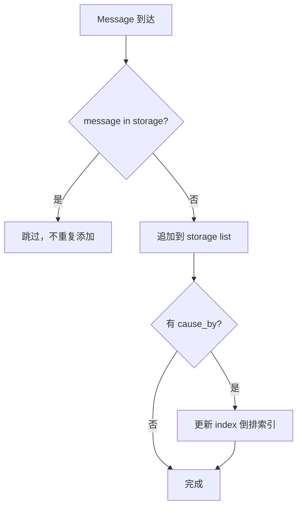
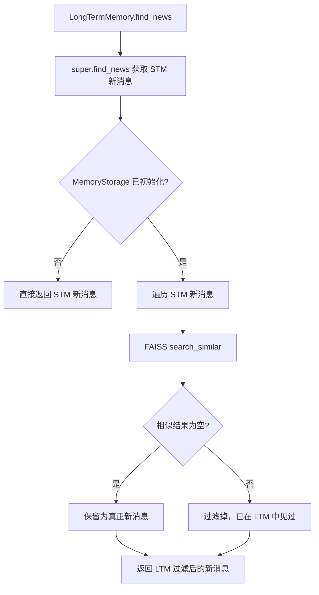

# PD-06.04 MetaGPT — 三层记忆架构与向量经验池

> 文档编号：PD-06.04
> 来源：MetaGPT `metagpt/memory/`, `metagpt/exp_pool/`
> GitHub：https://github.com/FoundationAgents/MetaGPT.git
> 问题域：PD-06 记忆持久化 Memory Persistence
> 状态：可复用方案

---

## 第 1 章 问题与动机

### 1.1 核心问题

多 Agent 协作系统中，每个 Role（角色）需要在运行时维护自己的对话记忆，同时在跨会话场景下复用历史经验。核心挑战包括：

1. **短期记忆膨胀**：Role 在单次任务中接收大量 Message，全部保留会导致 token 超限
2. **跨会话遗忘**：进程重启后，Role 丢失所有历史上下文，无法从上次中断处恢复
3. **消息去重**：多 Agent 环境中，同一消息可能被多次广播，Role 需要识别"新消息"
4. **经验复用**：相似任务反复出现时，Agent 无法利用过去的成功/失败经验来优化决策
5. **对话压缩**：长对话场景下，历史内容需要被摘要压缩，同时保留语义可检索性

### 1.2 MetaGPT 的解法概述

MetaGPT 实现了一个三层记忆架构 + 独立经验池的方案：

1. **Memory（短期记忆）**：基于 Python list 的内存存储，按 `cause_by` Action 建立倒排索引，支持按角色/内容/Action 多维检索（`metagpt/memory/memory.py:20`）
2. **LongTermMemory（长期记忆）**：继承 Memory，底层用 FAISS 向量索引做相似度去重，只存储 Role 关注的 Action 产生的消息，通过 `find_news` 过滤已见消息（`metagpt/memory/longterm_memory.py:18`）
3. **BrainMemory（对话记忆）**：Redis 缓存 + LLM 摘要压缩，用于 Assistant 角色的多轮对话场景，支持滑动窗口分段摘要和语义相关性判断（`metagpt/memory/brain_memory.py:26`）
4. **RoleZeroLongTermMemory（容量触发转储）**：当短期记忆超过 `memory_k=200` 条时，自动将溢出消息转储到 Chroma 向量库，检索时合并短期+长期结果（`metagpt/memory/role_zero_memory.py:24`）
5. **ExperiencePool（经验池）**：独立于记忆系统，支持 BM25/Chroma 双检索后端 + LLM Reranker，管理跨会话的 req→resp 经验对（`metagpt/exp_pool/manager.py:18`）

### 1.3 设计思想

| 设计原则 | 具体实现 | 理由 | 替代方案 |
|----------|----------|------|----------|
| 分层解耦 | Memory/LongTermMemory/BrainMemory 三层独立 | 不同 Role 按需选择记忆层级，避免一刀切 | 单一统一记忆（灵活性差） |
| 向量去重 | FAISS 相似度检索过滤已见消息 | 比精确匹配更鲁棒，语义相近的消息也能去重 | 基于 ID 的精确去重（漏检语义重复） |
| 懒加载 | `_storage` 属性用 `@property` 延迟初始化 | 避免未使用记忆功能时加载重量级依赖 | 构造函数直接初始化（浪费资源） |
| 配置驱动 | ExperiencePoolConfig 控制 enabled/read/write | 生产环境可独立开关读写，灰度发布友好 | 硬编码开关（不灵活） |
| 双检索后端 | BM25（关键词）+ Chroma（向量）可切换 | 不同场景选择最优检索策略 | 只支持向量检索（关键词场景效果差） |
| 容量触发转储 | memory_k 阈值触发短期→长期迁移 | 自动管理记忆容量，无需手动清理 | 定时清理（可能丢失重要信息） |

---

## 第 2 章 源码实现分析

### 2.1 架构概览

MetaGPT 的记忆系统由 4 个记忆类 + 1 个经验池组成，通过 Role/RoleContext 集成到 Agent 生命周期中：

```
┌─────────────────────────────────────────────────────────────┐
│                        Role (Agent)                         │
│  ┌──────────────────────────────────────────────────────┐   │
│  │                   RoleContext                         │   │
│  │  ┌────────────┐  ┌──────────────┐  ┌─────────────┐  │   │
│  │  │   Memory    │  │ working_mem  │  │ msg_buffer  │  │   │
│  │  │ (短期记忆)  │  │  (工作记忆)   │  │ (消息队列)  │  │   │
│  │  └─────┬──────┘  └──────────────┘  └─────────────┘  │   │
│  └────────┼─────────────────────────────────────────────┘   │
│           │ 继承                                             │
│  ┌────────▼──────────┐    ┌──────────────────────────┐      │
│  │  LongTermMemory   │    │  RoleZeroLongTermMemory  │      │
│  │  (FAISS 向量去重)  │    │  (Chroma 容量转储)       │      │
│  │  ┌──────────────┐ │    │  ┌──────────────┐        │      │
│  │  │MemoryStorage │ │    │  │ SimpleEngine │        │      │
│  │  │  (FAISS)     │ │    │  │  (Chroma)    │        │      │
│  │  └──────────────┘ │    │  └──────────────┘        │      │
│  └───────────────────┘    └──────────────────────────┘      │
│                                                              │
│  ┌──────────────────┐    ┌───────────────────────────┐      │
│  │   BrainMemory    │    │   ExperienceManager       │      │
│  │  (Redis + LLM    │    │  (BM25/Chroma + Reranker) │      │
│  │   摘要压缩)      │    │  ┌─────────────────────┐  │      │
│  └──────────────────┘    │  │    SimpleEngine      │  │      │
│                          │  └─────────────────────┘  │      │
│                          └───────────────────────────┘      │
└─────────────────────────────────────────────────────────────┘
```

### 2.2 核心实现

#### 2.2.1 Memory 基类：倒排索引短期记忆



对应源码 `metagpt/memory/memory.py:20-113`：

```python
class Memory(BaseModel):
    """The most basic memory: super-memory"""
    storage: list[SerializeAsAny[Message]] = []
    index: DefaultDict[str, list[SerializeAsAny[Message]]] = Field(
        default_factory=lambda: defaultdict(list)
    )

    def add(self, message: Message):
        """Add a new message to storage, while updating the index"""
        if message in self.storage:
            return
        self.storage.append(message)
        if message.cause_by:
            self.index[message.cause_by].append(message)

    def find_news(self, observed: list[Message], k=0) -> list[Message]:
        """find news (previously unseen messages)"""
        already_observed = self.get(k)
        news: list[Message] = []
        for i in observed:
            if i in already_observed:
                continue
            news.append(i)
        return news
```

关键设计：`index` 是按 `cause_by`（触发 Action 类名）建立的倒排索引，使得 `get_by_actions` 可以 O(1) 检索某类 Action 产生的所有消息（`memory.py:94-107`）。

#### 2.2.2 LongTermMemory：FAISS 向量去重



对应源码 `metagpt/memory/longterm_memory.py:18-79`：

```python
class LongTermMemory(Memory):
    memory_storage: MemoryStorage = Field(default_factory=MemoryStorage)
    rc: Optional[RoleContext] = None
    msg_from_recover: bool = False

    def add(self, message: Message):
        super().add(message)
        for action in self.rc.watch:
            if message.cause_by == action and not self.msg_from_recover:
                # only add role's watching messages to memory_storage
                self.memory_storage.add(message)

    async def find_news(self, observed: list[Message], k=0) -> list[Message]:
        stm_news = super().find_news(observed, k=k)
        if not self.memory_storage.is_initialized:
            return stm_news
        ltm_news: list[Message] = []
        for mem in stm_news:
            mem_searched = await self.memory_storage.search_similar(mem)
            if len(mem_searched) == 0:
                ltm_news.append(mem)
        return ltm_news[-k:]
```

`MemoryStorage` 底层使用 FAISS 向量索引（`metagpt/memory/memory_storage.py:19-78`），相似度阈值 `threshold=0.1`，低于此分数的结果被视为"相似已见"。持久化通过 `storage_context.persist()` 将 FAISS 索引写入磁盘 JSON 文件。

#### 2.2.3 RoleZeroLongTermMemory：容量触发自动转储

```mermaid
graph TD
    A[add message] --> B[super.add 存入短期]
    B --> C{count > memory_k?}
    C -->|否| D[完成]
    C -->|是| E[取第 -(memory_k+1) 条消息]
    E --> F[包装为 LongTermMemoryItem]
    F --> G[rag_engine.add_objs 写入 Chroma]
    G --> D
    H[get memories] --> I{满足 LTM 条件?}
    I -->|否| J[返回短期记忆]
    I -->|是| K[构建查询: 最近用户消息]
    K --> L[rag_engine.retrieve 检索 Chroma]
    L --> M[按 created_at 排序]
    M --> N[related_memories + recent_memories]
    N --> O[返回合并结果]
```

对应源码 `metagpt/memory/role_zero_memory.py:24-202`：

```python
class RoleZeroLongTermMemory(Memory):
    memory_k: int = Field(default=200, description="The capacity of short-term memory.")
    similarity_top_k: int = Field(default=5)

    def _should_use_longterm_memory_for_add(self) -> bool:
        return self.count() > self.memory_k

    def _transfer_to_longterm_memory(self):
        item = self._get_longterm_memory_item()
        self._add_to_longterm_memory(item)

    def _get_longterm_memory_item(self) -> Optional[LongTermMemoryItem]:
        index = -(self.memory_k + 1)
        message = self.get_by_position(index)
        return LongTermMemoryItem(message=message) if message else None
```

关键设计：`memory_k=200` 作为短期记忆容量上限，超出时自动将最老的消息转储到 Chroma 向量库。检索时三重条件门控（`k!=0`、最后消息来自用户、`count > memory_k`），避免不必要的向量检索开销。

### 2.3 实现细节

#### BrainMemory：Redis 缓存 + LLM 滑动窗口摘要

BrainMemory（`metagpt/memory/brain_memory.py:26-346`）是为 Assistant 角色设计的对话记忆，核心特性：

1. **Redis 持久化**：通过 `dumps(redis_key, timeout_sec=1800)` 将整个 BrainMemory 序列化为 JSON 存入 Redis，默认 30 分钟 TTL（`brain_memory.py:75-85`）
2. **LLM 摘要压缩**：`_summarize` 方法实现滑动窗口分段摘要，将超长文本按 `window_size` 切分，每段独立摘要后合并，循环直到总长度可控（`brain_memory.py:276-304`）
3. **语义相关性判断**：`is_related` 用 LLM 判断新输入与历史摘要是否语义相关，相关则合并上下文（`brain_memory.py:198-222`）
4. **脏标记优化**：`is_dirty` 标记避免无变更时的冗余 Redis 写入（`brain_memory.py:31`）

#### ExperiencePool：跨会话经验复用

ExperienceManager（`metagpt/exp_pool/manager.py:18-243`）管理结构化经验：

- **Experience 模型**（`metagpt/exp_pool/schema.py:62-77`）：包含 `req`（请求）、`resp`（响应）、`metric`（时间/金钱/评分）、`traj`（plan→action→observation→reward 轨迹）、`tag`（标签过滤）
- **双检索模式**：`QueryType.SEMANTIC`（向量相似度）和 `QueryType.EXACT`（精确匹配 req 字段）
- **读写分离开关**：`enable_read` 和 `enable_write` 独立控制，支持只读/只写/全开/全关四种模式
- **LLM Reranker**：可选的 LLM 重排序，对向量检索结果做二次精排

数据流：`create_exp → storage.add_objs → storage.persist` 写入，`query_exps → storage.aretrieve → tag/exact 过滤` 读取。

---

## 第 3 章 迁移指南

### 3.1 迁移清单

**阶段 1：基础短期记忆**
- [ ] 实现 Memory 基类：list 存储 + cause_by 倒排索引
- [ ] 定义 Message 模型：id、content、role、cause_by、sent_from、send_to
- [ ] 实现 find_news 去重逻辑

**阶段 2：FAISS 长期记忆**
- [ ] 安装依赖：`pip install llama-index faiss-cpu`
- [ ] 实现 MemoryStorage：FAISS 索引 + 相似度阈值过滤
- [ ] 实现 LongTermMemory：继承 Memory，add 时按 watch 过滤写入向量库
- [ ] 实现 recover_memory：启动时从磁盘恢复 FAISS 索引

**阶段 3：容量触发转储（可选）**
- [ ] 安装依赖：`pip install chromadb`
- [ ] 实现 RoleZeroLongTermMemory：memory_k 阈值 + Chroma 后端
- [ ] 实现三重条件门控避免不必要的向量检索

**阶段 4：经验池（可选）**
- [ ] 定义 Experience 模型：req/resp/metric/traj/tag
- [ ] 实现 ExperienceManager：BM25/Chroma 双后端 + 读写分离开关
- [ ] 配置 ExperiencePoolConfig：enabled/enable_read/enable_write/persist_path

### 3.2 适配代码模板

#### 最小可用的分层记忆系统

```python
"""Minimal layered memory system inspired by MetaGPT."""
from __future__ import annotations

import json
import shutil
from collections import defaultdict
from dataclasses import dataclass, field
from pathlib import Path
from typing import Any, Optional

import faiss
import numpy as np


@dataclass
class Message:
    content: str
    role: str = "user"
    cause_by: str = ""
    id: str = ""

    def __eq__(self, other):
        if not isinstance(other, Message):
            return False
        return self.id == other.id if self.id and other.id else self.content == other.content


class Memory:
    """Short-term memory with cause_by inverted index."""

    def __init__(self):
        self.storage: list[Message] = []
        self.index: dict[str, list[Message]] = defaultdict(list)

    def add(self, message: Message):
        if message in self.storage:
            return
        self.storage.append(message)
        if message.cause_by:
            self.index[message.cause_by].append(message)

    def get(self, k: int = 0) -> list[Message]:
        return self.storage[-k:] if k else self.storage

    def find_news(self, observed: list[Message], k: int = 0) -> list[Message]:
        already = self.get(k)
        return [m for m in observed if m not in already]

    def get_by_action(self, action: str) -> list[Message]:
        return self.index.get(action, [])

    def count(self) -> int:
        return len(self.storage)


class VectorMemoryStorage:
    """FAISS-backed vector storage for long-term memory dedup."""

    def __init__(self, dim: int = 1536, threshold: float = 0.1, persist_dir: Optional[str] = None):
        self.dim = dim
        self.threshold = threshold
        self.persist_dir = Path(persist_dir) if persist_dir else None
        self.index = faiss.IndexFlatL2(dim)
        self.messages: list[Message] = []

    def add(self, message: Message, embedding: np.ndarray):
        self.index.add(embedding.reshape(1, -1))
        self.messages.append(message)

    def search_similar(self, embedding: np.ndarray, k: int = 4) -> list[Message]:
        if self.index.ntotal == 0:
            return []
        distances, indices = self.index.search(embedding.reshape(1, -1), min(k, self.index.ntotal))
        return [self.messages[i] for d, i in zip(distances[0], indices[0]) if d < self.threshold and i >= 0]

    def persist(self):
        if self.persist_dir:
            self.persist_dir.mkdir(parents=True, exist_ok=True)
            faiss.write_index(self.index, str(self.persist_dir / "memory.faiss"))

    def recover(self):
        faiss_path = self.persist_dir / "memory.faiss" if self.persist_dir else None
        if faiss_path and faiss_path.exists():
            self.index = faiss.read_index(str(faiss_path))


class LongTermMemory(Memory):
    """Memory with FAISS-based dedup for long-term persistence."""

    def __init__(self, watch_actions: set[str] = None, **kwargs):
        super().__init__()
        self.vector_storage = VectorMemoryStorage(**kwargs)
        self.watch_actions = watch_actions or set()

    def add(self, message: Message, embedding: np.ndarray = None):
        super().add(message)
        if message.cause_by in self.watch_actions and embedding is not None:
            self.vector_storage.add(message, embedding)

    def find_news(self, observed: list[Message], k: int = 0,
                  embed_fn=None) -> list[Message]:
        stm_news = super().find_news(observed, k)
        if embed_fn is None:
            return stm_news
        ltm_news = []
        for msg in stm_news:
            emb = embed_fn(msg.content)
            if not self.vector_storage.search_similar(emb):
                ltm_news.append(msg)
        return ltm_news[-k:] if k else ltm_news
```

### 3.3 适用场景

| 场景 | 适用度 | 说明 |
|------|--------|------|
| 多 Agent 协作（消息去重） | ⭐⭐⭐ | LongTermMemory 的 FAISS 去重是核心价值 |
| 长对话 Assistant | ⭐⭐⭐ | BrainMemory 的 Redis+LLM 摘要压缩很适合 |
| 跨会话经验复用 | ⭐⭐⭐ | ExperiencePool 的 req→resp 模式直接可用 |
| 单 Agent 短任务 | ⭐ | Memory 基类足够，无需长期记忆 |
| 实时流式对话 | ⭐⭐ | BrainMemory 支持但 LLM 摘要有延迟 |

---

## 第 4 章 测试用例

```python
"""Tests for MetaGPT-style layered memory system."""
import pytest
import numpy as np


class TestMemory:
    """Test basic Memory (short-term)."""

    def test_add_dedup(self):
        """Same message should not be added twice."""
        mem = Memory()
        msg = Message(content="hello", id="1")
        mem.add(msg)
        mem.add(msg)
        assert mem.count() == 1

    def test_cause_by_index(self):
        """Messages should be indexed by cause_by."""
        mem = Memory()
        mem.add(Message(content="plan done", cause_by="PlanAction"))
        mem.add(Message(content="code done", cause_by="CodeAction"))
        mem.add(Message(content="plan v2", cause_by="PlanAction"))
        assert len(mem.get_by_action("PlanAction")) == 2
        assert len(mem.get_by_action("CodeAction")) == 1

    def test_find_news(self):
        """find_news should return only unseen messages."""
        mem = Memory()
        old = Message(content="old", id="1")
        mem.add(old)
        new = Message(content="new", id="2")
        news = mem.find_news([old, new])
        assert len(news) == 1
        assert news[0].content == "new"


class TestVectorMemoryStorage:
    """Test FAISS-backed vector storage."""

    def test_add_and_search(self):
        """Added message should be found by similar vector."""
        store = VectorMemoryStorage(dim=4, threshold=1.0)
        msg = Message(content="test")
        emb = np.array([1.0, 0.0, 0.0, 0.0], dtype=np.float32)
        store.add(msg, emb)
        results = store.search_similar(emb)
        assert len(results) == 1
        assert results[0].content == "test"

    def test_threshold_filter(self):
        """Distant vectors should be filtered out."""
        store = VectorMemoryStorage(dim=4, threshold=0.5)
        store.add(Message(content="a"), np.array([1, 0, 0, 0], dtype=np.float32))
        far = np.array([0, 0, 0, 1], dtype=np.float32)
        results = store.search_similar(far)
        assert len(results) == 0

    def test_empty_search(self):
        """Search on empty index should return empty."""
        store = VectorMemoryStorage(dim=4)
        results = store.search_similar(np.array([1, 0, 0, 0], dtype=np.float32))
        assert results == []


class TestLongTermMemory:
    """Test LongTermMemory with FAISS dedup."""

    def test_find_news_filters_similar(self):
        """Messages similar to LTM should be filtered from news."""
        def embed_fn(text):
            return np.array([1.0, 0.0, 0.0, 0.0], dtype=np.float32)

        ltm = LongTermMemory(watch_actions={"WriteAction"}, dim=4, threshold=1.0)
        msg1 = Message(content="write code", cause_by="WriteAction", id="1")
        ltm.add(msg1, embed_fn(msg1.content))

        msg2 = Message(content="write code v2", id="2")  # same embedding → similar
        news = ltm.find_news([msg2], embed_fn=embed_fn)
        assert len(news) == 0  # filtered as similar

    def test_find_news_keeps_novel(self):
        """Novel messages should pass through LTM filter."""
        call_count = [0]
        def embed_fn(text):
            call_count[0] += 1
            if call_count[0] <= 1:
                return np.array([1, 0, 0, 0], dtype=np.float32)
            return np.array([0, 0, 0, 1], dtype=np.float32)

        ltm = LongTermMemory(watch_actions={"WriteAction"}, dim=4, threshold=0.5)
        msg1 = Message(content="old", cause_by="WriteAction", id="1")
        ltm.add(msg1, embed_fn(msg1.content))

        msg2 = Message(content="totally new", id="2")
        news = ltm.find_news([msg2], embed_fn=embed_fn)
        assert len(news) == 1
```

---

## 第 5 章 跨域关联

| 关联域 | 关系类型 | 说明 |
|--------|----------|------|
| PD-01 上下文管理 | 协同 | BrainMemory 的 LLM 摘要压缩本质是上下文窗口管理，滑动窗口分段摘要防止 token 超限 |
| PD-02 多 Agent 编排 | 依赖 | LongTermMemory 的 `rc.watch` 机制依赖 Role 的 Action 订阅体系，多 Agent 消息路由决定哪些消息进入长期记忆 |
| PD-04 工具系统 | 协同 | ExperiencePool 的 BM25/Chroma 双后端通过 SimpleEngine 统一抽象，与 RAG 工具系统共享基础设施 |
| PD-08 搜索与检索 | 协同 | MemoryStorage 和 ExperienceManager 都基于 llama_index SimpleEngine，复用同一套向量检索+重排序管道 |
| PD-11 可观测性 | 协同 | Experience.metric 记录 time_cost/money_cost/score，为成本追踪提供数据源 |

---

## 第 6 章 来源文件索引

| 文件 | 行范围 | 关键实现 |
|------|--------|----------|
| `metagpt/memory/memory.py` | L20-L113 | Memory 基类：list 存储 + cause_by 倒排索引 |
| `metagpt/memory/longterm_memory.py` | L18-L79 | LongTermMemory：FAISS 向量去重 + find_news |
| `metagpt/memory/memory_storage.py` | L19-L78 | MemoryStorage：FAISS 引擎封装 + 相似度阈值 |
| `metagpt/memory/brain_memory.py` | L26-L346 | BrainMemory：Redis 缓存 + LLM 滑动窗口摘要 |
| `metagpt/memory/role_zero_memory.py` | L24-L202 | RoleZeroLongTermMemory：容量触发 Chroma 转储 |
| `metagpt/exp_pool/manager.py` | L18-L243 | ExperienceManager：BM25/Chroma 双后端经验池 |
| `metagpt/exp_pool/schema.py` | L1-L77 | Experience/Metric/Trajectory 数据模型 |
| `metagpt/configs/exp_pool_config.py` | L1-L26 | ExperiencePoolConfig：读写分离配置 |
| `metagpt/rag/engines/simple.py` | L64-L412 | SimpleEngine：统一 RAG 引擎（FAISS/Chroma/BM25） |
| `metagpt/rag/schema.py` | L1-L275 | FAISSRetrieverConfig/ChromaRetrieverConfig 等 |
| `metagpt/roles/role.py` | L92-L139 | RoleContext：memory/working_memory 集成 |
| `metagpt/roles/assistant.py` | L37-L140 | Assistant：BrainMemory 使用示例 |
| `metagpt/utils/redis.py` | L19-L64 | Redis 异步客户端封装 |
| `metagpt/schema.py` | L232-L262, L971-L976 | Message 模型 + LongTermMemoryItem |

---

## 第 7 章 横向对比维度

```json comparison_data
{
  "project": "MetaGPT",
  "dimensions": {
    "记忆结构": "四层分离：Memory(短期list) → LongTermMemory(FAISS去重) → RoleZeroLTM(Chroma转储) → BrainMemory(Redis+LLM摘要)",
    "更新机制": "容量触发转储(memory_k=200阈值) + watch Action 过滤写入",
    "事实提取": "无独立事实提取，依赖 Message.content 整体存储",
    "存储方式": "FAISS 向量索引(磁盘JSON) + Chroma 向量库 + Redis KV缓存",
    "注入方式": "find_news 向量去重过滤 + get 合并短期+长期检索结果",
    "循环检测": "无显式循环检测，依赖 find_news 语义去重间接避免",
    "成本追踪": "Experience.metric 记录 time_cost/money_cost/score",
    "多提供商摘要": "BrainMemory 区分 MetaGPTLLM 与 OpenAI 两种摘要路径",
    "缓存失效策略": "Redis TTL 30分钟自动过期 + is_dirty 脏标记避免冗余写入",
    "生命周期管理": "recover_memory 启动恢复 + clean/clear 显式清理 + persist 手动持久化",
    "粒度化嵌入": "Message 整体作为单个向量文档，未拆分子语义",
    "经验池复用": "ExperiencePool 独立于记忆系统，BM25/Chroma双后端 + LLM Reranker + req→resp结构化经验对"
  }
}
```

### 域元数据补充

```json domain_metadata
{
  "solution_summary": "MetaGPT 用四层记忆(Memory/LongTermMemory/RoleZeroLTM/BrainMemory) + 独立 ExperiencePool 实现分层持久化，FAISS 向量去重 + Redis LLM 摘要 + Chroma 容量转储",
  "description": "分层记忆架构中容量触发自动转储与经验池独立管理的工程实践",
  "sub_problems": [
    "容量触发转储：短期记忆超过阈值时如何自动迁移到长期存储",
    "经验结构化：如何将 Agent 的 req→resp 对连同 metric 和 trajectory 结构化存储",
    "双检索后端切换：同一经验池如何在 BM25 和向量检索间无缝切换",
    "LLM 摘要压缩：超长对话历史如何通过滑动窗口分段摘要保持可控长度"
  ],
  "best_practices": [
    "watch 过滤写入：只将 Role 关注的 Action 消息写入长期记忆，避免噪声污染向量库",
    "三重条件门控：检索长期记忆前检查 k!=0、用户消息、容量超限三个条件，减少不必要的向量查询",
    "读写分离开关：经验池的 enable_read/enable_write 独立控制，支持灰度发布和只读模式",
    "脏标记优化：is_dirty 标记避免无变更时的冗余 Redis 序列化写入"
  ]
}
```
