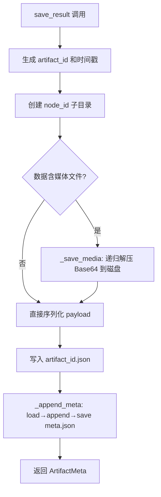
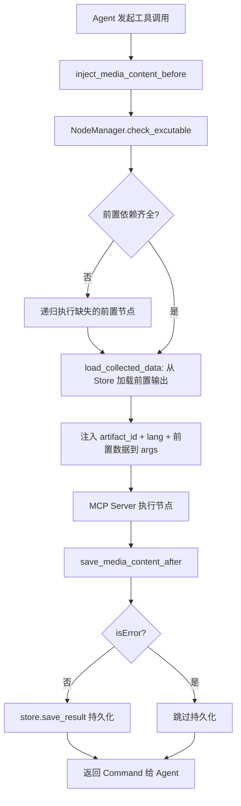

# PD-06.06 OpenStoryline — ArtifactStore 会话级工件持久化与生命周期管理

> 文档编号：PD-06.06
> 来源：OpenStoryline `src/open_storyline/storage/agent_memory.py`
> GitHub：https://github.com/FireRedTeam/FireRed-OpenStoryline.git
> 问题域：PD-06 记忆持久化 Memory Persistence
> 状态：可复用方案

---

## 第 1 章 问题与动机

### 1.1 核心问题

在多节点工作流系统中，每个节点（如视频理解、脚本生成、媒体搜索、时间线规划等）的执行结果需要被持久化，以便：

1. **跨节点数据传递**：下游节点需要读取上游节点的输出作为输入（如 `plan_timeline` 需要 `generate_script` 的结果）
2. **历史回溯**：用户或 Agent 可以通过 `artifact_id` 查询任意节点的历史执行结果
3. **依赖链自动补全**：当下游节点发现前置依赖缺失时，能递归执行上游节点并持久化结果
4. **会话隔离**：不同会话的工件互不干扰，每个会话有独立的存储空间
5. **生命周期管理**：过期会话的工件需要自动清理，防止磁盘无限增长

OpenStoryline 的核心场景是 AI 驱动的视频创作流水线，节点间传递的数据包含大量媒体文件（视频片段、图片、音频），这使得持久化方案必须同时处理结构化元数据和二进制媒体文件。

### 1.2 OpenStoryline 的解法概述

1. **ArtifactStore 会话级存储**：每个会话对应一个目录，节点结果以 `{artifact_id}.json` 存储，元数据集中在 `meta.json` 中追踪（`agent_memory.py:23-152`）
2. **FileCompressor 媒体压缩传输**：媒体文件通过 gzip+Base64 编码在 Client-Server 间传输，MD5 校验保证完整性（`file.py:23-145`）
3. **SessionLifecycleManager 生命周期管理**：两阶段清理策略（过期优先 + 数量限制），线程锁防并发，当前会话保护（`session_manager.py:14-167`）
4. **NodeManager 依赖检查**：通过 `check_excutable` 查询 ArtifactStore 中是否存在前置节点的最新输出（`node_manager.py:145-168`）
5. **ToolInterceptor 拦截器自动注入**：在工具调用前自动加载前置依赖数据，调用后自动持久化结果（`hooks/node_interceptors.py:40-311`）

### 1.3 设计思想

| 设计原则 | 具体实现 | 理由 | 替代方案 |
|----------|----------|------|----------|
| 文件系统即数据库 | JSON 文件 + 目录层级 = session/node/artifact | 零依赖，部署简单，适合单机工作流 | SQLite、Redis |
| 元数据与数据分离 | meta.json 追踪索引，{id}.json 存实际数据 | 查询元数据不需要加载全部数据 | 单文件存储所有内容 |
| 拦截器驱动持久化 | before/after 拦截器自动完成存取 | 节点代码无需关心持久化逻辑 | 每个节点手动调用 store |
| 会话级隔离 | UUID4 session_id 作为顶层目录名 | 天然隔离，无需额外的多租户逻辑 | 数据库表级隔离 |
| 惰性依赖补全 | 缺失前置节点时递归执行 default_process | 用户无需手动按顺序执行所有节点 | 严格拓扑排序强制顺序 |

---

## 第 2 章 源码实现分析

### 2.1 架构概览

OpenStoryline 的持久化架构分为三层：存储层（ArtifactStore + FileCompressor）、管理层（SessionLifecycleManager）、编排层（ToolInterceptor + NodeManager）。

```
┌─────────────────────────────────────────────────────────────────┐
│                     Agent (LangChain)                           │
│  build_agent() → create_agent(store=ArtifactStore)             │
├─────────────────────────────────────────────────────────────────┤
│              ToolInterceptor (before/after)                     │
│  inject_media_content_before → [Node执行] → save_media_after   │
├──────────────┬──────────────────────────────────────────────────┤
│ NodeManager  │  check_excutable() → 查询 ArtifactStore         │
│ (依赖检查)   │  kind_to_node_ids → 按 kind 查找候选节点         │
├──────────────┴──────────────────────────────────────────────────┤
│              ArtifactStore (会话级存储)                          │
│  save_result() / load_result() / get_latest_meta()             │
│  目录结构: {artifacts_root}/{session_id}/{node_id}/{id}.json   │
│  元数据:   {artifacts_root}/{session_id}/meta.json             │
├─────────────────────────────────────────────────────────────────┤
│              FileCompressor (媒体压缩)                          │
│  compress_and_encode() ←→ decode_and_decompress()              │
│  gzip/zlib + Base64 + MD5 校验                                 │
├─────────────────────────────────────────────────────────────────┤
│         SessionLifecycleManager (生命周期)                      │
│  cleanup_expired_sessions() → 过期清理 + 数量限制               │
│  get_artifact_store() → 创建 Store + 触发异步清理               │
└─────────────────────────────────────────────────────────────────┘
```

### 2.2 核心实现

#### 2.2.1 ArtifactStore — 会话级工件存储



对应源码 `src/open_storyline/storage/agent_memory.py:77-119`：

```python
def save_result(
    self,
    session_id,
    node_id,
    data: Any,
    search_media_dir: Optional[Path] = None
) -> ArtifactMeta:
    create_time = time.time()
    artifact_id = data['artifact_id']
    summary = data['summary']
    tool_excute_result = data['tool_excute_result']
    store_dir = self.blobs_dir / node_id
    file_path = store_dir / f"{artifact_id}.json"

    if not store_dir.exists():
        store_dir.mkdir(parents=True, exist_ok=True)
    
    if search_media_dir is None:
        search_media_dir = store_dir
    self._save_media(tool_excute_result, search_media_dir, artifact_id)
        
    save_data = {
        "payload": tool_excute_result,
        "session_id": session_id,
        "artifact_id": artifact_id,
        'node_id': node_id,
        'create_time': create_time,
    }
    with file_path.open("w", encoding='utf-8') as f:
        json.dump(save_data, f, ensure_ascii=False, indent=2)
    
    meta = ArtifactMeta(
        session_id=session_id,
        artifact_id=artifact_id,
        node_id=node_id,
        path=str(file_path),
        summary=summary,
        created_at=create_time,
    )
    self._append_meta(meta)
    return meta
```

关键设计点：
- `_save_media` 递归遍历 dict 值，发现含 `base64` 字段的 list[dict] 就解压到磁盘（`agent_memory.py:49-75`）
- `_append_meta` 采用 load-append-save 全量读写模式（`agent_memory.py:44-47`）
- `get_latest_meta` 按 `(node_id, session_id)` 过滤后取 `created_at` 最大值（`agent_memory.py:138-152`）

#### 2.2.2 ToolInterceptor — 拦截器驱动的自动持久化



对应源码 `src/open_storyline/mcp/hooks/node_interceptors.py:252-311`（after 拦截器）：

```python
@staticmethod
async def save_media_content_after(
    request: MCPToolCallRequest,
    handler,
):
    result = ""
    try:
        tool_call_result: CallToolResult = await handler(request)
        client_ctx = request.runtime.context
        result = tool_call_result.model_dump()
        tool_result = json.loads(result['content'][0]['text'])
        node_id = request.name
        artifact_id = tool_result['artifact_id']
        session_id = client_ctx.session_id
        store = request.runtime.store

        if not tool_result['isError']:
            if node_id == 'search_media':
                store.save_result(
                    session_id, node_id, tool_result,
                    Path(client_ctx.media_dir),
                )
            else:
                store.save_result(session_id, node_id, tool_result)
        # ... 返回 Command
```

### 2.3 实现细节

#### 会话生命周期管理

SessionLifecycleManager（`session_manager.py:14-167`）实现了两阶段清理策略：

1. **Phase 1 — 过期清理**：删除 `mtime < now - retention_days * 86400` 的会话目录
2. **Phase 2 — 数量限制**：剩余会话超过 `max_items`（默认 256）时，按 mtime 升序删除最旧的

并发控制通过 `threading.Lock` 的非阻塞 `acquire(blocking=False)` 实现——如果已有清理线程在运行，新请求直接跳过而非排队等待。当前活跃会话通过 `exclude_name` 参数保护，即使过期也不会被删除。

UUID4 验证（`session_manager.py:141-151`）确保只清理合法的会话目录，避免误删用户文件。

#### 媒体文件压缩传输

FileCompressor（`file.py:23-145`）提供 Client↔Server 间的媒体文件传输：
- 压缩：`gzip.compress()` 或 `zlib.compress()`
- 编码：`base64.b64encode()` 生成可 JSON 序列化的字符串
- 校验：`hashlib.md5()` 在压缩前计算，解压后验证一致性
- BaseNode 的 `_load_item`/`_pack_item`（`base_node.py:73-103`）在每次工具调用时自动执行解压/压缩

#### 依赖链递归补全

`node_interceptors.py:112-228` 中的 `execute_missing_dependencies` 实现了递归依赖解析：
- 对每个缺失的 `kind`，从 `kind_to_node_ids` 中取候选节点列表
- 按优先级尝试执行，成功则 break，失败则尝试下一个候选
- 被执行的节点自身也可能有缺失依赖，递归处理
- 递归深度通过 `depth` 参数追踪，用于日志缩进


---

## 第 3 章 迁移指南

### 3.1 迁移清单

**阶段 1：核心存储层**
- [ ] 实现 `ArtifactMeta` 数据类（session_id, artifact_id, node_id, path, summary, created_at）
- [ ] 实现 `ArtifactStore`：save_result / load_result / get_latest_meta
- [ ] 设计目录结构：`{root}/{session_id}/{node_id}/{artifact_id}.json` + `meta.json`

**阶段 2：生命周期管理**
- [ ] 实现 `SessionLifecycleManager`：两阶段清理（过期 + 数量限制）
- [ ] 添加并发控制（非阻塞锁）和当前会话保护
- [ ] 集成到应用启动/关闭生命周期

**阶段 3：拦截器集成**
- [ ] 实现 before 拦截器：依赖检查 + 数据注入
- [ ] 实现 after 拦截器：结果持久化
- [ ] 实现依赖链递归补全逻辑

**阶段 4：媒体文件支持（可选）**
- [ ] 实现 FileCompressor：gzip/zlib + Base64 + MD5
- [ ] 在 BaseNode 中集成 _load_item / _pack_item

### 3.2 适配代码模板

以下是一个精简的 ArtifactStore 实现，可直接用于任何多步骤工作流系统：

```python
from dataclasses import dataclass, asdict
from pathlib import Path
from typing import Any, List, Optional, Tuple
import json
import time


@dataclass
class ArtifactMeta:
    session_id: str
    artifact_id: str
    node_id: str
    path: str
    summary: Optional[str]
    created_at: float


class ArtifactStore:
    """会话级工件存储，每个会话一个目录，meta.json 追踪所有工件元数据"""

    def __init__(self, artifacts_dir: str | Path, session_id: str) -> None:
        self.artifacts_dir = Path(artifacts_dir)
        self.session_id = session_id
        self.blobs_dir = self.artifacts_dir / session_id
        self.meta_path = self.blobs_dir / "meta.json"
        self.blobs_dir.mkdir(parents=True, exist_ok=True)
        if not self.meta_path.exists() or self.meta_path.stat().st_size == 0:
            self._save_meta_list([])

    def _load_meta_list(self) -> List[ArtifactMeta]:
        if not self.meta_path.exists():
            return []
        with self.meta_path.open("r", encoding="utf-8") as f:
            return [ArtifactMeta(**item) for item in json.load(f)]

    def _save_meta_list(self, metas: List[ArtifactMeta]):
        with self.meta_path.open("w", encoding="utf-8") as f:
            json.dump([asdict(m) for m in metas], f, ensure_ascii=False, indent=2)

    def save_result(self, node_id: str, data: dict) -> ArtifactMeta:
        create_time = time.time()
        artifact_id = data["artifact_id"]
        store_dir = self.blobs_dir / node_id
        store_dir.mkdir(parents=True, exist_ok=True)
        file_path = store_dir / f"{artifact_id}.json"

        save_data = {
            "payload": data.get("payload", {}),
            "session_id": self.session_id,
            "artifact_id": artifact_id,
            "node_id": node_id,
            "create_time": create_time,
        }
        with file_path.open("w", encoding="utf-8") as f:
            json.dump(save_data, f, ensure_ascii=False, indent=2)

        meta = ArtifactMeta(
            session_id=self.session_id,
            artifact_id=artifact_id,
            node_id=node_id,
            path=str(file_path),
            summary=data.get("summary"),
            created_at=create_time,
        )
        metas = self._load_meta_list()
        metas.append(meta)
        self._save_meta_list(metas)
        return meta

    def load_result(self, artifact_id: str) -> Tuple[Optional[ArtifactMeta], Any]:
        metas = self._load_meta_list()
        meta = next((m for m in metas if m.artifact_id == artifact_id), None)
        if meta is None:
            return None, f"artifact `{artifact_id}` not found"
        with open(meta.path, "r", encoding="utf-8") as f:
            return meta, json.load(f)

    def get_latest_meta(self, *, node_id: str) -> Optional[ArtifactMeta]:
        metas = self._load_meta_list()
        candidates = [m for m in metas if m.node_id == node_id]
        return max(candidates, key=lambda m: m.created_at) if candidates else None

    def generate_artifact_id(self, node_id: str) -> str:
        return f"{node_id}_{time.time()}"
```

### 3.3 适用场景

| 场景 | 适用度 | 说明 |
|------|--------|------|
| 多步骤 AI 工作流（视频/文档生成） | ⭐⭐⭐ | 核心场景，节点间数据传递 + 历史回溯 |
| MCP Server 工具链 | ⭐⭐⭐ | 拦截器模式天然适配 MCP 工具调用 |
| 单机批处理流水线 | ⭐⭐ | 文件系统存储足够，但缺少分布式支持 |
| 多用户 SaaS 服务 | ⭐ | meta.json 全量读写在高并发下有瓶颈 |
| 需要复杂查询的场景 | ⭐ | 无索引，只能按 artifact_id 或 node_id 线性扫描 |

---

## 第 4 章 测试用例

```python
import json
import time
import tempfile
import threading
from pathlib import Path
from unittest.mock import patch

import pytest

from open_storyline.storage.agent_memory import ArtifactStore, ArtifactMeta
from open_storyline.storage.session_manager import SessionLifecycleManager


class TestArtifactStore:
    """ArtifactStore 核心功能测试"""

    @pytest.fixture
    def store(self, tmp_path):
        return ArtifactStore(artifacts_dir=tmp_path, session_id="test-session-001")

    def test_save_and_load_result(self, store):
        """正常路径：保存后能正确加载"""
        data = {
            "artifact_id": "node_a_123",
            "summary": "test summary",
            "tool_excute_result": {"clips": [{"name": "clip1"}]},
        }
        meta = store.save_result("test-session-001", "node_a", data)

        assert meta.artifact_id == "node_a_123"
        assert meta.node_id == "node_a"

        loaded_meta, loaded_data = store.load_result("node_a_123")
        assert loaded_meta.artifact_id == "node_a_123"
        assert loaded_data["payload"]["clips"][0]["name"] == "clip1"

    def test_load_nonexistent_artifact(self, store):
        """边界情况：加载不存在的 artifact"""
        meta, msg = store.load_result("nonexistent_id")
        assert meta is None
        assert "not found" in msg

    def test_get_latest_meta_multiple_versions(self, store):
        """多版本场景：返回最新的 meta"""
        for i in range(3):
            data = {
                "artifact_id": f"node_b_{i}",
                "summary": f"v{i}",
                "tool_excute_result": {},
            }
            store.save_result("test-session-001", "node_b", data)
            time.sleep(0.01)

        latest = store.get_latest_meta(node_id="node_b", session_id="test-session-001")
        assert latest.artifact_id == "node_b_2"

    def test_generate_artifact_id_uniqueness(self, store):
        """artifact_id 生成唯一性"""
        ids = {store.generate_artifact_id("node_x") for _ in range(100)}
        # time.time() 精度足够在循环中产生不同值
        assert len(ids) >= 90  # 允许少量碰撞


class TestSessionLifecycleManager:
    """SessionLifecycleManager 生命周期测试"""

    def test_cleanup_expired_sessions(self, tmp_path):
        """过期会话被清理"""
        import uuid
        manager = SessionLifecycleManager(
            artifacts_root=tmp_path / "artifacts",
            cache_root=tmp_path / "cache",
            retention_days=0,  # 立即过期
            enable_cleanup=True,
        )
        session_id = uuid.uuid4().hex
        session_dir = tmp_path / "artifacts" / session_id
        session_dir.mkdir(parents=True)
        (session_dir / "meta.json").write_text("[]")

        manager.cleanup_expired_sessions(current_session_id="other-session")
        assert not session_dir.exists()

    def test_current_session_protected(self, tmp_path):
        """当前会话不被清理"""
        import uuid
        session_id = uuid.uuid4().hex
        manager = SessionLifecycleManager(
            artifacts_root=tmp_path / "artifacts",
            cache_root=tmp_path / "cache",
            retention_days=0,
            enable_cleanup=True,
        )
        session_dir = tmp_path / "artifacts" / session_id
        session_dir.mkdir(parents=True)

        manager.cleanup_expired_sessions(current_session_id=session_id)
        assert session_dir.exists()

    def test_concurrent_cleanup_skips(self, tmp_path):
        """并发清理时第二个请求被跳过"""
        manager = SessionLifecycleManager(
            artifacts_root=tmp_path / "artifacts",
            cache_root=tmp_path / "cache",
            enable_cleanup=True,
        )
        manager._cleanup_lock.acquire()  # 模拟正在清理
        manager.cleanup_expired_sessions()  # 应该直接返回
        manager._cleanup_lock.release()
```

