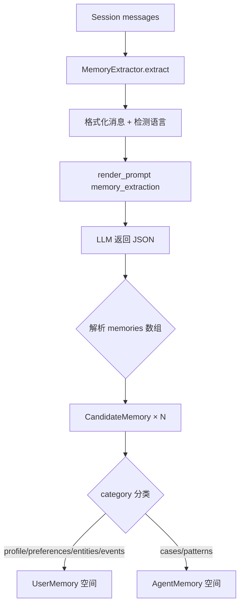
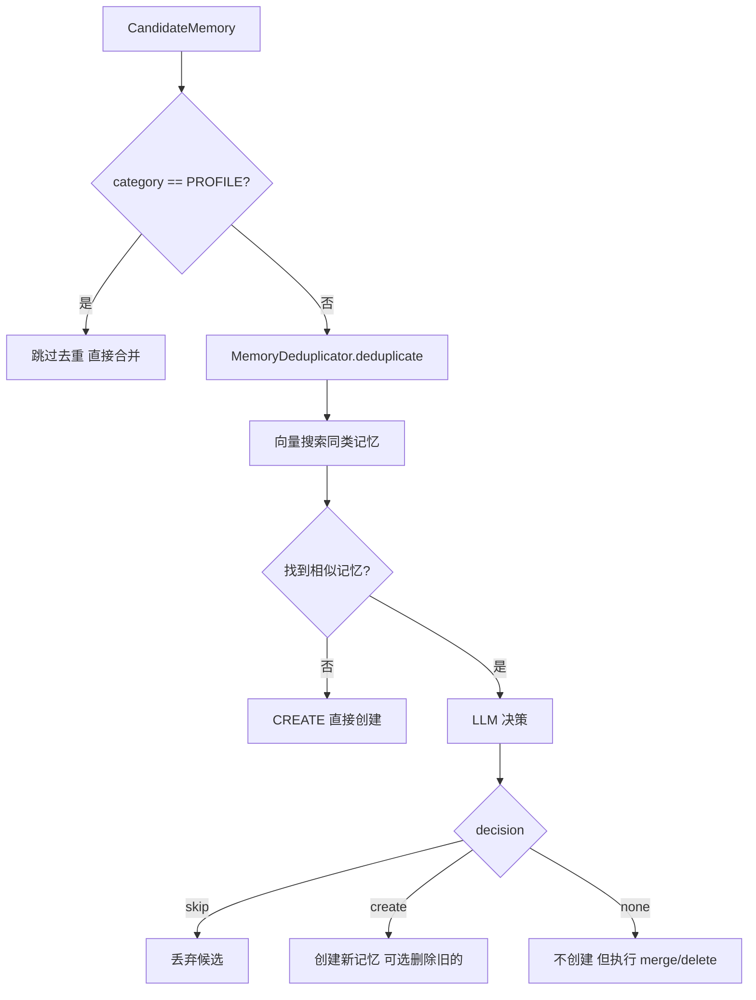

# PD-06.OV OpenViking — 6 类记忆 LLM 去重与热度衰减持久化

> 文档编号：PD-06.OV
> 来源：OpenViking `openviking/session/memory_extractor.py`, `openviking/session/memory_deduplicator.py`, `openviking/retrieve/memory_lifecycle.py`
> GitHub：https://github.com/volcengine/OpenViking.git
> 问题域：PD-06 记忆持久化 Memory Persistence
> 状态：可复用方案

---

## 第 1 章 问题与动机

### 1.1 核心问题

Agent 在多轮对话中积累的用户偏好、实体知识、解决方案等信息，如果不持久化就会随会话结束而丢失。但简单的"全量保存"会导致记忆膨胀、重复条目泛滥、检索质量下降。核心挑战在于：

1. **记忆分类**：不同类型的信息（用户画像 vs 事件记录 vs 可复用模式）有不同的生命周期和更新策略
2. **去重与合并**：同一主题的记忆在多次会话中反复提取，需要智能判断是创建新条目还是合并到已有条目
3. **热度衰减**：长期不被访问的记忆应该在检索排序中自然下沉，而非永远占据高位
4. **双空间隔离**：用户个人记忆（偏好、画像）和 Agent 工作记忆（案例、模式）需要隔离存储，防止交叉污染

### 1.2 OpenViking 的解法概述

OpenViking 实现了一套完整的 6 类记忆提取-去重-持久化-检索体系：

1. **6 类记忆分类**（`memory_extractor.py:28-39`）：profile / preferences / entities / events / cases / patterns，前 4 类归 UserMemory 空间，后 2 类归 AgentMemory 空间
2. **L0/L1/L2 三层结构**（`memory_extraction.yaml:143-163`）：每条记忆包含 abstract（索引层）、overview（结构化摘要）、content（完整叙述），支持不同粒度的检索和注入
3. **LLM 驱动去重**（`memory_deduplicator.py:88-115`）：向量预过滤 + LLM 决策（skip/create/none），支持 per-memory 的 merge/delete 操作
4. **热度衰减排序**（`memory_lifecycle.py:19-64`）：sigmoid(log1p(active_count)) × exp_decay(age) 公式，7 天半衰期，与语义相似度加权混合
5. **会话归档与记忆提取流水线**（`session.py:221-295`）：commit 时自动归档消息 → 提取长期记忆 → 更新活跃计数 → 创建关联关系

### 1.3 设计思想

| 设计原则 | 具体实现 | 理由 | 替代方案 |
|----------|----------|------|----------|
| 分类优先于全量 | 6 类枚举 + UserMemory/AgentMemory 双空间 | 不同类型记忆的更新策略不同（profile 总是合并，events 总是创建） | 单一记忆池 + 标签过滤 |
| LLM 判断优于规则 | 去重决策交给 LLM 而非纯相似度阈值 | 语义重复 vs 补充信息的边界模糊，规则难以覆盖 | 固定阈值 cosine > 0.9 即去重 |
| 三层粒度 | L0 abstract / L1 overview / L2 content | 检索时用 L0 快速匹配，注入时按 token 预算选择层级 | 单层全文存储 |
| 热度自然衰减 | sigmoid × exp_decay 公式 | 避免手动清理，让时间和使用频率自动调节排序 | 定期批量清理过期记忆 |
| 偏好单面粒度 | 每条 preferences 记忆只覆盖一个独立面（facet） | 更新某个偏好时不会破坏其他无关偏好 | 一条记忆包含所有偏好 |

---

## 第 2 章 源码实现分析

### 2.1 架构概览

OpenViking 的记忆持久化系统由 4 个核心模块组成，通过 SessionCompressor 串联：

```
┌─────────────────────────────────────────────────────────────────┐
│                     Session.commit()                            │
│  session.py:221                                                 │
├─────────────────────────────────────────────────────────────────┤
│  1. Archive messages → history/archive_NNN/                     │
│  2. SessionCompressor.extract_long_term_memories()              │
│  3. Write current messages to AGFS                              │
│  4. Create relations + Update active_count                      │
└──────────────────────┬──────────────────────────────────────────┘
                       │
          ┌────────────▼────────────┐
          │   SessionCompressor     │
          │   compressor.py:47      │
          ├─────────────────────────┤
          │ ┌─────────────────────┐ │
          │ │  MemoryExtractor    │ │  LLM → 6 类 CandidateMemory
          │ │  memory_extractor   │ │
          │ └────────┬────────────┘ │
          │          │              │
          │ ┌────────▼────────────┐ │
          │ │ MemoryDeduplicator  │ │  向量预过滤 + LLM 决策
          │ │ memory_deduplicator │ │  skip / create / none+merge/delete
          │ └────────┬────────────┘ │
          │          │              │
          │ ┌────────▼────────────┐ │
          │ │  VikingFS + VDB     │ │  .md 文件 + 向量索引
          │ │  持久化 + 向量化     │ │
          │ └─────────────────────┘ │
          └─────────────────────────┘
                       │
          ┌────────────▼────────────┐
          │ HierarchicalRetriever   │
          │ hierarchical_retriever  │
          ├─────────────────────────┤
          │ 递归目录搜索 + 热度加权  │
          │ hotness_score() 混合排序 │
          └─────────────────────────┘
```

### 2.2 核心实现

#### 2.2.1 记忆提取：6 类分类与 L0/L1/L2 三层结构



对应源码 `openviking/session/memory_extractor.py:149-230`：

```python
async def extract(
    self,
    context: dict,
    user: UserIdentifier,
    session_id: str,
) -> List[CandidateMemory]:
    """Extract memory candidates from messages."""
    vlm = get_openviking_config().vlm
    if not vlm or not vlm.is_available():
        logger.warning("LLM not available, skipping memory extraction")
        return []

    messages = context["messages"]
    formatted_messages = "\n".join(
        [f"[{m.role}]: {m.content}" for m in messages if m.content]
    )
    if not formatted_messages:
        return []

    output_language = self._detect_output_language(
        messages, fallback_language=fallback_language
    )

    prompt = render_prompt(
        "compression.memory_extraction",
        {
            "summary": "",
            "recent_messages": formatted_messages,
            "user": user._user_id,
            "feedback": "",
            "output_language": output_language,
        },
    )

    response = await vlm.get_completion_async(prompt)
    data = parse_json_from_response(response) or {}

    candidates = []
    for mem in data.get("memories", []):
        category_str = mem.get("category", "patterns")
        try:
            category = MemoryCategory(category_str)
        except ValueError:
            category = MemoryCategory.PATTERNS  # 降级到 patterns

        candidates.append(
            CandidateMemory(
                category=category,
                abstract=mem.get("abstract", ""),
                overview=mem.get("overview", ""),
                content=mem.get("content", ""),
                source_session=session_id,
                user=user,
                language=output_language,
            )
        )
    return candidates
```

关键设计点：
- **语言检测**（`memory_extractor.py:107-147`）：只分析 user role 消息，避免 assistant/system 文本干扰语言判断。支持 CJK 消歧（假名优先判定日语）
- **降级策略**：无法识别的 category 降级为 `patterns`，而非丢弃

#### 2.2.2 LLM 驱动去重：向量预过滤 + 三决策模型



对应源码 `openviking/session/memory_deduplicator.py:88-115`：

```python
async def deduplicate(
    self,
    candidate: CandidateMemory,
) -> DedupResult:
    """Decide how to handle a candidate memory."""
    # Step 1: Vector pre-filtering
    similar_memories = await self._find_similar_memories(candidate)

    if not similar_memories:
        return DedupResult(
            decision=DedupDecision.CREATE,
            candidate=candidate,
            similar_memories=[],
            actions=[],
            reason="No similar memories found",
        )

    # Step 2: LLM decision
    decision, reason, actions = await self._llm_decision(
        candidate, similar_memories
    )

    return DedupResult(
        decision=decision,
        candidate=candidate,
        similar_memories=similar_memories,
        actions=None if decision == DedupDecision.SKIP else actions,
        reason=reason,
    )
```

去重决策的安全规则（`memory_deduplicator.py:256-359`）：
- **skip 不携带 actions**：跳过时不允许对已有记忆做任何操作
- **create + merge 归一化为 none**：防止同时创建新记忆又合并到旧记忆的矛盾
- **冲突检测**：同一 URI 出现矛盾操作（既 merge 又 delete）时两个都丢弃
- **facet 隔离**：不同偏好面的记忆不应互相删除（在 prompt 中约束）

### 2.3 实现细节

#### 热度衰减公式

`openviking/retrieve/memory_lifecycle.py:19-64` 实现了记忆热度评分：

```
score = sigmoid(log1p(active_count)) × exp(-ln2/half_life × age_days)
```

- **频率分量**：`sigmoid(log1p(N))` 将访问次数映射到 (0, 1)，对数压缩避免高频访问主导
- **时间衰减**：指数衰减，默认 7 天半衰期，30 天后几乎归零
- **混合权重**：在 `hierarchical_retriever.py:45` 中 `HOTNESS_ALPHA = 0.2`，即 80% 语义相似度 + 20% 热度

#### 会话归档与记忆提取流水线

`session.py:221-295` 的 `commit()` 方法实现了完整的会话提交流程：

1. **归档当前消息** → `history/archive_NNN/`（含 messages.jsonl + .abstract.md + .overview.md）
2. **提取长期记忆** → SessionCompressor 调用 MemoryExtractor + MemoryDeduplicator
3. **写入当前消息** → AGFS 的 messages.jsonl
4. **创建关联关系** → 记忆 ↔ 资源/技能的双向链接
5. **更新活跃计数** → 被使用的 context/skill 的 active_count +1

#### 记忆存储结构

```
viking://user/{user_space}/memories/
├── profile.md                    # 单文件，总是合并
├── preferences/
│   ├── mem_{uuid1}.md           # 每个偏好面一个文件
│   └── mem_{uuid2}.md
├── entities/
│   └── mem_{uuid3}.md
└── events/
    └── mem_{uuid4}.md

viking://agent/{agent_space}/memories/
├── cases/
│   └── mem_{uuid5}.md
└── patterns/
    └── mem_{uuid6}.md
```

---

## 第 3 章 迁移指南

### 3.1 迁移清单

**阶段 1：记忆分类与提取（核心）**
- [ ] 定义记忆分类枚举（至少区分 user/agent 两个空间）
- [ ] 实现 L0/L1/L2 三层结构的 CandidateMemory 数据类
- [ ] 编写记忆提取 prompt（参考 `memory_extraction.yaml` 的 6 类分类指引和 few-shot 示例）
- [ ] 实现语言检测（如果需要多语言支持）

**阶段 2：去重与合并**
- [ ] 实现向量预过滤（embed candidate → 搜索同类记忆）
- [ ] 编写去重决策 prompt（skip/create/none + merge/delete）
- [ ] 实现决策解析与安全规则（create+merge→none 归一化、冲突丢弃）
- [ ] 实现 LLM 驱动的记忆合并（merge_memory_bundle）

**阶段 3：热度衰减与检索**
- [ ] 实现 hotness_score 函数（sigmoid × exp_decay）
- [ ] 在检索排序中混合语义相似度和热度分数
- [ ] 实现 active_count 自增（每次记忆被使用时 +1）

**阶段 4：会话生命周期集成**
- [ ] 在会话 commit 时触发记忆提取
- [ ] 实现消息归档（history/archive_NNN/）
- [ ] 创建记忆与资源/技能的双向关联

### 3.2 适配代码模板

以下是一个可独立运行的记忆提取 + 去重 + 热度评分的最小实现：

```python
"""Minimal memory persistence system inspired by OpenViking."""

import math
import json
from dataclasses import dataclass, field
from datetime import datetime, timezone
from enum import Enum
from typing import List, Optional, Dict, Any
from uuid import uuid4


# ── 1. 记忆分类 ──

class MemoryCategory(str, Enum):
    PROFILE = "profile"
    PREFERENCES = "preferences"
    ENTITIES = "entities"
    EVENTS = "events"
    CASES = "cases"
    PATTERNS = "patterns"


USER_CATEGORIES = {
    MemoryCategory.PROFILE, MemoryCategory.PREFERENCES,
    MemoryCategory.ENTITIES, MemoryCategory.EVENTS,
}
ALWAYS_MERGE = {MemoryCategory.PROFILE}


@dataclass
class CandidateMemory:
    category: MemoryCategory
    abstract: str       # L0: one-line index
    overview: str       # L1: structured summary
    content: str        # L2: full narrative
    source_session: str = ""
    language: str = "auto"


# ── 2. 热度评分 ──

def hotness_score(
    active_count: int,
    updated_at: Optional[datetime],
    now: Optional[datetime] = None,
    half_life_days: float = 7.0,
) -> float:
    """0.0–1.0 hotness: sigmoid(log1p(count)) × exp_decay(age)."""
    if now is None:
        now = datetime.now(timezone.utc)
    freq = 1.0 / (1.0 + math.exp(-math.log1p(active_count)))
    if updated_at is None:
        return 0.0
    if updated_at.tzinfo is None:
        updated_at = updated_at.replace(tzinfo=timezone.utc)
    if now.tzinfo is None:
        now = now.replace(tzinfo=timezone.utc)
    age_days = max((now - updated_at).total_seconds() / 86400.0, 0.0)
    decay_rate = math.log(2) / half_life_days
    recency = math.exp(-decay_rate * age_days)
    return freq * recency


# ── 3. 去重决策 ──

class DedupDecision(str, Enum):
    SKIP = "skip"
    CREATE = "create"
    NONE = "none"


def parse_dedup_response(
    data: dict,
    similar_count: int,
) -> tuple[DedupDecision, str]:
    """Parse LLM dedup response with safety normalization."""
    decision_str = str(data.get("decision", "create")).lower()
    reason = str(data.get("reason", ""))
    actions = data.get("list", [])

    decision_map = {
        "skip": DedupDecision.SKIP,
        "create": DedupDecision.CREATE,
        "none": DedupDecision.NONE,
        "merge": DedupDecision.NONE,  # legacy compat
    }
    decision = decision_map.get(decision_str, DedupDecision.CREATE)

    # Safety: create + merge → none
    has_merge = any(
        isinstance(a, dict) and a.get("decide") == "merge"
        for a in (actions if isinstance(actions, list) else [])
    )
    if decision == DedupDecision.CREATE and has_merge:
        decision = DedupDecision.NONE
        reason += " | normalized:create+merge->none"

    return decision, reason


# ── 4. 检索混合排序 ──

def blended_score(
    semantic: float,
    active_count: int,
    updated_at: Optional[datetime],
    alpha: float = 0.2,
) -> float:
    """Blend semantic similarity with hotness."""
    h = hotness_score(active_count, updated_at)
    return (1 - alpha) * semantic + alpha * h
```

### 3.3 适用场景

| 场景 | 适用度 | 说明 |
|------|--------|------|
| 多轮对话 Agent（客服/助手） | ⭐⭐⭐ | 核心场景，用户偏好和历史案例需要跨会话保持 |
| 知识管理系统 | ⭐⭐⭐ | L0/L1/L2 三层结构天然适合知识的多粒度索引 |
| 个人 AI 助手 | ⭐⭐⭐ | UserMemory/AgentMemory 双空间隔离用户隐私 |
| 单次问答系统 | ⭐ | 无跨会话需求，记忆系统过重 |
| 实时交易系统 | ⭐ | 热度衰减的 7 天半衰期不适合秒级时效场景 |

---

## 第 4 章 测试用例

基于 OpenViking 真实测试（`tests/test_memory_lifecycle.py`）和函数签名编写：

```python
"""Tests for OpenViking-style memory persistence."""

import math
import pytest
from datetime import datetime, timedelta, timezone

NOW = datetime(2026, 2, 26, 12, 0, 0, tzinfo=timezone.utc)


class TestHotnessScore:
    """Tests for hotness_score() — memory_lifecycle.py:19."""

    def test_zero_count_just_now(self):
        score = hotness_score(0, NOW, now=NOW)
        assert 0.49 < score < 0.51  # sigmoid(0) = 0.5

    def test_high_count_just_now(self):
        score = hotness_score(1000, NOW, now=NOW)
        assert score > 0.95

    def test_old_memory_decays(self):
        old = NOW - timedelta(days=30)
        score = hotness_score(10, old, now=NOW)
        assert score < 0.1

    def test_none_updated_at_returns_zero(self):
        assert hotness_score(100, None, now=NOW) == 0.0

    def test_half_life_at_7_days(self):
        at_half = NOW - timedelta(days=7)
        score = hotness_score(0, at_half, now=NOW)
        assert 0.24 < score < 0.26  # 0.5 * 0.5

    def test_monotonic_with_count(self):
        s1 = hotness_score(1, NOW, now=NOW)
        s2 = hotness_score(10, NOW, now=NOW)
        s3 = hotness_score(100, NOW, now=NOW)
        assert s1 < s2 < s3

    def test_monotonic_with_recency(self):
        s_old = hotness_score(5, NOW - timedelta(days=30), now=NOW)
        s_new = hotness_score(5, NOW - timedelta(hours=1), now=NOW)
        assert s_old < s_new


class TestDedupDecision:
    """Tests for dedup decision parsing."""

    def test_skip_returns_skip(self):
        d, _ = parse_dedup_response({"decision": "skip"}, 3)
        assert d == DedupDecision.SKIP

    def test_create_with_merge_normalizes_to_none(self):
        data = {
            "decision": "create",
            "list": [{"uri": "x", "decide": "merge"}],
        }
        d, reason = parse_dedup_response(data, 1)
        assert d == DedupDecision.NONE
        assert "normalized" in reason

    def test_legacy_merge_maps_to_none(self):
        d, _ = parse_dedup_response({"decision": "merge"}, 1)
        assert d == DedupDecision.NONE

    def test_unknown_decision_defaults_to_create(self):
        d, _ = parse_dedup_response({"decision": "unknown"}, 0)
        assert d == DedupDecision.CREATE


class TestBlendedScore:
    """Tests for semantic + hotness blending."""

    def test_alpha_zero_preserves_semantic(self):
        score = blended_score(0.85, 100, NOW, alpha=0.0)
        assert score == pytest.approx(0.85)

    def test_hot_memory_can_overtake_cold(self):
        cold = blended_score(0.8, 1, NOW - timedelta(days=60), alpha=0.4)
        hot = blended_score(0.6, 500, NOW, alpha=0.4)
        assert hot > cold

    def test_default_alpha_preserves_semantic_dominance(self):
        high_sem = blended_score(0.9, 0, NOW - timedelta(days=30), alpha=0.2)
        low_sem = blended_score(0.3, 1000, NOW, alpha=0.2)
        assert high_sem > low_sem


class TestMemoryCategory:
    """Tests for category classification."""

    def test_user_categories(self):
        for cat in [MemoryCategory.PROFILE, MemoryCategory.PREFERENCES,
                    MemoryCategory.ENTITIES, MemoryCategory.EVENTS]:
            assert cat in USER_CATEGORIES

    def test_agent_categories(self):
        for cat in [MemoryCategory.CASES, MemoryCategory.PATTERNS]:
            assert cat not in USER_CATEGORIES

    def test_profile_always_merge(self):
        assert MemoryCategory.PROFILE in ALWAYS_MERGE
```

---

## 第 5 章 跨域关联

| 关联域 | 关系类型 | 说明 |
|--------|----------|------|
| PD-01 上下文管理 | 依赖 | 记忆提取依赖会话消息的上下文窗口；L0/L1/L2 三层结构本身就是上下文压缩的一种形式 |
| PD-02 多 Agent 编排 | 协同 | UserMemory/AgentMemory 双空间设计支持多 Agent 场景下的记忆隔离；commit 时的 active_count 更新为编排器提供使用频率信号 |
| PD-03 容错与重试 | 协同 | LLM 提取/去重失败时降级为 CREATE（保守策略），不丢失记忆；VLM 不可用时静默跳过而非报错 |
| PD-04 工具系统 | 协同 | 记忆与技能（skill）通过双向关联链接；commit 时自动追踪 tool usage 并创建 relation |
| PD-07 质量检查 | 依赖 | 去重决策的 facet 隔离规则和 delete boundary 约束是记忆质量的关键保障 |
| PD-08 搜索与检索 | 依赖 | HierarchicalRetriever 的递归目录搜索 + 热度加权是记忆被消费的唯一通道 |
| PD-11 可观测性 | 协同 | ExtractionStats 统计 created/merged/deleted/skipped 四类计数；SessionStats 追踪 memories_extracted |

---

## 第 6 章 来源文件索引

| 文件 | 行范围 | 关键实现 |
|------|--------|----------|
| `openviking/session/memory_extractor.py` | L28-L39 | MemoryCategory 6 类枚举定义 |
| `openviking/session/memory_extractor.py` | L42-L63 | CandidateMemory / MergedMemoryPayload 数据类 |
| `openviking/session/memory_extractor.py` | L65-L104 | MemoryExtractor 类：CATEGORY_DIRS 映射、UserMemory/AgentMemory 空间划分 |
| `openviking/session/memory_extractor.py` | L107-L147 | _detect_output_language：多语言检测（CJK 消歧） |
| `openviking/session/memory_extractor.py` | L149-L230 | extract()：LLM 驱动的 6 类记忆提取 |
| `openviking/session/memory_extractor.py` | L232-L308 | create_memory()：持久化到 AGFS + 向量化 |
| `openviking/session/memory_extractor.py` | L310-L414 | _append_to_profile / _merge_memory_bundle：Profile 合并与 LLM 合并 |
| `openviking/session/memory_deduplicator.py` | L27-L59 | DedupDecision / MemoryActionDecision / DedupResult 类型定义 |
| `openviking/session/memory_deduplicator.py` | L62-L115 | MemoryDeduplicator.deduplicate()：向量预过滤 + LLM 决策 |
| `openviking/session/memory_deduplicator.py` | L117-L186 | _find_similar_memories()：向量搜索 + 阈值过滤 + _dedup_score 标注 |
| `openviking/session/memory_deduplicator.py` | L188-L254 | _llm_decision()：LLM 去重决策 + facet 提取 |
| `openviking/session/memory_deduplicator.py` | L256-L359 | _parse_decision_payload()：安全规则（create+merge→none、冲突丢弃） |
| `openviking/session/compressor.py` | L47-L57 | SessionCompressor：串联 Extractor + Deduplicator |
| `openviking/session/compressor.py` | L121-L230 | extract_long_term_memories()：完整提取流水线 |
| `openviking/session/compressor.py` | L68-L102 | _merge_into_existing()：合并候选到已有记忆 |
| `openviking/session/session.py` | L65-L94 | Session 类初始化：auto_commit_threshold、JSONL 存储 |
| `openviking/session/session.py` | L221-L295 | commit()：归档 + 提取 + 持久化 + 关联 + 活跃计数 |
| `openviking/session/session.py` | L313-L367 | get_context_for_search()：归档检索（关键词匹配 + 时间排序） |
| `openviking/retrieve/memory_lifecycle.py` | L19-L64 | hotness_score()：sigmoid × exp_decay 热度评分 |
| `openviking/retrieve/hierarchical_retriever.py` | L37-L46 | HierarchicalRetriever 常量：HOTNESS_ALPHA=0.2 |
| `openviking/retrieve/hierarchical_retriever.py` | L361-L427 | _convert_to_matched_contexts()：语义 + 热度混合排序 |
| `openviking/core/context.py` | L32-L37 | ContextLevel 枚举：L0/L1/L2 |
| `openviking/core/context.py` | L50-L94 | Context 类：URI 驱动的统一上下文对象 |
| `openviking/prompts/templates/compression/memory_extraction.yaml` | L34-L294 | 记忆提取 prompt：6 类分类指引 + few-shot 示例 |
| `openviking/prompts/templates/compression/dedup_decision.yaml` | L27-L104 | 去重决策 prompt：skip/create/none + merge/delete |
| `openviking/prompts/templates/compression/memory_merge_bundle.yaml` | L48-L86 | 记忆合并 prompt：L0/L1/L2 一次性合并 |
| `openviking/service/session_service.py` | L22-L168 | SessionService：会话 CRUD + commit + extract |
| `tests/test_memory_lifecycle.py` | L16-L127 | 热度评分单元测试 + 混合排序测试 |

---

## 第 7 章 横向对比维度

> **重要：** 本章用于自动填充 Butcher Wiki 的横向对比表。

```json comparison_data
{
  "project": "OpenViking",
  "dimensions": {
    "记忆结构": "6 类枚举（profile/preferences/entities/events/cases/patterns）+ L0/L1/L2 三层粒度",
    "更新机制": "LLM 驱动三决策（skip/create/none）+ per-memory merge/delete",
    "事实提取": "YAML prompt 模板 + 6 类 few-shot 示例 + 语言自动检测",
    "存储方式": "VikingFS .md 文件 + VikingDB 向量索引，URI 驱动",
    "注入方式": "HierarchicalRetriever 递归目录搜索 + 热度加权混合排序",
    "生命周期管理": "sigmoid×exp_decay 热度衰减（7天半衰期）+ active_count 自增",
    "记忆检索": "全局向量搜索 + 递归子目录搜索 + rerank + 热度混合",
    "记忆增长控制": "LLM 去重 skip/merge 减少冗余；facet 粒度防止偏好膨胀",
    "多渠道会话隔离": "UserMemory/AgentMemory 双空间 + user_space/agent_space URI 隔离",
    "敏感信息过滤": "prompt 中约束只提取个性化信息，排除通用知识和临时信息",
    "粒度化嵌入": "L0 abstract 用于向量化索引，L2 content 用于合并和注入",
    "角色记忆隔离": "UserMemory（profile/preferences/entities/events）vs AgentMemory（cases/patterns）"
  }
}
```

### 域元数据补充

```json domain_metadata
{
  "solution_summary": "OpenViking 用 6 类记忆分类（profile/preferences/entities/events/cases/patterns）+ LLM 驱动 skip/create/none 三决策去重 + sigmoid×exp_decay 热度衰减排序实现跨会话记忆持久化",
  "description": "记忆分类粒度与去重决策的安全归一化规则对记忆质量至关重要",
  "sub_problems": [
    "偏好面粒度控制：如何确保每条 preferences 记忆只覆盖一个独立可更新的面（facet），避免更新时破坏无关偏好",
    "去重决策归一化：LLM 返回矛盾决策（如 create+merge）时如何安全降级而非报错",
    "多语言记忆输出：如何检测用户语言并确保提取的记忆以用户语言存储而非 LLM 默认语言",
    "Profile 单文件合并：用户画像作为单文件总是合并而非创建新条目的策略与冲突处理"
  ],
  "best_practices": [
    "分类驱动更新策略：不同类别采用不同更新策略（profile 总是合并、events 总是创建、preferences 按 facet 去重）",
    "三决策安全归一化：create+merge 自动降级为 none，同一 URI 矛盾操作两个都丢弃",
    "热度衰减优于手动清理：sigmoid×exp_decay 让时间和使用频率自动调节排序，无需定期批量清理",
    "facet 隔离防误删：去重 prompt 中明确约束不同偏好面的记忆不应互相删除"
  ]
}
```
