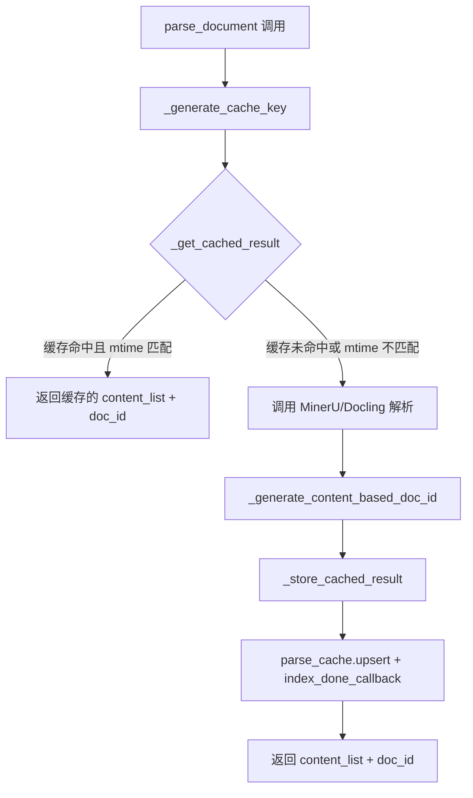
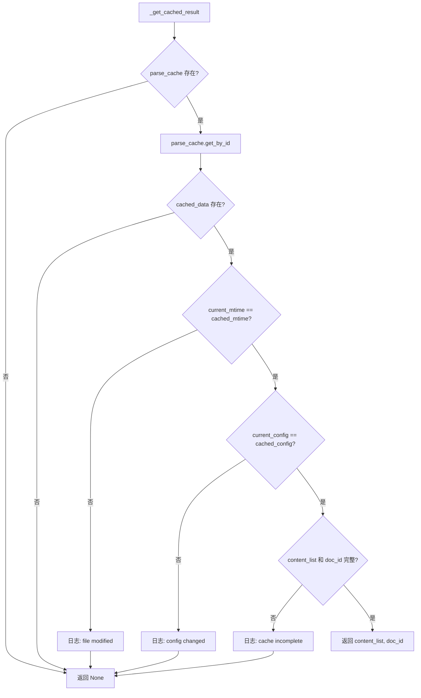
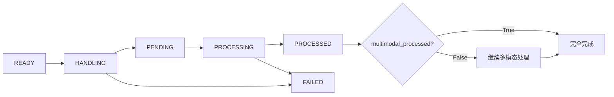

# PD-06.06 RAG-Anything — 四层 KV 持久化与文档状态追踪

> 文档编号：PD-06.06
> 来源：RAG-Anything `raganything/processor.py`, `raganything/raganything.py`, `raganything/config.py`
> GitHub：https://github.com/HKUDS/RAG-Anything.git
> 问题域：PD-06 记忆持久化 Memory Persistence
> 状态：可复用方案

---

## 第 1 章 问题与动机

### 1.1 核心问题

多模态 RAG 系统面临的持久化挑战远比纯文本 RAG 复杂：

1. **解析成本高昂**：PDF/图片/表格的解析（MinerU/Docling）耗时数分钟，重复解析浪费大量计算资源
2. **文档状态复杂**：文本处理和多模态处理是两个独立阶段，需要精确追踪每个阶段的完成状态
3. **多层存储协同**：解析缓存、文档状态、知识图谱、向量数据库四层存储需要一致性保证
4. **跨会话复用**：用户关闭程序后重新打开，已处理的文档不应重新解析和入库

### 1.2 RAG-Anything 的解法概述

RAG-Anything 构建了一个四层持久化体系，每层解决不同粒度的持久化需求：

1. **parse_cache（解析缓存）**：基于 LightRAG KV 存储，以 `file_path + mtime + config_hash` 为 key，缓存文档解析结果，避免重复解析（`raganything/processor.py:44-92`）
2. **doc_status（文档状态）**：6 态状态机（READY → HANDLING → PENDING → PROCESSING → PROCESSED → FAILED），精确追踪文本和多模态两阶段处理进度（`raganything/base.py:4-12`）
3. **知识图谱 + 向量数据库**：通过 LightRAG 的 `chunk_entity_relation_graph`、`entities_vdb`、`relationships_vdb` 持久化实体和关系（`raganything/processor.py:1003-1018`）
4. **finalize_storages 统一清理**：`asyncio.gather` 并发 finalize 所有存储层，确保数据落盘（`raganything/raganything.py:371-415`）

### 1.3 设计思想

| 设计原则 | 具体实现 | 理由 | 替代方案 |
|----------|----------|------|----------|
| 内容寻址缓存 | MD5(file_path + mtime + parser_config) 作为 cache_key | 文件修改或配置变更自动失效缓存 | 基于文件名的简单缓存（无法检测内容变更） |
| 双阶段状态追踪 | `status` + `multimodal_processed` 两个独立字段 | 文本和多模态处理解耦，支持部分完成 | 单一状态字段（无法表达"文本完成但多模态未完成"） |
| 委托式存储 | 复用 LightRAG 的 `key_string_value_json_storage_cls` | 零额外依赖，存储后端随 LightRAG 配置自动切换 | 自建存储层（增加维护成本） |
| 并发 finalize | `asyncio.gather(*tasks)` 并发清理所有存储 | 减少关闭时间，避免串行等待 | 串行 finalize（慢但简单） |
| atexit 兜底 | `atexit.register(self.close)` 注册清理钩子 | 即使用户忘记手动 finalize，数据也能落盘 | 仅依赖手动调用（数据丢失风险） |

---

## 第 2 章 源码实现分析

### 2.1 架构概览

RAG-Anything 的持久化架构分为四层，每层通过 LightRAG 的 KV 存储抽象统一管理：

```
┌─────────────────────────────────────────────────────────┐
│                    RAGAnything                           │
│  ┌──────────────┐  ┌──────────────┐  ┌───────────────┐  │
│  │ parse_cache   │  │  doc_status   │  │ llm_response  │  │
│  │ (KV Storage)  │  │ (KV Storage)  │  │   _cache      │  │
│  │ namespace:    │  │ (LightRAG    │  │ (LightRAG     │  │
│  │ "parse_cache" │  │  内置)        │  │  内置)         │  │
│  └──────┬───────┘  └──────┬───────┘  └──────┬────────┘  │
│         │                 │                  │           │
│  ┌──────┴─────────────────┴──────────────────┴────────┐  │
│  │          LightRAG KV Storage Abstraction           │  │
│  │  (JsonKVStorage / PostgresKVStorage / ...)         │  │
│  └────────────────────────┬───────────────────────────┘  │
│                           │                              │
│  ┌────────────────────────┴───────────────────────────┐  │
│  │  Knowledge Graph + Vector DB + Text Chunks         │  │
│  │  (chunk_entity_relation_graph, entities_vdb,       │  │
│  │   relationships_vdb, chunks_vdb, text_chunks)      │  │
│  └────────────────────────────────────────────────────┘  │
│                           │                              │
│  ┌────────────────────────┴───────────────────────────┐  │
│  │           finalize_storages()                      │  │
│  │  asyncio.gather(parse_cache.finalize(),            │  │
│  │                 lightrag.finalize_storages())       │  │
│  └────────────────────────────────────────────────────┘  │
└─────────────────────────────────────────────────────────┘
```

### 2.2 核心实现

#### 2.2.1 解析缓存：内容寻址 + mtime 双重校验



对应源码 `raganything/processor.py:44-92`（缓存 key 生成）：

```python
def _generate_cache_key(
    self, file_path: Path, parse_method: str = None, **kwargs
) -> str:
    # Get file modification time
    mtime = file_path.stat().st_mtime

    # Create configuration dict for cache key
    config_dict = {
        "file_path": str(file_path.absolute()),
        "mtime": mtime,
        "parser": self.config.parser,
        "parse_method": parse_method or self.config.parse_method,
    }

    # Add relevant kwargs to config
    relevant_kwargs = {
        k: v for k, v in kwargs.items()
        if k in ["lang", "device", "start_page", "end_page",
                  "formula", "table", "backend", "source"]
    }
    config_dict.update(relevant_kwargs)

    # Generate hash from config
    config_str = json.dumps(config_dict, sort_keys=True)
    cache_key = hashlib.md5(config_str.encode()).hexdigest()
    return cache_key
```

缓存读取时的双重校验逻辑 `raganything/processor.py:133-210`：



对应源码 `raganything/processor.py:151-200`：

```python
async def _get_cached_result(self, cache_key, file_path, parse_method=None, **kwargs):
    cached_data = await self.parse_cache.get_by_id(cache_key)
    if not cached_data:
        return None

    # Check file modification time
    current_mtime = file_path.stat().st_mtime
    cached_mtime = cached_data.get("mtime", 0)
    if current_mtime != cached_mtime:
        return None

    # Check parsing configuration
    cached_config = cached_data.get("parse_config", {})
    current_config = {
        "parser": self.config.parser,
        "parse_method": parse_method or self.config.parse_method,
    }
    relevant_kwargs = {k: v for k, v in kwargs.items()
                       if k in ["lang", "device", "start_page", "end_page",
                                "formula", "table", "backend", "source"]}
    current_config.update(relevant_kwargs)

    if cached_config != current_config:
        return None

    content_list = cached_data.get("content_list", [])
    doc_id = cached_data.get("doc_id")
    if content_list and doc_id:
        return content_list, doc_id
    return None
```

#### 2.2.2 文档状态机：双阶段处理追踪



对应源码 `raganything/base.py:4-12`（状态枚举）：

```python
class DocStatus(str, Enum):
    """Document processing status"""
    READY = "ready"
    HANDLING = "handling"
    PENDING = "pending"
    PROCESSING = "processing"
    PROCESSED = "processed"
    FAILED = "failed"
```

多模态完成标记 `raganything/processor.py:1342-1363`：

```python
async def _mark_multimodal_processing_complete(self, doc_id: str):
    current_doc_status = await self.lightrag.doc_status.get_by_id(doc_id)
    if current_doc_status:
        await self.lightrag.doc_status.upsert({
            doc_id: {
                **current_doc_status,
                "multimodal_processed": True,
                "updated_at": time.strftime("%Y-%m-%dT%H:%M:%S+00:00"),
            }
        })
        await self.lightrag.doc_status.index_done_callback()
```

### 2.3 实现细节

#### parse_cache 初始化：委托 LightRAG 存储工厂

`raganything/raganything.py:279-291` 展示了 parse_cache 如何复用 LightRAG 的存储抽象：

```python
# Initialize parse cache storage using LightRAG's KV storage
self.parse_cache = self.lightrag.key_string_value_json_storage_cls(
    namespace="parse_cache",
    workspace=self.lightrag.workspace,
    global_config=self.lightrag.__dict__,
    embedding_func=self.embedding_func,
)
await self.parse_cache.initialize()
```

这意味着当 LightRAG 配置为 PostgreSQL 后端时，parse_cache 自动使用 PostgreSQL；配置为 JSON 文件时，自动使用本地 JSON 文件。零额外配置。

#### finalize_storages：并发清理 + atexit 兜底

`raganything/raganything.py:371-415`：

```python
async def finalize_storages(self):
    tasks = []
    if self.parse_cache is not None:
        tasks.append(self.parse_cache.finalize())
    if self.lightrag is not None:
        tasks.append(self.lightrag.finalize_storages())
    if tasks:
        await asyncio.gather(*tasks)
```

`raganything/raganything.py:117`（atexit 注册）：

```python
atexit.register(self.close)
```

#### doc_status 更新：chunk 列表增量追加

`raganything/processor.py:1301-1340` 展示了多模态 chunk 如何增量追加到 doc_status：

```python
async def _update_doc_status_with_chunks_type_aware(self, doc_id, chunk_ids):
    current_doc_status = await self.lightrag.doc_status.get_by_id(doc_id)
    if current_doc_status:
        existing_chunks_list = current_doc_status.get("chunks_list", [])
        existing_chunks_count = current_doc_status.get("chunks_count", 0)
        updated_chunks_list = existing_chunks_list + chunk_ids
        updated_chunks_count = existing_chunks_count + len(chunk_ids)
        await self.lightrag.doc_status.upsert({
            doc_id: {
                **current_doc_status,
                "chunks_list": updated_chunks_list,
                "chunks_count": updated_chunks_count,
                "updated_at": time.strftime("%Y-%m-%dT%H:%M:%S+00:00"),
            }
        })
        await self.lightrag.doc_status.index_done_callback()
```

---

## 第 3 章 迁移指南

### 3.1 迁移清单

#### 阶段 1：解析缓存层（核心，1 个文件）

- [ ] 实现 `_generate_cache_key(file_path, config)` — 基于文件路径 + mtime + 配置哈希生成缓存 key
- [ ] 实现 `_get_cached_result(cache_key)` — 读取缓存并校验 mtime + config 一致性
- [ ] 实现 `_store_cached_result(cache_key, result)` — 写入缓存并调用 `index_done_callback()` 落盘
- [ ] 选择 KV 存储后端（JSON 文件 / Redis / PostgreSQL）

#### 阶段 2：文档状态追踪（1 个文件）

- [ ] 定义 `DocStatus` 枚举（READY / HANDLING / PROCESSING / PROCESSED / FAILED）
- [ ] 实现 `doc_status` KV 存储，key 为 doc_id
- [ ] 添加 `multimodal_processed` 布尔字段，支持双阶段完成检测
- [ ] 实现 `is_document_fully_processed(doc_id)` 查询方法

#### 阶段 3：存储生命周期管理（1 个文件）

- [ ] 实现 `finalize_storages()` — `asyncio.gather` 并发 finalize 所有存储
- [ ] 注册 `atexit.register(self.close)` 兜底清理
- [ ] 在 `close()` 中处理有/无 event loop 两种情况

### 3.2 适配代码模板

以下是一个可直接复用的解析缓存实现模板：

```python
import hashlib
import json
import time
import asyncio
import atexit
from pathlib import Path
from enum import Enum
from typing import Any, Dict, Optional, Tuple, List
from dataclasses import dataclass


class DocStatus(str, Enum):
    READY = "ready"
    HANDLING = "handling"
    PROCESSING = "processing"
    PROCESSED = "processed"
    FAILED = "failed"


@dataclass
class CacheEntry:
    content: Any
    mtime: float
    config_hash: str
    cached_at: float
    version: str = "1.0"


class ParseCacheManager:
    """解析缓存管理器 — 移植自 RAG-Anything 的 ProcessorMixin"""

    def __init__(self, kv_storage):
        """
        Args:
            kv_storage: 任何实现了 get_by_id / upsert / index_done_callback / finalize 的 KV 存储
        """
        self.storage = kv_storage

    def generate_cache_key(self, file_path: Path, config: dict) -> str:
        mtime = file_path.stat().st_mtime
        key_data = {
            "file_path": str(file_path.absolute()),
            "mtime": mtime,
            **config,
        }
        key_str = json.dumps(key_data, sort_keys=True)
        return hashlib.md5(key_str.encode()).hexdigest()

    async def get(self, cache_key: str, file_path: Path, config: dict) -> Optional[Any]:
        cached = await self.storage.get_by_id(cache_key)
        if not cached:
            return None
        # 双重校验：mtime + config
        if file_path.stat().st_mtime != cached.get("mtime", 0):
            return None
        if cached.get("config_hash") != self._config_hash(config):
            return None
        return cached.get("content")

    async def put(self, cache_key: str, content: Any, file_path: Path, config: dict):
        entry = {
            cache_key: {
                "content": content,
                "mtime": file_path.stat().st_mtime,
                "config_hash": self._config_hash(config),
                "cached_at": time.time(),
                "version": "1.0",
            }
        }
        await self.storage.upsert(entry)
        await self.storage.index_done_callback()

    def _config_hash(self, config: dict) -> str:
        return hashlib.md5(json.dumps(config, sort_keys=True).encode()).hexdigest()

    async def finalize(self):
        await self.storage.finalize()


class DocStatusTracker:
    """文档状态追踪器 — 移植自 RAG-Anything 的双阶段状态机"""

    def __init__(self, kv_storage):
        self.storage = kv_storage

    async def set_status(self, doc_id: str, status: DocStatus, **extra_fields):
        current = await self.storage.get_by_id(doc_id) or {}
        current.update({
            "status": status.value,
            "updated_at": time.strftime("%Y-%m-%dT%H:%M:%S+00:00"),
            **extra_fields,
        })
        await self.storage.upsert({doc_id: current})
        await self.storage.index_done_callback()

    async def mark_multimodal_complete(self, doc_id: str):
        current = await self.storage.get_by_id(doc_id) or {}
        current["multimodal_processed"] = True
        current["updated_at"] = time.strftime("%Y-%m-%dT%H:%M:%S+00:00")
        await self.storage.upsert({doc_id: current})
        await self.storage.index_done_callback()

    async def is_fully_processed(self, doc_id: str) -> bool:
        status = await self.storage.get_by_id(doc_id)
        if not status:
            return False
        return (
            status.get("status") == DocStatus.PROCESSED.value
            and status.get("multimodal_processed", False)
        )

    async def finalize(self):
        await self.storage.finalize()


class StorageLifecycleManager:
    """存储生命周期管理器 — 移植自 RAG-Anything 的 finalize_storages"""

    def __init__(self):
        self._storages: List[Any] = []
        atexit.register(self._sync_close)

    def register(self, storage):
        self._storages.append(storage)

    async def finalize_all(self):
        tasks = [s.finalize() for s in self._storages if s is not None]
        if tasks:
            await asyncio.gather(*tasks)

    def _sync_close(self):
        try:
            asyncio.get_running_loop()
            asyncio.create_task(self.finalize_all())
        except RuntimeError:
            asyncio.run(self.finalize_all())
```

### 3.3 适用场景

| 场景 | 适用度 | 说明 |
|------|--------|------|
| 多模态文档 RAG 系统 | ⭐⭐⭐ | 完美匹配：解析缓存 + 双阶段状态追踪 |
| 纯文本 RAG 系统 | ⭐⭐ | 解析缓存仍有价值，双阶段状态可简化为单阶段 |
| 批量文档处理管道 | ⭐⭐⭐ | 缓存避免重复解析，状态追踪支持断点续传 |
| 实时对话 Agent | ⭐ | 对话记忆更适合 PD-06 中其他项目的方案（如 LLM 提取） |
| 知识图谱构建系统 | ⭐⭐⭐ | 实体/关系持久化 + doc_status 追踪完美适配 |

---

## 第 4 章 测试用例

```python
import pytest
import asyncio
import json
import time
import tempfile
from pathlib import Path
from unittest.mock import AsyncMock, MagicMock


class MockKVStorage:
    """模拟 LightRAG 的 KV 存储接口"""
    def __init__(self):
        self._data = {}

    async def get_by_id(self, key):
        return self._data.get(key)

    async def upsert(self, data: dict):
        for k, v in data.items():
            self._data[k] = v

    async def index_done_callback(self):
        pass  # 模拟落盘

    async def finalize(self):
        pass

    async def initialize(self):
        pass


class TestParseCacheManager:
    """测试解析缓存管理器 — 基于 processor.py:44-278 的真实逻辑"""

    @pytest.fixture
    def cache_manager(self):
        storage = MockKVStorage()
        return ParseCacheManager(storage)

    @pytest.fixture
    def temp_file(self, tmp_path):
        f = tmp_path / "test.pdf"
        f.write_text("dummy content")
        return f

    @pytest.mark.asyncio
    async def test_cache_miss_returns_none(self, cache_manager, temp_file):
        config = {"parser": "mineru", "parse_method": "auto"}
        key = cache_manager.generate_cache_key(temp_file, config)
        result = await cache_manager.get(key, temp_file, config)
        assert result is None

    @pytest.mark.asyncio
    async def test_cache_hit_returns_content(self, cache_manager, temp_file):
        config = {"parser": "mineru", "parse_method": "auto"}
        key = cache_manager.generate_cache_key(temp_file, config)
        await cache_manager.put(key, [{"type": "text", "text": "hello"}], temp_file, config)
        result = await cache_manager.get(key, temp_file, config)
        assert result == [{"type": "text", "text": "hello"}]

    @pytest.mark.asyncio
    async def test_cache_invalidated_on_file_change(self, cache_manager, temp_file):
        config = {"parser": "mineru", "parse_method": "auto"}
        key = cache_manager.generate_cache_key(temp_file, config)
        await cache_manager.put(key, [{"type": "text"}], temp_file, config)
        # 修改文件 → mtime 变化
        time.sleep(0.1)
        temp_file.write_text("modified content")
        result = await cache_manager.get(key, temp_file, config)
        assert result is None

    @pytest.mark.asyncio
    async def test_cache_invalidated_on_config_change(self, cache_manager, temp_file):
        config1 = {"parser": "mineru", "parse_method": "auto"}
        config2 = {"parser": "docling", "parse_method": "auto"}
        key = cache_manager.generate_cache_key(temp_file, config1)
        await cache_manager.put(key, [{"type": "text"}], temp_file, config1)
        result = await cache_manager.get(key, temp_file, config2)
        assert result is None


class TestDocStatusTracker:
    """测试文档状态追踪器 — 基于 base.py:4-12 和 processor.py:1342-1390"""

    @pytest.fixture
    def tracker(self):
        return DocStatusTracker(MockKVStorage())

    @pytest.mark.asyncio
    async def test_initial_status(self, tracker):
        assert await tracker.is_fully_processed("doc-123") is False

    @pytest.mark.asyncio
    async def test_text_processed_but_not_multimodal(self, tracker):
        await tracker.set_status("doc-123", DocStatus.PROCESSED)
        assert await tracker.is_fully_processed("doc-123") is False

    @pytest.mark.asyncio
    async def test_fully_processed(self, tracker):
        await tracker.set_status("doc-123", DocStatus.PROCESSED)
        await tracker.mark_multimodal_complete("doc-123")
        assert await tracker.is_fully_processed("doc-123") is True

    @pytest.mark.asyncio
    async def test_failed_status(self, tracker):
        await tracker.set_status("doc-123", DocStatus.FAILED, error_msg="parse error")
        status = await tracker.storage.get_by_id("doc-123")
        assert status["status"] == "failed"
        assert status["error_msg"] == "parse error"


class TestStorageLifecycleManager:
    """测试存储生命周期管理 — 基于 raganything.py:371-415"""

    @pytest.mark.asyncio
    async def test_finalize_all_storages(self):
        manager = StorageLifecycleManager()
        s1 = MockKVStorage()
        s2 = MockKVStorage()
        s1.finalize = AsyncMock()
        s2.finalize = AsyncMock()
        manager.register(s1)
        manager.register(s2)
        await manager.finalize_all()
        s1.finalize.assert_called_once()
        s2.finalize.assert_called_once()

    @pytest.mark.asyncio
    async def test_finalize_with_none_storage(self):
        manager = StorageLifecycleManager()
        manager.register(None)
        await manager.finalize_all()  # 不应抛异常
```

---

## 第 5 章 跨域关联

| 关联域 | 关系类型 | 说明 |
|--------|----------|------|
| PD-01 上下文管理 | 协同 | parse_cache 缓存的 content_list 直接影响后续上下文窗口的构建；`max_context_tokens` 配置控制上下文大小 |
| PD-03 容错与重试 | 依赖 | DocStatus.FAILED 状态触发重试逻辑；`process_document_complete_lightrag_api` 中 try/except 将失败状态持久化到 doc_status |
| PD-04 工具系统 | 协同 | parse_cache 的存储后端通过 LightRAG 的 `key_string_value_json_storage_cls` 工厂动态选择，属于工具系统的可插拔设计 |
| PD-07 质量检查 | 协同 | `is_document_fully_processed` 和 `get_document_processing_status` 提供质量检查的数据基础 |
| PD-08 搜索与检索 | 依赖 | 持久化的知识图谱（entities_vdb, relationships_vdb）和 chunks_vdb 是检索的数据源 |
| PD-11 可观测性 | 协同 | doc_status 中的 `updated_at`、`chunks_count`、`error_msg` 字段为可观测性提供数据 |

---

## 第 6 章 来源文件索引

| 文件 | 行范围 | 关键实现 |
|------|--------|----------|
| `raganything/processor.py` | L26-27 | ProcessorMixin 类定义 |
| `raganything/processor.py` | L44-92 | `_generate_cache_key` — 内容寻址缓存 key 生成 |
| `raganything/processor.py` | L94-131 | `_generate_content_based_doc_id` — 基于内容哈希的 doc_id |
| `raganything/processor.py` | L133-210 | `_get_cached_result` — 缓存读取 + mtime/config 双重校验 |
| `raganything/processor.py` | L212-278 | `_store_cached_result` — 缓存写入 + index_done_callback 落盘 |
| `raganything/processor.py` | L280-453 | `parse_document` — 完整解析流程（缓存优先） |
| `raganything/processor.py` | L478-509 | `_process_multimodal_content` — 多模态处理状态检查 |
| `raganything/processor.py` | L627-665 | doc_status chunk 列表增量更新 |
| `raganything/processor.py` | L1003-1018 | `_store_chunks_to_lightrag_storage_type_aware` — 向量库持久化 |
| `raganything/processor.py` | L1301-1340 | `_update_doc_status_with_chunks_type_aware` — chunk 列表追加 |
| `raganything/processor.py` | L1342-1363 | `_mark_multimodal_processing_complete` — 多模态完成标记 |
| `raganything/processor.py` | L1365-1389 | `is_document_fully_processed` — 完整处理状态查询 |
| `raganything/base.py` | L4-12 | `DocStatus` 枚举定义（6 态状态机） |
| `raganything/raganything.py` | L49-95 | RAGAnything dataclass 定义（含 parse_cache 字段） |
| `raganything/raganything.py` | L99-134 | `__post_init__` — 初始化 + atexit 注册 |
| `raganything/raganything.py` | L136-152 | `close` — 同步/异步兼容的清理方法 |
| `raganything/raganything.py` | L231-369 | `_ensure_lightrag_initialized` — parse_cache 初始化 |
| `raganything/raganything.py` | L371-415 | `finalize_storages` — 并发 finalize 所有存储 |
| `raganything/config.py` | L13-153 | `RAGAnythingConfig` — 全配置化 dataclass |
| `raganything/query.py` | L25-98 | `_generate_multimodal_cache_key` — 查询缓存 key 生成 |
| `raganything/query.py` | L224-298 | `aquery_with_multimodal` — 查询结果缓存读写 |

---

## 第 7 章 横向对比维度

> **重要：** 本章用于自动填充 Butcher Wiki 的横向对比表。

```json comparison_data
{
  "project": "RAG-Anything",
  "dimensions": {
    "记忆结构": "四层分离：parse_cache / doc_status / KG+VDB / llm_response_cache",
    "更新机制": "增量追加 chunks_list + upsert 覆盖写入",
    "事实提取": "LLM 驱动实体关系抽取 + 多模态处理器描述生成",
    "存储方式": "委托 LightRAG KV 存储抽象，支持 JSON/PostgreSQL 等后端",
    "注入方式": "parse_document 缓存优先，命中则跳过解析直接返回",
    "循环检测": "doc_status 6 态状态机 + multimodal_processed 布尔标记防重复",
    "成本追踪": "parse_cache 避免重复解析，llm_response_cache 避免重复 LLM 调用",
    "多提供商摘要": "不涉及（单一 LightRAG 存储抽象，后端可切换）",
    "缓存失效策略": "mtime + config_hash 双重校验，文件修改或配置变更自动失效",
    "生命周期管理": "asyncio.gather 并发 finalize + atexit 兜底清理"
  }
}
```

### 域元数据补充

```json domain_metadata
{
  "solution_summary": "RAG-Anything 用 LightRAG KV 存储构建四层持久化（parse_cache/doc_status/KG+VDB/llm_cache），以 mtime+config_hash 双重校验实现解析缓存失效，6 态状态机追踪文本+多模态双阶段处理进度",
  "description": "多模态文档处理系统中解析结果缓存与双阶段处理状态的持久化协同",
  "sub_problems": [
    "多模态双阶段完成检测：文本处理完成但多模态未完成时的状态表达",
    "存储后端委托：如何零配置复用宿主框架的存储抽象层"
  ],
  "best_practices": [
    "mtime+config_hash 双重校验：文件修改或解析配置变更都能自动失效缓存，比单一 mtime 更可靠",
    "atexit 兜底 + asyncio.gather 并发 finalize：即使用户忘记手动清理，数据也能落盘",
    "委托式存储优于自建：复用宿主框架的 KV 存储抽象，存储后端随配置自动切换，零额外维护"
  ]
}
```
