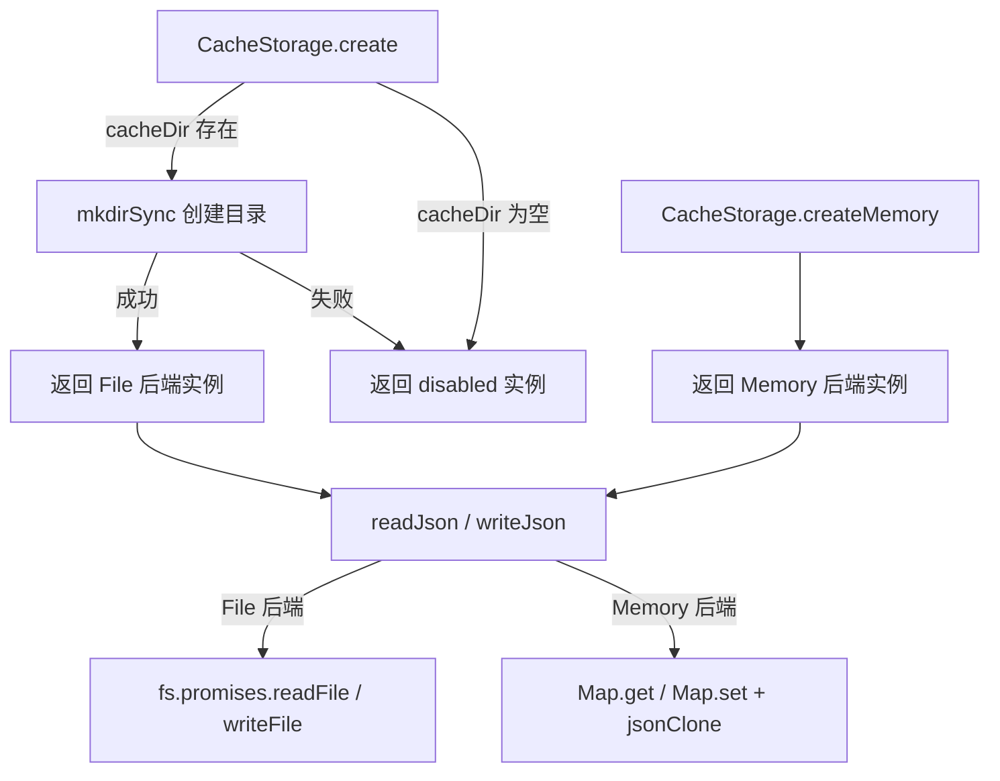
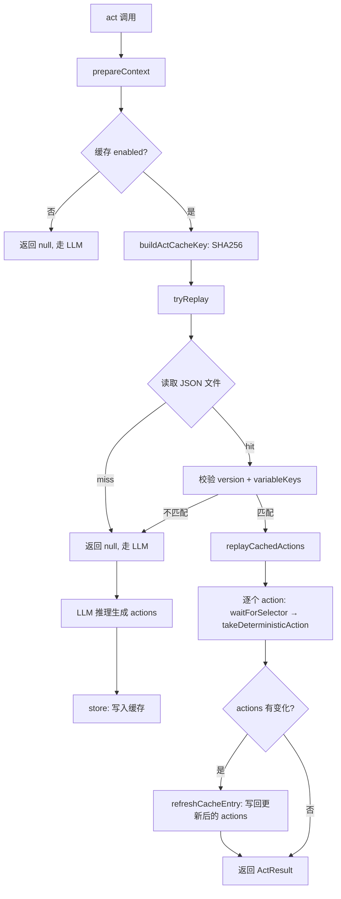
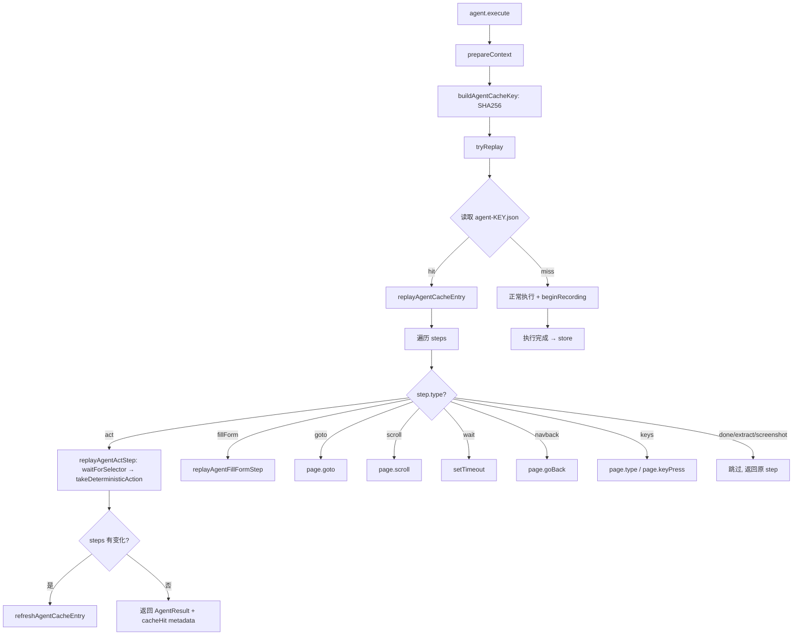

# PD-06.20 Stagehand — 双层缓存持久化与 Self-Heal 回放

> 文档编号：PD-06.20
> 来源：Stagehand `packages/core/lib/v3/cache/`
> GitHub：https://github.com/browserbase/stagehand.git
> 问题域：PD-06 记忆持久化 Memory Persistence
> 状态：可复用方案

---

## 第 1 章 问题与动机

### 1.1 核心问题

浏览器自动化 Agent 的每次操作都需要 LLM 推理来定位元素、规划动作序列。对于重复执行的相同指令（如"点击登录按钮"、"填写搜索框"），每次都调用 LLM 不仅浪费 token 成本，还增加了延迟。更棘手的是，网页 DOM 是动态变化的——上次缓存的 CSS 选择器可能因为页面更新而失效，简单的"命中即回放"策略会导致操作失败。

Stagehand 需要一套缓存持久化机制，满足：
1. **操作级缓存**：单个 `act()` 调用的动作序列可缓存复用
2. **会话级缓存**：完整 Agent 执行流程（多步骤 act/goto/scroll/keys 等）可整体缓存
3. **自愈能力**：回放时如果选择器变化，自动更新缓存条目而非失败
4. **双后端支持**：文件系统持久化（本地开发）和内存存储（服务端场景）

### 1.2 Stagehand 的解法概述

Stagehand 实现了一个精巧的双层缓存系统：

1. **ActCache（操作级）**：以 `SHA256(instruction + url + variableKeys)` 为键，缓存单个 `act()` 调用产生的 `Action[]` 序列。回放时逐个 action 执行，若选择器变化则自动 self-heal 更新缓存（`ActCache.ts:259-270`）
2. **AgentCache（会话级）**：以 `SHA256(instruction + startUrl + options + configSignature + variableKeys)` 为键，缓存完整 Agent 执行的 `AgentReplayStep[]`。支持 7 种步骤类型的回放（act/fillForm/goto/scroll/wait/navback/keys），同样具备 self-heal 能力（`AgentCache.ts:572-624`）
3. **CacheStorage（存储抽象）**：统一的 JSON 读写接口，支持文件系统和内存两种后端。文件后端自动创建目录，内存后端用 `Map<string, unknown>` 实现（`CacheStorage.ts:14-114`）
4. **ServerAgentCache（跨实例传输）**：支持在服务端创建临时内存缓存，执行完成后将缓存条目传输到客户端持久化（`serverAgentCache.ts:52-77`）
5. **敏感信息过滤**：缓存键生成时自动剥离 `apikey`/`api_key` 等敏感配置，截图 base64 在持久化前被裁剪（`AgentCache.ts:38, 446-459`）

### 1.3 设计思想

| 设计原则 | 具体实现 | 理由 | 替代方案 |
|----------|----------|------|----------|
| 确定性回放 | 缓存 Action[] 而非 LLM 响应 | Action 包含 selector+method+args，可直接执行无需再次推理 | 缓存 LLM prompt/response（但 DOM 变化后无法适配） |
| Self-Heal 更新 | 回放成功后对比 actions 差异，有变化则刷新缓存 | 选择器可能因页面更新而变化，自动修复避免缓存腐化 | 设置 TTL 过期（但无法利用仍有效的缓存） |
| 存储后端抽象 | CacheStorage 私有构造 + 静态工厂方法 | 文件系统和内存后端共享同一接口，调用方无感知 | 直接 if/else 判断存储类型（耦合度高） |
| 变量键分离 | 缓存键只含 variableKeys 不含 values | 同一指令模板不同变量值共享缓存，回放时动态替换 | 将 values 也纳入缓存键（缓存命中率低） |
| 深拷贝隔离 | cloneForCache() 在存储和读取时都做 JSON 深拷贝 | 防止缓存条目被外部引用意外修改 | 使用 structuredClone（不支持所有环境） |

---

## 第 2 章 源码实现分析

### 2.1 架构概览

Stagehand 的缓存系统由四个核心组件构成，通过依赖注入松耦合：

```
┌─────────────────────────────────────────────────────────┐
│                      V3 (Stagehand)                      │
│  cacheDir: string → CacheStorage.create()               │
│                                                          │
│  ┌──────────────┐    ┌───────────────┐                  │
│  │   ActCache    │    │  AgentCache   │                  │
│  │ (操作级缓存)  │    │ (会话级缓存)  │                  │
│  │              │    │               │                  │
│  │ prepareCtx() │    │ prepareCtx()  │                  │
│  │ tryReplay()  │    │ tryReplay()   │                  │
│  │ store()      │    │ store()       │                  │
│  │ self-heal    │    │ self-heal     │                  │
│  └──────┬───────┘    └──────┬────────┘                  │
│         │                   │                            │
│         └─────────┬─────────┘                            │
│                   ▼                                      │
│          ┌────────────────┐                              │
│          │  CacheStorage  │                              │
│          │ ┌────────────┐ │                              │
│          │ │ File (dir) │ │  ← 本地开发                  │
│          │ ├────────────┤ │                              │
│          │ │ Memory(Map)│ │  ← 服务端/测试               │
│          │ └────────────┘ │                              │
│          └────────────────┘                              │
│                                                          │
│  ┌──────────────────┐                                    │
│  │ ServerAgentCache  │  ← 跨实例缓存传输                 │
│  │ (内存→文件桥接)   │                                    │
│  └──────────────────┘                                    │
└─────────────────────────────────────────────────────────┘
```

### 2.2 核心实现

#### 2.2.1 CacheStorage — 双后端存储抽象



对应源码 `packages/core/lib/v3/cache/CacheStorage.ts:14-114`：

```typescript
export class CacheStorage {
  private constructor(
    private readonly logger: Logger,
    private readonly dir?: string,
    private readonly memoryStore?: Map<string, unknown>,
  ) {}

  static create(
    cacheDir: string | undefined,
    logger: Logger,
    options?: { label?: string },
  ): CacheStorage {
    if (!cacheDir) {
      return new CacheStorage(logger);
    }
    const resolved = path.resolve(cacheDir);
    try {
      fs.mkdirSync(resolved, { recursive: true });
      return new CacheStorage(logger, resolved);
    } catch (err) {
      // 降级为 disabled 实例
      return new CacheStorage(logger);
    }
  }

  static createMemory(logger: Logger): CacheStorage {
    return new CacheStorage(logger, undefined, new Map());
  }

  get enabled(): boolean {
    return !!this.dir || !!this.memoryStore;
  }

  async readJson<T>(fileName: string): Promise<ReadJsonResult<T>> {
    if (this.memoryStore) {
      if (!this.memoryStore.has(fileName)) {
        return { value: null };
      }
      const existing = this.memoryStore.get(fileName) as T;
      return { value: jsonClone(existing) };
    }
    const filePath = this.resolvePath(fileName);
    if (!filePath) return { value: null };
    try {
      const raw = await fs.promises.readFile(filePath, "utf8");
      return { value: JSON.parse(raw) as T };
    } catch (err) {
      const code = (err as NodeJS.ErrnoException)?.code;
      if (code === "ENOENT") return { value: null };
      return { value: null, error: err, path: filePath };
    }
  }
}
```

关键设计：私有构造函数 + 静态工厂方法确保只能通过 `create()` 或 `createMemory()` 创建实例。`enabled` 属性由 `dir` 或 `memoryStore` 的存在性决定，调用方无需关心具体后端。

#### 2.2.2 ActCache — 操作级缓存与 Self-Heal



对应源码 `packages/core/lib/v3/cache/ActCache.ts:183-194`（缓存键生成）：

```typescript
private buildActCacheKey(
  instruction: string,
  url: string,
  variableKeys: string[],
): string {
  const payload = JSON.stringify({
    instruction,
    url,
    variableKeys,
  });
  return createHash("sha256").update(payload).digest("hex");
}
```

Self-Heal 核心逻辑 `packages/core/lib/v3/cache/ActCache.ts:259-270`：

```typescript
if (
  success &&
  actions.length > 0 &&
  this.haveActionsChanged(entry.actions, actions)
) {
  await this.refreshCacheEntry(context, {
    ...entry,
    actions,
    message,
    actionDescription,
  });
}
```

`haveActionsChanged()` 逐字段对比 selector、description、method、arguments，任何差异都触发缓存刷新。

#### 2.2.3 AgentCache — 会话级缓存与多步骤回放



AgentCache 的缓存键比 ActCache 更复杂，包含 configSignature（模型名+系统提示+工具列表+集成列表的 JSON 序列化），确保不同配置的 Agent 不会误命中缓存。

对应源码 `packages/core/lib/v3/cache/AgentCache.ts:518-533`：

```typescript
private buildAgentCacheKey(
  instruction: string,
  startUrl: string,
  options: SanitizedAgentExecuteOptions,
  configSignature: string,
  variableKeys?: string[],
): string {
  const payload = {
    instruction,
    startUrl,
    options,
    configSignature,
    variableKeys: variableKeys ?? [],
  };
  return createHash("sha256").update(JSON.stringify(payload)).digest("hex");
}
```

### 2.3 实现细节

**录制-回放模式**：AgentCache 使用 `beginRecording()` / `recordStep()` / `endRecording()` 三阶段录制模式。V3 在 Agent 执行过程中调用 `recordStep()` 记录每个步骤，执行成功后调用 `endRecording()` 获取完整步骤列表并持久化。失败时调用 `discardRecording()` 丢弃录制（`AgentCache.ts:461-494`）。

**流式缓存包装**：`wrapStreamForCaching()` 方法拦截 `AgentStreamResult.result` Promise，在 resolve 时自动结束录制并存储缓存。这让流式 API 和非流式 API 共享同一套缓存逻辑（`AgentCache.ts:316-344`）。

**缓存传输**：`ServerAgentCache` 通过 `__internalCreateInMemoryAgentCacheHandle()` 临时替换 V3 实例的 `agentCache` 为内存后端，执行完成后通过 `consumeBufferedEntry()` 提取缓存条目，再由客户端调用 `storeTransferredEntry()` 持久化到文件系统（`serverAgentCache.ts:52-77`）。

**结果裁剪**：`pruneAgentResult()` 在持久化前删除 screenshot action 的 base64 字段，避免缓存文件膨胀（`AgentCache.ts:446-459`）。

**版本控制**：所有缓存条目都包含 `version: 1` 字段，读取时校验版本号，不匹配则视为 miss。这为未来缓存格式升级预留了迁移路径（`ActCache.ts:91, AgentCache.ts:199`）。

---

## 第 3 章 迁移指南

### 3.1 迁移清单

**阶段 1：存储抽象层**
- [ ] 实现 `CacheStorage` 类，支持文件系统和内存双后端
- [ ] 私有构造函数 + 静态工厂方法（`create` / `createMemory`）
- [ ] `readJson<T>` / `writeJson` 泛型接口，ENOENT 静默返回 null
- [ ] `enabled` 属性由后端存在性决定

**阶段 2：操作级缓存**
- [ ] 实现 `ActCache`，三步流程：`prepareContext → tryReplay → store`
- [ ] SHA256 缓存键：`instruction + url + variableKeys`
- [ ] 回放时逐 action 执行 `waitForSelector → takeDeterministicAction`
- [ ] Self-Heal：`haveActionsChanged()` 检测差异 → `refreshCacheEntry()` 更新

**阶段 3：会话级缓存**
- [ ] 实现 `AgentCache`，录制-回放模式：`beginRecording → recordStep → endRecording`
- [ ] 扩展缓存键：加入 `configSignature`（模型+提示+工具列表）
- [ ] 多步骤回放：按 step.type 分发到对应的 replay 方法
- [ ] 流式包装：`wrapStreamForCaching()` 拦截 result Promise

**阶段 4：高级特性**
- [ ] 缓存传输：服务端内存缓存 → 客户端文件持久化
- [ ] 结果裁剪：持久化前删除 base64 等大字段
- [ ] 敏感信息过滤：缓存键生成时剥离 API key
- [ ] 版本号校验：`version: 1` 字段，不匹配视为 miss

### 3.2 适配代码模板

以下是一个可直接复用的双后端缓存存储实现（TypeScript）：

```typescript
import fs from "fs";
import path from "path";
import { createHash } from "crypto";

// ---- 存储抽象层 ----
type ReadResult<T> = { value: T | null; error?: unknown; path?: string };
type WriteResult = { error?: unknown; path?: string };

class CacheStorage {
  private constructor(
    private readonly dir?: string,
    private readonly mem?: Map<string, unknown>,
  ) {}

  static file(cacheDir: string): CacheStorage {
    fs.mkdirSync(path.resolve(cacheDir), { recursive: true });
    return new CacheStorage(path.resolve(cacheDir));
  }

  static memory(): CacheStorage {
    return new CacheStorage(undefined, new Map());
  }

  get enabled(): boolean {
    return !!this.dir || !!this.mem;
  }

  async read<T>(key: string): Promise<ReadResult<T>> {
    if (this.mem) {
      const v = this.mem.get(key);
      return v !== undefined
        ? { value: JSON.parse(JSON.stringify(v)) as T }
        : { value: null };
    }
    if (!this.dir) return { value: null };
    const fp = path.join(this.dir, key);
    try {
      return { value: JSON.parse(await fs.promises.readFile(fp, "utf8")) };
    } catch (e) {
      if ((e as NodeJS.ErrnoException).code === "ENOENT") return { value: null };
      return { value: null, error: e, path: fp };
    }
  }

  async write(key: string, data: unknown): Promise<WriteResult> {
    if (this.mem) {
      this.mem.set(key, JSON.parse(JSON.stringify(data)));
      return {};
    }
    if (!this.dir) return {};
    const fp = path.join(this.dir, key);
    try {
      await fs.promises.mkdir(path.dirname(fp), { recursive: true });
      await fs.promises.writeFile(fp, JSON.stringify(data, null, 2), "utf8");
      return {};
    } catch (e) {
      return { error: e, path: fp };
    }
  }
}

// ---- 缓存键生成 ----
function buildCacheKey(parts: Record<string, unknown>): string {
  return createHash("sha256")
    .update(JSON.stringify(parts))
    .digest("hex");
}

// ---- Self-Heal 检测 ----
function haveActionsChanged(
  original: { selector?: string; method?: string }[],
  updated: { selector?: string; method?: string }[],
): boolean {
  if (original.length !== updated.length) return true;
  return original.some(
    (o, i) =>
      o.selector !== updated[i]?.selector ||
      o.method !== updated[i]?.method,
  );
}
```

### 3.3 适用场景

| 场景 | 适用度 | 说明 |
|------|--------|------|
| 浏览器自动化测试 | ⭐⭐⭐ | 相同测试用例重复执行，缓存命中率极高 |
| RPA 流程自动化 | ⭐⭐⭐ | 固定流程的操作序列天然适合缓存 |
| Agent 工具调用缓存 | ⭐⭐ | 可借鉴 ActCache 的 instruction+context 键设计 |
| LLM 对话缓存 | ⭐ | 对话上下文变化大，缓存命中率低，但 configSignature 思路可借鉴 |
| CI/CD 流水线加速 | ⭐⭐⭐ | 文件后端持久化 + 版本号校验，适合跨 run 复用 |

---

## 第 4 章 测试用例

```typescript
import { describe, it, expect, beforeEach } from "vitest";
import { createHash } from "crypto";

// 模拟 CacheStorage
class MockCacheStorage {
  private store = new Map<string, unknown>();
  get enabled() { return true; }

  async readJson<T>(key: string): Promise<{ value: T | null }> {
    const v = this.store.get(key);
    return v ? { value: JSON.parse(JSON.stringify(v)) as T } : { value: null };
  }

  async writeJson(key: string, data: unknown): Promise<{ error?: unknown }> {
    this.store.set(key, JSON.parse(JSON.stringify(data)));
    return {};
  }
}

describe("ActCache 缓存键生成", () => {
  it("相同输入生成相同键", () => {
    const key1 = buildKey("click login", "https://example.com", []);
    const key2 = buildKey("click login", "https://example.com", []);
    expect(key1).toBe(key2);
  });

  it("不同 URL 生成不同键", () => {
    const key1 = buildKey("click login", "https://a.com", []);
    const key2 = buildKey("click login", "https://b.com", []);
    expect(key1).not.toBe(key2);
  });

  it("variableKeys 顺序影响缓存键", () => {
    const key1 = buildKey("fill {{name}}", "https://a.com", ["name", "email"]);
    const key2 = buildKey("fill {{name}}", "https://a.com", ["email", "name"]);
    expect(key1).not.toBe(key2);
  });
});

describe("Self-Heal 检测", () => {
  it("selector 变化触发刷新", () => {
    const original = [{ selector: "#btn-old", method: "click" }];
    const updated = [{ selector: "#btn-new", method: "click" }];
    expect(haveActionsChanged(original, updated)).toBe(true);
  });

  it("完全相同不触发刷新", () => {
    const actions = [{ selector: "#btn", method: "click" }];
    expect(haveActionsChanged(actions, [...actions])).toBe(false);
  });

  it("数量变化触发刷新", () => {
    const original = [{ selector: "#a" }];
    const updated = [{ selector: "#a" }, { selector: "#b" }];
    expect(haveActionsChanged(original, updated)).toBe(true);
  });
});

describe("CacheStorage 双后端", () => {
  it("内存后端读写一致", async () => {
    const storage = new MockCacheStorage();
    await storage.writeJson("test.json", { version: 1, data: "hello" });
    const result = await storage.readJson<{ version: number; data: string }>("test.json");
    expect(result.value).toEqual({ version: 1, data: "hello" });
  });

  it("深拷贝隔离：修改返回值不影响存储", async () => {
    const storage = new MockCacheStorage();
    await storage.writeJson("test.json", { items: [1, 2, 3] });
    const result = await storage.readJson<{ items: number[] }>("test.json");
    result.value!.items.push(4);
    const result2 = await storage.readJson<{ items: number[] }>("test.json");
    expect(result2.value!.items).toEqual([1, 2, 3]);
  });

  it("不存在的键返回 null", async () => {
    const storage = new MockCacheStorage();
    const result = await storage.readJson("nonexistent.json");
    expect(result.value).toBeNull();
  });
});

describe("版本校验", () => {
  it("version 不匹配视为 miss", async () => {
    const storage = new MockCacheStorage();
    await storage.writeJson("act.json", { version: 2, instruction: "test" });
    const result = await storage.readJson<{ version: number }>("act.json");
    // ActCache.tryReplay 中: if (entry.version !== 1) return null;
    expect(result.value!.version).not.toBe(1);
  });
});

describe("敏感信息过滤", () => {
  it("API key 不进入 configSignature", () => {
    const SENSITIVE_KEYS = new Set(["apikey", "api_key", "api-key"]);
    const options = { apiKey: "sk-secret", temperature: 0.7 };
    const sanitized: Record<string, unknown> = {};
    for (const [k, v] of Object.entries(options)) {
      if (!SENSITIVE_KEYS.has(k.toLowerCase())) {
        sanitized[k] = v;
      }
    }
    expect(sanitized).toEqual({ temperature: 0.7 });
    expect(sanitized).not.toHaveProperty("apiKey");
  });
});

// 辅助函数
function buildKey(instruction: string, url: string, variableKeys: string[]): string {
  return createHash("sha256")
    .update(JSON.stringify({ instruction, url, variableKeys }))
    .digest("hex");
}

function haveActionsChanged(
  original: { selector?: string; method?: string }[],
  updated: { selector?: string; method?: string }[],
): boolean {
  if (original.length !== updated.length) return true;
  return original.some(
    (o, i) => o.selector !== updated[i]?.selector || o.method !== updated[i]?.method,
  );
}
```

---

## 第 5 章 跨域关联

| 关联域 | 关系类型 | 说明 |
|--------|----------|------|
| PD-01 上下文管理 | 协同 | AgentCache 的 configSignature 包含 systemPrompt，上下文变化会导致缓存 miss，两者需协调 |
| PD-03 容错与重试 | 协同 | Self-Heal 机制本质是一种容错策略——选择器失效时不报错而是自动修复并更新缓存 |
| PD-04 工具系统 | 依赖 | ActCache 依赖 ActHandler.takeDeterministicAction() 执行缓存的 Action，工具系统的稳定性直接影响缓存回放成功率 |
| PD-05 沙箱隔离 | 协同 | CacheStorage 的文件后端需要写权限，沙箱环境下可能需要切换到内存后端 |
| PD-11 可观测性 | 协同 | 缓存命中/miss/self-heal 事件通过 Logger 输出，可接入可观测性系统追踪缓存效率 |

---

## 第 6 章 来源文件索引

| 文件 | 行范围 | 关键实现 |
|------|--------|----------|
| `packages/core/lib/v3/cache/CacheStorage.ts` | L1-L114 | 双后端存储抽象（文件系统 + 内存 Map） |
| `packages/core/lib/v3/cache/ActCache.ts` | L1-L411 | 操作级缓存：SHA256 键、tryReplay、self-heal |
| `packages/core/lib/v3/cache/AgentCache.ts` | L1-L898 | 会话级缓存：录制-回放、7 种步骤类型、流式包装 |
| `packages/core/lib/v3/cache/serverAgentCache.ts` | L1-L77 | 跨实例缓存传输：内存→文件桥接 |
| `packages/core/lib/v3/cache/utils.ts` | L1-L48 | cloneForCache 深拷贝、waitForCachedSelector |
| `packages/core/lib/v3/types/private/cache.ts` | L1-L161 | 全部缓存类型定义：CachedActEntry、CachedAgentEntry、AgentReplayStep 等 |
| `packages/core/lib/v3/v3.ts` | L234-L236 | V3 类中 actCache/agentCache 字段声明 |
| `packages/core/lib/v3/v3.ts` | L352-L372 | CacheStorage 初始化 + ActCache/AgentCache 构造 |
| `packages/core/lib/v3/v3.ts` | L1124-L1196 | act() 方法中的缓存查找→回放→存储流程 |
| `packages/core/lib/v3/v3.ts` | L1717-L1737 | agent.execute() 中的缓存上下文准备 |
| `packages/core/lib/v3/types/public/options.ts` | L54 | cacheDir 配置项定义 |

---

## 第 7 章 横向对比维度

```json comparison_data
{
  "project": "Stagehand",
  "dimensions": {
    "记忆结构": "双层：ActCache 存 Action[] 操作序列，AgentCache 存 AgentReplayStep[] 完整会话",
    "更新机制": "Self-Heal：回放后对比 selector/method/args 差异，有变化自动刷新缓存条目",
    "存储方式": "CacheStorage 双后端：文件系统（JSON 文件）+ 内存（Map），私有构造+工厂方法",
    "注入方式": "V3 构造时通过 cacheDir 配置注入，ActCache/AgentCache 共享同一 CacheStorage 实例",
    "生命周期管理": "版本号校验（version:1），无 TTL 过期，Self-Heal 替代过期策略",
    "缓存失效策略": "无主动失效，依赖 Self-Heal 自动修复；configSignature 变化导致自然 miss",
    "存储后端委托": "CacheStorage 统一抽象，ServerAgentCache 可临时替换为内存后端再传输回文件",
    "记忆检索": "SHA256 精确匹配，无模糊检索；缓存键含 instruction+url+variableKeys+configSignature",
    "经验结构化": "7 种 AgentReplayStep 类型（act/fillForm/goto/scroll/wait/navback/keys）+ 结果裁剪",
    "碰撞检测": "SHA256 全量哈希，无截断，碰撞概率极低",
    "并发安全": "无锁设计，依赖文件系统原子性；内存后端为单进程 Map 无并发问题",
    "敏感信息过滤": "SENSITIVE_CONFIG_KEYS 集合过滤 apikey，pruneAgentResult 删除 screenshot base64"
  }
}
```

### 域元数据补充

```json domain_metadata
{
  "solution_summary": "Stagehand 用 ActCache+AgentCache 双层 SHA256 键缓存浏览器操作序列，回放时自动 Self-Heal 更新失效选择器，CacheStorage 支持文件/内存双后端",
  "description": "浏览器自动化场景下操作序列的确定性缓存与自愈回放",
  "sub_problems": [
    "选择器漂移修复：缓存的 CSS 选择器因页面更新失效时如何自动修复而非报错",
    "缓存键敏感信息剥离：如何在生成缓存键时自动过滤 API key 等敏感配置",
    "跨实例缓存传输：服务端内存缓存如何安全传输到客户端文件系统持久化",
    "流式响应缓存包装：如何让缓存命中的结果透明地模拟 AsyncGenerator 流式接口",
    "大字段裁剪：持久化前如何识别并删除 screenshot base64 等膨胀字段"
  ],
  "best_practices": [
    "Self-Heal 优于 TTL 过期：回放成功后自动检测并更新变化的选择器，比设置过期时间更精准",
    "缓存键只含变量名不含值：同一指令模板不同变量值共享缓存条目，回放时动态替换",
    "深拷贝隔离缓存条目：存储和读取时都做 JSON 深拷贝，防止外部引用意外修改缓存",
    "版本号字段预留迁移路径：缓存条目包含 version 字段，格式升级时旧条目自动视为 miss"
  ]
}
```
