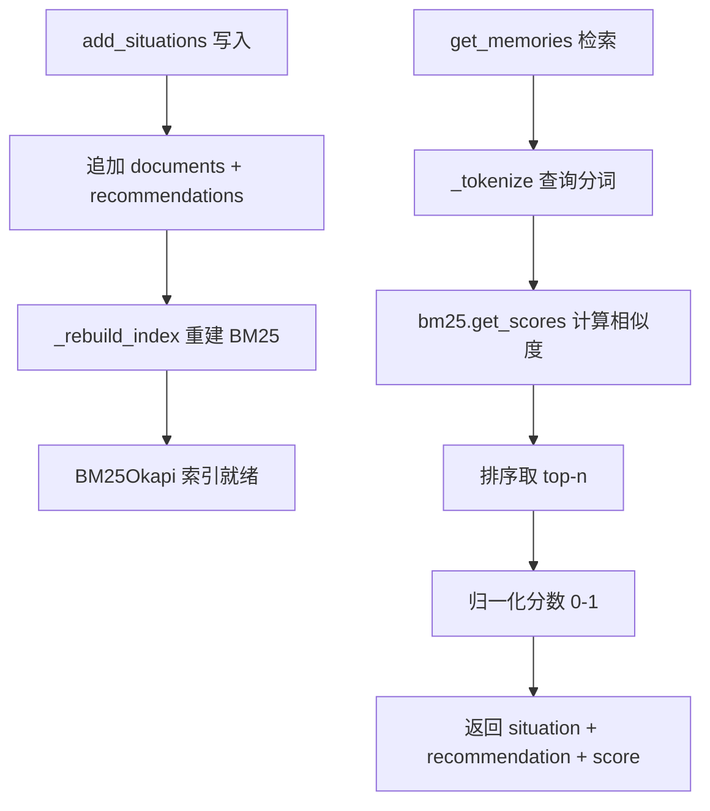
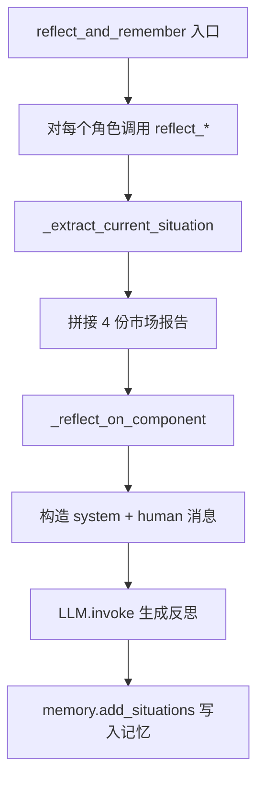
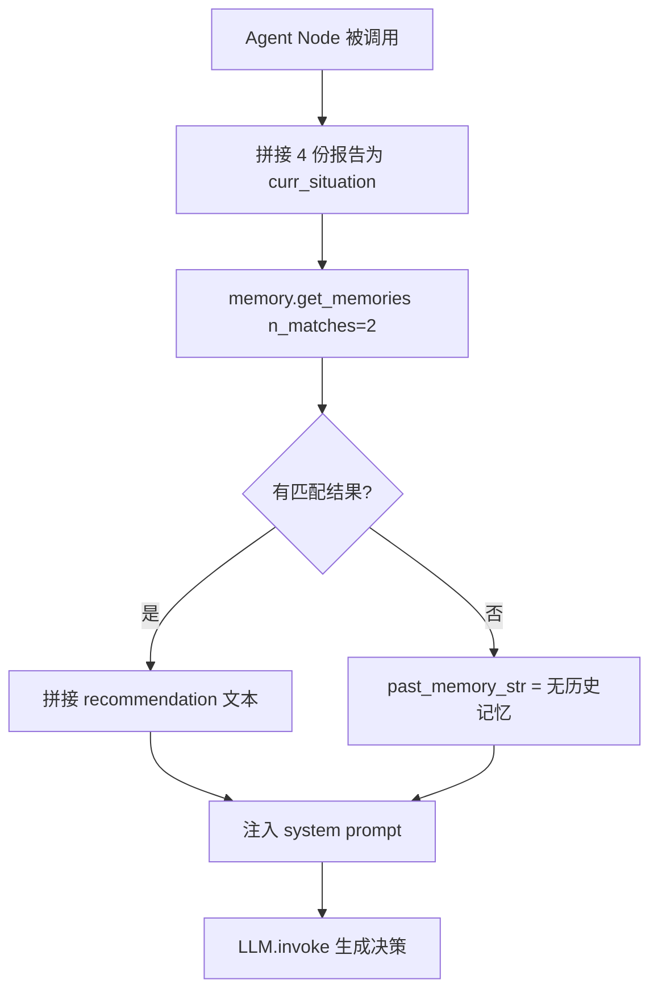

# PD-06.TA TradingAgents — BM25 角色记忆与反思经验池

> 文档编号：PD-06.TA
> 来源：TradingAgents `tradingagents/agents/utils/memory.py`
> GitHub：https://github.com/TauricResearch/TradingAgents.git
> 问题域：PD-06 记忆持久化 Memory Persistence
> 状态：可复用方案

---

## 第 1 章 问题与动机

### 1.1 核心问题

多 Agent 交易系统中，每个角色（Bull Researcher、Bear Researcher、Trader、Investment Judge、Risk Manager）在多轮交易中会反复面对相似的市场情境。如果没有记忆机制，Agent 会在相同类型的市场条件下重复犯错——比如在高通胀环境下仍然推荐高增长科技股，或在市场恐慌时过度保守错失反弹机会。

核心挑战：
- **经验遗忘**：每次交易决策独立执行，无法从历史错误中学习
- **角色差异化**：Bull 和 Bear 的教训不同，不能共享同一个记忆池
- **检索效率**：市场情境描述是长文本（4 份报告拼接），需要高效的相似度匹配
- **零外部依赖**：不依赖向量数据库或 Embedding API，降低部署复杂度和成本

### 1.2 TradingAgents 的解法概述

TradingAgents 采用 **BM25 词法匹配 + 角色隔离记忆 + LLM 反思写入** 的三层架构：

1. **FinancialSituationMemory**：基于 BM25Okapi 的纯本地记忆类，存储 situation→recommendation 对（`memory.py:12-98`）
2. **5 个独立记忆实例**：每个角色维护自己的记忆池，互不干扰（`trading_graph.py:98-102`）
3. **Reflector 反思引擎**：交易完成后，LLM 分析决策正确性并生成结构化教训，写入对应角色的记忆（`reflection.py:7-121`）
4. **Prompt 注入检索**：决策时从记忆中检索 top-2 相似情境的教训，注入 system prompt（`bull_researcher.py:19-23`, `trader.py:16`）
5. **无持久化设计**：记忆仅存在于进程生命周期内，跨 session 不保留

### 1.3 设计思想

| 设计原则 | 具体实现 | 理由 | 替代方案 |
|----------|----------|------|----------|
| 词法匹配优于语义匹配 | BM25Okapi 替代向量 Embedding | 金融术语精确匹配更重要；零 API 调用成本；离线可用 | FAISS/ChromaDB + OpenAI Embedding |
| 角色隔离 | 5 个独立 FinancialSituationMemory 实例 | Bull 的教训对 Bear 无意义，混合会引入噪声 | 共享记忆池 + 角色标签过滤 |
| 后验反思 | 交易后用 LLM 分析 returns 生成教训 | 只有知道盈亏结果才能判断决策质量 | 实时记录决策过程（无法评估对错） |
| Prompt 注入 | 检索结果直接拼入 system prompt | 最简单的记忆利用方式，无需修改 Agent 逻辑 | RAG pipeline / 工具调用 |
| 内存存储 | Python List + BM25 索引 | 交易场景数据量小（数十到数百条），无需持久化 | SQLite / Redis / 文件系统 |

---

## 第 2 章 源码实现分析

### 2.1 架构概览

TradingAgents 的记忆系统由三个核心模块组成，形成 **写入-存储-检索** 闭环：

```
┌─────────────────────────────────────────────────────────────────┐
│                    TradingAgentsGraph                            │
│                                                                 │
│  ┌──────────┐  ┌──────────┐  ┌──────────┐  ┌──────────┐       │
│  │bull_memory│  │bear_memory│  │trader_mem│  │judge_mem │  ...  │
│  │(BM25)    │  │(BM25)    │  │(BM25)    │  │(BM25)    │       │
│  └────▲─────┘  └────▲─────┘  └────▲─────┘  └────▲─────┘       │
│       │write         │write        │write        │write         │
│  ┌────┴─────────────┴────────────┴────────────┴──────┐         │
│  │              Reflector (LLM 反思引擎)              │         │
│  │  reflect_bull / reflect_bear / reflect_trader ...  │         │
│  └────────────────────▲───────────────────────────────┘         │
│                       │ returns_losses                          │
│  ┌────────────────────┴───────────────────────────────┐         │
│  │           propagate() → reflect_and_remember()      │         │
│  └─────────────────────────────────────────────────────┘         │
│                                                                 │
│  决策时：Agent Node → memory.get_memories() → prompt 注入       │
└─────────────────────────────────────────────────────────────────┘
```

数据流：
1. `propagate(ticker, date)` 执行一轮完整交易决策
2. 外部调用 `reflect_and_remember(returns_losses)` 传入实际盈亏
3. Reflector 为每个角色生成反思，写入对应记忆
4. 下一轮 `propagate()` 时，各 Agent 从自己的记忆中检索历史教训

### 2.2 核心实现

#### 2.2.1 FinancialSituationMemory — BM25 记忆存储



对应源码 `tradingagents/agents/utils/memory.py:12-98`：

```python
class FinancialSituationMemory:
    """Memory system for storing and retrieving financial situations using BM25."""

    def __init__(self, name: str, config: dict = None):
        self.name = name
        self.documents: List[str] = []       # 情境文本
        self.recommendations: List[str] = []  # 对应的建议/教训
        self.bm25 = None

    def _tokenize(self, text: str) -> List[str]:
        tokens = re.findall(r'\b\w+\b', text.lower())
        return tokens

    def _rebuild_index(self):
        if self.documents:
            tokenized_docs = [self._tokenize(doc) for doc in self.documents]
            self.bm25 = BM25Okapi(tokenized_docs)
        else:
            self.bm25 = None

    def add_situations(self, situations_and_advice: List[Tuple[str, str]]):
        for situation, recommendation in situations_and_advice:
            self.documents.append(situation)
            self.recommendations.append(recommendation)
        self._rebuild_index()

    def get_memories(self, current_situation: str, n_matches: int = 1) -> List[dict]:
        if not self.documents or self.bm25 is None:
            return []
        query_tokens = self._tokenize(current_situation)
        scores = self.bm25.get_scores(query_tokens)
        top_indices = sorted(range(len(scores)), key=lambda i: scores[i], reverse=True)[:n_matches]
        max_score = max(scores) if max(scores) > 0 else 1
        results = []
        for idx in top_indices:
            normalized_score = scores[idx] / max_score if max_score > 0 else 0
            results.append({
                "matched_situation": self.documents[idx],
                "recommendation": self.recommendations[idx],
                "similarity_score": normalized_score,
            })
        return results
```

关键设计点：
- **双列表对齐存储**（`memory.py:23-24`）：`documents[i]` 和 `recommendations[i]` 通过索引对齐，避免复杂数据结构
- **每次写入重建索引**（`memory.py:36-42`）：`_rebuild_index()` 在 `add_situations()` 后立即调用，保证索引一致性
- **归一化评分**（`memory.py:81-85`）：将 BM25 原始分数归一化到 0-1 范围，便于跨查询比较

#### 2.2.2 Reflector — LLM 反思引擎



对应源码 `tradingagents/graph/reflection.py:58-71`：

```python
def _reflect_on_component(
    self, component_type: str, report: str, situation: str, returns_losses
) -> str:
    messages = [
        ("system", self.reflection_system_prompt),
        (
            "human",
            f"Returns: {returns_losses}\n\nAnalysis/Decision: {report}\n\n"
            f"Objective Market Reports for Reference: {situation}",
        ),
    ]
    result = self.quick_thinking_llm.invoke(messages).content
    return result
```

反思 prompt 的 4 步结构（`reflection.py:17-46`）：
1. **Reasoning**：判断决策正确/错误，分析贡献因素（市场情报、技术指标、新闻、情绪等）
2. **Improvement**：对错误决策提出修正建议
3. **Summary**：总结教训，建立情境间的关联
4. **Query**：将教训压缩为 ≤1000 token 的精华句

#### 2.2.3 Agent 端记忆注入



对应源码 `tradingagents/agents/trader/trader.py:15-16`：

```python
curr_situation = f"{market_research_report}\n\n{sentiment_report}\n\n{news_report}\n\n{fundamentals_report}"
past_memories = memory.get_memories(curr_situation, n_matches=2)
```

5 个角色的注入模式完全一致（`bull_researcher.py:18-23`, `bear_researcher.py:18-23`, `trader.py:15-23`, `research_manager.py:15-21`, `risk_manager.py:18-24`）：
- 拼接 4 份报告为查询文本
- 检索 top-2 匹配
- 将 recommendation 文本拼入 prompt 的 "past reflections" 部分

### 2.3 实现细节

**记忆生命周期**：

```
Session 开始
  → TradingAgentsGraph.__init__() 创建 5 个空记忆实例
  → 第 1 轮 propagate(): 记忆为空，get_memories 返回 []
  → reflect_and_remember(returns): 写入第 1 轮教训
  → 第 2 轮 propagate(): 检索到第 1 轮教训，注入 prompt
  → reflect_and_remember(returns): 追加第 2 轮教训
  → ...
  → 第 N 轮: 记忆池持续增长，BM25 索引持续重建
Session 结束 → 所有记忆丢失（纯内存，无持久化）
```

**BM25 分词策略**（`memory.py:27-34`）：
- 使用 `re.findall(r'\b\w+\b', text.lower())` 做简单的空白+标点分词
- 全部小写化，无 stemming、无 stopword 过滤
- 对金融术语（如 "S&P500"、"10-year yield"）会被拆分为多个 token

**索引重建成本**：每次 `add_situations()` 都会对全量文档重新分词并构建 BM25Okapi 索引。对于交易场景（通常 <500 条记忆），这个开销可以忽略。但如果记忆量达到万级，需要考虑增量索引。

---

## 第 3 章 迁移指南

### 3.1 迁移清单

**阶段 1：核心记忆类（1 个文件）**
- [ ] 复制 `FinancialSituationMemory` 类，安装 `rank_bm25` 依赖
- [ ] 根据业务调整 `_tokenize()` 方法（是否需要 stemming、stopword、领域词典）
- [ ] 决定是否需要持久化（JSON/SQLite/pickle）

**阶段 2：反思引擎（1 个文件）**
- [ ] 实现 Reflector 类，定义反思 prompt 模板
- [ ] 确定反思触发时机（每轮结束？每 N 轮？仅在亏损时？）
- [ ] 确定反思输入：哪些状态字段需要传给 LLM

**阶段 3：Agent 集成（N 个 Agent 文件）**
- [ ] 为每个需要记忆的 Agent 创建独立记忆实例
- [ ] 在 Agent 决策函数中添加 `get_memories()` 调用
- [ ] 将检索结果注入 prompt（system prompt 或 user message）

**阶段 4：持久化扩展（可选）**
- [ ] 添加 `save(path)` / `load(path)` 方法（JSON 或 pickle）
- [ ] 在 session 结束时自动保存，启动时自动加载
- [ ] 添加记忆容量上限和淘汰策略（LRU / 低分淘汰）

### 3.2 适配代码模板

#### 可复用的 BM25 记忆类（含持久化扩展）

```python
"""BM25-based experience memory with optional persistence."""

import json
import re
from pathlib import Path
from typing import List, Tuple, Optional
from rank_bm25 import BM25Okapi


class ExperienceMemory:
    """Role-isolated experience memory using BM25 retrieval."""

    def __init__(self, role_name: str, max_capacity: int = 1000):
        self.role_name = role_name
        self.max_capacity = max_capacity
        self.situations: List[str] = []
        self.lessons: List[str] = []
        self.bm25 = None

    def _tokenize(self, text: str) -> List[str]:
        return re.findall(r'\b\w+\b', text.lower())

    def _rebuild_index(self):
        if self.situations:
            self.bm25 = BM25Okapi([self._tokenize(s) for s in self.situations])
        else:
            self.bm25 = None

    def add(self, situation: str, lesson: str):
        """Add a single experience. Evicts oldest if at capacity."""
        if len(self.situations) >= self.max_capacity:
            self.situations.pop(0)
            self.lessons.pop(0)
        self.situations.append(situation)
        self.lessons.append(lesson)
        self._rebuild_index()

    def add_batch(self, pairs: List[Tuple[str, str]]):
        """Add multiple (situation, lesson) pairs."""
        for situation, lesson in pairs:
            self.add(situation, lesson)

    def recall(self, query: str, top_k: int = 2) -> List[dict]:
        """Retrieve top-k matching lessons for a query."""
        if not self.situations or self.bm25 is None:
            return []
        scores = self.bm25.get_scores(self._tokenize(query))
        top_indices = sorted(range(len(scores)), key=lambda i: scores[i], reverse=True)[:top_k]
        max_score = max(scores) if max(scores) > 0 else 1.0
        return [
            {
                "situation": self.situations[i],
                "lesson": self.lessons[i],
                "score": scores[i] / max_score if max_score > 0 else 0,
            }
            for i in top_indices
            if scores[i] > 0  # 过滤零分匹配
        ]

    def save(self, path: str):
        """Persist memory to JSON file."""
        data = {
            "role_name": self.role_name,
            "situations": self.situations,
            "lessons": self.lessons,
        }
        Path(path).write_text(json.dumps(data, ensure_ascii=False, indent=2))

    @classmethod
    def load(cls, path: str, max_capacity: int = 1000) -> "ExperienceMemory":
        """Load memory from JSON file."""
        data = json.loads(Path(path).read_text())
        mem = cls(data["role_name"], max_capacity)
        mem.situations = data["situations"]
        mem.lessons = data["lessons"]
        mem._rebuild_index()
        return mem
```

#### 通用反思函数模板

```python
def reflect_on_outcome(
    llm,
    agent_output: str,
    context: str,
    outcome_metric: float,
    memory: "ExperienceMemory",
    reflection_prompt: str = None,
):
    """Generate reflection and store in memory.

    Args:
        llm: LangChain-compatible LLM
        agent_output: The agent's original decision/analysis
        context: Market/environment context at decision time
        outcome_metric: Quantitative result (e.g., return %)
        memory: ExperienceMemory instance to write to
        reflection_prompt: Custom system prompt for reflection
    """
    default_prompt = (
        "Analyze the decision and outcome. Identify what went right/wrong. "
        "Provide actionable lessons for similar future situations. "
        "Compress insights into ≤500 tokens."
    )
    messages = [
        ("system", reflection_prompt or default_prompt),
        ("human", f"Outcome: {outcome_metric}\nDecision: {agent_output}\nContext: {context}"),
    ]
    lesson = llm.invoke(messages).content
    memory.add(context, lesson)
```

### 3.3 适用场景

| 场景 | 适用度 | 说明 |
|------|--------|------|
| 多轮交易/博弈系统 | ⭐⭐⭐ | 天然适合：每轮有明确的输入（情境）和输出（盈亏），反思闭环完整 |
| 多角色辩论系统 | ⭐⭐⭐ | 角色隔离记忆避免交叉污染，每个角色独立学习 |
| 客服/对话 Agent | ⭐⭐ | 可用于记录用户反馈，但 BM25 对短文本匹配效果一般 |
| 代码生成 Agent | ⭐⭐ | 可记录编译错误→修复方案，但代码语义匹配更适合向量检索 |
| 单次任务 Agent | ⭐ | 无多轮交互，记忆无法积累，不适用 |

---

## 第 4 章 测试用例

```python
import pytest
from tradingagents.agents.utils.memory import FinancialSituationMemory


class TestFinancialSituationMemory:
    """Tests based on actual FinancialSituationMemory implementation."""

    def setup_method(self):
        self.memory = FinancialSituationMemory("test_memory")

    def test_empty_memory_returns_empty(self):
        """get_memories on empty memory should return []."""
        results = self.memory.get_memories("any query", n_matches=2)
        assert results == []

    def test_add_and_retrieve_single(self):
        """Add one situation, retrieve it."""
        self.memory.add_situations([
            ("High inflation with rising interest rates", "Consider defensive sectors")
        ])
        results = self.memory.get_memories("inflation and interest rate increase", n_matches=1)
        assert len(results) == 1
        assert results[0]["recommendation"] == "Consider defensive sectors"
        assert results[0]["similarity_score"] > 0

    def test_retrieve_top_k_ordering(self):
        """Top-k results should be ordered by relevance."""
        self.memory.add_situations([
            ("Tech sector volatility with institutional selling", "Reduce tech exposure"),
            ("Strong dollar affecting emerging markets", "Hedge currency exposure"),
            ("High inflation with rising rates", "Consider defensive sectors"),
        ])
        results = self.memory.get_memories("tech stocks volatile selling pressure", n_matches=2)
        assert len(results) == 2
        # First result should be the tech-related one
        assert "tech" in results[0]["recommendation"].lower() or "tech" in results[0]["matched_situation"].lower()
        # Scores should be descending
        assert results[0]["similarity_score"] >= results[1]["similarity_score"]

    def test_normalized_scores_range(self):
        """Similarity scores should be normalized to 0-1."""
        self.memory.add_situations([
            ("Market crash with panic selling", "Hold cash positions"),
            ("Bull market with strong earnings", "Increase equity allocation"),
        ])
        results = self.memory.get_memories("market crash panic", n_matches=2)
        for r in results:
            assert 0 <= r["similarity_score"] <= 1.0

    def test_clear_resets_memory(self):
        """clear() should remove all documents and reset index."""
        self.memory.add_situations([("situation", "advice")])
        self.memory.clear()
        assert self.memory.documents == []
        assert self.memory.recommendations == []
        assert self.memory.bm25 is None
        assert self.memory.get_memories("situation") == []

    def test_rebuild_index_after_add(self):
        """BM25 index should be rebuilt after each add_situations call."""
        self.memory.add_situations([("first situation", "first advice")])
        assert self.memory.bm25 is not None
        results1 = self.memory.get_memories("first situation", n_matches=1)

        self.memory.add_situations([("second situation about tech", "second advice")])
        results2 = self.memory.get_memories("second situation about tech", n_matches=1)
        assert results2[0]["recommendation"] == "second advice"

    def test_role_isolation(self):
        """Different memory instances should be independent."""
        bull_mem = FinancialSituationMemory("bull")
        bear_mem = FinancialSituationMemory("bear")

        bull_mem.add_situations([("market up", "buy more")])
        bear_mem.add_situations([("market up", "sell now")])

        bull_results = bull_mem.get_memories("market up")
        bear_results = bear_mem.get_memories("market up")

        assert bull_results[0]["recommendation"] == "buy more"
        assert bear_results[0]["recommendation"] == "sell now"

    def test_degradation_no_match(self):
        """Completely unrelated query should still return results (BM25 always scores)."""
        self.memory.add_situations([
            ("High inflation with rising interest rates", "Consider defensive sectors")
        ])
        # Completely unrelated query
        results = self.memory.get_memories("quantum computing breakthrough", n_matches=1)
        # BM25 will still return a result (may have score 0)
        assert len(results) == 1
```

---

## 第 5 章 跨域关联

| 关联域 | 关系类型 | 说明 |
|--------|----------|------|
| PD-01 上下文管理 | 协同 | 记忆检索结果注入 prompt 会增加上下文长度；4 份报告拼接作为查询文本本身就是长文本，需要关注 token 预算 |
| PD-02 多 Agent 编排 | 依赖 | 记忆实例在 `TradingAgentsGraph.__init__()` 中创建，通过 `GraphSetup` 注入到各 Agent 节点；编排拓扑决定了哪些角色需要记忆 |
| PD-03 容错与重试 | 协同 | Reflector 调用 LLM 生成反思时可能失败（API 超时），当前无重试机制；记忆写入失败会导致该轮教训丢失 |
| PD-07 质量检查 | 协同 | 反思本身就是一种质量检查——通过 returns_losses 评估决策质量，生成改进建议 |
| PD-11 可观测性 | 协同 | `_log_state()` 将完整状态写入 JSON 文件（`trading_graph.py:221-261`），但记忆内容本身不在日志中，难以追踪记忆演化 |
| PD-12 推理增强 | 协同 | 反思 prompt 要求 LLM 进行 4 步结构化推理（Reasoning→Improvement→Summary→Query），是推理增强的具体应用 |

---

## 第 6 章 来源文件索引

| 文件 | 行范围 | 关键实现 |
|------|--------|----------|
| `tradingagents/agents/utils/memory.py` | L1-145 | FinancialSituationMemory 完整实现：BM25 索引、add_situations、get_memories、_tokenize |
| `tradingagents/graph/reflection.py` | L1-121 | Reflector 类：反思 prompt 模板、5 个角色的反思方法、_reflect_on_component 核心逻辑 |
| `tradingagents/graph/trading_graph.py` | L98-102 | 5 个记忆实例的创建（bull/bear/trader/judge/risk_manager） |
| `tradingagents/graph/trading_graph.py` | L263-279 | reflect_and_remember() 入口：调用 Reflector 为每个角色生成反思并写入记忆 |
| `tradingagents/graph/setup.py` | L89-106 | GraphSetup 将记忆实例注入到各 Agent 节点的创建函数 |
| `tradingagents/agents/researchers/bull_researcher.py` | L18-23 | Bull Researcher 的记忆检索与 prompt 注入 |
| `tradingagents/agents/researchers/bear_researcher.py` | L18-23 | Bear Researcher 的记忆检索与 prompt 注入 |
| `tradingagents/agents/trader/trader.py` | L15-23 | Trader 的记忆检索与 prompt 注入 |
| `tradingagents/agents/managers/research_manager.py` | L15-21 | Research Manager（Investment Judge）的记忆检索与 prompt 注入 |
| `tradingagents/agents/managers/risk_manager.py` | L18-24 | Risk Manager 的记忆检索与 prompt 注入 |

---

## 第 7 章 横向对比维度

> **重要：** 本章用于自动填充 Butcher Wiki 的横向对比表。
> 必须严格按以下 JSON 格式输出，放在 `comparison_data` 代码块中。

```json comparison_data
{
  "project": "TradingAgents",
  "dimensions": {
    "记忆结构": "双列表对齐：situations[] + recommendations[]，BM25Okapi 索引",
    "更新机制": "后验反思写入：交易完成后 LLM 分析盈亏生成教训",
    "事实提取": "LLM 4 步结构化反思（Reasoning→Improvement→Summary→Query）",
    "存储方式": "纯内存 Python List，无持久化，进程结束即丢失",
    "注入方式": "system prompt 拼接：检索 top-2 教训直接注入角色 prompt",
    "经验池复用": "5 个角色独立记忆实例，互不共享，避免交叉污染",
    "生命周期管理": "进程级生命周期，无过期淘汰，记忆只增不减",
    "双检索后端切换": "仅 BM25 词法检索，无向量检索，零 API 调用",
    "经验结构化": "situation→recommendation 对，含归一化相似度分数"
  }
}
```

### 域元数据补充

```json domain_metadata
{
  "solution_summary": "TradingAgents 用 BM25Okapi 词法匹配实现 5 角色独立记忆池，Reflector 在交易后通过 LLM 反思盈亏生成结构化教训，决策时检索 top-2 相似情境注入 prompt",
  "description": "角色隔离记忆与后验反思闭环：从结果反推教训，按角色独立积累经验",
  "sub_problems": [
    "角色记忆隔离：多角色系统中如何防止不同立场的经验交叉污染",
    "后验反思触发：如何确定反思时机以及需要哪些结果指标才能生成有效教训",
    "BM25 金融分词：金融术语（如 S&P500、10-year yield）的分词策略对检索精度的影响",
    "记忆增长控制：纯追加模式下如何防止记忆池无限膨胀导致检索质量下降"
  ],
  "best_practices": [
    "角色隔离优于标签过滤：为每个角色创建独立记忆实例比共享池+标签过滤更简单且无噪声",
    "BM25 适合领域术语密集场景：金融/医疗等专业领域词法精确匹配往往优于通用语义向量",
    "后验反思需要量化指标：仅有定性反馈不够，必须传入 returns_losses 等量化结果才能判断决策质量"
  ]
}
```
