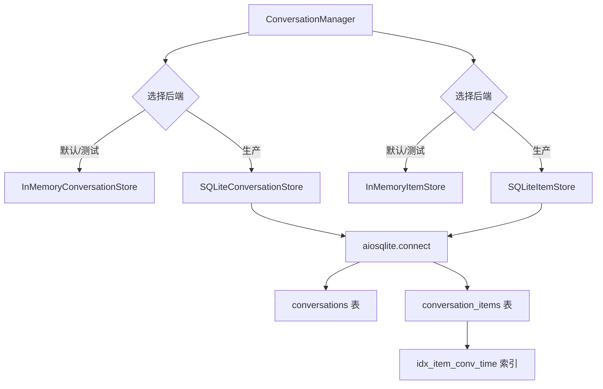
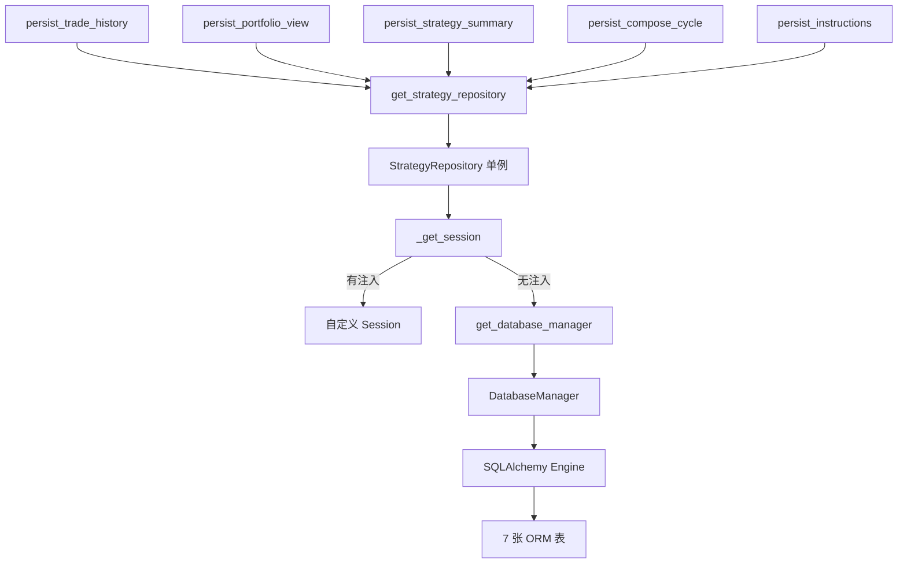
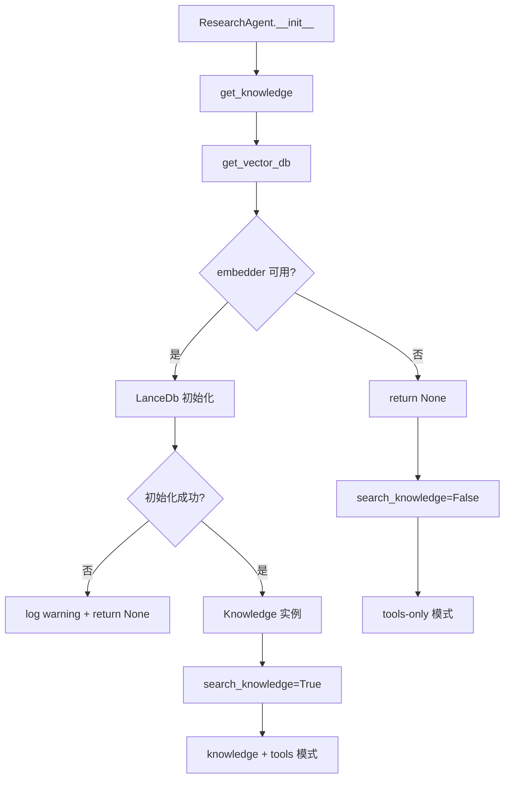

# PD-06.NN ValueCell — 四层记忆持久化与三后端存储分离

> 文档编号：PD-06.NN
> 来源：ValueCell `python/valuecell/core/conversation/`, `python/valuecell/server/db/`, `python/valuecell/agents/research_agent/`
> GitHub：https://github.com/ValueCell-ai/valuecell.git
> 问题域：PD-06 记忆持久化 Memory Persistence
> 状态：可复用方案

---

## 第 1 章 问题与动机

### 1.1 核心问题

ValueCell 是一个 AI 驱动的金融策略平台，其记忆持久化面临三个层次的挑战：

1. **会话历史持久化**：用户与 Agent 的多轮对话需要跨请求保持，支持分页查询和状态管理（active/inactive/require_user_input 三态）
2. **Agent 短期记忆**：SuperAgent 和 ResearchAgent 需要在多轮推理中保持上下文连贯性，但不需要永久存储
3. **业务数据持久化**：策略交易历史（trades、holdings、portfolio snapshots、compose cycles、instructions）需要结构化存储，支持时序查询和级联删除
4. **知识库向量存储**：ResearchAgent 需要将 Markdown/PDF 文档切片后存入向量数据库，支持混合检索（hybrid search）

这四层记忆有不同的生命周期、查询模式和一致性要求，不能用单一存储方案解决。

### 1.2 ValueCell 的解法概述

ValueCell 采用**三后端存储分离**架构，将四层记忆映射到三种存储引擎：

1. **SQLite（aiosqlite）**：会话元数据 + 消息条目，通过抽象接口 `ConversationStore` / `ItemStore` 支持 InMemory 和 SQLite 双实现（`conversation_store.py:12-101`, `item_store.py:13-273`）
2. **SQLAlchemy + PostgreSQL/SQLite**：策略业务数据，通过 `StrategyRepository` 单例管理 7 张表的 CRUD（`strategy_repository.py:24-676`）
3. **LanceDB**：向量知识库，通过 `agno.vectordb.lancedb.LanceDb` 封装，支持 hybrid search + 自动迁移旧数据目录（`vdb.py:23-53`）
4. **InMemoryDb**：Agent 短期记忆，通过 agno 框架的 `InMemoryDb()` 配合 `num_history_runs` 参数控制窗口大小（`core.py:72-75`）

### 1.3 设计思想

| 设计原则 | 具体实现 | 理由 | 替代方案 |
|----------|----------|------|----------|
| 存储后端可替换 | ABC 抽象类 + InMemory/SQLite 双实现 | 测试用 InMemory，生产用 SQLite，零改动切换 | 直接硬编码 SQLite |
| 懒初始化 | `_ensure_initialized()` + asyncio.Lock 双检锁 | 避免启动时阻塞，支持按需创建表 | 启动时统一建表 |
| 优雅降级 | 向量库不可用时返回 None，Agent 退化为 tools-only 模式 | 嵌入模型未配置不应阻止核心功能 | 启动时强制校验 |
| 元数据与消息分离 | Conversation 和 ConversationItem 分表存储 | 列表页只需元数据，不加载消息体 | 单表存储所有数据 |
| 全局单例 + 可注入 | `get_strategy_repository()` 支持传入自定义 session | 生产用全局单例，测试可注入 mock session | 纯依赖注入 |

---

## 第 2 章 源码实现分析

### 2.1 架构概览

ValueCell 的记忆持久化分为四个独立子系统，各自有明确的职责边界：

```
┌─────────────────────────────────────────────────────────────────┐
│                     ValueCell Memory Architecture                │
├─────────────────────────────────────────────────────────────────┤
│                                                                  │
│  ┌──────────────────┐  ┌──────────────────┐  ┌───────────────┐  │
│  │ ConversationMgr  │  │ StrategyPersist  │  │ ResearchAgent │  │
│  │  (会话历史)       │  │  (交易数据)       │  │  (知识库)      │  │
│  └────────┬─────────┘  └────────┬─────────┘  └───────┬───────┘  │
│           │                     │                     │          │
│  ┌────────▼─────────┐  ┌───────▼──────────┐  ┌──────▼───────┐  │
│  │ ConversationStore│  │StrategyRepository│  │   LanceDb    │  │
│  │ + ItemStore      │  │  (SQLAlchemy)     │  │  (向量检索)   │  │
│  │ (ABC 接口)       │  │                   │  │              │  │
│  └───┬────────┬─────┘  └────────┬─────────┘  └──────┬───────┘  │
│      │        │                 │                     │          │
│  ┌───▼──┐ ┌──▼────┐   ┌───────▼──────────┐  ┌──────▼───────┐  │
│  │Memory│ │SQLite │   │PostgreSQL/SQLite  │  │  LanceDB     │  │
│  │ Dict │ │aiosql │   │(SQLAlchemy Engine)│  │  (文件系统)   │  │
│  └──────┘ └───────┘   └──────────────────┘  └──────────────┘  │
│                                                                  │
│  ┌──────────────────────────────────────────────────────────┐   │
│  │ Agent 短期记忆: InMemoryDb (agno) + num_history_runs     │   │
│  │ SuperAgent=5, ResearchAgent=3                             │   │
│  └──────────────────────────────────────────────────────────┘   │
└─────────────────────────────────────────────────────────────────┘
```

### 2.2 核心实现

#### 2.2.1 会话存储双实现（ConversationStore + ItemStore）



对应源码 `python/valuecell/core/conversation/item_store.py:103-148`：

```python
class SQLiteItemStore(ItemStore):
    """SQLite-backed item store using aiosqlite for true async I/O."""

    def __init__(self, db_path: str):
        self.db_path = db_path
        self._initialized = False
        self._init_lock = None  # lazy to avoid loop-binding in __init__

    async def _ensure_initialized(self) -> None:
        if self._initialized:
            return
        if self._init_lock is None:
            self._init_lock = asyncio.Lock()
        async with self._init_lock:
            if self._initialized:
                return
            async with aiosqlite.connect(self.db_path) as db:
                await db.execute("""
                    CREATE TABLE IF NOT EXISTS conversation_items (
                      item_id TEXT PRIMARY KEY,
                      role TEXT NOT NULL,
                      event TEXT NOT NULL,
                      conversation_id TEXT NOT NULL,
                      thread_id TEXT,
                      task_id TEXT,
                      payload TEXT,
                      agent_name TEXT,
                      metadata TEXT,
                      created_at TIMESTAMP DEFAULT CURRENT_TIMESTAMP
                    );
                """)
                await db.execute("""
                    CREATE INDEX IF NOT EXISTS idx_item_conv_time
                    ON conversation_items (conversation_id, created_at);
                """)
                await db.commit()
            self._initialized = True
```

关键设计点：
- **双检锁（Double-Checked Locking）**：`_init_lock` 延迟创建避免在 `__init__` 中绑定事件循环（`item_store.py:114`）
- **INSERT OR REPLACE** 语义：`save_item` 使用 upsert 避免重复插入（`item_store.py:171`）
- **JSON 内查询**：`get_items` 支持通过 `json_extract(payload, '$.component_type')` 过滤组件类型（`item_store.py:213`）

#### 2.2.2 策略数据 Repository 模式



对应源码 `python/valuecell/server/db/repositories/strategy_repository.py:76-127`：

```python
def upsert_strategy(
    self,
    strategy_id: str,
    name: Optional[str] = None,
    status: Optional[str] = None,
    config: Optional[dict] = None,
    metadata: Optional[dict] = None,
) -> Optional[Strategy]:
    """Create or update a strategy by strategy_id."""
    session = self._get_session()
    try:
        strategy = (
            session.query(Strategy)
            .filter(Strategy.strategy_id == strategy_id)
            .first()
        )
        if strategy:
            if name is not None:
                strategy.name = name
            if status is not None:
                strategy.status = status
            if config is not None:
                strategy.config = config
            if metadata is not None:
                strategy.strategy_metadata = metadata
        else:
            strategy = Strategy(
                strategy_id=strategy_id,
                name=name,
                status=status or "running",
                config=config,
                strategy_metadata=metadata,
            )
            session.add(strategy)
        session.commit()
        session.refresh(strategy)
        session.expunge(strategy)
        return strategy
    except Exception:
        session.rollback()
        return None
    finally:
        if not self.db_session:
            session.close()
```

关键设计点：
- **expunge 模式**：每次查询后 `session.expunge(obj)` 将对象从 session 分离，避免 lazy-load 陷阱（`strategy_repository.py:45-46`）
- **级联删除**：`delete_strategy(cascade=True)` 手动删除关联的 holdings、portfolio、details（`strategy_repository.py:615-655`）
- **防幽灵写入**：所有 persist 函数先检查 strategy 是否存在，避免向已删除策略写入数据（`strategy_persistence.py:22-28`）

#### 2.2.3 向量知识库懒初始化与优雅降级



对应源码 `python/valuecell/agents/research_agent/vdb.py:23-53`：

```python
def get_vector_db() -> Optional[LanceDb]:
    """Create and return the LanceDb instance, or None if embeddings are unavailable."""
    try:
        embedder = model_utils_mod.get_embedder_for_agent("research_agent")
    except Exception as e:
        logger.warning(
            "ResearchAgent embeddings unavailable; disabling knowledge search. Error: {}", e,
        )
        return None

    try:
        return LanceDb(
            table_name="research_agent_knowledge_base",
            uri=resolve_lancedb_uri(),
            embedder=embedder,
            search_type=SearchType.hybrid,
            use_tantivy=False,
        )
    except Exception as e:
        logger.warning(
            "Failed to initialize LanceDb for ResearchAgent; disabling knowledge. Error: {}", e,
        )
        return None
```

### 2.3 实现细节

**数据库路径解析链**（`python/valuecell/utils/db.py:20-35`）：

```
resolve_db_path():
  1. VALUECELL_DATABASE_URL 环境变量（sqlite:/// 前缀）
  2. 默认: ~/Library/Application Support/ValueCell/valuecell.db (macOS)

resolve_lancedb_uri():
  1. 默认: <system_env_dir>/lancedb/
  2. 自动迁移: 旧 repo-root/lancedb → 新系统目录（仅首次、目标为空时）
```

**Agent 短期记忆配置差异**：

| Agent | InMemoryDb | num_history_runs | session_summaries | 用途 |
|-------|-----------|-----------------|-------------------|------|
| SuperAgent | ✅ | 5 | 条件禁用（DashScope） | 意图分类 + 对话路由 |
| ResearchAgent | ✅ | 3 | ✅ | 金融数据研究 |

SuperAgent 在 DashScope 模型下禁用 session summaries，因为 DashScope 的 `response_format: json_object` 要求消息中包含 "json" 关键词，而 agno 内部摘要功能不满足此要求（`super_agent/core.py:59-61`）。

**ConversationManager 的元数据-消息分离**（`manager.py:22-28`）：

ConversationManager 将职责委托给两个独立 store：
- `ConversationStore`：只管元数据（id, user_id, title, status, timestamps）
- `ItemStore`：只管消息条目（item_id, role, event, payload, metadata）

这使得列表页查询（`list_user_conversations`）不需要加载任何消息体，而消息查询支持按 event、component_type、role 多维过滤。

---

## 第 3 章 迁移指南

### 3.1 迁移清单

**阶段 1：会话存储抽象层**
- [ ] 定义 `ConversationStore` 和 `ItemStore` 抽象基类
- [ ] 实现 `InMemoryConversationStore` 和 `InMemoryItemStore`（用于测试）
- [ ] 实现 `SQLiteConversationStore` 和 `SQLiteItemStore`（用于生产）
- [ ] 在 `ConversationManager` 中通过构造函数注入 store 实现

**阶段 2：业务数据 Repository**
- [ ] 定义 SQLAlchemy ORM 模型（Strategy, StrategyDetail, StrategyHolding 等）
- [ ] 实现 `StrategyRepository` 单例 + 可注入 session
- [ ] 实现 `strategy_persistence.py` 服务层（DTO → ORM 转换）
- [ ] 添加防幽灵写入检查（persist 前验证父实体存在）

**阶段 3：向量知识库**
- [ ] 集成 LanceDB（或其他向量数据库）
- [ ] 实现懒初始化 + 优雅降级（embedder 不可用时返回 None）
- [ ] 实现数据目录自动迁移逻辑

**阶段 4：Agent 短期记忆**
- [ ] 配置 `InMemoryDb` + `num_history_runs` 参数
- [ ] 按 Agent 角色差异化配置记忆窗口大小

### 3.2 适配代码模板

#### 会话存储抽象层（可直接复用）

```python
"""conversation_store.py — 会话元数据存储抽象"""
import asyncio
import sqlite3
from abc import ABC, abstractmethod
from typing import Dict, List, Optional

import aiosqlite
from pydantic import BaseModel, Field
from datetime import datetime
from enum import Enum


class ConversationStatus(str, Enum):
    ACTIVE = "active"
    INACTIVE = "inactive"
    REQUIRE_USER_INPUT = "require_user_input"


class Conversation(BaseModel):
    conversation_id: str
    user_id: str
    title: Optional[str] = None
    agent_name: Optional[str] = None
    created_at: datetime = Field(default_factory=datetime.now)
    updated_at: datetime = Field(default_factory=datetime.now)
    status: ConversationStatus = ConversationStatus.ACTIVE

    def touch(self) -> None:
        self.updated_at = datetime.now()


class ConversationStore(ABC):
    @abstractmethod
    async def save_conversation(self, conversation: Conversation) -> None: ...
    @abstractmethod
    async def load_conversation(self, conversation_id: str) -> Optional[Conversation]: ...
    @abstractmethod
    async def delete_conversation(self, conversation_id: str) -> bool: ...
    @abstractmethod
    async def list_conversations(
        self, user_id: Optional[str] = None, limit: int = 100, offset: int = 0
    ) -> List[Conversation]: ...


class SQLiteConversationStore(ConversationStore):
    """生产级 SQLite 实现，支持懒初始化 + 双检锁"""

    def __init__(self, db_path: str):
        self.db_path = db_path
        self._initialized = False
        self._init_lock = None

    async def _ensure_initialized(self):
        if self._initialized:
            return
        if self._init_lock is None:
            self._init_lock = asyncio.Lock()
        async with self._init_lock:
            if self._initialized:
                return
            async with aiosqlite.connect(self.db_path) as db:
                await db.execute("""
                    CREATE TABLE IF NOT EXISTS conversations (
                        conversation_id TEXT PRIMARY KEY,
                        user_id TEXT NOT NULL,
                        title TEXT,
                        agent_name TEXT,
                        created_at TEXT NOT NULL,
                        updated_at TEXT NOT NULL,
                        status TEXT NOT NULL DEFAULT 'active'
                    )
                """)
                await db.commit()
            self._initialized = True

    async def save_conversation(self, conversation: Conversation) -> None:
        await self._ensure_initialized()
        async with aiosqlite.connect(self.db_path) as db:
            await db.execute(
                """INSERT OR REPLACE INTO conversations
                   (conversation_id, user_id, title, agent_name, created_at, updated_at, status)
                   VALUES (?, ?, ?, ?, ?, ?, ?)""",
                (
                    conversation.conversation_id,
                    conversation.user_id,
                    conversation.title,
                    conversation.agent_name,
                    conversation.created_at.isoformat(),
                    conversation.updated_at.isoformat(),
                    conversation.status.value,
                ),
            )
            await db.commit()

    # ... load_conversation, delete_conversation, list_conversations 同理
```

#### 防幽灵写入模式（可直接复用）

```python
def persist_data(entity_id: str, data: DataModel) -> Optional[dict]:
    """写入前先验证父实体存在，防止向已删除实体写入数据"""
    repo = get_repository()
    try:
        if repo.get_entity(entity_id) is None:
            logger.info("Skip: entity={} not found (possibly deleted)", entity_id)
            return None
        item = repo.add_item(entity_id=entity_id, **data.to_dict())
        return item.to_dict() if item else None
    except Exception:
        logger.exception("persist_data failed for {}", entity_id)
        return None
```

### 3.3 适用场景

| 场景 | 适用度 | 说明 |
|------|--------|------|
| 多 Agent 对话系统 | ⭐⭐⭐ | 元数据/消息分离 + 三态状态机非常适合 |
| 金融交易记录 | ⭐⭐⭐ | Repository 模式 + 级联删除 + 时序快照 |
| 知识库 RAG 系统 | ⭐⭐⭐ | LanceDB 懒初始化 + 优雅降级模式 |
| 简单聊天机器人 | ⭐⭐ | 架构偏重，InMemory 单实现即可 |
| 高并发写入场景 | ⭐ | SQLite 单写者限制，需换 PostgreSQL |

---

## 第 4 章 测试用例

```python
"""test_conversation_persistence.py — 基于 ValueCell 真实接口的测试"""
import asyncio
import tempfile
import pytest
from datetime import datetime


# ---- 模拟 ValueCell 的核心类型 ----
from enum import Enum
from pydantic import BaseModel, Field
from typing import Optional


class Role(str, Enum):
    USER = "user"
    AGENT = "agent"
    SYSTEM = "system"


class ConversationItemEvent(str, Enum):
    MESSAGE = "message"
    TOOL_CALL = "tool_call"


class ConversationItem(BaseModel):
    item_id: str
    role: Role
    event: ConversationItemEvent
    conversation_id: str
    thread_id: Optional[str] = None
    task_id: Optional[str] = None
    payload: Optional[str] = None
    agent_name: Optional[str] = None
    metadata: Optional[str] = None


# ---- 测试用例 ----

class TestSQLiteItemStore:
    """测试 SQLite 消息存储的核心行为"""

    @pytest.fixture
    def db_path(self, tmp_path):
        return str(tmp_path / "test.db")

    @pytest.mark.asyncio
    async def test_save_and_retrieve_item(self, db_path):
        """正常路径：保存消息后可按 conversation_id 查询"""
        # 假设 SQLiteItemStore 已按 ValueCell 模式实现
        from your_project.item_store import SQLiteItemStore

        store = SQLiteItemStore(db_path)
        item = ConversationItem(
            item_id="item-001",
            role=Role.USER,
            event=ConversationItemEvent.MESSAGE,
            conversation_id="conv-001",
            payload='{"content": "Hello"}',
        )
        await store.save_item(item)
        items = await store.get_items(conversation_id="conv-001")
        assert len(items) == 1
        assert items[0].item_id == "item-001"

    @pytest.mark.asyncio
    async def test_lazy_initialization(self, db_path):
        """边界情况：首次调用时自动建表"""
        from your_project.item_store import SQLiteItemStore

        store = SQLiteItemStore(db_path)
        assert store._initialized is False
        count = await store.get_item_count("nonexistent")
        assert count == 0
        assert store._initialized is True

    @pytest.mark.asyncio
    async def test_upsert_semantics(self, db_path):
        """INSERT OR REPLACE：相同 item_id 覆盖而非报错"""
        from your_project.item_store import SQLiteItemStore

        store = SQLiteItemStore(db_path)
        item = ConversationItem(
            item_id="item-001",
            role=Role.USER,
            event=ConversationItemEvent.MESSAGE,
            conversation_id="conv-001",
            payload='{"content": "v1"}',
        )
        await store.save_item(item)
        item.payload = '{"content": "v2"}'
        await store.save_item(item)
        result = await store.get_item("item-001")
        assert '"v2"' in result.payload

    @pytest.mark.asyncio
    async def test_cascade_delete(self, db_path):
        """级联删除：删除会话时清除所有消息"""
        from your_project.item_store import SQLiteItemStore

        store = SQLiteItemStore(db_path)
        for i in range(5):
            await store.save_item(ConversationItem(
                item_id=f"item-{i}",
                role=Role.USER,
                event=ConversationItemEvent.MESSAGE,
                conversation_id="conv-001",
            ))
        await store.delete_conversation_items("conv-001")
        assert await store.get_item_count("conv-001") == 0


class TestVectorDbDegradation:
    """测试向量库优雅降级"""

    def test_no_embedder_returns_none(self, monkeypatch):
        """降级行为：embedder 不可用时返回 None"""
        # 模拟 get_embedder_for_agent 抛出异常
        import your_project.vdb as vdb_mod
        monkeypatch.setattr(
            vdb_mod.model_utils_mod,
            "get_embedder_for_agent",
            lambda _: (_ for _ in ()).throw(RuntimeError("No API key")),
        )
        result = vdb_mod.get_vector_db()
        assert result is None

    def test_knowledge_disabled_when_vdb_none(self, monkeypatch):
        """知识库禁用：vdb 为 None 时 search_knowledge=False"""
        import your_project.knowledge as knowledge_mod
        monkeypatch.setattr(knowledge_mod, "get_vector_db", lambda: None)
        result = knowledge_mod.get_knowledge()
        assert result is None
```

---

## 第 5 章 跨域关联

| 关联域 | 关系类型 | 说明 |
|--------|----------|------|
| PD-01 上下文管理 | 协同 | `num_history_runs` 控制注入上下文的历史轮数，直接影响 token 消耗；SuperAgent 的 `enable_session_summaries` 是上下文压缩的一种形式 |
| PD-02 多 Agent 编排 | 依赖 | ConversationManager 通过 `agent_name` 字段区分不同 Agent 的消息，Planner 编排多个子 Agent 时共享同一 conversation_id |
| PD-03 容错与重试 | 协同 | 向量库初始化失败时优雅降级为 tools-only 模式；StrategyRepository 的 try/except + rollback 保证事务安全 |
| PD-04 工具系统 | 协同 | ResearchAgent 的 tools（SEC filings、web search、crypto search）产生的结果通过 Knowledge 持久化到 LanceDB |
| PD-08 搜索与检索 | 依赖 | LanceDB 的 `SearchType.hybrid` 混合检索是 ResearchAgent 知识库的核心查询方式 |
| PD-11 可观测性 | 协同 | ConversationItem 的 metadata 字段存储 JSON 格式的运行时元数据，可用于成本追踪和调试 |

---

## 第 6 章 来源文件索引

| 文件 | 行范围 | 关键实现 |
|------|--------|----------|
| `python/valuecell/core/conversation/conversation_store.py` | L12-L240 | ConversationStore ABC + InMemory/SQLite 双实现 |
| `python/valuecell/core/conversation/item_store.py` | L13-L273 | ItemStore ABC + InMemory/SQLite 双实现，含 JSON 内查询 |
| `python/valuecell/core/conversation/models.py` | L1-L65 | Conversation Pydantic 模型 + 三态状态机 |
| `python/valuecell/core/conversation/manager.py` | L22-L307 | ConversationManager 高层协调器 |
| `python/valuecell/core/conversation/service.py` | L18-L161 | ConversationService 服务层封装 |
| `python/valuecell/server/db/repositories/strategy_repository.py` | L24-L676 | StrategyRepository 单例 + 7 表 CRUD + 级联删除 |
| `python/valuecell/server/services/strategy_persistence.py` | L12-L489 | 策略持久化服务层（DTO→ORM 转换 + 防幽灵写入） |
| `python/valuecell/server/db/connection.py` | L13-L103 | DatabaseManager 单例 + SQLAlchemy Engine + StaticPool |
| `python/valuecell/agents/research_agent/vdb.py` | L23-L53 | LanceDB 向量库懒初始化 + 优雅降级 |
| `python/valuecell/agents/research_agent/knowledge.py` | L15-L78 | Knowledge 实例缓存 + Markdown/PDF 文档插入 |
| `python/valuecell/agents/research_agent/core.py` | L30-L99 | ResearchAgent 初始化（InMemoryDb + num_history_runs=3） |
| `python/valuecell/core/super_agent/core.py` | L55-L78 | SuperAgent 初始化（InMemoryDb + num_history_runs=5 + 条件禁用 summaries） |
| `python/valuecell/utils/db.py` | L20-L68 | 数据库路径解析 + LanceDB 目录自动迁移 |

---

## 第 7 章 横向对比维度

> **重要：** 本章用于自动填充 Butcher Wiki 的横向对比表。

```json comparison_data
{
  "project": "ValueCell",
  "dimensions": {
    "记忆结构": "四层分离：会话元数据、消息条目、业务数据、向量知识库",
    "更新机制": "INSERT OR REPLACE upsert + expunge 分离 session",
    "存储方式": "SQLite(aiosqlite) + SQLAlchemy(PostgreSQL/SQLite) + LanceDB",
    "注入方式": "构造函数注入 store 实现 + 全局单例 get_repository()",
    "生命周期管理": "三态状态机(active/inactive/require_user_input) + touch 时间戳",
    "记忆检索": "LanceDB hybrid search + SQLite json_extract 过滤",
    "并发安全": "asyncio.Lock 双检锁懒初始化 + StaticPool 连接池",
    "存储后端委托": "ABC 抽象类 InMemory/SQLite 双实现零改动切换",
    "粒度化嵌入": "MarkdownChunking 按标题切片 + PDFReader 分页切片",
    "Schema 迁移": "CREATE TABLE IF NOT EXISTS 懒建表 + SQLAlchemy create_all",
    "多渠道会话隔离": "conversation_id + user_id + agent_name 三维隔离",
    "容量触发转储": "num_history_runs 滑动窗口(SuperAgent=5, Research=3)"
  }
}
```

### 域元数据补充

```json domain_metadata
{
  "solution_summary": "ValueCell 用 ABC 抽象层实现 InMemory/SQLite 双后端会话存储，InMemoryDb 滑动窗口控制 Agent 短期记忆，LanceDB hybrid search 存储知识库，StrategyRepository 单例管理 7 张交易表",
  "description": "金融交易场景下多层记忆的生命周期差异化管理与优雅降级",
  "sub_problems": [
    "防幽灵写入：persist 前验证父实体存在防止向已删除实体写入数据",
    "DashScope 兼容：json_mode 模型的 session summaries 兼容性处理",
    "数据目录迁移：向量库目录从旧位置自动迁移到新系统目录"
  ],
  "best_practices": [
    "expunge 分离 session：查询后立即 expunge 避免 SQLAlchemy lazy-load 陷阱",
    "双检锁懒初始化：asyncio.Lock 延迟创建避免在 __init__ 中绑定事件循环",
    "三态状态机：active/inactive/require_user_input 比简单布尔值更精确地表达会话生命周期"
  ]
}
```
