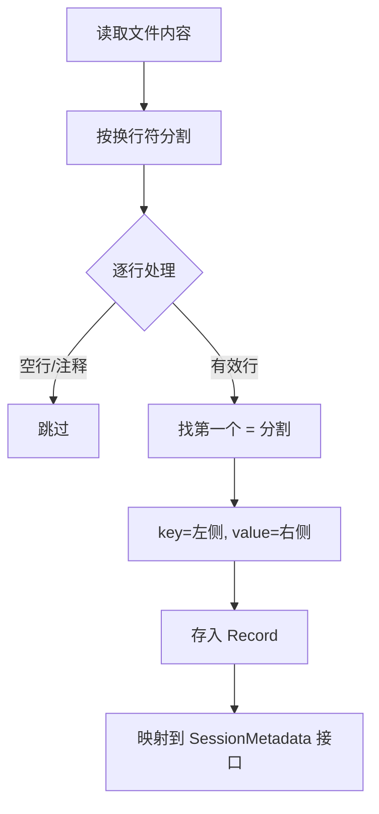
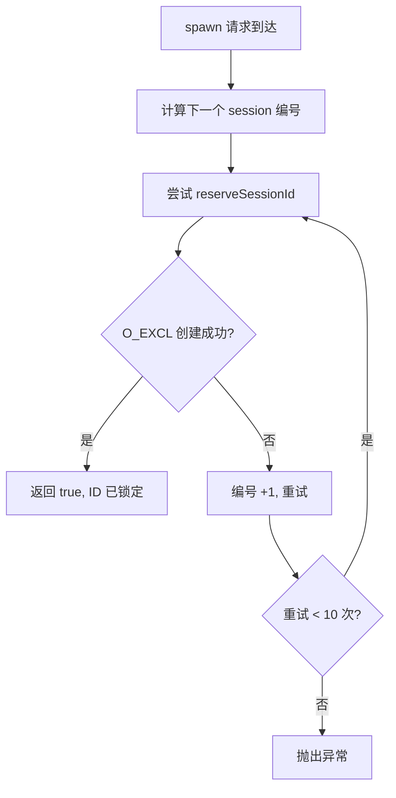
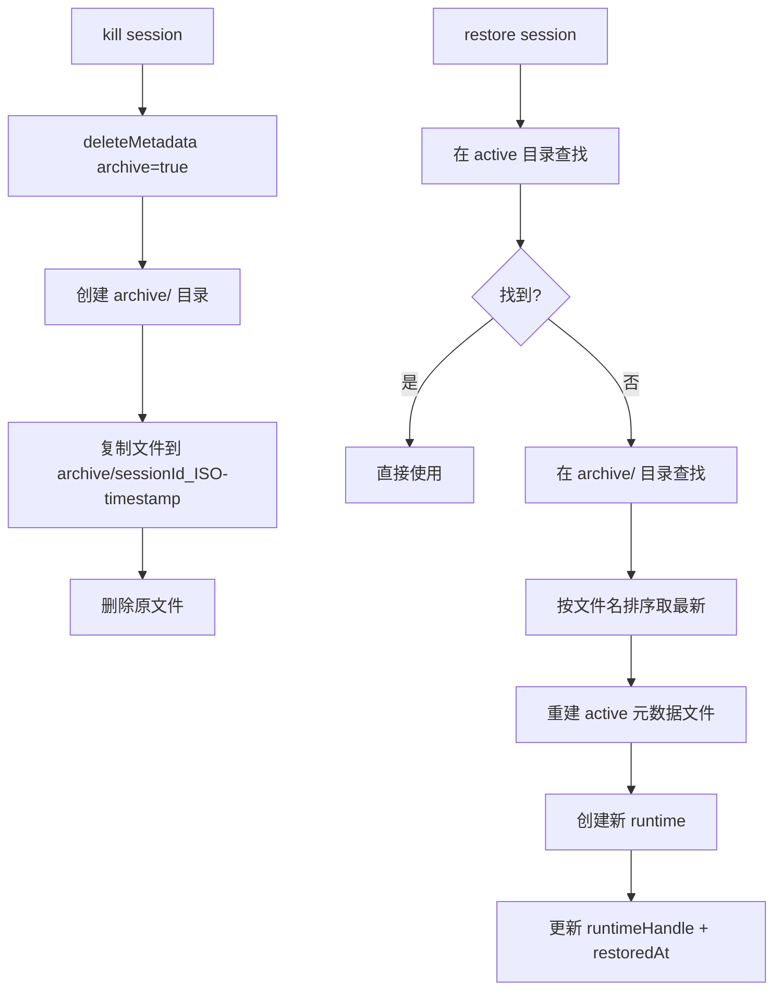

# PD-06.NN agent-orchestrator — Flat-File Session 元数据持久化

> 文档编号：PD-06.NN
> 来源：agent-orchestrator `packages/core/src/metadata.ts`, `packages/core/src/paths.ts`
> GitHub：https://github.com/ComposioHQ/agent-orchestrator.git
> 问题域：PD-06 记忆持久化 Memory Persistence
> 状态：可复用方案

---

## 第 1 章 问题与动机

### 1.1 核心问题

Agent 编排器需要管理多个并发 Agent Session 的生命周期状态。每个 Session 包含 worktree 路径、Git 分支、PR 链接、Issue 关联、运行时句柄等元数据。核心挑战：

1. **并发安全**：多个 `spawn` 请求同时到达时，Session ID 不能冲突
2. **归档恢复**：被 kill 的 Session 需要能从归档中恢复运行
3. **被动状态同步**：Agent 运行时（如 Claude Code）的 git/gh 操作需要零侵入地同步到编排器元数据
4. **跨工具兼容**：元数据格式需要同时被 Node.js 和 Bash 脚本读取
5. **哈希碰撞防护**：多项目共享 `~/.agent-orchestrator/` 目录时需要检测路径哈希碰撞

### 1.2 agent-orchestrator 的解法概述

agent-orchestrator 采用极简的 flat key=value 文件作为持久化层，每个 Session 一个文件，配合 POSIX `O_EXCL` 原子创建实现并发安全：

1. **Flat-File 格式**：每个 Session 对应一个 `key=value` 纯文本文件，兼容 Bash `source` 和 Node.js 解析（`packages/core/src/metadata.ts:42-54`）
2. **SHA256 哈希目录**：项目路径经 SHA256 取前 12 位作为命名空间，防止多项目冲突（`packages/core/src/paths.ts:20-25`）
3. **O_EXCL 原子预留**：`reserveSessionId()` 使用 `O_CREAT | O_EXCL` 标志位实现无锁并发安全（`packages/core/src/metadata.ts:264-274`）
4. **时间戳归档**：`deleteMetadata()` 将文件移入 `archive/` 子目录并附加 ISO 时间戳，支持按时间排序恢复（`packages/core/src/metadata.ts:191-204`）
5. **PostToolUse Hook 被动同步**：Claude Code 插件通过 Bash Hook 脚本拦截 `gh pr create` / `git checkout -b` 等命令，自动更新元数据（`packages/plugins/agent-claude-code/src/index.ts:31-167`）

### 1.3 设计思想

| 设计原则 | 具体实现 | 理由 | 替代方案 |
|----------|----------|------|----------|
| 文件即数据库 | 每 Session 一个 key=value 文件 | 零依赖、Bash 可读、调试友好 | SQLite / Redis |
| POSIX 原子性 | O_EXCL 创建 + temp+mv 更新 | 无需外部锁服务，内核级保证 | flock / 数据库事务 |
| 哈希命名空间 | SHA256(configDir).slice(0,12) | 多项目隔离 + 碰撞检测 | UUID / 序号 |
| 被动同步 | PostToolUse Hook 拦截 git/gh 命令 | Agent 代码零修改，编排器自动感知 | Agent 主动上报 / 轮询 |
| 归档而非删除 | archive/ 子目录 + ISO 时间戳 | 支持恢复，审计可追溯 | 软删除标记 / 回收站 |

---

## 第 2 章 源码实现分析

### 2.1 架构概览

agent-orchestrator 的持久化层分为三个层次：路径计算 → 元数据 CRUD → Session 管理器。

```
┌─────────────────────────────────────────────────────────────────┐
│                    SessionManager (CRUD)                         │
│  spawn() → reserve + write    restore() → archive → rewrite    │
│  kill() → archive             list() → scan + read              │
├─────────────────────────────────────────────────────────────────┤
│                    metadata.ts (Read/Write)                      │
│  parseMetadataFile()  serializeMetadata()  reserveSessionId()   │
│  readMetadata()  writeMetadata()  updateMetadata()              │
│  deleteMetadata()  readArchivedMetadataRaw()  listMetadata()    │
├─────────────────────────────────────────────────────────────────┤
│                    paths.ts (Naming)                             │
│  generateConfigHash()  generateInstanceId()                     │
│  getSessionsDir()  getArchiveDir()  validateAndStoreOrigin()    │
├─────────────────────────────────────────────────────────────────┤
│                    Filesystem                                    │
│  ~/.agent-orchestrator/{hash}-{projectId}/                      │
│    ├── .origin                                                  │
│    ├── sessions/{sessionName}                                   │
│    │   └── archive/{sessionName}_{ISO-timestamp}                │
│    └── worktrees/{sessionName}/                                 │
└─────────────────────────────────────────────────────────────────┘
```

### 2.2 核心实现

#### 2.2.1 Flat-File 解析与序列化



对应源码 `packages/core/src/metadata.ts:42-54`：

```typescript
function parseMetadataFile(content: string): Record<string, string> {
  const result: Record<string, string> = {};
  for (const line of content.split("\n")) {
    const trimmed = line.trim();
    if (!trimmed || trimmed.startsWith("#")) continue;
    const eqIndex = trimmed.indexOf("=");
    if (eqIndex === -1) continue;
    const key = trimmed.slice(0, eqIndex).trim();
    const value = trimmed.slice(eqIndex + 1).trim();
    if (key) result[key] = value;
  }
  return result;
}
```

序列化反向操作 `packages/core/src/metadata.ts:57-64`：

```typescript
function serializeMetadata(data: Record<string, string>): string {
  return (
    Object.entries(data)
      .filter(([, v]) => v !== undefined && v !== "")
      .map(([k, v]) => `${k}=${v}`)
      .join("\n") + "\n"
  );
}
```

关键设计：只用第一个 `=` 作为分隔符，value 中可以包含 `=`（如 PR URL 中的查询参数）。空值字段自动过滤，不写入文件。

#### 2.2.2 O_EXCL 原子 Session ID 预留



对应源码 `packages/core/src/metadata.ts:264-274`：

```typescript
export function reserveSessionId(dataDir: string, sessionId: SessionId): boolean {
  const path = metadataPath(dataDir, sessionId);
  mkdirSync(dirname(path), { recursive: true });
  try {
    const fd = openSync(path, constants.O_WRONLY | constants.O_CREAT | constants.O_EXCL);
    closeSync(fd);
    return true;
  } catch {
    return false;
  }
}
```

`O_EXCL` 是 POSIX 标准的原子文件创建标志：如果文件已存在则 `openSync` 抛出 `EEXIST`，内核保证不会有两个进程同时成功创建同一文件。这比 `existsSync() + writeFileSync()` 的 TOCTOU 模式安全得多。

调用方 `packages/core/src/session-manager.ts:370-383` 的重试循环：

```typescript
for (let attempts = 0; attempts < 10; attempts++) {
  sessionId = `${project.sessionPrefix}-${num}`;
  if (config.configPath) {
    tmuxName = generateTmuxName(config.configPath, project.sessionPrefix, num);
  }
  if (reserveSessionId(sessionsDir, sessionId)) break;
  num++;
  if (attempts === 9) {
    throw new Error(
      `Failed to reserve session ID after 10 attempts (prefix: ${project.sessionPrefix})`,
    );
  }
}
```

#### 2.2.3 归档与恢复机制



归档写入 `packages/core/src/metadata.ts:191-204`：

```typescript
export function deleteMetadata(dataDir: string, sessionId: SessionId, archive = true): void {
  const path = metadataPath(dataDir, sessionId);
  if (!existsSync(path)) return;

  if (archive) {
    const archiveDir = join(dataDir, "archive");
    mkdirSync(archiveDir, { recursive: true });
    const timestamp = new Date().toISOString().replace(/[:.]/g, "-");
    const archivePath = join(archiveDir, `${sessionId}_${timestamp}`);
    writeFileSync(archivePath, readFileSync(path, "utf-8"));
  }

  unlinkSync(path);
}
```

归档读取 `packages/core/src/metadata.ts:211-240`：

```typescript
export function readArchivedMetadataRaw(
  dataDir: string,
  sessionId: SessionId,
): Record<string, string> | null {
  validateSessionId(sessionId);
  const archiveDir = join(dataDir, "archive");
  if (!existsSync(archiveDir)) return null;

  const prefix = `${sessionId}_`;
  let latest: string | null = null;

  for (const file of readdirSync(archiveDir)) {
    if (!file.startsWith(prefix)) continue;
    const charAfterPrefix = file[prefix.length];
    if (!charAfterPrefix || charAfterPrefix < "0" || charAfterPrefix > "9") continue;
    if (!latest || file > latest) {
      latest = file;
    }
  }

  if (!latest) return null;
  try {
    return parseMetadataFile(readFileSync(join(archiveDir, latest), "utf-8"));
  } catch {
    return null;
  }
}
```

关键技巧：ISO 时间戳天然支持字典序排序，`file > latest` 即可找到最新归档。前缀碰撞防护通过检查分隔符后的首字符是否为数字来避免（如 `app` 不会匹配 `app_v2_...`）。

### 2.3 实现细节

#### JSONL 尾部读取优化

Agent 的 JSONL 会话文件可能超过 100MB，但摘要和成本信息总在文件末尾。`parseJsonlFileTail()` 只读取最后 128KB（`packages/plugins/agent-claude-code/src/index.ts:264-307`）：

```typescript
async function parseJsonlFileTail(filePath: string, maxBytes = 131_072): Promise<JsonlLine[]> {
  const { size = 0 } = await stat(filePath);
  const offset = Math.max(0, size - maxBytes);
  if (offset === 0) {
    content = await readFile(filePath, "utf-8");
  } else {
    const handle = await open(filePath, "r");
    const buffer = Buffer.allocUnsafe(size - offset);
    await handle.read(buffer, 0, size - offset, offset);
    content = buffer.toString("utf-8");
  }
  // 跳过可能被截断的第一行
  const firstNewline = content.indexOf("\n");
  const safeContent = offset > 0 && firstNewline >= 0
    ? content.slice(firstNewline + 1) : content;
  // ...解析 JSON 行
}
```

#### PostToolUse Hook 被动同步

Claude Code 插件在 `postLaunchSetup()` 时向工作区写入 `.claude/metadata-updater.sh` 脚本和 `.claude/settings.json` Hook 配置（`packages/plugins/agent-claude-code/src/index.ts:497-575`）。Hook 脚本通过 `sed` + `mv` 原子更新元数据文件（`packages/plugins/agent-claude-code/src/index.ts:90-112`）：

```bash
update_metadata_key() {
  local key="$1"
  local value="$2"
  local temp_file="${metadata_file}.tmp"
  local escaped_value=$(echo "$value" | sed 's/[&|\\/]/\\&/g')
  if grep -q "^$key=" "$metadata_file" 2>/dev/null; then
    sed "s|^$key=.*|$key=$escaped_value|" "$metadata_file" > "$temp_file"
  else
    cp "$metadata_file" "$temp_file"
    echo "$key=$value" >> "$temp_file"
  fi
  mv "$temp_file" "$metadata_file"
}
```

#### 哈希碰撞检测

`validateAndStoreOrigin()` 在首次创建项目目录时写入 `.origin` 文件记录真实 config 路径。后续访问时比对，不一致则抛出碰撞异常（`packages/core/src/paths.ts:173-194`）。

#### JSONL 活动状态检测

`getActivityState()` 通过读取 JSONL 最后一条记录的 `type` 字段判断 Agent 状态（`packages/plugins/agent-claude-code/src/index.ts:646-703`）：

| JSONL type | 映射状态 | 含义 |
|------------|----------|------|
| `user` / `tool_use` / `progress` | active → idle（超时） | Agent 正在处理 |
| `assistant` / `summary` / `result` | ready → idle（超时） | Agent 已完成当前轮 |
| `permission_request` | waiting_input | 等待用户授权 |
| `error` | blocked | 遇到错误 |

---

## 第 3 章 迁移指南

### 3.1 迁移清单

**阶段 1：基础元数据层（1 个文件）**
- [ ] 实现 `parseMetadataFile()` / `serializeMetadata()` 解析器
- [ ] 实现 `readMetadata()` / `writeMetadata()` / `updateMetadata()` CRUD
- [ ] 实现 `reserveSessionId()` 原子预留（O_EXCL）
- [ ] 添加 Session ID 正则校验防止路径穿越

**阶段 2：归档恢复（扩展 CRUD）**
- [ ] 实现 `deleteMetadata(archive=true)` 归档逻辑
- [ ] 实现 `readArchivedMetadataRaw()` 按时间戳排序读取
- [ ] 在 restore 流程中集成归档回读

**阶段 3：路径命名空间（可选）**
- [ ] 实现 SHA256 哈希目录命名
- [ ] 实现 `.origin` 碰撞检测
- [ ] 实现 Session 前缀生成（CamelCase/kebab-case 启发式）

**阶段 4：被动同步 Hook（Agent 特定）**
- [ ] 编写 PostToolUse Hook 脚本（Bash）
- [ ] 在 Agent 启动时自动注入 Hook 配置
- [ ] 支持 `gh pr create` / `git checkout -b` / `gh pr merge` 命令检测

### 3.2 适配代码模板

以下是一个可直接运行的 TypeScript 最小实现，覆盖阶段 1 的全部功能：

```typescript
import {
  readFileSync, writeFileSync, existsSync, mkdirSync,
  unlinkSync, readdirSync, statSync, openSync, closeSync, constants,
} from "node:fs";
import { join, dirname } from "node:path";

// ---- 类型 ----
interface SessionMetadata {
  worktree: string;
  branch: string;
  status: string;
  [key: string]: string | undefined;
}

// ---- 解析 ----
const VALID_ID = /^[a-zA-Z0-9_-]+$/;

function parse(content: string): Record<string, string> {
  const r: Record<string, string> = {};
  for (const line of content.split("\n")) {
    const t = line.trim();
    if (!t || t.startsWith("#")) continue;
    const eq = t.indexOf("=");
    if (eq === -1) continue;
    const k = t.slice(0, eq).trim();
    const v = t.slice(eq + 1).trim();
    if (k) r[k] = v;
  }
  return r;
}

function serialize(data: Record<string, string>): string {
  return Object.entries(data)
    .filter(([, v]) => v !== undefined && v !== "")
    .map(([k, v]) => `${k}=${v}`)
    .join("\n") + "\n";
}

// ---- CRUD ----
function validate(id: string): void {
  if (!VALID_ID.test(id)) throw new Error(`Invalid session ID: ${id}`);
}

export function read(dir: string, id: string): SessionMetadata | null {
  validate(id);
  const p = join(dir, id);
  if (!existsSync(p)) return null;
  const raw = parse(readFileSync(p, "utf-8"));
  return { worktree: raw.worktree ?? "", branch: raw.branch ?? "", status: raw.status ?? "unknown", ...raw };
}

export function write(dir: string, id: string, meta: SessionMetadata): void {
  validate(id);
  mkdirSync(dir, { recursive: true });
  writeFileSync(join(dir, id), serialize(meta as Record<string, string>), "utf-8");
}

export function update(dir: string, id: string, updates: Record<string, string>): void {
  validate(id);
  let existing: Record<string, string> = {};
  const p = join(dir, id);
  if (existsSync(p)) existing = parse(readFileSync(p, "utf-8"));
  for (const [k, v] of Object.entries(updates)) {
    if (v === "") { delete existing[k]; } else { existing[k] = v; }
  }
  mkdirSync(dirname(p), { recursive: true });
  writeFileSync(p, serialize(existing), "utf-8");
}

export function reserve(dir: string, id: string): boolean {
  validate(id);
  mkdirSync(dir, { recursive: true });
  try {
    const fd = openSync(join(dir, id), constants.O_WRONLY | constants.O_CREAT | constants.O_EXCL);
    closeSync(fd);
    return true;
  } catch { return false; }
}

export function remove(dir: string, id: string, archive = true): void {
  validate(id);
  const p = join(dir, id);
  if (!existsSync(p)) return;
  if (archive) {
    const archDir = join(dir, "archive");
    mkdirSync(archDir, { recursive: true });
    const ts = new Date().toISOString().replace(/[:.]/g, "-");
    writeFileSync(join(archDir, `${id}_${ts}`), readFileSync(p, "utf-8"));
  }
  unlinkSync(p);
}

export function list(dir: string): string[] {
  if (!existsSync(dir)) return [];
  return readdirSync(dir).filter(n =>
    n !== "archive" && !n.startsWith(".") && VALID_ID.test(n) &&
    statSync(join(dir, n)).isFile()
  );
}
```

### 3.3 适用场景

| 场景 | 适用度 | 说明 |
|------|--------|------|
| CLI 工具的 Session 管理 | ⭐⭐⭐ | 零依赖、Bash 兼容、调试友好 |
| 多 Agent 编排器 | ⭐⭐⭐ | O_EXCL 并发安全 + 归档恢复 |
| 单机开发工具 | ⭐⭐⭐ | 文件系统即数据库，无需额外服务 |
| 分布式多节点 Agent | ⭐ | 文件系统不支持跨机器共享，需换 Redis/DB |
| 高频写入场景（>100 QPS） | ⭐ | 文件 I/O 成为瓶颈，需换内存/数据库 |
| 需要复杂查询的场景 | ⭐ | key=value 不支持索引和条件查询 |

---

## 第 4 章 测试用例

基于 `packages/integration-tests/src/metadata-lifecycle.integration.test.ts` 的真实测试模式：

```typescript
import { mkdtemp, rm } from "node:fs/promises";
import { existsSync, readdirSync, readFileSync, mkdirSync } from "node:fs";
import { tmpdir } from "node:os";
import { join } from "node:path";
import { describe, it, expect, beforeAll, afterAll } from "vitest";
import { read, write, update, remove, reserve, list } from "./metadata";

describe("flat-file metadata persistence", () => {
  let tmpDir: string;

  beforeAll(async () => {
    tmpDir = await mkdtemp(join(tmpdir(), "meta-test-"));
  });
  afterAll(async () => {
    await rm(tmpDir, { recursive: true, force: true }).catch(() => {});
  });

  it("write + read round-trip preserves all fields", () => {
    const dir = join(tmpDir, "roundtrip");
    mkdirSync(dir, { recursive: true });
    write(dir, "s-1", {
      worktree: "/tmp/wt/s-1", branch: "feat/X-100", status: "working",
      tmuxName: "abc123-s-1", issue: "X-100",
      pr: "https://github.com/org/repo/pull/42",
    });
    const result = read(dir, "s-1");
    expect(result).not.toBeNull();
    expect(result!.worktree).toBe("/tmp/wt/s-1");
    expect(result!.pr).toBe("https://github.com/org/repo/pull/42");
  });

  it("update merges fields without overwriting existing", () => {
    const dir = join(tmpDir, "merge");
    mkdirSync(dir, { recursive: true });
    write(dir, "s-2", { worktree: "/w", branch: "main", status: "spawning" });
    update(dir, "s-2", { status: "working", pr: "https://github.com/o/r/pull/1" });
    const result = read(dir, "s-2");
    expect(result!.status).toBe("working");
    expect(result!.pr).toBe("https://github.com/o/r/pull/1");
    expect(result!.worktree).toBe("/w"); // preserved
  });

  it("update removes keys set to empty string", () => {
    const dir = join(tmpDir, "remove-key");
    mkdirSync(dir, { recursive: true });
    write(dir, "s-3", { worktree: "/w", branch: "main", status: "working", summary: "Remove me" });
    update(dir, "s-3", { summary: "" });
    const result = read(dir, "s-3");
    expect(result!.summary).toBeUndefined();
  });

  it("reserve uses O_EXCL for atomic creation", () => {
    const dir = join(tmpDir, "reserve");
    mkdirSync(dir, { recursive: true });
    expect(reserve(dir, "s-4")).toBe(true);
    expect(reserve(dir, "s-4")).toBe(false); // already exists
  });

  it("concurrent reserves never double-allocate", async () => {
    const dir = join(tmpDir, "concurrent");
    mkdirSync(dir, { recursive: true });
    const results = await Promise.all(
      Array.from({ length: 20 }, () => Promise.resolve(reserve(dir, "race-1")))
    );
    expect(results.filter(Boolean).length).toBe(1); // exactly one winner
  });

  it("delete with archive moves to archive/ subdirectory", () => {
    const dir = join(tmpDir, "archive");
    mkdirSync(dir, { recursive: true });
    write(dir, "s-5", { worktree: "/w", branch: "main", status: "done" });
    remove(dir, "s-5", true);
    expect(existsSync(join(dir, "s-5"))).toBe(false);
    const archived = readdirSync(join(dir, "archive"));
    expect(archived.length).toBe(1);
    expect(archived[0]).toMatch(/^s-5_/);
    expect(readFileSync(join(dir, "archive", archived[0]), "utf-8")).toContain("worktree=/w");
  });

  it("list excludes archive directory and hidden files", () => {
    const dir = join(tmpDir, "listing");
    mkdirSync(dir, { recursive: true });
    write(dir, "a-1", { worktree: "/a", branch: "a", status: "idle" });
    write(dir, "b-2", { worktree: "/b", branch: "b", status: "working" });
    const ids = list(dir);
    expect(ids).toContain("a-1");
    expect(ids).toContain("b-2");
    expect(ids).not.toContain("archive");
  });

  it("rejects path traversal in session ID", () => {
    const dir = join(tmpDir, "validation");
    mkdirSync(dir, { recursive: true });
    expect(() => read(dir, "../escape")).toThrow("Invalid session ID");
    expect(() => read(dir, "foo/bar")).toThrow("Invalid session ID");
  });
});
```

---

## 第 5 章 跨域关联

| 关联域 | 关系类型 | 说明 |
|--------|----------|------|
| PD-01 上下文管理 | 协同 | JSONL 尾部读取（128KB 窗口）是上下文窗口管理的一种实践——只读取最近的对话片段而非全量加载 |
| PD-02 多 Agent 编排 | 依赖 | SessionManager 的 spawn/restore/kill 是编排器的核心 CRUD，元数据持久化是编排状态的唯一真相源 |
| PD-03 容错与重试 | 协同 | O_EXCL 原子预留 + 归档恢复机制本身就是容错设计；spawn 失败时的 best-effort 清理链也是容错模式 |
| PD-04 工具系统 | 协同 | PostToolUse Hook 是工具系统的扩展点，通过 Hook 实现元数据被动同步而非侵入 Agent 代码 |
| PD-07 质量检查 | 协同 | cleanup() 通过检查 PR 是否 merged、Issue 是否 closed 来自动清理过期 Session，是质量保障的一部分 |
| PD-11 可观测性 | 协同 | JSONL 文件同时承载成本追踪（token 计数、USD 估算）和活动状态检测，是可观测性的数据源 |

---

## 第 6 章 来源文件索引

| 文件 | 行范围 | 关键实现 |
|------|--------|----------|
| `packages/core/src/metadata.ts` | L42-L54 | `parseMetadataFile()` flat key=value 解析器 |
| `packages/core/src/metadata.ts` | L57-L64 | `serializeMetadata()` 序列化 |
| `packages/core/src/metadata.ts` | L84-L107 | `readMetadata()` 读取并映射到 SessionMetadata |
| `packages/core/src/metadata.ts` | L124-L154 | `writeMetadata()` 全量写入 |
| `packages/core/src/metadata.ts` | L160-L185 | `updateMetadata()` 合并更新 |
| `packages/core/src/metadata.ts` | L191-L204 | `deleteMetadata()` 归档删除 |
| `packages/core/src/metadata.ts` | L211-L240 | `readArchivedMetadataRaw()` 归档读取 |
| `packages/core/src/metadata.ts` | L245-L258 | `listMetadata()` 枚举 Session ID |
| `packages/core/src/metadata.ts` | L264-L274 | `reserveSessionId()` O_EXCL 原子预留 |
| `packages/core/src/paths.ts` | L20-L25 | `generateConfigHash()` SHA256 哈希 |
| `packages/core/src/paths.ts` | L40-L44 | `generateInstanceId()` 实例 ID |
| `packages/core/src/paths.ts` | L55-L78 | `generateSessionPrefix()` 前缀启发式 |
| `packages/core/src/paths.ts` | L173-L194 | `validateAndStoreOrigin()` 碰撞检测 |
| `packages/core/src/session-manager.ts` | L315-L559 | `spawn()` 完整创建流程 |
| `packages/core/src/session-manager.ts` | L750-L808 | `kill()` 销毁 + 归档 |
| `packages/core/src/session-manager.ts` | L920-L1107 | `restore()` 归档恢复流程 |
| `packages/core/src/types.ts` | L959-L975 | `SessionMetadata` 接口定义 |
| `packages/core/src/utils.ts` | L39-L81 | `readLastLine()` 反向读取文件末行 |
| `packages/core/src/utils.ts` | L90-L110 | `readLastJsonlEntry()` JSONL 尾部解析 |
| `packages/plugins/agent-claude-code/src/index.ts` | L31-L167 | PostToolUse Hook 脚本（Bash） |
| `packages/plugins/agent-claude-code/src/index.ts` | L198-L203 | `toClaudeProjectPath()` 路径编码 |
| `packages/plugins/agent-claude-code/src/index.ts` | L264-L307 | `parseJsonlFileTail()` 128KB 尾部读取 |
| `packages/plugins/agent-claude-code/src/index.ts` | L339-L383 | `extractCost()` Token/USD 聚合 |
| `packages/plugins/agent-claude-code/src/index.ts` | L646-L703 | `getActivityState()` JSONL 活动检测 |
| `packages/plugins/agent-claude-code/src/index.ts` | L732-L759 | `getRestoreCommand()` 恢复命令生成 |

---

## 第 7 章 横向对比维度

> **重要：** 本章用于自动填充 Butcher Wiki 的横向对比表。
> 必须严格按以下 JSON 格式输出，放在 `comparison_data` 代码块中。

```json comparison_data
{
  "project": "agent-orchestrator",
  "dimensions": {
    "记忆结构": "flat key=value 文件，每 Session 一个文件，15+ 字段",
    "更新机制": "read-merge-write 全量覆盖，空值删除键",
    "存储方式": "纯文件系统，~/.agent-orchestrator/{hash}/sessions/",
    "注入方式": "环境变量 AO_SESSION + AO_DATA_DIR 传递路径",
    "生命周期管理": "spawn→working→pr_open→merged/killed，归档+恢复",
    "并发安全": "O_EXCL 原子文件创建，10 次重试循环",
    "碰撞检测": "SHA256 前 12 位 + .origin 文件比对",
    "版本控制": "无版本控制，归档按 ISO 时间戳命名",
    "记忆检索": "JSONL 尾部 128KB 读取 + 文件名前缀匹配",
    "被动状态同步": "PostToolUse Bash Hook 拦截 git/gh 命令自动更新"
  }
}
```

### 域元数据补充

```json domain_metadata
{
  "solution_summary": "agent-orchestrator 用 flat key=value 文件 + O_EXCL 原子创建实现多 Session 并发安全持久化，PostToolUse Hook 被动同步 Agent 运行时状态",
  "description": "编排器级 Session 元数据持久化，关注并发预留与被动状态同步",
  "sub_problems": [
    "哈希命名空间碰撞：多项目共享目录时如何检测 SHA256 截断碰撞",
    "Hook 被动同步：如何通过 Agent 工具调用 Hook 零侵入地更新编排器元数据",
    "JSONL 大文件尾部读取：100MB+ 会话文件如何只读末尾提取摘要和成本"
  ],
  "best_practices": [
    "O_EXCL 优于 existsSync+write：内核级原子性消除 TOCTOU 竞态",
    "ISO 时间戳天然排序：归档文件名用 ISO 格式，字典序即时间序",
    "Session ID 正则校验：/^[a-zA-Z0-9_-]+$/ 防止路径穿越攻击",
    "归档优于软删除：物理移动到 archive/ 子目录，恢复时重建 active 文件"
  ]
}
```
