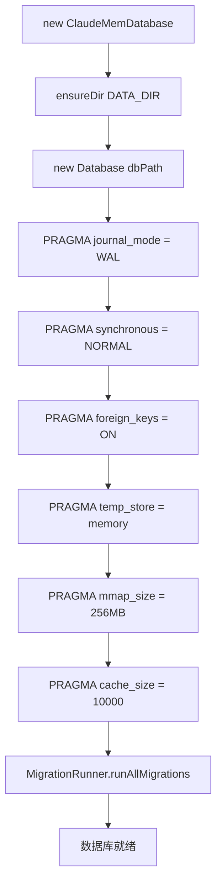
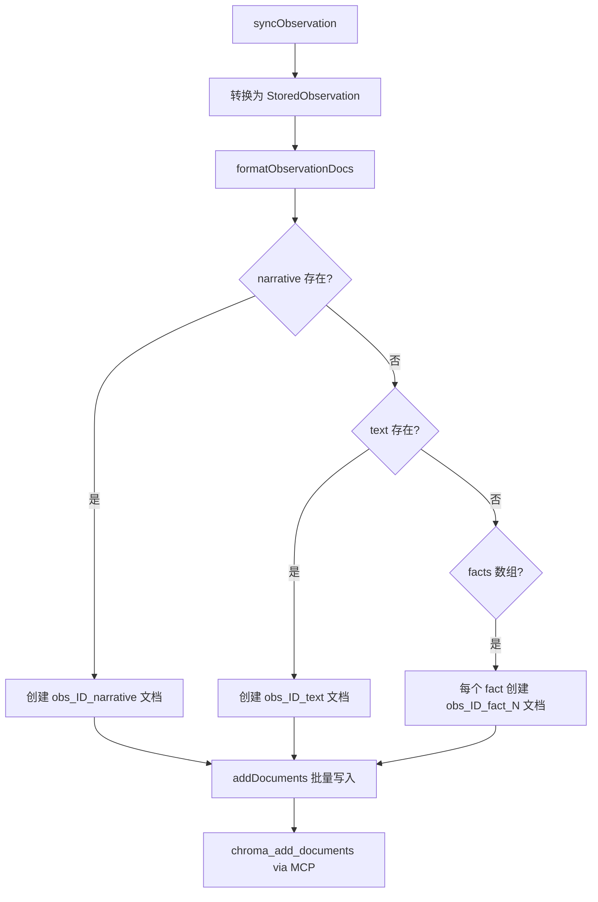
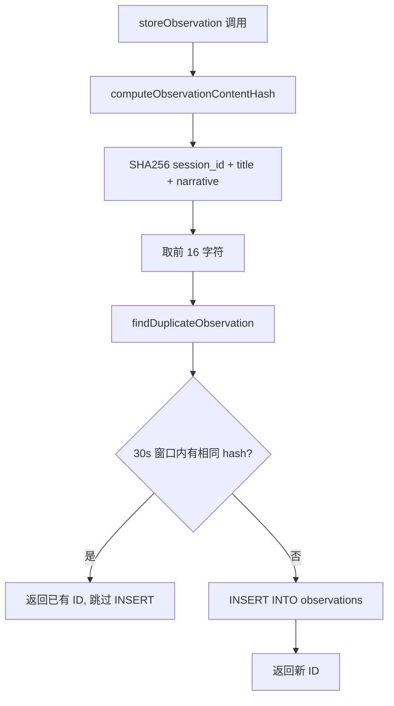

# PD-06.10 claude-mem — SQLite + ChromaDB 双层记忆持久化

> 文档编号：PD-06.10
> 来源：claude-mem `src/services/sqlite/Database.ts`, `src/services/sync/ChromaSync.ts`, `src/services/sqlite/migrations/runner.ts`
> GitHub：https://github.com/thedotmack/claude-mem.git
> 问题域：PD-06 记忆持久化 Memory Persistence
> 状态：可复用方案

---

## 第 1 章 问题与动机（≥ 30 行）

### 1.1 核心问题

AI Agent（如 Claude Code）的对话是无状态的——每次新会话启动时，Agent 对之前做过什么、学到什么、用户偏好是什么一无所知。这导致：

1. **重复劳动**：Agent 反复探索同一代码库的相同文件，浪费 token 和时间
2. **上下文丢失**：跨会话的决策链断裂，Agent 无法基于历史经验做出更好的判断
3. **知识碎片化**：工具调用产生的 observations（发现）和 summaries（摘要）散落在各处，无法被高效检索
4. **语义搜索缺失**：纯关键词搜索无法理解"我之前怎么处理认证问题的"这类语义查询

claude-mem 的核心设计目标是：**让 Agent 拥有跨会话的持久记忆，并通过混合搜索（SQLite 元数据 + ChromaDB 向量语义）高效检索**。

### 1.2 claude-mem 的解法概述

1. **SQLite 作为 Source of Truth**：所有 observations、session_summaries、user_prompts 存入 SQLite，WAL 模式保证并发读写性能（`src/services/sqlite/Database.ts:42-47`）
2. **ChromaDB 作为语义搜索层**：通过 MCP 协议连接 chroma-mcp 子进程，将 SQLite 数据同步为向量嵌入，支持语义查询（`src/services/sync/ChromaSync.ts:72-86`）
3. **FTS5 全文索引**：SQLite 内建 FTS5 虚拟表 + 触发器自动同步，支持关键词搜索作为向量搜索的补充（`src/services/sqlite/migrations.ts:372-485`）
4. **渐进式迁移系统**：MigrationRunner 管理 23 个版本的 schema 演进，每个迁移幂等可重入（`src/services/sqlite/migrations/runner.ts:14-37`）
5. **3 层搜索工作流**：search → timeline → get_observations，先获取轻量索引再按需加载详情，10x token 节省（`src/servers/mcp-server.ts:157-188`）

### 1.3 设计思想

| 设计原则 | 具体实现 | 理由 | 替代方案 |
|----------|----------|------|----------|
| SQLite 为主，向量库为辅 | SQLite 存全量数据，ChromaDB 只存嵌入 | SQLite 零依赖、嵌入式、事务安全；ChromaDB 可选 | 全量存向量库（丢失结构化查询能力） |
| 粒度化向量文档 | 每个 observation 的 narrative/facts/text 分别成为独立向量文档 | 细粒度嵌入提高语义匹配精度 | 整条 observation 作为单个文档（语义稀释） |
| MCP 协议连接 ChromaDB | 通过 stdio MCP 与 chroma-mcp 子进程通信 | 消除 chromadb npm 包和 ONNX/WASM 依赖 | 直接 HTTP 调用 ChromaDB server |
| 幂等迁移 | 每个迁移检查实际列/表状态而非仅依赖版本号 | 处理中断恢复、版本冲突等边缘情况 | 仅依赖版本号（中断后状态不一致） |
| 内容哈希去重 | SHA256(session_id + title + narrative) 30s 窗口去重 | 防止高频对话场景下重复存储 | 无去重（浪费存储和搜索噪音） |

---

## 第 2 章 源码实现分析（≥ 60 行，核心章节）

### 2.1 架构概览

claude-mem 的记忆持久化分为三层：存储层（SQLite）、同步层（ChromaSync）、查询层（SearchManager）。

```
┌─────────────────────────────────────────────────────────────┐
│                    MCP Server (stdio)                        │
│  search / timeline / get_observations / save_observation     │
└──────────────────────────┬──────────────────────────────────┘
                           │ HTTP API (localhost:37777)
┌──────────────────────────▼──────────────────────────────────┐
│                   SearchManager                              │
│  Chroma 语义搜索 → 90天窗口过滤 → SQLite 水合详情            │
│  FTS5 关键词搜索 ← 降级路径（Chroma 不可用时）               │
└────────┬─────────────────────────────────┬──────────────────┘
         │                                 │
┌────────▼────────┐              ┌─────────▼─────────┐
│   SessionStore   │              │    ChromaSync      │
│   (SQLite WAL)   │              │  (MCP → chroma)    │
│                  │              │                    │
│ • sdk_sessions   │   backfill   │ • 粒度化文档格式   │
│ • observations   │ ──────────→  │ • 批量同步 100/批  │
│ • summaries      │              │ • 智能回填         │
│ • user_prompts   │              │ • 去重 by sqlite_id│
│ • FTS5 虚拟表    │              └────────────────────┘
│ • 23 版本迁移    │
└─────────────────┘
```

### 2.2 核心实现

#### 2.2.1 SQLite 数据库初始化与优化



对应源码 `src/services/sqlite/Database.ts:29-52`：

```typescript
export class ClaudeMemDatabase {
  public db: Database;

  constructor(dbPath: string = DB_PATH) {
    if (dbPath !== ':memory:') {
      ensureDir(DATA_DIR);
    }
    this.db = new Database(dbPath, { create: true, readwrite: true });

    // Apply optimized SQLite settings
    this.db.run('PRAGMA journal_mode = WAL');
    this.db.run('PRAGMA synchronous = NORMAL');
    this.db.run('PRAGMA foreign_keys = ON');
    this.db.run('PRAGMA temp_store = memory');
    this.db.run(`PRAGMA mmap_size = ${SQLITE_MMAP_SIZE_BYTES}`);  // 256MB
    this.db.run(`PRAGMA cache_size = ${SQLITE_CACHE_SIZE_PAGES}`); // 10000 pages

    const migrationRunner = new MigrationRunner(this.db);
    migrationRunner.runAllMigrations();
  }
}
```

关键 PRAGMA 选择：WAL 模式允许并发读写（Worker 写入 + MCP Server 读取不阻塞），`synchronous = NORMAL` 在 WAL 下已足够安全且性能更好，`mmap_size = 256MB` 利用内存映射加速大表扫描。

#### 2.2.2 ChromaSync 粒度化向量同步



对应源码 `src/services/sync/ChromaSync.ts:122-183`：

```typescript
private formatObservationDocs(obs: StoredObservation): ChromaDocument[] {
  const documents: ChromaDocument[] = [];
  const facts = obs.facts ? JSON.parse(obs.facts) : [];
  const baseMetadata: Record<string, string | number> = {
    sqlite_id: obs.id,
    doc_type: 'observation',
    memory_session_id: obs.memory_session_id,
    project: obs.project,
    created_at_epoch: obs.created_at_epoch,
    type: obs.type || 'discovery',
    title: obs.title || 'Untitled'
  };

  // Narrative as separate document
  if (obs.narrative) {
    documents.push({
      id: `obs_${obs.id}_narrative`,
      document: obs.narrative,
      metadata: { ...baseMetadata, field_type: 'narrative' }
    });
  }

  // Each fact as separate document
  facts.forEach((fact: string, index: number) => {
    documents.push({
      id: `obs_${obs.id}_fact_${index}`,
      document: fact,
      metadata: { ...baseMetadata, field_type: 'fact', fact_index: index }
    });
  });

  return documents;
}
```

这种粒度化设计的核心洞察：一条 observation 可能包含多个语义不同的信息（narrative 描述整体发现，每个 fact 是独立的知识点）。将它们拆分为独立向量文档，搜索"如何配置 TypeScript"时能精确匹配到某个 fact，而不是被整条 observation 的其他内容稀释。

#### 2.2.3 内容哈希去重机制



对应源码 `src/services/sqlite/observations/store.ts:19-28` 和 `34-44`：

```typescript
const DEDUP_WINDOW_MS = 30_000;

export function computeObservationContentHash(
  memorySessionId: string,
  title: string | null,
  narrative: string | null
): string {
  return createHash('sha256')
    .update((memorySessionId || '') + (title || '') + (narrative || ''))
    .digest('hex')
    .slice(0, 16);
}

export function findDuplicateObservation(
  db: Database,
  contentHash: string,
  timestampEpoch: number
): { id: number; created_at_epoch: number } | null {
  const windowStart = timestampEpoch - DEDUP_WINDOW_MS;
  const stmt = db.prepare(
    'SELECT id, created_at_epoch FROM observations WHERE content_hash = ? AND created_at_epoch > ?'
  );
  return stmt.get(contentHash, windowStart) as { id: number; created_at_epoch: number } | null;
}
```

### 2.3 实现细节

#### 幂等迁移系统

MigrationRunner 的 23 个迁移不依赖纯版本号追踪，而是每个迁移先检查实际数据库状态（`PRAGMA table_info`、`PRAGMA index_list`），再决定是否执行。这解决了 issue #979 中 DatabaseManager 旧迁移系统与新系统版本号冲突的问题。

关键代码 `src/services/sqlite/migrations/runner.ts:126-138`：

```typescript
private ensureWorkerPortColumn(): void {
  // Check actual column existence — don't rely on version tracking alone (issue #979)
  const tableInfo = this.db.query('PRAGMA table_info(sdk_sessions)').all() as TableColumnInfo[];
  const hasWorkerPort = tableInfo.some(col => col.name === 'worker_port');
  if (!hasWorkerPort) {
    this.db.run('ALTER TABLE sdk_sessions ADD COLUMN worker_port INTEGER');
  }
  this.db.prepare('INSERT OR IGNORE INTO schema_versions (version, applied_at) VALUES (?, ?)').run(5, new Date().toISOString());
}
```

#### FTS5 全文索引与触发器同步

`src/services/sqlite/migrations.ts:372-426` 创建 FTS5 虚拟表并通过 INSERT/DELETE/UPDATE 触发器保持同步：

```sql
CREATE VIRTUAL TABLE IF NOT EXISTS observations_fts USING fts5(
  title, subtitle, narrative, text, facts, concepts,
  content='observations', content_rowid='id'
);

CREATE TRIGGER observations_ai AFTER INSERT ON observations BEGIN
  INSERT INTO observations_fts(rowid, title, subtitle, narrative, text, facts, concepts)
  VALUES (new.id, new.title, new.subtitle, new.narrative, new.text, new.facts, new.concepts);
END;
```

FTS5 在 Bun on Windows 上可能不可用（issue #791），因此迁移先用 probe 表检测可用性，不可用时优雅跳过，搜索降级到 ChromaDB。

#### 智能回填（Smart Backfill）

`src/services/sync/ChromaSync.ts:517-681` 实现了增量回填：先从 Chroma 获取已有文档的 sqlite_id 集合，再用 `NOT IN` 排除已同步的记录，只同步缺失的部分。这避免了每次启动时全量重同步。

#### 3 层搜索工作流

MCP Server 暴露的 `__IMPORTANT` 工具（`src/servers/mcp-server.ts:157-188`）强制 Agent 遵循 3 层模式：
1. `search(query)` → 返回轻量索引（~50-100 tokens/result）
2. `timeline(anchor=ID)` → 获取时间线上下文
3. `get_observations([IDs])` → 按需加载完整详情（~500-1000 tokens/result）

SearchManager 的搜索路径（`src/services/worker/SearchManager.ts:137-238`）：
- **PATH 1**：无 query 文本 → 直接 SQLite 过滤（支持日期范围、类型等）
- **PATH 2**：有 query + Chroma 可用 → Chroma 语义搜索 → 90 天窗口过滤 → SQLite 水合
- **PATH 3**：有 query + Chroma 不可用 → 返回错误提示安装 uv

---

## 第 3 章 迁移指南（≥ 40 行）

### 3.1 迁移清单

#### 阶段 1：SQLite 存储层（必选）

- [ ] 安装 `better-sqlite3`（Node.js）或使用 `bun:sqlite`（Bun）
- [ ] 创建 Database 类，配置 WAL + NORMAL + foreign_keys + mmap
- [ ] 定义核心表：sessions、observations、summaries
- [ ] 实现 MigrationRunner，每个迁移检查实际状态而非仅版本号
- [ ] 添加 FTS5 虚拟表 + 触发器（可选，需检测平台支持）

#### 阶段 2：内容去重（推荐）

- [ ] 实现 content_hash 计算（SHA256 截断 16 字符）
- [ ] 添加 content_hash 列 + 索引
- [ ] 在 store 函数中加入 30s 窗口去重逻辑

#### 阶段 3：向量搜索层（可选）

- [ ] 安装 ChromaDB（通过 uvx chroma-mcp 或独立 server）
- [ ] 实现 ChromaSync 类：粒度化文档格式 + 批量同步
- [ ] 实现智能回填：增量同步缺失记录
- [ ] 实现 SearchManager：Chroma 语义搜索 → SQLite 水合

#### 阶段 4：MCP 接口（可选）

- [ ] 暴露 search / timeline / get_observations 工具
- [ ] 实现 3 层搜索工作流强制 token 节省

### 3.2 适配代码模板

#### SQLite 存储层模板（TypeScript/Bun）

```typescript
import { Database } from 'bun:sqlite';

interface Migration {
  version: number;
  up: (db: Database) => void;
}

class MemoryDatabase {
  public db: Database;

  constructor(dbPath: string) {
    this.db = new Database(dbPath, { create: true, readwrite: true });

    // 性能优化 PRAGMA
    this.db.run('PRAGMA journal_mode = WAL');
    this.db.run('PRAGMA synchronous = NORMAL');
    this.db.run('PRAGMA foreign_keys = ON');
    this.db.run('PRAGMA temp_store = memory');
    this.db.run('PRAGMA mmap_size = 268435456'); // 256MB

    this.runMigrations();
  }

  private runMigrations(): void {
    this.db.run(`
      CREATE TABLE IF NOT EXISTS schema_versions (
        id INTEGER PRIMARY KEY,
        version INTEGER UNIQUE NOT NULL,
        applied_at TEXT NOT NULL
      )
    `);

    for (const migration of this.getMigrations()) {
      const applied = this.db.prepare(
        'SELECT version FROM schema_versions WHERE version = ?'
      ).get(migration.version);
      if (!applied) {
        migration.up(this.db);
        this.db.prepare(
          'INSERT INTO schema_versions (version, applied_at) VALUES (?, ?)'
        ).run(migration.version, new Date().toISOString());
      }
    }
  }

  private getMigrations(): Migration[] {
    return [
      {
        version: 1,
        up: (db) => {
          db.run(`
            CREATE TABLE IF NOT EXISTS sessions (
              id INTEGER PRIMARY KEY AUTOINCREMENT,
              session_id TEXT UNIQUE NOT NULL,
              project TEXT NOT NULL,
              status TEXT CHECK(status IN ('active','completed','failed')) DEFAULT 'active',
              created_at_epoch INTEGER NOT NULL
            );
            CREATE TABLE IF NOT EXISTS observations (
              id INTEGER PRIMARY KEY AUTOINCREMENT,
              session_id TEXT NOT NULL,
              project TEXT NOT NULL,
              type TEXT NOT NULL,
              title TEXT,
              narrative TEXT,
              facts TEXT,
              content_hash TEXT,
              created_at_epoch INTEGER NOT NULL,
              FOREIGN KEY(session_id) REFERENCES sessions(session_id) ON DELETE CASCADE
            );
            CREATE INDEX IF NOT EXISTS idx_obs_project ON observations(project);
            CREATE INDEX IF NOT EXISTS idx_obs_hash ON observations(content_hash, created_at_epoch);
          `);
        }
      }
    ];
  }

  close(): void {
    this.db.close();
  }
}
```

#### 内容哈希去重模板

```typescript
import { createHash } from 'crypto';

const DEDUP_WINDOW_MS = 30_000;

function computeContentHash(sessionId: string, title: string | null, narrative: string | null): string {
  return createHash('sha256')
    .update((sessionId || '') + (title || '') + (narrative || ''))
    .digest('hex')
    .slice(0, 16);
}

function storeObservation(db: Database, sessionId: string, obs: { title: string | null; narrative: string | null; type: string }) {
  const hash = computeContentHash(sessionId, obs.title, obs.narrative);
  const now = Date.now();

  // 30s 窗口去重
  const existing = db.prepare(
    'SELECT id FROM observations WHERE content_hash = ? AND created_at_epoch > ?'
  ).get(hash, now - DEDUP_WINDOW_MS);

  if (existing) return (existing as { id: number }).id;

  const result = db.prepare(
    'INSERT INTO observations (session_id, project, type, title, narrative, content_hash, created_at_epoch) VALUES (?, ?, ?, ?, ?, ?, ?)'
  ).run(sessionId, 'default', obs.type, obs.title, obs.narrative, hash, now);

  return Number(result.lastInsertRowid);
}
```

### 3.3 适用场景

| 场景 | 适用度 | 说明 |
|------|--------|------|
| AI Agent 跨会话记忆 | ⭐⭐⭐ | 核心场景，SQLite + 向量搜索完美匹配 |
| MCP 工具服务器 | ⭐⭐⭐ | 已有完整 MCP 集成，可直接复用 |
| 单机嵌入式应用 | ⭐⭐⭐ | SQLite 零依赖，无需外部数据库 |
| 多用户 SaaS | ⭐⭐ | 需要替换 SQLite 为 PostgreSQL，向量层可保留 |
| 高并发写入场景 | ⭐⭐ | WAL 模式支持并发读写，但单写者限制 |
| 纯向量搜索场景 | ⭐ | 如果不需要结构化查询，直接用向量库更简单 |

---

## 第 4 章 测试用例（≥ 20 行）

```typescript
import { describe, it, expect, beforeEach, afterEach } from 'bun:test';
import { Database } from 'bun:sqlite';

// 模拟 claude-mem 的核心存储逻辑
class TestMemoryStore {
  db: Database;

  constructor() {
    this.db = new Database(':memory:');
    this.db.run('PRAGMA journal_mode = WAL');
    this.db.run('PRAGMA foreign_keys = ON');
    this.db.run(`
      CREATE TABLE sessions (
        id INTEGER PRIMARY KEY AUTOINCREMENT,
        session_id TEXT UNIQUE NOT NULL,
        project TEXT NOT NULL,
        status TEXT DEFAULT 'active',
        created_at_epoch INTEGER NOT NULL
      );
      CREATE TABLE observations (
        id INTEGER PRIMARY KEY AUTOINCREMENT,
        session_id TEXT NOT NULL,
        project TEXT NOT NULL,
        type TEXT NOT NULL,
        title TEXT,
        narrative TEXT,
        content_hash TEXT,
        created_at_epoch INTEGER NOT NULL,
        FOREIGN KEY(session_id) REFERENCES sessions(session_id) ON DELETE CASCADE
      );
      CREATE INDEX idx_obs_hash ON observations(content_hash, created_at_epoch);
    `);
  }

  createSession(sessionId: string, project: string): void {
    this.db.prepare(
      'INSERT INTO sessions (session_id, project, created_at_epoch) VALUES (?, ?, ?)'
    ).run(sessionId, project, Date.now());
  }

  storeObservation(sessionId: string, title: string, narrative: string, hash: string, epoch: number): number {
    const result = this.db.prepare(
      'INSERT INTO observations (session_id, project, type, title, narrative, content_hash, created_at_epoch) VALUES (?, ?, ?, ?, ?, ?, ?)'
    ).run(sessionId, 'test', 'discovery', title, narrative, hash, epoch);
    return Number(result.lastInsertRowid);
  }

  findDuplicate(hash: string, epoch: number, windowMs: number = 30000): number | null {
    const row = this.db.prepare(
      'SELECT id FROM observations WHERE content_hash = ? AND created_at_epoch > ?'
    ).get(hash, epoch - windowMs) as { id: number } | null;
    return row?.id ?? null;
  }

  close(): void { this.db.close(); }
}

describe('MemoryStore', () => {
  let store: TestMemoryStore;

  beforeEach(() => { store = new TestMemoryStore(); });
  afterEach(() => { store.close(); });

  it('should store and retrieve observations', () => {
    store.createSession('sess-1', 'my-project');
    const id = store.storeObservation('sess-1', 'Found auth bug', 'The JWT validation...', 'abc123', Date.now());
    expect(id).toBeGreaterThan(0);

    const obs = store.db.prepare('SELECT * FROM observations WHERE id = ?').get(id) as any;
    expect(obs.title).toBe('Found auth bug');
    expect(obs.narrative).toBe('The JWT validation...');
  });

  it('should deduplicate within 30s window', () => {
    store.createSession('sess-1', 'my-project');
    const now = Date.now();
    store.storeObservation('sess-1', 'Same title', 'Same narrative', 'hash123', now);

    const dup = store.findDuplicate('hash123', now + 5000); // 5s later
    expect(dup).not.toBeNull();
  });

  it('should allow same content after 30s window', () => {
    store.createSession('sess-1', 'my-project');
    const now = Date.now();
    store.storeObservation('sess-1', 'Same title', 'Same narrative', 'hash123', now);

    const dup = store.findDuplicate('hash123', now + 31000); // 31s later
    expect(dup).toBeNull();
  });

  it('should cascade delete observations when session deleted', () => {
    store.createSession('sess-1', 'my-project');
    store.storeObservation('sess-1', 'Title', 'Narrative', 'h1', Date.now());

    store.db.prepare('DELETE FROM sessions WHERE session_id = ?').run('sess-1');
    const count = store.db.prepare('SELECT COUNT(*) as c FROM observations WHERE session_id = ?').get('sess-1') as { c: number };
    expect(count.c).toBe(0);
  });

  it('should support WAL concurrent reads', () => {
    store.createSession('sess-1', 'my-project');
    store.storeObservation('sess-1', 'T1', 'N1', 'h1', Date.now());

    // WAL 模式下读写不阻塞
    const mode = store.db.prepare('PRAGMA journal_mode').get() as { journal_mode: string };
    expect(mode.journal_mode).toBe('wal');
  });
});
```

---

## 第 5 章 跨域关联

| 关联域 | 关系类型 | 说明 |
|--------|----------|------|
| PD-01 上下文管理 | 协同 | 记忆检索结果注入上下文窗口，3 层工作流控制 token 消耗 |
| PD-04 工具系统 | 依赖 | MCP Server 暴露 search/timeline/get_observations 工具，Agent 通过工具调用访问记忆 |
| PD-08 搜索与检索 | 协同 | ChromaDB 语义搜索 + FTS5 关键词搜索构成混合检索，SearchManager 编排两种搜索策略 |
| PD-11 可观测性 | 协同 | discovery_tokens 列追踪每条 observation 的发现成本，支持 ROI 分析 |
| PD-03 容错与重试 | 协同 | ChromaSync 批量写入失败时继续处理剩余批次；ChromaMcpManager 子进程死亡后自动重连 + 10s 退避 |
| PD-10 中间件管道 | 依赖 | Hook 系统（session-init → observation → summarize）驱动记忆写入管道 |

---

## 第 6 章 来源文件索引

| 文件 | 行范围 | 关键实现 |
|------|--------|----------|
| `src/services/sqlite/Database.ts` | L29-L52 | ClaudeMemDatabase 类：SQLite 初始化 + PRAGMA 优化 + 迁移运行 |
| `src/services/sqlite/Database.ts` | L66-L202 | DatabaseManager 单例（旧版，已废弃） |
| `src/services/sync/ChromaSync.ts` | L72-L86 | ChromaSync 构造函数：collection 命名规则 |
| `src/services/sync/ChromaSync.ts` | L122-L183 | formatObservationDocs：粒度化向量文档格式 |
| `src/services/sync/ChromaSync.ts` | L189-L251 | formatSummaryDocs：摘要粒度化向量文档 |
| `src/services/sync/ChromaSync.ts` | L257-L298 | addDocuments：批量写入 Chroma（100/批） |
| `src/services/sync/ChromaSync.ts` | L442-L508 | getExistingChromaIds：获取已同步 ID 集合 |
| `src/services/sync/ChromaSync.ts` | L517-L681 | ensureBackfilled：智能增量回填 |
| `src/services/sync/ChromaSync.ts` | L687-L768 | queryChroma：语义搜索 + 去重 + 连接错误处理 |
| `src/services/sync/ChromaMcpManager.ts` | L31-L49 | 单例模式 + 懒连接 |
| `src/services/sync/ChromaMcpManager.ts` | L88-L176 | connectInternal：uvx 子进程启动 + MCP 握手 + 超时 30s |
| `src/services/sync/ChromaMcpManager.ts` | L240-L305 | callTool：MCP 工具调用 + 传输错误自动重连重试 |
| `src/services/sqlite/migrations.ts` | L372-L485 | migration006：FTS5 虚拟表 + 触发器 |
| `src/services/sqlite/migrations.ts` | L491-L509 | migration007：discovery_tokens ROI 追踪列 |
| `src/services/sqlite/migrations/runner.ts` | L14-L37 | MigrationRunner：23 个幂等迁移 |
| `src/services/sqlite/migrations/runner.ts` | L47-L118 | initializeSchema：核心表创建（幂等） |
| `src/services/sqlite/migrations/runner.ts` | L825-L842 | addObservationContentHashColumn：去重哈希列 + 回填 |
| `src/services/sqlite/observations/store.ts` | L19-L28 | computeObservationContentHash：SHA256 截断 |
| `src/services/sqlite/observations/store.ts` | L34-L44 | findDuplicateObservation：30s 窗口去重 |
| `src/services/sqlite/observations/store.ts` | L51-L104 | storeObservation：完整存储流程 |
| `src/services/worker/SearchManager.ts` | L35-L53 | SearchManager 构造：编排器 + 时间线构建器 |
| `src/services/worker/SearchManager.ts` | L123-L238 | search：3 路径搜索（filter-only / Chroma / 降级） |
| `src/servers/mcp-server.ts` | L157-L261 | MCP 工具定义：__IMPORTANT / search / timeline / get_observations / save_observation |
| `src/sdk/parser.ts` | L9-L18 | ParsedObservation 接口：type/title/subtitle/facts/narrative/concepts/files |
| `src/sdk/parser.ts` | L33-L98 | parseObservations：XML 解析 + 类型校验 + fallback |

---

## 第 7 章 横向对比维度

> **重要：** 本章用于自动填充 Butcher Wiki 的横向对比表。

```json comparison_data
{
  "project": "claude-mem",
  "dimensions": {
    "记忆结构": "三层结构：observations（发现）+ session_summaries（摘要）+ user_prompts（用户输入），每层独立表",
    "更新机制": "Hook 驱动实时写入 + ChromaSync 同步向量嵌入，增量回填缺失记录",
    "事实提取": "XML 解析器从 SDK 响应提取 <observation> 块，ModeManager 校验类型有效性",
    "存储方式": "SQLite WAL 为主 + ChromaDB 向量库为辅，FTS5 全文索引作为第三搜索通道",
    "注入方式": "MCP 工具暴露 search/timeline/get_observations，Agent 主动调用检索记忆",
    "循环检测": "content_hash SHA256 + 30s 窗口去重，防止高频对话重复存储",
    "成本追踪": "discovery_tokens 列记录每条 observation/summary 的发现 token 成本",
    "缓存失效策略": "90 天滑动窗口过滤搜索结果，超期记录不参与语义排序",
    "生命周期管理": "23 版本幂等迁移系统，每个迁移检查实际状态而非仅版本号",
    "粒度化嵌入": "每个 observation 的 narrative/facts/text 拆分为独立向量文档，提高语义匹配精度",
    "MCP 协议集成": "通过 stdio MCP 与 chroma-mcp 子进程通信，消除 ONNX/WASM 依赖"
  }
}
```

### 域元数据补充

```json domain_metadata
{
  "solution_summary": "claude-mem 用 SQLite WAL + ChromaDB 向量库双层架构实现跨会话记忆，粒度化嵌入（narrative/facts 独立向量文档）+ 3 层搜索工作流（search→timeline→get）实现 10x token 节省",
  "description": "双层存储（结构化 + 向量）的混合搜索记忆系统，支持语义和关键词双通道检索",
  "sub_problems": [
    "粒度化嵌入：如何将单条记忆拆分为多个语义独立的向量文档以提高匹配精度",
    "增量回填：如何高效同步 SQLite 与向量库之间的数据差异",
    "迁移版本冲突：多套迁移系统共享版本表时如何保证幂等性"
  ],
  "best_practices": [
    "3 层搜索工作流：先索引再详情，10x token 节省，强制 Agent 遵循 search→timeline→get 模式",
    "粒度化向量文档：narrative/facts/text 分别嵌入，避免长文档语义稀释",
    "幂等迁移检查实际状态：PRAGMA table_info 检测列存在性，而非仅依赖版本号",
    "MCP 协议替代直接依赖：通过 stdio MCP 连接 chroma-mcp，消除 ONNX/WASM 等重依赖"
  ]
}
```
