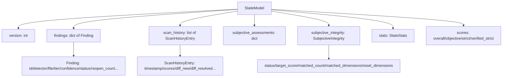
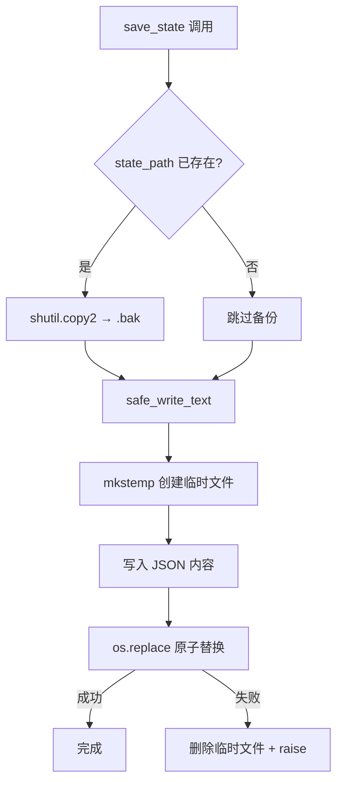
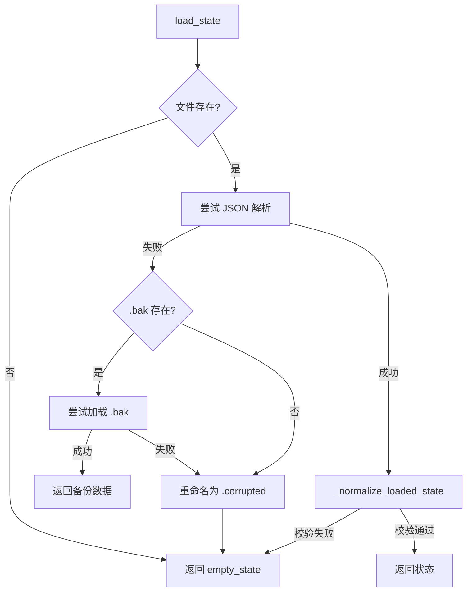

# PD-06.10 desloppify — JSON 文件增量状态持久化与反作弊完整性校验

> 文档编号：PD-06.10
> 来源：desloppify `engine/_state/persistence.py`, `engine/_state/schema.py`, `engine/_state/merge.py`
> GitHub：https://github.com/peteromallet/desloppify.git
> 问题域：PD-06 记忆持久化 Memory Persistence
> 状态：可复用方案

---

## 第 1 章 问题与动机

### 1.1 核心问题

代码质量扫描工具需要跨会话保持扫描状态：每次扫描发现的 findings（代码问题）、历史分数趋势、主观评估结果都必须持久化，否则每次扫描都是"从零开始"，无法实现渐进式代码质量改善。

核心挑战：
- **增量扫描**：新扫描结果需要与历史 findings 合并，而非覆盖
- **状态一致性**：findings 的 status 流转（open → fixed → auto_resolved → reopened）必须正确追踪
- **数据完整性**：写入中断不能导致状态文件损坏
- **反作弊**：主观评估分数不能被人为操纵到目标值附近（anti-gaming）
- **版本兼容**：工具升级后旧状态文件仍可加载

### 1.2 desloppify 的解法概述

1. **单 JSON 文件持久化**：所有状态存储在 `.desloppify/state.json`，结构由 `StateModel` TypedDict 定义（`engine/_state/schema.py:145`）
2. **原子写入 + 自动备份**：写入前先 `shutil.copy2` 创建 `.bak`，再通过 `tempfile.mkstemp` + `os.replace` 原子替换（`core/file_paths.py:93-105`）
3. **三层合并管道**：`merge_scan()` 将新扫描结果与历史状态合并，包含 upsert → auto_resolve → recompute_stats 三阶段（`engine/_state/merge.py:108-217`）
4. **反作弊完整性校验**：`SubjectiveIntegrity` 检测主观评分是否聚集在目标分附近，超过阈值则重置为 0 分（`engine/_state/scoring.py:88-121`）
5. **防御性加载**：加载时自动修复缺失字段、校验不变量、损坏时回退到备份或空状态（`engine/_state/persistence.py:49-108`）

### 1.3 设计思想

| 设计原则 | 具体实现 | 理由 | 替代方案 |
|----------|----------|------|----------|
| 单文件简单性 | 所有状态存一个 JSON 文件 | CLI 工具无需数据库依赖，git 可追踪 | SQLite / 多文件分片 |
| 原子写入 | temp + os.replace 模式 | 防止写入中断导致半损坏文件 | 直接 write（不安全） |
| 防御性反序列化 | ensure_state_defaults + validate_state_invariants | 旧版本/手动编辑的状态文件仍可加载 | 严格拒绝不合规数据 |
| 增量合并而非覆盖 | upsert_findings 保留历史 first_seen/reopen_count | 支持 finding 生命周期追踪 | 每次全量替换 |
| 反作弊机制 | SubjectiveIntegrity 目标分聚集检测 | 防止用户将主观评分全部设为目标值来"刷分" | 信任用户输入 |
| 备份恢复链 | .bak → .corrupted → empty_state 三级降级 | 最大化数据恢复概率 | 单一失败策略 |

---

## 第 2 章 源码实现分析

### 2.1 架构概览

desloppify 的状态持久化系统由 6 个模块组成，职责清晰分离：

```
┌─────────────────────────────────────────────────────────────┐
│                     merge_scan() 入口                        │
│                  engine/_state/merge.py                       │
├──────────┬──────────────┬───────────────┬───────────────────┤
│ merge_   │ merge_       │ scoring.py    │ schema.py         │
│ findings │ history.py   │ 统计重算 +    │ TypedDict 定义 +  │
│ .py      │ 扫描历史追加 │ 反作弊校验    │ 校验 + 默认值     │
│ upsert + │              │               │                   │
│ resolve  │              │               │                   │
├──────────┴──────────────┴───────────────┴───────────────────┤
│              persistence.py — load_state / save_state         │
│              core/file_paths.py — safe_write_text 原子写入    │
└─────────────────────────────────────────────────────────────┘
```

数据流：

```
扫描器输出 findings[]
        │
        ▼
  merge_scan(state, findings, options)
        │
        ├─→ _record_scan_metadata()     记录时间戳/scan_count/tool_hash
        ├─→ _merge_scan_inputs()        合并 potentials/codebase_metrics
        ├─→ upsert_findings()           新增/更新/重开 findings
        ├─→ auto_resolve_disappeared()  自动解决消失的 findings
        ├─→ _mark_stale_on_mechanical_change()  标记受影响的主观评估
        ├─→ _recompute_stats()          重算统计 + 健康分数
        ├─→ _append_scan_history()      追加历史快照（保留最近 20 条）
        └─→ validate_state_invariants() 最终校验
        │
        ▼
  save_state(state)
        │
        ├─→ ensure_state_defaults()     补全缺失字段
        ├─→ _recompute_stats()          再次重算确保一致
        ├─→ validate_state_invariants() 校验
        ├─→ shutil.copy2 → .bak         备份当前文件
        └─→ safe_write_text()           原子写入新文件
```

### 2.2 核心实现

#### 2.2.1 状态模型定义



对应源码 `engine/_state/schema.py:145-161`：

```python
class StateModel(TypedDict, total=False):
    version: Required[int]
    created: Required[str]
    last_scan: Required[str | None]
    scan_count: Required[int]
    overall_score: Required[float]
    objective_score: Required[float]
    strict_score: Required[float]
    verified_strict_score: Required[float]
    stats: Required[StateStats]
    findings: Required[dict[str, Finding]]
    scan_coverage: dict[str, ScanCoverageRecord]
    score_confidence: dict[str, Any]
    scan_history: list[ScanHistoryEntry]
    subjective_integrity: Required[SubjectiveIntegrity]
    subjective_assessments: Required[dict[str, SubjectiveAssessment]]
    concern_dismissals: dict[str, ConcernDismissal]
```

`Finding` 是核心数据结构（`schema.py:45-66`），每个 finding 有完整的生命周期字段：`first_seen`、`last_seen`、`resolved_at`、`reopen_count`、`status`（5 种状态）、`suppressed`（忽略标记）、`resolution_attestation`（解决证明）。

#### 2.2.2 原子写入与备份恢复



对应源码 `engine/_state/persistence.py:131-169` 和 `core/file_paths.py:93-105`：

```python
def save_state(
    state: StateModel,
    path: Path | None = None,
    *,
    subjective_integrity_target: float | None = None,
) -> None:
    """Recompute stats/score and save to disk atomically."""
    ensure_state_defaults(state)
    _recompute_stats(
        state,
        scan_path=state.get("scan_path"),
        subjective_integrity_target=_resolve_integrity_target(
            state, subjective_integrity_target,
        ),
    )
    validate_state_invariants(state)

    state_path = path or STATE_FILE
    state_path.parent.mkdir(parents=True, exist_ok=True)
    content = json.dumps(state, indent=2, default=json_default) + "\n"

    if state_path.exists():
        backup = state_path.with_suffix(".json.bak")
        try:
            shutil.copy2(str(state_path), str(backup))
        except OSError as backup_ex:
            logger.debug("Failed to create state backup %s: %s",
                         state_path.with_suffix(".json.bak"), backup_ex)

    try:
        safe_write_text(state_path, content)
    except OSError as ex:
        print(f"  Warning: Could not save state: {ex}", file=sys.stderr)
        raise

def safe_write_text(filepath: str | Path, content: str) -> None:
    """Atomically write text to a file using temp+rename."""
    p = Path(filepath)
    p.parent.mkdir(parents=True, exist_ok=True)
    fd, tmp = tempfile.mkstemp(dir=p.parent, suffix=".tmp")
    try:
        with os.fdopen(fd, "w") as f:
            f.write(content)
        os.replace(tmp, str(p))
    except OSError:
        if os.path.exists(tmp):
            os.unlink(tmp)
        raise
```

#### 2.2.3 防御性加载与三级降级



对应源码 `engine/_state/persistence.py:49-108`：

```python
def load_state(path: Path | None = None) -> StateModel:
    """Load state from disk, or return empty state on missing/corruption."""
    state_path = path or STATE_FILE
    if not state_path.exists():
        return empty_state()

    try:
        data = _load_json(state_path)
    except (json.JSONDecodeError, UnicodeDecodeError, OSError, ValueError) as ex:
        backup = state_path.with_suffix(".json.bak")
        if backup.exists():
            try:
                backup_data = _load_json(backup)
                print(f"  ⚠ State file corrupted ({ex}), loaded from backup.",
                      file=sys.stderr)
                return _normalize_loaded_state(backup_data)
            except (json.JSONDecodeError, UnicodeDecodeError, OSError,
                    ValueError, TypeError, AttributeError) as backup_ex:
                logger.debug("Backup state load failed from %s: %s", backup, backup_ex)
        print(f"  ⚠ State file corrupted ({ex}). Starting fresh.", file=sys.stderr)
        rename_failed = False
        try:
            state_path.rename(state_path.with_suffix(".json.corrupted"))
        except OSError as rename_ex:
            rename_failed = True
            logger.debug("Failed to rename corrupted state file %s: %s",
                         state_path, rename_ex)
        return empty_state()
```

### 2.3 实现细节

#### Finding 生命周期状态机

```
                  ┌──────────────────────────────────┐
                  │                                  │
                  ▼                                  │
  [新发现] ──→ open ──→ auto_resolved ──→ (重新出现) ─┘
                │              ▲                reopen_count++
                │              │
                ├──→ fixed ────┘ (重新出现时也 reopen)
                ├──→ wontfix ──┘ (消失时也 auto_resolve)
                └──→ false_positive
```

关键细节：
- **suspect detector 保护**（`merge_findings.py:9-46`）：如果某个 detector 之前有 ≥3 个 open findings 但本次扫描 0 个结果，判定为"该 detector 可能没运行"，不自动 resolve 其 findings
- **reopen_count 追踪**（`merge_findings.py:191`）：finding 被 resolve 后又出现，reopen_count 递增，≥2 次标记为 chronic_reopener
- **resolution_attestation**（`merge_findings.py:100-105`）：auto_resolve 时记录证明（scan_verified），区分"扫描确认消失"和"人工标记"
- **主观评估联动**（`merge.py:55-89`）：机械 detector 的 findings 变化时，自动标记关联的主观评估维度为 stale（需要重新评审）
- **扫描历史窗口**（`merge_history.py:130-131`）：`scan_history` 保留最近 20 条，防止无限增长
- **suppression 机制**（`filtering.py:82-128`）：支持 glob/ID 前缀/文件路径三种忽略模式，被忽略的 findings 不计入统计

#### 反作弊完整性校验

`_apply_subjective_integrity_policy`（`scoring.py:88-121`）检测主观评分是否聚集在目标分附近。如果 ≥2 个维度的分数落在目标分的容差范围内，所有匹配维度的分数被重置为 0，状态标记为 `penalized`。这防止用户将所有主观维度都设为目标分来"刷"总分。


---

## 第 3 章 迁移指南

### 3.1 迁移清单

**阶段 1：基础持久化**
- [ ] 定义状态 Schema（TypedDict 或 Pydantic BaseModel）
- [ ] 实现 `safe_write_text` 原子写入（tempfile + os.replace）
- [ ] 实现 `load_state` / `save_state` 基础读写
- [ ] 添加 `ensure_state_defaults` 防御性字段补全

**阶段 2：增量合并**
- [ ] 实现 finding upsert 逻辑（新增/更新/重开）
- [ ] 实现 auto_resolve 消失检测
- [ ] 添加 suspect detector 保护（防止误 resolve）
- [ ] 实现 scan_history 追加与窗口限制

**阶段 3：完整性保障**
- [ ] 添加 `.bak` 自动备份
- [ ] 实现三级降级加载（主文件 → 备份 → 空状态）
- [ ] 添加 `validate_state_invariants` 不变量校验
- [ ] 实现 suppression/ignore 模式匹配

**阶段 4：反作弊（可选）**
- [ ] 实现 SubjectiveIntegrity 目标分聚集检测
- [ ] 添加 penalty 重置逻辑

### 3.2 适配代码模板

以下是一个可直接复用的最小化状态持久化模块：

```python
"""Minimal state persistence with atomic write and backup recovery."""
from __future__ import annotations

import json
import os
import shutil
import tempfile
from dataclasses import dataclass, field, asdict
from pathlib import Path
from typing import Any


@dataclass
class Finding:
    id: str
    detector: str
    file: str
    status: str = "open"  # open | fixed | auto_resolved | wontfix
    first_seen: str = ""
    last_seen: str = ""
    resolved_at: str | None = None
    reopen_count: int = 0
    detail: dict[str, Any] = field(default_factory=dict)


@dataclass
class AppState:
    version: int = 1
    created: str = ""
    last_scan: str | None = None
    scan_count: int = 0
    findings: dict[str, Finding] = field(default_factory=dict)
    scan_history: list[dict] = field(default_factory=list)

    MAX_HISTORY = 20

    def to_dict(self) -> dict:
        d = asdict(self)
        d.pop("MAX_HISTORY", None)
        return d

    @classmethod
    def from_dict(cls, data: dict) -> "AppState":
        findings_raw = data.pop("findings", {})
        findings = {k: Finding(**v) for k, v in findings_raw.items()}
        return cls(findings=findings, **{
            k: v for k, v in data.items()
            if k in cls.__dataclass_fields__ and k != "findings"
        })


def safe_write_text(filepath: Path, content: str) -> None:
    """Atomic write: temp file + os.replace."""
    filepath.parent.mkdir(parents=True, exist_ok=True)
    fd, tmp = tempfile.mkstemp(dir=filepath.parent, suffix=".tmp")
    try:
        with os.fdopen(fd, "w") as f:
            f.write(content)
        os.replace(tmp, str(filepath))
    except OSError:
        if os.path.exists(tmp):
            os.unlink(tmp)
        raise


def save_state(state: AppState, path: Path) -> None:
    """Save with backup-before-write."""
    if path.exists():
        backup = path.with_suffix(".json.bak")
        try:
            shutil.copy2(str(path), str(backup))
        except OSError:
            pass
    content = json.dumps(state.to_dict(), indent=2) + "\n"
    safe_write_text(path, content)


def load_state(path: Path) -> AppState:
    """Load with three-level fallback: main → backup → empty."""
    if not path.exists():
        return AppState()
    try:
        data = json.loads(path.read_text())
        return AppState.from_dict(data)
    except (json.JSONDecodeError, OSError, ValueError):
        backup = path.with_suffix(".json.bak")
        if backup.exists():
            try:
                data = json.loads(backup.read_text())
                return AppState.from_dict(data)
            except Exception:
                pass
        # Preserve corrupted file for debugging
        try:
            path.rename(path.with_suffix(".json.corrupted"))
        except OSError:
            pass
        return AppState()


def upsert_finding(state: AppState, finding: Finding, now: str) -> bool:
    """Upsert a finding. Returns True if new."""
    if finding.id not in state.findings:
        finding.first_seen = now
        finding.last_seen = now
        state.findings[finding.id] = finding
        return True
    existing = state.findings[finding.id]
    existing.last_seen = now
    existing.detail = finding.detail
    if existing.status in ("fixed", "auto_resolved"):
        existing.status = "open"
        existing.resolved_at = None
        existing.reopen_count += 1
    return False


def auto_resolve_disappeared(
    state: AppState, current_ids: set[str], now: str
) -> int:
    """Auto-resolve findings absent from current scan."""
    resolved = 0
    for fid, finding in state.findings.items():
        if fid not in current_ids and finding.status == "open":
            finding.status = "auto_resolved"
            finding.resolved_at = now
            resolved += 1
    return resolved
```

### 3.3 适用场景

| 场景 | 适用度 | 说明 |
|------|--------|------|
| CLI 代码质量工具 | ⭐⭐⭐ | 完美匹配：单文件 JSON、增量扫描、无外部依赖 |
| 本地 Agent 状态持久化 | ⭐⭐⭐ | 适合单用户本地运行的 Agent，状态量不大 |
| CI/CD 流水线状态追踪 | ⭐⭐ | 可用但需注意并发写入（CI 通常串行） |
| 多用户 Web 服务 | ⭐ | 不适合：单文件无并发控制，需改用数据库 |
| 大规模数据（>100MB 状态） | ⭐ | JSON 全量读写性能差，需改用 SQLite 或分片 |

---

## 第 4 章 测试用例

```python
"""Tests for desloppify-style state persistence."""
import json
import os
import tempfile
from datetime import UTC, datetime
from pathlib import Path

import pytest


def utc_now() -> str:
    return datetime.now(UTC).isoformat(timespec="seconds")


# --- Fixtures ---

@pytest.fixture
def state_dir(tmp_path):
    return tmp_path / ".desloppify"


@pytest.fixture
def state_file(state_dir):
    state_dir.mkdir()
    return state_dir / "state.json"


def make_state(findings=None, scan_count=0):
    return {
        "version": 1,
        "created": utc_now(),
        "last_scan": None,
        "scan_count": scan_count,
        "overall_score": 0,
        "objective_score": 0,
        "strict_score": 0,
        "verified_strict_score": 0,
        "stats": {},
        "findings": findings or {},
        "scan_history": [],
        "subjective_integrity": {},
        "subjective_assessments": {},
    }


# --- Test: Atomic Write ---

class TestAtomicWrite:
    def test_safe_write_creates_file(self, state_file):
        from desloppify_test_helpers import safe_write_text  # use template above
        safe_write_text(state_file, '{"version": 1}\n')
        assert state_file.exists()
        assert json.loads(state_file.read_text())["version"] == 1

    def test_no_partial_write_on_failure(self, tmp_path):
        """Simulates write failure — temp file should be cleaned up."""
        target = tmp_path / "readonly" / "state.json"
        # Don't create parent → mkstemp will fail
        with pytest.raises(OSError):
            fd, tmp = tempfile.mkstemp(dir=tmp_path / "nonexistent", suffix=".tmp")


# --- Test: Load with Fallback ---

class TestLoadFallback:
    def test_missing_file_returns_empty(self, state_file):
        """Non-existent file returns fresh empty state."""
        assert not state_file.exists()
        # Simulating load_state behavior
        state = make_state()
        assert state["findings"] == {}
        assert state["scan_count"] == 0

    def test_corrupted_falls_back_to_backup(self, state_file):
        """Corrupted main file loads from .bak."""
        backup = state_file.with_suffix(".json.bak")
        good_state = make_state(scan_count=5)
        backup.write_text(json.dumps(good_state))
        state_file.write_text("NOT VALID JSON{{{")

        # Simulate load_state fallback
        try:
            data = json.loads(state_file.read_text())
        except json.JSONDecodeError:
            data = json.loads(backup.read_text())
        assert data["scan_count"] == 5

    def test_both_corrupted_returns_empty(self, state_file):
        """Both main and backup corrupted → empty state."""
        backup = state_file.with_suffix(".json.bak")
        state_file.write_text("CORRUPT")
        backup.write_text("ALSO CORRUPT")
        try:
            json.loads(state_file.read_text())
            pytest.fail("Should have raised")
        except json.JSONDecodeError:
            try:
                json.loads(backup.read_text())
                pytest.fail("Should have raised")
            except json.JSONDecodeError:
                state = make_state()
        assert state["findings"] == {}


# --- Test: Finding Upsert & Lifecycle ---

class TestFindingLifecycle:
    def test_new_finding_inserted(self):
        state = make_state()
        now = utc_now()
        finding = {
            "id": "smells::app.py::long_method",
            "detector": "smells",
            "file": "app.py",
            "tier": 2,
            "confidence": "high",
            "summary": "Method too long",
            "detail": {},
            "status": "open",
            "first_seen": now,
            "last_seen": now,
            "resolved_at": None,
            "reopen_count": 0,
        }
        state["findings"][finding["id"]] = finding
        assert len(state["findings"]) == 1

    def test_reopen_increments_count(self):
        now = utc_now()
        finding = {
            "id": "test::f.py::x",
            "status": "auto_resolved",
            "reopen_count": 0,
            "detector": "test",
        }
        # Simulate reopen
        finding["status"] = "open"
        finding["reopen_count"] += 1
        finding["resolved_at"] = None
        assert finding["reopen_count"] == 1
        assert finding["status"] == "open"

    def test_auto_resolve_disappeared(self):
        now = utc_now()
        findings = {
            "a": {"id": "a", "status": "open", "file": "x.py", "detector": "d"},
            "b": {"id": "b", "status": "open", "file": "y.py", "detector": "d"},
        }
        current_ids = {"a"}  # b disappeared
        resolved = 0
        for fid, f in findings.items():
            if fid not in current_ids and f["status"] == "open":
                f["status"] = "auto_resolved"
                f["resolved_at"] = now
                resolved += 1
        assert resolved == 1
        assert findings["b"]["status"] == "auto_resolved"
        assert findings["a"]["status"] == "open"


# --- Test: Scan History Window ---

class TestScanHistory:
    def test_history_capped_at_20(self):
        state = make_state()
        state["scan_history"] = [{"timestamp": f"t{i}"} for i in range(25)]
        if len(state["scan_history"]) > 20:
            state["scan_history"] = state["scan_history"][-20:]
        assert len(state["scan_history"]) == 20
        assert state["scan_history"][0]["timestamp"] == "t5"


# --- Test: Ensure Defaults ---

class TestEnsureDefaults:
    def test_missing_fields_filled(self):
        partial = {"version": 1, "created": utc_now()}
        empty = make_state()
        for key, value in empty.items():
            partial.setdefault(key, value)
        assert "findings" in partial
        assert "stats" in partial
        assert isinstance(partial["findings"], dict)
```


---

## 第 5 章 跨域关联

| 关联域 | 关系类型 | 说明 |
|--------|----------|------|
| PD-07 质量检查 | 强协同 | 状态持久化是质量评分的基础设施：`_recompute_stats` 在每次 save 时重算分数，`SubjectiveIntegrity` 反作弊直接影响质量评估结果 |
| PD-01 上下文管理 | 协同 | `scan_history` 保留最近 20 条记录的窗口策略类似上下文窗口管理，防止状态无限膨胀 |
| PD-03 容错与重试 | 协同 | 三级降级加载（主文件 → .bak → empty_state）是容错策略的具体实现；`suspect_detector` 保护防止误 resolve 也是容错思维 |
| PD-10 中间件管道 | 依赖 | `merge_scan` 本身就是一个管道：upsert → resolve → stale_mark → recompute → history_append，每步可独立测试 |
| PD-11 可观测性 | 协同 | `scan_history` 记录每次扫描的 diff_new/diff_resolved/suppressed_pct，是可观测性数据的持久化载体 |

---

## 第 6 章 来源文件索引

| 文件 | 行范围 | 关键实现 |
|------|--------|----------|
| `desloppify/engine/_state/schema.py` | L45-L66 | `Finding` TypedDict 定义，含 17 个字段的完整生命周期模型 |
| `desloppify/engine/_state/schema.py` | L145-L161 | `StateModel` 顶层状态结构定义 |
| `desloppify/engine/_state/schema.py` | L191-L208 | `empty_state()` 空状态工厂函数 |
| `desloppify/engine/_state/schema.py` | L219-L278 | `ensure_state_defaults()` 防御性字段补全 |
| `desloppify/engine/_state/schema.py` | L281-L307 | `validate_state_invariants()` 不变量校验 |
| `desloppify/engine/_state/persistence.py` | L49-L108 | `load_state()` 三级降级加载 |
| `desloppify/engine/_state/persistence.py` | L131-L169 | `save_state()` 原子写入 + 备份 |
| `desloppify/core/file_paths.py` | L93-L105 | `safe_write_text()` tempfile + os.replace 原子写入 |
| `desloppify/engine/_state/merge.py` | L108-L217 | `merge_scan()` 三阶段合并入口 |
| `desloppify/engine/_state/merge.py` | L55-L89 | `_mark_stale_on_mechanical_change()` 主观评估联动标记 |
| `desloppify/engine/_state/merge_findings.py` | L117-L204 | `upsert_findings()` 新增/更新/重开逻辑 |
| `desloppify/engine/_state/merge_findings.py` | L49-L114 | `auto_resolve_disappeared()` 消失 finding 自动解决 |
| `desloppify/engine/_state/merge_findings.py` | L9-L46 | `find_suspect_detectors()` 可疑 detector 检测 |
| `desloppify/engine/_state/merge_history.py` | L87-L131 | `_append_scan_history()` 历史追加 + 20 条窗口 |
| `desloppify/engine/_state/scoring.py` | L88-L121 | `_apply_subjective_integrity_policy()` 反作弊惩罚 |
| `desloppify/engine/_state/scoring.py` | L390-L411 | `_recompute_stats()` 统计重算入口 |
| `desloppify/engine/_state/filtering.py` | L82-L106 | `matched_ignore_pattern()` 三模式忽略匹配 |
| `desloppify/engine/_state/filtering.py` | L141-L169 | `make_finding()` 标准化 finding 工厂 |

---

## 第 7 章 横向对比维度

```json comparison_data
{
  "project": "desloppify",
  "dimensions": {
    "记忆结构": "单 JSON 文件 StateModel，findings dict + scan_history list + subjective_assessments dict",
    "更新机制": "三阶段合并管道：upsert → auto_resolve → recompute_stats，支持 reopen 追踪",
    "事实提取": "机械 detector 自动产出 findings，主观评估由人工 review 注入",
    "存储方式": "单 JSON 文件 .desloppify/state.json，无外部数据库依赖",
    "注入方式": "merge_scan() 将新扫描结果合并到内存 state，save_state() 持久化",
    "生命周期管理": "5 态状态机 open→fixed/auto_resolved/wontfix/false_positive，支持 reopen",
    "Schema 迁移": "version 字段 + ensure_state_defaults 防御性补全，向前兼容",
    "记忆增长控制": "scan_history 保留最近 20 条窗口，suppressed findings 不计入统计",
    "并发安全": "单进程 CLI 无并发，原子写入防中断但不防并发",
    "版本控制": "state.json 可 git 追踪，tool_hash 检测工具代码变更",
    "碰撞检测": "suspect_detector 检测 detector 未运行，防止误 auto_resolve",
    "记忆检索": "dict key 直接查找 finding_id，path_scoped_findings 按路径过滤",
    "敏感信息过滤": "suppression 机制通过 ignore pattern 过滤不需要的 findings",
    "冲突解决": "upsert 语义：已存在则更新 last_seen/detail，已 resolve 则 reopen",
    "自动重试": "load_state 三级降级：主文件 → .bak → empty_state，不重试写入"
  }
}
```

### 域元数据补充

```json domain_metadata
{
  "solution_summary": "desloppify 用单 JSON 文件 + tempfile 原子写入 + 三阶段 merge 管道实现跨会话增量扫描状态持久化，含 SubjectiveIntegrity 反作弊惩罚机制",
  "description": "CLI 工具场景下无数据库依赖的轻量级状态持久化与增量合并",
  "sub_problems": [
    "suspect detector 误判：如何区分 detector 未运行和 findings 真正消失",
    "主观评估联动失效：机械 findings 变化时如何精确标记受影响的主观维度",
    "chronic reopener 处理：反复 reopen 的 finding 如何升级处理策略",
    "suppression 与统计一致性：被忽略的 findings 在统计和分数计算中的排除时机"
  ],
  "best_practices": [
    "备份在写入前而非写入后：shutil.copy2 在 safe_write_text 之前执行，确保备份始终是上一次成功状态",
    "校验在序列化两端：load 时 ensure_defaults + validate，save 时也 ensure_defaults + validate，双重保障",
    "suspect detector 保护：≥3 个 open findings 的 detector 本次 0 结果时不自动 resolve，防止 detector 未运行导致误判"
  ]
}
```
