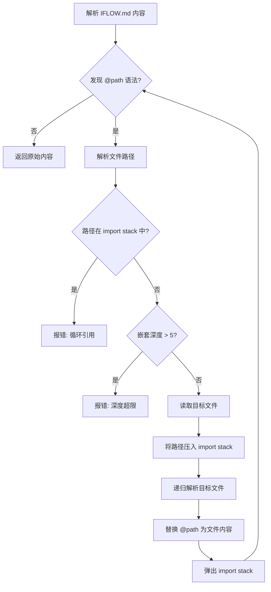

# PD-06.18 iflow-cli — 三层 IFLOW.md 记忆系统与影子 Git 检查点持久化

> 文档编号：PD-06.18
> 来源：iflow-cli `docs_en/configuration/iflow.md` `docs_en/features/checkpointing.md` `docs_en/features/memory-import.md`
> GitHub：https://github.com/iflow-ai/iflow-cli.git
> 问题域：PD-06 记忆持久化 Memory Persistence
> 状态：可复用方案

---

## 第 1 章 问题与动机（≥ 30 行）

### 1.1 核心问题

CLI 类 AI Agent 面临一个根本矛盾：**会话是短暂的，但项目知识是长期的**。每次启动新会话，Agent 都会"失忆"——不知道项目的技术栈、编码规范、架构约定。用户不得不反复解释相同的上下文，严重影响效率。

更深层的问题是：Agent 在执行文件修改时缺乏安全网。一旦 AI 工具执行了错误的代码修改，用户很难回退到修改前的状态，尤其是当修改涉及多个文件时。

iFlow CLI 通过两个互补的持久化子系统解决这两个问题：
1. **IFLOW.md 三层记忆系统** — 解决"知识持久化"问题
2. **Checkpoint 影子 Git 快照系统** — 解决"状态持久化"问题

### 1.2 iflow-cli 的解法概述

1. **三层 Markdown 记忆**：全局 `~/.iflow/IFLOW.md` → 项目根 `IFLOW.md` → 子目录 `src/IFLOW.md`，按优先级合并注入 system prompt（`docs_en/configuration/iflow.md:17-46`）
2. **@file.md 模块化导入**：IFLOW.md 内通过 `@./path/to/file.md` 语法导入外部 Markdown，支持嵌套最深 5 层，内置循环引用检测（`docs_en/features/memory-import.md:30-36`）
3. **save_memory 持久化**：对话中发现的重要信息通过 `save_memory` 功能写入全局 `~/.iflow/IFLOW.md`，实现跨会话记忆沉淀（`docs_en/configuration/iflow.md:13`）
4. **影子 Git 检查点**：在 `~/.iflow/snapshots/<project_hash>` 创建独立 Git 仓库，AI 工具执行前自动快照项目文件 + 对话历史 + 工具调用信息（`docs_en/features/checkpointing.md:40-61`）
5. **`/chat save` 会话检查点**：手动保存对话状态到 `~/.iflow/cache/<project_hash>/checkpoints`，支持命名和恢复（`docs_en/features/slash-commands.md:62`）

### 1.3 设计思想

| 设计原则 | 具体实现 | 理由 | 替代方案 |
|----------|----------|------|----------|
| 文件系统即数据库 | Markdown 文件作为记忆载体 | 人类可读可编辑，Git 友好 | SQLite/向量库 |
| 分层覆盖 | 全局→项目→子目录三级优先级 | 通用偏好不重复，局部规则可覆盖 | 单文件配置 |
| 模块化组合 | @import 语法拆分大文件 | 团队协作时各模块独立维护 | 单体 Markdown |
| 影子仓库隔离 | 检查点用独立 Git 仓库 | 不污染项目原有 Git 历史 | 项目内 stash/branch |
| 默认关闭检查点 | `checkpointing.enabled: false` | 避免磁盘开销，按需启用 | 默认开启 |

---

## 第 2 章 源码实现分析（≥ 60 行，核心章节）

### 2.1 架构概览

iFlow CLI 的记忆持久化由两个独立子系统组成，分别处理"知识"和"状态"：

```
┌─────────────────────────────────────────────────────────┐
│                    iFlow CLI Runtime                     │
│                                                         │
│  ┌──────────────────────┐  ┌─────────────────────────┐  │
│  │  IFLOW.md 记忆系统    │  │  Checkpoint 快照系统     │  │
│  │                      │  │                         │  │
│  │  ~/.iflow/IFLOW.md   │  │  ~/.iflow/snapshots/    │  │
│  │       ↓ 合并          │  │    <project_hash>/      │  │
│  │  project/IFLOW.md    │  │    (shadow git repo)    │  │
│  │       ↓ 合并          │  │                         │  │
│  │  project/src/IFLOW.md│  │  ~/.iflow/cache/        │  │
│  │       ↓              │  │    <project_hash>/      │  │
│  │  @import 递归展开     │  │    checkpoints/         │  │
│  │       ↓              │  │    (conversation JSON)  │  │
│  │  System Prompt 注入   │  │                         │  │
│  └──────────────────────┘  └─────────────────────────┘  │
│           ↓                          ↓                   │
│     每次对话自动加载            工具执行前自动创建          │
└─────────────────────────────────────────────────────────┘
```

### 2.2 核心实现

#### 2.2.1 三层记忆加载与合并

```mermaid
graph TD
    A[iFlow CLI 启动] --> B[扫描 ~/.iflow/IFLOW.md]
    B --> C[向上搜索到项目根/.git]
    C --> D[收集路径上所有 IFLOW.md]
    D --> E[向下扫描子目录 IFLOW.md]
    E --> F{memoryDiscoveryMaxDirs}
    F -->|≤200 dirs| G[收集子目录 IFLOW.md]
    F -->|>200 dirs| H[停止扫描]
    G --> I[按优先级排序: 子目录 > 项目 > 全局]
    H --> I
    I --> J[逐文件解析 @import]
    J --> K[合并为最终 System Prompt]
    K --> L[注入 AI 模型上下文]

对应源码描述 `docs_en/configuration/iflow.md:628-638`：

```markdown
# 分层加载与优先级（iFlow 文档原文摘录）
Hierarchical Loading and Priority: The CLI implements a sophisticated
layered memory system by loading context files (like IFLOW.md) from
multiple locations. Content from files lower in this list (more specific)
typically overrides or supplements content from files higher up (more
general). The exact concatenation order and final context can be
inspected using the `/memory show` command. The typical loading order is:
1. Global Context Files: ~/.iflow/<contextFileName>
2. Project Root and Ancestor Context Files: CWD → parent → ... → .git root
3. Subdirectory Context Files: CWD → child dirs (max 200 dirs)
```

关键配置项 `docs_en/configuration/settings.md:249-253`：

```json
{
  "contextFileName": ["IFLOW.md", "AGENTS.md", "CONTEXT.md"]
}
```

`contextFileName` 支持字符串或字符串数组，允许同时加载多种命名的上下文文件。这意味着团队可以用 `IFLOW.md` 存项目记忆，用 `AGENTS.md` 存 Agent 行为指令，互不干扰。

#### 2.2.2 @import 模块化导入与循环检测



对应源码描述 `docs_en/features/memory-import.md:137-159`：

```markdown
# 安全限制（iFlow 文档原文摘录）
| Security Item | Restriction          | Purpose                      |
|---------------|----------------------|------------------------------|
| Path validation | Only authorized dirs | Prevent access to sensitive  |
| Depth limit   | Maximum 5 levels     | Prevent infinite recursion   |
| File types    | Only text files      | Avoid binary file issues     |
| Permission check | Verify read perms | Ensure file accessibility    |

# 循环检测机制
- Maintains import path stack
- Checks if each new import already exists in the path
- Immediately aborts and reports error when circular reference is found
```

这是一个经典的**栈式循环检测**实现：维护一个 import 路径栈，每次导入前检查目标路径是否已在栈中。时间复杂度 O(n)，空间复杂度 O(depth)，最大深度 5 层。

#### 2.2.3 Checkpoint 影子 Git 仓库

```mermaid
graph TD
    A[AI 请求工具调用] --> B[用户确认执行]
    B --> C[创建 Checkpoint]
    C --> D[在 ~/.iflow/snapshots/project_hash 初始化影子 Git]
    D --> E[git add + commit 项目文件快照]
    E --> F[保存对话历史 JSON 到 cache/checkpoints]
    F --> G[保存工具调用详情到 cache/checkpoints]
    G --> H[执行实际工具操作]
    H --> I{用户满意?}
    I -->|是| J[继续工作]
    I -->|否| K[/restore checkpoint_name]
    K --> L[从影子 Git checkout 恢复文件]
    L --> M[从 JSON 恢复对话状态]
```

对应源码描述 `docs_en/features/checkpointing.md:30-61`：

```markdown
# 检查点创建流程（iFlow 文档原文摘录）
Tool Call → Permission Confirmation → State Snapshot → Tool Execution → Checkpoint Complete

# 快照内容组成
## 1. Git State Snapshot
- Creates shadow Git repository at ~/.iflow/snapshots/<project_hash>
- Captures complete state of project files
- Does not interfere with project's original Git repository

## 2. Conversation History
- Saves complete conversation records with AI assistant
- Includes context and interaction state

## 3. Tool Call Information
- Stores specific tool calls to be executed
- Records parameters and execution context

# 数据存储位置
| Data Type          | Storage Path                                    |
|--------------------|-------------------------------------------------|
| Git Snapshot       | ~/.iflow/snapshots/<project_hash>               |
| Conversation History | ~/.iflow/cache/<project_hash>/checkpoints     |
| Tool Calls         | ~/.iflow/cache/<project_hash>/checkpoints       |
```

### 2.3 实现细节

**project_hash 生成**：iFlow 使用项目根路径生成唯一哈希作为命名空间隔离键。同一台机器上的不同项目各自拥有独立的 snapshot 和 cache 目录，互不干扰（`docs_en/configuration/settings.md:528-529`）。

**记忆管理命令体系**：

| 命令 | 功能 | 持久化行为 |
|------|------|-----------|
| `/memory show` | 显示当前合并后的完整记忆 | 只读 |
| `/memory add <text>` | 手动添加记忆条目 | 写入 IFLOW.md |
| `/memory refresh` | 强制重新扫描加载所有 IFLOW.md | 重新加载 |
| `/chat save <name>` | 保存当前对话为命名检查点 | 写入 cache/checkpoints |
| `/restore` | 交互式选择并恢复检查点 | 从 snapshot 恢复 |
| `/compress` | AI 压缩对话历史为摘要 | 替换当前上下文 |
| `/init` | 扫描项目生成 IFLOW.md | 创建/更新 IFLOW.md |

**save_memory 持久化路径**：当 AI 在对话中识别到值得记住的信息时，通过 `save_memory` 功能将其追加到 `~/.iflow/IFLOW.md`（全局级别），确保跨项目、跨会话可用（`docs_en/configuration/iflow.md:420-437`）。

**自动压缩触发**：当对话 token 数达到 `compressionTokenThreshold`（默认 0.8 × `tokensLimit`）时，自动触发 `/compress` 压缩对话历史为摘要，防止上下文溢出（`docs_en/configuration/settings.md:453-459`）。

---

## 第 3 章 迁移指南（≥ 40 行）

### 3.1 迁移清单

#### 阶段一：三层 Markdown 记忆系统

1. **定义上下文文件名**：选择记忆文件名（如 `MEMORY.md`、`AGENTS.md`），支持数组配置
2. **实现分层扫描器**：从 CWD 向上搜索到 `.git` 根目录，收集所有同名文件
3. **实现子目录扫描**：从 CWD 向下扫描子目录（设置 maxDirs 上限防止性能问题）
4. **实现优先级合并**：子目录 > 项目 > 全局，高优先级内容覆盖低优先级
5. **注入 System Prompt**：将合并后的内容拼接到 AI 模型的 system prompt 中

#### 阶段二：@import 模块化导入

6. **实现 @path 解析器**：正则匹配 `^@(.+\.md)$` 行，解析相对/绝对路径
7. **实现循环检测**：维护 import 路径栈，每次导入前检查是否已在栈中
8. **设置深度限制**：默认最大 5 层嵌套，可配置
9. **错误优雅降级**：文件不存在时跳过并记录警告，不中断整体加载

#### 阶段三：Checkpoint 影子 Git 快照

10. **生成 project_hash**：基于项目根路径生成唯一标识（SHA256 截断）
11. **创建影子 Git 仓库**：在 `~/.your-tool/snapshots/<hash>` 初始化 bare/normal Git repo
12. **实现自动快照**：在工具执行前 `git add -A && git commit`
13. **保存对话状态**：将 messages 数组序列化为 JSON 存入 checkpoints 目录
14. **实现恢复命令**：`git checkout` 恢复文件 + 反序列化 JSON 恢复对话

### 3.2 适配代码模板

```typescript
import * as fs from 'fs';
import * as path from 'path';
import * as crypto from 'crypto';

// ===== 三层记忆加载器 =====

interface MemoryConfig {
  contextFileName: string | string[];
  memoryDiscoveryMaxDirs: number;
}

function collectMemoryFiles(
  cwd: string,
  config: MemoryConfig
): { path: string; priority: number; content: string }[] {
  const fileNames = Array.isArray(config.contextFileName)
    ? config.contextFileName
    : [config.contextFileName];
  const results: { path: string; priority: number; content: string }[] = [];

  // 1. 全局级别 (priority: 0)
  const globalDir = path.join(require('os').homedir(), '.your-tool');
  for (const name of fileNames) {
    const globalFile = path.join(globalDir, name);
    if (fs.existsSync(globalFile)) {
      results.push({
        path: globalFile,
        priority: 0,
        content: fs.readFileSync(globalFile, 'utf-8'),
      });
    }
  }

  // 2. 项目级别：从 CWD 向上搜索到 .git 根 (priority: 1)
  let dir = cwd;
  while (dir !== path.dirname(dir)) {
    for (const name of fileNames) {
      const file = path.join(dir, name);
      if (fs.existsSync(file)) {
        results.push({
          path: file,
          priority: 1,
          content: fs.readFileSync(file, 'utf-8'),
        });
      }
    }
    if (fs.existsSync(path.join(dir, '.git'))) break;
    dir = path.dirname(dir);
  }

  // 3. 子目录级别 (priority: 2)
  let scannedDirs = 0;
  function scanSubdirs(baseDir: string) {
    if (scannedDirs >= config.memoryDiscoveryMaxDirs) return;
    const entries = fs.readdirSync(baseDir, { withFileTypes: true });
    for (const entry of entries) {
      if (!entry.isDirectory()) continue;
      if (['node_modules', '.git', 'dist', '.next'].includes(entry.name)) continue;
      scannedDirs++;
      const subDir = path.join(baseDir, entry.name);
      for (const name of fileNames) {
        const file = path.join(subDir, name);
        if (fs.existsSync(file)) {
          results.push({
            path: file,
            priority: 2,
            content: fs.readFileSync(file, 'utf-8'),
          });
        }
      }
      scanSubdirs(subDir);
    }
  }
  scanSubdirs(cwd);

  return results.sort((a, b) => a.priority - b.priority);
}

// ===== @import 解析器 =====

function resolveImports(
  content: string,
  basePath: string,
  stack: Set<string> = new Set(),
  depth: number = 0,
  maxDepth: number = 5
): string {
  if (depth > maxDepth) return content;
  const lines = content.split('\n');
  return lines
    .map((line) => {
      const match = line.match(/^@(.+\.md)\s*$/);
      if (!match) return line;
      const importPath = path.resolve(path.dirname(basePath), match[1]);
      if (stack.has(importPath)) {
        return `<!-- CIRCULAR IMPORT DETECTED: ${importPath} -->`;
      }
      if (!fs.existsSync(importPath)) {
        return `<!-- FILE NOT FOUND: ${importPath} -->`;
      }
      stack.add(importPath);
      const imported = fs.readFileSync(importPath, 'utf-8');
      const resolved = resolveImports(imported, importPath, stack, depth + 1, maxDepth);
      stack.delete(importPath);
      return resolved;
    })
    .join('\n');
}

// ===== Checkpoint 影子 Git =====

function getProjectHash(projectRoot: string): string {
  return crypto.createHash('sha256').update(projectRoot).digest('hex').slice(0, 16);
}

interface CheckpointData {
  timestamp: string;
  messages: unknown[];
  toolCalls: unknown[];
}

function createCheckpoint(
  projectRoot: string,
  messages: unknown[],
  toolCalls: unknown[]
): string {
  const hash = getProjectHash(projectRoot);
  const snapshotDir = path.join(require('os').homedir(), '.your-tool', 'snapshots', hash);
  const cacheDir = path.join(require('os').homedir(), '.your-tool', 'cache', hash, 'checkpoints');

  // 确保目录存在
  fs.mkdirSync(snapshotDir, { recursive: true });
  fs.mkdirSync(cacheDir, { recursive: true });

  const timestamp = new Date().toISOString().replace(/[:.]/g, '-');
  const checkpointName = `checkpoint_${timestamp}`;

  // 保存对话和工具调用状态
  const data: CheckpointData = { timestamp, messages, toolCalls };
  fs.writeFileSync(
    path.join(cacheDir, `${checkpointName}.json`),
    JSON.stringify(data, null, 2)
  );

  return checkpointName;
}
```

### 3.3 适用场景

| 场景 | 适用度 | 说明 |
|------|--------|------|
| CLI Agent 工具（类 Claude Code） | ⭐⭐⭐ | 完美匹配：Markdown 记忆 + 文件快照 |
| IDE 插件 Agent | ⭐⭐⭐ | 三层记忆可直接复用，检查点可对接 IDE undo |
| Web 端 Agent | ⭐⭐ | 记忆系统可用，检查点需改为服务端存储 |
| 多用户 SaaS Agent | ⭐ | 文件系统方案不适合，需改为数据库 |
| 嵌入式/移动端 Agent | ⭐ | 文件系统操作受限，需大幅适配 |

---

## 第 4 章 测试用例（≥ 20 行）

```python
import os
import json
import tempfile
import hashlib
import pytest
from pathlib import Path
from unittest.mock import patch


class TestThreeLayerMemory:
    """测试三层 IFLOW.md 记忆加载与合并"""

    def setup_method(self):
        self.tmpdir = tempfile.mkdtemp()
        self.global_dir = os.path.join(self.tmpdir, ".iflow")
        self.project_dir = os.path.join(self.tmpdir, "project")
        self.sub_dir = os.path.join(self.project_dir, "src")
        os.makedirs(self.global_dir)
        os.makedirs(self.sub_dir)
        # 模拟 .git 标记项目根
        os.makedirs(os.path.join(self.project_dir, ".git"))

    def test_priority_override(self):
        """子目录记忆应覆盖项目级和全局级"""
        Path(self.global_dir, "IFLOW.md").write_text("indent: 4 spaces")
        Path(self.project_dir, "IFLOW.md").write_text("indent: 2 spaces")
        Path(self.sub_dir, "IFLOW.md").write_text("indent: tabs")
        # 从 src/ 启动时，最终生效的应该是 tabs
        memories = collect_memory_files(self.sub_dir, {"contextFileName": "IFLOW.md", "memoryDiscoveryMaxDirs": 200})
        assert memories[-1]["content"] == "indent: tabs"
        assert memories[-1]["priority"] == 2  # 子目录最高优先级

    def test_multiple_context_file_names(self):
        """支持多文件名配置"""
        Path(self.project_dir, "IFLOW.md").write_text("project memory")
        Path(self.project_dir, "AGENTS.md").write_text("agent instructions")
        memories = collect_memory_files(
            self.project_dir,
            {"contextFileName": ["IFLOW.md", "AGENTS.md"], "memoryDiscoveryMaxDirs": 200}
        )
        contents = [m["content"] for m in memories]
        assert "project memory" in contents
        assert "agent instructions" in contents

    def test_max_dirs_limit(self):
        """子目录扫描应受 maxDirs 限制"""
        for i in range(300):
            d = os.path.join(self.project_dir, f"dir_{i}")
            os.makedirs(d)
            Path(d, "IFLOW.md").write_text(f"memory {i}")
        memories = collect_memory_files(
            self.project_dir,
            {"contextFileName": "IFLOW.md", "memoryDiscoveryMaxDirs": 50}
        )
        sub_memories = [m for m in memories if m["priority"] == 2]
        assert len(sub_memories) <= 50


class TestImportResolver:
    """测试 @import 模块化导入"""

    def setup_method(self):
        self.tmpdir = tempfile.mkdtemp()

    def test_basic_import(self):
        """基本文件导入"""
        Path(self.tmpdir, "main.md").write_text("# Main\n@./sub.md\nEnd")
        Path(self.tmpdir, "sub.md").write_text("Sub content")
        result = resolve_imports(
            Path(self.tmpdir, "main.md").read_text(),
            os.path.join(self.tmpdir, "main.md")
        )
        assert "Sub content" in result
        assert "@./sub.md" not in result

    def test_circular_import_detection(self):
        """循环引用应被检测并阻止"""
        Path(self.tmpdir, "a.md").write_text("@./b.md")
        Path(self.tmpdir, "b.md").write_text("@./a.md")
        result = resolve_imports(
            Path(self.tmpdir, "a.md").read_text(),
            os.path.join(self.tmpdir, "a.md")
        )
        assert "CIRCULAR IMPORT DETECTED" in result

    def test_depth_limit(self):
        """嵌套深度超过 5 层应停止递归"""
        for i in range(7):
            next_file = f"level{i+1}.md" if i < 6 else "end.md"
            Path(self.tmpdir, f"level{i}.md").write_text(f"@./{next_file}")
        Path(self.tmpdir, "end.md").write_text("deep end")
        result = resolve_imports(
            Path(self.tmpdir, "level0.md").read_text(),
            os.path.join(self.tmpdir, "level0.md"),
            max_depth=5
        )
        # 第 6 层不应被展开
        assert "deep end" not in result

    def test_missing_file_graceful(self):
        """缺失文件应优雅降级"""
        content = "@./nonexistent.md"
        result = resolve_imports(content, os.path.join(self.tmpdir, "main.md"))
        assert "FILE NOT FOUND" in result


class TestCheckpoint:
    """测试影子 Git 检查点"""

    def test_project_hash_uniqueness(self):
        """不同项目路径应生成不同哈希"""
        hash1 = hashlib.sha256("/home/user/project-a".encode()).hexdigest()[:16]
        hash2 = hashlib.sha256("/home/user/project-b".encode()).hexdigest()[:16]
        assert hash1 != hash2

    def test_checkpoint_data_serialization(self):
        """检查点数据应正确序列化"""
        data = {
            "timestamp": "2024-01-15T10-30-00",
            "messages": [{"role": "user", "content": "hello"}],
            "toolCalls": [{"tool": "write_file", "args": {"path": "test.py"}}]
        }
        serialized = json.dumps(data)
        deserialized = json.loads(serialized)
        assert deserialized["messages"][0]["content"] == "hello"
        assert deserialized["toolCalls"][0]["tool"] == "write_file"

    def test_checkpoint_naming(self):
        """检查点命名应包含时间戳"""
        import re
        name = f"checkpoint_2024-01-15T10-30-00-000Z"
        assert re.match(r"checkpoint_\d{4}-\d{2}-\d{2}T", name)
```

---

## 第 5 章 跨域关联

| 关联域 | 关系类型 | 说明 |
|--------|----------|------|
| PD-01 上下文管理 | 强依赖 | IFLOW.md 记忆注入占用 system prompt token 预算；`/compress` 和 `compressionTokenThreshold` 直接关联上下文窗口管理 |
| PD-04 工具系统 | 协同 | Checkpoint 在工具执行前触发；`/memory`、`/chat`、`/restore` 本身就是工具系统的一部分 |
| PD-05 沙箱隔离 | 协同 | 影子 Git 仓库提供文件级隔离，与沙箱的进程级隔离互补 |
| PD-09 Human-in-the-Loop | 协同 | Checkpoint 创建需要用户确认工具执行；`/restore` 是人工干预的关键入口 |
| PD-10 中间件管道 | 依赖 | 记忆加载是 system prompt 构建管道的一个中间件环节 |

---

## 第 6 章 来源文件索引

| 文件 | 行范围 | 关键实现 |
|------|--------|----------|
| `docs_en/configuration/iflow.md` | L1-L461 | 三层记忆系统完整设计：分层加载、优先级合并、@import 语法、/memory 命令、save_memory 持久化 |
| `docs_en/features/checkpointing.md` | L1-L167 | Checkpoint 影子 Git 快照系统：创建流程、数据存储位置、恢复命令、启用配置 |
| `docs_en/features/memory-import.md` | L1-L234 | @file.md 模块化导入：语法规范、循环检测、深度限制、安全机制 |
| `docs_en/features/slash-commands.md` | L58-L67 | 会话控制命令：/chat save、/memory、/compress、/restore、/clear |
| `docs_en/configuration/settings.md` | L249-L253 | contextFileName 配置项：支持字符串或数组 |
| `docs_en/configuration/settings.md` | L362-L367 | checkpointing 配置项：enabled 开关 |
| `docs_en/configuration/settings.md` | L445-L459 | tokensLimit 和 compressionTokenThreshold：自动压缩触发阈值 |
| `docs_en/configuration/settings.md` | L526-L529 | Shell History 存储：~/.iflow/tmp/<project_hash>/shell_history |
| `docs_en/features/suspending-resuming.md` | L1-L85 | 会话挂起恢复：ctrl+z/fg 保持会话状态 |
| `IFLOW.md` | L1-L91 | 项目自身的 IFLOW.md 示例：展示记忆文件的实际内容结构 |

---

## 第 7 章 横向对比维度

> **重要：** 本章用于自动填充 Butcher Wiki 的横向对比表。
> 必须严格按以下 JSON 格式输出，放在 `comparison_data` 代码块中。

```json comparison_data
{
  "project": "iflow-cli",
  "dimensions": {
    "记忆结构": "三层 Markdown 文件：全局→项目→子目录，按优先级合并",
    "更新机制": "/memory add 手动追加 + save_memory AI 自动提取写入全局",
    "事实提取": "AI 对话中自动识别 + save_memory 持久化到 ~/.iflow/IFLOW.md",
    "存储方式": "纯 Markdown 文件系统，无数据库依赖",
    "注入方式": "启动时全量扫描合并后注入 system prompt",
    "生命周期管理": "/memory refresh 重载 + /compress 压缩 + /clear 清空",
    "版本控制": "影子 Git 仓库 ~/.iflow/snapshots/<hash> 独立于项目 Git",
    "循环检测": "@import 栈式循环引用检测，最大嵌套 5 层",
    "记忆检索": "全量注入无检索，依赖 LLM 自身从 prompt 中提取相关信息",
    "记忆增长控制": "compressionTokenThreshold 0.8 自动触发 /compress 摘要压缩",
    "模块化导入": "@file.md 语法支持嵌套导入，路径验证 + 深度限制 + 权限检查"
  }
}
```

### 域元数据补充

```json domain_metadata
{
  "solution_summary": "iflow-cli 用三层 IFLOW.md（全局→项目→子目录）优先级合并 + @import 模块化导入 + 影子 Git 仓库检查点实现记忆与状态双持久化",
  "description": "Markdown 文件作为记忆载体的分层覆盖与模块化组合模式",
  "sub_problems": [
    "模块化导入循环检测：@import 嵌套引用时如何用栈式检测防止无限递归",
    "子目录扫描性能控制：向下递归发现记忆文件时如何限制扫描目录数防止启动卡顿",
    "影子 Git 与项目 Git 隔离：检查点快照如何使用独立 Git 仓库避免污染项目提交历史",
    "多文件名上下文共存：IFLOW.md/AGENTS.md/CONTEXT.md 多种命名文件如何并行加载不冲突",
    "自动压缩触发阈值：token 使用率达到阈值时自动压缩对话历史的时机与策略"
  ],
  "best_practices": [
    "Markdown 即记忆：用人类可读的 Markdown 文件作为记忆载体，天然支持 Git 版本控制和团队协作",
    "影子仓库隔离：检查点使用独立 Git 仓库而非项目内 stash/branch，彻底避免污染项目历史",
    "模块化拆分记忆：通过 @import 将大型记忆文件拆分为独立模块，各团队成员可独立维护自己负责的模块"
  ]
}
```
