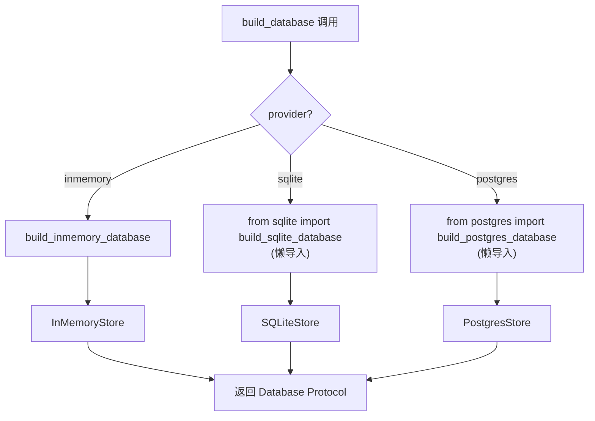
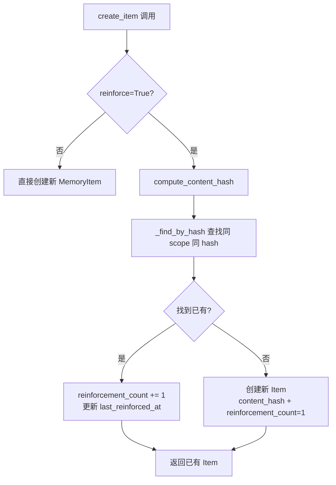

# PD-06.475 memU — 三层层级记忆架构与三后端工厂持久化

> 文档编号：PD-06.475
> 来源：memU `src/memu/database/factory.py`, `src/memu/database/models.py`, `src/memu/app/memorize.py`
> GitHub：https://github.com/NevaMind-AI/memU.git
> 问题域：PD-06 记忆持久化 Memory Persistence
> 状态：可复用方案

---

## 第 1 章 问题与动机（≥ 30 行）

### 1.1 核心问题

AI Agent 的记忆系统面临三个核心挑战：

1. **记忆结构化**：对话中产生的信息类型多样（用户偏好、事件、知识、行为模式、技能、工具调用），需要分类存储而非扁平堆积
2. **存储后端适配**：不同部署场景需要不同存储方案——开发用内存、轻量部署用 SQLite、生产环境用 PostgreSQL+pgvector
3. **记忆去重与强化**：同一事实被多次提及时，应强化而非重复存储；记忆的重要性应随时间衰减、随重复提及增强

memU 的核心设计是将记忆系统拆分为三个正交维度：**数据模型**（Resource→Item→Category 三层层级）、**存储后端**（inmemory/sqlite/postgres 三种实现）、**记忆管道**（7 步 Workflow 流水线），通过 Protocol 接口和工厂模式将三者解耦。

### 1.2 memU 的解法概述

1. **三层层级数据模型**：Resource（原始资源）→ MemoryItem（记忆条目，6 种类型）→ MemoryCategory（语义分类），通过 CategoryItem 关联表连接 Item 和 Category（`src/memu/database/models.py:68-106`）
2. **Protocol 驱动的后端抽象**：`Database` Protocol 定义 4 个 Repository 接口，三种后端各自实现，通过工厂函数 `build_database()` 按配置选择（`src/memu/database/factory.py:15-43`）
3. **内容哈希去重 + reinforcement 强化**：SHA256 截断 16 位哈希做去重键，重复内容自动递增 `reinforcement_count` 而非创建新记录（`src/memu/database/models.py:15-32`）
4. **Salience 衰减评分**：检索时综合 cosine 相似度 × log(reinforcement+1) × 指数时间衰减，平衡相关性、重要性和新鲜度（`src/memu/database/inmemory/vector.py:16-53`）
5. **Scope 模型动态注入**：通过 `merge_scope_model()` 将用户自定义字段（user_id 等）动态合并到核心模型，实现多租户隔离（`src/memu/database/models.py:108-134`）

### 1.3 设计思想

| 设计原则 | 具体实现 | 理由 | 替代方案 |
|----------|----------|------|----------|
| Protocol 而非继承 | `Database(Protocol)` 定义 4 个 repo 属性 | 后端实现完全独立，无基类耦合 | ABC 抽象基类（会引入继承链） |
| 工厂 + 懒导入 | `build_database()` 按 provider 字符串选择，postgres/sqlite 懒 import | 不使用 postgres 时不需要 pgvector 依赖 | 全量导入（增加启动开销） |
| 哈希去重在摘要后 | `compute_content_hash()` 对 summary 而非原文做哈希 | 同一事实不同表述经 LLM 摘要后趋同 | 原文哈希（同义不同词无法去重） |
| extra 字典扩展 | reinforcement_count/content_hash 存在 `extra: dict` 中 | 避免修改核心 schema，向后兼容 | 新增列（需要 migration） |
| 三层检索 | Category→Item→Resource 逐层深入，每层有 sufficiency check | 避免一次性加载全部记忆，按需深入 | 扁平检索（无法利用分类结构） |

---

## 第 2 章 源码实现分析（≥ 60 行，核心章节）

### 2.1 架构概览

memU 的记忆持久化架构分为四层：

```
┌─────────────────────────────────────────────────────────┐
│                   MemoryService                          │
│  (MemorizeMixin + RetrieveMixin + CRUDMixin)            │
├─────────────────────────────────────────────────────────┤
│              WorkflowRunner (7-step pipeline)            │
│  ingest → preprocess → extract → dedupe → categorize    │
│  → persist → build_response                             │
├─────────────────────────────────────────────────────────┤
│              Database Protocol (4 Repos)                 │
│  ResourceRepo │ MemoryItemRepo │ MemoryCategoryRepo     │
│               │ CategoryItemRepo                        │
├──────────┬──────────┬───────────────────────────────────┤
│ InMemory │  SQLite  │  PostgreSQL + pgvector            │
│ (dict)   │ (SQLModel)│ (SQLModel + Alembic)             │
└──────────┴──────────┴───────────────────────────────────┘
```

### 2.2 核心实现

#### 2.2.1 工厂模式与后端选择



对应源码 `src/memu/database/factory.py:15-43`：

```python
def build_database(
    *,
    config: DatabaseConfig,
    user_model: type[BaseModel],
) -> Database:
    provider = config.metadata_store.provider
    if provider == "inmemory":
        return build_inmemory_database(config=config, user_model=user_model)
    elif provider == "postgres":
        # Lazy import to avoid requiring pgvector when not using postgres
        from memu.database.postgres import build_postgres_database
        return build_postgres_database(config=config, user_model=user_model)
    elif provider == "sqlite":
        from memu.database.sqlite import build_sqlite_database
        return build_sqlite_database(config=config, user_model=user_model)
    else:
        msg = f"Unsupported metadata_store provider: {provider}"
        raise ValueError(msg)
```

关键设计：postgres 和 sqlite 使用**懒导入**，避免在 inmemory 模式下加载 SQLAlchemy/pgvector 等重依赖。

#### 2.2.2 内容哈希去重与 Reinforcement 强化



对应源码 `src/memu/database/inmemory/repositories/memory_item_repo.py:122-167`：

```python
def create_item_reinforce(
    self, *, resource_id, memory_type, summary, embedding, user_data, reinforce=False,
) -> MemoryItem:
    content_hash = compute_content_hash(summary, memory_type)
    existing = self._find_by_hash(content_hash, user_data)
    if existing:
        current_extra = existing.extra or {}
        current_count = current_extra.get("reinforcement_count", 1)
        existing.extra = {
            **current_extra,
            "reinforcement_count": current_count + 1,
            "last_reinforced_at": pendulum.now("UTC").isoformat(),
        }
        existing.updated_at = pendulum.now("UTC")
        return existing
    # Create new item with salience tracking
    mid = str(uuid.uuid4())
    now = pendulum.now("UTC")
    item_extra = user_data.pop("extra", {}) if "extra" in user_data else {}
    item_extra.update({
        "content_hash": content_hash,
        "reinforcement_count": 1,
        "last_reinforced_at": now.isoformat(),
    })
    it = self.memory_item_model(
        id=mid, resource_id=resource_id, memory_type=memory_type,
        summary=summary, embedding=embedding, extra=item_extra, **user_data,
    )
    self.items[mid] = it
    return it
```

哈希函数 `src/memu/database/models.py:15-32`：

```python
def compute_content_hash(summary: str, memory_type: str) -> str:
    normalized = " ".join(summary.lower().split())  # 归一化空白
    content = f"{memory_type}:{normalized}"
    return hashlib.sha256(content.encode()).hexdigest()[:16]
```

### 2.3 实现细节

#### Salience 评分公式

`src/memu/database/inmemory/vector.py:16-53` 实现了三因子 salience 评分：

```
salience = similarity × log(reinforcement_count + 1) × exp(-0.693 × days_ago / decay_days)
```

- **similarity**：cosine 相似度（0~1）
- **reinforcement_factor**：对数缩放防止高频事实垄断排名
- **recency_factor**：半衰期指数衰减，`decay_days` 默认 30 天，30 天后衰减到 ~0.5

#### Scope 模型动态合并

`src/memu/database/models.py:108-134` 通过 Python 元类动态创建带 scope 字段的模型：

```python
def merge_scope_model(user_model, core_model, *, name_suffix):
    overlap = set(user_model.model_fields) & set(core_model.model_fields)
    if overlap:
        raise TypeError(f"Scope fields conflict: {sorted(overlap)}")
    return type(
        f"{user_model.__name__}{core_model.__name__}{name_suffix}",
        (user_model, core_model),
        {"model_config": ConfigDict(extra="allow")},
    )
```

这使得 `MemoryItem` 可以动态获得 `user_id`、`agent_id` 等字段，无需修改核心模型定义。

#### SQLite 后端的 JSON 查询

SQLite 后端在 reinforcement 去重时使用 `json_extract` 查询 extra 字段（`src/memu/database/sqlite/repositories/memory_item_repo.py:309-320`）：

```python
content_hash_col = func.json_extract(self._memory_item_model.extra, "$.content_hash")
filters = [content_hash_col == content_hash]
filters.extend(self._build_filters(self._memory_item_model, user_data))
existing = session.exec(select(self._memory_item_model).where(*filters)).first()
```

#### 6 种记忆类型

`src/memu/database/models.py:12`：

```python
MemoryType = Literal["profile", "event", "knowledge", "behavior", "skill", "tool"]
```

其中 `tool` 类型有专门的 `ToolCallResult` 模型（`models.py:43-66`），记录工具名、输入输出、耗时、token 消耗、质量评分，并用 MD5 哈希做工具调用去重。

#### 三层检索流程

检索采用 Category→Item→Resource 三层渐进式深入，每层之间有 LLM sufficiency check 判断是否需要继续深入（`src/memu/app/retrieve.py:106-210`）。支持两种检索策略：
- **RAG**：embedding 向量检索 + cosine/salience 排序
- **LLM**：LLM 直接对候选列表排序

---

## 第 3 章 迁移指南（≥ 40 行）

### 3.1 迁移清单

**阶段 1：数据模型（1 天）**
- [ ] 定义 `BaseRecord` 基类（id + created_at + updated_at）
- [ ] 定义 `MemoryItem` 模型（resource_id, memory_type, summary, embedding, extra）
- [ ] 定义 `MemoryCategory` 模型（name, description, embedding, summary）
- [ ] 实现 `compute_content_hash()` 哈希函数
- [ ] 实现 `merge_scope_model()` 动态 scope 注入

**阶段 2：Repository 接口（1 天）**
- [ ] 定义 `MemoryItemRepo` Protocol（CRUD + vector_search + reinforce）
- [ ] 实现 InMemory 后端（dict 存储 + brute-force cosine）
- [ ] 实现 `salience_score()` 三因子评分函数

**阶段 3：工厂与配置（0.5 天）**
- [ ] 实现 `build_database()` 工厂函数
- [ ] 定义 `DatabaseConfig`（metadata_store + vector_index）
- [ ] 添加 SQLite/Postgres 后端（按需）

**阶段 4：记忆管道（1 天）**
- [ ] 实现 memorize 7 步 workflow
- [ ] 实现 retrieve 三层渐进检索

### 3.2 适配代码模板

#### 最小可运行的记忆系统（InMemory 后端）

```python
import hashlib
import math
import uuid
from datetime import datetime, timezone
from typing import Any, Literal, Protocol

import numpy as np
from pydantic import BaseModel, Field


# === 数据模型 ===
MemoryType = Literal["profile", "event", "knowledge", "behavior", "skill", "tool"]


def compute_content_hash(summary: str, memory_type: str) -> str:
    normalized = " ".join(summary.lower().split())
    content = f"{memory_type}:{normalized}"
    return hashlib.sha256(content.encode()).hexdigest()[:16]


class MemoryItem(BaseModel):
    id: str = Field(default_factory=lambda: str(uuid.uuid4()))
    memory_type: MemoryType
    summary: str
    embedding: list[float] | None = None
    extra: dict[str, Any] = {}
    created_at: datetime = Field(default_factory=lambda: datetime.now(timezone.utc))
    updated_at: datetime = Field(default_factory=lambda: datetime.now(timezone.utc))


# === Salience 评分 ===
def salience_score(
    similarity: float,
    reinforcement_count: int,
    last_reinforced_at: datetime | None,
    decay_days: float = 30.0,
) -> float:
    reinforcement_factor = math.log(reinforcement_count + 1)
    if last_reinforced_at is None:
        recency_factor = 0.5
    else:
        now = datetime.now(timezone.utc)
        days_ago = (now - last_reinforced_at).total_seconds() / 86400
        recency_factor = math.exp(-0.693 * days_ago / decay_days)
    return similarity * reinforcement_factor * recency_factor


# === Repository ===
class InMemoryItemRepo:
    def __init__(self) -> None:
        self.items: dict[str, MemoryItem] = {}

    def create_or_reinforce(
        self, memory_type: MemoryType, summary: str, embedding: list[float],
    ) -> MemoryItem:
        content_hash = compute_content_hash(summary, memory_type)
        # 查找同 hash 已有记忆
        for item in self.items.values():
            if item.extra.get("content_hash") == content_hash:
                count = item.extra.get("reinforcement_count", 1)
                item.extra["reinforcement_count"] = count + 1
                item.extra["last_reinforced_at"] = datetime.now(timezone.utc).isoformat()
                item.updated_at = datetime.now(timezone.utc)
                return item
        # 创建新记忆
        item = MemoryItem(
            memory_type=memory_type, summary=summary, embedding=embedding,
            extra={
                "content_hash": content_hash,
                "reinforcement_count": 1,
                "last_reinforced_at": datetime.now(timezone.utc).isoformat(),
            },
        )
        self.items[item.id] = item
        return item

    def vector_search(
        self, query_vec: list[float], top_k: int = 5, ranking: str = "similarity",
    ) -> list[tuple[str, float]]:
        q = np.array(query_vec, dtype=np.float32)
        scored = []
        for item in self.items.values():
            if item.embedding is None:
                continue
            v = np.array(item.embedding, dtype=np.float32)
            sim = float(np.dot(q, v) / (np.linalg.norm(q) * np.linalg.norm(v) + 1e-9))
            if ranking == "salience":
                from datetime import datetime as dt
                last_str = item.extra.get("last_reinforced_at")
                last_dt = dt.fromisoformat(last_str) if last_str else None
                score = salience_score(
                    sim, item.extra.get("reinforcement_count", 1), last_dt,
                )
            else:
                score = sim
            scored.append((item.id, score))
        scored.sort(key=lambda x: x[1], reverse=True)
        return scored[:top_k]
```

### 3.3 适用场景

| 场景 | 适用度 | 说明 |
|------|--------|------|
| 对话式 Agent 长期记忆 | ⭐⭐⭐ | 核心场景，6 种记忆类型覆盖全面 |
| 多租户 SaaS Agent | ⭐⭐⭐ | scope 模型动态注入天然支持 |
| 工具调用经验积累 | ⭐⭐⭐ | ToolCallResult 专门建模 |
| 轻量嵌入式部署 | ⭐⭐ | SQLite 后端适合，但向量检索是 brute-force |
| 高并发生产环境 | ⭐⭐ | PostgreSQL+pgvector 支持，但无连接池优化 |
| 实时流式记忆 | ⭐ | 无流式写入支持，需要完整 workflow 执行 |

---

## 第 4 章 测试用例（≥ 20 行）

```python
import pytest
from datetime import datetime, timezone


class TestContentHash:
    def test_same_content_same_hash(self):
        h1 = compute_content_hash("I love coffee", "profile")
        h2 = compute_content_hash("I love coffee", "profile")
        assert h1 == h2

    def test_whitespace_normalization(self):
        h1 = compute_content_hash("I  love  coffee", "profile")
        h2 = compute_content_hash("I love coffee", "profile")
        assert h1 == h2

    def test_different_type_different_hash(self):
        h1 = compute_content_hash("I love coffee", "profile")
        h2 = compute_content_hash("I love coffee", "event")
        assert h1 != h2

    def test_hash_length(self):
        h = compute_content_hash("test", "profile")
        assert len(h) == 16


class TestReinforcement:
    def test_first_create(self):
        repo = InMemoryItemRepo()
        item = repo.create_or_reinforce("profile", "likes coffee", [0.1, 0.2])
        assert item.extra["reinforcement_count"] == 1
        assert "content_hash" in item.extra

    def test_reinforce_existing(self):
        repo = InMemoryItemRepo()
        item1 = repo.create_or_reinforce("profile", "likes coffee", [0.1, 0.2])
        item2 = repo.create_or_reinforce("profile", "likes coffee", [0.1, 0.2])
        assert item1.id == item2.id
        assert item2.extra["reinforcement_count"] == 2

    def test_different_content_creates_new(self):
        repo = InMemoryItemRepo()
        item1 = repo.create_or_reinforce("profile", "likes coffee", [0.1, 0.2])
        item2 = repo.create_or_reinforce("profile", "likes tea", [0.3, 0.4])
        assert item1.id != item2.id


class TestSalienceScore:
    def test_higher_reinforcement_higher_score(self):
        s1 = salience_score(0.8, 1, datetime.now(timezone.utc))
        s2 = salience_score(0.8, 10, datetime.now(timezone.utc))
        assert s2 > s1

    def test_recent_higher_than_old(self):
        now = datetime.now(timezone.utc)
        old = datetime(2020, 1, 1, tzinfo=timezone.utc)
        s_recent = salience_score(0.8, 1, now)
        s_old = salience_score(0.8, 1, old)
        assert s_recent > s_old

    def test_none_recency_gets_neutral(self):
        score = salience_score(0.8, 1, None)
        assert score > 0


class TestVectorSearch:
    def test_basic_search(self):
        repo = InMemoryItemRepo()
        repo.create_or_reinforce("profile", "likes coffee", [1.0, 0.0])
        repo.create_or_reinforce("profile", "likes tea", [0.0, 1.0])
        results = repo.vector_search([1.0, 0.0], top_k=1)
        assert len(results) == 1

    def test_salience_ranking(self):
        repo = InMemoryItemRepo()
        repo.create_or_reinforce("profile", "likes coffee", [0.9, 0.1])
        # 强化 3 次
        for _ in range(3):
            repo.create_or_reinforce("profile", "likes tea", [0.1, 0.9])
        results = repo.vector_search([0.5, 0.5], top_k=2, ranking="salience")
        assert len(results) == 2
```

---

## 第 5 章 跨域关联

| 关联域 | 关系类型 | 说明 |
|--------|----------|------|
| PD-01 上下文管理 | 协同 | 记忆检索结果注入上下文窗口，retrieve 的 sufficiency check 控制注入量 |
| PD-04 工具系统 | 协同 | ToolCallResult 模型专门记录工具调用经验，tool 类型记忆支持 when_to_use 提示 |
| PD-08 搜索与检索 | 依赖 | 三层渐进检索（Category→Item→Resource）复用向量搜索基础设施 |
| PD-10 中间件管道 | 协同 | memorize/retrieve 都是 WorkflowStep 管道，支持 interceptor 钩子 |
| PD-11 可观测性 | 协同 | LLMClientWrapper 支持 before/after/on_error 拦截器，可追踪每次 LLM 调用 |
| PD-07 质量检查 | 协同 | retrieve 的 sufficiency check 是质量门控的一种形式 |

---

## 第 6 章 来源文件索引

| 文件 | 行范围 | 关键实现 |
|------|--------|----------|
| `src/memu/database/models.py` | L12-148 | 核心数据模型：BaseRecord, MemoryItem, MemoryCategory, ToolCallResult, compute_content_hash, merge_scope_model |
| `src/memu/database/factory.py` | L15-43 | 工厂函数 build_database()，三后端懒导入 |
| `src/memu/database/interfaces.py` | L12-27 | Database Protocol 定义，4 个 Repository 属性 |
| `src/memu/database/repositories/memory_item.py` | L10-54 | MemoryItemRepo Protocol 接口定义 |
| `src/memu/database/inmemory/repositories/memory_item_repo.py` | L16-262 | InMemory 后端完整实现：CRUD + reinforce + vector_search |
| `src/memu/database/inmemory/vector.py` | L16-128 | salience_score 三因子评分 + cosine_topk 向量检索 |
| `src/memu/database/sqlite/repositories/memory_item_repo.py` | L23-540 | SQLite 后端实现：SQLModel ORM + json_extract 去重查询 |
| `src/memu/app/memorize.py` | L47-1331 | MemorizeMixin：7 步 workflow + LLM 提取 + 分类 + 持久化 |
| `src/memu/app/retrieve.py` | L27-1419 | RetrieveMixin：三层渐进检索 + RAG/LLM 双策略 |
| `src/memu/app/service.py` | L49-427 | MemoryService 主入口：配置、工厂、管道注册、拦截器 |
| `src/memu/app/settings.py` | L1-322 | 全量配置模型：DatabaseConfig, MemorizeConfig, RetrieveConfig |

---

## 第 7 章 横向对比维度

```json comparison_data
{
  "project": "memU",
  "dimensions": {
    "记忆结构": "三层层级：Resource→MemoryItem(6类型)→MemoryCategory，CategoryItem 关联表",
    "更新机制": "SHA256 内容哈希去重 + reinforcement_count 递增强化",
    "事实提取": "LLM XML 结构化提取，6 种记忆类型并行 asyncio.gather",
    "存储方式": "三后端工厂：inmemory(dict)/sqlite(SQLModel)/postgres(pgvector)",
    "注入方式": "三层渐进检索注入，每层 sufficiency check 控制深度",
    "生命周期管理": "半衰期指数衰减 salience 评分，recency_decay_days 可配置",
    "记忆检索": "RAG(cosine/salience) + LLM 排序双策略，三层 Category→Item→Resource",
    "存储后端委托": "Protocol + 工厂模式，懒导入避免不必要依赖",
    "记忆增长控制": "reinforcement 合并重复记忆，但无主动清理/归档机制",
    "碰撞检测": "SHA256 截断 16 位 hex，理论碰撞率极低但无显式处理",
    "多渠道会话隔离": "merge_scope_model 动态注入 user_id 等 scope 字段做 WHERE 过滤",
    "经验结构化": "ToolCallResult 模型：tool_name/input/output/success/time_cost/token_cost/score/call_hash"
  }
}
```

### 域元数据补充

```json domain_metadata
{
  "solution_summary": "memU 用 Protocol+工厂模式实现 inmemory/sqlite/postgres 三后端切换，SHA256 哈希去重配合 log×exp 三因子 salience 衰减评分，6 种记忆类型通过 7 步 Workflow 管道提取和持久化",
  "description": "记忆系统的后端无关抽象与动态 scope 注入是多租户场景的关键设计",
  "sub_problems": [
    "Scope 字段动态注入：如何在不修改核心模型的情况下为不同租户添加过滤字段",
    "工具调用记忆建模：如何结构化存储工具名、输入输出、耗时、评分以支持经验复用",
    "三层渐进检索深度控制：每层 sufficiency check 的判断标准和提前终止策略"
  ],
  "best_practices": [
    "懒导入重依赖：工厂函数中按需 import postgres/sqlite 模块，避免未使用后端的依赖污染",
    "哈希在摘要后做：对 LLM 提取的 summary 而非原文做哈希，同义不同词经摘要后趋同",
    "extra 字典扩展 schema：reinforcement 等元数据存 extra dict 而非新增列，避免 migration"
  ]
}
```
