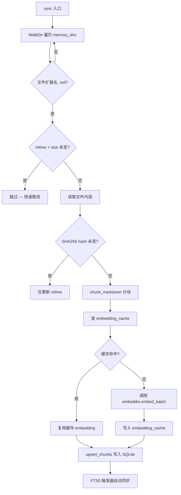
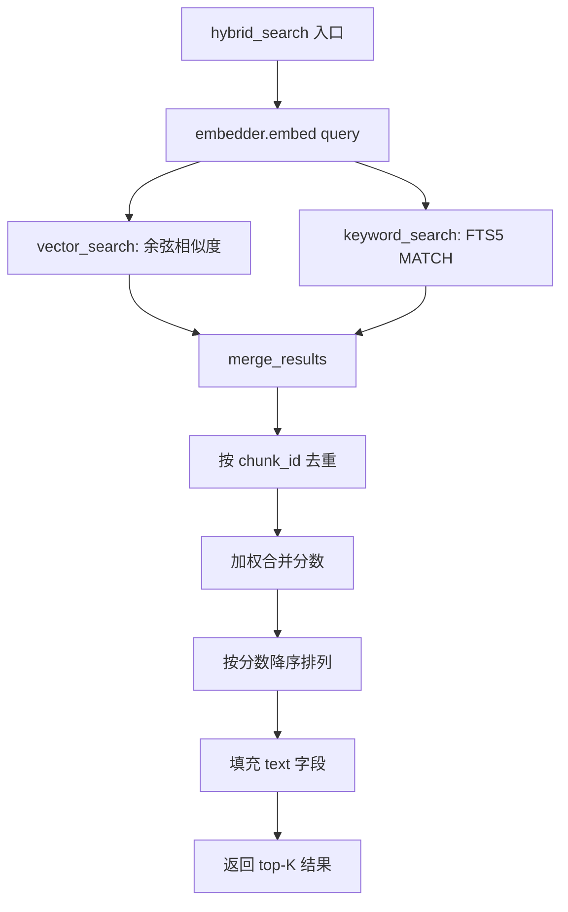
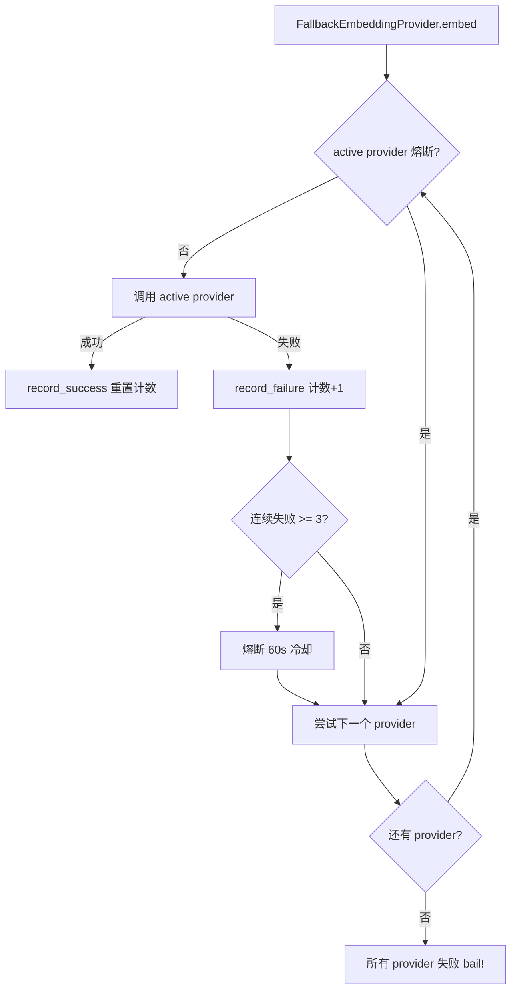

# PD-06.NN Moltis — SQLite 混合检索 RAG 记忆系统

> 文档编号：PD-06.NN
> 来源：Moltis `crates/memory/src/`
> GitHub：https://github.com/moltis-org/moltis.git
> 问题域：PD-06 记忆持久化 Memory Persistence
> 状态：可复用方案

---

## 第 1 章 问题与动机

### 1.1 核心问题

Agent 系统需要跨会话记忆能力：用户在第 N 次对话中提到的偏好、项目上下文、历史决策，应该在第 N+1 次对话中可被检索和利用。核心挑战包括：

1. **存储与检索统一**：记忆不仅要存下来，还要能高效检索。纯文本搜索漏掉语义相似但措辞不同的内容，纯向量搜索又对精确关键词匹配不敏感。
2. **多来源记忆融合**：日常对话日志、长期记忆文件、会话导出——不同来源的记忆需要统一索引。
3. **Embedding 成本控制**：每次文件变更都重新 embed 全部 chunk 成本过高，需要缓存机制。
4. **离线可用**：不是所有环境都有 OpenAI API 访问，需要本地 embedding 降级方案。
5. **实时性**：文件修改后记忆应立即可搜索，不能等下次全量同步。

### 1.2 Moltis 的解法概述

Moltis 用一个独立的 Rust crate（`moltis-memory`）实现了完整的 RAG 记忆管道：

1. **Markdown 文件分块**：`chunker.rs:16` 按 token 数切分 Markdown，支持重叠窗口保持上下文连贯
2. **多 Embedding 提供者 + 熔断降级**：`embeddings_fallback.rs:65` 实现 circuit breaker 链式降级（OpenAI → 本地 llama-cpp）
3. **SQLite 统一存储**：`store_sqlite.rs:41` 用单个 SQLite 数据库同时存储文件元数据、chunk 文本、embedding BLOB 和 FTS5 全文索引
4. **混合检索**：`search.rs:51` 加权合并 vector search 和 keyword search 结果，chunk_id 去重
5. **文件监听自动同步**：`watcher.rs:22` 用 notify-debouncer 监听 Markdown 文件变更，1.5s 防抖后自动 re-index

### 1.3 设计思想

| 设计原则 | 具体实现 | 理由 | 替代方案 |
|----------|----------|------|----------|
| 单库统一 | SQLite 存 files + chunks + embeddings + FTS5 | 零外部依赖，部署简单，ACID 保证 | 向量库(Qdrant) + 关系库分离 |
| Trait 抽象 | `MemoryStore` trait + `EmbeddingProvider` trait | 存储和 embedding 可独立替换 | 硬编码具体实现 |
| 熔断降级 | 3 次连续失败 → 60s 冷却 → 自动恢复 | 避免 API 不可用时持续浪费请求 | 简单重试 |
| Hash 变更检测 | mtime 快速路径 + SHA256 内容 hash 双重检查 | 避免不必要的 re-chunk 和 re-embed | 仅 mtime 检测 |
| 写后即搜 | `write_memory` 后立即调用 `sync_path` re-index | 保证记忆写入后立即可检索 | 等待下次全量 sync |
| LRU 缓存淘汰 | embedding_cache 超 50,000 行时按 updated_at 淘汰 | 防止缓存无限膨胀 | 无限增长或定期清空 |

---

## 第 2 章 源码实现分析

### 2.1 架构概览

```
┌─────────────────────────────────────────────────────────────────┐
│                        MemoryManager                            │
│  (manager.rs:23 — 编排 sync/search/write 全流程)                │
├─────────────┬──────────────┬──────────────┬────────────────────┤
│  Chunker    │  Embedder    │  Store       │  Watcher           │
│  chunker.rs │  embeddings  │  store_      │  watcher.rs        │
│  Markdown→  │  _fallback   │  sqlite.rs   │  notify-debouncer  │
│  Chunk[]    │  .rs         │  SQLite+FTS5 │  1.5s debounce     │
│             │  OpenAI/     │              │                    │
│             │  Local/Batch │              │                    │
└─────────────┴──────────────┴──────────────┴────────────────────┘
        │              │              │               │
        ▼              ▼              ▼               ▼
┌─────────────────────────────────────────────────────────────────┐
│                     SQLite memory.db                            │
│  ┌─────────┐  ┌──────────┐  ┌────────────────┐  ┌───────────┐ │
│  │ files   │  │ chunks   │  │ embedding_cache│  │chunks_fts │ │
│  │ path PK │  │ id PK    │  │ (provider,     │  │ FTS5      │ │
│  │ hash    │  │ text     │  │  model,key,    │  │ virtual   │ │
│  │ mtime   │  │ embedding│  │  hash) PK      │  │ table     │ │
│  │ size    │  │ BLOB     │  │ embedding BLOB │  │           │ │
│  └─────────┘  └──────────┘  └────────────────┘  └───────────┘ │
└─────────────────────────────────────────────────────────────────┘
        │                                              │
        ▼                                              ▼
┌──────────────────┐                    ┌──────────────────────┐
│ Agent Tools      │                    │ Session Memory Hook  │
│ tools.rs         │                    │ session_memory.rs    │
│ memory_search    │                    │ /new /reset → .md    │
│ memory_get       │                    │ 自动导出会话日志     │
│ memory_save      │                    │                      │
└──────────────────┘                    └──────────────────────┘
```

### 2.2 核心实现

#### 2.2.1 文件同步与变更检测



对应源码 `crates/memory/src/manager.rs:186-338`：

```rust
async fn sync_file(
    &self, path: &Path, path_str: &str, report: &mut SyncReport,
) -> anyhow::Result<bool> {
    let metadata = tokio::fs::metadata(path).await?;
    let mtime = metadata.modified()?.duration_since(std::time::UNIX_EPOCH)
        .unwrap_or_default().as_secs() as i64;
    let size = metadata.len() as i64;

    // 快速路径：mtime + size 未变则跳过
    if let Some(existing) = self.store.get_file(path_str).await?
        && existing.mtime == mtime && existing.size == size
    { return Ok(false); }

    let content = tokio::fs::read_to_string(path).await?;
    let hash = sha256_hex(&content);

    // 内容 hash 未变（mtime 变了但内容没变）
    if let Some(existing) = self.store.get_file(path_str).await?
        && existing.hash == hash
    {
        let file_row = FileRow { path: path_str.to_string(),
            source: existing.source, hash: existing.hash, mtime, size };
        self.store.upsert_file(&file_row).await?;
        return Ok(false);
    }

    // 分块 + embedding + 写入
    let raw_chunks = chunk_markdown(&content, self.config.chunk_size,
        self.config.chunk_overlap);
    self.store.delete_chunks_for_file(path_str).await?;
    // ... embedding cache 查询 + 批量 embed + upsert_chunks
    Ok(true)
}
```

#### 2.2.2 混合检索（Vector + FTS5）



对应源码 `crates/memory/src/search.rs:51-94`：

```rust
pub async fn hybrid_search(
    store: &dyn MemoryStore, embedder: &dyn EmbeddingProvider,
    query: &str, limit: usize,
    vector_weight: f32, keyword_weight: f32,
) -> anyhow::Result<Vec<SearchResult>> {
    let query_embedding = embedder.embed(query).await?;
    let fetch_limit = limit * 3; // 过采样用于合并
    let vector_results = store.vector_search(&query_embedding, fetch_limit).await?;
    let keyword_results = store.keyword_search(query, fetch_limit).await?;

    let merged = merge_results(&vector_results, &keyword_results,
        vector_weight, keyword_weight);
    let mut final_results: Vec<SearchResult> = merged.into_iter()
        .take(limit).collect();

    // 回填 text 字段
    for result in &mut final_results {
        if result.text.is_empty() {
            if let Some(chunk) = store.get_chunk_by_id(&result.chunk_id).await? {
                result.text = chunk.text;
            }
        }
    }
    Ok(final_results)
}
```

`merge_results` 的去重逻辑（`search.rs:126-158`）：用 HashMap<chunk_id, (score, SearchResult)> 累加加权分数，同一 chunk 在 vector 和 keyword 结果中都出现时分数叠加。

#### 2.2.3 Embedding 熔断降级链



对应源码 `crates/memory/src/embeddings_fallback.rs:106-140`：

```rust
async fn embed(&self, text: &str) -> anyhow::Result<Vec<f32>> {
    let mut errors = Vec::new();
    let start_idx = self.active.load(Ordering::SeqCst);
    for offset in 0..self.chain.len() {
        let idx = (start_idx + offset) % self.chain.len();
        let entry = &self.chain[idx];
        if entry.state.is_tripped() { continue; }
        match entry.provider.embed(text).await {
            Ok(result) => {
                entry.state.record_success();
                if idx != start_idx {
                    self.active.store(idx, Ordering::SeqCst);
                }
                return Ok(result);
            },
            Err(e) => {
                entry.state.record_failure();
                errors.push(format!("{}: {e}", entry.name));
            },
        }
    }
    anyhow::bail!("all embedding providers failed: {}", errors.join("; "))
}
```

### 2.3 实现细节

**FTS5 查询安全**：`store_sqlite.rs:21-39` 的 `sanitize_fts5_query` 将用户输入的每个 token 用双引号包裹为字面量，防止 FTS5 语法注入（如 `37.759` 中的 `.` 会被 FTS5 解释为列过滤符）。

**Embedding 缓存键设计**：`embedding_cache` 表的主键是 `(provider, model, provider_key, hash)`，其中 `provider_key` 是 base_url + model 的 SHA256 前 16 位（`embeddings_openai.rs:23-29`），确保同一文本在不同 API 端点下不会缓存碰撞。

**会话记忆 Hook**：`session_memory.rs:54` 实现 `HookHandler` trait，在 `/new` 或 `/reset` 命令时自动将会话历史导出为 Markdown 文件到 `memory/` 目录，被 watcher 自动索引。消息截断为 2000 字符，最多保留 50 条。

**Batch Embedding 降级**：`embeddings_batch.rs:204-213` 当文本数量超过 `batch_threshold`（默认 50）时使用 OpenAI Batch API（50% 成本折扣），失败时自动降级到逐条 embed。

**LLM Reranking**：`reranking.rs:119-192` 可选的 LLM 重排序，将 hybrid search 结果交给 LLM 打分（0-1），最终分数 = 70% LLM 分 + 30% 原始分。解析失败时优雅降级到原始排序。

**路径安全校验**：`writer.rs:14-45` 的 `validate_memory_path` 严格限制写入路径为 `MEMORY.md`、`memory.md` 或 `memory/<name>.md`（单层），拒绝路径遍历、绝对路径、空格文件名。


---

## 第 3 章 迁移指南

### 3.1 迁移清单

**阶段 1：核心存储层**
- [ ] 创建 SQLite schema（files + chunks + embedding_cache + chunks_fts）
- [ ] 实现 `MemoryStore` trait 的 SQLite 版本
- [ ] 实现 FTS5 触发器保持全文索引同步

**阶段 2：分块与 Embedding**
- [ ] 实现 Markdown chunker（按 token 数分块 + 重叠窗口）
- [ ] 实现 `EmbeddingProvider` trait + OpenAI 实现
- [ ] 实现 embedding 缓存（SHA256 hash 作为缓存键）

**阶段 3：检索管道**
- [ ] 实现 cosine similarity 向量搜索
- [ ] 实现 FTS5 关键词搜索 + 查询安全化
- [ ] 实现 hybrid search 加权合并

**阶段 4：高级特性（可选）**
- [ ] 熔断降级链（FallbackEmbeddingProvider）
- [ ] 文件监听自动同步（notify-debouncer）
- [ ] Batch Embedding API 支持
- [ ] LLM Reranking
- [ ] 会话导出 Hook

### 3.2 适配代码模板

以下是 Python 版本的核心混合检索实现（可直接运行）：

```python
import sqlite3
import hashlib
import numpy as np
from typing import Optional
from dataclasses import dataclass

@dataclass
class SearchResult:
    chunk_id: str
    path: str
    score: float
    text: str

class MemoryStore:
    def __init__(self, db_path: str = "memory.db"):
        self.conn = sqlite3.connect(db_path)
        self._init_schema()

    def _init_schema(self):
        self.conn.executescript("""
            CREATE TABLE IF NOT EXISTS files (
                path TEXT PRIMARY KEY, hash TEXT, mtime INTEGER, size INTEGER
            );
            CREATE TABLE IF NOT EXISTS chunks (
                id TEXT PRIMARY KEY, path TEXT, text TEXT,
                embedding BLOB, start_line INTEGER, end_line INTEGER,
                FOREIGN KEY (path) REFERENCES files(path) ON DELETE CASCADE
            );
            CREATE VIRTUAL TABLE IF NOT EXISTS chunks_fts
                USING fts5(text, content=chunks, content_rowid=rowid);
            CREATE TABLE IF NOT EXISTS embedding_cache (
                provider TEXT, model TEXT, hash TEXT, embedding BLOB,
                PRIMARY KEY (provider, model, hash)
            );
        """)

    def hybrid_search(
        self, query_embedding: np.ndarray, query_text: str,
        limit: int = 5, vector_weight: float = 0.7,
        keyword_weight: float = 0.3,
    ) -> list[SearchResult]:
        # Vector search
        vec_results = self._vector_search(query_embedding, limit * 3)
        # Keyword search
        kw_results = self._keyword_search(query_text, limit * 3)
        # Merge with weighted scores
        scores: dict[str, tuple[float, SearchResult]] = {}
        for r in vec_results:
            scores[r.chunk_id] = (r.score * vector_weight, r)
        for r in kw_results:
            if r.chunk_id in scores:
                old_score, old_r = scores[r.chunk_id]
                scores[r.chunk_id] = (old_score + r.score * keyword_weight, old_r)
            else:
                scores[r.chunk_id] = (r.score * keyword_weight, r)
        merged = sorted(scores.values(), key=lambda x: -x[0])
        return [SearchResult(r.chunk_id, r.path, s, r.text)
                for s, r in merged[:limit]]

    def _vector_search(self, query_emb: np.ndarray, limit: int) -> list[SearchResult]:
        rows = self.conn.execute(
            "SELECT id, path, text, embedding FROM chunks WHERE embedding IS NOT NULL"
        ).fetchall()
        scored = []
        for id_, path, text, emb_blob in rows:
            emb = np.frombuffer(emb_blob, dtype=np.float32)
            score = float(np.dot(query_emb, emb) /
                         (np.linalg.norm(query_emb) * np.linalg.norm(emb) + 1e-9))
            scored.append(SearchResult(id_, path, score, text))
        scored.sort(key=lambda r: -r.score)
        return scored[:limit]

    def _keyword_search(self, query: str, limit: int) -> list[SearchResult]:
        # Sanitize: wrap each token in quotes for FTS5
        tokens = [f'"{t}"' for t in query.split() if t.strip()]
        if not tokens:
            return []
        fts_query = " ".join(tokens)
        rows = self.conn.execute(
            """SELECT c.id, c.path, c.text, rank FROM chunks_fts f
               JOIN chunks c ON c.rowid = f.rowid
               WHERE chunks_fts MATCH ? ORDER BY rank LIMIT ?""",
            (fts_query, limit)
        ).fetchall()
        if not rows:
            return []
        ranks = [r[3] for r in rows]
        min_r, max_r = min(ranks), max(ranks)
        rng = max_r - min_r if abs(max_r - min_r) > 1e-9 else 1.0
        return [SearchResult(r[0], r[1],
                float(1.0 - (r[3] - min_r) / rng), r[2]) for r in rows]
```

### 3.3 适用场景

| 场景 | 适用度 | 说明 |
|------|--------|------|
| CLI Agent 本地记忆 | ⭐⭐⭐ | SQLite 零依赖，完美适配单机 Agent |
| 小团队 Agent 平台 | ⭐⭐⭐ | 单库简单，FTS5 性能足够 |
| 大规模多租户 | ⭐⭐ | SQLite 并发写入有限，需换 PostgreSQL + pgvector |
| 纯向量检索场景 | ⭐⭐ | 内存全量加载做 cosine，数据量大时需换专用向量库 |
| 离线/边缘部署 | ⭐⭐⭐ | 本地 llama-cpp embedding + SQLite，完全离线 |

---

## 第 4 章 测试用例

基于 Moltis 真实测试模式（`manager.rs:480-928`），以下是可移植的 Python 测试：

```python
import pytest
import tempfile, os
from memory_store import MemoryStore  # 上面的适配代码

class TestMemorySync:
    def setup_method(self):
        self.tmp = tempfile.mkdtemp()
        self.db = os.path.join(self.tmp, "memory.db")
        self.store = MemoryStore(self.db)
        self.mem_dir = os.path.join(self.tmp, "memory")
        os.makedirs(self.mem_dir)

    def test_sync_detects_new_file(self):
        """新文件应被索引"""
        path = os.path.join(self.mem_dir, "test.md")
        with open(path, "w") as f:
            f.write("Rust programming is great for memory safety.")
        # 模拟 sync: 读取 → 分块 → 写入
        # ... (调用 sync 逻辑)
        results = self.store._keyword_search("Rust", 5)
        assert len(results) > 0

    def test_unchanged_file_skipped(self):
        """mtime 未变的文件应跳过"""
        # 第一次 sync
        # 第二次 sync — 应返回 files_unchanged=1
        pass

    def test_deleted_file_removed(self):
        """已删除文件的 chunks 应被清理"""
        pass

class TestHybridSearch:
    def test_merge_deduplication(self):
        """同一 chunk 在 vector 和 keyword 结果中应合并分数"""
        import numpy as np
        store = MemoryStore(":memory:")
        # 插入测试数据
        # 执行 hybrid_search
        # 验证去重和分数合并

    def test_keyword_only_fallback(self):
        """无 embedding 时应降级到纯关键词搜索"""
        store = MemoryStore(":memory:")
        results = store._keyword_search("test", 5)
        assert isinstance(results, list)

class TestFTS5Safety:
    def test_special_chars_no_error(self):
        """FTS5 查询中的特殊字符不应导致语法错误"""
        store = MemoryStore(":memory:")
        # 坐标格式 "37.759" 不应崩溃
        results = store._keyword_search("37.759 location", 10)
        assert isinstance(results, list)

    def test_empty_query_returns_empty(self):
        """纯标点查询应返回空结果"""
        store = MemoryStore(":memory:")
        results = store._keyword_search("...", 10)
        assert results == []

class TestEmbeddingCache:
    def test_cache_hit_avoids_recompute(self):
        """缓存命中时不应重新调用 embedding API"""
        # 参考 manager.rs:844-928 的 CountingEmbedder 测试模式
        pass

    def test_lru_eviction(self):
        """超过 50,000 行时应淘汰最旧的缓存"""
        pass
```


---

## 第 5 章 跨域关联

| 关联域 | 关系类型 | 说明 |
|--------|----------|------|
| PD-01 上下文管理 | 协同 | 记忆检索结果注入 Agent 上下文窗口，chunk_size 配置直接影响注入 token 预算 |
| PD-03 容错与重试 | 依赖 | FallbackEmbeddingProvider 的熔断降级机制是 PD-03 容错模式在 embedding 层的具体应用 |
| PD-04 工具系统 | 协同 | memory_search/memory_get/memory_save 三个 AgentTool 是记忆系统的 Agent 接口层 |
| PD-08 搜索与检索 | 依赖 | hybrid_search 的 vector + FTS5 混合检索是 PD-08 搜索架构的具体实现 |
| PD-10 中间件管道 | 协同 | SessionMemoryHook 通过 HookHandler trait 接入中间件管道，在会话生命周期事件中触发记忆导出 |
| PD-11 可观测性 | 协同 | metrics feature flag 下的 counter/histogram 追踪搜索次数和延迟 |

---

## 第 6 章 来源文件索引

| 文件 | 行范围 | 关键实现 |
|------|--------|----------|
| `crates/memory/src/lib.rs` | L1-L26 | 模块声明，feature gate（local-embeddings, file-watcher） |
| `crates/memory/src/store.rs` | L1-L54 | `MemoryStore` trait 定义（files/chunks/cache/search 四组方法） |
| `crates/memory/src/store_sqlite.rs` | L21-L393 | SQLite 实现：FTS5 安全化、BLOB 序列化、cosine similarity、keyword search |
| `crates/memory/src/search.rs` | L51-L158 | hybrid_search + keyword_only_search + merge_results 去重合并 |
| `crates/memory/src/manager.rs` | L23-L467 | MemoryManager：sync/search/write 编排，embedding cache，LRU 淘汰 |
| `crates/memory/src/chunker.rs` | L16-L76 | chunk_markdown：按 token 分块 + 重叠窗口 |
| `crates/memory/src/embeddings.rs` | L1-L29 | `EmbeddingProvider` trait（embed/embed_batch/model_name/dimensions/provider_key） |
| `crates/memory/src/embeddings_openai.rs` | L14-L157 | OpenAI embedding 实现，provider_key = SHA256(base_url:model) |
| `crates/memory/src/embeddings_fallback.rs` | L65-L198 | 熔断降级链：3 次失败 → 60s 冷却 → 自动恢复 |
| `crates/memory/src/embeddings_batch.rs` | L17-L227 | OpenAI Batch API 支持，threshold 触发，失败降级到逐条 |
| `crates/memory/src/reranking.rs` | L17-L207 | LLM reranking：prompt 构建 → JSON 分数解析 → 70/30 混合 |
| `crates/memory/src/watcher.rs` | L22-L79 | notify-debouncer 文件监听，1.5s 防抖，仅 .md/.markdown |
| `crates/memory/src/writer.rs` | L14-L72 | 路径安全校验：白名单 + 路径遍历防护 |
| `crates/memory/src/session_export.rs` | L46-L272 | 会话导出：Markdown 格式 + 内容安全化 + 自动清理 |
| `crates/memory/src/config.rs` | L29-L76 | MemoryConfig：12 项可配置参数 + 合理默认值 |
| `crates/memory/src/schema.rs` | L1-L39 | FileRow/ChunkRow 数据结构 + sqlx 迁移运行器 |
| `crates/memory/src/tools.rs` | L9-L202 | Agent 工具：memory_search/memory_get/memory_save |
| `crates/memory/migrations/20240205100004_init.sql` | L1-L54 | DDL：files + chunks + embedding_cache + chunks_fts + 触发器 |
| `crates/plugins/src/bundled/session_memory.rs` | L32-L155 | SessionMemoryHook：会话 reset/new 时自动导出对话日志 |

---

## 第 7 章 横向对比维度

```json comparison_data
{
  "project": "Moltis",
  "dimensions": {
    "记忆结构": "files→chunks→embedding 三层，SQLite 单库统一",
    "更新机制": "mtime 快速路径 + SHA256 hash 双重变更检测",
    "存储方式": "SQLite 单库：关系表 + BLOB embedding + FTS5 虚拟表",
    "注入方式": "Agent Tool（memory_search）返回 JSON，含 citation",
    "记忆检索": "hybrid search：cosine vector + FTS5 keyword 加权合并",
    "双检索后端切换": "vector_weight/keyword_weight 可配置，无 embedder 时自动降级 keyword-only",
    "粒度化嵌入": "Markdown 按 token 数分块（默认 400），重叠窗口 80 token",
    "缓存失效策略": "embedding_cache LRU 淘汰（50,000 行上限），按 updated_at 排序",
    "多提供商摘要": "FallbackEmbeddingProvider 熔断链：3 次失败 → 60s 冷却",
    "Schema 迁移": "sqlx::migrate! 宏 + set_ignore_missing(true)",
    "生命周期管理": "SessionExporter 自动清理：max_exports + max_age_days",
    "敏感信息过滤": "session_export sanitize_content 过滤 system 标签和 JSON 工具结果",
    "并发安全": "Rust Send+Sync trait bound，SqlitePool 连接池",
    "事实提取": "SessionMemoryHook 自动导出会话日志为 Markdown，由 chunker 索引"
  }
}
```

### 域元数据补充

```json domain_metadata
{
  "solution_summary": "Moltis 用 Rust 实现 SQLite 单库 RAG 记忆系统：Markdown 分块 + FTS5/Vector 混合检索 + embedding 熔断降级链 + LRU 缓存淘汰",
  "description": "单进程 Rust Agent 的零外部依赖记忆方案，SQLite 同时承载关系、向量和全文三种检索",
  "sub_problems": [
    "FTS5 查询安全化：用户输入含特殊字符（坐标、运算符）时如何防止 FTS5 语法错误",
    "Embedding 缓存键碰撞：不同 API 端点的同模型同文本如何区分缓存",
    "Batch API 降级：OpenAI Batch API 超时或失败时如何透明回退到逐条 embed",
    "会话导出自动清理：导出文件数量和年龄超限时的 LRU 清理策略",
    "写后即搜一致性：write_memory 后立即 sync_path 保证记忆可检索的时序保证"
  ],
  "best_practices": [
    "双重变更检测：mtime 快速路径 + SHA256 hash 避免不必要的 re-embed",
    "FTS5 触发器同步：用 AFTER INSERT/UPDATE/DELETE 触发器保持 FTS 索引与主表一致",
    "熔断而非无限重试：3 次连续失败后 60s 冷却，避免雪崩",
    "路径白名单写入：严格限制记忆写入路径防止路径遍历攻击",
    "过采样后合并：hybrid search 先 3x 过采样再合并去重，提高召回率"
  ]
}
```

