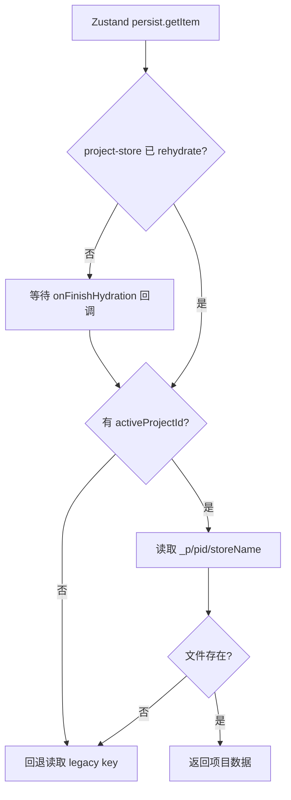
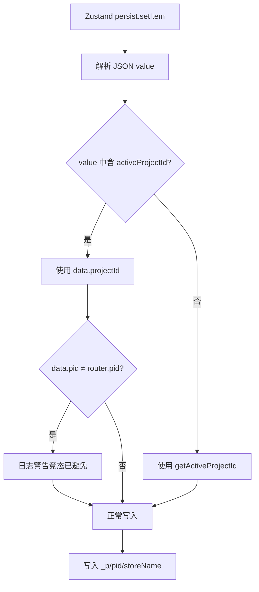
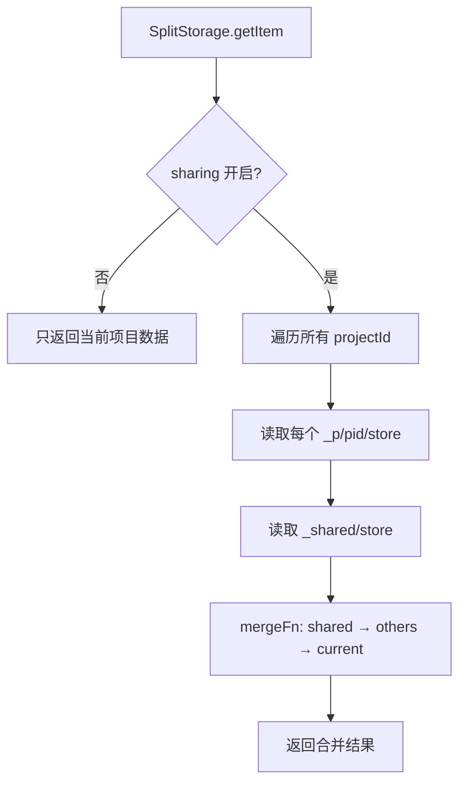

# PD-06.NN moyin-creator — 项目级 Zustand 状态路由与三源安全迁移

> 文档编号：PD-06.NN
> 来源：moyin-creator `src/lib/project-storage.ts` `src/lib/storage-migration.ts` `src/lib/indexed-db-storage.ts`
> GitHub：https://github.com/MemeCalculate/moyin-creator.git
> 问题域：PD-06 记忆持久化 Memory Persistence
> 状态：可复用方案

---

## 第 1 章 问题与动机

### 1.1 核心问题

Electron 桌面应用中，多项目数据如何在同一 Zustand 状态管理层实现隔离持久化？

moyin-creator 是一个 Electron + React 的 AI 视频创作工具，用户可以创建多个项目（剧本、分镜、角色、媒体等）。早期版本使用单体 JSON 文件存储所有项目数据（如 `moyin-script-store.json`），随着多项目功能上线，面临三个关键问题：

1. **数据隔离**：切换项目时，不同项目的剧本、分镜、时间线数据必须完全隔离，不能互相覆盖
2. **资源共享**：角色库、场景库、媒体文件等资源需要支持跨项目共享（用户可配置开关）
3. **安全迁移**：从单体存储到多项目存储的迁移必须无损，且支持回退

### 1.2 moyin-creator 的解法概述

1. **项目路由存储适配器** `createProjectScopedStorage`：拦截 Zustand persist 的 getItem/setItem，将数据路由到 `_p/{projectId}/{storeName}.json`（`src/lib/project-storage.ts:61-145`）
2. **分裂/合并存储适配器** `createSplitStorage`：将扁平数组按 projectId 字段拆分为项目专属 + 共享两部分，分别存储到 `_p/{pid}/` 和 `_shared/`（`src/lib/project-storage.ts:169-315`）
3. **三源数据竞选**：fileStorage 适配器在 getItem 时同时读取 Electron 文件系统、localStorage、IndexedDB 三个源，选择数据最丰富的源并自动迁移（`src/lib/indexed-db-storage.ts:62-124`）
4. **幂等迁移引擎**：`migrateToProjectStorage` 通过 `_p/_migrated` 标志位实现幂等，区分 Record 型和 FlatArray 型两种迁移策略（`src/lib/storage-migration.ts:23-103`）
5. **数据恢复守卫**：`recoverFromLegacy` 在每次启动时对比 legacy 文件与 per-project 文件的数据丰富度，修复因竞态条件导致的数据覆盖（`src/lib/storage-migration.ts:254-362`）

### 1.3 设计思想

| 设计原则 | 具体实现 | 理由 | 替代方案 |
|----------|----------|------|----------|
| 存储层透明路由 | StateStorage 接口适配器，store 代码无需修改 | Zustand persist 只认 StateStorage 接口，路由逻辑对业务透明 | 在每个 store 内部手动拼接 key（侵入性强） |
| 写入时数据自证 | setItem 从 JSON value 中提取 projectId，而非依赖全局状态 | 避免 rehydration 竞态导致写入错误项目 | 信任 getActiveProjectId()（有竞态风险） |
| 迁移幂等 + 回退安全 | _migrated 标志位 + 旧文件保留为 fallback | 迁移失败不写标志位，下次重试；旧文件不删除 | 迁移后删除旧文件（不可回退） |
| 三源竞选 | 比较 file/localStorage/IndexedDB 数据丰富度 | Electron 升级过程中数据可能散落在不同存储后端 | 只读一个源（可能丢数据） |
| 共享/隔离可配置 | resourceSharing 开关控制 SplitStorage 的合并行为 | 不同用户对资源共享有不同需求 | 硬编码共享策略 |

---

## 第 2 章 源码实现分析

### 2.1 架构概览

moyin-creator 的持久化架构分为四层：

```
┌─────────────────────────────────────────────────────────┐
│                    Zustand Stores                        │
│  script-store  director-store  media-store  scene-store  │
│       │              │             │            │        │
│  createProject   createProject  createSplit  createSplit │
│  ScopedStorage   ScopedStorage  Storage      Storage     │
├─────────────────────────────────────────────────────────┤
│              Storage Adapter Layer                        │
│  ┌──────────────────┐  ┌──────────────────────────┐     │
│  │ ProjectScoped     │  │ SplitStorage              │     │
│  │ _p/{pid}/store    │  │ _p/{pid}/store + _shared/ │     │
│  └────────┬─────────┘  └────────────┬─────────────┘     │
│           └──────────┬──────────────┘                    │
│                      ▼                                   │
│              fileStorage (三源竞选)                       │
│         file > localStorage > IndexedDB                  │
├─────────────────────────────────────────────────────────┤
│              Electron IPC Bridge                         │
│  preload.ts → contextBridge → window.fileStorage         │
├─────────────────────────────────────────────────────────┤
│              Node.js File System                         │
│  {dataDir}/_p/{pid}/script.json                         │
│  {dataDir}/_shared/media.json                           │
│  {dataDir}/moyin-script-store.json (legacy)             │
└─────────────────────────────────────────────────────────┘
```

### 2.2 核心实现

#### 2.2.1 项目路由存储适配器



对应源码 `src/lib/project-storage.ts:61-94`：

```typescript
export function createProjectScopedStorage(storeName: string): StateStorage {
  return {
    getItem: async (name: string): Promise<string | null> => {
      // 等待 project-store 完成 rehydration，确保拿到正确的 activeProjectId
      if (!useProjectStore.persist.hasHydrated()) {
        await new Promise<void>((resolve) => {
          const unsub = useProjectStore.persist.onFinishHydration(() => {
            unsub();
            resolve();
          });
        });
      }

      const pid = getActiveProjectId();
      if (!pid) {
        console.warn(`[ProjectStorage] No activeProjectId, falling back to legacy key: ${name}`);
        return fileStorage.getItem(name);
      }

      const projectKey = `_p/${pid}/${storeName}`;
      const projectData = await fileStorage.getItem(projectKey);
      if (projectData) return projectData;

      // Fall back to legacy monolithic file (pre-migration)
      return fileStorage.getItem(name);
    },
    // ...
  };
}
```

#### 2.2.2 写入时数据自证防竞态



对应源码 `src/lib/project-storage.ts:96-133`：

```typescript
setItem: async (name: string, value: string): Promise<void> => {
  // Extract the intended project ID from the data being persisted.
  let dataProjectId: string | null = null;
  try {
    const parsed = JSON.parse(value);
    const state = parsed?.state ?? parsed;
    if (state && typeof state === 'object' && typeof state.activeProjectId === 'string') {
      dataProjectId = state.activeProjectId;
    }
  } catch {}

  const pid = dataProjectId || getActiveProjectId();
  
  // Log a warning if there's a mismatch (indicates a race condition was avoided)
  const routerPid = getActiveProjectId();
  if (dataProjectId && routerPid && dataProjectId !== routerPid) {
    console.warn(
      `[ProjectStorage] Routing mismatch for ${storeName}: data.pid=${dataProjectId.substring(0, 8)}, ` +
      `router.pid=${routerPid.substring(0, 8)}. Using data.pid to prevent cross-project overwrite.`
    );
  }

  const projectKey = `_p/${pid}/${storeName}`;
  await fileStorage.setItem(projectKey, value);
},
```

#### 2.2.3 SplitStorage 分裂/合并机制



对应源码 `src/lib/project-storage.ts:217-265`，以 media-store 的 splitFn 为例（`src/stores/media-store.ts:17-28`）：

```typescript
function splitMediaData(state: MediaPersistedState, pid: string) {
  return {
    projectData: {
      folders: state.folders.filter((f) => f.projectId === pid && !f.isSystem),
      mediaFiles: state.mediaFiles.filter((f) => f.projectId === pid),
    },
    sharedData: {
      folders: state.folders.filter((f) => f.isSystem || (!f.projectId && !f.isAutoCreated)),
      mediaFiles: state.mediaFiles.filter((f) => !f.projectId),
    },
  };
}
```

### 2.3 实现细节

#### 三源竞选与自动迁移

`fileStorage.getItem`（`src/lib/indexed-db-storage.ts:62-124`）在 Electron 环境下同时读取三个数据源，通过 `hasRichData` 函数判断数据丰富度（检查数组长度、嵌套对象、数据大小 > 1KB），选择最丰富的源并将数据迁移到文件系统：

- 优先级：localStorage > IndexedDB > file（为了兼容从 Web 版迁移到 Electron 的场景）
- 迁移后自动清理旧源（`localStorage.removeItem` / `removeFromIndexedDB`）

#### 幂等迁移引擎

`migrateToProjectStorage`（`src/lib/storage-migration.ts:23-103`）区分两种 store 类型：

| 类型 | 示例 | 迁移策略 |
|------|------|----------|
| Record 型 | script-store, director-store | `state.projects[pid]` → `_p/{pid}/script.json` |
| FlatArray 型 | media-store, character-library | 按 `projectId` 字段 filter → `_p/{pid}/` + `_shared/` |

迁移在 `App.tsx:18-29` 的 useEffect 中触发，迁移期间显示 loading 界面阻止用户操作。

#### 项目删除时的存储清理

`project-store.ts:98-103` 在删除项目时调用 `window.fileStorage.removeDir(_p/{id})` 递归删除整个项目目录，对应 Electron 主进程的 `fs.promises.rm(dirPath, { recursive: true, force: true })`（`electron/main.ts:536-547`）。

#### Electron IPC 文件存储

主进程（`electron/main.ts:469-547`）将 key 映射为 `{dataDir}/{key}.json` 文件路径，支持嵌套目录（`_p/xxx/script` → `{dataDir}/_p/xxx/script.json`），写入时自动 `ensureDir` 创建父目录。

---

## 第 3 章 迁移指南

### 3.1 迁移清单

将 moyin-creator 的项目级存储路由方案迁移到你的 Electron + Zustand 项目：

**阶段 1：基础设施**
- [ ] 实现 `fileStorage` StateStorage 适配器（Electron IPC 桥接 Node.js fs）
- [ ] 在 Electron preload 中暴露 `window.fileStorage` API（getItem/setItem/removeItem/exists/listKeys/removeDir）
- [ ] 在 Electron 主进程中实现 IPC handler，key 映射为 `{dataDir}/{key}.json`

**阶段 2：项目路由**
- [ ] 实现 `createProjectScopedStorage(storeName)` 适配器
- [ ] 关键：getItem 中等待 project-store rehydration 完成再读取 activeProjectId
- [ ] 关键：setItem 中从 JSON value 提取 projectId，而非依赖全局状态（防竞态）
- [ ] 将纯项目级 store 的 persist storage 替换为 `createProjectScopedStorage`

**阶段 3：分裂/合并存储（可选）**
- [ ] 如果有需要跨项目共享的扁平数组 store，实现 `createSplitStorage`
- [ ] 为每个 store 编写 splitFn（按 projectId 拆分）和 mergeFn（合并共享 + 项目数据）
- [ ] 添加 resourceSharing 配置开关

**阶段 4：迁移引擎**
- [ ] 实现 `migrateToProjectStorage`，区分 Record 型和 FlatArray 型迁移
- [ ] 使用 `_p/_migrated` 标志位保证幂等
- [ ] 在 App 启动时（useEffect）运行迁移，迁移期间显示 loading
- [ ] 旧文件保留为 fallback，不删除

### 3.2 适配代码模板

以下是可直接复用的项目路由存储适配器（TypeScript + Zustand）：

```typescript
import type { StateStorage } from 'zustand/middleware';

// 你的底层存储实现（Electron fs / localStorage / IndexedDB）
import { baseStorage } from './your-storage';
// 你的项目状态 store（提供 activeProjectId）
import { useProjectStore } from './your-project-store';

/**
 * 创建项目级路由存储适配器
 * 将 Zustand persist 的读写路由到 _p/{projectId}/{storeName}.json
 */
export function createProjectScopedStorage(storeName: string): StateStorage {
  return {
    getItem: async (name: string): Promise<string | null> => {
      // 1. 等待项目 store rehydration 完成
      if (!useProjectStore.persist.hasHydrated()) {
        await new Promise<void>((resolve) => {
          const unsub = useProjectStore.persist.onFinishHydration(() => {
            unsub();
            resolve();
          });
        });
      }

      // 2. 获取当前项目 ID
      const pid = useProjectStore.getState().activeProjectId;
      if (!pid) return baseStorage.getItem(name); // fallback

      // 3. 尝试项目路径，失败则回退 legacy
      const projectKey = `_p/${pid}/${storeName}`;
      const data = await baseStorage.getItem(projectKey);
      return data ?? baseStorage.getItem(name);
    },

    setItem: async (name: string, value: string): Promise<void> => {
      // 从数据中提取 projectId（防竞态）
      let pid: string | null = null;
      try {
        const parsed = JSON.parse(value);
        const state = parsed?.state ?? parsed;
        pid = state?.activeProjectId ?? null;
      } catch {}
      
      pid = pid || useProjectStore.getState().activeProjectId;
      if (!pid) {
        await baseStorage.setItem(name, value);
        return;
      }

      await baseStorage.setItem(`_p/${pid}/${storeName}`, value);
    },

    removeItem: async (name: string): Promise<void> => {
      const pid = useProjectStore.getState().activeProjectId;
      if (!pid) {
        await baseStorage.removeItem(name);
        return;
      }
      await baseStorage.removeItem(`_p/${pid}/${storeName}`);
    },
  };
}

// 使用示例
const useScriptStore = create(
  persist(
    (set, get) => ({ /* store 逻辑 */ }),
    {
      name: 'my-script-store',
      storage: createJSONStorage(() => createProjectScopedStorage('script')),
    }
  )
);
```

### 3.3 适用场景

| 场景 | 适用度 | 说明 |
|------|--------|------|
| Electron 桌面应用多项目管理 | ⭐⭐⭐ | 完美匹配：文件系统 + Zustand + 项目隔离 |
| Web 应用多租户数据隔离 | ⭐⭐ | 需将 fileStorage 替换为 IndexedDB/远程 API |
| 单项目应用的版本快照 | ⭐⭐ | 可复用路由思路，将 projectId 替换为 snapshotId |
| 移动端 React Native 应用 | ⭐ | 需替换 Electron IPC 为 AsyncStorage |
| 服务端 Agent 记忆持久化 | ⭐ | 思路可借鉴（路由 + 分裂/合并），但技术栈差异大 |

---

## 第 4 章 测试用例

```typescript
import { describe, it, expect, vi, beforeEach } from 'vitest';

// Mock fileStorage
const mockStorage = new Map<string, string>();
const fileStorage = {
  getItem: vi.fn(async (key: string) => mockStorage.get(key) ?? null),
  setItem: vi.fn(async (key: string, value: string) => { mockStorage.set(key, value); }),
  removeItem: vi.fn(async (key: string) => { mockStorage.delete(key); }),
};

// Mock project store
let mockActiveProjectId: string | null = 'proj-001';
let mockHasHydrated = true;
vi.mock('./your-project-store', () => ({
  useProjectStore: {
    getState: () => ({ activeProjectId: mockActiveProjectId }),
    persist: {
      hasHydrated: () => mockHasHydrated,
      onFinishHydration: (cb: () => void) => { cb(); return () => {}; },
    },
  },
}));

describe('createProjectScopedStorage', () => {
  beforeEach(() => {
    mockStorage.clear();
    mockActiveProjectId = 'proj-001';
    mockHasHydrated = true;
  });

  it('routes getItem to _p/{pid}/{storeName}', async () => {
    mockStorage.set('_p/proj-001/script', '{"state":{"rawScript":"hello"}}');
    const storage = createProjectScopedStorage('script');
    const result = await storage.getItem('moyin-script-store');
    expect(result).toBe('{"state":{"rawScript":"hello"}}');
  });

  it('falls back to legacy key when project file missing', async () => {
    mockStorage.set('moyin-script-store', '{"state":{"rawScript":"legacy"}}');
    const storage = createProjectScopedStorage('script');
    const result = await storage.getItem('moyin-script-store');
    expect(result).toBe('{"state":{"rawScript":"legacy"}}');
  });

  it('routes setItem using projectId from data (not global state)', async () => {
    mockActiveProjectId = 'proj-002'; // 全局状态指向 proj-002
    const storage = createProjectScopedStorage('script');
    const value = JSON.stringify({ state: { activeProjectId: 'proj-001', rawScript: 'data' } });
    await storage.setItem('moyin-script-store', value);
    // 应写入 data 中的 proj-001，而非全局的 proj-002
    expect(mockStorage.has('_p/proj-001/script')).toBe(true);
    expect(mockStorage.has('_p/proj-002/script')).toBe(false);
  });

  it('falls back to legacy when no activeProjectId', async () => {
    mockActiveProjectId = null;
    const storage = createProjectScopedStorage('script');
    await storage.setItem('moyin-script-store', '{"state":{}}');
    expect(mockStorage.has('moyin-script-store')).toBe(true);
  });
});

describe('migrateToProjectStorage', () => {
  it('is idempotent - skips if _migrated flag exists', async () => {
    mockStorage.set('_p/_migrated', '{"migratedAt":"2025-01-01"}');
    // migrateToProjectStorage should return early
    // Verify no new files created
  });

  it('splits flat-array store by projectId', async () => {
    const legacyData = {
      state: {
        mediaFiles: [
          { id: '1', projectId: 'proj-001', name: 'a.png' },
          { id: '2', projectId: 'proj-002', name: 'b.png' },
          { id: '3', name: 'shared.png' }, // no projectId → shared
        ],
        folders: [],
      },
      version: 1,
    };
    mockStorage.set('moyin-media-store', JSON.stringify(legacyData));
    // After migration:
    // _p/proj-001/media → { mediaFiles: [{ id: '1', ... }], folders: [] }
    // _p/proj-002/media → { mediaFiles: [{ id: '2', ... }], folders: [] }
    // _shared/media → { mediaFiles: [{ id: '3', ... }], folders: [] }
  });
});

describe('recoverFromLegacy', () => {
  it('restores data when per-project file is empty but legacy has rich data', async () => {
    // Legacy has rich script data
    const legacyData = {
      state: {
        projects: {
          'proj-001': { rawScript: 'A long script...', shots: [{ id: 1 }] },
        },
      },
    };
    mockStorage.set('moyin-script-store', JSON.stringify(legacyData));
    // Per-project file is empty/default
    mockStorage.set('_p/proj-001/script', '{"state":{"projectData":{}}}');
    // After recovery: _p/proj-001/script should contain the rich legacy data
  });
});
```

---

## 第 5 章 跨域关联

| 关联域 | 关系类型 | 说明 |
|--------|----------|------|
| PD-01 上下文管理 | 协同 | 项目切换时需要清空/重建当前上下文，projectScopedStorage 的 rehydration 等待机制与上下文重建时序相关 |
| PD-04 工具系统 | 协同 | Electron IPC 桥接模式（preload → contextBridge → ipcMain）可复用于工具系统的沙箱通信 |
| PD-05 沙箱隔离 | 依赖 | 项目级存储路由本质上是数据层面的沙箱隔离，`_p/{pid}/` 目录结构实现了项目间的文件系统级隔离 |
| PD-09 Human-in-the-Loop | 协同 | 迁移期间的 loading 界面（`App.tsx:54-63`）是一种简单的 HitL 模式——阻止用户操作直到数据就绪 |
| PD-10 中间件管道 | 协同 | StateStorage 适配器链（projectScoped → fileStorage → Electron IPC）本质上是一个存储中间件管道 |

---

## 第 6 章 来源文件索引

| 文件 | 行范围 | 关键实现 |
|------|--------|----------|
| `src/lib/project-storage.ts` | L22-L28 | `getActiveProjectId` 辅助函数 |
| `src/lib/project-storage.ts` | L61-L145 | `createProjectScopedStorage` 项目路由适配器 |
| `src/lib/project-storage.ts` | L154-L155 | `SplitFn` / `MergeFn` 类型定义 |
| `src/lib/project-storage.ts` | L169-L315 | `createSplitStorage` 分裂/合并适配器 |
| `src/lib/storage-migration.ts` | L17 | `MIGRATION_FLAG_KEY` 幂等标志 |
| `src/lib/storage-migration.ts` | L23-L103 | `migrateToProjectStorage` 迁移引擎主函数 |
| `src/lib/storage-migration.ts` | L107-L152 | `migrateRecordStore` Record 型迁移 |
| `src/lib/storage-migration.ts` | L162-L218 | `migrateFlatStore` FlatArray 型迁移 |
| `src/lib/storage-migration.ts` | L254-L362 | `recoverFromLegacy` 数据恢复守卫 |
| `src/lib/indexed-db-storage.ts` | L31-L59 | `hasRichData` 数据丰富度判断 |
| `src/lib/indexed-db-storage.ts` | L61-L156 | `fileStorage` 三源竞选适配器 |
| `src/stores/media-store.ts` | L17-L44 | `splitMediaData` / `mergeMediaData` 分裂合并函数 |
| `src/stores/script-store.ts` | L6 | 使用 `createProjectScopedStorage('script')` |
| `src/stores/project-store.ts` | L98-L103 | 项目删除时 `removeDir` 清理存储 |
| `src/App.tsx` | L18-L29 | 启动时触发迁移 + 恢复 |
| `electron/preload.ts` | L50-L57 | `window.fileStorage` API 暴露 |
| `electron/main.ts` | L461-L547 | IPC handler：key → JSON 文件映射 |

---

## 第 7 章 横向对比维度

```json comparison_data
{
  "project": "moyin-creator",
  "dimensions": {
    "记忆结构": "Zustand persist StateStorage 适配器，项目级 JSON 文件",
    "更新机制": "Zustand 自动 persist，setItem 时从数据提取 pid 防竞态",
    "存储方式": "Electron fs JSON 文件，三源竞选（file > localStorage > IDB）",
    "注入方式": "createJSONStorage 包装自定义 StateStorage，对 store 透明",
    "Schema 迁移": "幂等标志位 + Record/FlatArray 双策略 + 启动时自动恢复",
    "生命周期管理": "App useEffect 启动迁移，项目删除时 removeDir 递归清理",
    "多渠道会话隔离": "_p/{pid}/ 目录级隔离，SplitStorage 支持 _shared/ 跨项目共享",
    "并发安全": "写入时从 JSON value 提取 projectId 而非全局状态，避免 rehydration 竞态",
    "版本控制": "迁移标志位 version 字段，persist payload 携带 version",
    "存储后端委托": "fileStorage 适配器统一封装 Electron IPC / localStorage / IndexedDB",
    "被动状态同步": "getItem 等待 project-store onFinishHydration 回调后再读取"
  }
}
```

### 域元数据补充

```json domain_metadata
{
  "solution_summary": "moyin-creator 用 Zustand StateStorage 适配器将 persist 读写路由到 _p/{projectId}/ 目录，SplitStorage 实现项目隔离与跨项目资源共享，三源竞选自动迁移 localStorage/IndexedDB/文件数据",
  "description": "桌面应用中多项目状态的文件系统级隔离与跨存储后端无损迁移",
  "sub_problems": [
    "Rehydration 时序竞态：多 store 依赖同一 project-store 的 activeProjectId，如何保证读取时序正确",
    "跨项目资源共享开关：同一 store 的数据如何按配置动态切换隔离/共享模式",
    "三源数据丰富度判断：如何在不完全解析的情况下快速判断哪个存储源的数据更完整",
    "迁移后数据覆盖恢复：项目切换竞态导致 per-project 文件被空数据覆盖时的自动修复"
  ],
  "best_practices": [
    "写入时数据自证：从 persist 的 JSON value 中提取 projectId 而非依赖全局状态，根治 rehydration 竞态",
    "迁移不删旧文件：旧单体文件保留为 fallback，getItem 自动降级读取，零风险回退",
    "启动时恢复守卫：每次启动对比 legacy 与 per-project 数据丰富度，自动修复竞态覆盖"
  ]
}
```
