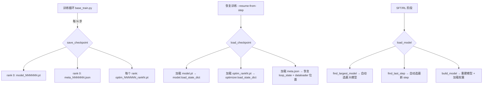
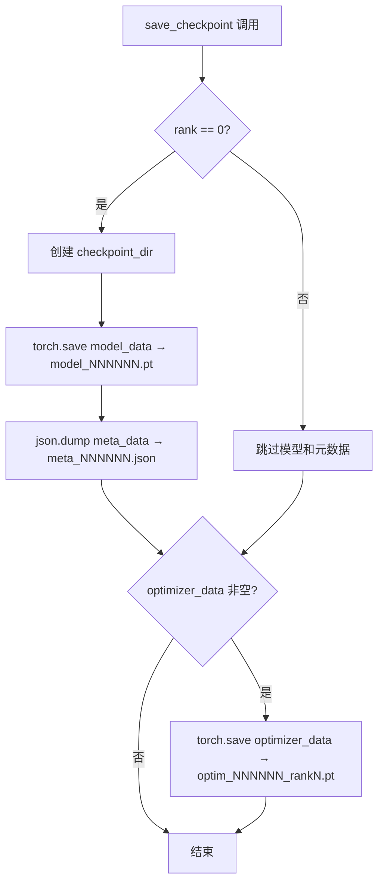
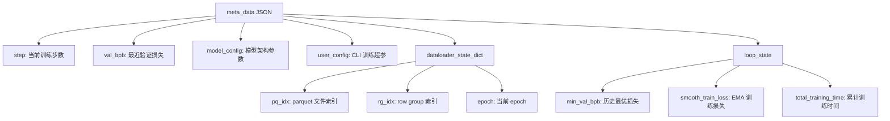

# PD-06.11 nanochat — 分布式训练 Checkpoint 全状态持久化

> 文档编号：PD-06.11
> 来源：nanochat `nanochat/checkpoint_manager.py`, `scripts/base_train.py`
> GitHub：https://github.com/karpathy/nanochat.git
> 问题域：PD-06 记忆持久化 Memory Persistence
> 状态：可复用方案

---

## 第 1 章 问题与动机

### 1.1 核心问题

大规模 LLM 训练（数小时到数天）面临不可避免的中断风险：硬件故障、抢占式实例回收、手动调参需要暂停等。如果训练状态无法完整持久化，中断意味着从零开始，浪费大量 GPU 算力和时间。

训练状态持久化的核心挑战在于"全状态"——不仅是模型参数，还包括优化器动量缓冲区（在分布式训练中按 rank 分片）、数据加载器的精确位置（parquet 文件索引 + row group 索引 + epoch 计数）、以及训练循环的所有运行时变量（当前 step、EMA 损失、累计训练时间等）。遗漏任何一项都会导致恢复后的训练轨迹偏离原始路径。

### 1.2 nanochat 的解法概述

nanochat 采用"三文件分离 + rank 分片"的 checkpoint 架构：

1. **模型参数单独存储**：`model_{step}.pt`，仅 rank 0 保存，所有 rank 共享同一份模型权重（`checkpoint_manager.py:46-48`）
2. **优化器状态按 rank 分片**：`optim_{step}_rank{N}.pt`，每个 rank 独立保存自己的优化器分片（`checkpoint_manager.py:55-59`）
3. **元数据 JSON 化**：`meta_{step}.json` 保存所有非张量状态——模型配置、训练超参、dataloader 位置、循环状态（`checkpoint_manager.py:49-53`）
4. **dataloader 位置追踪**：通过 `(pq_idx, rg_idx, epoch)` 三元组精确记录数据读取位置，恢复时跳过已训练数据（`dataloader.py:156`）
5. **三阶段训练流水线复用**：同一 checkpoint 系统贯穿 base pretrain → SFT → RL 三个阶段，支持跨阶段加载（`checkpoint_manager.py:164-172`）

### 1.3 设计思想

| 设计原则 | 具体实现 | 理由 | 替代方案 |
|----------|----------|------|----------|
| 关注点分离 | 模型/优化器/元数据三文件独立 | 模型参数可独立用于推理，优化器仅续训需要 | 单文件打包（DeepSpeed 风格） |
| rank 分片存储 | 优化器按 DDP rank 独立保存 | DDP 下每个 rank 的优化器状态不同（Muon 动量） | 全局聚合后单份保存 |
| 人类可读元数据 | JSON 格式存储非张量状态 | 可直接查看/编辑训练配置和进度 | pickle/protobuf 二进制 |
| 向后兼容补丁 | `_patch_missing_keys` 自动填充新增参数 | 旧 checkpoint 加载新模型时不报错 | 严格匹配，旧 checkpoint 作废 |
| 自动发现 | `find_largest_model` + `find_last_step` | 无需记忆具体 step 编号即可恢复 | 手动指定 checkpoint 路径 |

---

## 第 2 章 源码实现分析

### 2.1 架构概览

nanochat 的 checkpoint 系统围绕一个简洁的目录结构组织：

```
~/.cache/nanochat/
├── base_checkpoints/
│   └── d20/                          # 模型标签（depth=20）
│       ├── model_000500.pt           # 模型参数（rank 0 保存）
│       ├── optim_000500_rank0.pt     # 优化器分片（rank 0）
│       ├── optim_000500_rank1.pt     # 优化器分片（rank 1）
│       ├── ...
│       └── meta_000500.json          # 元数据（人类可读）
├── chatsft_checkpoints/              # SFT 阶段 checkpoint
└── chatrl_checkpoints/               # RL 阶段 checkpoint
```



### 2.2 核心实现

#### 2.2.1 Checkpoint 保存：三文件分离 + rank 分片



对应源码 `nanochat/checkpoint_manager.py:42-59`：

```python
def save_checkpoint(checkpoint_dir, step, model_data, optimizer_data, meta_data, rank=0):
    if rank == 0:
        os.makedirs(checkpoint_dir, exist_ok=True)
        # Save the model state parameters
        model_path = os.path.join(checkpoint_dir, f"model_{step:06d}.pt")
        torch.save(model_data, model_path)
        logger.info(f"Saved model parameters to: {model_path}")
        # Save the metadata dict as json
        meta_path = os.path.join(checkpoint_dir, f"meta_{step:06d}.json")
        with open(meta_path, "w", encoding="utf-8") as f:
            json.dump(meta_data, f, indent=2)
        logger.info(f"Saved metadata to: {meta_path}")
    # Note that optimizer state is sharded across ranks, so each rank must save its own.
    if optimizer_data is not None:
        os.makedirs(checkpoint_dir, exist_ok=True)
        optimizer_path = os.path.join(checkpoint_dir, f"optim_{step:06d}_rank{rank:d}.pt")
        torch.save(optimizer_data, optimizer_path)
        logger.info(f"Saved optimizer state to: {optimizer_path}")
```

关键设计：rank 0 负责模型和元数据（全局唯一），每个 rank 独立保存自己的优化器分片。这避免了跨 rank 通信开销，同时确保 Muon 优化器的 per-rank 动量缓冲区不丢失。

#### 2.2.2 元数据结构：训练全状态快照



对应源码 `scripts/base_train.py:461-482`：

```python
save_checkpoint(
    checkpoint_dir,
    step,
    orig_model.state_dict(),     # 模型参数
    optimizer.state_dict(),       # 优化器状态
    {  # metadata saved as json
        "step": step,
        "val_bpb": val_bpb,
        "model_config": model_config_kwargs,
        "user_config": user_config,
        "device_batch_size": args.device_batch_size,
        "max_seq_len": args.max_seq_len,
        "total_batch_size": total_batch_size,
        "dataloader_state_dict": dataloader_state_dict,
        "loop_state": {
            "min_val_bpb": min_val_bpb,
            "smooth_train_loss": smooth_train_loss,
            "total_training_time": total_training_time,
        },
    },
    rank=ddp_rank,
)
```

### 2.3 实现细节

#### Dataloader 位置追踪

nanochat 的 dataloader 是一个无限迭代器，遍历 parquet 文件的 row groups。位置通过 `(pq_idx, rg_idx, epoch)` 三元组追踪（`dataloader.py:156`）：

```python
state_dict = {"pq_idx": pq_idx, "rg_idx": rg_idx, "epoch": epoch}
```

恢复时，dataloader 从保存的位置跳过已处理数据（`dataloader.py:39-58`）：
- `resume_pq_idx`：跳到对应的 parquet 文件
- `resume_rg_idx`：在该文件内跳到对应的 row group，并前进一步避免重复
- `resume_epoch`：恢复 epoch 计数

#### 向后兼容补丁机制

当模型架构演进（新增参数）时，旧 checkpoint 缺少新 key。nanochat 通过两层补丁解决（`checkpoint_manager.py:23-40`）：

1. **Config 补丁**：`_patch_missing_config_keys` — 为旧 checkpoint 补充新增的配置项（如 `window_pattern` 默认为 `"L"`）
2. **权重补丁**：`_patch_missing_keys` — 为旧 checkpoint 补充新增的模型参数（如 `resid_lambdas` 默认为 1.0，`x0_lambdas` 默认为 0.0）

#### 自动发现机制

`find_largest_model`（`checkpoint_manager.py:118-135`）按模型深度排序选最大模型，`find_last_step`（`checkpoint_manager.py:138-144`）通过 glob 匹配 `model_*.pt` 文件名提取最大 step 编号。

#### 跨阶段加载

`load_model` 函数（`checkpoint_manager.py:164-172`）通过 `source` 参数（`"base"` / `"sft"` / `"rl"`）映射到不同的 checkpoint 目录，实现三阶段训练流水线的无缝衔接。SFT 阶段从 base checkpoint 加载模型和优化器动量（`chat_sft.py:97,142-150`），RL 阶段从 SFT checkpoint 加载（`chat_rl.py:79`）。

#### torch.compile 兼容

加载 checkpoint 时，`build_model` 自动去除 `torch.compile` 添加的 `_orig_mod.` 前缀（`checkpoint_manager.py:94`）：

```python
model_data = {k.removeprefix("_orig_mod."): v for k, v in model_data.items()}
```


---

## 第 3 章 迁移指南

### 3.1 迁移清单

**阶段 1：基础 Checkpoint（1 天）**
- [ ] 实现 `save_checkpoint(dir, step, model_data, optimizer_data, meta_data, rank)` 函数
- [ ] 实现 `load_checkpoint(dir, step, device, load_optimizer, rank)` 函数
- [ ] 定义 meta_data JSON schema（至少包含 step、model_config、dataloader 位置）
- [ ] 在训练循环中添加 `--save-every` 和 `--resume-from-step` 参数

**阶段 2：分布式支持**
- [ ] 优化器状态按 rank 分片保存（`optim_{step}_rank{rank}.pt`）
- [ ] 模型参数仅 rank 0 保存
- [ ] 确保所有 rank 在 save 点同步（DDP barrier）

**阶段 3：自动发现 + 向后兼容**
- [ ] 实现 `find_last_step` 自动发现最新 checkpoint
- [ ] 实现 `find_largest_model` 自动选择最大模型
- [ ] 添加 `_patch_missing_keys` 向后兼容机制

**阶段 4：跨阶段复用**
- [ ] 统一 checkpoint 目录结构（`{phase}_checkpoints/{model_tag}/`）
- [ ] 实现 `load_model(source, device, phase)` 跨阶段加载接口
- [ ] SFT 阶段从 base 加载优化器动量并重置学习率

### 3.2 适配代码模板

以下是一个可直接复用的 checkpoint 管理器，从 nanochat 提炼而来：

```python
"""Checkpoint manager — extracted from nanochat's checkpoint_manager.py"""
import os
import re
import glob
import json
import torch
import logging

logger = logging.getLogger(__name__)

def save_checkpoint(
    checkpoint_dir: str,
    step: int,
    model_state: dict,
    optimizer_state: dict | None,
    meta: dict,
    rank: int = 0,
) -> None:
    """Save training checkpoint with rank-sharded optimizer state."""
    if rank == 0:
        os.makedirs(checkpoint_dir, exist_ok=True)
        torch.save(model_state, os.path.join(checkpoint_dir, f"model_{step:06d}.pt"))
        with open(os.path.join(checkpoint_dir, f"meta_{step:06d}.json"), "w") as f:
            json.dump(meta, f, indent=2)
    if optimizer_state is not None:
        os.makedirs(checkpoint_dir, exist_ok=True)
        torch.save(optimizer_state, os.path.join(checkpoint_dir, f"optim_{step:06d}_rank{rank}.pt"))

def load_checkpoint(
    checkpoint_dir: str,
    step: int,
    device: torch.device,
    load_optimizer: bool = False,
    rank: int = 0,
) -> tuple[dict, dict | None, dict]:
    """Load checkpoint: returns (model_state, optimizer_state, meta)."""
    model_state = torch.load(
        os.path.join(checkpoint_dir, f"model_{step:06d}.pt"),
        map_location=device,
    )
    optimizer_state = None
    if load_optimizer:
        optimizer_state = torch.load(
            os.path.join(checkpoint_dir, f"optim_{step:06d}_rank{rank}.pt"),
            map_location=device,
        )
    with open(os.path.join(checkpoint_dir, f"meta_{step:06d}.json")) as f:
        meta = json.load(f)
    return model_state, optimizer_state, meta

def find_last_step(checkpoint_dir: str) -> int:
    """Find the latest checkpoint step in a directory."""
    files = glob.glob(os.path.join(checkpoint_dir, "model_*.pt"))
    if not files:
        raise FileNotFoundError(f"No checkpoints in {checkpoint_dir}")
    return max(int(os.path.basename(f).split("_")[-1].split(".")[0]) for f in files)

def find_largest_model(checkpoints_dir: str) -> str:
    """Find the model tag with the largest depth (d<N> naming convention)."""
    tags = [d for d in os.listdir(checkpoints_dir)
            if os.path.isdir(os.path.join(checkpoints_dir, d))]
    candidates = []
    for tag in tags:
        m = re.match(r"d(\d+)", tag)
        if m:
            candidates.append((int(m.group(1)), tag))
    if candidates:
        return max(candidates, key=lambda x: x[0])[1]
    # Fallback: most recently modified
    return max(tags, key=lambda t: os.path.getmtime(os.path.join(checkpoints_dir, t)))
```

### 3.3 适用场景

| 场景 | 适用度 | 说明 |
|------|--------|------|
| 单机多卡 DDP 训练 | ⭐⭐⭐ | 完美匹配，rank 分片设计就是为此场景 |
| 多机分布式训练 | ⭐⭐⭐ | 每个 rank 独立保存，无需跨机通信 |
| 单卡训练/微调 | ⭐⭐⭐ | rank=0 退化为单文件，零开销 |
| 多阶段训练流水线 | ⭐⭐⭐ | base→SFT→RL 跨阶段加载已验证 |
| FSDP 全分片训练 | ⭐⭐ | 需要额外处理模型参数分片（nanochat 用 DDP 不用 FSDP） |
| 弹性训练（rank 数变化） | ⭐ | 优化器分片与 rank 数绑定，变更 rank 数需重新分片 |
| Agent 对话记忆持久化 | ⭐ | 设计面向训练状态，非对话/事实记忆场景 |

---

## 第 4 章 测试用例

```python
"""Tests for checkpoint persistence — based on nanochat's checkpoint_manager.py"""
import os
import json
import tempfile
import pytest
import torch


class TestSaveLoadCheckpoint:
    """Test basic save/load round-trip."""

    def setup_method(self):
        self.tmpdir = tempfile.mkdtemp()
        self.device = torch.device("cpu")

    def test_model_roundtrip(self):
        """Model parameters survive save→load cycle."""
        model_state = {"weight": torch.randn(10, 10), "bias": torch.randn(10)}
        meta = {"step": 100, "val_bpb": 1.23, "model_config": {"n_layer": 12}}
        save_checkpoint(self.tmpdir, 100, model_state, None, meta, rank=0)

        loaded_model, loaded_opt, loaded_meta = load_checkpoint(
            self.tmpdir, 100, self.device, load_optimizer=False
        )
        assert torch.equal(loaded_model["weight"], model_state["weight"])
        assert torch.equal(loaded_model["bias"], model_state["bias"])
        assert loaded_meta["step"] == 100
        assert loaded_opt is None

    def test_optimizer_rank_sharding(self):
        """Each rank saves/loads its own optimizer shard."""
        model_state = {"w": torch.randn(4, 4)}
        meta = {"step": 50}
        opt_rank0 = {"momentum": torch.randn(4, 4)}
        opt_rank1 = {"momentum": torch.randn(4, 4)}

        save_checkpoint(self.tmpdir, 50, model_state, opt_rank0, meta, rank=0)
        save_checkpoint(self.tmpdir, 50, model_state, opt_rank1, meta, rank=1)

        _, loaded_opt0, _ = load_checkpoint(self.tmpdir, 50, self.device, load_optimizer=True, rank=0)
        _, loaded_opt1, _ = load_checkpoint(self.tmpdir, 50, self.device, load_optimizer=True, rank=1)

        assert torch.equal(loaded_opt0["momentum"], opt_rank0["momentum"])
        assert torch.equal(loaded_opt1["momentum"], opt_rank1["momentum"])
        assert not torch.equal(loaded_opt0["momentum"], loaded_opt1["momentum"])

    def test_meta_json_readable(self):
        """Metadata is stored as human-readable JSON."""
        meta = {"step": 200, "dataloader_state_dict": {"pq_idx": 3, "rg_idx": 15, "epoch": 2}}
        save_checkpoint(self.tmpdir, 200, {"w": torch.zeros(1)}, None, meta, rank=0)

        meta_path = os.path.join(self.tmpdir, "meta_000200.json")
        assert os.path.exists(meta_path)
        with open(meta_path) as f:
            loaded = json.load(f)
        assert loaded["dataloader_state_dict"]["epoch"] == 2


class TestAutoDiscovery:
    """Test automatic checkpoint discovery."""

    def setup_method(self):
        self.tmpdir = tempfile.mkdtemp()

    def test_find_last_step(self):
        """Finds the highest step number from model_*.pt files."""
        for step in [100, 200, 500]:
            torch.save({}, os.path.join(self.tmpdir, f"model_{step:06d}.pt"))
        assert find_last_step(self.tmpdir) == 500

    def test_find_last_step_empty_raises(self):
        """Raises FileNotFoundError when no checkpoints exist."""
        with pytest.raises(FileNotFoundError):
            find_last_step(self.tmpdir)

    def test_find_largest_model(self):
        """Selects the model tag with the largest depth."""
        for tag in ["d4", "d12", "d20"]:
            os.makedirs(os.path.join(self.tmpdir, tag))
        assert find_largest_model(self.tmpdir) == "d20"


class TestBackwardCompatibility:
    """Test that old checkpoints load with new model code."""

    def test_patch_missing_config_keys(self):
        """Missing window_pattern gets patched to 'L'."""
        config = {"n_layer": 12, "n_head": 8}
        _patch_missing_config_keys(config)
        assert config["window_pattern"] == "L"

    def test_patch_missing_model_keys(self):
        """Missing resid_lambdas and x0_lambdas get default values."""
        from dataclasses import dataclass

        @dataclass
        class FakeConfig:
            n_layer: int = 12

        model_data = {"some_weight": torch.randn(10)}
        _patch_missing_keys(model_data, FakeConfig())
        assert "resid_lambdas" in model_data
        assert model_data["resid_lambdas"].shape == (12,)
        assert torch.all(model_data["resid_lambdas"] == 1.0)
        assert "x0_lambdas" in model_data
        assert torch.all(model_data["x0_lambdas"] == 0.0)
```


---

## 第 5 章 跨域关联

| 关联域 | 关系类型 | 说明 |
|--------|----------|------|
| PD-03 容错与重试 | 协同 | checkpoint 是容错的基础设施——训练中断后通过 `--resume-from-step` 恢复，本质是"重试"的前提条件。nanochat 的 checkpoint 保存在训练循环末尾（`base_train.py:460`），确保只保存完整 step 的状态 |
| PD-01 上下文管理 | 协同 | dataloader 的 `(pq_idx, rg_idx, epoch)` 位置追踪本质上是"数据上下文"的持久化——恢复训练时需要精确知道数据流的位置，避免重复或遗漏训练数据 |
| PD-11 可观测性 | 协同 | meta_data 中保存了 `val_bpb`、`smooth_train_loss`、`total_training_time` 等指标，这些既是训练状态也是可观测性数据。恢复后 wandb 日志可以无缝续接 |
| PD-04 工具系统 | 弱关联 | checkpoint 的 `load_model(source)` 接口按训练阶段（base/sft/rl）路由到不同目录，类似工具系统的注册/发现模式 |

---

## 第 6 章 来源文件索引

| 文件 | 行范围 | 关键实现 |
|------|--------|----------|
| `nanochat/checkpoint_manager.py` | L42-L59 | `save_checkpoint` — 三文件分离保存 + rank 分片 |
| `nanochat/checkpoint_manager.py` | L61-L74 | `load_checkpoint` — 加载模型/优化器/元数据 |
| `nanochat/checkpoint_manager.py` | L77-L115 | `build_model` — 从 checkpoint 重建模型（含补丁机制） |
| `nanochat/checkpoint_manager.py` | L118-L135 | `find_largest_model` — 自动发现最大模型 |
| `nanochat/checkpoint_manager.py` | L138-L144 | `find_last_step` — 自动发现最新 step |
| `nanochat/checkpoint_manager.py` | L149-L172 | `load_model_from_dir` / `load_model` — 跨阶段加载接口 |
| `nanochat/checkpoint_manager.py` | L174-L194 | `load_optimizer_state` — 独立加载优化器分片（SFT 热启动） |
| `nanochat/checkpoint_manager.py` | L23-L40 | `_patch_missing_config_keys` / `_patch_missing_keys` — 向后兼容 |
| `scripts/base_train.py` | L149-L158 | 恢复训练：加载 checkpoint → model.load_state_dict |
| `scripts/base_train.py` | L314-L316 | 恢复优化器状态 |
| `scripts/base_train.py` | L320-L323 | 恢复 dataloader 位置 |
| `scripts/base_train.py` | L375-L387 | 恢复循环状态（step, val_bpb, smooth_loss, training_time） |
| `scripts/base_train.py` | L460-L482 | 保存 checkpoint（含完整 meta_data 结构） |
| `nanochat/dataloader.py` | L25-L70 | `_document_batches` — 带位置追踪的无限数据迭代器 |
| `nanochat/dataloader.py` | L156 | dataloader state_dict 输出：`(pq_idx, rg_idx, epoch)` |
| `scripts/chat_sft.py` | L97,L142-L150 | SFT 从 base checkpoint 加载模型 + 优化器动量热启动 |
| `scripts/chat_rl.py` | L79 | RL 从 SFT checkpoint 加载模型 |

---

## 第 7 章 横向对比维度

> **重要：** 本章用于自动填充 Butcher Wiki 的横向对比表。

```json comparison_data
{
  "project": "nanochat",
  "dimensions": {
    "记忆结构": "三文件分离：model.pt + optim_rankN.pt + meta.json",
    "更新机制": "定期覆写（--save-every N 步），同 step 直接覆盖",
    "存储方式": "torch.save(.pt) + JSON，文件系统目录结构",
    "注入方式": "load_state_dict 直接注入模型/优化器，JSON 解析恢复循环变量",
    "生命周期管理": "按 step 编号命名，多 checkpoint 共存，手动清理",
    "并发安全": "rank 分片天然隔离，rank 0 独占模型/元数据写入",
    "版本控制": "step 编号 + _patch_missing_keys 向后兼容补丁",
    "被动状态同步": "dataloader (pq_idx, rg_idx, epoch) 三元组追踪数据位置",
    "冲突解决": "rank 分片无冲突，模型参数 rank 0 单写者",
    "模块化导入": "load_model(source) 按阶段路由 base/sft/rl 三套 checkpoint"
  }
}
```

### 域元数据补充

```json domain_metadata
{
  "solution_summary": "nanochat 用三文件分离（model.pt + optim_rankN.pt + meta.json）+ rank 分片实现分布式训练全状态持久化，支持 base→SFT→RL 跨阶段加载和向后兼容补丁",
  "description": "训练状态持久化是记忆持久化在 ML 工程中的核心应用，涵盖模型参数、优化器动量、数据位置的完整快照与恢复",
  "sub_problems": [
    "跨阶段 checkpoint 复用：base→SFT→RL 流水线中如何从上一阶段加载模型和优化器动量并重置学习率",
    "优化器分片与 rank 数绑定：变更 GPU 数量后如何重新分片或合并优化器状态",
    "torch.compile 键名前缀兼容：编译后 state_dict 键名带 _orig_mod. 前缀的自动剥离",
    "dataloader 位置近似恢复：parquet row group 粒度的恢复不可避免地跳过或重复少量数据的容忍策略"
  ],
  "best_practices": [
    "三文件分离优于单文件打包：模型参数可独立用于推理，优化器仅续训需要，元数据 JSON 人类可读",
    "rank 分片保存优化器：DDP 下每个 rank 的优化器状态不同，独立保存避免跨 rank 通信",
    "向后兼容补丁机制：_patch_missing_keys 为旧 checkpoint 自动填充新增参数默认值，避免旧模型作废",
    "自动发现优于手动指定：find_largest_model + find_last_step 让恢复训练无需记忆具体路径和 step 编号"
  ]
}
```

