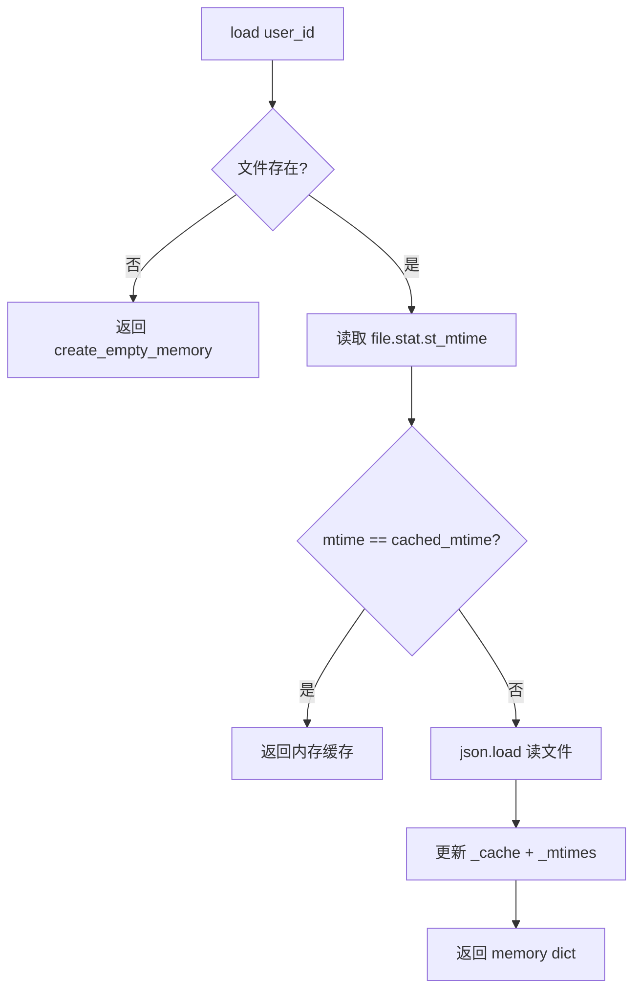
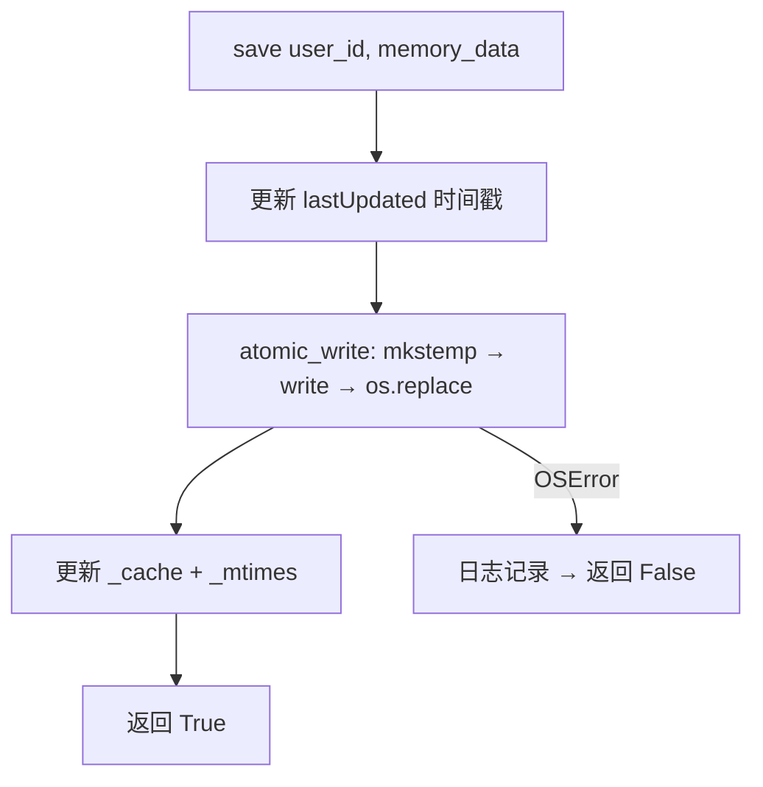

# PD-06.08 vibe-blog — JSON 文件记忆持久化与 mtime 缓存注入

> 文档编号：PD-06.08
> 来源：vibe-blog `backend/services/blog_generator/memory/storage.py`
> GitHub：https://github.com/datawhalechina/vibe-blog.git
> 问题域：PD-06 记忆持久化 Memory Persistence
> 状态：可复用方案

---

## 第 1 章 问题与动机

### 1.1 核心问题

多用户博客生成系统中，每个用户的写作偏好、历史主题、关键事实需要跨会话持久化。
如果不做记忆持久化，每次生成都是"失忆"状态——无法利用用户过往的风格偏好和主题积累，
导致重复询问、风格不一致、内容重复等问题。

vibe-blog 面临的具体挑战：
- **多用户隔离**：不同用户的记忆不能交叉污染
- **高频读低频写**：生成过程中多次读取记忆（Writer/Planner/Researcher 都需要），但写入只在事实提取时发生
- **数据安全**：写入中断不能导致记忆文件损坏
- **轻量部署**：不依赖外部数据库，单机 JSON 文件即可运行

### 1.2 vibe-blog 的解法概述

1. **按用户隔离的 JSON 文件存储**：每个用户一个 `{user_id}.json` 文件，路径安全过滤防止目录穿越（`storage.py:63`）
2. **mtime 缓存机制**：通过文件修改时间戳判断是否需要重新读取，避免同一生成流程中重复 I/O（`storage.py:70-76`）
3. **原子写入保护**：调用 `atomic_write()` 实现 temp+rename 模式，防止写入中断导致数据损坏（`storage.py:97-99`）
4. **结构化记忆模型**：writingProfile + topicHistory + qualityPreferences + facts 四层结构，覆盖偏好、历史、质量、事实（`storage.py:22-42`）
5. **Prompt 注入格式化**：`format_for_injection()` 将记忆转为 `<user-memory>` XML 标签注入 Writer 的 background_knowledge（`storage.py:167-212`）

### 1.3 设计思想

| 设计原则 | 具体实现 | 理由 | 替代方案 |
|----------|----------|------|----------|
| 用户隔离 | 每用户独立 JSON 文件 | 零配置、无需数据库、天然隔离 | SQLite 多表 / Redis hash |
| 读缓存 | mtime 比对 + 内存 dict | 同一进程内多次 load 不重复 I/O | LRU cache / TTL 过期 |
| 写安全 | temp file + os.replace | POSIX 原子操作，断电不丢数据 | WAL 日志 / 数据库事务 |
| 容量控制 | max_facts=200 + 低置信度淘汰 | 防止事实列表无限膨胀 | 时间衰减 / 向量去重 |
| 配置外置 | dataclass + from_env() | 8 项参数全部可通过环境变量覆盖 | YAML 配置文件 / CLI 参数 |
| 注入解耦 | format_for_injection() 独立方法 | 记忆格式化与存储逻辑分离 | 在 Writer 内部拼接 |

---

## 第 2 章 源码实现分析

### 2.1 架构概览

vibe-blog 的记忆系统由三个文件组成，职责清晰分离：

```
┌─────────────────────────────────────────────────────────┐
│                    BlogGenerator                         │
│  generator.py:186-194                                    │
│  ┌─────────────────┐                                     │
│  │ _memory_storage  │──── MemoryStorage 实例              │
│  └────────┬────────┘                                     │
│           │                                              │
│  _writer_node() ──→ format_for_injection(user_id)        │
│           │              │                               │
│           │              ▼                               │
│           │    state['background_knowledge'] += memory    │
│           │                                              │
│           ▼                                              │
│  WriterAgent.write_section(background_knowledge=...)     │
└─────────────────────────────────────────────────────────┘

┌─────────────────────────────────────────────────────────┐
│              MemoryStorage (storage.py)                   │
│                                                          │
│  _base_path: Path        ← data/memory/                  │
│  _cache: Dict[str,dict]  ← 内存缓存                      │
│  _mtimes: Dict[str,float]← mtime 时间戳                  │
│                                                          │
│  load(user_id) ──→ mtime 比对 → 命中缓存 / 读文件         │
│  save(user_id) ──→ atomic_write → 更新缓存+mtime         │
│  add_fact()    ──→ load → append → 容量淘汰 → save        │
│  format_for_injection() ──→ load → 格式化 XML 片段        │
└─────────────────────────────────────────────────────────┘

┌─────────────────────────────────────────────────────────┐
│           BlogMemoryConfig (config.py)                    │
│                                                          │
│  @dataclass: 8 项配置                                     │
│  from_env() ──→ 环境变量覆盖                              │
└─────────────────────────────────────────────────────────┘

┌─────────────────────────────────────────────────────────┐
│           atomic_write (utils/atomic_write.py)            │
│                                                          │
│  tempfile.mkstemp → write → os.replace                   │
└─────────────────────────────────────────────────────────┘
```

### 2.2 核心实现

#### 2.2.1 mtime 缓存加载



对应源码 `backend/services/blog_generator/memory/storage.py:66-91`：

```python
def load(self, user_id: str) -> dict:
    """加载用户记忆（带 mtime 缓存）"""
    file_path = self._user_file(user_id)
    try:
        current_mtime = file_path.stat().st_mtime if file_path.exists() else None
    except OSError:
        current_mtime = None

    cached_mtime = self._mtimes.get(user_id)
    if user_id in self._cache and cached_mtime == current_mtime:
        return self._cache[user_id]

    if not file_path.exists():
        memory = create_empty_memory(user_id)
        self._cache[user_id] = memory
        return memory

    try:
        with open(file_path, encoding="utf-8") as f:
            memory = json.load(f)
        self._cache[user_id] = memory
        self._mtimes[user_id] = current_mtime
        return memory
    except (json.JSONDecodeError, OSError) as e:
        logger.error(f"记忆文件读取失败 [{user_id}]: {e}")
        return create_empty_memory(user_id)
```

关键设计点：
- `st_mtime` 比对是 O(1) 系统调用，比每次 json.load 快几个数量级
- JSON 解析失败时降级返回空记忆，不抛异常阻断生成流程
- 文件不存在时自动创建空结构并缓存，首次用户零配置

#### 2.2.2 原子写入 + 容量淘汰



对应源码 `backend/services/blog_generator/memory/storage.py:93-105` + `backend/utils/atomic_write.py:6-18`：

```python
# storage.py:93-105
def save(self, user_id: str, memory_data: dict) -> bool:
    """原子写入用户记忆"""
    file_path = self._user_file(user_id)
    try:
        from utils.atomic_write import atomic_write
        memory_data["lastUpdated"] = datetime.now(timezone.utc).isoformat()
        atomic_write(str(file_path), json.dumps(memory_data, indent=2, ensure_ascii=False))
        self._cache[user_id] = memory_data
        self._mtimes[user_id] = file_path.stat().st_mtime
        return True
    except OSError as e:
        logger.error(f"记忆文件写入失败 [{user_id}]: {e}")
        return False

# atomic_write.py:6-18
def atomic_write(filepath: str, content: str, encoding: str = 'utf-8'):
    """原子文件写入：先写临时文件，再 rename 替换。"""
    dir_name = os.path.dirname(filepath)
    os.makedirs(dir_name, exist_ok=True)
    fd, tmp_path = tempfile.mkstemp(dir=dir_name, suffix='.tmp')
    try:
        with os.fdopen(fd, 'w', encoding=encoding) as f:
            f.write(content)
        os.replace(tmp_path, filepath)
    except Exception:
        if os.path.exists(tmp_path):
            os.unlink(tmp_path)
        raise
```

事实容量淘汰逻辑 `storage.py:107-135`：

```python
def add_fact(self, user_id, content, category="preference",
             confidence=0.9, source="", max_facts=200):
    memory = self.load(user_id)
    fact_id = f"fact_{uuid.uuid4().hex[:8]}"
    fact = {
        "id": fact_id, "content": content, "category": category,
        "confidence": confidence,
        "createdAt": datetime.now(timezone.utc).isoformat(),
        "source": source,
    }
    memory["facts"].append(fact)
    # 超过上限时移除最旧的低置信度事实
    if len(memory["facts"]) > max_facts:
        memory["facts"].sort(key=lambda f: f.get("confidence", 0))
        memory["facts"] = memory["facts"][-max_facts:]
    self.save(user_id, memory)
    return fact_id
```

### 2.3 实现细节

#### 记忆注入到 Writer 的完整链路

记忆注入发生在 `generator.py:413-423` 的 `_writer_node` 中：

```python
# generator.py:413-423
if self._memory_storage:
    try:
        user_id = state.get('user_id', 'default')
        memory_injection = self._memory_storage.format_for_injection(user_id)
        if memory_injection:
            bg = state.get('background_knowledge', '')
            state['background_knowledge'] = bg + "\n\n" + memory_injection if bg else memory_injection
            logger.info(f"注入用户记忆: {len(memory_injection)} 字符")
    except Exception as e:
        logger.debug(f"用户记忆注入跳过: {e}")
```

`format_for_injection()` 的输出格式 `storage.py:167-212`：

```xml
<user-memory>
用户写作偏好:
- 写作风格: 轻松幽默，技术深度适中
- 文章长度: 3000-5000 字
- 目标受众: 中级开发者

主题历史:
- 近期主题: React, Next.js, TypeScript
- 核心领域: 前端工程化

关键事实:
- [preference] 偏好使用 TypeScript 而非 JavaScript
- [background] 在字节跳动工作，负责前端基础设施
</user-memory>
```

这段 XML 被拼接到 `background_knowledge` 字段，最终通过 `writer.j2` 模板注入到 Writer Agent 的 prompt 中。Writer 的 `write_section()` 方法接收 `background_knowledge` 参数（`agents/writer.py:113`），在 prompt 渲染时作为上下文传入。

#### 路径安全过滤

`storage.py:62-64` 对 user_id 做了基本的路径穿越防护：

```python
def _user_file(self, user_id: str) -> Path:
    safe_id = user_id.replace("/", "_").replace("..", "_")
    return self._base_path / f"{safe_id}.json"
```

#### 配置系统

`config.py:10-32` 使用 dataclass + `from_env()` 模式，8 项参数全部可通过环境变量覆盖：

| 参数 | 默认值 | 环境变量 |
|------|--------|----------|
| enabled | True | MEMORY_ENABLED |
| storage_backend | "json" | — |
| storage_path | "data/memory/" | MEMORY_STORAGE_PATH |
| debounce_seconds | 10 | MEMORY_DEBOUNCE_SECONDS |
| max_facts | 200 | MEMORY_MAX_FACTS |
| fact_confidence_threshold | 0.7 | MEMORY_FACT_THRESHOLD |
| injection_enabled | True | MEMORY_INJECTION_ENABLED |
| max_injection_tokens | 1500 | MEMORY_MAX_INJECTION_TOKENS |

注意 `storage_backend` 预留了 `"sqlite"` 选项但尚未实现，体现了渐进式设计思路。

---

## 第 3 章 迁移指南

### 3.1 迁移清单

**阶段 1：基础存储（1 个文件）**
- [ ] 创建 `memory/storage.py`，实现 MemoryStorage 类
- [ ] 实现 `create_empty_memory()` 定义记忆结构
- [ ] 实现 `load()` + mtime 缓存
- [ ] 实现 `save()` + 原子写入（复用或新建 `atomic_write` 工具）
- [ ] 实现 `add_fact()` + 容量淘汰

**阶段 2：注入管道（2 个改动点）**
- [ ] 实现 `format_for_injection()` 格式化记忆为 prompt 片段
- [ ] 在 Agent 入口节点（如 Writer）注入记忆到 background_knowledge
- [ ] 添加 try/except 降级保护，记忆注入失败不阻断主流程

**阶段 3：配置化（1 个文件）**
- [ ] 创建 `memory/config.py`，dataclass + from_env()
- [ ] 添加 MEMORY_ENABLED 环境变量开关
- [ ] 在 Generator 初始化时按配置创建 MemoryStorage

### 3.2 适配代码模板

以下代码可直接复用，适配任何 Python Agent 系统：

```python
"""memory_storage.py — 可移植的 JSON 文件记忆存储"""
import json
import os
import tempfile
import uuid
from datetime import datetime, timezone
from pathlib import Path
from typing import Dict, List, Optional


def atomic_write(filepath: str, content: str, encoding: str = "utf-8"):
    """原子写入：temp + os.replace"""
    dir_name = os.path.dirname(filepath)
    os.makedirs(dir_name, exist_ok=True)
    fd, tmp = tempfile.mkstemp(dir=dir_name, suffix=".tmp")
    try:
        with os.fdopen(fd, "w", encoding=encoding) as f:
            f.write(content)
        os.replace(tmp, filepath)
    except Exception:
        if os.path.exists(tmp):
            os.unlink(tmp)
        raise


class MemoryStorage:
    """按用户隔离的 JSON 文件记忆存储，带 mtime 缓存"""

    def __init__(self, base_path: str = "data/memory/", max_facts: int = 200):
        self._base = Path(base_path)
        self._base.mkdir(parents=True, exist_ok=True)
        self._cache: Dict[str, dict] = {}
        self._mtimes: Dict[str, float] = {}
        self.max_facts = max_facts

    def _path(self, uid: str) -> Path:
        safe = uid.replace("/", "_").replace("..", "_")
        return self._base / f"{safe}.json"

    def load(self, uid: str) -> dict:
        fp = self._path(uid)
        try:
            mt = fp.stat().st_mtime if fp.exists() else None
        except OSError:
            mt = None
        if uid in self._cache and self._mtimes.get(uid) == mt:
            return self._cache[uid]
        if not fp.exists():
            mem = {"userId": uid, "facts": [], "profile": {}}
            self._cache[uid] = mem
            return mem
        try:
            mem = json.loads(fp.read_text("utf-8"))
            self._cache[uid] = mem
            self._mtimes[uid] = mt
            return mem
        except (json.JSONDecodeError, OSError):
            return {"userId": uid, "facts": [], "profile": {}}

    def save(self, uid: str, data: dict) -> bool:
        fp = self._path(uid)
        try:
            data["lastUpdated"] = datetime.now(timezone.utc).isoformat()
            atomic_write(str(fp), json.dumps(data, indent=2, ensure_ascii=False))
            self._cache[uid] = data
            self._mtimes[uid] = fp.stat().st_mtime
            return True
        except OSError:
            return False

    def add_fact(self, uid: str, content: str, category: str = "general",
                 confidence: float = 0.9) -> str:
        mem = self.load(uid)
        fid = f"fact_{uuid.uuid4().hex[:8]}"
        mem.setdefault("facts", []).append({
            "id": fid, "content": content, "category": category,
            "confidence": confidence,
            "createdAt": datetime.now(timezone.utc).isoformat(),
        })
        if len(mem["facts"]) > self.max_facts:
            mem["facts"].sort(key=lambda f: f.get("confidence", 0))
            mem["facts"] = mem["facts"][-self.max_facts:]
        self.save(uid, mem)
        return fid

    def format_for_injection(self, uid: str) -> str:
        mem = self.load(uid)
        facts = mem.get("facts", [])
        if not facts:
            return ""
        top = sorted(facts, key=lambda f: f.get("confidence", 0), reverse=True)[:10]
        lines = [f"- [{f['category']}] {f['content']}" for f in top]
        return "<user-memory>\n" + "\n".join(lines) + "\n</user-memory>"
```

**Agent 侧注入（2 行代码）：**

```python
# 在你的 Agent 入口节点中
memory_text = memory_storage.format_for_injection(user_id)
if memory_text:
    state["background_knowledge"] += "\n\n" + memory_text
```

### 3.3 适用场景

| 场景 | 适用度 | 说明 |
|------|--------|------|
| 单机多用户 Agent | ⭐⭐⭐ | 零依赖、文件隔离、即开即用 |
| 低频写入高频读取 | ⭐⭐⭐ | mtime 缓存完美匹配此模式 |
| 容器化部署 | ⭐⭐ | 需挂载持久卷，否则重启丢失 |
| 高并发写入 | ⭐ | 无文件锁，多进程写同一用户可能丢数据 |
| 分布式多实例 | ⭐ | 无跨实例同步机制，需升级到 Redis/DB |
| 事实量 > 1000 | ⭐ | JSON 全量读写，大文件性能下降 |

---

## 第 4 章 测试用例

```python
"""test_memory_storage.py — 基于 vibe-blog MemoryStorage 的测试"""
import json
import os
import tempfile
import pytest


class TestMemoryStorage:
    """测试 MemoryStorage 核心功能"""

    @pytest.fixture
    def storage(self, tmp_path):
        from memory_storage import MemoryStorage
        return MemoryStorage(base_path=str(tmp_path), max_facts=5)

    def test_load_creates_empty_memory(self, storage):
        """首次加载应返回空记忆结构"""
        mem = storage.load("user_001")
        assert mem["userId"] == "user_001"
        assert mem["facts"] == []

    def test_save_and_load_roundtrip(self, storage):
        """保存后加载应返回相同数据"""
        mem = storage.load("user_002")
        mem["profile"] = {"style": "casual"}
        storage.save("user_002", mem)
        loaded = storage.load("user_002")
        assert loaded["profile"]["style"] == "casual"
        assert "lastUpdated" in loaded

    def test_mtime_cache_hit(self, storage):
        """未修改文件时应命中缓存"""
        storage.load("user_003")
        storage.save("user_003", {"userId": "user_003", "facts": []})
        # 第二次 load 应命中 mtime 缓存
        mem = storage.load("user_003")
        assert mem["userId"] == "user_003"

    def test_add_fact_with_capacity_eviction(self, storage):
        """超过 max_facts 时应淘汰低置信度事实"""
        for i in range(7):
            storage.add_fact("user_004", f"fact_{i}", confidence=0.1 * i)
        mem = storage.load("user_004")
        assert len(mem["facts"]) == 5  # max_facts=5
        # 最低置信度的应被淘汰
        confidences = [f["confidence"] for f in mem["facts"]]
        assert min(confidences) >= 0.2  # 0.0 和 0.1 被淘汰

    def test_atomic_write_safety(self, storage, tmp_path):
        """原子写入应保证文件完整性"""
        storage.save("user_005", {"userId": "user_005", "facts": [{"id": "f1", "content": "test"}]})
        fp = tmp_path / "user_005.json"
        assert fp.exists()
        data = json.loads(fp.read_text("utf-8"))
        assert data["facts"][0]["content"] == "test"

    def test_format_for_injection_empty(self, storage):
        """无事实时应返回空字符串"""
        result = storage.format_for_injection("user_006")
        assert result == ""

    def test_format_for_injection_with_facts(self, storage):
        """有事实时应返回 XML 格式"""
        storage.add_fact("user_007", "likes Python", category="preference")
        result = storage.format_for_injection("user_007")
        assert "<user-memory>" in result
        assert "[preference] likes Python" in result

    def test_path_traversal_prevention(self, storage):
        """路径穿越字符应被过滤"""
        mem = storage.load("../../etc/passwd")
        assert mem["userId"] == "../../etc/passwd"
        # 实际文件名应被安全化
        safe_path = storage._path("../../etc/passwd")
        assert ".." not in safe_path.name

    def test_corrupted_file_degradation(self, storage, tmp_path):
        """损坏的 JSON 文件应降级返回空记忆"""
        fp = tmp_path / "user_008.json"
        fp.write_text("NOT VALID JSON {{{", encoding="utf-8")
        mem = storage.load("user_008")
        assert mem["facts"] == []  # 降级为空记忆
```

---

## 第 5 章 跨域关联

| 关联域 | 关系类型 | 说明 |
|--------|----------|------|
| PD-01 上下文管理 | 协同 | 记忆注入增加 background_knowledge 长度，需配合 PD-01 的 token 预算控制（`max_injection_tokens=1500`） |
| PD-03 容错与重试 | 依赖 | 原子写入（atomic_write）是容错的基础设施，记忆读取失败降级为空记忆也是容错模式 |
| PD-04 工具系统 | 协同 | `add_fact()` 可封装为 Agent 工具，让 LLM 主动记录事实；当前 vibe-blog 未实现此路径 |
| PD-07 质量检查 | 协同 | qualityPreferences 中的 feedbackHistory 可供 Reviewer 参考历史审核偏好 |
| PD-10 中间件管道 | 协同 | 记忆注入发生在 `_writer_node` 内部而非中间件层；可考虑抽取为 MemoryInjectionMiddleware |
| PD-11 可观测性 | 协同 | 注入时记录字符数（`logger.info(f"注入用户记忆: {len(memory_injection)} 字符")`），可扩展为 metrics |

---

## 第 6 章 来源文件索引

| 文件 | 行范围 | 关键实现 |
|------|--------|----------|
| `backend/services/blog_generator/memory/storage.py` | L1-L227 | MemoryStorage 完整实现：mtime 缓存、原子写入、事实管理、注入格式化 |
| `backend/services/blog_generator/memory/config.py` | L1-L33 | BlogMemoryConfig dataclass + from_env() 环境变量配置 |
| `backend/services/blog_generator/memory/__init__.py` | L1-L5 | 模块导出 |
| `backend/utils/atomic_write.py` | L1-L19 | atomic_write() 原子文件写入工具 |
| `backend/services/blog_generator/generator.py` | L186-L194 | BlogGenerator 中 MemoryStorage 初始化 |
| `backend/services/blog_generator/generator.py` | L413-L423 | _writer_node 中记忆注入到 background_knowledge |
| `backend/services/blog_generator/agents/writer.py` | L108-L113 | WriterAgent.write_section() 接收 background_knowledge 参数 |

---

## 第 7 章 横向对比维度

> **重要：** 本章用于自动填充 Butcher Wiki 的横向对比表。

```json comparison_data
{
  "project": "vibe-blog",
  "dimensions": {
    "记忆结构": "四层结构：writingProfile + topicHistory + qualityPreferences + facts",
    "更新机制": "add_fact 追加 + 低置信度淘汰（max_facts=200）",
    "事实提取": "手动 add_fact API，支持 category/confidence 标注",
    "存储方式": "按用户隔离 JSON 文件（{user_id}.json）",
    "注入方式": "format_for_injection → XML 标签注入 background_knowledge",
    "生命周期管理": "无过期机制，容量淘汰替代时间衰减",
    "并发安全": "单进程 mtime 缓存安全，多进程无文件锁",
    "缓存失效策略": "mtime 比对：文件未修改则命中内存缓存",
    "记忆检索": "按 category 线性过滤 + confidence 排序取 Top-10"
  }
}
```

### 域元数据补充

```json domain_metadata
{
  "solution_summary": "vibe-blog 用按用户隔离的 JSON 文件 + mtime 缓存 + atomic_write 原子写入实现轻量记忆持久化，通过 XML 标签注入 Writer 的 background_knowledge",
  "description": "轻量级文件存储场景下的记忆持久化与 prompt 注入管道设计",
  "sub_problems": [
    "写作偏好 profile 结构化：如何将风格/长度/受众/配图等多维偏好组织为可查询的结构",
    "记忆注入 token 预算：注入内容超过 max_injection_tokens 时的截断策略"
  ],
  "best_practices": [
    "mtime 缓存避免重复 I/O：同一进程内多次 load 只需一次 stat 系统调用",
    "记忆注入与存储解耦：format_for_injection 独立于 load/save，便于替换注入格式",
    "环境变量开关保护：MEMORY_ENABLED 默认关闭，显式启用才加载记忆模块"
  ]
}
```
