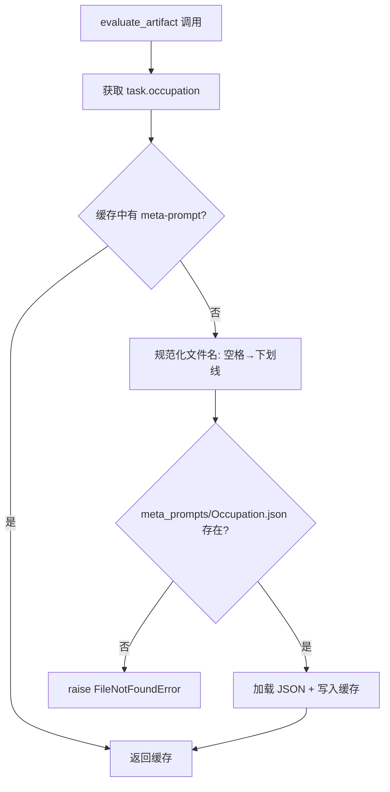
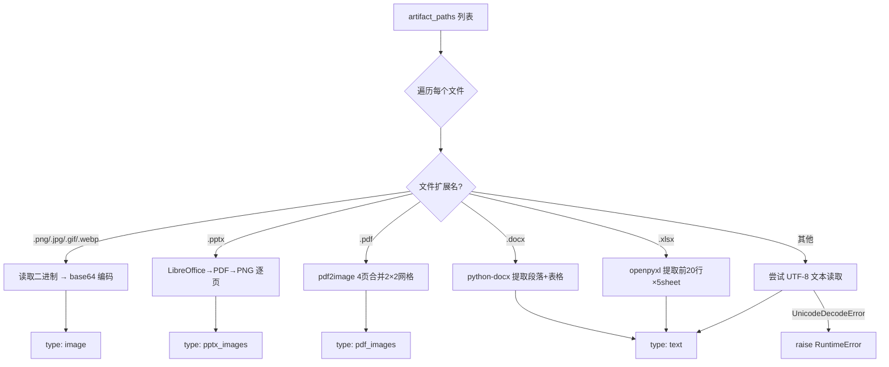
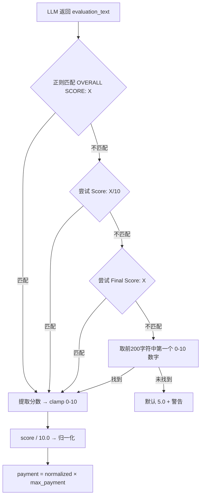

# PD-07.09 ClawWork — 职业分类 Rubric 多维 LLM 评分与经济支付闭环

> 文档编号：PD-07.09
> 来源：ClawWork `livebench/work/llm_evaluator.py`, `livebench/work/evaluator.py`, `eval/meta_prompts/`
> GitHub：https://github.com/HKUDS/ClawWork.git
> 问题域：PD-07 质量检查 Quality Assurance
> 状态：可复用方案

---

## 第 1 章 问题与动机（≥ 30 行）

### 1.1 核心问题

当 Agent 完成真实世界的工作任务（写代码、做报表、写法律文书等）后，如何客观、可量化地评估产物质量？传统的启发式检查（文件大小、关键词匹配）无法覆盖 44 个职业类别的专业标准差异。更关键的是，评分直接关联经济支付——评分不准意味着要么浪费资金（低质量产物获得高报酬），要么打击 Agent 积极性（高质量产物被低估）。

ClawWork 面临的具体挑战：
1. **职业多样性**：44 个职业类别（从软件开发到护士、律师、房产经纪），每个职业的"好"标准完全不同
2. **产物多模态**：Agent 提交的可能是代码、DOCX、XLSX、PPTX、PDF、图片等多种格式
3. **评分-支付耦合**：评分直接决定 Agent 是否获得报酬，0.6 分以下零支付
4. **无降级容忍**：系统明确移除了启发式评估的 fallback，LLM 评估失败则直接报错

### 1.2 ClawWork 的解法概述

ClawWork 构建了一套 **职业分类专属 meta-prompt rubric + 多模态 LLM 评估 + 经济支付闭环** 的质量检查体系：

1. **44 个职业专属 rubric**：用 GPT-5.2 为每个职业类别生成独立的评估 prompt + 4 维度加权评分标准（`eval/generate_meta_prompts.py:46-178`）
2. **4 维度加权评分**：completeness(40%) + correctness(30%) + quality(20%) + domain_standards(10%)，0-10 分制（`eval/meta_prompts/Software_Developers.json:4-60`）
3. **多模态产物读取**：支持图片 base64 编码、PPTX→PDF→PNG 转换、PDF 4 页合并为 2×2 网格，优化 token 消耗（`livebench/work/llm_evaluator.py:374-512`）
4. **严格无降级策略**：移除所有启发式 fallback，LLM 评估失败直接抛异常（`livebench/work/evaluator.py:43-47`）
5. **经济支付闭环**：评分 ≥ 0.6 才发放报酬，低于阈值零支付，所有记录写入 JSONL 审计日志（`livebench/agent/economic_tracker.py:358-395`）

### 1.3 设计思想

| 设计原则 | 具体实现 | 理由 | 替代方案 |
|----------|----------|------|----------|
| 职业专属评估 | 44 个独立 meta-prompt JSON，每个含 rubric + checklist + failure modes | 不同职业的"好"标准差异巨大，通用 rubric 无法覆盖 | 单一通用 rubric（精度低） |
| 加权多维评分 | completeness 40% + correctness 30% + quality 20% + domain 10% | completeness 最重要——缺文件直接 0-2 分 | 单一总分（无法定位问题） |
| 多模态原生支持 | 图片 base64 + PPTX/PDF 转 PNG + OpenAI vision API | Agent 产物不只是文本，PPTX/PDF 必须视觉评估 | 仅文本评估（丢失视觉信息） |
| 无降级强制 LLM | 移除 heuristic fallback，失败直接 raise | 启发式评估质量不可控，宁可失败也不误判 | 保留 fallback（评分不一致） |
| 评分-支付硬阈值 | score < 0.6 → payment = 0 | 防止低质量产物消耗经济资源 | 线性支付（无质量门槛） |

---

## 第 2 章 源码实现分析（≥ 60 行，核心章节）

### 2.1 架构概览

ClawWork 的评估系统由三层组成：WorkEvaluator（入口）→ LLMEvaluator（核心）→ EconomicTracker（支付）。

```
┌─────────────────────────────────────────────────────────────────┐
│                      WorkEvaluator (入口层)                      │
│  livebench/work/evaluator.py                                    │
│  - 文件存在性检查、空文件检查                                      │
│  - 委托 LLMEvaluator 执行评估                                    │
│  - 评估日志写入 evaluations.jsonl                                 │
└──────────────────────┬──────────────────────────────────────────┘
                       │ evaluate_artifact()
                       ▼
┌─────────────────────────────────────────────────────────────────┐
│                     LLMEvaluator (核心层)                        │
│  livebench/work/llm_evaluator.py                                │
│  - 加载职业专属 meta-prompt（44 个 JSON）                         │
│  - 多模态产物读取（图片/PPTX/PDF/DOCX/XLSX）                     │
│  - 构建 multimodal evaluation content                           │
│  - 调用 GPT-4o 评估 → 提取 0-10 分                              │
│  - 归一化为 0.0-1.0 → 计算支付金额                               │
└──────────────────────┬──────────────────────────────────────────┘
                       │ score, feedback, payment
                       ▼
┌─────────────────────────────────────────────────────────────────┐
│                   EconomicTracker (支付层)                        │
│  livebench/agent/economic_tracker.py                            │
│  - 评分阈值检查（≥ 0.6 才支付）                                   │
│  - 余额更新 + 生存状态计算                                       │
│  - 成本追踪（LLM/Search/OCR 分通道）                             │
│  - JSONL 审计日志                                                │
└─────────────────────────────────────────────────────────────────┘
```

### 2.2 核心实现

#### 2.2.1 职业专属 Meta-Prompt 加载与缓存



对应源码 `livebench/work/llm_evaluator.py:197-232`：

```python
def _load_meta_prompt(self, occupation: str) -> Optional[Dict]:
    """Load meta-prompt for a specific occupation category"""
    # Normalize occupation name to match file naming
    normalized = occupation.replace(' ', '_').replace(',', '')
    
    # Check cache first
    if normalized in self._meta_prompt_cache:
        return self._meta_prompt_cache[normalized]
    
    # Try to find matching meta-prompt file
    meta_prompt_path = self.meta_prompts_dir / f"{normalized}.json"
    
    if not meta_prompt_path.exists():
        print(f"⚠️ No meta-prompt found for occupation: {occupation}")
        return None
    
    # Load and cache
    try:
        with open(meta_prompt_path, 'r', encoding='utf-8') as f:
            meta_prompt = json.load(f)
        self._meta_prompt_cache[normalized] = meta_prompt
        return meta_prompt
    except Exception as e:
        print(f"⚠️ Error loading meta-prompt for {occupation}: {e}")
        return None
```

关键设计：meta-prompt 缓存避免重复 IO，文件名规范化处理空格和逗号（如 `"Child, Family, and School Social Workers"` → `Child_Family_and_School_Social_Workers.json`）。

#### 2.2.2 多模态产物读取与 Token 优化



对应源码 `livebench/work/llm_evaluator.py:374-512`：

```python
def _read_artifacts_with_images(self, artifact_paths: list[str], max_size_kb: int = 2000) -> Dict[str, Dict[str, Union[str, bytes]]]:
    artifacts = {}
    for path in artifact_paths:
        file_size = os.path.getsize(path)
        file_ext = os.path.splitext(path)[1].lower()
        
        # 严格大小限制：超过 2MB 直接 raise
        if file_size > max_size_kb * 1024:
            raise RuntimeError(f"File too large: {file_size} bytes (>{max_size_kb}KB)")
        if file_size == 0:
            raise ValueError(f"Empty file submitted for evaluation: {path}")
        
        # 图片：直接读取二进制
        if file_ext in ['.png', '.jpg', '.jpeg', '.gif', '.webp']:
            with open(path, 'rb') as f:
                image_data = f.read()
            artifacts[path] = {'type': 'image', 'format': file_ext[1:], 'data': image_data, 'size': file_size}
        
        # PPTX：LibreOffice → PDF → PNG（逐页）
        elif file_ext == '.pptx':
            from livebench.tools.productivity.file_reading import read_pptx_as_images
            pptx_images = read_pptx_as_images(Path(path))
            if not pptx_images:
                raise RuntimeError(f"PPTX conversion failed for {path}")
            artifacts[path] = {'type': 'pptx_images', 'images': pptx_images, 'slide_count': len(pptx_images)}
        
        # PDF：4 页合并为 2×2 网格（节省 token）
        elif file_ext == '.pdf':
            from livebench.tools.productivity.file_reading import read_pdf_as_images
            pdf_images = read_pdf_as_images(Path(path))
            if not pdf_images:
                raise RuntimeError(f"PDF conversion failed for {path}")
            artifacts[path] = {'type': 'pdf_images', 'images': pdf_images, 'image_count': len(pdf_images)}
    return artifacts
```

PDF 的 4 页合并策略（`livebench/tools/productivity/file_reading.py:410-452`）是一个精巧的 token 优化：将每 4 页缩放到 600px 宽后拼成 2×2 网格，一张图传递 4 页内容，显著减少 vision API 的 token 消耗。

#### 2.2.3 评分提取与多模式正则匹配



对应源码 `livebench/work/llm_evaluator.py:742-780`：

```python
def _extract_score(self, evaluation_text: str) -> float:
    import re
    patterns = [
        r'OVERALL SCORE:\s*(\d+(?:\.\d+)?)',
        r'Overall Score:\s*(\d+(?:\.\d+)?)',
        r'Score:\s*(\d+(?:\.\d+)?)/10',
        r'Final Score:\s*(\d+(?:\.\d+)?)',
    ]
    for pattern in patterns:
        match = re.search(pattern, evaluation_text, re.IGNORECASE)
        if match:
            score = float(match.group(1))
            return max(0.0, min(10.0, score))
    
    # Fallback: 前 200 字符中找 0-10 的数字
    first_part = evaluation_text[:200]
    numbers = re.findall(r'\b(\d+(?:\.\d+)?)\b', first_part)
    if numbers:
        score = float(numbers[0])
        if 0 <= score <= 10:
            return score
    
    print("⚠️ Could not extract score from evaluation, defaulting to 5.0")
    return 5.0
```

### 2.3 实现细节

**评估 API 隔离配置**（`livebench/work/llm_evaluator.py:44-70`）：评估使用独立的 API key（`EVALUATION_API_KEY`）和 base URL（`EVALUATION_API_BASE`），与 Agent 工作用的 LLM 分离。这防止评估模型和工作模型共享配额，也支持用不同模型做评估（如用 GPT-4o 评估 Claude 的产物）。

**严格无降级策略**（`livebench/work/evaluator.py:43-47`）：构造函数中 `use_llm_evaluation=False` 直接 raise ValueError，评估失败时 `llm_evaluator.py:194-195` 也直接 raise RuntimeError。系统注释明确标注 `# REMOVED: Heuristic evaluation methods` 和 `# REMOVED: Fallback evaluation method`。

**Critical Override 规则**：meta-prompt 中硬编码了"缺少任何必需文件 → 强制 0-2 分"的规则（`eval/meta_prompts/Software_Developers.json:86-93`），这是一个不可协商的评分覆盖，确保不完整的产物无法通过其他维度的高分来弥补。


---

## 第 3 章 迁移指南（≥ 40 行）

### 3.1 迁移清单

**阶段 1：Rubric 体系搭建**
- [ ] 定义你的任务分类体系（不一定是职业，可以是任务类型、难度等级等）
- [ ] 为每个分类编写 meta-prompt JSON（包含 evaluation_prompt、evaluation_rubric、file_inspection_checklist、common_failure_modes）
- [ ] 确定维度权重（ClawWork 用 40/30/20/10，可根据场景调整）
- [ ] 定义 Critical Override 规则（什么情况下强制低分）

**阶段 2：评估引擎实现**
- [ ] 实现 meta-prompt 加载器（文件名规范化 + 内存缓存）
- [ ] 实现多模态产物读取（至少支持文本 + 图片，按需加 PDF/PPTX）
- [ ] 实现 multimodal content 构建（OpenAI vision API 格式）
- [ ] 实现评分提取（多模式正则 + fallback）
- [ ] 配置独立的评估 API key（与工作 LLM 分离）

**阶段 3：支付闭环**
- [ ] 实现评分阈值检查（score < threshold → 零支付）
- [ ] 实现 JSONL 审计日志（评估记录 + 支付记录）
- [ ] 实现成本追踪（评估本身也消耗 token，需要计入成本）

### 3.2 适配代码模板

以下是一个可直接运行的简化版评估引擎，保留了 ClawWork 的核心设计：

```python
"""
Simplified LLM Evaluator — 基于 ClawWork 的职业分类 Rubric 评估模式
可直接运行，依赖：openai, python-dotenv
"""
import os
import re
import json
import base64
from pathlib import Path
from typing import Dict, List, Optional, Tuple
from openai import OpenAI
from dotenv import load_dotenv

load_dotenv()


class CategoryRubricEvaluator:
    """分类专属 Rubric 的 LLM 评估器"""

    def __init__(
        self,
        rubrics_dir: str = "./rubrics",
        model: str = "gpt-4o",
        payment_threshold: float = 0.6,
        max_payment: float = 50.0,
    ):
        self.rubrics_dir = Path(rubrics_dir)
        self.model = model
        self.payment_threshold = payment_threshold
        self.max_payment = max_payment
        self._cache: Dict[str, Dict] = {}

        # 评估用独立 API key
        api_key = os.getenv("EVALUATION_API_KEY") or os.getenv("OPENAI_API_KEY")
        base_url = os.getenv("EVALUATION_API_BASE") or os.getenv("OPENAI_API_BASE")
        self.client = OpenAI(api_key=api_key, base_url=base_url) if base_url else OpenAI(api_key=api_key)

    def load_rubric(self, category: str) -> Dict:
        """加载分类专属 rubric（带缓存）"""
        normalized = category.replace(" ", "_").replace(",", "")
        if normalized in self._cache:
            return self._cache[normalized]

        path = self.rubrics_dir / f"{normalized}.json"
        if not path.exists():
            raise FileNotFoundError(f"No rubric for category: {category}")

        with open(path, "r", encoding="utf-8") as f:
            rubric = json.load(f)
        self._cache[normalized] = rubric
        return rubric

    def read_artifact(self, path: str) -> Dict:
        """读取产物（文本或图片）"""
        ext = os.path.splitext(path)[1].lower()
        if ext in (".png", ".jpg", ".jpeg", ".gif", ".webp"):
            with open(path, "rb") as f:
                return {"type": "image", "format": ext[1:], "data": f.read()}
        with open(path, "r", encoding="utf-8") as f:
            return {"type": "text", "content": f.read()}

    def evaluate(
        self, category: str, task_prompt: str, artifact_paths: List[str], description: str = ""
    ) -> Tuple[float, str, float]:
        """
        评估产物，返回 (score_0_1, feedback, payment)
        """
        rubric = self.load_rubric(category)
        artifacts = {p: self.read_artifact(p) for p in artifact_paths if os.path.exists(p)}

        # 构建 multimodal content
        content: List[Dict] = []
        text = f"# EVALUATION\n\n## Rubric:\n{rubric.get('evaluation_prompt', '')}\n\n"
        text += f"## Task:\n{task_prompt}\n\n## Agent Description:\n{description}\n\n## Artifacts:\n"
        for p, a in artifacts.items():
            if a["type"] == "text":
                text += f"\n### {os.path.basename(p)}\n```\n{a['content']}\n```\n"
            else:
                text += f"\n### {os.path.basename(p)} [image below]\n"
        text += "\n\n**OVERALL SCORE:** [0-10]\n**FEEDBACK:** [explanation]\n"
        content.append({"type": "text", "text": text})

        # 添加图片
        for p, a in artifacts.items():
            if a["type"] == "image":
                b64 = base64.b64encode(a["data"]).decode()
                mime = {"png": "image/png", "jpg": "image/jpeg", "jpeg": "image/jpeg"}.get(a["format"], "image/png")
                content.append({"type": "image_url", "image_url": {"url": f"data:{mime};base64,{b64}", "detail": "high"}})

        resp = self.client.chat.completions.create(
            model=self.model,
            messages=[
                {"role": "system", "content": "You are an expert evaluator. Follow the rubric precisely."},
                {"role": "user", "content": content},
            ],
        )
        eval_text = resp.choices[0].message.content
        score_10 = self._extract_score(eval_text)
        score_01 = score_10 / 10.0
        payment = score_01 * self.max_payment if score_01 >= self.payment_threshold else 0.0
        return score_01, eval_text, payment

    @staticmethod
    def _extract_score(text: str) -> float:
        """多模式正则提取 0-10 分"""
        for pat in [r"OVERALL SCORE:\s*(\d+(?:\.\d+)?)", r"Score:\s*(\d+(?:\.\d+)?)/10"]:
            m = re.search(pat, text, re.IGNORECASE)
            if m:
                return max(0.0, min(10.0, float(m.group(1))))
        return 5.0  # fallback
```

### 3.3 适用场景

| 场景 | 适用度 | 说明 |
|------|--------|------|
| Agent 经济系统（评分→支付） | ⭐⭐⭐ | ClawWork 的核心场景，评分直接决定报酬 |
| 多职业/多类型任务评估 | ⭐⭐⭐ | 44 个分类 rubric 的设计模式可直接复用 |
| 多模态产物质量检查 | ⭐⭐⭐ | 图片/PDF/PPTX 的视觉评估能力独特 |
| 代码生成质量评估 | ⭐⭐ | Software_Developers rubric 可用，但缺少实际编译/运行验证 |
| 实时迭代改进（Generator-Critic） | ⭐ | ClawWork 是一次性评估，无迭代循环 |
| 低延迟场景 | ⭐ | 每次评估需要一次 GPT-4o 调用，延迟较高 |

---

## 第 4 章 测试用例（≥ 20 行）

```python
"""
Tests for ClawWork-style Category Rubric LLM Evaluator
基于 livebench/work/llm_evaluator.py 的真实函数签名
"""
import json
import os
import pytest
from unittest.mock import MagicMock, patch, mock_open
from pathlib import Path


class TestMetaPromptLoading:
    """测试 meta-prompt 加载与缓存"""

    def test_load_existing_category(self, tmp_path):
        """正常加载已有职业分类的 rubric"""
        rubric = {"category": "Software_Developers", "evaluation_prompt": "test"}
        (tmp_path / "Software_Developers.json").write_text(json.dumps(rubric))

        from livebench.work.llm_evaluator import LLMEvaluator
        evaluator = LLMEvaluator.__new__(LLMEvaluator)
        evaluator.meta_prompts_dir = tmp_path
        evaluator._meta_prompt_cache = {}

        result = evaluator._load_meta_prompt("Software Developers")
        assert result["category"] == "Software_Developers"

    def test_cache_hit(self, tmp_path):
        """第二次加载应命中缓存，不读文件"""
        from livebench.work.llm_evaluator import LLMEvaluator
        evaluator = LLMEvaluator.__new__(LLMEvaluator)
        evaluator.meta_prompts_dir = tmp_path
        evaluator._meta_prompt_cache = {"Software_Developers": {"cached": True}}

        result = evaluator._load_meta_prompt("Software Developers")
        assert result["cached"] is True

    def test_missing_category_returns_none(self, tmp_path):
        """不存在的职业分类返回 None"""
        from livebench.work.llm_evaluator import LLMEvaluator
        evaluator = LLMEvaluator.__new__(LLMEvaluator)
        evaluator.meta_prompts_dir = tmp_path
        evaluator._meta_prompt_cache = {}

        result = evaluator._load_meta_prompt("Nonexistent_Category")
        assert result is None

    def test_comma_normalization(self, tmp_path):
        """含逗号的职业名正确规范化"""
        rubric = {"category": "Child Family and School Social Workers"}
        (tmp_path / "Child_Family_and_School_Social_Workers.json").write_text(json.dumps(rubric))

        from livebench.work.llm_evaluator import LLMEvaluator
        evaluator = LLMEvaluator.__new__(LLMEvaluator)
        evaluator.meta_prompts_dir = tmp_path
        evaluator._meta_prompt_cache = {}

        result = evaluator._load_meta_prompt("Child, Family, and School Social Workers")
        assert result is not None


class TestScoreExtraction:
    """测试评分提取的多模式正则"""

    def test_standard_format(self):
        from livebench.work.llm_evaluator import LLMEvaluator
        evaluator = LLMEvaluator.__new__(LLMEvaluator)
        assert evaluator._extract_score("**OVERALL SCORE:** 7") == 7.0

    def test_slash_format(self):
        from livebench.work.llm_evaluator import LLMEvaluator
        evaluator = LLMEvaluator.__new__(LLMEvaluator)
        assert evaluator._extract_score("Score: 8.5/10") == 8.5

    def test_clamp_above_10(self):
        from livebench.work.llm_evaluator import LLMEvaluator
        evaluator = LLMEvaluator.__new__(LLMEvaluator)
        assert evaluator._extract_score("OVERALL SCORE: 15") == 10.0

    def test_fallback_default(self):
        from livebench.work.llm_evaluator import LLMEvaluator
        evaluator = LLMEvaluator.__new__(LLMEvaluator)
        assert evaluator._extract_score("No score here at all in this text") == 5.0


class TestPaymentThreshold:
    """测试评分-支付阈值逻辑"""

    def test_above_threshold_pays(self):
        """评分 ≥ 0.6 应获得支付"""
        from livebench.agent.economic_tracker import EconomicTracker
        tracker = EconomicTracker.__new__(EconomicTracker)
        tracker.min_evaluation_threshold = 0.6
        tracker.current_balance = 1000.0
        tracker.total_work_income = 0.0
        tracker.current_task_date = "2026-01-01"
        tracker.token_costs_file = "/dev/null"
        tracker.data_path = "/tmp"

        payment = tracker.add_work_income(50.0, "task-1", 0.8, "good work")
        assert payment == 50.0

    def test_below_threshold_zero(self):
        """评分 < 0.6 应零支付"""
        from livebench.agent.economic_tracker import EconomicTracker
        tracker = EconomicTracker.__new__(EconomicTracker)
        tracker.min_evaluation_threshold = 0.6
        tracker.current_balance = 1000.0
        tracker.total_work_income = 0.0
        tracker.current_task_date = "2026-01-01"
        tracker.token_costs_file = "/dev/null"
        tracker.data_path = "/tmp"

        payment = tracker.add_work_income(50.0, "task-2", 0.4, "poor work")
        assert payment == 0.0


class TestNoFallback:
    """测试无降级策略"""

    def test_heuristic_disabled(self):
        """use_llm_evaluation=False 应直接报错"""
        from livebench.work.evaluator import WorkEvaluator
        with pytest.raises(ValueError, match="use_llm_evaluation must be True"):
            WorkEvaluator(use_llm_evaluation=False)
```


---

## 第 5 章 跨域关联

| 关联域 | 关系类型 | 说明 |
|--------|----------|------|
| PD-01 上下文管理 | 协同 | 多模态评估（图片+文本）构建的 prompt 可能很长，PDF 4 页合并策略是上下文压缩的实例 |
| PD-03 容错与重试 | 互斥 | ClawWork 明确移除了评估 fallback，与"优雅降级"理念相反，选择了"宁可失败也不误判" |
| PD-04 工具系统 | 依赖 | 多模态产物读取依赖 file_reading.py 的工具函数（read_pptx_as_images, read_pdf_as_images） |
| PD-06 记忆持久化 | 协同 | 评估日志（evaluations.jsonl）和经济记录（balance.jsonl, token_costs.jsonl）是持久化记忆的实例 |
| PD-11 可观测性 | 协同 | EconomicTracker 的四通道成本追踪（LLM/Search/OCR/Other）+ LiveBenchLogger 的 JSONL 结构化日志 |

---

## 第 6 章 来源文件索引

| 文件 | 行范围 | 关键实现 |
|------|--------|----------|
| `livebench/work/llm_evaluator.py` | L20-830 | LLMEvaluator 核心类：meta-prompt 加载、多模态读取、评分提取 |
| `livebench/work/llm_evaluator.py` | L197-232 | `_load_meta_prompt()`：职业名规范化 + 缓存 |
| `livebench/work/llm_evaluator.py` | L374-512 | `_read_artifacts_with_images()`：多模态产物读取 |
| `livebench/work/llm_evaluator.py` | L514-647 | `_build_multimodal_evaluation_content()`：构建 vision API 请求 |
| `livebench/work/llm_evaluator.py` | L742-780 | `_extract_score()`：多模式正则评分提取 |
| `livebench/work/evaluator.py` | L11-238 | WorkEvaluator 入口类：文件检查 + 委托 LLMEvaluator |
| `livebench/work/evaluator.py` | L43-47 | 无降级策略：`use_llm_evaluation=False` → raise |
| `livebench/agent/economic_tracker.py` | L12-877 | EconomicTracker：余额管理 + 四通道成本追踪 |
| `livebench/agent/economic_tracker.py` | L358-395 | `add_work_income()`：评分阈值检查 + 支付发放 |
| `livebench/agent/economic_tracker.py` | L524-538 | `get_survival_status()`：四级生存状态 |
| `eval/meta_prompts/Software_Developers.json` | L1-128 | 软件开发者评估 rubric 示例（4 维度 + checklist + failure modes） |
| `eval/generate_meta_prompts.py` | L46-178 | meta-prompt 生成器：用 GPT-5.2 为 44 个职业生成 rubric |
| `eval/meta_prompts/generation_summary.json` | L1-273 | 44 个职业分类汇总（总计 266,362 tokens） |
| `livebench/tools/productivity/file_reading.py` | L291-374 | `read_pptx_as_images()`：PPTX→PDF→PNG 转换 |
| `livebench/tools/productivity/file_reading.py` | L377-463 | `read_pdf_as_images()`：PDF 4 页合并 2×2 网格 |

---

## 第 7 章 横向对比维度

```json comparison_data
{
  "project": "ClawWork",
  "dimensions": {
    "检查方式": "LLM 评估 + 职业分类专属 meta-prompt rubric，无启发式 fallback",
    "评估维度": "completeness(40%)+correctness(30%)+quality(20%)+domain(10%)",
    "评估粒度": "任务级：每个 task 一次完整评估，44 个职业分类独立 rubric",
    "迭代机制": "无迭代：一次性评估出分，不支持 Generator-Critic 循环",
    "反馈机制": "结构化反馈：维度分数 + KEY FINDINGS + TOP IMPROVEMENTS",
    "自动修复": "无自动修复：评估结果仅用于支付决策，不触发重做",
    "覆盖范围": "44 个职业类别全覆盖，每类含 checklist + failure modes",
    "并发策略": "串行评估：每个 task 独立调用 GPT-4o，无批量合并",
    "降级路径": "无降级：LLM 评估失败直接 raise，明确移除 heuristic fallback",
    "人机协作": "全自动：无人工审查环节，评分直接决定支付",
    "多后端支持": "单后端：仅 OpenAI API（支持独立 EVALUATION_API_KEY 隔离）",
    "配置驱动": "JSON rubric 驱动：44 个独立 JSON 文件，GPT-5.2 自动生成",
    "视觉验证": "多模态原生：图片 base64 + PPTX/PDF 转 PNG + vision API 评估",
    "基准集成": "gdpval 数据集：44 职业 × 5 任务 = 220 个标准化评估任务",
    "安全防护": "文件大小限制 2MB + 空文件拒绝 + 二进制文件类型检查",
    "经济支付耦合": "评分 ≥ 0.6 才支付，低于阈值零支付，四级生存状态追踪",
    "评估模型隔离": "独立 API key/base URL/model，评估与工作 LLM 完全分离"
  }
}
```

### 域元数据补充

```json domain_metadata
{
  "solution_summary": "ClawWork 用 GPT-5.2 为 44 个职业类别自动生成专属 meta-prompt rubric，通过 4 维度加权评分（completeness 40%/correctness 30%/quality 20%/domain 10%）+ 多模态产物视觉评估（PPTX/PDF→PNG）+ 0.6 阈值经济支付闭环实现质量检查",
  "description": "评分与经济支付直接耦合时的阈值控制与审计追踪",
  "sub_problems": [
    "职业分类 rubric 自动生成：用 LLM 为大量任务类别批量生成评估标准",
    "评估模型隔离：评估用 LLM 与工作用 LLM 的 API key/模型/配额分离",
    "多模态产物 token 优化：PDF 4 页合并 2×2 网格减少 vision API token 消耗",
    "评分-支付硬阈值：低于阈值零支付而非线性衰减，防止低质量产物消耗经济资源",
    "Critical Override 规则：缺少必需文件时强制 0-2 分，不可被其他维度高分弥补"
  ],
  "best_practices": [
    "评估 API 与工作 API 隔离：独立 key/base URL/model 防止配额竞争和自评偏差",
    "宁可失败也不误判：移除所有 heuristic fallback，LLM 评估失败直接报错而非给默认分",
    "用 LLM 生成 LLM 评估标准：GPT-5.2 批量生成 44 个职业 rubric，比人工编写更一致",
    "多模态产物合并传输：PDF 4 页拼 2×2 网格，PPTX 逐页转 PNG，平衡评估精度与 token 成本"
  ]
}
```

