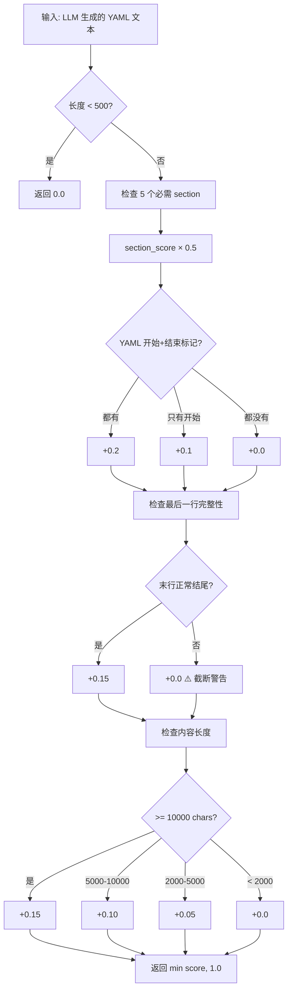
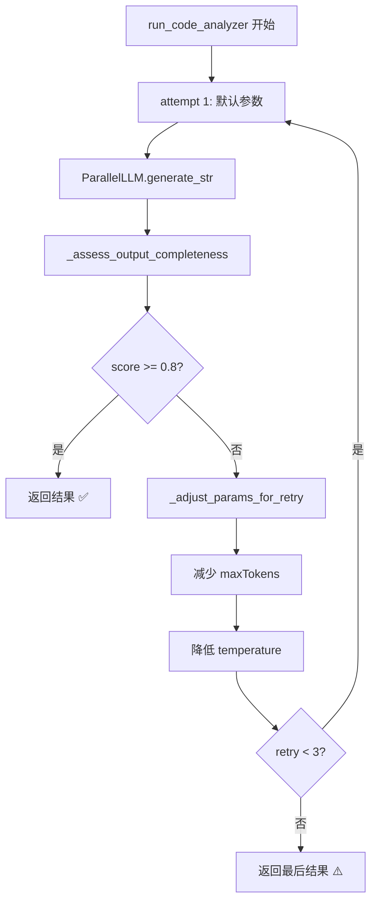

# PD-07.06 DeepCode — YAML 完整性评分与自适应重试

> 文档编号：PD-07.06
> 来源：DeepCode `workflows/agent_orchestration_engine.py`
> GitHub：https://github.com/HKUDS/DeepCode.git
> 问题域：PD-07 质量检查 Quality Assurance
> 状态：可复用方案

---

## 第 1 章 问题与动机

### 1.1 核心问题

在 Research-to-Code 自动化流水线中，LLM 生成的实现计划（YAML 格式）是后续代码生成的唯一蓝图。如果 YAML 计划不完整——缺少关键 section、被 token 限制截断、结构损坏——下游的代码实现 Agent 将产出残缺代码。

DeepCode 面临的具体挑战：
- **Token 截断**：qwen/qwen-max 的 32768 token 上下文限制导致长 YAML 输出被截断
- **Section 缺失**：LLM 可能跳过 `validation_approach` 或 `environment_setup` 等关键 section
- **结构损坏**：YAML 开始/结束标记不匹配，最后一行被截断
- **无感知失败**：不检查就直接使用不完整的计划，导致代码实现阶段大量返工

### 1.2 DeepCode 的解法概述

DeepCode 采用**四维完整性评分 + 自适应参数重试**的组合策略：

1. **加权评分函数** `_assess_output_completeness()`：对 YAML 输出进行 4 个维度的加权评分（0.0-1.0），维度包括 section 存在性（50%）、结构完整性（20%）、末行截断检测（15%）、最小长度验证（15%）— `workflows/agent_orchestration_engine.py:68-147`
2. **自适应参数调整** `_adjust_params_for_retry()`：重试时逐步减少 `maxTokens`（而非增加），同时降低 `temperature` 以提高输出稳定性 — `workflows/agent_orchestration_engine.py:150-197`
3. **三次重试循环**：在 `run_code_analyzer()` 中以 0.8 为阈值触发重试，最多 3 次 — `workflows/agent_orchestration_engine.py:808-856`
4. **Plan Review 插件**：通过 `PlanReviewPlugin` 支持人工审查和修改计划，最多 3 轮修改 — `workflows/plugins/plan_review.py:24-221`
5. **实现阶段完成度追踪**：`ConciseMemoryAgent` 追踪所有文件的实现状态，空列表即完成 — `workflows/agents/memory_agent_concise.py:1929-1995`

### 1.3 设计思想

| 设计原则 | 具体实现 | 理由 | 替代方案 |
|----------|----------|------|----------|
| 加权多维评估 | 4 维度独立评分，section 存在性占 50% 权重 | 不同维度重要性不同，section 缺失比长度不足更致命 | 单一分数（如只看长度）、LLM 自评 |
| 反直觉的 token 减少策略 | 重试时减少 maxTokens 而非增加 | 总 context = input + output，减少 output 为 input 留空间 | 增加 maxTokens（会加剧溢出）、截断 input |
| 渐进式参数衰减 | retry_max_tokens × [1.0, 0.9, 0.8]，temperature 每次 -0.15 | 逐步收紧而非一步到位，给模型适应空间 | 固定参数重试、随机参数 |
| 插件化人工审查 | PlanReviewPlugin 通过 hook 点注入，不修改核心流程 | 解耦审查逻辑与编排逻辑，可独立启用/禁用 | 硬编码审查步骤、无审查 |
| 文件级完成度追踪 | 从目录结构提取文件列表，模糊路径匹配判断实现状态 | 比解析 LLM 计划更可靠，支持增量实现 | 仅靠 LLM 自报完成、计数器 |

---

## 第 2 章 源码实现分析

### 2.1 架构概览

DeepCode 的质量检查分布在三个层次：

```
┌─────────────────────────────────────────────────────────┐
│                  编排引擎层 (Orchestration)               │
│  agent_orchestration_engine.py                          │
│  ┌──────────────────┐  ┌──────────────────────────┐     │
│  │ _assess_output_  │  │ _adjust_params_for_retry │     │
│  │ completeness()   │→ │ Token 减少 + Temp 降低    │     │
│  │ 四维加权评分      │  │ 自适应参数调整            │     │
│  └──────────────────┘  └──────────────────────────┘     │
│           ↓ score < 0.8                                  │
│  ┌──────────────────────────────────────────────┐       │
│  │ run_code_analyzer() 重试循环 (max 3 次)       │       │
│  └──────────────────────────────────────────────┘       │
├─────────────────────────────────────────────────────────┤
│                  插件层 (Plugin)                          │
│  plugins/plan_review.py                                  │
│  ┌──────────────────────────────────────────────┐       │
│  │ PlanReviewPlugin: 人工审查 → 修改 → 重审      │       │
│  │ max 3 轮修改，600s 超时自动通过               │       │
│  └──────────────────────────────────────────────┘       │
├─────────────────────────────────────────────────────────┤
│                  实现追踪层 (Memory)                      │
│  agents/memory_agent_concise.py                          │
│  ┌──────────────────────────────────────────────┐       │
│  │ ConciseMemoryAgent: 文件级完成度追踪           │       │
│  │ get_unimplemented_files() → 空列表 = 完成     │       │
│  └──────────────────────────────────────────────┘       │
├─────────────────────────────────────────────────────────┤
│                  工作流层 (Workflow)                       │
│  code_implementation_workflow.py                          │
│  ┌──────────────────────────────────────────────┐       │
│  │ _check_tool_results_for_errors()             │       │
│  │ _validate_messages() + JSON 修复              │       │
│  │ Emergency trim (>50 messages)                 │       │
│  └──────────────────────────────────────────────┘       │
└─────────────────────────────────────────────────────────┘
```

### 2.2 核心实现

#### 2.2.1 四维完整性评分函数



对应源码 `workflows/agent_orchestration_engine.py:68-147`：

```python
def _assess_output_completeness(text: str) -> float:
    if not text or len(text.strip()) < 500:
        return 0.0

    score = 0.0
    text_lower = text.lower()

    # 1. 检查5个必需的YAML sections (权重: 0.5 - 最重要)
    required_sections = [
        "file_structure:",
        "implementation_components:",
        "validation_approach:",
        "environment_setup:",
        "implementation_strategy:",
    ]
    sections_found = sum(1 for section in required_sections if section in text_lower)
    section_score = sections_found / len(required_sections)
    score += section_score * 0.5

    # 2. 检查YAML结构完整性 (权重: 0.2)
    has_yaml_start = any(
        marker in text
        for marker in ["```yaml", "complete_reproduction_plan:", "paper_info:"]
    )
    has_yaml_end = any(
        marker in text[-500:]
        for marker in ["```", "implementation_strategy:", "validation_approach:"]
    )
    if has_yaml_start and has_yaml_end:
        score += 0.2
    elif has_yaml_start:
        score += 0.1

    # 3. 检查最后一行完整性 (权重: 0.15)
    lines = text.strip().split("\n")
    if lines:
        last_line = lines[-1].strip()
        if (
            last_line.endswith(("```", ".", ":", "]", "}"))
            or last_line.startswith(("-", "*", " "))
            or (len(last_line) < 100 and not last_line.endswith(","))
        ):
            score += 0.15

    # 4. 检查合理的最小长度 (权重: 0.15)
    length = len(text)
    if length >= 10000:
        score += 0.15
    elif length >= 5000:
        score += 0.10
    elif length >= 2000:
        score += 0.05

    return min(score, 1.0)
```

#### 2.2.2 自适应参数调整与重试循环



对应源码 `workflows/agent_orchestration_engine.py:150-197`：

```python
def _adjust_params_for_retry(
    params: RequestParams, retry_count: int, config_path: str = "mcp_agent.config.yaml"
) -> RequestParams:
    """
    Token减少策略以适应模型context限制
    为什么要REDUCE而不是INCREASE？
    - qwen/qwen-max最大context = 32768 tokens (input + output 总和)
    - 当遇到 "maximum context length exceeded" 错误时，说明 input + requested_output > 32768
    - INCREASING max_tokens只会让问题更严重！
    - 正确做法：DECREASE output tokens，为更多input留出空间
    """
    _, retry_max_tokens = get_token_limits(config_path)

    if retry_count == 0:
        new_max_tokens = retry_max_tokens          # 第一次重试：配置值
    elif retry_count == 1:
        new_max_tokens = int(retry_max_tokens * 0.9)  # 第二次：90%
    else:
        new_max_tokens = int(retry_max_tokens * 0.8)  # 第三次：80%

    # 降低temperature以获得更一致、更可预测的输出
    new_temperature = max(params.temperature - (retry_count * 0.15), 0.05)

    return new_max_tokens, new_temperature
```

### 2.3 实现细节

#### Plan Review 插件系统

DeepCode 通过插件架构实现人工审查，核心设计在 `workflows/plugins/base.py:34-55` 定义了 7 个 hook 点（`InteractionPoint` 枚举），`PlanReviewPlugin` 挂载在 `AFTER_PLANNING` 点。

关键流程（`workflows/plugins/plan_review.py:115-182`）：
- **confirm**：设置 `plan_approved = True`，流程继续
- **modify**：调用 `RequirementAnalysisAgent.modify_requirements()` 修改计划，最多 3 轮
- **cancel**：设置 `workflow_cancelled = True`，终止流程
- **超时/跳过**：自动批准（`on_timeout` → `on_skip` → `plan_approved = True`）

#### 实现阶段的文件级完成度追踪

`ConciseMemoryAgent`（`workflows/agents/memory_agent_concise.py:27-2156`）负责追踪代码实现进度：

1. **文件列表提取**：优先从 `generate_code/` 目录扫描（`_extract_files_from_generated_directory()`），回退到解析 YAML 计划（`_extract_all_files_from_plan()`）
2. **模糊路径匹配**：`get_unimplemented_files()` 使用路径后缀匹配（`workflows/agents/memory_agent_concise.py:1929-1995`），处理 `src/model/apt_layer.py` vs `model/apt_layer.py` 的差异
3. **write_file 触发清理**：每次检测到 `write_file` 工具调用，触发内存优化，清除历史对话只保留系统提示 + 初始计划 + 当前轮工具结果

#### 工作流层的错误检测与 JSON 修复

`CodeImplementationWorkflow`（`workflows/code_implementation_workflow.py:1184-1227`）提供：
- `_check_tool_results_for_errors()`：解析工具返回的 JSON，检测 `status: error`
- `_repair_truncated_json()`：修复截断的 JSON（闭合括号、提取部分有效 JSON、工具特定默认值）
- Emergency trim：消息超过 50 条时触发内存优化

---

## 第 3 章 迁移指南

### 3.1 迁移清单

**阶段 1：核心评分函数（1 个文件）**
- [ ] 实现 `_assess_output_completeness()` 函数
- [ ] 根据你的输出格式定义 `required_sections` 列表
- [ ] 调整权重分配（section 存在性、结构完整性、截断检测、长度）
- [ ] 设定完整性阈值（DeepCode 用 0.8）

**阶段 2：自适应重试（1 个文件）**
- [ ] 实现 `_adjust_params_for_retry()` 函数
- [ ] 配置 `base_max_tokens` 和 `retry_max_tokens`
- [ ] 在 LLM 调用处添加重试循环（while + retry_count）

**阶段 3：人工审查插件（可选，3 个文件）**
- [ ] 实现 `InteractionPlugin` 基类和 `PluginRegistry`
- [ ] 实现 `PlanReviewPlugin`
- [ ] 在工作流中添加 `await plugins.run_hook()` 调用

**阶段 4：完成度追踪（可选，1 个文件）**
- [ ] 实现文件列表提取（从目录或计划）
- [ ] 实现模糊路径匹配的 `get_unimplemented_files()`
- [ ] 在实现循环中检查完成状态

### 3.2 适配代码模板

```python
"""可直接复用的 YAML 完整性评分 + 自适应重试模板"""
from dataclasses import dataclass
from typing import List, Tuple


@dataclass
class CompletenessConfig:
    """完整性检查配置"""
    required_sections: List[str]          # 必需的 section 关键词
    section_weight: float = 0.5           # section 存在性权重
    structure_weight: float = 0.2         # 结构完整性权重
    truncation_weight: float = 0.15       # 截断检测权重
    length_weight: float = 0.15           # 长度验证权重
    min_length: int = 500                 # 最小有效长度
    good_length: int = 5000               # 良好长度
    excellent_length: int = 10000         # 优秀长度
    start_markers: List[str] = None       # 结构开始标记
    end_markers: List[str] = None         # 结构结束标记
    completeness_threshold: float = 0.8   # 通过阈值


def assess_output_completeness(text: str, config: CompletenessConfig) -> float:
    """四维加权完整性评分"""
    if not text or len(text.strip()) < config.min_length:
        return 0.0

    score = 0.0
    text_lower = text.lower()

    # 维度 1: Section 存在性
    found = sum(1 for s in config.required_sections if s.lower() in text_lower)
    score += (found / len(config.required_sections)) * config.section_weight

    # 维度 2: 结构完整性
    has_start = any(m in text for m in (config.start_markers or []))
    has_end = any(m in text[-500:] for m in (config.end_markers or []))
    if has_start and has_end:
        score += config.structure_weight
    elif has_start:
        score += config.structure_weight * 0.5

    # 维度 3: 末行截断检测
    lines = text.strip().split("\n")
    if lines:
        last = lines[-1].strip()
        normal_endings = (".", ":", "]", "}", "```", "---")
        if last.endswith(normal_endings) or len(last) < 100:
            score += config.truncation_weight

    # 维度 4: 长度验证
    length = len(text)
    if length >= config.excellent_length:
        score += config.length_weight
    elif length >= config.good_length:
        score += config.length_weight * 0.67
    elif length >= config.min_length * 4:
        score += config.length_weight * 0.33

    return min(score, 1.0)


@dataclass
class RetryConfig:
    """重试配置"""
    max_retries: int = 3
    base_max_tokens: int = 20000
    retry_max_tokens: int = 15000
    token_decay_rates: Tuple[float, ...] = (1.0, 0.9, 0.8)
    temperature_decay: float = 0.15
    min_temperature: float = 0.05


def adjust_params_for_retry(
    current_temperature: float,
    retry_count: int,
    config: RetryConfig,
) -> Tuple[int, float]:
    """自适应参数调整：减少 token + 降低 temperature"""
    decay = config.token_decay_rates[min(retry_count, len(config.token_decay_rates) - 1)]
    new_tokens = int(config.retry_max_tokens * decay)
    new_temp = max(current_temperature - retry_count * config.temperature_decay,
                   config.min_temperature)
    return new_tokens, new_temp


async def generate_with_quality_check(
    llm_call,           # async callable: (max_tokens, temperature) -> str
    config: CompletenessConfig,
    retry_config: RetryConfig,
) -> str:
    """带质量检查的 LLM 生成主循环"""
    temperature = 0.3
    max_tokens = retry_config.base_max_tokens
    result = ""

    for attempt in range(retry_config.max_retries):
        result = await llm_call(max_tokens, temperature)
        score = assess_output_completeness(result, config)
        print(f"Attempt {attempt+1}: completeness={score:.2f}")

        if score >= config.completeness_threshold:
            return result

        max_tokens, temperature = adjust_params_for_retry(
            temperature, attempt, retry_config
        )

    return result  # 返回最后一次结果
```

### 3.3 适用场景

| 场景 | 适用度 | 说明 |
|------|--------|------|
| LLM 生成结构化输出（YAML/JSON/XML） | ⭐⭐⭐ | 核心场景，section 检查 + 结构完整性检测直接适用 |
| 长文本生成（报告、文档） | ⭐⭐⭐ | 截断检测 + 长度验证特别有用 |
| 代码生成质量检查 | ⭐⭐ | 需要替换 section 检查为语法检查 |
| 短文本生成（摘要、回答） | ⭐ | 长度和结构维度意义不大，需要语义评估 |
| 多轮对话质量控制 | ⭐⭐ | 可用于检查每轮输出的完整性 |

---

## 第 4 章 测试用例

```python
import pytest


class TestAssessOutputCompleteness:
    """测试四维完整性评分函数"""

    def test_empty_input_returns_zero(self):
        assert assess_output_completeness("", CompletenessConfig(
            required_sections=["file_structure:"]
        )) == 0.0

    def test_short_input_returns_zero(self):
        assert assess_output_completeness("short", CompletenessConfig(
            required_sections=["file_structure:"], min_length=500
        )) == 0.0

    def test_all_sections_present_gets_half_score(self):
        sections = ["section_a:", "section_b:", "section_c:"]
        text = "x" * 600 + "\nsection_a: val\nsection_b: val\nsection_c: val\n"
        config = CompletenessConfig(
            required_sections=sections,
            start_markers=[], end_markers=[],
            min_length=100, good_length=500, excellent_length=1000,
        )
        score = assess_output_completeness(text, config)
        assert score >= 0.5  # section_weight = 0.5, all found

    def test_partial_sections_proportional_score(self):
        sections = ["a:", "b:", "c:", "d:"]
        text = "x" * 600 + "\na: val\nb: val\n"  # 2/4 sections
        config = CompletenessConfig(
            required_sections=sections,
            start_markers=[], end_markers=[],
            min_length=100,
        )
        score = assess_output_completeness(text, config)
        assert 0.2 <= score <= 0.4  # 50% of section_weight

    def test_truncated_last_line_detected(self):
        text = "x" * 600 + "\nthis line ends with a comma and is very long" + "x" * 100 + ","
        config = CompletenessConfig(
            required_sections=[], start_markers=[], end_markers=[],
            min_length=100,
        )
        score = assess_output_completeness(text, config)
        # 截断检测维度不应得分
        assert score < 0.5

    def test_perfect_output_near_max_score(self):
        sections = ["file_structure:", "implementation_components:"]
        text = (
            "```yaml\nfile_structure:\n  - main.py\n"
            "implementation_components:\n  - core\n"
            + "x" * 10000
            + "\n```"
        )
        config = CompletenessConfig(
            required_sections=sections,
            start_markers=["```yaml"],
            end_markers=["```"],
            min_length=500, good_length=5000, excellent_length=10000,
        )
        score = assess_output_completeness(text, config)
        assert score >= 0.8


class TestAdjustParamsForRetry:
    """测试自适应参数调整"""

    def test_first_retry_uses_base_rate(self):
        config = RetryConfig(retry_max_tokens=15000)
        tokens, temp = adjust_params_for_retry(0.3, 0, config)
        assert tokens == 15000
        assert temp == pytest.approx(0.3)

    def test_second_retry_reduces_tokens(self):
        config = RetryConfig(retry_max_tokens=15000)
        tokens, _ = adjust_params_for_retry(0.3, 1, config)
        assert tokens == 13500  # 15000 * 0.9

    def test_third_retry_further_reduces(self):
        config = RetryConfig(retry_max_tokens=15000)
        tokens, _ = adjust_params_for_retry(0.3, 2, config)
        assert tokens == 12000  # 15000 * 0.8

    def test_temperature_decreases_per_retry(self):
        config = RetryConfig(temperature_decay=0.15, min_temperature=0.05)
        _, temp0 = adjust_params_for_retry(0.3, 0, config)
        _, temp1 = adjust_params_for_retry(0.3, 1, config)
        _, temp2 = adjust_params_for_retry(0.3, 2, config)
        assert temp0 > temp1 > temp2
        assert temp2 >= 0.05  # 不低于最小值

    def test_temperature_floor(self):
        config = RetryConfig(temperature_decay=0.15, min_temperature=0.05)
        _, temp = adjust_params_for_retry(0.1, 5, config)
        assert temp == 0.05
```

---

## 第 5 章 跨域关联

| 关联域 | 关系类型 | 说明 |
|--------|----------|------|
| PD-01 上下文管理 | 依赖 | `_adjust_params_for_retry()` 的 token 减少策略本质是上下文窗口管理——在 input+output 总量受限时，压缩 output 为 input 留空间 |
| PD-03 容错与重试 | 协同 | 完整性评分驱动的重试循环是 PD-03 容错机制的具体应用，但评分逻辑属于 PD-07 质量检查 |
| PD-06 记忆持久化 | 协同 | `ConciseMemoryAgent` 的 `implement_code_summary.md` 持久化了实现进度，为质量追踪提供数据基础 |
| PD-09 Human-in-the-Loop | 协同 | `PlanReviewPlugin` 是 PD-09 的具体实现，通过人工审查补充自动质量检查的不足 |
| PD-04 工具系统 | 依赖 | `_check_tool_results_for_errors()` 依赖工具系统返回结构化的 JSON 结果，才能进行错误检测 |

---

## 第 6 章 来源文件索引

| 文件 | 行范围 | 关键实现 |
|------|--------|----------|
| `workflows/agent_orchestration_engine.py` | L68-L147 | `_assess_output_completeness()` 四维加权评分函数 |
| `workflows/agent_orchestration_engine.py` | L150-L197 | `_adjust_params_for_retry()` 自适应参数调整 |
| `workflows/agent_orchestration_engine.py` | L808-L856 | `run_code_analyzer()` 重试循环主逻辑 |
| `workflows/plugins/plan_review.py` | L24-L221 | `PlanReviewPlugin` 人工审查插件 |
| `workflows/plugins/base.py` | L34-L55 | `InteractionPoint` 枚举定义 7 个 hook 点 |
| `workflows/plugins/base.py` | L79-L170 | `InteractionPlugin` 抽象基类 |
| `workflows/plugins/base.py` | L193-L354 | `PluginRegistry` 插件注册与执行 |
| `workflows/agents/memory_agent_concise.py` | L27-L118 | `ConciseMemoryAgent.__init__()` 初始化与文件列表提取 |
| `workflows/agents/memory_agent_concise.py` | L1929-L1995 | `get_unimplemented_files()` 模糊路径匹配 |
| `workflows/agents/memory_agent_concise.py` | L2036-L2056 | `should_trigger_memory_optimization()` write_file 触发检测 |
| `workflows/code_implementation_workflow.py` | L1184-L1227 | `_check_tool_results_for_errors()` 工具结果错误检测 |
| `utils/llm_utils.py` | L174-L211 | `get_token_limits()` 配置化 token 限制读取 |

---

## 第 7 章 横向对比维度

> **重要：** 本章用于自动填充 Butcher Wiki 的横向对比表。
> 必须严格按以下 JSON 格式输出，放在 `comparison_data` 代码块中。

```json comparison_data
{
  "project": "DeepCode",
  "dimensions": {
    "检查方式": "规则式四维加权评分（section存在性+结构完整性+截断检测+长度验证）",
    "评估维度": "4维：section存在性50%、YAML结构20%、末行截断15%、最小长度15%",
    "评估粒度": "整体YAML计划级评分 + 文件级实现完成度追踪",
    "迭代机制": "3次自适应重试（token递减×0.9/0.8 + temperature递减0.15/次）",
    "反馈机制": "PlanReviewPlugin人工审查3轮修改 + 超时自动通过",
    "自动修复": "无自动修复，仅通过参数调整引导LLM重新生成",
    "覆盖范围": "计划生成阶段（YAML完整性）+ 实现阶段（文件完成度）",
    "并发策略": "单次串行评估，无并行质量检查",
    "降级路径": "3次重试失败后使用最后结果，超时自动批准计划"
  }
}
```

### 域元数据补充

```json domain_metadata
{
  "solution_summary": "DeepCode 用四维加权评分（section/结构/截断/长度）检测 YAML 计划完整性，配合反直觉的 token 递减重试策略和 PlanReview 插件实现计划质量保障",
  "description": "结构化输出的完整性评分与自适应参数重试，覆盖计划生成到代码实现全链路",
  "sub_problems": [
    "YAML/结构化输出截断检测：LLM 输出被 token 限制截断后的自动识别",
    "实现完成度追踪：代码生成阶段逐文件追踪实现进度直到全部完成"
  ],
  "best_practices": [
    "Token 减少优于增加：重试时减少 output token 为 input 留空间，而非盲目增加导致溢出",
    "渐进式参数衰减：token 和 temperature 逐步收紧（×0.9→×0.8，-0.15/次），避免一步到位的剧烈变化"
  ]
}
```
