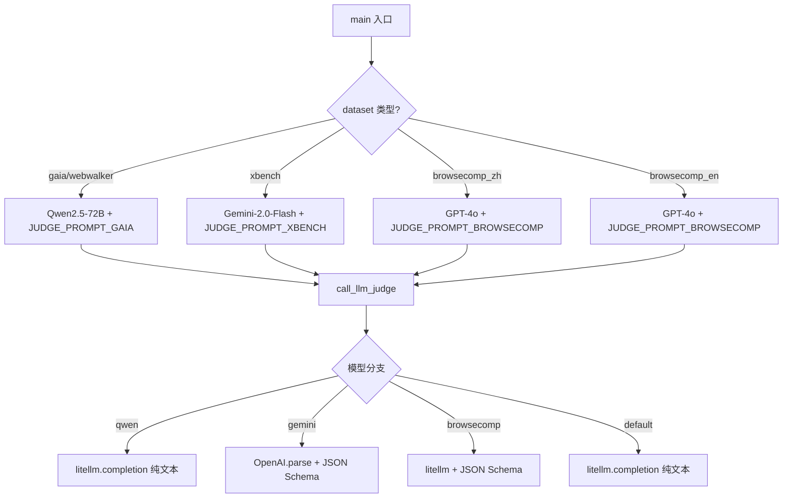
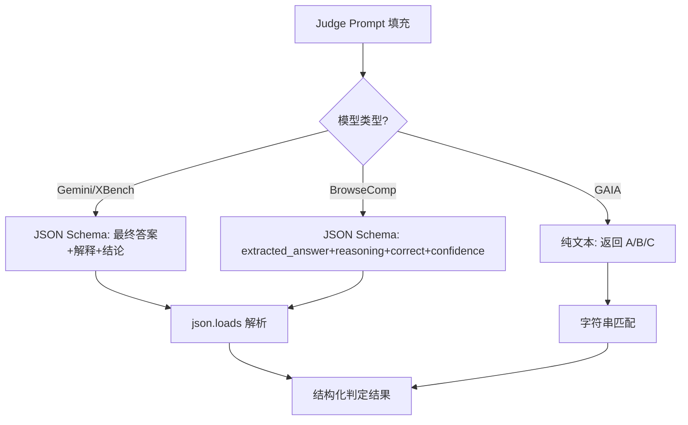
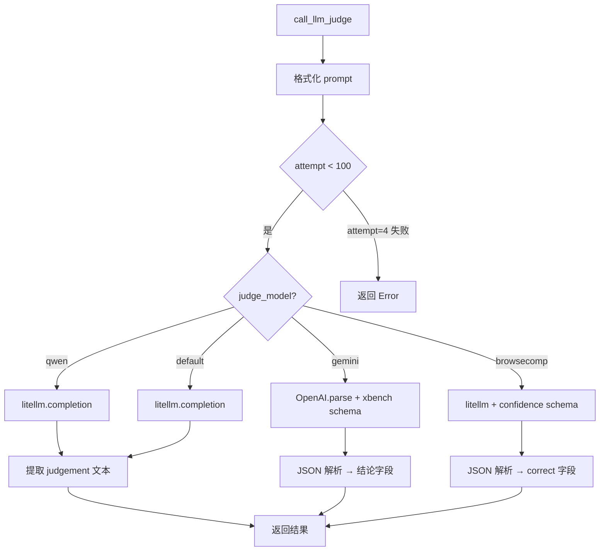

# PD-07.06 DeepResearch — LLM-as-Judge 多模型评估与 Pass@K 聚合

> 文档编号：PD-07.06
> 来源：DeepResearch `evaluation/evaluate_deepsearch_official.py`, `evaluation/prompt.py`
> GitHub：https://github.com/Alibaba-NLP/DeepResearch
> 问题域：PD-07 质量检查 Quality Assurance
> 状态：可复用方案

---

## 第 1 章 问题与动机

### 1.1 核心问题

Deep Research Agent 在多个学术基准（GAIA、BrowseComp、WebWalker、XBench、HLE）上运行后，需要一套自动化评估体系来判定 Agent 生成的答案是否正确。核心挑战：

1. **答案等价性判定困难**：Agent 的自然语言回答与标准答案在表述上可能完全不同，但语义等价（如 "San Francisco" vs "San Francisco, California"）
2. **多基准适配**：不同基准的评判标准差异大——GAIA 需要宽松的语义匹配，BrowseComp 需要置信度评分，XBench 需要中文评判
3. **评估可靠性**：单次评估存在随机性，需要多轮运行 + 聚合策略来获得稳定指标
4. **成本与并发**：大规模评估（数百到数千条）需要高并发 + 成本估算

### 1.2 DeepResearch 的解法概述

1. **LLM-as-Judge 架构**：用独立的 Judge LLM（GPT-4o / Gemini / Qwen）评判 Agent 答案是否与标准答案等价，而非简单字符串匹配（`evaluation/evaluate_deepsearch_official.py:76-144`）
2. **多 Prompt 模板体系**：为 6 种不同基准设计专用 Judge Prompt，每种 prompt 的评判标准、输出格式、语言都不同（`evaluation/prompt.py:98-319`）
3. **JSON Schema 约束输出**：使用 Pydantic BaseModel 或 JSON Schema 强制 Judge LLM 输出结构化结果（extracted_answer + reasoning + correct + confidence），消除格式解析失败（`evaluation/evaluate_deepsearch_official.py:33-51`）
4. **3 轮 Pass@K 聚合**：每个问题运行 3 轮独立推理，计算 Avg Pass@3、Best Pass@1、Pass@3 等多维指标（`evaluation/evaluate_deepsearch_official.py:405-445`）
5. **ParallelMuse 报告聚合**：多轮推理轨迹先压缩为报告，再由 LLM 交叉验证整合出最终答案（`WebAgent/ParallelMuse/compressed_reasoning_aggregation.py:48-68`）

### 1.3 设计思想

| 设计原则 | 具体实现 | 理由 | 替代方案 |
|----------|----------|------|----------|
| Judge 与 Worker 分离 | Judge 用 GPT-4o/Gemini，Worker 用 Qwen/自研模型 | 避免自评偏差，Judge 模型选择独立于被评估模型 | 同模型自评（效果差） |
| Prompt 按基准特化 | 6 套 Judge Prompt 分别适配 GAIA/BrowseComp/XBench 等 | 不同基准的正确性标准不同（宽松匹配 vs 严格匹配） | 统一 prompt（准确率下降） |
| 结构化输出约束 | Pydantic BaseModel + JSON Schema strict mode | 消除 LLM 输出格式不一致导致的解析失败 | 正则提取（脆弱） |
| 多轮聚合消除随机性 | 3 轮独立推理 + Pass@K 指标族 | 单次推理存在随机性，多轮聚合更稳定 | 单次评估（方差大） |
| 高并发线程池 | ThreadPoolExecutor(max_workers=100) | 评估数百条数据时需要并行调用 Judge API | 串行调用（太慢） |

---

## 第 2 章 源码实现分析

### 2.1 架构概览

DeepResearch 的评估体系分为三层：

```
┌─────────────────────────────────────────────────────────┐
│                    评估入口 (main)                        │
│  dataset 选择 → judge_model 绑定 → judge_prompt 绑定     │
└──────────────────────┬──────────────────────────────────┘
                       │
          ┌────────────┼────────────┐
          ▼            ▼            ▼
    ┌──────────┐ ┌──────────┐ ┌──────────┐
    │ Round 1  │ │ Round 2  │ │ Round 3  │
    │ iter1.   │ │ iter2.   │ │ iter3.   │
    │ jsonl    │ │ jsonl    │ │ jsonl    │
    └────┬─────┘ └────┬─────┘ └────┬─────┘
         │            │            │
         ▼            ▼            ▼
    ┌─────────────────────────────────────┐
    │   ThreadPoolExecutor(workers=100)   │
    │   call_llm_judge() × N items        │
    └──────────────────┬──────────────────┘
                       │
         ┌─────────────┼─────────────┐
         ▼             ▼             ▼
    ┌──────────┐ ┌──────────┐ ┌──────────┐
    │aggregate │ │ pass@k   │ │statistics│
    │_results  │ │ 计算     │ │ 聚合     │
    └──────────┘ └──────────┘ └──────────┘
```

### 2.2 核心实现

#### 2.2.1 多模型 Judge 路由



对应源码 `evaluation/evaluate_deepsearch_official.py:448-476`：

```python
dataset = args.dataset  
if dataset in ["gaia", "webwalker"]: 
    judge_model = "openai/qwen2.5-72b-instruct"
    judge_prompt = JUDGE_PROMPT_GAIA 
elif dataset in ["xbench-deepsearch"]: 
    judge_prompt = JUDGE_PROMPT_XBENCH
    judge_model = "google/gemini-2.0-flash-001"
elif dataset.startswith("browsecomp_zh"):
    judge_model = "gpt-4o-2024-08-06"
    judge_prompt = JUDGE_PROMPT_BROWSECOMP_OFFICIAL 
elif dataset.startswith("browsecomp_en"):
    judge_model = "gpt-4o-2024-08-06"
    judge_prompt = JUDGE_PROMPT_BROWSECOMP_OFFICIAL
```

#### 2.2.2 JSON Schema 约束输出



对应源码 `evaluation/evaluate_deepsearch_official.py:33-51`（JSON Schema 定义）：

```python
extracted_answer_format_for_confidence = {
    "type": "json_schema",
    "json_schema": {
        "name": "extracted_answer",
        "schema": {
            "type": "object",
            "properties": {
                "extracted_final_answer": {"type": "string"},
                "reasoning": {"type": "string"},
                "correct": {"type": "string", "enum": ["yes", "no"]},
                "confidence": {"type": "number"},
                "strict": {"type": "boolean"},
            },
            "required": ["extracted_final_answer", "reasoning", 
                         "correct", "confidence", "strict"],
            "additionalProperties": False
        },
        "strict": True
    }
}
```

以及 HLE 评估中的 Pydantic 版本 `evaluation/evaluate_hle_official.py:57-62`：

```python
class ExtractedAnswer(BaseModel):
    extracted_final_answer: str
    reasoning: str
    correct: Literal["yes", "no"]
    confidence: int
    strict: Literal[True]
```

#### 2.2.3 call_llm_judge 多模型分支调用

对应源码 `evaluation/evaluate_deepsearch_official.py:76-144`：



```python
def call_llm_judge(item): 
    global judge_prompt, dataset, judge_model
    question = item["question"]
    correct_answer = item["answer"]
    response = item["prediction"].strip()
    prompt = judge_prompt.format(question=question, 
                                 correct_answer=correct_answer, 
                                 response=response)
    
    for attempt in range(100):
        try: 
            if judge_model == "openai/qwen2.5-72b-instruct":
                response = litellm.completion(
                    model=judge_model,
                    messages=[{"role": "user", "content": prompt}],
                    num_retries=5
                )
                judgement = response.choices[0].message["content"]
            elif judge_model == "google/gemini-2.0-flash-001":
                client = get_client()
                response_obj = client.beta.chat.completions.parse(
                    model=judge_model,
                    max_completion_tokens=8192, 
                    messages=[{"role": "user", "content": prompt}],
                    response_format=extracted_answer_format_for_xbench,
                    timeout=100.0
                ) 
                raw_judge = json.loads(
                    response_obj.choices[0].message.content)
                judgement = "Correct" if raw_judge["结论"].lower() == "正确" else ""
            # ... browsecomp 和 default 分支
            return {"question": question, "answer": correct_answer, 
                    "judgement": judgement}
        except Exception as e:
            if attempt == 4:  
                return {"question": question, "answer": correct_answer, 
                        "judgement": "Error", "error": str(e)}
            time.sleep(3)
```

### 2.3 实现细节

#### 2.3.1 Pass@K 指标族

DeepResearch 要求每个问题运行 3 轮独立推理（iter1/iter2/iter3），然后计算三种聚合指标：

- **Avg Pass@3**：3 轮各自的正确率取平均（`evaluate_deepsearch_official.py:434-445`）
- **Best Pass@1**：3 轮中正确率最高的那一轮（`evaluate_deepsearch_official.py:418-431`）
- **Pass@3**：只要 3 轮中任意一轮答对即算正确（`evaluate_deepsearch_official.py:405-415`）

```python
def calculate_pass_at_k(query_results, k=10): 
    total_correct = 0 
    for query, results in query_results.items():
        rounds = [results["round1"], results["round2"], 
                  results["round3"]][:k] 
        if "Correct" in rounds: 
            total_correct += 1 
    overall_pass = total_correct / len(query_results)
    return round(overall_pass * 100, 2)
```

#### 2.3.2 ParallelMuse 报告压缩聚合

`WebAgent/ParallelMuse/compressed_reasoning_aggregation.py` 实现了更高级的聚合策略：

1. **轨迹压缩**：每轮推理的完整 tool_call 轨迹被 LLM 压缩为结构化报告（Solution Planning + Solution Methods + Final Reasoning）
2. **交叉验证整合**：多份报告送入 INTEGRATE_PROMPT，LLM 批判性评估各报告的可信度，选择最可靠的答案
3. **一致性增强**：多份报告得出相同结论时增加置信度，但仍要求验证

INTEGRATE_PROMPT 的关键设计（`compressed_reasoning_aggregation.py:48-68`）：
- "some of the reports may contain inconsistencies — you must critically evaluate"
- "If multiple reports reach the same conclusion, this increases the likelihood... however, this is not guaranteed"
- "You are not allowed to merge multiple different answers"

#### 2.3.3 线程安全的 OpenAI Client

使用 `threading.local()` 为每个线程创建独立的 OpenAI Client 实例（`evaluate_deepsearch_official.py:18-31`）：

```python
thread_local = threading.local()

def get_client():
    if not hasattr(thread_local, 'client'):
        thread_local.client = OpenAI(
            api_key=API_KEY,
            base_url=BASE_URL,
        )
    return thread_local.client
```

#### 2.3.4 统计维度丰富度

评估不仅输出正确率，还追踪（`evaluate_deepsearch_official.py:209-325`）：
- 平均工具调用次数（总/搜索/访问/其他）
- 平均 assistant token 消耗（每问题/每消息）
- 终止原因分布（answered / max_turns_reached / max_tokens_reached）
- 超长上下文比例（>30K tokens）
- 正确回答 vs 错误回答的工具调用差异


---

## 第 3 章 迁移指南

### 3.1 迁移清单

**阶段 1：基础 Judge 框架**
- [ ] 定义 Judge Prompt 模板（至少支持一种基准）
- [ ] 实现 JSON Schema 约束输出（Pydantic BaseModel 或 JSON Schema dict）
- [ ] 实现 `call_llm_judge()` 函数，支持重试和超时
- [ ] 实现线程安全的 OpenAI Client（`threading.local()`）

**阶段 2：多基准适配**
- [ ] 为每种评估场景设计专用 Judge Prompt
- [ ] 实现 dataset → (judge_model, judge_prompt) 的路由映射
- [ ] 支持多种 Judge 模型后端（OpenAI / litellm / 本地模型）

**阶段 3：多轮聚合**
- [ ] 实现 3 轮独立推理的数据加载
- [ ] 实现 Pass@K 指标族（Avg Pass@3, Best Pass@1, Pass@3）
- [ ] 实现统计维度（工具调用、token 消耗、终止原因）

**阶段 4：高级聚合（可选）**
- [ ] 实现轨迹压缩为报告（ParallelMuse 模式）
- [ ] 实现多报告交叉验证整合

### 3.2 适配代码模板

以下是一个可直接复用的 LLM-as-Judge 评估框架：

```python
"""LLM-as-Judge 评估框架 — 从 DeepResearch 迁移"""
import json
import threading
import time
from concurrent.futures import ThreadPoolExecutor, as_completed
from typing import Literal, Optional
from pydantic import BaseModel
from openai import OpenAI
from tqdm import tqdm

# === 1. 结构化输出定义 ===
class JudgeResult(BaseModel):
    extracted_answer: str
    reasoning: str
    correct: Literal["yes", "no"]
    confidence: int

# === 2. 线程安全 Client ===
_thread_local = threading.local()

def get_judge_client(api_key: str, base_url: str) -> OpenAI:
    if not hasattr(_thread_local, 'client'):
        _thread_local.client = OpenAI(api_key=api_key, base_url=base_url)
    return _thread_local.client

# === 3. Judge Prompt 路由 ===
JUDGE_PROMPTS = {
    "equivalence": """Judge whether [response] to [question] is correct based on [correct_answer].
[question]: {question}
[response]: {response}
[correct_answer]: {correct_answer}
Output JSON with: extracted_answer, reasoning, correct (yes/no), confidence (0-100).""",
    
    "classification": """Grade the predicted answer as CORRECT, INCORRECT, or NOT_ATTEMPTED.
Question: {question}
Gold target: {correct_answer}
Predicted answer: {response}
Just return A, B, or C.""",
}

# === 4. 核心 Judge 函数 ===
def call_judge(
    item: dict,
    judge_model: str,
    prompt_key: str = "equivalence",
    api_key: str = "",
    base_url: str = "",
    max_retries: int = 5,
) -> dict:
    prompt = JUDGE_PROMPTS[prompt_key].format(
        question=item["question"],
        correct_answer=item["answer"],
        response=item["prediction"],
    )
    client = get_judge_client(api_key, base_url)
    
    for attempt in range(max_retries):
        try:
            resp = client.beta.chat.completions.parse(
                model=judge_model,
                messages=[{"role": "user", "content": prompt}],
                response_format=JudgeResult,
                max_completion_tokens=4096,
                timeout=60.0,
            )
            result = resp.choices[0].message.parsed
            return {
                "question": item["question"],
                "correct": result.correct == "yes",
                "confidence": result.confidence,
                "reasoning": result.reasoning,
            }
        except Exception as e:
            if attempt == max_retries - 1:
                return {"question": item["question"], "correct": False,
                        "confidence": 0, "reasoning": f"Error: {e}"}
            time.sleep(2 ** attempt)
    return {"question": item["question"], "correct": False,
            "confidence": 0, "reasoning": "Max retries exceeded"}

# === 5. Pass@K 聚合 ===
def calculate_pass_at_k(round_results: dict, k: int = 3) -> float:
    """round_results: {question: {round1: bool, round2: bool, ...}}"""
    total = len(round_results)
    correct = sum(
        1 for results in round_results.values()
        if any(results.get(f"round{i}", False) for i in range(1, k + 1))
    )
    return round(correct / total * 100, 2) if total else 0.0

# === 6. 批量评估入口 ===
def evaluate_batch(
    items: list[dict],
    judge_model: str = "gpt-4o",
    max_workers: int = 50,
    **kwargs,
) -> list[dict]:
    results = []
    with ThreadPoolExecutor(max_workers=max_workers) as executor:
        futures = {
            executor.submit(call_judge, item, judge_model, **kwargs): item
            for item in items
        }
        for future in tqdm(as_completed(futures), total=len(items)):
            results.append(future.result())
    return results
```

### 3.3 适用场景

| 场景 | 适用度 | 说明 |
|------|--------|------|
| QA 系统答案评估 | ⭐⭐⭐ | 核心场景，直接复用 Judge Prompt + Pass@K |
| Agent 任务完成度评估 | ⭐⭐⭐ | 需要定制 Judge Prompt 适配任务类型 |
| RAG 系统检索质量评估 | ⭐⭐ | 需要额外的 faithfulness/relevance 维度 |
| 代码生成评估 | ⭐ | 代码评估更适合执行测试而非 LLM 判定 |
| 多语言评估 | ⭐⭐⭐ | XBench 中文 prompt 模式可直接复用 |

---

## 第 4 章 测试用例

```python
"""基于 DeepResearch 评估体系的测试用例"""
import pytest
import json
from unittest.mock import MagicMock, patch
from typing import Literal
from pydantic import BaseModel


class ExtractedAnswer(BaseModel):
    extracted_final_answer: str
    reasoning: str
    correct: Literal["yes", "no"]
    confidence: int
    strict: Literal[True]


class TestJudgePromptRouting:
    """测试 dataset → (judge_model, judge_prompt) 路由"""
    
    def test_gaia_routes_to_qwen(self):
        dataset = "gaia"
        if dataset in ["gaia", "webwalker"]:
            judge_model = "openai/qwen2.5-72b-instruct"
        assert judge_model == "openai/qwen2.5-72b-instruct"
    
    def test_xbench_routes_to_gemini(self):
        dataset = "xbench-deepsearch"
        if dataset in ["xbench-deepsearch"]:
            judge_model = "google/gemini-2.0-flash-001"
        assert judge_model == "google/gemini-2.0-flash-001"
    
    def test_browsecomp_routes_to_gpt4o(self):
        dataset = "browsecomp_en"
        if dataset.startswith("browsecomp_en"):
            judge_model = "gpt-4o-2024-08-06"
        assert judge_model == "gpt-4o-2024-08-06"


class TestIsCorrectJudgement:
    """测试判定结果解析"""
    
    def test_correct_uppercase(self):
        assert is_correct("Correct")
    
    def test_correct_lowercase_a(self):
        assert is_correct("A")
    
    def test_incorrect(self):
        assert not is_correct("Incorrect")
    
    def test_not_attempted(self):
        assert not is_correct("C")
    
    def test_error(self):
        assert not is_correct("Error")


def is_correct(judgement: str) -> bool:
    """复现 DeepResearch 的 is_correct_judgement 逻辑"""
    return judgement.lower() == "correct" or (
        judgement and judgement.lower()[0] == "a"
    )


class TestPassAtK:
    """测试 Pass@K 聚合指标"""
    
    def test_pass_at_3_all_correct(self):
        results = {
            "q1": {"round1": "Correct", "round2": "Correct", "round3": "Correct"},
        }
        assert calculate_pass_at_k(results, k=3) == 100.0
    
    def test_pass_at_3_one_correct(self):
        results = {
            "q1": {"round1": "Incorrect", "round2": "Correct", "round3": "Incorrect"},
        }
        assert calculate_pass_at_k(results, k=3) == 100.0
    
    def test_pass_at_3_none_correct(self):
        results = {
            "q1": {"round1": "Incorrect", "round2": "Incorrect", "round3": "Incorrect"},
        }
        assert calculate_pass_at_k(results, k=3) == 0.0
    
    def test_avg_pass_at_3(self):
        results = {
            "q1": {"round1": "Correct", "round2": "Incorrect", "round3": "Correct"},
            "q2": {"round1": "Incorrect", "round2": "Incorrect", "round3": "Incorrect"},
        }
        # round1: 1/2=50%, round2: 0/2=0%, round3: 1/2=50%
        # avg = (50+0+50)/3 = 33.33
        assert calculate_avg_pass(results) == 33.33


def calculate_pass_at_k(query_results: dict, k: int = 3) -> float:
    total_correct = 0
    for query, results in query_results.items():
        rounds = [results[f"round{i}"] for i in range(1, k + 1)]
        if "Correct" in rounds:
            total_correct += 1
    return round(total_correct / len(query_results) * 100, 2)


def calculate_avg_pass(query_results: dict) -> float:
    round_names = ["round1", "round2", "round3"]
    total_correct = {r: 0 for r in round_names}
    for query, results in query_results.items():
        for r in round_names:
            if results[r] == "Correct":
                total_correct[r] += 1
    n = len(query_results)
    avg = sum(total_correct[r] / n for r in round_names) / len(round_names)
    return round(avg * 100, 2)


class TestStructuredOutput:
    """测试 JSON Schema 约束输出解析"""
    
    def test_pydantic_parse_correct(self):
        data = {
            "extracted_final_answer": "42",
            "reasoning": "The answer matches",
            "correct": "yes",
            "confidence": 95,
            "strict": True,
        }
        result = ExtractedAnswer(**data)
        assert result.correct == "yes"
        assert result.confidence == 95
    
    def test_pydantic_rejects_invalid_correct(self):
        data = {
            "extracted_final_answer": "42",
            "reasoning": "test",
            "correct": "maybe",  # invalid
            "confidence": 50,
            "strict": True,
        }
        with pytest.raises(Exception):
            ExtractedAnswer(**data)


class TestTerminationDetection:
    """测试终止原因检测"""
    
    def test_answered(self):
        item = {"messages": [{"content": "blah <answer>42</answer>"}]}
        assert get_termination(item) == "answered"
    
    def test_max_turns(self):
        item = {"messages": [{"content": "max_turns_reached"}]}
        assert get_termination(item) == "max_turns_reached"
    
    def test_explicit_field(self):
        item = {"termination": "answer", "messages": []}
        assert get_termination(item) == "answer"


def get_termination(item: dict) -> str:
    if "termination" in item:
        return item["termination"]
    messages = item.get("messages", [])
    if not messages:
        return "unknown"
    last = messages[-1]["content"]
    if "max_turns_reached" in last.lower():
        return "max_turns_reached"
    elif "<answer>" in last and "</answer>" in last:
        return "answered"
    return "unknown"
```


---

## 第 5 章 跨域关联

| 关联域 | 关系类型 | 说明 |
|--------|----------|------|
| PD-01 上下文管理 | 协同 | 评估统计中追踪上下文长度（>30K tokens 标记为 extra_length），Agent 运行时的 token 超限会触发强制回答（`react_agent.py:186-209`），评估需要区分正常终止和被迫终止 |
| PD-03 容错与重试 | 依赖 | Judge 调用本身有重试机制（最多 100 次尝试 + sleep），litellm 内置 `num_retries=5`，线程安全 Client 避免并发冲突 |
| PD-04 工具系统 | 协同 | 评估统计维度包含工具调用分析（search/visit/python/scholar 分类计数），正确回答与错误回答的工具使用模式差异是重要的诊断信号 |
| PD-08 搜索与检索 | 协同 | Agent 的搜索质量直接影响答案质量，评估体系通过 avg_search_action / avg_visit_action 追踪搜索行为，为搜索策略优化提供数据支撑 |
| PD-11 可观测性 | 依赖 | 评估输出包含完整的成本估算（avg_dollars_o4mini / avg_dollars_claude）、token 消耗、终止原因分布，是可观测性体系的重要数据源 |
| PD-12 推理增强 | 协同 | ParallelMuse 的报告压缩聚合本质上是推理增强——多轮推理轨迹压缩后交叉验证，提升最终答案的可靠性 |

---

## 第 6 章 来源文件索引

| 文件 | 行范围 | 关键实现 |
|------|--------|----------|
| `evaluation/prompt.py` | L98-107 | JUDGE_PROMPT_GAIA：宽松语义等价判定 |
| `evaluation/prompt.py` | L111-190 | JUDGE_PROMPT_QA：三级评分（CORRECT/INCORRECT/NOT_ATTEMPTED）+ 详细示例 |
| `evaluation/prompt.py` | L193-210 | JUDGE_PROMPT_CONFIDENCE：置信度评分 + 结构化输出 |
| `evaluation/prompt.py` | L283-319 | JUDGE_PROMPT_XBENCH：中文评判 + JUDGE_PROMPT_BROWSECOMP |
| `evaluation/evaluate_deepsearch_official.py` | L18-31 | 线程安全 OpenAI Client（threading.local） |
| `evaluation/evaluate_deepsearch_official.py` | L33-51 | JSON Schema 约束输出定义（confidence 格式） |
| `evaluation/evaluate_deepsearch_official.py` | L53-69 | JSON Schema 约束输出定义（xbench 中文格式） |
| `evaluation/evaluate_deepsearch_official.py` | L76-144 | call_llm_judge：多模型分支 Judge 调用核心 |
| `evaluation/evaluate_deepsearch_official.py` | L209-325 | single_round_statistics：丰富的统计维度 |
| `evaluation/evaluate_deepsearch_official.py` | L382-445 | aggregate_results + Pass@K 指标族计算 |
| `evaluation/evaluate_deepsearch_official.py` | L448-476 | dataset → judge_model/prompt 路由 |
| `evaluation/evaluate_deepsearch_official.py` | L493-499 | ThreadPoolExecutor(max_workers=100) 并发评估 |
| `evaluation/evaluate_hle_official.py` | L57-62 | Pydantic BaseModel 结构化输出（HLE 版本） |
| `evaluation/evaluate_hle_official.py` | L64-91 | extract_answer：Pydantic parse + 重试 |
| `inference/react_agent.py` | L56-57 | sanity_check_output：think 标签完整性检查 |
| `inference/react_agent.py` | L140-150 | 150 分钟超时终止 |
| `inference/react_agent.py` | L186-209 | token 超限强制回答机制 |
| `WebAgent/ParallelMuse/compressed_reasoning_aggregation.py` | L26-45 | REPORT_PROMPT：轨迹压缩为结构化报告 |
| `WebAgent/ParallelMuse/compressed_reasoning_aggregation.py` | L48-68 | INTEGRATE_PROMPT：多报告交叉验证整合 |
| `WebAgent/ParallelMuse/compressed_reasoning_aggregation.py` | L159-193 | call_state_report：异步轨迹压缩 |
| `WebAgent/ParallelMuse/compressed_reasoning_aggregation.py` | L196-233 | call_info_integrate：多报告整合 |
| `WebAgent/WebSailor/src/evaluate.py` | L14-19 | extract_correct_judgement：正则提取 yes/no |
| `WebAgent/WebSailor/src/evaluate.py` | L75-158 | single_round_statistics：工具调用统计 |

---

## 第 7 章 横向对比维度

> **重要：** 本章用于自动填充 Butcher Wiki 的横向对比表。

```json comparison_data
{
  "project": "DeepResearch",
  "dimensions": {
    "检查方式": "LLM-as-Judge 多模型评判，按基准路由到 GPT-4o/Gemini/Qwen",
    "评估维度": "答案等价性 + 置信度评分 + 终止原因分类",
    "评估粒度": "单问题级，3 轮独立推理后 Pass@K 聚合",
    "迭代机制": "无 Generator-Critic 循环，纯后评估",
    "反馈机制": "无实时反馈，评估结果写入 scored.jsonl 供离线分析",
    "并发策略": "ThreadPoolExecutor(100) + threading.local 线程安全 Client",
    "降级路径": "Judge 调用失败返回 Error 标记，不影响其他条目评估",
    "多后端支持": "litellm + OpenAI SDK 双后端，支持 Qwen/GPT-4o/Gemini",
    "配置驱动": "dataset 参数驱动 judge_model + judge_prompt 自动路由",
    "基准集成": "GAIA/BrowseComp/WebWalker/XBench/HLE 五基准全覆盖",
    "评估模型隔离": "Judge 模型与 Worker 模型完全独立，API key 分离",
    "决策归一化": "is_correct_judgement 统一处理 Correct/A/yes 等多种格式"
  }
}
```

### 域元数据补充

```json domain_metadata
{
  "solution_summary": "DeepResearch 用 LLM-as-Judge + JSON Schema 约束输出 + 3 轮 Pass@K 聚合实现多基准自动评估，支持 GPT-4o/Gemini/Qwen 三模型路由",
  "description": "学术基准评估场景下的多模型 Judge 路由与多轮聚合策略",
  "sub_problems": [
    "多基准 Judge Prompt 适配：不同基准的正确性标准差异大，需要专用 prompt",
    "多轮推理聚合策略：Pass@K 指标族设计与轨迹压缩交叉验证",
    "Judge 输出格式归一化：不同模型返回 Correct/A/yes 等多种格式需统一处理",
    "评估统计维度设计：工具调用模式、token 消耗、终止原因等诊断信号采集"
  ],
  "best_practices": [
    "JSON Schema strict mode 约束 Judge 输出：消除格式解析失败，比正则提取可靠",
    "threading.local 线程安全 Client：高并发评估时避免连接池冲突",
    "轨迹压缩后再聚合优于直接投票：ParallelMuse 先压缩为报告再交叉验证，比简单多数投票更可靠",
    "评估统计应区分正确/错误回答的行为差异：工具调用模式差异是重要的诊断信号"
  ]
}
```

