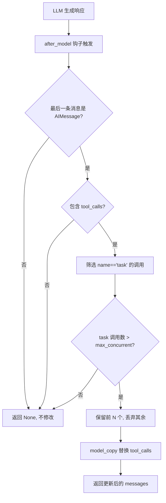
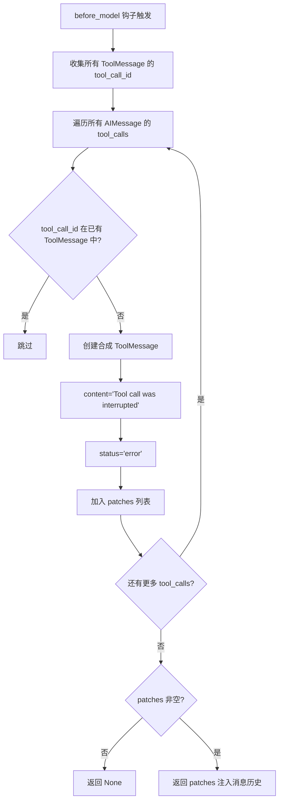

# PD-07.NN DeerFlow — 中间件管道嵌入式质量检查

> 文档编号：PD-07.NN
> 来源：DeerFlow `backend/src/agents/middlewares/`
> GitHub：https://github.com/bytedance/deer-flow.git
> 问题域：PD-07 质量检查 Quality Assurance
> 状态：可复用方案

---

## 第 1 章 问题与动机

### 1.1 核心问题

Agent 系统在多轮对话中面临三类质量退化风险：

1. **并发失控** — LLM 在单次响应中生成过多并行工具调用（如一次派出 8 个子代理），导致资源耗尽、响应超时、结果质量下降
2. **消息历史损坏** — 用户中断、请求取消或网络异常导致 AIMessage 中的 tool_calls 没有对应的 ToolMessage 回复，LLM 在下一轮收到格式不完整的对话历史后产生幻觉或报错
3. **任务追踪缺失** — 复杂多步任务中缺乏结构化进度追踪，Agent 容易遗漏步骤或重复执行

这三类问题的共同特征是：**仅靠 prompt 约束不可靠**。LLM 可能忽略"最多并行 3 个"的指令，无法自行修复损坏的消息历史，也难以在长对话中保持任务状态一致。

### 1.2 DeerFlow 的解法概述

DeerFlow 2.0 采用**中间件管道嵌入式质量检查**策略，将质量保障逻辑分散到 11 层中间件管道的不同位置，而非构建独立的质量检查模块：

1. **SubagentLimitMiddleware** (`subagent_limit_middleware.py:24`) — `after_model` 钩子硬性截断超限 task 工具调用，保留前 N 个丢弃其余
2. **DanglingToolCallMiddleware** (`dangling_tool_call_middleware.py:22`) — `before_model` 钩子扫描消息历史，为缺失 ToolMessage 的 tool_call 注入合成错误响应
3. **TodoListMiddleware** (`lead_agent/agent.py:62`) — Plan 模式下注入 `write_todos` 工具，通过 ThreadState.todos 字段追踪任务完成状态
4. **ViewImageMiddleware** (`view_image_middleware.py:63`) — 验证所有 view_image 工具调用已完成后才注入图片数据，防止不完整数据进入 LLM

### 1.3 设计思想

| 设计原则 | 具体实现 | 理由 | 替代方案 |
|----------|----------|------|----------|
| 硬件级约束优于 prompt 约束 | SubagentLimitMiddleware 直接截断 tool_calls 列表 | LLM 可能忽略 prompt 中的并发限制 | 在 prompt 中写"最多 3 个并行任务" |
| 修补优于拒绝 | DanglingToolCallMiddleware 注入合成 ToolMessage 而非丢弃损坏消息 | 保留对话上下文连续性，LLM 能看到"工具被中断"的信息 | 截断消息历史到最后一条完整消息 |
| 条件激活减少开销 | TodoListMiddleware 仅在 is_plan_mode=True 时创建 | 简单对话不需要任务追踪的额外 token 消耗 | 始终启用，用 prompt 控制是否使用 |
| 位置即语义 | 中间件在管道中的顺序决定其检查时机（before_model vs after_model） | 不同质量问题需要在不同阶段拦截 | 统一的 pre/post 检查器 |
| 参数钳位防御 | _clamp_subagent_limit 将并发数限制在 [2,4] 范围 | 防止配置错误导致极端值（0 或 100） | 信任调用方传入合理值 |

---

## 第 2 章 源码实现分析

### 2.1 架构概览

DeerFlow 的质量检查不是独立模块，而是嵌入在 11 层中间件管道中。每个中间件通过 `AgentMiddleware` 基类的钩子方法在特定时机执行检查：

```
┌─────────────────────────────────────────────────────────────────┐
│                    Lead Agent 中间件管道                          │
│                                                                 │
│  ┌──────────────┐  ┌──────────────┐  ┌──────────────────────┐  │
│  │ThreadData    │→ │Uploads       │→ │Sandbox               │  │
│  │Middleware    │  │Middleware    │  │Middleware            │  │
│  └──────────────┘  └──────────────┘  └──────────────────────┘  │
│         ↓                                                       │
│  ┌──────────────────────┐  ┌──────────────────────────────┐    │
│  │DanglingToolCall      │→ │SummarizationMiddleware       │    │
│  │Middleware ★质量检查   │  │(可选)                        │    │
│  │[before_model]        │  └──────────────────────────────┘    │
│  └──────────────────────┘                                       │
│         ↓                                                       │
│  ┌──────────────────────┐  ┌──────────────┐  ┌────────────┐   │
│  │TodoListMiddleware    │→ │Title         │→ │Memory      │   │
│  │★质量检查(Plan模式)   │  │Middleware    │  │Middleware  │   │
│  └──────────────────────┘  └──────────────┘  └────────────┘   │
│         ↓                                                       │
│  ┌──────────────────────┐  ┌──────────────────────────────┐    │
│  │ViewImageMiddleware   │→ │SubagentLimitMiddleware       │    │
│  │★完整性验证           │  │★质量检查 [after_model]       │    │
│  └──────────────────────┘  └──────────────────────────────┘    │
│         ↓                                                       │
│  ┌──────────────────────┐                                       │
│  │ClarificationMiddle   │  ← 始终最后                           │
│  │ware [wrap_tool_call] │                                       │
│  └──────────────────────┘                                       │
└─────────────────────────────────────────────────────────────────┘
```

### 2.2 核心实现

#### 2.2.1 SubagentLimitMiddleware — 并发截断



对应源码 `backend/src/agents/middlewares/subagent_limit_middleware.py:40-67`：

```python
def _truncate_task_calls(self, state: AgentState) -> dict | None:
    messages = state.get("messages", [])
    if not messages:
        return None

    last_msg = messages[-1]
    if getattr(last_msg, "type", None) != "ai":
        return None

    tool_calls = getattr(last_msg, "tool_calls", None)
    if not tool_calls:
        return None

    # Count task tool calls
    task_indices = [i for i, tc in enumerate(tool_calls) if tc.get("name") == "task"]
    if len(task_indices) <= self.max_concurrent:
        return None

    # Build set of indices to drop (excess task calls beyond the limit)
    indices_to_drop = set(task_indices[self.max_concurrent :])
    truncated_tool_calls = [tc for i, tc in enumerate(tool_calls) if i not in indices_to_drop]

    dropped_count = len(indices_to_drop)
    logger.warning(
        f"Truncated {dropped_count} excess task tool call(s) "
        f"from model response (limit: {self.max_concurrent})"
    )

    # Replace the AIMessage with truncated tool_calls (same id triggers replacement)
    updated_msg = last_msg.model_copy(update={"tool_calls": truncated_tool_calls})
    return {"messages": [updated_msg]}
```

关键设计点：
- **只截断 `task` 类型的工具调用**（`subagent_limit_middleware.py:54`），其他工具调用（如搜索、文件操作）不受影响
- **保留顺序前 N 个**（`subagent_limit_middleware.py:59`），假设 LLM 按优先级排列工具调用
- **使用 `model_copy`** 而非直接修改（`subagent_limit_middleware.py:66`），保持 Pydantic 模型不可变性
- **参数钳位**（`subagent_limit_middleware.py:19-21`）：`_clamp_subagent_limit` 将值限制在 [2, 4]

#### 2.2.2 DanglingToolCallMiddleware — 消息历史修补



对应源码 `backend/src/agents/middlewares/dangling_tool_call_middleware.py:30-66`：

```python
def _fix_dangling_tool_calls(self, state: AgentState) -> dict | None:
    messages = state.get("messages", [])
    if not messages:
        return None

    # Collect IDs of all existing ToolMessages
    existing_tool_msg_ids: set[str] = set()
    for msg in messages:
        if isinstance(msg, ToolMessage):
            existing_tool_msg_ids.add(msg.tool_call_id)

    # Find dangling tool calls and build patch messages
    patches: list[ToolMessage] = []
    for msg in messages:
        if getattr(msg, "type", None) != "ai":
            continue
        tool_calls = getattr(msg, "tool_calls", None)
        if not tool_calls:
            continue
        for tc in tool_calls:
            tc_id = tc.get("id")
            if tc_id and tc_id not in existing_tool_msg_ids:
                patches.append(
                    ToolMessage(
                        content="[Tool call was interrupted and did not return a result.]",
                        tool_call_id=tc_id,
                        name=tc.get("name", "unknown"),
                        status="error",
                    )
                )
                existing_tool_msg_ids.add(tc_id)

    if not patches:
        return None

    logger.warning(f"Injecting {len(patches)} placeholder ToolMessage(s) for dangling tool calls")
    return {"messages": patches}
```

关键设计点：
- **全历史扫描**（`dangling_tool_call_middleware.py:37-39`）：不仅检查最后一条消息，而是扫描整个消息历史
- **幂等性**（`dangling_tool_call_middleware.py:60`）：通过 `existing_tool_msg_ids.add(tc_id)` 防止同一 dangling call 被重复修补
- **语义化错误内容**（`dangling_tool_call_middleware.py:53`）：`"[Tool call was interrupted...]"` 让 LLM 理解工具未完成，而非收到空响应

### 2.3 实现细节

#### 中间件管道构建与条件激活

`backend/src/agents/lead_agent/agent.py:186-235` 中的 `_build_middlewares` 函数展示了条件激活逻辑：

```python
def _build_middlewares(config: RunnableConfig):
    middlewares = [
        ThreadDataMiddleware(),
        UploadsMiddleware(),
        SandboxMiddleware(),
        DanglingToolCallMiddleware(),  # 始终启用 — 消息完整性是基础保障
    ]

    # 可选：上下文压缩
    summarization_middleware = _create_summarization_middleware()
    if summarization_middleware is not None:
        middlewares.append(summarization_middleware)

    # 可选：Plan 模式任务追踪
    is_plan_mode = config.get("configurable", {}).get("is_plan_mode", False)
    todo_list_middleware = _create_todo_list_middleware(is_plan_mode)
    if todo_list_middleware is not None:
        middlewares.append(todo_list_middleware)

    # ... Title, Memory, ViewImage ...

    # 可选：子代理并发限制
    subagent_enabled = config.get("configurable", {}).get("subagent_enabled", False)
    if subagent_enabled:
        max_concurrent = config.get("configurable", {}).get("max_concurrent_subagents", 3)
        middlewares.append(SubagentLimitMiddleware(max_concurrent=max_concurrent))

    # ClarificationMiddleware 始终最后
    middlewares.append(ClarificationMiddleware())
    return middlewares
```

**条件激活矩阵：**

| 中间件 | 激活条件 | 钩子类型 |
|--------|----------|----------|
| DanglingToolCallMiddleware | 始终启用 | before_model |
| SubagentLimitMiddleware | subagent_enabled=True | after_model |
| TodoListMiddleware | is_plan_mode=True | 注入工具 |
| ViewImageMiddleware | model.supports_vision=True | before_model |

#### ThreadState 中的质量相关字段

`backend/src/agents/thread_state.py:48-55`：

```python
class ThreadState(AgentState):
    sandbox: NotRequired[SandboxState | None]
    thread_data: NotRequired[ThreadDataState | None]
    title: NotRequired[str | None]
    artifacts: Annotated[list[str], merge_artifacts]    # 去重 reducer
    todos: NotRequired[list | None]                     # TodoList 状态
    uploaded_files: NotRequired[list[dict] | None]
    viewed_images: Annotated[dict[str, ViewedImageData], merge_viewed_images]
```

`merge_artifacts` reducer（`thread_state.py:21-28`）使用 `dict.fromkeys` 实现去重同时保序，防止重复产物污染输出。

#### SubagentExecutor 的双线程池架构

`backend/src/subagents/executor.py:69-74`：

```python
_scheduler_pool = ThreadPoolExecutor(max_workers=3, thread_name_prefix="subagent-scheduler-")
_execution_pool = ThreadPoolExecutor(max_workers=3, thread_name_prefix="subagent-exec-")
```

调度池与执行池分离，配合 SubagentLimitMiddleware 的 [2,4] 钳位，确保即使 LLM 请求更多并发，实际执行也不会超过线程池容量。


---

## 第 3 章 迁移指南

### 3.1 迁移清单

**阶段 1：消息完整性保障（必须）**

- [ ] 实现 DanglingToolCallMiddleware 等价逻辑
- [ ] 在 Agent 框架的 `before_model` 钩子中注册
- [ ] 确认合成 ToolMessage 的 `status="error"` 字段被目标 LLM 正确理解

**阶段 2：并发控制（推荐）**

- [ ] 实现 SubagentLimitMiddleware 等价逻辑
- [ ] 确定目标系统中"子代理调用"的工具名称（DeerFlow 中是 `"task"`）
- [ ] 配置合理的并发上限和钳位范围
- [ ] 在 `after_model` 钩子中注册

**阶段 3：任务追踪（可选）**

- [ ] 在 Agent 状态中添加 `todos` 字段
- [ ] 实现 TodoList 工具的注入逻辑
- [ ] 配置激活条件（如 plan_mode 开关）

### 3.2 适配代码模板

以下模板适用于任何基于 LangChain/LangGraph 的 Agent 系统：

```python
"""可复用的消息完整性修补中间件模板。"""

from langchain.agents import AgentState
from langchain.agents.middleware import AgentMiddleware
from langchain_core.messages import ToolMessage
from langgraph.runtime import Runtime


class MessageIntegrityMiddleware(AgentMiddleware[AgentState]):
    """修补消息历史中缺失的 ToolMessage。

    适用场景：
    - 用户中断导致工具调用未完成
    - 网络超时导致 ToolMessage 丢失
    - 异步执行中的竞态条件
    """

    def __init__(self, error_content: str = "[Tool call was interrupted.]"):
        super().__init__()
        self.error_content = error_content

    def _fix(self, state: AgentState) -> dict | None:
        messages = state.get("messages", [])
        if not messages:
            return None

        # 收集已有 ToolMessage ID
        existing_ids: set[str] = {
            msg.tool_call_id
            for msg in messages
            if isinstance(msg, ToolMessage)
        }

        # 查找悬空的 tool_calls
        patches: list[ToolMessage] = []
        for msg in messages:
            if getattr(msg, "type", None) != "ai":
                continue
            for tc in getattr(msg, "tool_calls", []) or []:
                tc_id = tc.get("id")
                if tc_id and tc_id not in existing_ids:
                    patches.append(ToolMessage(
                        content=self.error_content,
                        tool_call_id=tc_id,
                        name=tc.get("name", "unknown"),
                        status="error",
                    ))
                    existing_ids.add(tc_id)

        return {"messages": patches} if patches else None

    def before_model(self, state, runtime) -> dict | None:
        return self._fix(state)

    async def abefore_model(self, state, runtime) -> dict | None:
        return self._fix(state)


class ConcurrencyLimitMiddleware(AgentMiddleware[AgentState]):
    """截断超限的并行工具调用。

    Args:
        tool_name: 要限制的工具名称
        max_concurrent: 最大并发数
        min_limit: 钳位下限
        max_limit: 钳位上限
    """

    def __init__(
        self,
        tool_name: str = "task",
        max_concurrent: int = 3,
        min_limit: int = 2,
        max_limit: int = 4,
    ):
        super().__init__()
        self.tool_name = tool_name
        self.max_concurrent = max(min_limit, min(max_limit, max_concurrent))

    def _truncate(self, state: AgentState) -> dict | None:
        messages = state.get("messages", [])
        if not messages:
            return None

        last_msg = messages[-1]
        tool_calls = getattr(last_msg, "tool_calls", None)
        if not tool_calls:
            return None

        target_indices = [
            i for i, tc in enumerate(tool_calls)
            if tc.get("name") == self.tool_name
        ]
        if len(target_indices) <= self.max_concurrent:
            return None

        drop = set(target_indices[self.max_concurrent:])
        truncated = [tc for i, tc in enumerate(tool_calls) if i not in drop]
        updated = last_msg.model_copy(update={"tool_calls": truncated})
        return {"messages": [updated]}

    def after_model(self, state, runtime) -> dict | None:
        return self._truncate(state)

    async def aafter_model(self, state, runtime) -> dict | None:
        return self._truncate(state)
```

### 3.3 适用场景

| 场景 | 适用度 | 说明 |
|------|--------|------|
| 多子代理并行系统 | ⭐⭐⭐ | SubagentLimitMiddleware 直接适用 |
| 长对话多轮交互 | ⭐⭐⭐ | DanglingToolCallMiddleware 防止历史损坏 |
| 用户可中断的 Agent | ⭐⭐⭐ | 中断后恢复时消息修补至关重要 |
| 单工具简单 Agent | ⭐ | 无并发问题，消息损坏概率低 |
| 无状态 API 调用 | ⭐ | 每次调用独立，无历史累积问题 |

---

## 第 4 章 测试用例

```python
"""基于 DeerFlow 真实函数签名的测试用例。"""

import pytest
from unittest.mock import MagicMock
from langchain_core.messages import AIMessage, ToolMessage


class TestSubagentLimitMiddleware:
    """测试 SubagentLimitMiddleware 的截断逻辑。"""

    def _make_middleware(self, max_concurrent=3):
        """构造中间件实例，模拟 _clamp_subagent_limit。"""
        from types import SimpleNamespace
        mw = SimpleNamespace()
        mw.max_concurrent = max(2, min(4, max_concurrent))
        return mw

    def test_no_truncation_within_limit(self):
        """task 调用数 <= max_concurrent 时不截断。"""
        tool_calls = [
            {"id": "1", "name": "task", "args": {}},
            {"id": "2", "name": "task", "args": {}},
            {"id": "3", "name": "search", "args": {}},
        ]
        ai_msg = AIMessage(content="", tool_calls=tool_calls)
        state = {"messages": [ai_msg]}

        # max_concurrent=3, task 调用只有 2 个
        mw = self._make_middleware(3)
        task_indices = [i for i, tc in enumerate(tool_calls) if tc.get("name") == "task"]
        assert len(task_indices) <= mw.max_concurrent

    def test_truncation_excess_tasks(self):
        """task 调用数 > max_concurrent 时截断多余的。"""
        tool_calls = [
            {"id": "1", "name": "task", "args": {}},
            {"id": "2", "name": "search", "args": {}},
            {"id": "3", "name": "task", "args": {}},
            {"id": "4", "name": "task", "args": {}},
            {"id": "5", "name": "task", "args": {}},
        ]
        max_concurrent = 2
        task_indices = [i for i, tc in enumerate(tool_calls) if tc.get("name") == "task"]
        indices_to_drop = set(task_indices[max_concurrent:])
        truncated = [tc for i, tc in enumerate(tool_calls) if i not in indices_to_drop]

        # 保留前 2 个 task + 1 个 search = 3 个
        assert len(truncated) == 3
        assert truncated[0]["id"] == "1"  # 第 1 个 task
        assert truncated[1]["id"] == "2"  # search 不受影响
        assert truncated[2]["id"] == "3"  # 第 2 个 task

    def test_clamp_limits(self):
        """参数钳位：值被限制在 [2, 4]。"""
        assert max(2, min(4, 0)) == 2   # 下溢 → 2
        assert max(2, min(4, 10)) == 4  # 上溢 → 4
        assert max(2, min(4, 3)) == 3   # 正常值不变

    def test_non_ai_message_ignored(self):
        """非 AIMessage 不触发截断。"""
        from langchain_core.messages import HumanMessage
        state = {"messages": [HumanMessage(content="hello")]}
        last_msg = state["messages"][-1]
        assert getattr(last_msg, "type", None) != "ai"


class TestDanglingToolCallMiddleware:
    """测试 DanglingToolCallMiddleware 的修补逻辑。"""

    def test_no_dangling_calls(self):
        """所有 tool_calls 都有对应 ToolMessage 时不修补。"""
        ai_msg = AIMessage(content="", tool_calls=[{"id": "tc1", "name": "search", "args": {}}])
        tool_msg = ToolMessage(content="result", tool_call_id="tc1", name="search")
        messages = [ai_msg, tool_msg]

        existing_ids = {msg.tool_call_id for msg in messages if isinstance(msg, ToolMessage)}
        dangling = [
            tc for msg in messages
            if getattr(msg, "type", None) == "ai"
            for tc in getattr(msg, "tool_calls", []) or []
            if tc.get("id") not in existing_ids
        ]
        assert len(dangling) == 0

    def test_dangling_call_detected(self):
        """缺失 ToolMessage 的 tool_call 被检测到。"""
        ai_msg = AIMessage(content="", tool_calls=[
            {"id": "tc1", "name": "search", "args": {}},
            {"id": "tc2", "name": "task", "args": {}},
        ])
        tool_msg = ToolMessage(content="result", tool_call_id="tc1", name="search")
        messages = [ai_msg, tool_msg]

        existing_ids = {msg.tool_call_id for msg in messages if isinstance(msg, ToolMessage)}
        dangling = [
            tc for msg in messages
            if getattr(msg, "type", None) == "ai"
            for tc in getattr(msg, "tool_calls", []) or []
            if tc.get("id") not in existing_ids
        ]
        assert len(dangling) == 1
        assert dangling[0]["id"] == "tc2"

    def test_synthetic_message_format(self):
        """合成 ToolMessage 的格式正确。"""
        patch = ToolMessage(
            content="[Tool call was interrupted and did not return a result.]",
            tool_call_id="tc_orphan",
            name="task",
            status="error",
        )
        assert patch.status == "error"
        assert "interrupted" in patch.content
        assert patch.tool_call_id == "tc_orphan"

    def test_idempotent_patching(self):
        """重复执行不会产生重复的 patch。"""
        existing_ids: set[str] = set()
        tc_id = "tc1"

        # 第一次：tc1 不在 existing_ids 中
        assert tc_id not in existing_ids
        existing_ids.add(tc_id)

        # 第二次：tc1 已在 existing_ids 中
        assert tc_id in existing_ids
```


---

## 第 5 章 跨域关联

| 关联域 | 关系类型 | 说明 |
|--------|----------|------|
| PD-01 上下文管理 | 协同 | DanglingToolCallMiddleware 修补消息历史，直接影响 LLM 接收的上下文质量；SummarizationMiddleware 压缩上下文也是质量保障的一部分 |
| PD-02 多 Agent 编排 | 依赖 | SubagentLimitMiddleware 的截断逻辑依赖编排层的 `task` 工具定义；TodoListMiddleware 的任务追踪与编排层的计划执行紧密耦合 |
| PD-03 容错与重试 | 协同 | DanglingToolCallMiddleware 是容错的一种形式——将损坏的消息历史修复为可用状态，而非触发重试 |
| PD-04 工具系统 | 依赖 | 质量检查中间件通过 `tool_calls` 字段与工具系统交互；SubagentLimitMiddleware 按工具名称 `"task"` 过滤 |
| PD-09 Human-in-the-Loop | 协同 | ClarificationMiddleware 在质量检查管道末端拦截澄清请求，是人机协作的入口；TodoListMiddleware 让用户可见任务进度 |
| PD-10 中间件管道 | 依赖 | 所有质量检查逻辑都依赖中间件管道基础设施（AgentMiddleware 基类、before_model/after_model 钩子） |
| PD-11 可观测性 | 协同 | SubagentLimitMiddleware 和 DanglingToolCallMiddleware 都通过 `logger.warning` 记录质量事件，为可观测性提供信号 |

---

## 第 6 章 来源文件索引

| 文件 | 行范围 | 关键实现 |
|------|--------|----------|
| `backend/src/agents/middlewares/subagent_limit_middleware.py` | L1-76 | SubagentLimitMiddleware 完整实现，含参数钳位和截断逻辑 |
| `backend/src/agents/middlewares/dangling_tool_call_middleware.py` | L1-75 | DanglingToolCallMiddleware 完整实现，含全历史扫描和合成 ToolMessage |
| `backend/src/agents/lead_agent/agent.py` | L62-174 | TodoListMiddleware 工厂函数，含 system_prompt 和 tool_description |
| `backend/src/agents/lead_agent/agent.py` | L186-235 | _build_middlewares 管道构建，含条件激活和顺序注释 |
| `backend/src/agents/lead_agent/agent.py` | L238-265 | make_lead_agent 入口，组装模型+工具+中间件 |
| `backend/src/agents/thread_state.py` | L48-55 | ThreadState 定义，含 todos 和 artifacts 字段 |
| `backend/src/agents/thread_state.py` | L21-28 | merge_artifacts 去重 reducer |
| `backend/src/subagents/executor.py` | L25-32 | SubagentStatus 枚举（PENDING/RUNNING/COMPLETED/FAILED/TIMED_OUT） |
| `backend/src/subagents/executor.py` | L35-62 | SubagentResult 数据类，含 trace_id 分布式追踪 |
| `backend/src/subagents/executor.py` | L69-74 | 双线程池定义（scheduler 3 + execution 3） |
| `backend/src/agents/middlewares/view_image_middleware.py` | L63-92 | _all_tools_completed 工具完成验证 |
| `backend/src/agents/middlewares/clarification_middleware.py` | L91-129 | _handle_clarification 中断执行并返回 Command |

---

## 第 7 章 横向对比维度

> **重要：** 本章用于自动填充 Butcher Wiki 的横向对比表。
> 必须严格按以下 JSON 格式输出，放在 `comparison_data` 代码块中。

```json comparison_data
{
  "project": "DeerFlow",
  "dimensions": {
    "检查方式": "中间件管道嵌入式检查，before_model/after_model 双钩子分时拦截",
    "评估维度": "消息完整性 + 并发合规性 + 任务进度",
    "评估粒度": "单条 AIMessage 级别（tool_calls 列表）",
    "迭代机制": "无迭代，单次截断/修补即生效",
    "反馈机制": "logger.warning 日志 + 合成 error ToolMessage",
    "自动修复": "DanglingToolCallMiddleware 自动注入合成 ToolMessage 修补历史",
    "覆盖范围": "消息格式完整性 + 子代理并发 + Plan 模式任务追踪",
    "并发策略": "SubagentLimitMiddleware 硬截断，钳位 [2,4]",
    "降级路径": "截断多余调用而非拒绝整个响应",
    "人机协作": "TodoListMiddleware 提供任务可见性，ClarificationMiddleware 拦截澄清",
    "配置驱动": "is_plan_mode/subagent_enabled/supports_vision 三开关条件激活",
    "安全防护": "_clamp_subagent_limit 参数钳位防止极端配置值"
  }
}
```

### 域元数据补充

```json domain_metadata
{
  "solution_summary": "DeerFlow 通过 11 层中间件管道嵌入式质量检查，SubagentLimitMiddleware 硬截断超限并发，DanglingToolCallMiddleware 自动修补损坏消息历史，TodoListMiddleware 条件追踪任务进度",
  "description": "质量检查可嵌入中间件管道而非独立模块，通过钩子时机分离不同检查关注点",
  "sub_problems": [
    "消息历史悬空修补：AIMessage 的 tool_calls 缺少对应 ToolMessage 时的自动修复",
    "并发硬截断：LLM 生成超限并行工具调用时的非 prompt 级强制限制",
    "条件激活开销控制：质量检查中间件按运行时配置选择性启用避免不必要开销",
    "工具完成验证：多工具调用场景下验证所有调用均已完成后再进入下一阶段"
  ],
  "best_practices": [
    "中间件位置即语义：before_model 修补输入质量，after_model 约束输出质量，钩子选择决定检查时机",
    "参数钳位防御极端值：并发限制等数值参数用 clamp 函数限制在安全范围，不信任调用方",
    "修补优于拒绝：损坏的消息历史注入合成错误响应而非截断，保留上下文连续性",
    "幂等性保证：修补逻辑通过 Set 追踪已处理 ID，重复执行不产生副作用"
  ]
}
```
