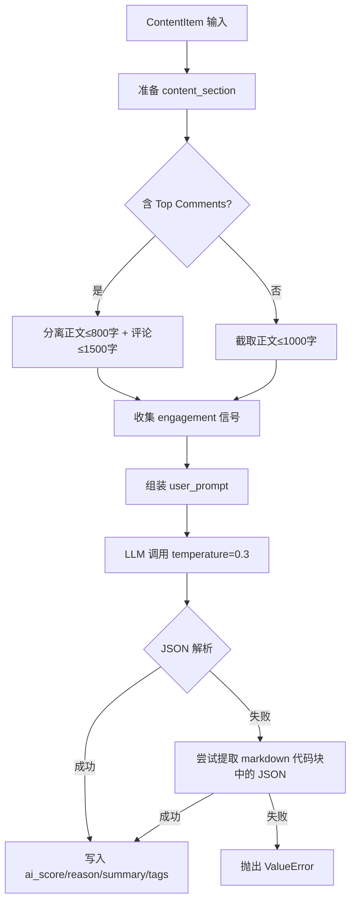
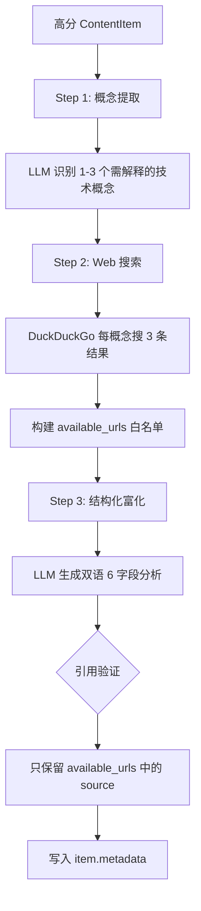

# PD-07.06 Horizon — 两阶段 AI 质量评估与富化管线

> 文档编号：PD-07.06
> 来源：Horizon `src/ai/analyzer.py` `src/ai/enricher.py` `src/ai/prompts.py`
> GitHub：https://github.com/Thysrael/Horizon.git
> 问题域：PD-07 质量检查 Quality Assurance
> 状态：可复用方案

---

## 第 1 章 问题与动机

### 1.1 核心问题

多源内容聚合系统面临一个根本矛盾：信息源（GitHub、Hacker News、Reddit、RSS、Telegram）每日产出数百条内容，但真正值得用户关注的不到 10%。传统的基于规则的过滤（如 HN score ≥ 100）只能做粗筛，无法判断内容的技术深度、新颖性和行业影响力。更关键的是，通过初筛的高价值内容仍然缺乏上下文——读者可能不了解某个新发布的工具或协议的背景，需要额外的解释和关联信息才能快速理解。

这就产生了两个层次的质量问题：
1. **筛选质量**：如何从海量内容中精准识别高价值信息？
2. **呈现质量**：如何让筛选出的内容自带足够的上下文，降低读者的理解成本？

### 1.2 Horizon 的解法概述

Horizon 采用两阶段 AI 管线（Two-Pass AI Pipeline）解决上述问题：

1. **第一阶段 — 评分筛选**（`src/ai/analyzer.py:13-141`）：ContentAnalyzer 对每条内容执行结构化评分（0-10 分 5 级），融合内容质量和社区互动信号，输出 score + reason + summary + tags
2. **第二阶段 — 深度富化**（`src/ai/enricher.py:24-212`）：ContentEnricher 对通过阈值（默认 ≥ 7.0）的高分内容执行三步富化——概念提取 → Web 搜索 → 结构化双语分析
3. **配置驱动阈值**（`src/models.py:134-138`）：FilteringConfig 定义 `ai_score_threshold` 和 `time_window_hours`，阈值可热调整
4. **引用验证**（`src/ai/enricher.py:199-207`）：富化阶段的 sources 字段只保留实际来自搜索结果的 URL，防止 LLM 幻觉引用
5. **优雅降级**（`src/ai/analyzer.py:41-46`）：分析失败的条目自动赋 0 分并标记 "Analysis failed"，不阻塞批处理

### 1.3 设计思想

| 设计原则 | 具体实现 | 理由 | 替代方案 |
|----------|----------|------|----------|
| 两阶段分离 | Analyzer（粗筛）→ Enricher（精加工） | 避免对低价值内容浪费 LLM + 搜索资源 | 单阶段全量分析（成本高 3-5 倍） |
| 结构化评分标准 | 5 级 rubric（0-2/3-4/5-6/7-8/9-10）写入 system prompt | 减少 LLM 评分漂移，提供可解释的评分依据 | 自由打分（一致性差） |
| 社区信号融合 | engagement_items 收集 score/comments/likes/retweets/views | 社区验证过的内容更可靠 | 纯内容分析（忽略社会证明） |
| 搜索增强富化 | DuckDuckGo 搜索概念 → 搜索结果注入 enrichment prompt | 确保背景知识有事实依据，非 LLM 编造 | 纯 LLM 生成背景（幻觉风险高） |
| 引用白名单验证 | `available_urls` 字典过滤 LLM 输出的 sources | 防止 LLM 编造不存在的 URL | 信任 LLM 输出（引用不可靠） |

---

## 第 2 章 源码实现分析

### 2.1 架构概览

Horizon 的质量评估管线由 HorizonOrchestrator 编排，核心数据流如下：

```
┌──────────────────────────────────────────────────────────────────────┐
│                    HorizonOrchestrator.run()                        │
│                    src/orchestrator.py:39-153                        │
├──────────────────────────────────────────────────────────────────────┤
│                                                                      │
│  ┌─────────────┐    ┌──────────────┐    ┌─────────────────────┐     │
│  │ 多源抓取     │───→│ URL 去重      │───→│ ContentAnalyzer     │     │
│  │ GitHub/HN/  │    │ + 内容合并    │    │ 第一阶段: 0-10 评分  │     │
│  │ RSS/Reddit/ │    │ :252-304     │    │ :13-141              │     │
│  │ Telegram    │    └──────────────┘    └────────┬────────────┘     │
│  └─────────────┘                                 │                   │
│                                                  ▼                   │
│                              ┌────────────────────────────┐          │
│                              │ 阈值过滤 (score ≥ 7.0)     │          │
│                              │ orchestrator.py:72-77       │          │
│                              └────────────┬───────────────┘          │
│                                           │                          │
│                                           ▼                          │
│                              ┌────────────────────────────┐          │
│                              │ 语义去重 (Jaccard + Tags)   │          │
│                              │ orchestrator.py:348-382     │          │
│                              └────────────┬───────────────┘          │
│                                           │                          │
│                                           ▼                          │
│                              ┌────────────────────────────┐          │
│                              │ ContentEnricher             │          │
│                              │ 第二阶段: 概念提取→搜索→富化 │          │
│                              │ enricher.py:24-212          │          │
│                              └────────────┬───────────────┘          │
│                                           │                          │
│                                           ▼                          │
│                              ┌────────────────────────────┐          │
│                              │ DailySummarizer             │          │
│                              │ 双语 Markdown 输出          │          │
│                              └────────────────────────────┘          │
└──────────────────────────────────────────────────────────────────────┘
```

### 2.2 核心实现

#### 2.2.1 第一阶段：结构化评分（ContentAnalyzer）



对应源码 `src/ai/analyzer.py:55-141`：

```python
@retry(
    stop=stop_after_attempt(3),
    wait=wait_exponential(min=2, max=10)
)
async def _analyze_item(self, item: ContentItem) -> None:
    # 分离正文与评论
    content_section = ""
    if item.content:
        content_text = item.content
        if "--- Top Comments ---" in content_text:
            main, comments_part = content_text.split("--- Top Comments ---", 1)
            content_section = f"Content: {main.strip()[:800]}"
        else:
            content_section = f"Content: {content_text[:1000]}"

    # 收集社区互动信号
    discussion_parts = []
    meta = item.metadata
    engagement_items = []
    if meta.get("score"):
        engagement_items.append(f"score: {meta['score']}")
    if meta.get("descendants"):
        engagement_items.append(f"{meta['descendants']} comments")
    if meta.get("favorite_count"):
        engagement_items.append(f"{meta['favorite_count']} likes")
    # ... retweets, replies, views, bookmarks, upvote_ratio

    # LLM 调用
    response = await self.client.complete(
        system=CONTENT_ANALYSIS_SYSTEM,
        user=user_prompt,
        temperature=0.3
    )

    # JSON 解析 + markdown 代码块 fallback
    try:
        result = json.loads(response)
    except json.JSONDecodeError:
        if "```json" in response:
            json_str = response.split("```json")[1].split("```")[0].strip()
            result = json.loads(json_str)
```

评分标准定义在 `src/ai/prompts.py:3-40`，采用 5 级 rubric：

| 分数段 | 级别 | 标准 |
|--------|------|------|
| 9-10 | Groundbreaking | 重大突破、范式转变、广泛使用技术的大版本发布 |
| 7-8 | High Value | 技术深度文章、新颖方法、有价值的工具/库 |
| 5-6 | Interesting | 增量改进、有用教程、中等社区关注 |
| 3-4 | Low Priority | 小更新、常识内容、过度推广 |
| 0-2 | Noise | 垃圾/推广、离题、琐碎更新 |

#### 2.2.2 第二阶段：三步富化（ContentEnricher）



对应源码 `src/ai/enricher.py:109-212`：

```python
@retry(stop=stop_after_attempt(3), wait=wait_exponential(min=2, max=10))
async def _enrich_item(self, item: ContentItem) -> None:
    # Step 1: AI 识别需要解释的概念
    queries = await self._extract_concepts(item, content_text)

    # Step 2: 每个概念搜索 Web
    all_results = []
    for query in queries:
        results = await self._web_search(query)
        all_results.extend(results)

    # 构建引用白名单
    available_urls = {r["url"]: r["title"] for r in all_results if r.get("url")}

    # Step 3: LLM 生成结构化双语分析
    response = await self.client.complete(
        system=CONTENT_ENRICHMENT_SYSTEM,
        user=user_prompt,
        temperature=0.4
    )

    # 引用验证：只保留搜索结果中实际存在的 URL
    if result.get("sources") and available_urls:
        valid = [
            {"url": u, "title": available_urls[u]}
            for u in result["sources"]
            if u in available_urls
        ]
        if valid:
            item.metadata["sources"] = valid
```

富化输出的 6 个结构化字段（每个都有 `_en` 和 `_zh` 双语版本，定义在 `src/ai/prompts.py:82-116`）：

| 字段 | 用途 | 约束 |
|------|------|------|
| `title` | 清晰准确的标题 | ≤15 词 |
| `whats_new` | 发生了什么 | 1-2 句，含具体名称/版本/数字 |
| `why_it_matters` | 为什么重要 | 1-2 句，连接生态/趋势 |
| `key_details` | 技术细节 | 1-2 句，面向技术读者 |
| `background` | 背景知识 | 2-4 句，基于搜索结果 |
| `community_discussion` | 社区讨论摘要 | 1-3 句，有评论时才填 |

### 2.3 实现细节

#### 2.3.1 JSON 解析容错

Analyzer 和 Enricher 都实现了相同的 JSON 解析 fallback 链（`analyzer.py:123-134`，`enricher.py:168-178`）：

1. 先尝试 `json.loads(response)` 直接解析
2. 失败则检查 ````json` 代码块并提取
3. 再失败则检查通用 ``` 代码块
4. 全部失败抛出 `ValueError`

#### 2.3.2 语义去重双策略

`orchestrator.py:348-382` 实现了两种去重判定条件（OR 关系）：
- **标题相似度**：Jaccard(title_tokens_A, title_tokens_B) ≥ 0.33
- **标签 + 标题联合**：共享 ≥ 2 个 ai_tags 且 title Jaccard ≥ 0.15

去重时保留高分条目，低分条目的评论内容合并到高分条目中（`_merge_item_content`）。

#### 2.3.3 多提供商 AI 客户端

`src/ai/client.py:191-212` 的工厂函数支持 4 种 AI 提供商（Anthropic/OpenAI/Gemini/Doubao），Doubao 复用 OpenAI 兼容接口。评分和富化共用同一个 AI 客户端实例，不做模型隔离。

---

## 第 3 章 迁移指南

### 3.1 迁移清单

**阶段 1：核心评分器（1-2 天）**
- [ ] 定义 ContentItem 数据模型（Pydantic BaseModel，含 ai_score/ai_reason/ai_summary/ai_tags 字段）
- [ ] 编写 5 级评分 rubric system prompt，根据你的领域调整每级标准
- [ ] 实现 ContentAnalyzer，含 JSON 解析 fallback 链
- [ ] 添加 tenacity 重试装饰器（3 次指数退避）
- [ ] 实现批处理 + 失败条目降级（score=0）

**阶段 2：阈值过滤 + 去重（0.5 天）**
- [ ] 在配置中定义 `ai_score_threshold`（建议初始值 7.0）
- [ ] 实现 Jaccard 标题相似度去重
- [ ] 可选：添加 tag 联合去重策略

**阶段 3：富化管线（1-2 天）**
- [ ] 实现概念提取 prompt（识别需要解释的技术概念）
- [ ] 集成搜索 API（DuckDuckGo/Tavily/SerpAPI）
- [ ] 实现结构化富化 prompt（whats_new/why_it_matters/key_details/background）
- [ ] 添加引用白名单验证（available_urls 过滤）

**阶段 4：多提供商支持（可选，0.5 天）**
- [ ] 抽象 AIClient 基类
- [ ] 实现工厂函数 create_ai_client()

### 3.2 适配代码模板

以下是一个可直接运行的最小化两阶段评估器：

```python
"""Minimal two-pass quality evaluator inspired by Horizon."""

import json
from dataclasses import dataclass, field
from typing import Optional
from tenacity import retry, stop_after_attempt, wait_exponential

SCORING_RUBRIC = """Score content on a 0-10 scale:
9-10: Groundbreaking — major breakthroughs, paradigm shifts
7-8: High Value — important developments, novel approaches
5-6: Interesting — incremental improvements, useful tutorials
3-4: Low Priority — minor updates, generic content
0-2: Noise — spam, off-topic, trivial

Consider: technical depth, novelty, potential impact, community engagement.
Respond with JSON: {"score": <0-10>, "reason": "<why>", "summary": "<one-line>", "tags": ["..."]}"""


@dataclass
class ScoredItem:
    id: str
    title: str
    content: str
    score: Optional[float] = None
    reason: Optional[str] = None
    summary: Optional[str] = None
    tags: list = field(default_factory=list)
    background: Optional[str] = None


def parse_llm_json(response: str) -> dict:
    """Parse JSON from LLM response with markdown code block fallback."""
    try:
        return json.loads(response)
    except json.JSONDecodeError:
        for prefix in ("```json", "```"):
            if prefix in response:
                json_str = response.split(prefix)[1].split("```")[0].strip()
                return json.loads(json_str)
        raise ValueError(f"Cannot parse JSON: {response[:200]}")


class TwoPassEvaluator:
    """Two-pass quality evaluator: score → filter → enrich."""

    def __init__(self, llm_client, search_fn=None, threshold: float = 7.0):
        self.llm = llm_client
        self.search = search_fn  # async (query) -> [{"title", "url", "body"}]
        self.threshold = threshold

    @retry(stop=stop_after_attempt(3), wait=wait_exponential(min=2, max=10))
    async def score(self, item: ScoredItem) -> None:
        """Pass 1: Score and tag the item."""
        response = await self.llm.complete(
            system=SCORING_RUBRIC,
            user=f"Title: {item.title}\nContent: {item.content[:1000]}"
        )
        result = parse_llm_json(response)
        item.score = float(result.get("score", 0))
        item.reason = result.get("reason", "")
        item.summary = result.get("summary", item.title)
        item.tags = result.get("tags", [])

    async def score_batch(self, items: list[ScoredItem]) -> list[ScoredItem]:
        """Score all items, gracefully degrade on failure."""
        for item in items:
            try:
                await self.score(item)
            except Exception:
                item.score = 0.0
                item.reason = "Analysis failed"
        return items

    def filter(self, items: list[ScoredItem]) -> list[ScoredItem]:
        """Keep items above threshold, sorted by score desc."""
        passed = [i for i in items if (i.score or 0) >= self.threshold]
        return sorted(passed, key=lambda x: x.score or 0, reverse=True)

    @retry(stop=stop_after_attempt(3), wait=wait_exponential(min=2, max=10))
    async def enrich(self, item: ScoredItem) -> None:
        """Pass 2: Enrich with web-grounded background."""
        if not self.search:
            return
        results = await self.search(f"{item.title} {' '.join(item.tags[:2])}")
        web_context = "\n".join(
            f"- [{r['title']}]({r['url']}): {r['body']}" for r in results[:5]
        )
        available_urls = {r["url"] for r in results if r.get("url")}

        response = await self.llm.complete(
            system="Generate background knowledge grounded in search results.",
            user=f"Title: {item.title}\nSummary: {item.summary}\n\n"
                 f"Web Results:\n{web_context}\n\n"
                 f"Respond JSON: {{\"background\": \"...\", \"sources\": [\"url\"]}}"
        )
        result = parse_llm_json(response)
        item.background = result.get("background", "")
        # Citation whitelist: only keep URLs from actual search results
        # (prevents LLM hallucinated URLs)
```

### 3.3 适用场景

| 场景 | 适用度 | 说明 |
|------|--------|------|
| 技术内容聚合/日报 | ⭐⭐⭐ | Horizon 的核心场景，直接复用 |
| 论文筛选与摘要 | ⭐⭐⭐ | 评分 rubric 改为学术标准即可 |
| 社交媒体监控 | ⭐⭐ | 需要调整 engagement 信号权重 |
| 代码审查质量评估 | ⭐ | 评分维度完全不同，需重写 rubric |
| 实时流式内容过滤 | ⭐ | 两阶段管线有延迟，不适合实时场景 |

---

## 第 4 章 测试用例

```python
"""Tests for Horizon-style two-pass quality evaluation."""

import json
import pytest
from unittest.mock import AsyncMock, MagicMock
from dataclasses import dataclass, field
from typing import Optional


@dataclass
class MockItem:
    id: str = "test:1"
    title: str = "Test Title"
    content: str = "Test content"
    score: Optional[float] = None
    reason: Optional[str] = None
    summary: Optional[str] = None
    tags: list = field(default_factory=list)
    background: Optional[str] = None


class TestContentAnalyzer:
    """Tests for first-pass scoring."""

    @pytest.mark.asyncio
    async def test_normal_scoring(self):
        """LLM returns valid JSON → item gets scored."""
        mock_client = AsyncMock()
        mock_client.complete.return_value = json.dumps({
            "score": 8.5,
            "reason": "Novel approach to distributed caching",
            "summary": "New distributed cache with sub-ms latency",
            "tags": ["distributed-systems", "caching", "performance"]
        })

        item = MockItem(title="SubMs Cache", content="A new distributed cache...")
        # Simulate analyzer logic
        response = await mock_client.complete(system="", user="")
        result = json.loads(response)
        item.score = float(result["score"])
        item.tags = result["tags"]

        assert item.score == 8.5
        assert "caching" in item.tags

    @pytest.mark.asyncio
    async def test_json_in_markdown_block(self):
        """LLM wraps JSON in markdown code block → still parses."""
        raw = '```json\n{"score": 7, "reason": "good", "summary": "s", "tags": []}\n```'
        try:
            result = json.loads(raw)
        except json.JSONDecodeError:
            json_str = raw.split("```json")[1].split("```")[0].strip()
            result = json.loads(json_str)
        assert result["score"] == 7

    @pytest.mark.asyncio
    async def test_failure_degrades_to_zero(self):
        """Analysis failure → score=0, reason='Analysis failed'."""
        item = MockItem()
        try:
            raise ValueError("LLM returned garbage")
        except Exception:
            item.score = 0.0
            item.reason = "Analysis failed"
            item.summary = item.title
        assert item.score == 0.0
        assert item.reason == "Analysis failed"


class TestThresholdFilter:
    """Tests for score-based filtering."""

    def test_threshold_filtering(self):
        """Items below threshold are excluded."""
        items = [
            MockItem(id="1", score=9.0),
            MockItem(id="2", score=5.0),
            MockItem(id="3", score=7.5),
            MockItem(id="4", score=6.9),
        ]
        threshold = 7.0
        passed = [i for i in items if (i.score or 0) >= threshold]
        assert len(passed) == 2
        assert all(i.score >= 7.0 for i in passed)

    def test_empty_input(self):
        """No items → no output."""
        passed = [i for i in [] if (getattr(i, 'score', 0) or 0) >= 7.0]
        assert passed == []


class TestCitationValidation:
    """Tests for enrichment citation whitelist."""

    def test_valid_urls_kept(self):
        """Only URLs from search results are kept."""
        available_urls = {
            "https://example.com/a": "Article A",
            "https://example.com/b": "Article B",
        }
        llm_sources = [
            "https://example.com/a",
            "https://hallucinated.com/fake",
            "https://example.com/b",
        ]
        valid = [
            {"url": u, "title": available_urls[u]}
            for u in llm_sources if u in available_urls
        ]
        assert len(valid) == 2
        assert all(v["url"].startswith("https://example.com") for v in valid)

    def test_all_hallucinated(self):
        """All LLM URLs are hallucinated → empty sources."""
        available_urls = {"https://real.com": "Real"}
        llm_sources = ["https://fake1.com", "https://fake2.com"]
        valid = [
            {"url": u, "title": available_urls[u]}
            for u in llm_sources if u in available_urls
        ]
        assert valid == []


class TestSemanticDedup:
    """Tests for Jaccard-based topic deduplication."""

    @staticmethod
    def jaccard(a: set, b: set) -> float:
        union = a | b
        return len(a & b) / len(union) if union else 0.0

    def test_similar_titles_deduped(self):
        """Titles with Jaccard ≥ 0.33 are considered duplicates."""
        tokens_a = {"new", "distributed", "cache", "system"}
        tokens_b = {"distributed", "cache", "system", "released"}
        sim = self.jaccard(tokens_a, tokens_b)
        assert sim >= 0.33  # 3/5 = 0.6

    def test_different_titles_kept(self):
        """Unrelated titles are not deduped."""
        tokens_a = {"quantum", "computing", "breakthrough"}
        tokens_b = {"rust", "memory", "safety", "update"}
        sim = self.jaccard(tokens_a, tokens_b)
        assert sim < 0.33
```

---

## 第 5 章 跨域关联

| 关联域 | 关系类型 | 说明 |
|--------|----------|------|
| PD-01 上下文管理 | 协同 | Analyzer 对正文截取 ≤1000 字、评论 ≤1500 字，Enricher 对正文 ≤4000 字、评论 ≤2000 字，是隐式的上下文窗口管理 |
| PD-03 容错与重试 | 依赖 | Analyzer 和 Enricher 都依赖 tenacity 的 `@retry(stop_after_attempt(3), wait_exponential)` 实现容错 |
| PD-04 工具系统 | 协同 | Enricher 的 `_web_search` 方法是一个隐式工具调用（DuckDuckGo），未来可抽象为 Tool 接口 |
| PD-08 搜索与检索 | 强依赖 | 第二阶段富化的核心依赖——概念提取后通过 DuckDuckGo 搜索获取背景知识 |
| PD-11 可观测性 | 协同 | 使用 Rich Progress 进度条展示分析/富化进度，但缺少 token 消耗和成本追踪 |
| PD-12 推理增强 | 互补 | 评分 rubric 是一种结构化推理引导，概念提取是一种 Chain-of-Thought 分解 |

---

## 第 6 章 来源文件索引

| 文件 | 行范围 | 关键实现 |
|------|--------|----------|
| `src/ai/analyzer.py` | L13-L141 | ContentAnalyzer 类：批处理评分、单条分析、JSON 解析容错、失败降级 |
| `src/ai/enricher.py` | L24-L212 | ContentEnricher 类：概念提取、Web 搜索、结构化双语富化、引用白名单验证 |
| `src/ai/prompts.py` | L3-L40 | CONTENT_ANALYSIS_SYSTEM：5 级评分 rubric + 社区信号考量 |
| `src/ai/prompts.py` | L42-L62 | CONTENT_ANALYSIS_USER：评分输出 JSON schema |
| `src/ai/prompts.py` | L64-L80 | CONCEPT_EXTRACTION_SYSTEM/USER：概念识别 prompt |
| `src/ai/prompts.py` | L82-L150 | CONTENT_ENRICHMENT_SYSTEM/USER：双语 6 字段富化 prompt |
| `src/ai/client.py` | L15-L212 | AIClient 抽象基类 + 4 提供商实现 + 工厂函数 |
| `src/orchestrator.py` | L39-L153 | HorizonOrchestrator.run()：7 步编排流程 |
| `src/orchestrator.py` | L72-L77 | 阈值过滤：`ai_score >= filtering.ai_score_threshold` |
| `src/orchestrator.py` | L348-L382 | 语义去重：Jaccard + Tag 联合判定 |
| `src/models.py` | L18-L35 | ContentItem 数据模型：ai_score/ai_reason/ai_summary/ai_tags |
| `src/models.py` | L134-L138 | FilteringConfig：ai_score_threshold=7.0, time_window_hours=24 |
| `src/ai/summarizer.py` | L60-L195 | DailySummarizer：双语 Markdown 摘要生成 |

---

## 第 7 章 横向对比维度

```json comparison_data
{
  "project": "Horizon",
  "dimensions": {
    "检查方式": "两阶段 AI 管线：Analyzer 评分筛选 → Enricher 搜索增强富化",
    "评估维度": "技术深度+新颖性+影响力+社区互动信号融合评分",
    "评估粒度": "单条内容级，每条独立评分+富化",
    "迭代机制": "无迭代，单次评分即终态，靠阈值硬过滤",
    "反馈机制": "score+reason+summary+tags 四字段结构化反馈",
    "降级路径": "分析失败自动赋 score=0 + reason='Analysis failed'",
    "覆盖范围": "5 源全量内容（GitHub/HN/RSS/Reddit/Telegram）",
    "并发策略": "批内串行逐条分析，批间无并发",
    "配置驱动": "FilteringConfig 控制 ai_score_threshold 和 time_window_hours",
    "多后端支持": "4 提供商工厂模式（Anthropic/OpenAI/Gemini/Doubao）",
    "评估模型隔离": "无隔离，评分和富化共用同一 AI 客户端实例",
    "引用完整性": "available_urls 白名单验证，过滤 LLM 幻觉引用",
    "社区信号融合": "engagement_items 收集 8 类互动指标注入评分 prompt",
    "双语输出": "富化阶段 6 字段均生成 _en/_zh 双语版本",
    "概念提取前置": "富化前先用 LLM 识别需解释的技术概念再搜索"
  }
}
```

### 域元数据补充

```json domain_metadata
{
  "solution_summary": "Horizon 用两阶段 AI 管线实现内容质量评估：第一阶段 5 级 rubric 评分融合社区互动信号，第二阶段对高分内容执行概念提取→Web 搜索→双语结构化富化，引用白名单防幻觉",
  "description": "内容聚合场景下的评分-富化分离架构，评分决定是否值得投入富化资源",
  "sub_problems": [
    "社区互动信号融合：将 upvotes/comments/retweets 等多平台互动指标注入 LLM 评分上下文",
    "概念提取前置搜索：富化前先识别读者可能不懂的技术概念再针对性搜索",
    "双语结构化输出：同一内容同时生成中英文多字段分析，字段级双语而非全文翻译",
    "引用白名单验证：用搜索结果 URL 集合过滤 LLM 输出的 sources 防止幻觉引用"
  ],
  "best_practices": [
    "评分与富化资源分级投入：低分内容只花评分成本，高分内容才投入搜索+二次 LLM 调用",
    "JSON 解析 fallback 链：直接解析 → markdown 代码块提取 → 通用代码块提取，三级容错",
    "评分 rubric 写入 system prompt：5 级标准+考量维度固化在 prompt 中减少评分漂移"
  ]
}
```
