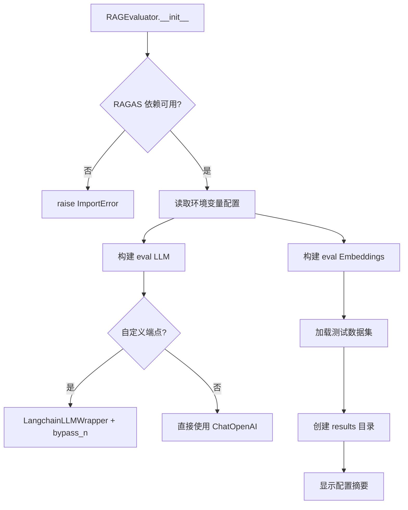
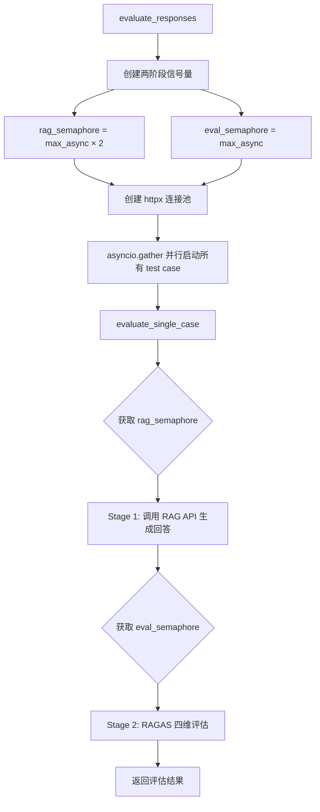
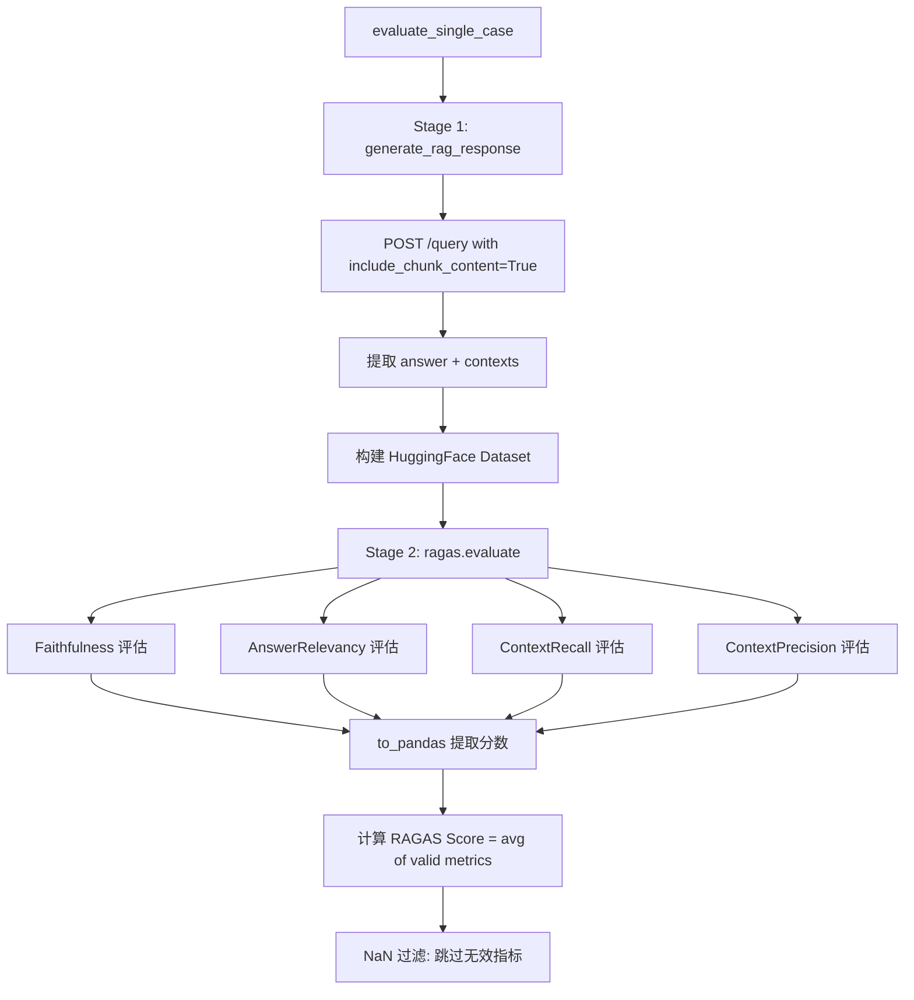

# PD-07.05 LightRAG — RAGAS 四维 RAG 质量评估

> 文档编号：PD-07.05
> 来源：LightRAG `lightrag/evaluation/eval_rag_quality.py`
> GitHub：https://github.com/HKUDS/LightRAG.git
> 问题域：PD-07 质量检查 Quality Assurance
> 状态：可复用方案

---

## 第 1 章 问题与动机

### 1.1 核心问题

RAG 系统的输出质量难以量化评估。传统做法依赖人工抽检，成本高、覆盖率低、无法持续集成。核心挑战包括：

1. **事实准确性**：LLM 生成的回答是否忠实于检索到的上下文，还是产生了幻觉？
2. **答案相关性**：回答是否真正回应了用户的问题，而非答非所问？
3. **检索召回率**：检索系统是否找到了所有相关文档，有无遗漏关键信息？
4. **检索精确度**：检索结果中是否混入了无关噪声，降低了 LLM 的推理质量？

这四个维度构成了 RAG 系统质量的完整评估框架。缺少任何一个维度，都无法全面判断系统的可靠性。

### 1.2 LightRAG 的解法概述

LightRAG 集成 RAGAS（Retrieval Augmented Generation Assessment）框架，通过 `RAGEvaluator` 类实现端到端的自动化质量评估：

1. **四维度量化评估**：Faithfulness / Answer Relevance / Context Recall / Context Precision，每个维度 0-1 分，综合为 RAGAS Score（`eval_rag_quality.py:479-490`）
2. **两阶段流水线并发**：RAG 生成阶段和 RAGAS 评估阶段使用独立信号量控制并发，避免 API 限流（`eval_rag_quality.py:571-575`）
3. **API 端点深度集成**：通过 `include_chunk_content=True` 参数让 API 返回实际检索的 chunk 原文，而非仅返回引用 ID，确保评估基于真实检索上下文（`eval_rag_quality.py:314`）
4. **多后端 LLM 兼容**：评估用 LLM 和 Embedding 模型均可独立配置端点，支持 OpenAI 官方 API 和任意 OpenAI 兼容端点（vLLM、SGLang 等）（`eval_rag_quality.py:157-173`）
5. **结果双格式导出**：CSV（供电子表格分析）+ JSON（含完整详情），带时间戳自动归档（`eval_rag_quality.py:623-681`）

### 1.3 设计思想

| 设计原则 | 具体实现 | 理由 | 替代方案 |
|----------|----------|------|----------|
| 评估与生成分离 | 评估用独立 LLM（`EVAL_LLM_MODEL`），不复用 RAG 的 LLM | 避免"自己评自己"的偏差，评估模型可选更强的模型 | 复用 RAG 的 LLM（成本低但评估偏差大） |
| 标准化指标体系 | 直接集成 RAGAS 框架的四个标准指标 | 业界公认的 RAG 评估标准，结果可跨项目对比 | 自定义评分 prompt（灵活但不可比） |
| 真实上下文评估 | 通过 API 的 `include_chunk_content` 获取实际检索 chunk | 评估基于系统真实行为，而非理想化假设 | 用 ground_truth 替代 contexts（失去检索质量评估） |
| 渐进式依赖 | RAGAS 作为可选依赖（`pip install -e ".[evaluation]"`），懒加载导入 | 不影响核心 RAG 功能，评估是增值能力 | 硬依赖（增加安装体积和冲突风险） |
| 两阶段并发控制 | RAG 信号量 2x + RAGAS 信号量 1x，流水线式执行 | RAG 生成快、RAGAS 评估慢，2x 预取保持评估管道饱满 | 全局单信号量（要么 RAG 空闲要么评估空闲） |

---

## 第 2 章 源码实现分析

### 2.1 架构概览

LightRAG 的评估系统是一个独立模块，通过 HTTP API 与 RAG 核心交互，形成"黑盒评估"架构：

```
┌─────────────────────────────────────────────────────────────────┐
│                     RAGEvaluator                                │
│                                                                 │
│  ┌──────────────┐    ┌──────────────┐    ┌──────────────────┐  │
│  │ Test Dataset  │───→│ RAG API Call │───→│ RAGAS Evaluation │  │
│  │ (JSON)        │    │ (httpx async)│    │ (4 metrics)      │  │
│  └──────────────┘    └──────┬───────┘    └────────┬─────────┘  │
│                             │                      │            │
│                    ┌────────▼────────┐    ┌────────▼─────────┐  │
│                    │ LightRAG Server │    │ Eval LLM + Embed │  │
│                    │ /query endpoint │    │ (独立配置)        │  │
│                    └─────────────────┘    └──────────────────┘  │
│                                                                 │
│  ┌──────────────────────────────────────────────────────────┐   │
│  │ Results: CSV + JSON (timestamped, auto-archived)         │   │
│  └──────────────────────────────────────────────────────────┘   │
└─────────────────────────────────────────────────────────────────┘
```

关键设计：评估模块与 RAG 核心完全解耦，通过 HTTP API 交互。评估用的 LLM 和 Embedding 模型独立于 RAG 系统配置，实现了"第三方审计"的效果。

### 2.2 核心实现

#### 2.2.1 RAGEvaluator 初始化与多后端配置



对应源码 `lightrag/evaluation/eval_rag_quality.py:115-237`：

```python
class RAGEvaluator:
    """Evaluate RAG system quality using RAGAS metrics"""

    def __init__(self, test_dataset_path: str = None, rag_api_url: str = None):
        if not RAGAS_AVAILABLE:
            raise ImportError(
                "RAGAS dependencies not installed. "
                "Install with: pip install ragas datasets"
            )

        # 评估 LLM 配置：独立于 RAG 系统的 LLM
        eval_llm_api_key = os.getenv("EVAL_LLM_BINDING_API_KEY") or os.getenv("OPENAI_API_KEY")
        eval_model = os.getenv("EVAL_LLM_MODEL", "gpt-4o-mini")
        eval_llm_base_url = os.getenv("EVAL_LLM_BINDING_HOST")

        # Embedding 配置：三级 fallback 链
        eval_embedding_api_key = (
            os.getenv("EVAL_EMBEDDING_BINDING_API_KEY")
            or os.getenv("EVAL_LLM_BINDING_API_KEY")
            or os.getenv("OPENAI_API_KEY")
        )

        # LangchainLLMWrapper + bypass_n 兼容自定义端点
        base_llm = ChatOpenAI(**llm_kwargs)
        self.eval_llm = LangchainLLMWrapper(langchain_llm=base_llm, bypass_n=True)
```

核心设计点：
- **三级 API Key fallback**（`eval_rag_quality.py:162-166`）：`EVAL_EMBEDDING_BINDING_API_KEY` → `EVAL_LLM_BINDING_API_KEY` → `OPENAI_API_KEY`，最大化配置灵活性
- **bypass_n 模式**（`eval_rag_quality.py:201-204`）：自定义端点（vLLM 等）不支持 OpenAI 的 `n` 参数，bypass_n 通过多次调用替代单次 `n>1` 请求

#### 2.2.2 两阶段流水线并发评估



对应源码 `lightrag/evaluation/eval_rag_quality.py:556-621`：

```python
async def evaluate_responses(self) -> List[Dict[str, Any]]:
    max_async = int(os.getenv("EVAL_MAX_CONCURRENT", "2"))

    # 两阶段信号量：RAG 生成 2x 预取，RAGAS 评估 1x 瓶颈控制
    rag_semaphore = asyncio.Semaphore(max_async * 2)
    eval_semaphore = asyncio.Semaphore(max_async)

    # tqdm 进度条位置池：避免并发创建时的显示冲突
    position_pool = asyncio.Queue()
    for i in range(max_async):
        await position_pool.put(i)
    pbar_creation_lock = asyncio.Lock()

    # 连接池配置：buffer = (max_async + 1) × 2
    timeout = httpx.Timeout(180.0, connect=180.0, read=300.0)
    limits = httpx.Limits(
        max_connections=(max_async + 1) * 2,
        max_keepalive_connections=max_async + 1,
    )

    async with httpx.AsyncClient(timeout=timeout, limits=limits) as client:
        tasks = [
            self.evaluate_single_case(idx, tc, rag_semaphore, eval_semaphore,
                                      client, progress_counter, position_pool,
                                      pbar_creation_lock)
            for idx, tc in enumerate(self.test_cases, 1)
        ]
        results = await asyncio.gather(*tasks)
    return list(results)
```

关键并发设计：
- **RAG 信号量 = 2x**：RAG API 调用相对快，允许预取更多结果，保持 RAGAS 评估管道饱满
- **RAGAS 信号量 = 1x**：RAGAS 内部会对每个 metric 发起多次 LLM 调用（Context Precision 每个检索文档调用一次），是真正的瓶颈
- **tqdm 位置池**（`eval_rag_quality.py:581-584`）：用 asyncio.Queue 管理进度条位置，避免并发创建时的终端显示冲突

#### 2.2.3 单用例评估与 RAGAS 指标计算



对应源码 `lightrag/evaluation/eval_rag_quality.py:391-555`：

```python
async def evaluate_single_case(self, idx, test_case, rag_semaphore,
                                eval_semaphore, client, ...):
    async with rag_semaphore:
        # Stage 1: 调用 RAG API，获取真实检索上下文
        rag_response = await self.generate_rag_response(question=question, client=client)
        retrieved_contexts = rag_response["contexts"]  # 真实 chunk 内容

        # 构建 RAGAS 评估数据集
        eval_dataset = Dataset.from_dict({
            "question": [question],
            "answer": [rag_response["answer"]],
            "contexts": [retrieved_contexts],      # 真实检索上下文
            "ground_truth": [ground_truth],         # 人工标注答案
        })

        async with eval_semaphore:
            # Stage 2: 每次创建新的 metric 实例，避免并发状态冲突
            eval_results = evaluate(
                dataset=eval_dataset,
                metrics=[Faithfulness(), AnswerRelevancy(),
                         ContextRecall(), ContextPrecision()],
                llm=self.eval_llm,
                embeddings=self.eval_embeddings,
            )

            # NaN 安全的分数计算
            valid_metrics = [v for v in metrics.values() if not _is_nan(v)]
            ragas_score = sum(valid_metrics) / len(valid_metrics) if valid_metrics else 0
```

### 2.3 实现细节

**API 集成的关键设计** — `include_chunk_content` 参数（`query_routes.py:103-105`）：

LightRAG 的 `/query` API 专门为评估场景增加了 `include_chunk_content` 参数。当设为 `True` 时，API 不仅返回引用 ID 和文件路径，还返回实际检索到的 chunk 原文。这是评估系统能够工作的前提——RAGAS 的 Faithfulness 和 Context Precision 指标需要真实的检索上下文来判断。

**NaN 处理策略**（`eval_rag_quality.py:110-112`）：

```python
def _is_nan(value: Any) -> bool:
    """Return True when value is a float NaN."""
    return isinstance(value, float) and math.isnan(value)
```

RAGAS 在某些边界情况下（如检索结果为空、LLM 返回格式异常）会产生 NaN 分数。LightRAG 在计算综合 RAGAS Score 时过滤掉 NaN 值，在统计汇总时也逐指标独立计算有效样本数（`eval_rag_quality.py:798-846`），避免单个异常值污染整体评估。

**懒加载模块设计**（`__init__.py:19-25`）：

```python
def __getattr__(name):
    """Lazy import to avoid dependency errors when ragas is not installed."""
    if name == "RAGEvaluator":
        from .eval_rag_quality import RAGEvaluator
        return RAGEvaluator
    raise AttributeError(f"module {__name__!r} has no attribute {name!r}")
```

通过 `__getattr__` 实现模块级懒加载，只有在实际使用 `RAGEvaluator` 时才触发 RAGAS 依赖导入。这样 `from lightrag.evaluation import RAGEvaluator` 在 RAGAS 未安装时不会立即报错，而是延迟到实例化时才抛出明确的 `ImportError`。


---

## 第 3 章 迁移指南

### 3.1 迁移清单

#### 阶段一：基础评估能力（1-2 天）

- [ ] 安装依赖：`pip install ragas>=0.3.7 datasets>=4.3.0 langchain-openai`
- [ ] 创建评估模块目录结构：`your_project/evaluation/`
- [ ] 编写测试数据集 JSON（question + ground_truth 格式）
- [ ] 实现 `RAGEvaluator` 核心类（四维指标评估）
- [ ] 配置评估用 LLM 环境变量

#### 阶段二：API 集成（1 天）

- [ ] 在 RAG API 中添加 `include_chunk_content` 参数支持
- [ ] 确保 API 返回实际检索的 chunk 原文（而非仅引用 ID）
- [ ] 实现评估脚本的 CLI 参数解析（`--dataset`, `--ragendpoint`）

#### 阶段三：并发与生产化（1 天）

- [ ] 实现两阶段信号量并发控制
- [ ] 添加 NaN 安全处理（指标计算 + 统计汇总）
- [ ] 实现 CSV/JSON 双格式结果导出
- [ ] 集成到 CI/CD（可选：设置 RAGAS Score 阈值门控）

### 3.2 适配代码模板

以下模板可直接复用到任何 RAG 系统，只需替换 API 调用部分：

```python
"""
通用 RAG 质量评估器 — 基于 LightRAG 的 RAGAS 集成方案
替换 generate_rag_response 中的 API 调用即可适配你的 RAG 系统
"""
import asyncio
import json
import math
import os
from datetime import datetime
from pathlib import Path
from typing import Any, Dict, List

import httpx
from datasets import Dataset
from ragas import evaluate
from ragas.metrics import (
    AnswerRelevancy, ContextPrecision, ContextRecall, Faithfulness,
)
from ragas.llms import LangchainLLMWrapper
from langchain_openai import ChatOpenAI, OpenAIEmbeddings


class RAGQualityEvaluator:
    """通用 RAG 质量评估器，可适配任意 RAG 系统"""

    def __init__(self, test_dataset_path: str, rag_api_url: str):
        # 评估用 LLM（独立于 RAG 系统）
        eval_api_key = os.getenv("EVAL_LLM_API_KEY", os.getenv("OPENAI_API_KEY"))
        eval_model = os.getenv("EVAL_LLM_MODEL", "gpt-4o-mini")
        base_url = os.getenv("EVAL_LLM_BASE_URL")

        llm_kwargs = {"model": eval_model, "api_key": eval_api_key}
        if base_url:
            llm_kwargs["base_url"] = base_url

        base_llm = ChatOpenAI(**llm_kwargs)
        self.eval_llm = LangchainLLMWrapper(langchain_llm=base_llm, bypass_n=True)
        self.eval_embeddings = OpenAIEmbeddings(
            model=os.getenv("EVAL_EMBEDDING_MODEL", "text-embedding-3-large"),
            api_key=eval_api_key,
        )

        self.rag_api_url = rag_api_url.rstrip("/")
        self.test_cases = json.loads(Path(test_dataset_path).read_text()).get("test_cases", [])
        self.results_dir = Path("evaluation_results")
        self.results_dir.mkdir(exist_ok=True)

    async def generate_rag_response(self, question: str, client: httpx.AsyncClient) -> Dict:
        """替换此方法以适配你的 RAG 系统 API"""
        response = await client.post(
            f"{self.rag_api_url}/query",
            json={"query": question, "mode": "mix",
                  "include_references": True, "include_chunk_content": True},
        )
        response.raise_for_status()
        result = response.json()
        contexts = []
        for ref in result.get("references", []):
            content = ref.get("content", [])
            if isinstance(content, list):
                contexts.extend(content)
            elif isinstance(content, str):
                contexts.append(content)
        return {"answer": result.get("response", ""), "contexts": contexts}

    async def evaluate_single(self, question: str, ground_truth: str,
                               client: httpx.AsyncClient) -> Dict[str, Any]:
        """评估单个测试用例"""
        rag_resp = await self.generate_rag_response(question, client)
        eval_dataset = Dataset.from_dict({
            "question": [question],
            "answer": [rag_resp["answer"]],
            "contexts": [rag_resp["contexts"]],
            "ground_truth": [ground_truth],
        })
        results = evaluate(
            dataset=eval_dataset,
            metrics=[Faithfulness(), AnswerRelevancy(), ContextRecall(), ContextPrecision()],
            llm=self.eval_llm,
            embeddings=self.eval_embeddings,
        )
        df = results.to_pandas()
        row = df.iloc[0]
        metrics = {
            "faithfulness": float(row.get("faithfulness", 0)),
            "answer_relevance": float(row.get("answer_relevancy", 0)),
            "context_recall": float(row.get("context_recall", 0)),
            "context_precision": float(row.get("context_precision", 0)),
        }
        valid = [v for v in metrics.values() if not (isinstance(v, float) and math.isnan(v))]
        return {"question": question, "metrics": metrics,
                "ragas_score": round(sum(valid) / len(valid), 4) if valid else 0}

    async def run(self) -> List[Dict]:
        """运行全部评估"""
        max_concurrent = int(os.getenv("EVAL_MAX_CONCURRENT", "2"))
        sem = asyncio.Semaphore(max_concurrent)
        async with httpx.AsyncClient(timeout=httpx.Timeout(180.0, read=300.0)) as client:
            async def bounded_eval(tc):
                async with sem:
                    return await self.evaluate_single(tc["question"], tc["ground_truth"], client)
            results = await asyncio.gather(*[bounded_eval(tc) for tc in self.test_cases])
        # 保存结果
        ts = datetime.now().strftime("%Y%m%d_%H%M%S")
        (self.results_dir / f"results_{ts}.json").write_text(json.dumps(list(results), indent=2))
        return list(results)
```

### 3.3 适用场景

| 场景 | 适用度 | 说明 |
|------|--------|------|
| RAG 系统持续质量监控 | ⭐⭐⭐ | 核心场景，四维指标全面覆盖 |
| CI/CD 质量门控 | ⭐⭐⭐ | 设置 RAGAS Score 阈值，低于阈值阻断部署 |
| 检索策略 A/B 测试 | ⭐⭐⭐ | 对比不同检索参数（top_k、mode）的指标差异 |
| Embedding 模型选型 | ⭐⭐ | 通过 Context Recall/Precision 对比不同 Embedding 效果 |
| Prompt 模板优化 | ⭐⭐ | 通过 Faithfulness/Answer Relevance 评估 prompt 改进效果 |
| 实时生产监控 | ⭐ | RAGAS 评估需要 LLM 调用，延迟和成本较高，不适合实时 |

---

## 第 4 章 测试用例

```python
"""
基于 LightRAG RAGEvaluator 真实接口的测试用例
测试评估器的核心功能：初始化、数据加载、指标计算、NaN 处理、结果导出
"""
import json
import math
import tempfile
from pathlib import Path
from unittest.mock import AsyncMock, MagicMock, patch

import pytest


# === 辅助函数测试 ===

class TestIsNan:
    """测试 _is_nan 辅助函数（eval_rag_quality.py:110-112）"""

    def test_nan_value(self):
        from lightrag.evaluation.eval_rag_quality import _is_nan
        assert _is_nan(float("nan")) is True

    def test_normal_float(self):
        from lightrag.evaluation.eval_rag_quality import _is_nan
        assert _is_nan(0.85) is False

    def test_zero(self):
        from lightrag.evaluation.eval_rag_quality import _is_nan
        assert _is_nan(0.0) is False

    def test_non_float(self):
        from lightrag.evaluation.eval_rag_quality import _is_nan
        assert _is_nan("nan") is False
        assert _is_nan(None) is False


# === 数据加载测试 ===

class TestDatasetLoading:
    """测试测试数据集加载（eval_rag_quality.py:280-288）"""

    def test_load_valid_dataset(self, tmp_path):
        dataset = {
            "test_cases": [
                {"question": "What is RAG?", "ground_truth": "RAG is...", "project": "test"}
            ]
        }
        dataset_path = tmp_path / "test_dataset.json"
        dataset_path.write_text(json.dumps(dataset))

        # Mock RAGAS dependencies
        with patch("lightrag.evaluation.eval_rag_quality.RAGAS_AVAILABLE", True), \
             patch("lightrag.evaluation.eval_rag_quality.ChatOpenAI"), \
             patch("lightrag.evaluation.eval_rag_quality.OpenAIEmbeddings"), \
             patch("lightrag.evaluation.eval_rag_quality.LangchainLLMWrapper"), \
             patch.dict("os.environ", {"OPENAI_API_KEY": "test-key"}):
            from lightrag.evaluation.eval_rag_quality import RAGEvaluator
            evaluator = RAGEvaluator(test_dataset_path=str(dataset_path))
            assert len(evaluator.test_cases) == 1
            assert evaluator.test_cases[0]["question"] == "What is RAG?"

    def test_missing_dataset_raises(self):
        with patch("lightrag.evaluation.eval_rag_quality.RAGAS_AVAILABLE", True), \
             patch("lightrag.evaluation.eval_rag_quality.ChatOpenAI"), \
             patch("lightrag.evaluation.eval_rag_quality.OpenAIEmbeddings"), \
             patch("lightrag.evaluation.eval_rag_quality.LangchainLLMWrapper"), \
             patch.dict("os.environ", {"OPENAI_API_KEY": "test-key"}):
            from lightrag.evaluation.eval_rag_quality import RAGEvaluator
            with pytest.raises(FileNotFoundError):
                RAGEvaluator(test_dataset_path="/nonexistent/path.json")


# === 指标计算测试 ===

class TestBenchmarkStats:
    """测试基准统计计算（eval_rag_quality.py:772-867）"""

    def _make_evaluator_mock(self):
        """创建 mock evaluator 用于测试统计方法"""
        with patch("lightrag.evaluation.eval_rag_quality.RAGAS_AVAILABLE", True), \
             patch("lightrag.evaluation.eval_rag_quality.ChatOpenAI"), \
             patch("lightrag.evaluation.eval_rag_quality.OpenAIEmbeddings"), \
             patch("lightrag.evaluation.eval_rag_quality.LangchainLLMWrapper"), \
             patch.dict("os.environ", {"OPENAI_API_KEY": "test-key"}):
            from lightrag.evaluation.eval_rag_quality import RAGEvaluator
            evaluator = RAGEvaluator.__new__(RAGEvaluator)
            return evaluator

    def test_all_valid_results(self):
        evaluator = self._make_evaluator_mock()
        results = [
            {"metrics": {"faithfulness": 0.9, "answer_relevance": 0.8,
                         "context_recall": 1.0, "context_precision": 0.95},
             "ragas_score": 0.9125},
        ]
        stats = evaluator._calculate_benchmark_stats(results)
        assert stats["successful_tests"] == 1
        assert stats["failed_tests"] == 0
        assert stats["average_metrics"]["faithfulness"] == 0.9

    def test_nan_metrics_excluded(self):
        evaluator = self._make_evaluator_mock()
        results = [
            {"metrics": {"faithfulness": 0.9, "answer_relevance": float("nan"),
                         "context_recall": 1.0, "context_precision": float("nan")},
             "ragas_score": 0.95},
        ]
        stats = evaluator._calculate_benchmark_stats(results)
        assert stats["average_metrics"]["faithfulness"] == 0.9
        assert stats["average_metrics"]["answer_relevance"] == 0.0  # NaN → count=0 → 0.0

    def test_all_errors(self):
        evaluator = self._make_evaluator_mock()
        results = [{"metrics": {}, "ragas_score": 0, "error": "API down"}]
        stats = evaluator._calculate_benchmark_stats(results)
        assert stats["successful_tests"] == 0
        assert stats["failed_tests"] == 1


# === 懒加载测试 ===

class TestLazyImport:
    """测试模块懒加载（__init__.py:19-25）"""

    def test_getattr_unknown_raises(self):
        from lightrag import evaluation
        with pytest.raises(AttributeError, match="has no attribute"):
            _ = evaluation.NonExistentClass
```

