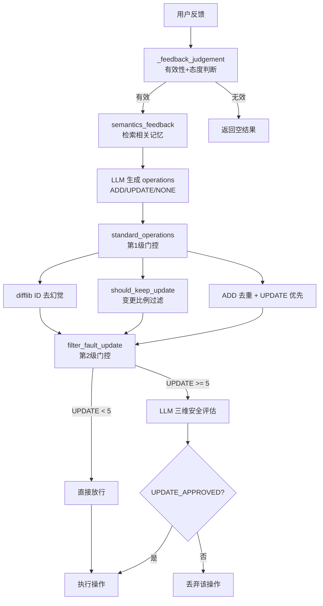
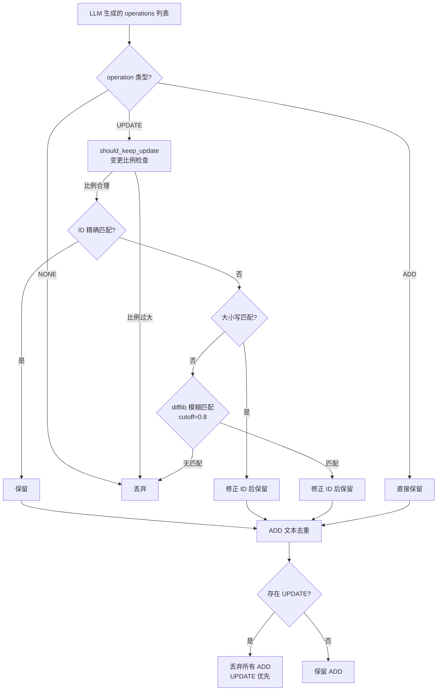
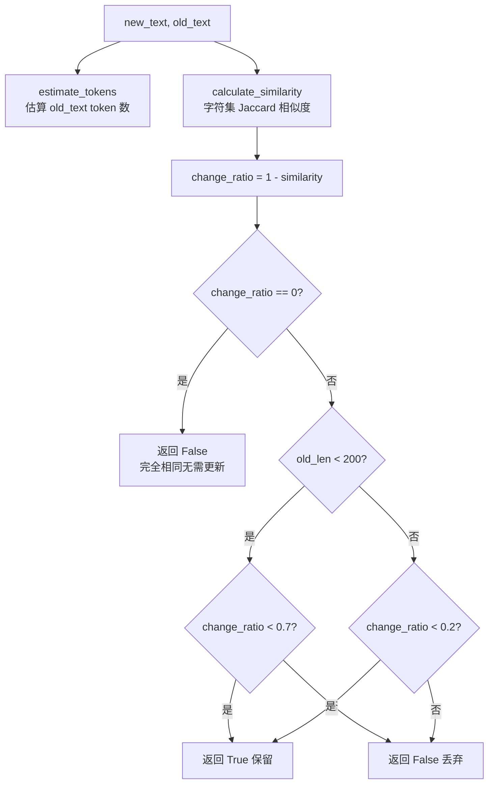
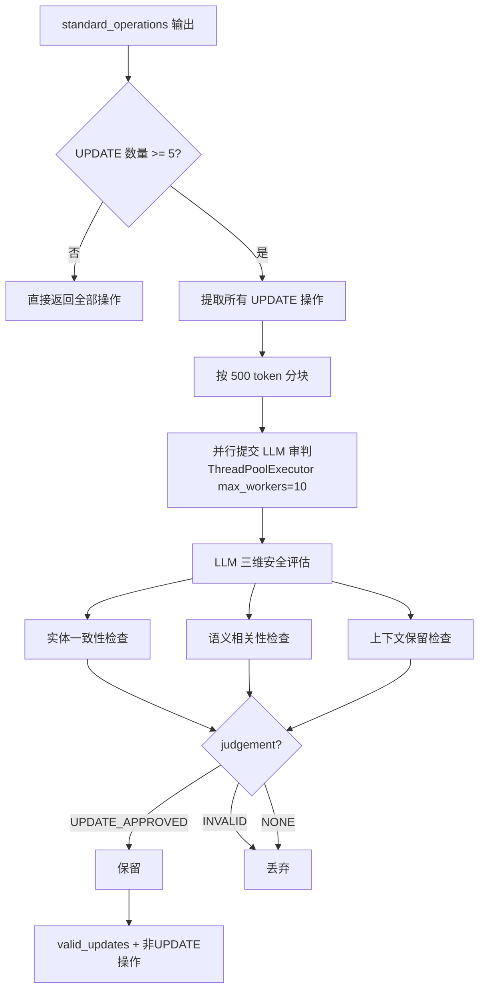

# PD-07.NN MemOS — MemFeedback 三级记忆质量门控

> 文档编号：PD-07.NN
> 来源：MemOS `src/memos/mem_feedback/feedback.py`
> GitHub：https://github.com/MemTensor/MemOS.git
> 问题域：PD-07 质量检查 Quality Assurance
> 状态：可复用方案

---

## 第 1 章 问题与动机

### 1.1 核心问题

记忆系统在接收用户反馈并更新已有记忆时，面临三个关键质量风险：

1. **LLM 幻觉 ID**：LLM 生成的 UPDATE 操作中，记忆 ID 可能是幻觉产物——大小写错误、字符偏移、甚至完全捏造的 ID。如果直接执行，会导致更新到错误的记忆条目或操作失败。
2. **无效覆盖**：当 UPDATE 操作的新文本与旧文本差异过大（实质上是全新内容而非修正），执行更新会破坏原有记忆的语义完整性。
3. **批量更新中的实体错配**：当一次反馈触发多条 UPDATE 操作时，LLM 可能将关于实体 A 的新事实错误地覆盖到实体 B 的记忆上（如把"Mission Terra 来自德国"覆盖到"Gladys Liu 是意大利公民"的记忆上）。

这三个问题在记忆系统中尤为严重，因为记忆一旦被错误覆盖，用户的历史信息就永久丢失了。

### 1.2 MemOS 的解法概述

MemOS 的 MemFeedback 模块实现了 **judgement → compare → filter** 三级质量门控管道：

1. **standard_operations（去幻觉 + 变更比例过滤）**：用 `difflib.get_close_matches` 做 ID 模糊匹配修正幻觉 ID，用 `should_keep_update` 基于 Jaccard 相似度检测修改比例过大的无效更新（`feedback.py:793-880`）
2. **filter_fault_update（LLM 二次审判）**：当 UPDATE 操作 ≥5 条时，用 LLM 做实体一致性 + 语义相关性 + 上下文保留三维安全评估，只放行 `UPDATE_APPROVED` 的操作（`feedback.py:747-791`）
3. **should_keep_update（变更比例硬阈值）**：短文本（<200 token）允许 70% 变更率，长文本（≥200 token）只允许 20% 变更率，超出则直接丢弃（`utils.py:30-60`）

### 1.3 设计思想

| 设计原则 | 具体实现 | 理由 | 替代方案 |
|----------|----------|------|----------|
| 规则先行，LLM 兜底 | difflib + Jaccard 在前，LLM 审判在后 | 规则检查零成本且确定性高，LLM 审判有 API 开销 | 全部用 LLM 判断（成本高） |
| 阈值分段 | 短文本 70%、长文本 20% 的差异化阈值 | 短记忆修正幅度天然大，长记忆应以局部修正为主 | 统一阈值（误杀或漏检） |
| 批量触发条件 | UPDATE ≥5 条才启动 LLM 二次审判 | 少量更新风险可控，批量更新才需要额外验证 | 每条都审判（成本浪费） |
| 实体一致性优先 | 三维检查中实体一致性是最重要的 | 实体错配是最严重的错误类型 | 仅检查文本相似度 |
| 并行分块处理 | 记忆按 500 token 分块，ThreadPoolExecutor 并行 LLM 调用 | 大量记忆无法一次放入 prompt | 串行处理（慢） |

---

## 第 2 章 源码实现分析

### 2.1 架构概览

MemFeedback 的质量门控嵌入在 `semantics_feedback` 方法的操作处理管道中：

```
用户反馈 → _feedback_judgement（有效性判断）
         → semantics_feedback（语义级记忆修改）
           → LLM 生成 operations（ADD/UPDATE/NONE）
           → standard_operations（第 1 级：去幻觉 + 去重 + 变更过滤）
           → filter_fault_update（第 2 级：LLM 实体安全审判）
           → 执行 ADD/UPDATE 操作
```



### 2.2 核心实现

#### 2.2.1 第一级门控：standard_operations — ID 去幻觉与变更过滤



对应源码 `src/memos/mem_feedback/feedback.py:793-880`：

```python
def standard_operations(self, operations, current_memories):
    """
    Regularize the operation design
        1. Map the id to the correct original memory id
        2. If there is an update, skip the memory object of add
        3. If the modified text is too long, skip the update
    """
    right_ids = [item.id for item in current_memories]
    right_lower_map = {x.lower(): x for x in right_ids}

    def correct_item(data):
        try:
            assert "operation" in data
            if data.get("operation", "").lower() == "add":
                return data
            if data.get("operation", "").lower() == "none":
                return None
            assert (
                "id" in data
                and "text" in data
                and "old_memory" in data
                and data["operation"].lower() == "update"
            ), "Invalid operation item"

            if not should_keep_update(data["text"], data["old_memory"]):
                logger.warning(
                    f"[0107 Feedback Core: correct_item] Due to the excessive "
                    f"proportion of changes, skip update: {data}"
                )
                return None

            # id dehallucination
            original_id = data["id"]
            if original_id in right_ids:
                return data
            lower_id = original_id.lower()
            if lower_id in right_lower_map:
                data["id"] = right_lower_map[lower_id]
                return data
            matches = difflib.get_close_matches(
                original_id, right_ids, n=1, cutoff=0.8
            )
            if matches:
                data["id"] = matches[0]
                return data
        except Exception:
            logger.error(...)
        return None

    dehallu_res = [correct_item(item) for item in operations]
    dehalluded_operations = [item for item in dehallu_res if item]
    # ... ADD 去重 + UPDATE 优先逻辑
```

#### 2.2.2 变更比例硬阈值：should_keep_update



对应源码 `src/memos/mem_feedback/utils.py:30-60`：

```python
def should_keep_update(new_text: str, old_text: str) -> bool:
    old_len = estimate_tokens(old_text)

    def calculate_similarity(text1: str, text2: str) -> float:
        set1 = set(text1)
        set2 = set(text2)
        if not set1 and not set2:
            return 1.0
        intersection = len(set1.intersection(set2))
        union = len(set1.union(set2))
        return intersection / union if union > 0 else 0.0

    similarity = calculate_similarity(old_text, new_text)
    change_ratio = 1 - similarity

    if change_ratio == float(0):
        return False
    if old_len < 200:
        return change_ratio < 0.7
    else:
        return change_ratio < 0.2
```


#### 2.2.3 第二级门控：filter_fault_update — LLM 实体安全审判



对应源码 `src/memos/mem_feedback/feedback.py:747-791`：

```python
def filter_fault_update(self, operations: list[dict]):
    """To address the randomness of large model outputs, it is necessary
    to conduct validity evaluation on the texts used for memory override
    operations."""
    updated_operations = [
        item for item in operations if item["operation"] == "UPDATE"
    ]
    if len(updated_operations) < 5:
        return operations

    lang = detect_lang("".join(updated_operations[0]["text"]))
    template = FEEDBACK_PROMPT_DICT["compare_judge"][lang]

    all_judge = []
    operations_chunks = general_split_into_chunks(updated_operations)
    with ContextThreadPoolExecutor(max_workers=10) as executor:
        future_to_chunk_idx = {}
        for chunk in operations_chunks:
            raw_operations_str = {"operations": chunk}
            prompt = template.format(
                raw_operations=str(raw_operations_str)
            )
            future = executor.submit(
                self._get_llm_response, prompt, load_type="bracket"
            )
            future_to_chunk_idx[future] = chunk
        for future in concurrent.futures.as_completed(future_to_chunk_idx):
            try:
                judge_res = future.result()
                if (judge_res and "operations_judgement" in judge_res
                    and isinstance(
                        judge_res["operations_judgement"], list
                    )):
                    all_judge.extend(judge_res["operations_judgement"])
            except Exception as e:
                logger.error(f"... Judgement failed: {e}")

    id2op = {item["id"]: item for item in updated_operations}
    valid_updates = []
    for judge in all_judge:
        if judge["judgement"] == "UPDATE_APPROVED":
            valid_update = id2op.get(judge["id"], None)
            if valid_update:
                valid_updates.append(valid_update)

    return valid_updates + [
        item for item in operations if item["operation"] != "UPDATE"
    ]
```

### 2.3 实现细节

**LLM 审判 Prompt 的三维检查**（`src/memos/templates/mem_feedback_prompts.py:666-742`）：

OPERATION_UPDATE_JUDGEMENT prompt 要求 LLM 对每条 UPDATE 执行三项检查：
1. **实体一致性检查**：新旧文本是否描述同一核心实体（同一人物、组织、事件）
2. **语义相关性检查**：新信息是否直接修正旧信息的错误或补充缺失，而非引入不相关事实
3. **上下文保留检查**：更新后的文本是否只修改需要纠正的部分，保留其他有效信息

判定结果三选一：
- `UPDATE_APPROVED`：三项全通过，允许执行
- `INVALID`：核心实体不同，完全无效
- `NONE`：实体相同但信息不相关，不应更新

**双语支持**：所有 prompt 都有 EN/ZH 双版本，通过 `detect_lang` 自动选择（`feedback.py:56-62`）。

**并发架构**：`ContextThreadPoolExecutor` 是 MemOS 自定义的线程池，支持上下文传播。整个 feedback 流程中有三层并发：
- 外层：多条 feedback_memory 并行处理（max_workers=3，`feedback.py:576`）
- 中层：记忆分块并行 LLM 比较（max_workers=10，`feedback.py:458`）
- 内层：ADD/UPDATE 操作并行执行（max_workers=10，`feedback.py:504`）

**容错设计**：
- `_get_llm_response` 内置双重 JSON 解析策略：先尝试标准 `json.loads`，失败后用正则提取 `{}` 或 `[]` 内容（`feedback.py:711-745`）
- `_embed_once` 用 tenacity 重试 4 次 + 随机指数退避（`feedback.py:115-117`）
- `_retry_db_operation` 用 tenacity 重试 3 次（`feedback.py:119-127`）
- 嵌入失败时降级为全零向量（`feedback.py:140-141`）

---

## 第 3 章 迁移指南

### 3.1 迁移清单

**阶段 1：核心门控函数（1 个文件）**
- [ ] 移植 `should_keep_update` 函数（变更比例硬阈值）
- [ ] 移植 `estimate_tokens` 函数（中英文混合 token 估算）
- [ ] 根据业务场景调整阈值（短文本 70%、长文本 20%）

**阶段 2：ID 去幻觉（嵌入到操作处理管道）**
- [ ] 实现三级 ID 匹配：精确 → 大小写不敏感 → difflib 模糊匹配
- [ ] 设置 `cutoff=0.8` 的模糊匹配阈值（过低会误匹配）

**阶段 3：LLM 二次审判（可选，批量场景）**
- [ ] 编写实体一致性检查 prompt（参考 OPERATION_UPDATE_JUDGEMENT）
- [ ] 实现分块并行审判逻辑
- [ ] 设置触发阈值（MemOS 用 ≥5 条 UPDATE）

### 3.2 适配代码模板

以下是可直接复用的三级门控实现：

```python
import difflib
from typing import Any


def estimate_tokens(text: str) -> int:
    """中英文混合 token 估算"""
    if not text:
        return 0
    chinese_chars = sum(1 for c in text if "\u4e00" <= c <= "\u9fff")
    english_words = len([
        w for w in text.split()
        if not any("\u4e00" <= c <= "\u9fff" for c in w) and any(c.isalpha() for c in w)
    ])
    other_chars = len(text) - chinese_chars
    return max(1, int(chinese_chars * 1.5 + english_words * 1.33 + other_chars * 0.5))


def should_keep_update(new_text: str, old_text: str,
                       short_threshold: float = 0.7,
                       long_threshold: float = 0.2,
                       length_boundary: int = 200) -> bool:
    """变更比例硬阈值过滤"""
    old_len = estimate_tokens(old_text)
    set1, set2 = set(old_text), set(new_text)
    union = len(set1 | set2)
    similarity = len(set1 & set2) / union if union > 0 else 1.0
    change_ratio = 1 - similarity

    if change_ratio == 0:
        return False  # 完全相同，无需更新
    if old_len < length_boundary:
        return change_ratio < short_threshold
    return change_ratio < long_threshold


def dehallucinate_id(original_id: str, valid_ids: list[str],
                     cutoff: float = 0.8) -> str | None:
    """三级 ID 去幻觉"""
    # Level 1: 精确匹配
    if original_id in valid_ids:
        return original_id
    # Level 2: 大小写不敏感
    lower_map = {x.lower(): x for x in valid_ids}
    if original_id.lower() in lower_map:
        return lower_map[original_id.lower()]
    # Level 3: difflib 模糊匹配
    matches = difflib.get_close_matches(original_id, valid_ids, n=1, cutoff=cutoff)
    return matches[0] if matches else None


def standardize_operations(
    operations: list[dict[str, Any]],
    valid_ids: list[str],
) -> list[dict[str, Any]]:
    """第一级门控：去幻觉 + 变更过滤 + 去重 + UPDATE 优先"""
    result = []
    add_texts = set()

    for op in operations:
        op_type = op.get("operation", "").upper()
        if op_type == "NONE":
            continue
        if op_type == "ADD":
            text = op.get("text", "")
            if text and text not in add_texts:
                add_texts.add(text)
                result.append(op)
        elif op_type == "UPDATE":
            if not should_keep_update(op.get("text", ""), op.get("old_memory", "")):
                continue
            corrected_id = dehallucinate_id(op["id"], valid_ids)
            if corrected_id:
                op["id"] = corrected_id
                result.append(op)

    has_update = any(o["operation"].upper() == "UPDATE" for o in result)
    if has_update:
        return [o for o in result if o["operation"].upper() == "UPDATE"]
    return result
```

### 3.3 适用场景

| 场景 | 适用度 | 说明 |
|------|--------|------|
| 记忆系统反馈更新 | ⭐⭐⭐ | 核心场景，直接复用 |
| RAG 知识库增量更新 | ⭐⭐⭐ | ID 去幻觉 + 变更过滤同样适用 |
| 对话历史修正 | ⭐⭐ | 变更比例过滤有用，LLM 审判可选 |
| 批量数据清洗 | ⭐⭐ | LLM 二次审判适合批量场景 |
| 实时聊天记忆 | ⭐ | 延迟敏感，LLM 审判开销大 |

---

## 第 4 章 测试用例

```python
import pytest
from unittest.mock import MagicMock, patch


class TestShouldKeepUpdate:
    """测试变更比例硬阈值过滤"""

    def test_identical_text_returns_false(self):
        """完全相同的文本不需要更新"""
        assert should_keep_update("hello world", "hello world") is False

    def test_short_text_small_change_keeps(self):
        """短文本小幅修改应保留"""
        assert should_keep_update(
            "用户在公司B工作", "用户在公司A工作"
        ) is True

    def test_short_text_large_change_discards(self):
        """短文本大幅修改应丢弃"""
        assert should_keep_update(
            "完全不同的一段新文本内容xyz", "用户喜欢钓鱼abc"
        ) is False

    def test_long_text_small_change_keeps(self):
        """长文本小幅修改应保留"""
        base = "这是一段很长的记忆文本，" * 30
        modified = base.replace("记忆", "记录", 1)
        assert should_keep_update(modified, base) is True

    def test_long_text_large_change_discards(self):
        """长文本大幅修改应丢弃"""
        old = "用户在公司A担任工程师，负责前端开发。" * 20
        new = "完全不同的内容，关于另一个话题。" * 20
        assert should_keep_update(new, old) is False


class TestDehallucinateId:
    """测试三级 ID 去幻觉"""

    def test_exact_match(self):
        assert dehallucinate_id("abc-123", ["abc-123", "def-456"]) == "abc-123"

    def test_case_insensitive_match(self):
        assert dehallucinate_id("ABC-123", ["abc-123", "def-456"]) == "abc-123"

    def test_fuzzy_match(self):
        result = dehallucinate_id("abc-12", ["abc-123", "def-456"])
        assert result == "abc-123"

    def test_no_match_returns_none(self):
        assert dehallucinate_id("zzz-999", ["abc-123", "def-456"]) is None

    def test_hallucinated_id_corrected(self):
        """模拟 LLM 生成的幻觉 ID 被修正"""
        valid = ["a1b2c3d4-e5f6-7890-abcd-ef1234567890"]
        hallucinated = "a1b2c3d4-e5f6-7890-abcd-ef123456789"  # 少一位
        result = dehallucinate_id(hallucinated, valid)
        assert result == valid[0]


class TestStandardizeOperations:
    """测试第一级门控完整流程"""

    def test_none_operations_filtered(self):
        ops = [{"operation": "NONE", "id": "1", "text": "x"}]
        assert standardize_operations(ops, ["1"]) == []

    def test_duplicate_add_deduplicated(self):
        ops = [
            {"operation": "ADD", "text": "same text"},
            {"operation": "ADD", "text": "same text"},
        ]
        result = standardize_operations(ops, [])
        assert len(result) == 1

    def test_update_priority_over_add(self):
        ops = [
            {"operation": "ADD", "text": "new info"},
            {"operation": "UPDATE", "id": "1", "text": "updated",
             "old_memory": "original"},
        ]
        result = standardize_operations(ops, ["1"])
        assert all(o["operation"].upper() == "UPDATE" for o in result)
```


---

## 第 5 章 跨域关联

| 关联域 | 关系类型 | 说明 |
|--------|----------|------|
| PD-01 上下文管理 | 协同 | 记忆分块按 500 token 切分（`split_into_chunks`），与上下文窗口管理直接相关；`estimate_tokens` 中英文混合估算是上下文管理的基础工具 |
| PD-03 容错与重试 | 依赖 | `_embed_once` 用 tenacity 重试 4 次 + 随机指数退避，`_retry_db_operation` 重试 3 次；嵌入失败降级为全零向量（`feedback.py:140-141`） |
| PD-06 记忆持久化 | 依赖 | 质量门控的输出直接驱动 `MemoryManager.add` 和 `graph_store.update_node` 的持久化操作；UPDATE 操作会将旧记忆标记为 `archived` |
| PD-08 搜索与检索 | 协同 | `semantics_feedback` 中通过 `_retrieve` 检索相关记忆作为比较基准，检索质量直接影响门控准确性；向量检索阈值 0.2（`feedback.py:678`）和 reranker 阈值 0.95（`feedback.py:918`）是关键参数 |
| PD-09 Human-in-the-Loop | 协同 | `_feedback_judgement` 分析用户态度（dissatisfied/satisfied/irrelevant），用户反馈本身就是人机协作的输入信号 |

---

## 第 6 章 来源文件索引

| 文件 | 行范围 | 关键实现 |
|------|--------|----------|
| `src/memos/mem_feedback/feedback.py` | L67-100 | MemFeedback 类初始化，LLM/Embedder/GraphStore 工厂创建 |
| `src/memos/mem_feedback/feedback.py` | L196-219 | `_feedback_judgement` 有效性判断入口 |
| `src/memos/mem_feedback/feedback.py` | L418-546 | `semantics_feedback` 语义级记忆修改主流程 |
| `src/memos/mem_feedback/feedback.py` | L747-791 | `filter_fault_update` LLM 二次审判（第 2 级门控） |
| `src/memos/mem_feedback/feedback.py` | L793-880 | `standard_operations` ID 去幻觉 + 变更过滤（第 1 级门控） |
| `src/memos/mem_feedback/feedback.py` | L1029-1152 | `process_feedback_core` 完整反馈处理入口 |
| `src/memos/mem_feedback/utils.py` | L7-27 | `estimate_tokens` 中英文混合 token 估算 |
| `src/memos/mem_feedback/utils.py` | L30-60 | `should_keep_update` 变更比例硬阈值 |
| `src/memos/mem_feedback/utils.py` | L63-92 | `general_split_into_chunks` 按 token 分块 |
| `src/memos/mem_feedback/utils.py` | L155-231 | `extract_bracket_content` / `extract_square_brackets_content` 双策略 JSON 解析 |
| `src/memos/mem_feedback/base.py` | L1-15 | `BaseMemFeedback` 抽象基类定义 |
| `src/memos/templates/mem_feedback_prompts.py` | L117-216 | `FEEDBACK_JUDGEMENT_PROMPT` 有效性判断 prompt |
| `src/memos/templates/mem_feedback_prompts.py` | L319-458 | `UPDATE_FORMER_MEMORIES` 记忆比较操作 prompt |
| `src/memos/templates/mem_feedback_prompts.py` | L666-742 | `OPERATION_UPDATE_JUDGEMENT` 三维安全评估 prompt |
| `src/memos/configs/memory.py` | L248-288 | `MemFeedbackConfig` Pydantic 配置模型 |

---

## 第 7 章 横向对比维度

> **重要：** 本章用于自动填充 Butcher Wiki 的横向对比表。
> 必须严格按以下 JSON 格式输出，放在 `comparison_data` 代码块中。

```json comparison_data
{
  "project": "MemOS",
  "dimensions": {
    "检查方式": "三级管道：规则去幻觉 → 变更比例硬阈值 → LLM 实体安全审判",
    "评估维度": "实体一致性 + 语义相关性 + 上下文保留三维检查",
    "评估粒度": "逐条 UPDATE 操作独立评估",
    "迭代机制": "无迭代，单次三级管道过滤",
    "反馈机制": "UPDATE_APPROVED / INVALID / NONE 三态判定",
    "自动修复": "difflib 自动修正幻觉 ID（cutoff=0.8）",
    "覆盖范围": "仅覆盖记忆 UPDATE 操作，ADD 不做二次审判",
    "并发策略": "三层 ThreadPoolExecutor 并行（3/10/10）",
    "降级路径": "嵌入失败降级全零向量，JSON 解析失败用正则兜底",
    "配置驱动": "MemFeedbackConfig Pydantic 模型驱动 LLM/Embedder/GraphDB",
    "记忆驱动改进": "用户反馈直接驱动记忆 ADD/UPDATE/ARCHIVE 闭环",
    "决策归一化": "UPDATE 优先于 ADD，同一反馈中两者互斥",
    "记忆语义去重": "ADD 操作文本去重 + 向量检索阈值 0.2 预过滤"
  }
}
```

### 域元数据补充

```json domain_metadata
{
  "solution_summary": "MemOS 用 difflib ID 去幻觉 + Jaccard 变更比例硬阈值 + LLM 三维实体安全审判实现记忆更新三级质量门控",
  "description": "记忆更新操作的多级质量验证，防止 LLM 幻觉 ID 和实体错配导致记忆污染",
  "sub_problems": [
    "ID 去幻觉：LLM 生成的记忆 ID 大小写错误或字符偏移的自动修正",
    "变更比例分段阈值：短文本与长文本需要不同的修改容忍度",
    "批量 UPDATE 触发条件：少量更新直接放行 vs 批量更新需要额外验证的阈值设计",
    "UPDATE 与 ADD 互斥：同一反馈中存在 UPDATE 时应丢弃 ADD 防止重复"
  ],
  "best_practices": [
    "规则检查前置 LLM 审判后置：difflib + Jaccard 零成本过滤后再调用 LLM，节省 API 开销",
    "三级 ID 匹配递进：精确→大小写→模糊，cutoff=0.8 平衡召回与精度",
    "批量阈值触发：UPDATE < 5 条直接放行，≥5 条才启动 LLM 审判，避免小批量过度验证"
  ]
}
```
