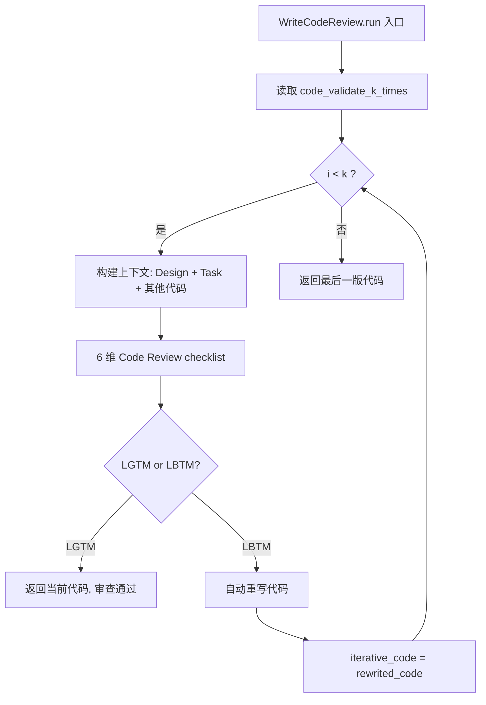
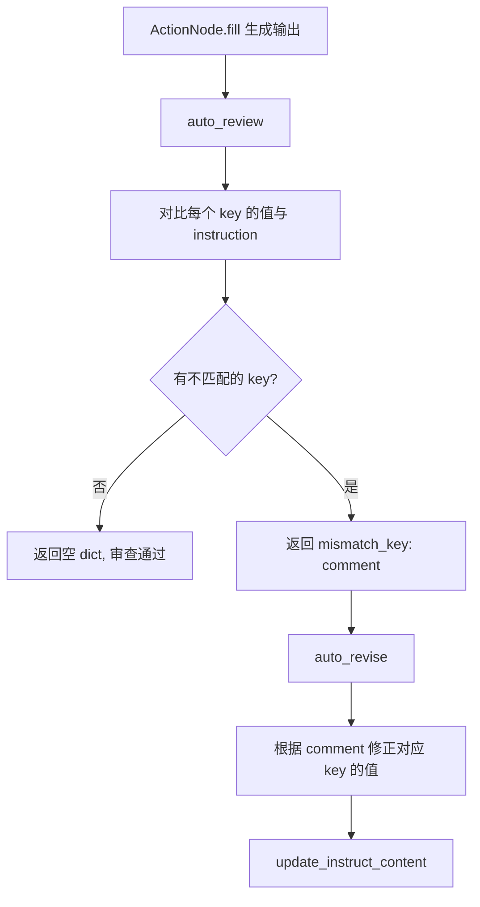
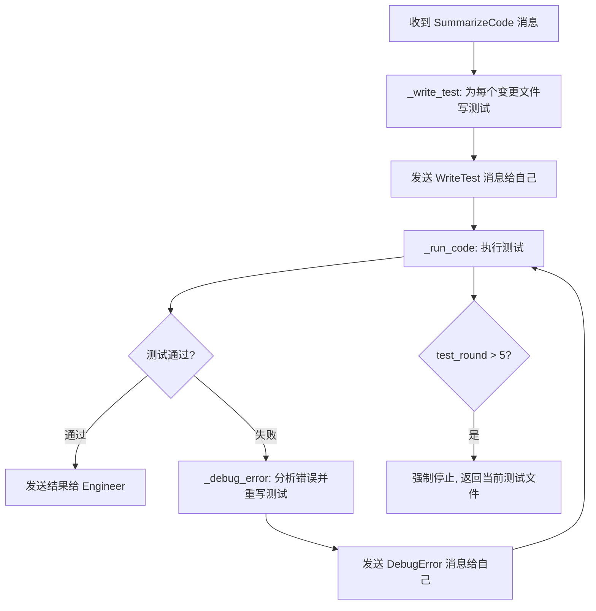

# PD-07.05 MetaGPT — 多层代码审查与 LGTM/LBTM 迭代验证

> 文档编号：PD-07.05
> 来源：MetaGPT `metagpt/actions/write_code_review.py`, `metagpt/actions/action_node.py`, `metagpt/roles/qa_engineer.py`
> GitHub：https://github.com/FoundationAgents/MetaGPT.git
> 问题域：PD-07 质量检查 Quality Assurance
> 状态：可复用方案

---

## 第 1 章 问题与动机

### 1.1 核心问题

LLM 生成的代码存在三类典型质量问题：

1. **逻辑缺陷**：生成代码不符合需求文档或系统设计，函数未实现、接口不匹配
2. **自评盲区**：同一个 LLM 对自己生成的代码做 review 效果差，容易"自我认可"
3. **一次性生成不可靠**：单次生成的代码质量波动大，需要多轮迭代才能收敛到可用状态

MetaGPT 的核心洞察是：**将软件工程中的 Code Review 流程完整搬到 Agent 系统中**，用角色分离（Engineer vs QaEngineer vs Reviewer）和迭代循环（LGTM/LBTM 判定 + 自动重写）来系统性地提升代码质量。

### 1.2 MetaGPT 的解法概述

MetaGPT 构建了三层质量检查体系：

1. **WriteCodeReview（代码级审查）**：对每个生成的代码文件执行 LGTM/LBTM 判定，LBTM 时自动重写，循环 k 次（`code_validate_k_times`，默认 2）—— `write_code_review.py:167-221`
2. **ActionNode Review/Revise（节点级审查）**：任意 ActionNode 的输出都可以经过 auto_review → auto_revise 流程，支持 Human/Auto 两种 ReviewMode —— `action_node.py:680-838`
3. **QaEngineer（角色级测试）**：专职 QA 角色执行 WriteTest → RunCode → DebugError 循环，最多 5 轮（`test_round_allowed`），测试失败自动 debug 并重写 —— `qa_engineer.py:39-205`

### 1.3 设计思想

| 设计原则 | 具体实现 | 理由 | 替代方案 |
|----------|----------|------|----------|
| 角色分离 | Engineer 写代码，QaEngineer 写测试+运行+debug，WriteCodeReview 做审查 | 避免自评盲区，不同角色有不同 system prompt 和评判标准 | 单 Agent 自审（效果差） |
| LGTM/LBTM 二值判定 | 审查结果只有 LGTM（通过）和 LBTM（不通过）两种 | 简单明确，避免 LLM 给出模糊的"还行"评价，强制做出决策 | 分数制（0-10 分，阈值难定） |
| 可配置迭代上限 | `code_validate_k_times` 全局配置，`test_round_allowed` 角色级配置 | 防止无限循环浪费 token，同时允许用户按项目调整 | 固定次数（不灵活） |
| 消息驱动状态机 | QaEngineer 通过 `cause_by` 字段判断当前应执行哪个动作 | 解耦各步骤，每步独立可测试，消息路由清晰 | 硬编码 if-else 流程 |
| 上下文注入审查 | 审查时注入 System Design + Task + 其他代码文件作为上下文 | 审查不是孤立看代码，而是对照设计文档检查一致性 | 只看当前文件（缺乏全局视角） |

---

## 第 2 章 源码实现分析

### 2.1 架构概览

MetaGPT 的质量检查体系分为三个独立但协作的层次：

```
┌─────────────────────────────────────────────────────────────┐
│                    MetaGPT Quality Assurance                │
├─────────────────────────────────────────────────────────────┤
│                                                             │
│  Layer 1: ActionNode Review/Revise (通用节点级)              │
│  ┌──────────┐    ┌──────────┐    ┌──────────┐              │
│  │   fill()  │───→│ review() │───→│ revise() │              │
│  │ 生成输出  │    │ 找不匹配 │    │ 修正输出  │              │
│  └──────────┘    └──────────┘    └──────────┘              │
│       ReviewMode: HUMAN / AUTO                              │
│       ReviseMode: HUMAN / HUMAN_REVIEW / AUTO               │
│                                                             │
│  Layer 2: WriteCodeReview (代码文件级)                       │
│  ┌──────────┐    ┌──────────┐    ┌──────────┐              │
│  │ 6 维审查  │───→│LGTM/LBTM│───→│ 自动重写  │──→ 循环 k 次 │
│  │ checklist │    │  判定    │    │ rewrite  │              │
│  └──────────┘    └──────────┘    └──────────┘              │
│                                                             │
│  Layer 3: QaEngineer Role (角色级测试)                       │
│  ┌──────────┐    ┌──────────┐    ┌──────────┐              │
│  │WriteTest │───→│ RunCode  │───→│DebugError│──→ 循环 5 轮  │
│  │ 写测试   │    │ 跑测试   │    │ 修 bug   │              │
│  └──────────┘    └──────────┘    └──────────┘              │
│       消息路由: cause_by 驱动状态转换                         │
│                                                             │
└─────────────────────────────────────────────────────────────┘
```

### 2.2 核心实现

#### 2.2.1 WriteCodeReview：LGTM/LBTM 迭代审查



对应源码 `metagpt/actions/write_code_review.py:167-221`：

```python
async def run(self, *args, **kwargs) -> CodingContext:
    iterative_code = self.i_context.code_doc.content
    k = self.context.config.code_validate_k_times or 1

    for i in range(k):
        format_example = FORMAT_EXAMPLE.format(filename=self.i_context.code_doc.filename)
        task_content = self.i_context.task_doc.content if self.i_context.task_doc else ""
        code_context = await WriteCode.get_codes(
            self.i_context.task_doc,
            exclude=self.i_context.filename,
            project_repo=self.repo,
            use_inc=self.config.inc,
        )
        ctx_list = [
            "## System Design\n" + str(self.i_context.design_doc) + "\n",
            "## Task\n" + task_content + "\n",
            "## Code Files\n" + code_context + "\n",
        ]
        context_prompt = PROMPT_TEMPLATE.format(
            context="\n".join(ctx_list),
            code=iterative_code,
            filename=self.i_context.code_doc.filename,
        )
        cr_prompt = EXAMPLE_AND_INSTRUCTION.format(
            format_example=format_example,
            filename=self.i_context.code_doc.filename,
        )
        result, rewrited_code = await self.write_code_review_and_rewrite(
            context_prompt, cr_prompt, self.i_context.code_doc
        )
        if "LBTM" in result:
            iterative_code = rewrited_code
        elif "LGTM" in result:
            self.i_context.code_doc.content = iterative_code
            return self.i_context
    self.i_context.code_doc.content = iterative_code
    return self.i_context
```

审查的 6 个维度定义在 `write_code_review.py:52-63`：
1. 代码是否按需求实现
2. 代码逻辑是否正确
3. 是否遵循数据结构和接口设计
4. 所有函数是否都已实现
5. 必要的依赖是否已导入
6. 是否正确复用了其他文件的方法

#### 2.2.2 ActionNode Review/Revise：通用节点级审查



对应源码 `metagpt/actions/action_node.py:680-716`：

```python
async def auto_review(self, template: str = REVIEW_TEMPLATE) -> dict[str, str]:
    """use key's output value and its instruction to review the modification comment"""
    nodes_output = self._makeup_nodes_output_with_req()
    if not nodes_output:
        return dict()
    prompt = template.format(
        nodes_output=json.dumps(nodes_output, ensure_ascii=False),
        tag=TAG,
        constraint=FORMAT_CONSTRAINT,
        prompt_schema="json",
    )
    content = await self.llm.aask(prompt)
    keys = self.keys()
    include_keys = []
    for key in keys:
        if f'"{key}":' in content:
            include_keys.append(key)
    if not include_keys:
        return dict()
    exclude_keys = list(set(keys).difference(include_keys))
    output_class_name = f"{self.key}_AN_REVIEW"
    output_class = self.create_class(class_name=output_class_name, exclude=exclude_keys)
    parsed_data = llm_output_postprocess(
        output=content, schema=output_class.model_json_schema(), req_key=f"[/{TAG}]"
    )
    instruct_content = output_class(**parsed_data)
    return instruct_content.model_dump()
```

关键设计：`_makeup_nodes_output_with_req()` 将每个 key 的当前值和原始 instruction 打包在一起，让 LLM 逐一对比是否匹配。这是一种**需求-输出对齐检查**。


#### 2.2.3 QaEngineer：角色级测试循环



对应源码 `metagpt/roles/qa_engineer.py:161-205`：

```python
async def _act(self) -> Message:
    if self.input_args.project_path:
        await init_python_folder(self.repo.tests.workdir)
    if self.test_round > self.test_round_allowed:
        result_msg = AIMessage(
            content=f"Exceeding {self.test_round_allowed} rounds of tests, stop. "
            + "\n".join(list(self.repo.tests.changed_files.keys())),
            cause_by=WriteTest,
            send_to=MESSAGE_ROUTE_TO_NONE,
        )
        return result_msg

    code_filters = any_to_str_set({PrepareDocuments, SummarizeCode})
    test_filters = any_to_str_set({WriteTest, DebugError})
    run_filters = any_to_str_set({RunCode})
    for msg in self.rc.news:
        if msg.cause_by in code_filters:
            await self._write_test(msg)
        elif msg.cause_by in test_filters:
            await self._run_code(msg)
        elif msg.cause_by in run_filters:
            await self._debug_error(msg)
    self.test_round += 1
    return AIMessage(content=f"Round {self.test_round} of tests done", ...)
```

### 2.3 实现细节

#### 2.3.1 三种 ReviewMode/ReviseMode 组合

`action_node.py:32-40` 定义了灵活的审查模式：

| ReviewMode | ReviseMode | 行为 |
|------------|------------|------|
| AUTO | AUTO | 全自动：LLM 审查 + LLM 修正 |
| HUMAN | AUTO | 人工审查 + LLM 自动修正 |
| HUMAN | HUMAN | 人工审查 + 人工修正 |
| AUTO | HUMAN_REVIEW | LLM 审查 → 人工确认 → LLM 修正 |

`HumanInteraction`（`utils/human_interaction.py:14-107`）提供终端交互界面，支持按字段编号选择要 review/revise 的字段，输入内容会做类型校验。

#### 2.3.2 RunCode 的智能路由

`run_code.py:120-146` 中，RunCode 执行测试后会让 LLM 分析结果并决定路由：
- 输出 `Engineer`：bug 在业务代码中，消息路由给 Engineer 角色
- 输出 `QaEngineer`：bug 在测试代码中，消息路由回 QaEngineer 自己
- 输出 `NoOne`：测试全部通过

这种 **LLM 驱动的消息路由** 让系统能自动判断问题归属。

#### 2.3.3 ValidateAndRewriteCode 工具化封装

`write_code_review.py:224-316` 将审查流程封装为 `@register_tool` 工具，支持外部调用：

```python
@register_tool(include_functions=["run"])
class ValidateAndRewriteCode(Action):
    async def run(self, code_path: str, system_design_input: str = "",
                  project_schedule_input: str = "", code_validate_k_times: int = 2) -> str:
```

这意味着其他 Agent 可以通过工具调用来触发代码审查，不需要了解内部实现。

#### 2.3.4 SummarizeCode 的全局审查

`summarize_code.py:93-123` 在代码审查前先做全局摘要，输出包括：
- **Code Review All**：逐文件列出 bug（未实现函数、调用错误、未引用等）
- **Call flow**：用 Mermaid 画出调用链
- **TODOs**：需要修改的文件及原因（dict[str, str]）

这为后续的 QaEngineer 提供了全局视角。

---

## 第 3 章 迁移指南

### 3.1 迁移清单

**阶段 1：LGTM/LBTM 迭代审查（最小可用）**
- [ ] 定义 6 维审查 checklist prompt
- [ ] 实现 `review_and_rewrite(code, context, k)` 函数
- [ ] 解析 LGTM/LBTM 判定结果
- [ ] LBTM 时触发重写，循环 k 次
- [ ] 配置 `code_validate_k_times` 参数

**阶段 2：ActionNode 级 Review/Revise（通用化）**
- [ ] 实现 `auto_review(output, instructions)` — 对比输出与需求
- [ ] 实现 `auto_revise(output, comments)` — 根据审查意见修正
- [ ] 支持 ReviewMode 切换（HUMAN/AUTO）
- [ ] 用 Pydantic 动态模型校验输出结构

**阶段 3：QA 角色测试循环（完整体系）**
- [ ] 实现 WriteTest → RunCode → DebugError 三步循环
- [ ] 消息路由：根据 `cause_by` 字段分发动作
- [ ] 测试轮次上限保护
- [ ] LLM 驱动的错误归因（Engineer vs QaEngineer）

### 3.2 适配代码模板

最小可用的 LGTM/LBTM 审查循环：

```python
from dataclasses import dataclass
from typing import Optional, Tuple

@dataclass
class ReviewResult:
    verdict: str  # "LGTM" or "LBTM"
    comments: list[str]
    rewritten_code: Optional[str] = None

REVIEW_CHECKLIST = """
Based on the design document and task description, review the code:
1. Is the code implemented as per the requirements?
2. Is the code logic completely correct?
3. Does it follow the data structures and interfaces?
4. Are all functions implemented?
5. Are all necessary dependencies imported?
6. Are methods from other files reused correctly?

Answer LGTM if all checks pass, otherwise LBTM with specific issues.
"""

async def review_and_rewrite(
    llm,
    code: str,
    context: str,  # design doc + task doc + other code files
    filename: str,
    max_iterations: int = 2,
) -> Tuple[str, list[ReviewResult]]:
    """LGTM/LBTM iterative code review, returns (final_code, review_history)."""
    current_code = code
    history = []

    for i in range(max_iterations):
        # Step 1: Review
        review_prompt = f"{context}\n\n## Code: {filename}\n```\n{current_code}\n```\n\n{REVIEW_CHECKLIST}"
        review_response = await llm.generate(review_prompt)

        verdict = "LGTM" if "LGTM" in review_response else "LBTM"
        result = ReviewResult(verdict=verdict, comments=[review_response])

        if verdict == "LGTM":
            history.append(result)
            return current_code, history

        # Step 2: Rewrite on LBTM
        rewrite_prompt = (
            f"{context}\n\n## Review Feedback:\n{review_response}\n\n"
            f"Rewrite {filename} to fix all issues:\n```python\n"
        )
        rewritten = await llm.generate(rewrite_prompt)
        result.rewritten_code = rewritten
        history.append(result)
        current_code = rewritten

    return current_code, history
```

### 3.3 适用场景

| 场景 | 适用度 | 说明 |
|------|--------|------|
| 代码生成 Agent | ⭐⭐⭐ | 核心场景，LGTM/LBTM 循环直接可用 |
| 文档生成 Agent | ⭐⭐⭐ | ActionNode Review/Revise 可泛化到任何结构化输出 |
| 多 Agent 协作系统 | ⭐⭐⭐ | QaEngineer 角色模式适合有明确分工的系统 |
| 单次问答 Agent | ⭐ | 过重，单次交互不需要迭代审查 |
| 实时流式输出 | ⭐ | 迭代审查有延迟，不适合需要即时响应的场景 |

---

## 第 4 章 测试用例

```python
import pytest
from unittest.mock import AsyncMock, MagicMock
from dataclasses import dataclass
from typing import Optional, Tuple


@dataclass
class ReviewResult:
    verdict: str
    comments: list[str]
    rewritten_code: Optional[str] = None


async def review_and_rewrite(llm, code, context, filename, max_iterations=2):
    """Simplified version for testing."""
    current_code = code
    history = []
    for i in range(max_iterations):
        review_response = await llm.generate(f"review:{current_code}")
        verdict = "LGTM" if "LGTM" in review_response else "LBTM"
        result = ReviewResult(verdict=verdict, comments=[review_response])
        if verdict == "LGTM":
            history.append(result)
            return current_code, history
        rewritten = await llm.generate(f"rewrite:{current_code}")
        result.rewritten_code = rewritten
        history.append(result)
        current_code = rewritten
    return current_code, history


class TestLGTMLBTMReviewLoop:
    """Tests for the LGTM/LBTM iterative review pattern from MetaGPT."""

    @pytest.mark.asyncio
    async def test_lgtm_first_round(self):
        """Code passes review on first attempt."""
        llm = AsyncMock()
        llm.generate.return_value = "All checks pass. LGTM"
        code, history = await review_and_rewrite(llm, "good_code", "ctx", "main.py")
        assert code == "good_code"
        assert len(history) == 1
        assert history[0].verdict == "LGTM"

    @pytest.mark.asyncio
    async def test_lbtm_then_lgtm(self):
        """Code fails first review, passes after rewrite."""
        llm = AsyncMock()
        llm.generate.side_effect = [
            "Function B not implemented. LBTM",  # review round 1
            "def func_b(): return 42",            # rewrite round 1
            "All good. LGTM",                     # review round 2
        ]
        code, history = await review_and_rewrite(llm, "bad_code", "ctx", "main.py")
        assert code == "def func_b(): return 42"
        assert len(history) == 2
        assert history[0].verdict == "LBTM"
        assert history[1].verdict == "LGTM"

    @pytest.mark.asyncio
    async def test_max_iterations_reached(self):
        """Code never passes, stops at max iterations."""
        llm = AsyncMock()
        llm.generate.side_effect = [
            "Bug found. LBTM", "fix_v1",
            "Still buggy. LBTM", "fix_v2",
        ]
        code, history = await review_and_rewrite(llm, "buggy", "ctx", "f.py", max_iterations=2)
        assert code == "fix_v2"
        assert len(history) == 2
        assert all(r.verdict == "LBTM" for r in history)

    @pytest.mark.asyncio
    async def test_zero_iterations(self):
        """With max_iterations=0, returns original code immediately."""
        llm = AsyncMock()
        code, history = await review_and_rewrite(llm, "original", "ctx", "f.py", max_iterations=0)
        assert code == "original"
        assert len(history) == 0


class TestQaEngineerRoundLimit:
    """Tests for the QaEngineer test round limiting pattern."""

    def test_round_limit_enforcement(self):
        """Simulates QaEngineer stopping after test_round_allowed rounds."""
        test_round_allowed = 5
        test_round = 0
        results = []
        for _ in range(10):  # try 10 rounds
            if test_round > test_round_allowed:
                results.append("STOPPED")
                break
            results.append(f"round_{test_round}")
            test_round += 1
        assert results[-1] == "STOPPED"
        assert len(results) == 7  # 0..5 + STOPPED


class TestReviewModeDispatch:
    """Tests for ReviewMode/ReviseMode dispatch logic."""

    def test_review_mode_enum(self):
        """ReviewMode has exactly HUMAN and AUTO."""
        from enum import Enum
        class ReviewMode(Enum):
            HUMAN = "human"
            AUTO = "auto"
        assert ReviewMode.HUMAN.value == "human"
        assert ReviewMode.AUTO.value == "auto"

    def test_revise_mode_enum(self):
        """ReviseMode has HUMAN, HUMAN_REVIEW, AUTO."""
        from enum import Enum
        class ReviseMode(Enum):
            HUMAN = "human"
            HUMAN_REVIEW = "human_review"
            AUTO = "auto"
        assert len(ReviseMode) == 3
```


---

## 第 5 章 跨域关联

| 关联域 | 关系类型 | 说明 |
|--------|----------|------|
| PD-01 上下文管理 | 依赖 | WriteCodeReview 在审查时注入 System Design + Task + 其他代码文件作为上下文，上下文窗口管理直接影响审查质量 |
| PD-02 多 Agent 编排 | 协同 | QaEngineer 是 MetaGPT 多角色编排中的专职角色，通过消息路由与 Engineer 协作 |
| PD-03 容错与重试 | 协同 | WriteCodeReview 的 `write_code_review_and_rewrite` 使用 tenacity `@retry(stop_after_attempt(6))` 做 LLM 调用重试；ActionNode 的 `_aask_v1` 同样有 6 次重试 |
| PD-04 工具系统 | 协同 | ValidateAndRewriteCode 通过 `@register_tool` 注册为可调用工具，其他 Agent 可通过工具系统触发代码审查 |
| PD-09 Human-in-the-Loop | 协同 | ActionNode 的 ReviewMode.HUMAN 和 ReviseMode.HUMAN 支持人工介入审查流程，HumanInteraction 提供终端交互 |
| PD-11 可观测性 | 依赖 | 审查过程通过 `logger.info` 记录每轮审查的代码长度变化和轮次信息，但缺乏结构化的 cost tracking |

---

## 第 6 章 来源文件索引

| 文件 | 行范围 | 关键实现 |
|------|--------|----------|
| `metagpt/actions/write_code_review.py` | L27-65 | PROMPT_TEMPLATE + 6 维审查 checklist + LGTM/LBTM 格式定义 |
| `metagpt/actions/write_code_review.py` | L141-221 | WriteCodeReview 类：k 次迭代审查 + 自动重写核心逻辑 |
| `metagpt/actions/write_code_review.py` | L224-316 | ValidateAndRewriteCode：工具化封装，支持外部调用 |
| `metagpt/actions/action_node.py` | L32-40 | ReviewMode / ReviseMode 枚举定义 |
| `metagpt/actions/action_node.py` | L75-125 | REVIEW_TEMPLATE / REVISE_TEMPLATE prompt 模板 |
| `metagpt/actions/action_node.py` | L665-716 | human_review / auto_review 实现 |
| `metagpt/actions/action_node.py` | L752-838 | human_revise / auto_revise / revise 实现 |
| `metagpt/roles/qa_engineer.py` | L39-60 | QaEngineer 角色定义：test_round_allowed=5，监听 4 种消息 |
| `metagpt/roles/qa_engineer.py` | L62-103 | _write_test：为每个变更文件生成测试 |
| `metagpt/roles/qa_engineer.py` | L105-148 | _run_code：执行测试 + LLM 路由判定 |
| `metagpt/roles/qa_engineer.py` | L150-159 | _debug_error：分析错误并重写测试代码 |
| `metagpt/roles/qa_engineer.py` | L161-205 | _act：消息驱动状态机，cause_by 分发 |
| `metagpt/actions/write_review.py` | L12-39 | LGTM/LBTM ActionNode 定义 + WriteReview 通用审查 |
| `metagpt/actions/write_test.py` | L40-70 | WriteTest：生成 PEP8 合规测试代码 |
| `metagpt/actions/run_code.py` | L78-146 | RunCode：执行测试 + LLM 分析结果 + 路由决策 |
| `metagpt/actions/debug_error.py` | L50-77 | DebugError：基于错误日志重写代码 |
| `metagpt/actions/summarize_code.py` | L93-123 | SummarizeCode：全局代码审查 + TODO 列表 |
| `metagpt/actions/design_api_review.py` | L14-26 | DesignReview：API 设计审查 |
| `metagpt/actions/write_prd_review.py` | L14-31 | WritePRDReview：PRD 文档审查 |
| `metagpt/utils/human_interaction.py` | L14-107 | HumanInteraction：终端交互式审查/修正 |
| `metagpt/config2.py` | L79 | code_validate_k_times 配置项，默认值 2 |

---

## 第 7 章 横向对比维度

```json comparison_data
{
  "project": "MetaGPT",
  "dimensions": {
    "检查方式": "三层体系：ActionNode 节点级 + WriteCodeReview 文件级 + QaEngineer 角色级",
    "评估维度": "6 维 checklist（需求一致/逻辑正确/接口遵循/函数完整/依赖导入/方法复用）",
    "评估粒度": "文件级（WriteCodeReview）+ 字段级（ActionNode key-by-key 对比）",
    "迭代机制": "LGTM/LBTM 二值判定循环，code_validate_k_times 可配置（默认 2）",
    "反馈机制": "结构化 Actions 列表 + 具体修复代码片段，LBTM 时自动触发重写",
    "自动修复": "三级自动修复：ActionNode auto_revise + WriteCodeReview rewrite + DebugError 重写测试",
    "覆盖范围": "全生命周期：PRD 审查 → API 设计审查 → 代码审查 → 测试生成 → 测试执行 → Debug",
    "并发策略": "串行逐文件审查，QaEngineer 逐文件写测试+运行",
    "降级路径": "k 次迭代耗尽后返回最后一版代码，test_round 超限后强制停止返回当前测试文件",
    "人机协作": "ReviewMode(HUMAN/AUTO) + ReviseMode(HUMAN/HUMAN_REVIEW/AUTO) 三种模式灵活切换",
    "错误归因": "RunCode 用 LLM 判定 bug 归属（Engineer/QaEngineer），自动路由给对应角色"
  }
}
```

### 域元数据补充

```json domain_metadata
{
  "solution_summary": "MetaGPT 用三层质量体系（ActionNode 节点级 review/revise + WriteCodeReview LGTM/LBTM 迭代审查 + QaEngineer 角色级 WriteTest→RunCode→DebugError 循环）覆盖代码生成全生命周期",
  "description": "质量检查不仅限于代码，还应覆盖 PRD、API 设计等上游产物的审查",
  "sub_problems": [
    "LLM 驱动的错误归因：测试失败后自动判定 bug 在业务代码还是测试代码中",
    "审查模式切换：同一审查流程支持全自动、人工审查+自动修正、全人工三种模式",
    "全局代码摘要审查：在逐文件审查前先做跨文件的全局 bug 扫描和调用链分析"
  ],
  "best_practices": [
    "LGTM/LBTM 二值判定优于模糊评分：强制 LLM 做出明确的通过/不通过决策，避免中间态",
    "审查时注入设计文档作为对照基准：不是孤立看代码，而是对照 System Design + Task 检查一致性",
    "将审查流程工具化注册：通过 @register_tool 让其他 Agent 可按需调用审查能力，实现审查即服务"
  ]
}
```
