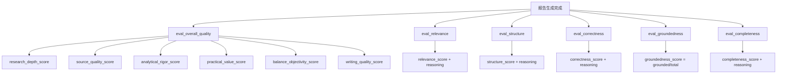
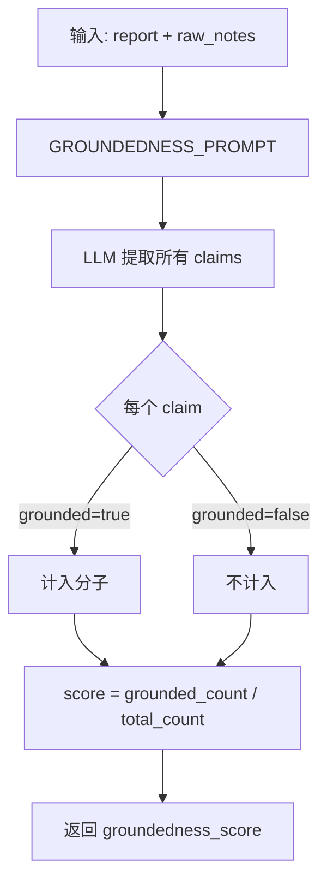
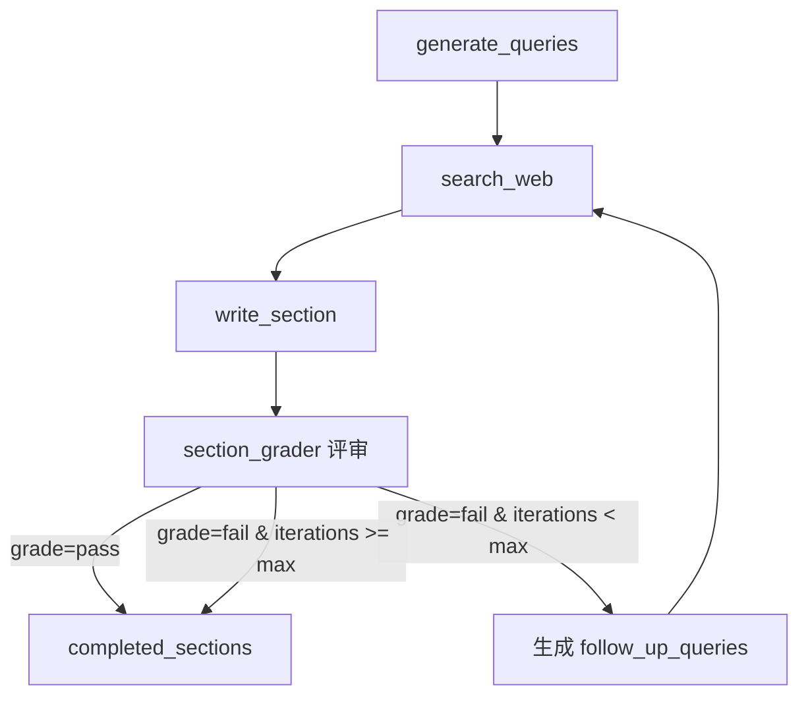
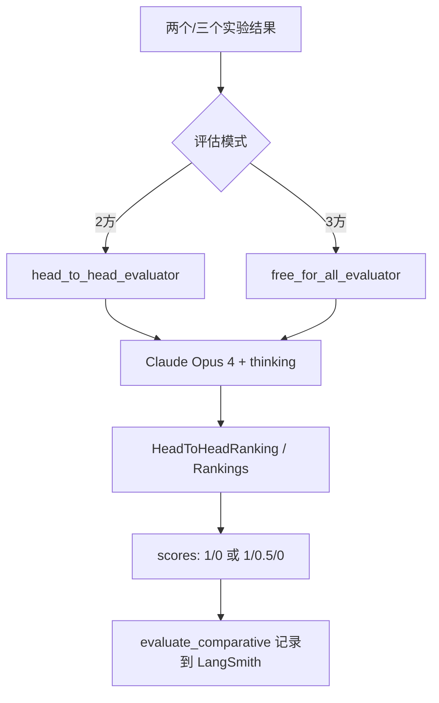

# PD-07.20 OpenDeepResearch — LLM-as-Judge 六维评估与 Section-Grader 迭代闭环

> 文档编号：PD-07.20
> 来源：OpenDeepResearch `tests/evaluators.py` `tests/prompts.py` `src/legacy/graph.py`
> GitHub：https://github.com/langchain-ai/open_deep_research.git
> 问题域：PD-07 质量检查 Quality Assurance
> 状态：可复用方案

---

## 第 1 章 问题与动机

### 1.1 核心问题

Deep Research Agent 生成的长篇研究报告质量难以量化评估。传统的 BLEU/ROUGE 等文本匹配指标无法衡量研究报告的深度、准确性和实用性。需要一套多维度、可自动化、可追踪的评估体系，既能在生成过程中做实时质量门控（section-level grading），又能在生成完成后做全面质量评估（report-level evaluation）。

此外，不同架构的 Agent（单 Agent、多 Agent Supervisor、多 Agent Workflow）需要在相同基准上做公平对比，要求评估体系支持 A/B 测试和多方排名。

### 1.2 OpenDeepResearch 的解法概述

1. **六维独立评估器**：overall_quality / relevance / structure / correctness / groundedness / completeness，每个评估器有独立 prompt 和 Pydantic 结构化输出模型（`tests/evaluators.py:25-174`）
2. **Section-Grader 迭代闭环**：Legacy 版本在每个 section 写完后用 planner 模型做 pass/fail 评审，fail 时生成 follow-up 查询触发新一轮搜索（`src/legacy/graph.py:268-354`）
3. **Pairwise 对比评估**：head-to-head 和 free-for-all 两种模式，用 Claude Opus 4 做裁判，支持 2 方和 3 方对比（`tests/pairwise_evaluation.py:35-110`）
4. **LangSmith 实验追踪**：通过 `client.aevaluate()` 将评估结果自动记录到 LangSmith，支持跨实验对比（`tests/run_evaluate.py:63-86`）
5. **Deep Research Bench 基准**：自建基准数据集，配合 correctness 评估器做答案对比（`tests/run_evaluate.py:14`）

### 1.3 设计思想

| 设计原则 | 具体实现 | 理由 | 替代方案 |
|----------|----------|------|----------|
| 评估维度正交分离 | 6 个独立评估函数，各有专属 prompt | 单一综合分数无法定位问题根因 | 单一 prompt 多维度评分（耦合度高） |
| 结构化输出强制格式 | Pydantic BaseModel + `with_structured_output()` | 确保评分结果可解析、可聚合 | 自由文本 + 正则提取（不稳定） |
| 生成时质量门控 | section_grader pass/fail + follow-up queries | 早期发现质量问题，避免低质量内容传播到最终报告 | 仅在最终报告做评估（修复成本高） |
| 评估模型与生成模型分离 | 评估用 GPT-4.1，生成用可配置模型 | 避免自评偏差，评估模型固定保证一致性 | 同一模型自评（偏差大） |
| 对比评估消除绝对分数偏差 | Pairwise head-to-head + 随机顺序 | 绝对分数跨模型不可比，相对排名更可靠 | 仅用绝对分数对比（标准不一致） |

---

## 第 2 章 源码实现分析

### 2.1 架构概览

```
┌─────────────────────────────────────────────────────────────────┐
│                    评估体系架构                                    │
├─────────────────────────────────────────────────────────────────┤
│                                                                 │
│  ┌─── 生成时质量门控 (Legacy) ──────────────────────────────┐   │
│  │  write_section → section_grader → pass? ──→ END          │   │
│  │                                    fail? ──→ search_web  │   │
│  │                                    (max_search_depth限制) │   │
│  └──────────────────────────────────────────────────────────┘   │
│                                                                 │
│  ┌─── 报告级评估 (6 维) ───────────────────────────────────┐   │
│  │  eval_overall_quality  → 6 子维度 (1-5 分)               │   │
│  │  eval_relevance        → 1 分数 + reasoning              │   │
│  │  eval_structure        → 1 分数 + reasoning              │   │
│  │  eval_correctness      → 1 分数 + reasoning (需 ref)     │   │
│  │  eval_groundedness     → claims 列表 + grounded 比例     │   │
│  │  eval_completeness     → 1 分数 + reasoning              │   │
│  └──────────────────────────────────────────────────────────┘   │
│                                                                 │
│  ┌─── 对比评估 ────────────────────────────────────────────┐   │
│  │  head_to_head_evaluator  → 2 方对比 (Claude Opus 4)      │   │
│  │  free_for_all_evaluator  → 3 方排名 (Claude Opus 4)      │   │
│  └──────────────────────────────────────────────────────────┘   │
│                                                                 │
│  ┌─── 实验追踪 ────────────────────────────────────────────┐   │
│  │  LangSmith client.aevaluate() → 实验记录 + 对比面板      │   │
│  │  evaluate_comparative()       → Pairwise 实验记录        │   │
│  └──────────────────────────────────────────────────────────┘   │
└─────────────────────────────────────────────────────────────────┘
```

### 2.2 核心实现

#### 2.2.1 六维评估器体系



对应源码 `tests/evaluators.py:8-55`：

```python
eval_model = ChatOpenAI(model="gpt-4.1")

class OverallQualityScore(BaseModel):
    """Score the overall quality of the report against specific criteria."""
    research_depth: int = Field(description="Integer score 1-5 ...")
    source_quality: int = Field(description="Integer score 1-5 ...")
    analytical_rigor: int = Field(description="Integer score 1-5 ...")
    practical_value: int = Field(description="Integer score 1-5 ...")
    balance_and_objectivity: int = Field(description="Integer score 1-5 ...")
    writing_quality: int = Field(description="Integer score 1-5 ...")

def eval_overall_quality(inputs: dict, outputs: dict):
    query = _format_input_query(inputs)
    final_report = outputs["final_report"]
    # Anthropic prompt caching 适配
    if isinstance(eval_model, ChatAnthropic):
        user_input_content = [{"type": "text", "text": ...,
            "cache_control": {"type": "ephemeral", "ttl": "1h"}}]
    eval_result = cast(OverallQualityScore,
        eval_model.with_structured_output(OverallQualityScore).invoke([...]))
    return [
        {"key": "research_depth_score", "score": eval_result.research_depth / 5},
        {"key": "source_quality_score", "score": eval_result.source_quality / 5},
        # ... 归一化到 0-1
    ]
```

关键设计点：
- 评估模型固定为 `gpt-4.1`（`tests/evaluators.py:8-10`），与生成模型解耦
- 每个评估器返回 LangSmith 兼容的 `{"key": ..., "score": ...}` 格式
- 分数归一化到 0-1 范围（原始 1-5 分 / 5）
- Anthropic 模型适配：检测 `isinstance(eval_model, ChatAnthropic)` 时使用 `cache_control` 减少重复评估成本

#### 2.2.2 Groundedness 评估器 — 声明级事实核查



对应源码 `tests/evaluators.py:125-151`：

```python
class GroundednessClaim(BaseModel):
    claim: str = Field(description="The claim extracted from the report.")
    grounded: bool = Field(description="Whether the claim is grounded in the context.")

class GroundednessScore(BaseModel):
    claims: list[GroundednessClaim] = Field(
        description="All claims extracted from the report, ...")

def eval_groundedness(inputs: dict, outputs: dict):
    final_report = outputs["final_report"]
    context = str(outputs["raw_notes"])  # 原始搜索笔记作为 ground truth
    eval_result = cast(GroundednessScore,
        eval_model.with_structured_output(GroundednessScore)
        .with_retry(stop_after_attempt=3)  # 结构化输出重试
        .invoke([{"role": "user", "content": user_input_content}]))
    grounded_claims = [c for c in eval_result.claims if c.grounded]
    return {"key": "groundedness_score",
            "score": len(grounded_claims) / len(eval_result.claims)}
```

关键设计点：
- 不是简单的 1-5 分，而是逐条提取 claims 并判断是否有据可查
- 分数 = grounded claims 数 / 总 claims 数，粒度更细
- 使用 `with_retry(stop_after_attempt=3)` 防止结构化输出解析失败
- ground truth 来自 `raw_notes`（搜索原始笔记），不是外部标注


#### 2.2.3 Section-Grader 迭代闭环（Legacy 版本）



对应源码 `src/legacy/graph.py:268-354`：

```python
async def write_section(state: SectionState, config: RunnableConfig) -> Command[Literal[END, "search_web"]]:
    # ... 写入 section 内容 ...
    section.content = section_content.content

    # Grade prompt
    section_grader_instructions_formatted = section_grader_instructions.format(
        topic=topic, section_topic=section.description,
        section=section.content,
        number_of_follow_up_queries=configurable.number_of_queries)

    # 用 planner 模型做评审（非 writer 模型）
    reflection_model = init_chat_model(model=planner_model,
        model_provider=planner_provider, ...).with_structured_output(Feedback)

    feedback = await reflection_model.ainvoke([
        SystemMessage(content=section_grader_instructions_formatted),
        HumanMessage(content=section_grader_message)])

    # 双终止条件：质量达标 OR 迭代上限
    if feedback.grade == "pass" or state["search_iterations"] >= configurable.max_search_depth:
        return Command(update={"completed_sections": [section]}, goto=END)
    else:
        return Command(
            update={"search_queries": feedback.follow_up_queries, "section": section},
            goto="search_web")
```

关键设计点：
- Grader 使用 planner 模型（如 Claude 3.7 Sonnet），而非 writer 模型，实现 Generator-Critic 分离
- `Feedback` 结构化输出包含 `grade: Literal["pass","fail"]` 和 `follow_up_queries`（`src/legacy/state.py:32-38`）
- 双终止条件防止无限循环：`grade == "pass"` 或 `search_iterations >= max_search_depth`（默认 2）
- fail 时不是简单重写，而是生成新的搜索查询补充缺失信息

#### 2.2.4 Pairwise 对比评估



对应源码 `tests/pairwise_evaluation.py:35-54`：

```python
def head_to_head_evaluator(inputs: dict, outputs: list[dict]) -> list:
    grader_llm = ChatAnthropic(
        model="claude-opus-4-20250514",
        max_tokens=20000,
        thinking={"type": "enabled", "budget_tokens": 16000},  # 启用深度思考
    )
    response = grader_llm.with_structured_output(HeadToHeadRanking).invoke(
        HEAD_TO_HEAD_PROMPT.format(
            question=inputs["messages"][0]["content"],
            answer_a=outputs[0].get("final_report", "N/A"),
            answer_b=outputs[1].get("final_report", "N/A")))
    if response.preferred_answer == 1:
        scores = [1, 0]
    elif response.preferred_answer == 2:
        scores = [0, 1]
    else:
        scores = [0, 0]
    return scores
```

关键设计点：
- 裁判模型用 Claude Opus 4 + 16K thinking budget，确保深度推理
- `randomize_order=True`（`tests/pairwise_evaluation.py:127`）消除位置偏差
- 三方排名用 1/0.5/0 分制，区分第二名和最后一名

### 2.3 实现细节

**LangSmith 实验追踪集成**（`tests/run_evaluate.py:63-86`）：

```python
async def main():
    return await client.aevaluate(
        target,                    # 被评估的 Agent
        data=dataset_name,         # "Deep Research Bench" 基准数据集
        evaluators=evaluators,     # 6 个评估器全部注册
        experiment_prefix=f"ODR GPT-5, Tavily Search",
        max_concurrency=10,        # 10 并发评估
        metadata={                 # 完整实验参数记录
            "max_structured_output_retries": 3,
            "search_api": "tavily",
            "research_model": "openai:gpt-5",
            # ... 所有配置参数
        })
```

**Supervisor 并行度评估**（`tests/supervisor_parallel_evaluation.py:10-17`）：

```python
def right_parallelism_evaluator(outputs: dict, reference_outputs: dict) -> dict:
    return {
        "key": "right_parallelism",
        "score": len(outputs["output"].values["supervisor_messages"][-1].tool_calls)
                 == reference_outputs["parallel"]
    }
```

这是一个独特的评估维度：验证 Supervisor Agent 是否正确地并行化了研究任务（tool_calls 数量是否等于预期并行度）。

**Legacy pytest 质量测试**（`src/legacy/tests/test_report_quality.py:26-48`）：

```python
class CriteriaGrade(BaseModel):
    grade: bool = Field(description="Does the response meet the provided criteria?")
    justification: str = Field(description="The justification for the grade ...")

def get_evaluation_llm(eval_model=None):
    model_to_use = eval_model or os.environ.get("EVAL_MODEL",
        "anthropic:claude-3-7-sonnet-latest")
    return init_chat_model(model_to_use).with_structured_output(CriteriaGrade)
```

Legacy 版本用 bool 型 pass/fail 做 pytest 断言（`assert eval_result.grade`），与 LangSmith 集成记录评估结果。

---

## 第 3 章 迁移指南

### 3.1 迁移清单

**阶段 1：基础评估器**
- [ ] 定义评估维度的 Pydantic 模型（每个维度一个 BaseModel）
- [ ] 编写每个维度的评估 prompt（参考 `tests/prompts.py` 的 6 个 prompt 模板）
- [ ] 实现评估函数，返回 `{"key": ..., "score": ...}` 格式
- [ ] 选择固定的评估模型（建议 GPT-4.1 或 Claude Sonnet 4）

**阶段 2：生成时质量门控**
- [ ] 在 Agent 工作流中添加 grader 节点
- [ ] 定义 `Feedback` 结构化输出（grade + follow_up_queries）
- [ ] 实现双终止条件（质量达标 OR 迭代上限）
- [ ] 确保 grader 模型与 writer 模型不同

**阶段 3：实验追踪**
- [ ] 集成 LangSmith（或其他实验追踪平台）
- [ ] 创建基准数据集
- [ ] 配置 `evaluate()` 或 `evaluate_comparative()` 流水线

### 3.2 适配代码模板

```python
from pydantic import BaseModel, Field
from langchain.chat_models import init_chat_model
from typing import cast

# --- 1. 定义评估维度 ---
class QualityScore(BaseModel):
    reasoning: str = Field(description="Detailed justification")
    score: int = Field(description="Score 1-5")

EVAL_PROMPT = """Evaluate the following output on {dimension}.
Score 1-5 where 1=Poor, 5=Excellent.
{criteria}"""

# --- 2. 创建评估器 ---
eval_model = init_chat_model("openai:gpt-4.1")

def eval_dimension(inputs: dict, outputs: dict, dimension: str, criteria: str):
    structured_llm = eval_model.with_structured_output(QualityScore).with_retry(
        stop_after_attempt=3)
    result = cast(QualityScore, structured_llm.invoke([
        {"role": "system", "content": EVAL_PROMPT.format(
            dimension=dimension, criteria=criteria)},
        {"role": "user", "content": f"Input: {inputs}\n\nOutput: {outputs}"}
    ]))
    return {"key": f"{dimension}_score", "score": result.score / 5,
            "comment": result.reasoning}

# --- 3. Section-Grader 闭环 ---
class GraderFeedback(BaseModel):
    grade: str = Field(description="'pass' or 'fail'")
    follow_up_queries: list[str] = Field(default_factory=list)

def grade_section(section_content: str, section_topic: str,
                  grader_model, max_retries: int = 2) -> GraderFeedback:
    structured_grader = grader_model.with_structured_output(GraderFeedback)
    return structured_grader.invoke([
        {"role": "system", "content": f"Evaluate section on: {section_topic}"},
        {"role": "user", "content": section_content}
    ])
```

### 3.3 适用场景

| 场景 | 适用度 | 说明 |
|------|--------|------|
| 研究报告生成 Agent | ⭐⭐⭐ | 完美匹配，6 维评估直接可用 |
| RAG 问答系统 | ⭐⭐⭐ | groundedness + correctness 评估器直接适用 |
| 多 Agent 架构对比 | ⭐⭐⭐ | Pairwise 评估 + LangSmith 实验追踪 |
| 代码生成 Agent | ⭐⭐ | 需替换评估维度（正确性→测试通过率） |
| 对话系统 | ⭐ | 评估维度需大幅调整 |

---

## 第 4 章 测试用例

```python
import pytest
from unittest.mock import MagicMock, patch
from pydantic import BaseModel, Field

# --- 模拟评估器结构 ---
class MockQualityScore(BaseModel):
    research_depth: int = 4
    source_quality: int = 3
    analytical_rigor: int = 5
    practical_value: int = 4
    balance_and_objectivity: int = 3
    writing_quality: int = 4

class MockGroundednessClaim(BaseModel):
    claim: str
    grounded: bool

class MockGroundednessScore(BaseModel):
    claims: list[MockGroundednessClaim]

class MockFeedback(BaseModel):
    grade: str  # "pass" or "fail"
    follow_up_queries: list[str] = []

# --- 测试用例 ---
class TestEvaluators:
    def test_overall_quality_score_normalization(self):
        """验证分数归一化到 0-1"""
        score = MockQualityScore()
        results = [
            {"key": "research_depth_score", "score": score.research_depth / 5},
            {"key": "source_quality_score", "score": score.source_quality / 5},
        ]
        for r in results:
            assert 0 <= r["score"] <= 1

    def test_groundedness_ratio_calculation(self):
        """验证 groundedness 比例计算"""
        claims = [
            MockGroundednessClaim(claim="Claim A", grounded=True),
            MockGroundednessClaim(claim="Claim B", grounded=False),
            MockGroundednessClaim(claim="Claim C", grounded=True),
        ]
        grounded = [c for c in claims if c.grounded]
        score = len(grounded) / len(claims)
        assert score == pytest.approx(2 / 3)

    def test_groundedness_all_grounded(self):
        """全部有据可查时分数为 1.0"""
        claims = [MockGroundednessClaim(claim=f"C{i}", grounded=True) for i in range(5)]
        score = len([c for c in claims if c.grounded]) / len(claims)
        assert score == 1.0

    def test_section_grader_pass_terminates(self):
        """pass 时应终止迭代"""
        feedback = MockFeedback(grade="pass")
        search_iterations = 1
        max_search_depth = 3
        should_continue = feedback.grade != "pass" and search_iterations < max_search_depth
        assert not should_continue

    def test_section_grader_fail_continues(self):
        """fail 且未达上限时应继续"""
        feedback = MockFeedback(grade="fail", follow_up_queries=["query1"])
        search_iterations = 1
        max_search_depth = 3
        should_continue = feedback.grade != "pass" and search_iterations < max_search_depth
        assert should_continue

    def test_section_grader_max_depth_terminates(self):
        """达到迭代上限时即使 fail 也应终止"""
        feedback = MockFeedback(grade="fail", follow_up_queries=["query1"])
        search_iterations = 3
        max_search_depth = 3
        should_terminate = feedback.grade == "pass" or search_iterations >= max_search_depth
        assert should_terminate

    def test_pairwise_scoring(self):
        """验证 pairwise 评分逻辑"""
        # preferred_answer=1 → [1, 0]
        assert [1, 0] == ([1, 0] if 1 == 1 else [0, 1])
        # preferred_answer=2 → [0, 1]
        assert [0, 1] == ([1, 0] if 2 == 1 else [0, 1])

    def test_free_for_all_scoring(self):
        """验证三方排名评分"""
        scores = [0, 0, 0]
        preferred, second, worst = 2, 1, 3
        scores[preferred - 1] = 1
        scores[second - 1] = 0.5
        scores[worst - 1] = 0
        assert scores == [0.5, 1, 0]
```


---

## 第 5 章 跨域关联

| 关联域 | 关系类型 | 说明 |
|--------|----------|------|
| PD-01 上下文管理 | 协同 | Groundedness 评估依赖 raw_notes 上下文；section_grader 迭代增加上下文消耗 |
| PD-02 多 Agent 编排 | 协同 | Pairwise 评估用于对比不同编排架构（单 Agent vs Supervisor vs Workflow）的输出质量 |
| PD-03 容错与重试 | 依赖 | `with_retry(stop_after_attempt=3)` 用于 groundedness 结构化输出解析容错 |
| PD-08 搜索与检索 | 协同 | section_grader fail 时生成 follow_up_queries 触发新一轮搜索 |
| PD-09 Human-in-the-Loop | 协同 | Legacy 版本 human_feedback 节点在质量评估前做计划审批 |
| PD-11 可观测性 | 依赖 | 所有评估结果通过 LangSmith client.aevaluate() 记录，支持实验对比面板 |
| PD-12 推理增强 | 协同 | Pairwise 裁判用 Claude Opus 4 + thinking budget 做深度推理评估 |

---

## 第 6 章 来源文件索引

| 文件 | 行范围 | 关键实现 |
|------|--------|----------|
| `tests/evaluators.py` | L1-L174 | 6 个评估器函数 + Pydantic 模型定义 |
| `tests/prompts.py` | L1-L257 | 6 个评估 prompt 模板（overall_quality/relevance/structure/correctness/groundedness/completeness） |
| `tests/pairwise_evaluation.py` | L1-L128 | head-to-head 和 free-for-all 对比评估器 |
| `tests/run_evaluate.py` | L1-L90 | LangSmith 实验运行脚本，6 评估器注册 |
| `tests/supervisor_parallel_evaluation.py` | L1-L61 | Supervisor 并行度正确性评估 |
| `tests/extract_langsmith_data.py` | L1-L83 | LangSmith 实验数据导出为 JSONL |
| `src/legacy/graph.py` | L268-L354 | write_section + section_grader 迭代闭环 |
| `src/legacy/state.py` | L32-L38 | Feedback 结构化输出定义（grade + follow_up_queries） |
| `src/legacy/prompts.py` | L168-L198 | section_grader_instructions prompt |
| `src/legacy/configuration.py` | L31-L67 | Configuration（max_search_depth 等参数） |
| `src/legacy/tests/test_report_quality.py` | L26-L294 | pytest 质量测试 + LangSmith 日志 |

---

## 第 7 章 横向对比维度

```json comparison_data
{
  "project": "OpenDeepResearch",
  "dimensions": {
    "检查方式": "LLM-as-Judge 六维独立评估 + Section-Grader pass/fail 迭代",
    "评估维度": "6 维：overall_quality(含 6 子维度)/relevance/structure/correctness/groundedness/completeness",
    "评估粒度": "双粒度：section 级实时门控 + report 级全面评估",
    "迭代机制": "section_grader fail 时生成 follow-up queries 触发新搜索轮次",
    "反馈机制": "结构化 Feedback(grade + follow_up_queries) + 评估器 reasoning 字段",
    "自动修复": "fail 时自动补充搜索并重写 section，非直接修改",
    "覆盖范围": "研究深度/源质量/分析严谨性/实用价值/平衡客观/写作质量/相关性/结构/正确性/事实依据/完整性",
    "并发策略": "LangSmith evaluate max_concurrency=10 并行评估",
    "降级路径": "迭代达 max_search_depth 时强制通过，with_retry 3 次结构化输出",
    "基准集成": "Deep Research Bench 自建基准 + LangSmith 实验追踪 + JSONL 导出",
    "评估模型隔离": "评估固定 GPT-4.1，裁判用 Claude Opus 4，与生成模型完全分离",
    "决策归一化": "分数统一归一化到 0-1（原始 1-5 分 / 5），groundedness 用 ratio",
    "检索质量评估": "groundedness 评估器逐条提取 claims 对比 raw_notes 搜索笔记"
  }
}
```

### 域元数据补充

```json domain_metadata
{
  "solution_summary": "OpenDeepResearch 用 6 个独立 LLM-as-Judge 评估器(Pydantic 结构化输出) + Section-Grader pass/fail 迭代闭环 + Pairwise 对比评估实现双粒度质量保障",
  "description": "研究报告质量评估需要多粒度（section 级 + report 级）和多模式（绝对评分 + 相对排名）结合",
  "sub_problems": [
    "Pairwise 对比评估：绝对分数跨模型不可比时用相对排名消除评分标准差异",
    "评估器 prompt 缓存：Anthropic 模型评估时用 cache_control ephemeral 减少重复 prompt 开销",
    "Supervisor 并行度验证：验证编排 Agent 是否正确并行化了子任务数量"
  ],
  "best_practices": [
    "评估模型固定版本：评估模型锁定具体版本(如 gpt-4.1)保证跨实验一致性，不随生成模型变化",
    "Pairwise 随机顺序消除位置偏差：evaluate_comparative 设置 randomize_order=True 防止裁判偏向先出现的答案",
    "Groundedness 用 claim-level ratio 而非整体分数：逐条提取声明并判断有据性，比整体 1-5 分更精准可解释"
  ]
}
```
