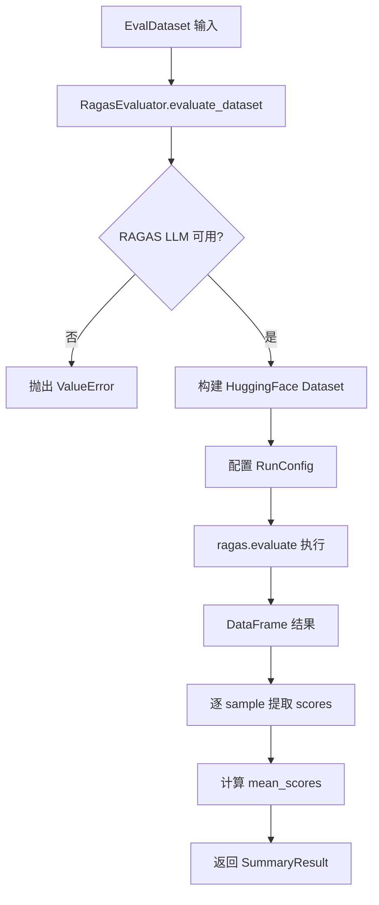
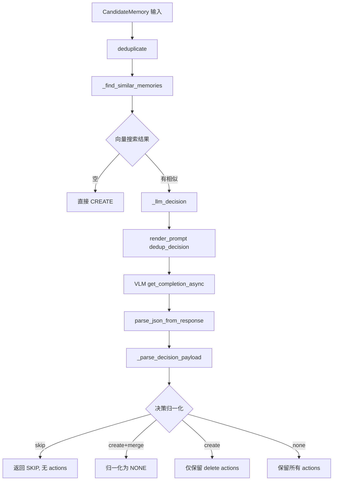

# PD-07.OV OpenViking — RAGAS 评估框架与 LLM 驱动记忆去重

> 文档编号：PD-07.OV
> 来源：OpenViking `openviking/eval/ragas/`, `openviking/session/memory_deduplicator.py`
> GitHub：https://github.com/volcengine/OpenViking.git
> 问题域：PD-07 质量检查 Quality Assurance
> 状态：可复用方案

---

## 第 1 章 问题与动机

### 1.1 核心问题

RAG 系统的质量保障面临两个正交维度的挑战：

1. **检索质量评估**：检索到的上下文是否与问题相关？生成的回答是否忠实于上下文？如何量化这些指标并持续追踪？
2. **记忆库质量维护**：长期记忆系统中不可避免地产生重复、矛盾、过时的记忆条目。如何在新记忆写入时自动判断去重决策，避免记忆库膨胀和信息冲突？

传统做法要么依赖人工抽检（不可扩展），要么用简单的字符串匹配去重（无法理解语义）。OpenViking 的方案是：用标准化评估框架（RAGAS）解决检索质量问题，用 LLM 驱动的语义判断解决记忆去重问题。

### 1.2 OpenViking 的解法概述

1. **RAGAS 四维评估体系**：集成 RAGAS 框架，默认使用 Faithfulness、AnswerRelevancy、ContextPrecision、ContextRecall 四个指标，覆盖生成忠实度和检索精度两个维度（`openviking/eval/ragas/__init__.py:222-227`）
2. **IO 录制-回放评估**：IORecorder 记录所有 FS 和 VikingDB 操作到 JSONL 文件，IOPlayback 可在不同后端重放并对比延迟和正确性（`openviking/eval/recorder/recorder.py:25-30`）
3. **LLM 驱动的记忆去重**：MemoryDeduplicator 先用向量相似度预过滤，再用 LLM 做 skip/create/none 三级决策，支持对已有记忆的 merge/delete 细粒度操作（`openviking/session/memory_deduplicator.py:62-115`）
4. **结构化 Prompt 约束**：去重决策 Prompt 包含硬约束规则（如 skip 不能携带 actions、create+merge 自动归一化为 none），防止 LLM 输出不一致（`openviking/prompts/templates/compression/dedup_decision.yaml:82-88`）
5. **评估数据集自动生成**：DatasetGenerator 可从 VikingFS 内容自动生成 QA 对，用于持续评估（`openviking/eval/ragas/generator.py:77-139`）

### 1.3 设计思想

| 设计原则 | 具体实现 | 理由 | 替代方案 |
|----------|----------|------|----------|
| 向量预过滤 + LLM 精判 | 先 VikingDB 向量搜索 top-5，再 LLM 判断 | 纯 LLM 判断成本高，纯向量匹配语义不够 | 纯向量阈值去重、纯 LLM 全量比对 |
| 三级决策枚举 | skip/create/none 三种候选决策 + merge/delete 两种已有记忆操作 | 覆盖所有去重场景，避免二元判断的信息丢失 | 简单的 duplicate/unique 二分类 |
| 非破坏性默认 | LLM 不可用时默认 CREATE，冲突 actions 直接丢弃 | 宁可多存也不误删，保护用户数据 | 默认 SKIP（可能丢失新信息） |
| 标准化评估框架 | 直接集成 RAGAS 而非自建评估 | 学术界认可的指标体系，可与论文对比 | 自建评分 Prompt |
| 录制-回放分离 | IORecorder 只记录不干预，IOPlayback 独立回放 | 生产环境零开销，评估环境可重复 | 在线实时评估（影响性能） |

---

## 第 2 章 源码实现分析

### 2.1 架构概览

OpenViking 的质量保障体系分为两个独立子系统：

```
┌─────────────────────────────────────────────────────────────┐
│                    Quality Assurance Layer                    │
├──────────────────────────┬──────────────────────────────────┤
│   RAG 评估子系统          │   记忆去重子系统                  │
│                          │                                  │
│  ┌──────────────┐        │  ┌──────────────────┐            │
│  │ RAGEvaluator │        │  │ MemoryExtractor  │            │
│  │  (RAGAS 4维) │        │  │  (6类记忆提取)    │            │
│  └──────┬───────┘        │  └────────┬─────────┘            │
│         │                │           │                      │
│  ┌──────▼───────┐        │  ┌────────▼─────────┐            │
│  │ IORecorder   │        │  │MemoryDeduplicator│            │
│  │ (JSONL录制)  │        │  │ (向量+LLM判断)   │            │
│  └──────┬───────┘        │  └────────┬─────────┘            │
│         │                │           │                      │
│  ┌──────▼───────┐        │  ┌────────▼─────────┐            │
│  │ IOPlayback   │        │  │ dedup_decision    │            │
│  │ (回放对比)   │        │  │ (Prompt模板)      │            │
│  └──────────────┘        │  └──────────────────┘            │
├──────────────────────────┴──────────────────────────────────┤
│  BaseEvaluator → EvalSample/EvalResult/SummaryResult        │
│  DatasetGenerator → 自动生成 QA 对                           │
└─────────────────────────────────────────────────────────────┘
```

### 2.2 核心实现

#### 2.2.1 RAGAS 四维评估器



对应源码 `openviking/eval/ragas/__init__.py:253-341`：

```python
class RagasEvaluator(BaseEvaluator):
    def __init__(self, metrics=None, llm=None, embeddings=None, config=None, **kwargs):
        self.metrics = metrics or [
            Faithfulness(),
            AnswerRelevancy(),
            ContextPrecision(),
            ContextRecall(),
        ]
        self.llm = llm or _create_ragas_llm_from_config()
        if config is None:
            config = RagasConfig.from_env()
        self.max_workers = kwargs.get("max_workers") or config.max_workers
        self.batch_size = kwargs.get("batch_size") or config.batch_size

    async def evaluate_dataset(self, dataset: EvalDataset) -> SummaryResult:
        data = {
            "question": [s.query for s in dataset.samples],
            "contexts": [s.context for s in dataset.samples],
            "answer": [s.response or "" for s in dataset.samples],
            "ground_truth": [s.ground_truth or "" for s in dataset.samples],
        }
        ragas_dataset = Dataset.from_dict(data)
        run_config = RunConfig(
            timeout=self.timeout, max_retries=self.max_retries,
            max_workers=self.max_workers,
        )
        result = await loop.run_in_executor(
            None, lambda: evaluate(ragas_dataset, metrics=self.metrics,
                                   llm=self.llm, run_config=run_config,
                                   batch_size=self.batch_size)
        )
        # ... 解析 DataFrame 为 SummaryResult
```

关键设计点：
- **LLM 配置优先级**：环境变量 `RAGAS_LLM_*` > OpenViking VLM 配置文件（`__init__.py:101-159`）
- **并发控制**：通过 `RagasConfig` 的 `max_workers=16`、`batch_size=10` 控制评估并发度（`__init__.py:38-73`）
- **异步桥接**：RAGAS 本身是同步的，通过 `run_in_executor` 桥接到 asyncio 事件循环（`__init__.py:294-307`）

#### 2.2.2 MemoryDeduplicator — 向量预过滤 + LLM 精判



对应源码 `openviking/session/memory_deduplicator.py:88-115`：

```python
class MemoryDeduplicator:
    SIMILARITY_THRESHOLD = 0.0
    MAX_PROMPT_SIMILAR_MEMORIES = 5

    async def deduplicate(self, candidate: CandidateMemory) -> DedupResult:
        # Step 1: 向量预过滤
        similar_memories = await self._find_similar_memories(candidate)
        if not similar_memories:
            return DedupResult(
                decision=DedupDecision.CREATE,
                candidate=candidate, similar_memories=[], actions=[],
                reason="No similar memories found",
            )
        # Step 2: LLM 精判
        decision, reason, actions = await self._llm_decision(
            candidate, similar_memories
        )
        return DedupResult(
            decision=decision, candidate=candidate,
            similar_memories=similar_memories,
            actions=None if decision == DedupDecision.SKIP else actions,
            reason=reason,
        )
```

### 2.3 实现细节

#### 决策归一化规则（`memory_deduplicator.py:256-359`）

`_parse_decision_payload` 方法实现了一套严格的决策归一化逻辑，防止 LLM 输出不一致：

1. **向后兼容**：旧版 `"merge"` 决策映射为 `NONE`（L271-272）
2. **冲突检测**：同一 URI 出现矛盾 actions 时，两个都丢弃（L325-329）
3. **决策-操作一致性**：
   - `SKIP` 强制清空 actions（L344-345）
   - `CREATE` + 任何 merge → 归一化为 `NONE`（L350-353）
   - `CREATE` 只允许 delete actions（L356-357）
4. **URI/索引双容错**：LLM 可能返回 URI 或 1-based/0-based 索引，全部兼容（L313-320）

#### IO 录制-回放体系

IORecorder 使用线程安全的单例模式（`recorder.py:42-44`），通过 `RecordContext` 上下文管理器自动计时：

```python
# 使用方式
with IORecorder.record_context("fs", "read", {"uri": "viking://..."}) as r:
    result = fs.read(uri)
    r.set_response(result)
```

IOPlayback 支持按 io_type/operation 过滤回放，并通过 `_AGFSCallCollector` 代理模式拦截底层 AGFS 调用进行精确对比（`playback.py:128-160`）。

#### 去重 Prompt 模板设计（`dedup_decision.yaml`）

Prompt 模板 v3.3.1 包含：
- **决策指导**：明确 skip/create/none 的使用场景
- **Critical delete boundary**：部分冲突用 merge 不用 delete
- **实操清单**：4 步检查流程（同话题？→ 不同则排除 → 部分更新用 merge → 全量失效才 delete）
- **硬约束**：6 条 JSON 结构约束，temperature=0.0 确保确定性输出

---

## 第 3 章 迁移指南

### 3.1 迁移清单

**阶段 1：RAGAS 评估集成（1-2 天）**

- [ ] 安装依赖：`pip install ragas datasets`
- [ ] 定义 `EvalSample` / `EvalDataset` Pydantic 模型
- [ ] 实现 `BaseEvaluator` 抽象基类（`evaluate_sample` + `evaluate_dataset`）
- [ ] 封装 `RagasEvaluator`，配置四维指标
- [ ] 实现 LLM 配置优先级（环境变量 > 配置文件）
- [ ] 编写 JSONL 格式的测试问题集

**阶段 2：IO 录制-回放（2-3 天）**

- [ ] 实现 `IORecorder` 单例（线程安全 JSONL 写入）
- [ ] 实现 `RecordContext` 上下文管理器（自动计时）
- [ ] 在存储层关键路径插入录制点
- [ ] 实现 `IOPlayback`（按类型/操作过滤回放）
- [ ] 实现错误模式匹配（`_errors_match`）

**阶段 3：LLM 记忆去重（2-3 天）**

- [ ] 实现向量相似度预过滤（复用已有向量搜索）
- [ ] 编写去重决策 Prompt 模板（YAML 格式）
- [ ] 实现 `_parse_decision_payload` 归一化逻辑
- [ ] 实现 URI/索引双容错解析
- [ ] 实现冲突 actions 检测与丢弃

### 3.2 适配代码模板

#### 通用 RAGAS 评估器模板

```python
from abc import ABC, abstractmethod
from dataclasses import dataclass
from typing import Any, Dict, List, Optional
from pydantic import BaseModel, Field


class EvalSample(BaseModel):
    query: str
    context: List[str] = Field(default_factory=list)
    response: Optional[str] = None
    ground_truth: Optional[str] = None


class EvalResult(BaseModel):
    sample: EvalSample
    scores: Dict[str, float]


class SummaryResult(BaseModel):
    dataset_name: str
    sample_count: int
    mean_scores: Dict[str, float]
    results: List[EvalResult]


class BaseEvaluator(ABC):
    @abstractmethod
    async def evaluate_sample(self, sample: EvalSample) -> EvalResult:
        pass

    async def evaluate_dataset(self, samples: List[EvalSample]) -> SummaryResult:
        results = [await self.evaluate_sample(s) for s in samples]
        metric_sums: Dict[str, float] = {}
        for r in results:
            for m, s in r.scores.items():
                metric_sums[m] = metric_sums.get(m, 0.0) + s
        count = len(results)
        return SummaryResult(
            dataset_name="eval",
            sample_count=count,
            mean_scores={m: s / count for m, s in metric_sums.items()},
            results=results,
        )
```

#### LLM 去重决策模板

```python
from dataclasses import dataclass
from enum import Enum
from typing import Dict, List, Optional


class DedupDecision(str, Enum):
    SKIP = "skip"
    CREATE = "create"
    NONE = "none"


class MemoryAction(str, Enum):
    MERGE = "merge"
    DELETE = "delete"


@dataclass
class DedupResult:
    decision: DedupDecision
    actions: List[dict]
    reason: str = ""


def parse_dedup_payload(
    data: dict,
    similar_items: List[dict],
) -> DedupResult:
    """归一化 LLM 去重决策输出。"""
    decision_str = str(data.get("decision", "create")).lower().strip()
    decision_map = {"skip": DedupDecision.SKIP, "create": DedupDecision.CREATE,
                    "none": DedupDecision.NONE, "merge": DedupDecision.NONE}
    decision = decision_map.get(decision_str, DedupDecision.CREATE)
    reason = str(data.get("reason", ""))

    raw_actions = data.get("list", [])
    if not isinstance(raw_actions, list):
        raw_actions = []

    actions = []
    seen: Dict[str, str] = {}
    item_by_id = {item["id"]: item for item in similar_items}

    for item in raw_actions:
        if not isinstance(item, dict):
            continue
        action_str = str(item.get("decide", "")).lower()
        if action_str not in ("merge", "delete"):
            continue
        item_id = item.get("id") or item.get("uri")
        if item_id not in item_by_id:
            continue
        prev = seen.get(item_id)
        if prev and prev != action_str:
            actions = [a for a in actions if a.get("id") != item_id]
            seen.pop(item_id, None)
            continue
        if prev == action_str:
            continue
        seen[item_id] = action_str
        actions.append({"id": item_id, "action": action_str, "reason": item.get("reason", "")})

    # 归一化规则
    if decision == DedupDecision.SKIP:
        return DedupResult(decision=decision, actions=[], reason=reason)
    has_merge = any(a["action"] == "merge" for a in actions)
    if decision == DedupDecision.CREATE and has_merge:
        decision = DedupDecision.NONE
    if decision == DedupDecision.CREATE:
        actions = [a for a in actions if a["action"] == "delete"]
    return DedupResult(decision=decision, actions=actions, reason=reason)
```

### 3.3 适用场景

| 场景 | 适用度 | 说明 |
|------|--------|------|
| RAG 系统检索质量评估 | ⭐⭐⭐ | RAGAS 四维指标直接可用 |
| 长期记忆系统去重 | ⭐⭐⭐ | 向量+LLM 双层判断，语义理解准确 |
| 存储层性能回归测试 | ⭐⭐⭐ | IO 录制-回放可精确对比不同后端 |
| 实时在线质量监控 | ⭐⭐ | 需要额外封装流式评估逻辑 |
| 非 RAG 的生成质量评估 | ⭐ | RAGAS 指标专为 RAG 设计，通用生成需其他框架 |

---

## 第 4 章 测试用例

```python
import pytest
from unittest.mock import AsyncMock, MagicMock, patch
from dataclasses import dataclass
from enum import Enum
from typing import List, Optional


# === 去重决策归一化测试 ===

class DedupDecision(str, Enum):
    SKIP = "skip"
    CREATE = "create"
    NONE = "none"


class MemoryActionDecision(str, Enum):
    MERGE = "merge"
    DELETE = "delete"


class TestDedupDecisionParsing:
    """测试 _parse_decision_payload 的归一化逻辑。"""

    def test_skip_clears_actions(self):
        """skip 决策应清空所有 actions。"""
        data = {"decision": "skip", "reason": "duplicate", "list": [
            {"uri": "mem://1", "decide": "merge", "reason": "same"}
        ]}
        similar = [MagicMock(uri="mem://1")]
        # skip 应返回空 actions
        decision_str = data["decision"].lower()
        assert decision_str == "skip"

    def test_create_plus_merge_normalizes_to_none(self):
        """create + merge action 应归一化为 none。"""
        data = {"decision": "create", "list": [
            {"uri": "mem://1", "decide": "merge", "reason": "update"}
        ]}
        # create + merge → none
        has_merge = any(item.get("decide") == "merge" for item in data.get("list", []))
        assert has_merge
        # 归一化后 decision 应为 none

    def test_create_only_allows_delete_actions(self):
        """create 决策只允许 delete actions。"""
        data = {"decision": "create", "list": [
            {"uri": "mem://1", "decide": "delete", "reason": "obsolete"},
            {"uri": "mem://2", "decide": "merge", "reason": "update"},
        ]}
        actions = [item for item in data["list"] if item["decide"] == "delete"]
        assert len(actions) == 1
        assert actions[0]["uri"] == "mem://1"

    def test_conflicting_actions_dropped(self):
        """同一 URI 的矛盾 actions 应全部丢弃。"""
        data = {"decision": "none", "list": [
            {"uri": "mem://1", "decide": "merge", "reason": "a"},
            {"uri": "mem://1", "decide": "delete", "reason": "b"},
        ]}
        seen = {}
        kept = []
        for item in data["list"]:
            uri = item["uri"]
            action = item["decide"]
            if uri in seen and seen[uri] != action:
                kept = [a for a in kept if a["uri"] != uri]
                continue
            seen[uri] = action
            kept.append(item)
        assert len(kept) == 0  # 矛盾的都被丢弃

    def test_llm_unavailable_defaults_to_create(self):
        """LLM 不可用时应默认 CREATE。"""
        # MemoryDeduplicator._llm_decision 在 vlm 不可用时返回 CREATE
        decision = DedupDecision.CREATE
        reason = "LLM not available, defaulting to CREATE"
        assert decision == DedupDecision.CREATE
        assert "not available" in reason

    def test_legacy_merge_maps_to_none(self):
        """旧版 merge 决策应映射为 none。"""
        decision_map = {"skip": "skip", "create": "create",
                        "none": "none", "merge": "none"}
        assert decision_map["merge"] == "none"

    def test_index_based_fallback(self):
        """LLM 返回索引而非 URI 时应正确解析。"""
        similar = [MagicMock(uri="mem://a"), MagicMock(uri="mem://b")]
        item = {"index": 1, "decide": "merge", "reason": "same"}
        # 1-based index → similar[0]
        index = item["index"]
        if 1 <= index <= len(similar):
            memory = similar[index - 1]
        assert memory.uri == "mem://a"


# === RAGAS 评估器测试 ===

class TestRagasEvaluator:
    """测试 RAGAS 评估流程。"""

    def test_eval_sample_model(self):
        """EvalSample Pydantic 模型验证。"""
        from pydantic import BaseModel, Field
        class EvalSample(BaseModel):
            query: str
            context: List[str] = []
            response: Optional[str] = None
            ground_truth: Optional[str] = None

        sample = EvalSample(query="What is RAG?", context=["RAG is..."])
        assert sample.query == "What is RAG?"
        assert len(sample.context) == 1

    def test_summary_aggregation(self):
        """SummaryResult 应正确聚合 mean_scores。"""
        scores_list = [
            {"faithfulness": 0.8, "relevancy": 0.9},
            {"faithfulness": 0.6, "relevancy": 0.7},
        ]
        metric_sums = {}
        for scores in scores_list:
            for m, s in scores.items():
                metric_sums[m] = metric_sums.get(m, 0.0) + s
        count = len(scores_list)
        mean = {m: s / count for m, s in metric_sums.items()}
        assert abs(mean["faithfulness"] - 0.7) < 0.01
        assert abs(mean["relevancy"] - 0.8) < 0.01

    def test_llm_config_priority(self):
        """LLM 配置应优先使用环境变量。"""
        import os
        os.environ["RAGAS_LLM_API_KEY"] = "test-key"
        env_config = {
            "api_key": os.environ.get("RAGAS_LLM_API_KEY"),
            "api_base": os.environ.get("RAGAS_LLM_API_BASE"),
            "model": os.environ.get("RAGAS_LLM_MODEL"),
        }
        assert env_config["api_key"] == "test-key"
        del os.environ["RAGAS_LLM_API_KEY"]
```

---

## 第 5 章 跨域关联

| 关联域 | 关系类型 | 说明 |
|--------|----------|------|
| PD-01 上下文管理 | 协同 | 记忆去重直接影响上下文窗口利用率——去重后的记忆库更精简，注入上下文时占用更少 token |
| PD-06 记忆持久化 | 依赖 | MemoryDeduplicator 依赖 MemoryExtractor 的 6 类记忆分类体系（profile/preferences/entities/events/cases/patterns），去重是持久化写入前的质量门控 |
| PD-08 搜索与检索 | 协同 | RAGAS 评估的 ContextPrecision/ContextRecall 直接衡量检索质量；去重的向量预过滤复用了检索子系统的 VikingDB 向量搜索能力 |
| PD-11 可观测性 | 协同 | IORecorder 录制的 JSONL 文件同时服务于可观测性（操作统计、延迟分析）和质量评估（回放对比） |
| PD-03 容错与重试 | 协同 | LLM 去重决策失败时默认 CREATE（非破坏性降级），RAGAS 评估的 RunConfig 包含 max_retries=3 |

---

## 第 6 章 来源文件索引

| 文件 | 行范围 | 关键实现 |
|------|--------|----------|
| `openviking/eval/ragas/__init__.py` | L1-361 | RagasEvaluator 主类、RagasConfig、LLM 配置优先级 |
| `openviking/eval/ragas/base.py` | L1-69 | BaseEvaluator 抽象基类、_summarize 聚合逻辑 |
| `openviking/eval/ragas/types.py` | L1-48 | EvalSample/EvalResult/EvalDataset/SummaryResult Pydantic 模型 |
| `openviking/eval/ragas/pipeline.py` | L1-201 | RAGQueryPipeline：文档添加 + 检索 + LLM 生成 |
| `openviking/eval/ragas/rag_eval.py` | L1-486 | RAGEvaluator CLI：JSONL 问题加载、评估执行、报告输出 |
| `openviking/eval/ragas/generator.py` | L1-139 | DatasetGenerator：从 VikingFS 内容自动生成 QA 对 |
| `openviking/eval/ragas/playback.py` | L1-648 | IOPlayback：录制回放、AGFS 调用对比、错误模式匹配 |
| `openviking/eval/recorder/recorder.py` | L1-374 | IORecorder 单例、RecordContext 上下文管理器 |
| `openviking/session/memory_deduplicator.py` | L1-395 | MemoryDeduplicator：向量预过滤 + LLM 决策 + 归一化 |
| `openviking/session/memory_extractor.py` | L1-415 | MemoryExtractor：6 类记忆提取、profile 合并 |
| `openviking/prompts/templates/compression/dedup_decision.yaml` | L1-105 | 去重决策 Prompt 模板 v3.3.1 |

---

## 第 7 章 横向对比维度

```json comparison_data
{
  "project": "OpenViking",
  "dimensions": {
    "检查方式": "RAGAS 四维指标 + LLM 语义去重双轨并行",
    "评估维度": "Faithfulness/AnswerRelevancy/ContextPrecision/ContextRecall",
    "评估粒度": "单 sample 级评分 + dataset 级 mean_scores 聚合",
    "迭代机制": "无迭代循环，单次评估出分",
    "反馈机制": "EvalResult.feedback 字段 + 控制台报告 + JSON 导出",
    "自动修复": "无自动修复，去重决策直接执行 merge/delete",
    "覆盖范围": "RAG 检索质量 + 记忆库去重 + IO 层回放验证",
    "并发策略": "RAGAS max_workers=16 + batch_size=10 并行评估",
    "降级路径": "LLM 不可用时去重默认 CREATE，RAGAS 缺包时 ImportError",
    "配置驱动": "RagasConfig 环境变量 + dedup_decision.yaml Prompt 模板",
    "基准集成": "直接集成 RAGAS 学术框架，指标可与论文对比",
    "评估模型隔离": "RAGAS_LLM_* 独立环境变量与工作 LLM 分离",
    "记忆驱动改进": "去重决策反哺记忆库质量，merge 保留非冲突信息",
    "录制回放验证": "IORecorder JSONL 录制 + IOPlayback 跨后端回放对比",
    "决策归一化": "6 条硬约束规则防止 LLM 输出不一致"
  }
}
```

### 域元数据补充

```json domain_metadata
{
  "solution_summary": "OpenViking 用 RAGAS 四维指标评估 RAG 检索质量，MemoryDeduplicator 通过向量预过滤+LLM 三级决策（skip/create/none）实现语义级记忆去重，IORecorder 录制-回放验证存储层正确性",
  "description": "质量保障不仅覆盖生成输出，还需覆盖记忆写入和存储层操作的正确性验证",
  "sub_problems": [
    "记忆语义去重：新记忆与已有记忆的语义重复/矛盾/互补判断",
    "去重决策归一化：LLM 输出的决策-操作组合可能不一致，需要规则修正",
    "IO 录制回放：存储层操作的录制与跨后端回放对比验证",
    "向量预过滤阈值：相似度阈值过高漏检、过低增加 LLM 调用成本的平衡"
  ],
  "best_practices": [
    "向量预过滤+LLM精判两阶段：先低成本筛选候选再高精度判断，平衡成本与准确度",
    "非破坏性默认策略：LLM 失败或冲突时默认保留数据（CREATE），宁可多存不误删",
    "决策归一化硬规则：用代码规则修正 LLM 输出的逻辑不一致，不完全信任 LLM 结构化输出",
    "评估 LLM 配置独立：RAGAS 评估用独立的 API key/model 配置，避免与工作 LLM 互相影响"
  ]
}
```
