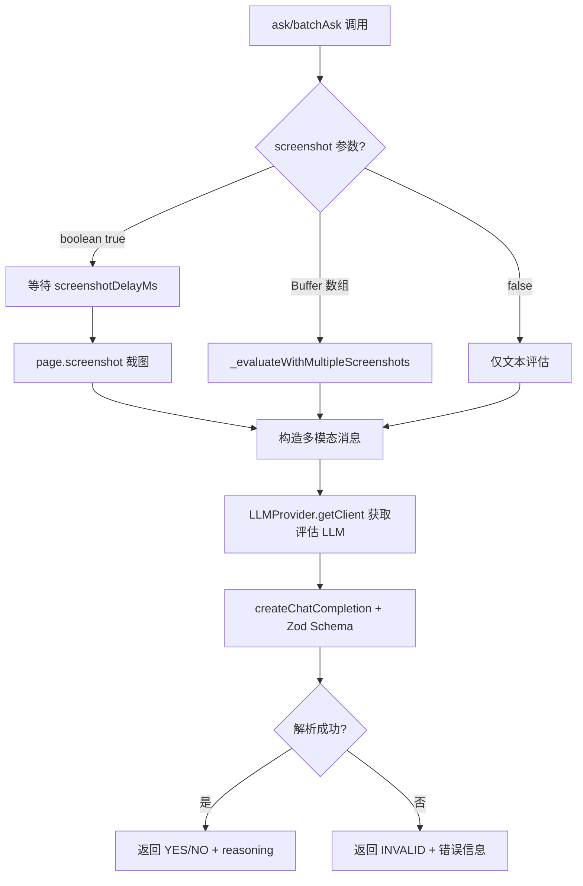
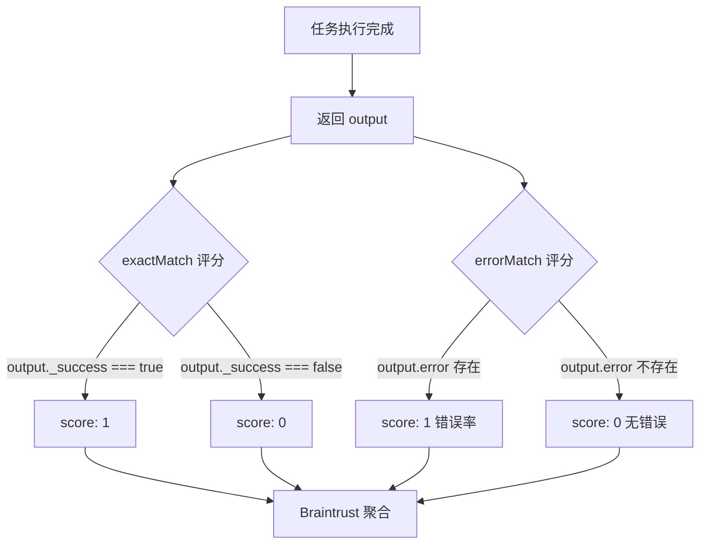

# PD-07.09 Stagehand — V3Evaluator 视觉评估与 Braintrust 评分框架

> 文档编号：PD-07.09
> 来源：Stagehand `packages/core/lib/v3Evaluator.ts` `packages/evals/scoring.ts`
> GitHub：https://github.com/browserbase/stagehand.git
> 问题域：PD-07 质量检查 Quality Assurance
> 状态：可复用方案

---

## 第 1 章 问题与动机

### 1.1 核心问题

浏览器自动化 Agent 的操作结果验证是一个独特的质量检查难题：Agent 在网页上执行点击、填写、导航等操作后，如何判断操作是否成功？传统的断言式检查（URL 匹配、DOM 元素存在性）只能覆盖简单场景，对于复杂的视觉状态变化（如购物车图标更新、页面布局变化、动态内容加载）无能为力。

Stagehand 面临的具体挑战：
1. **视觉状态验证**：Agent 操作后的页面状态需要"看"才能判断，不是简单的字符串比较
2. **多模态输入**：评估需要同时理解截图（视觉）和文本（Agent 推理过程）
3. **规模化评估**：130+ 个评估任务 × 多个 LLM 模型 × 多次试验，需要自动化评分
4. **跨模型一致性**：同一任务在不同 LLM（GPT-4o、Claude、Gemini）上的表现需要可比较
5. **评估者独立性**：评估 LLM 必须与被评估的 Agent LLM 分离，避免自评偏差

### 1.2 Stagehand 的解法概述

Stagehand 构建了双层质量检查体系：

1. **V3Evaluator（运行时视觉评估）**：独立 LLM（默认 Gemini 2.5 Flash）对浏览器截图执行结构化 YES/NO 判定，支持单问题、批量问题、多截图序列三种模式（`packages/core/lib/v3Evaluator.ts:28-296`）
2. **Braintrust 评分框架（离线批量评估）**：基于 Braintrust SDK 的评估编排器，支持 130+ 任务 × 多模型矩阵、exactMatch/errorMatch 双评分函数、按类别/模型聚合统计（`packages/evals/index.eval.ts:293-451`）
3. **任务模块化**：每个评估任务是独立的 `EvalFunction`，返回 `{ _success: boolean }` 标准结构（`packages/evals/tasks/*.ts`）
4. **外部基准集成**：集成 GAIA、WebVoyager、Mind2Web、WebTailBench 四大学术基准（`packages/evals/suites/*.ts`）
5. **多维度聚合**：按类别（observe/act/extract/agent）和模型两个维度聚合成功率（`packages/evals/summary.ts:8-70`）

### 1.3 设计思想

| 设计原则 | 具体实现 | 理由 | 替代方案 |
|----------|----------|------|----------|
| 评估者与被评估者分离 | V3Evaluator 默认用 Gemini，Agent 可用任意模型 | 避免 LLM 自评偏差，独立视角更客观 | 同模型自评（效果差） |
| 视觉优先的验证 | 截图 + LLM 视觉理解代替 DOM 断言 | 浏览器状态的真实表现是视觉的 | CSS 选择器断言（脆弱） |
| 结构化输出保证 | Zod schema 强制 YES/NO + reasoning | 消除 LLM 输出格式不确定性 | 正则解析自由文本（不可靠） |
| 任务即函数 | 每个 eval 是独立的 async 函数 | 易于添加、隔离失败、并行执行 | 配置驱动的声明式任务（灵活性差） |
| 矩阵式覆盖 | task × model × trial 三维组合 | 全面评估跨模型一致性 | 单模型单次测试（覆盖不足） |

---

## 第 2 章 源码实现分析

### 2.1 架构概览

Stagehand 的质量检查系统分为两个独立但互补的层：

```
┌─────────────────────────────────────────────────────────────────┐
│                    Braintrust 评估编排层                          │
│  index.eval.ts → Eval(project, {data, task, scores})            │
│       ↓                                                         │
│  ┌──────────┐  ┌──────────┐  ┌──────────┐  ┌──────────┐       │
│  │ Task A   │  │ Task B   │  │ Task C   │  │ Task N   │       │
│  │ (act)    │  │(extract) │  │ (agent)  │  │(observe) │       │
│  └────┬─────┘  └────┬─────┘  └────┬─────┘  └────┬─────┘       │
│       │              │              │              │             │
│       └──────────────┴──────┬───────┴──────────────┘             │
│                             ↓                                    │
│  ┌─────────────────────────────────────────────┐                │
│  │  Scoring: exactMatch + errorMatch           │                │
│  │  → { name: "Exact match", score: 0|1 }      │                │
│  └─────────────────────────────────────────────┘                │
│                             ↓                                    │
│  ┌─────────────────────────────────────────────┐                │
│  │  Summary: per-category + per-model rates     │                │
│  │  → eval-summary.json                         │                │
│  └─────────────────────────────────────────────┘                │
└─────────────────────────────────────────────────────────────────┘

┌─────────────────────────────────────────────────────────────────┐
│                    V3Evaluator 运行时评估层                       │
│  v3Evaluator.ts → ask() / batchAsk()                            │
│       ↓                                                         │
│  ┌──────────────────────────────────────────┐                   │
│  │  截图捕获 → Base64 编码 → LLM 视觉理解    │                   │
│  │  + 文本问题 + Agent 推理过程               │                   │
│  └──────────────────────────────────────────┘                   │
│       ↓                                                         │
│  ┌──────────────────────────────────────────┐                   │
│  │  Zod Schema: { evaluation: YES|NO,       │                   │
│  │               reasoning: string }         │                   │
│  └──────────────────────────────────────────┘                   │
└─────────────────────────────────────────────────────────────────┘
```

### 2.2 核心实现

#### 2.2.1 V3Evaluator：视觉评估引擎

V3Evaluator 是 Stagehand 质量检查的核心创新——用独立 LLM 对浏览器截图做结构化评估。



对应源码 `packages/core/lib/v3Evaluator.ts:28-47`（构造函数与默认模型）：

```typescript
export class V3Evaluator {
  private v3: V3;
  private modelName: AvailableModel;
  private modelClientOptions: ClientOptions | { apiKey: string };
  private silentLogger: (message: LogLine) => void = () => {};

  constructor(
    v3: V3,
    modelName?: AvailableModel,
    modelClientOptions?: ClientOptions,
  ) {
    this.v3 = v3;
    this.modelName = modelName || ("google/gemini-2.5-flash" as AvailableModel);
    this.modelClientOptions = modelClientOptions || {
      apiKey:
        process.env.GEMINI_API_KEY ||
        process.env.GOOGLE_GENERATIVE_AI_API_KEY ||
        "",
    };
  }
```

关键设计：默认评估模型是 `google/gemini-2.5-flash`，与被评估的 Agent 模型（可能是 GPT-4o、Claude 等）完全独立。这实现了 Generator-Critic 分离原则。


对应源码 `packages/core/lib/v3Evaluator.ts:55-141`（单问题评估核心逻辑）：

```typescript
async ask(options: EvaluateOptions): Promise<EvaluationResult> {
    const {
      question, answer,
      screenshot = true,
      systemPrompt, screenshotDelayMs = 250,
      agentReasoning,
    } = options;
    if (!question)
      throw new StagehandInvalidArgumentError("Question cannot be an empty string");
    if (!answer && !screenshot)
      throw new StagehandInvalidArgumentError(
        "Either answer (text) or screenshot must be provided"
      );

    // 多截图走专用路径
    if (Array.isArray(screenshot)) {
      return this._evaluateWithMultipleScreenshots({
        question, screenshots: screenshot, systemPrompt, agentReasoning,
      });
    }

    // 截图延迟 + 捕获
    await new Promise((r) => setTimeout(r, screenshotDelayMs));
    let imageBuffer: Buffer | undefined;
    if (screenshot) {
      const page = await this.v3.context.awaitActivePage();
      imageBuffer = await page.screenshot({ fullPage: false });
    }

    const llmClient = this.getClient();
    const response = await llmClient.createChatCompletion<LLMParsedResponse<LLMResponse>>({
      logger: this.silentLogger,
      options: {
        messages: [
          { role: "system", content: systemPrompt || defaultSystemPrompt },
          { role: "user", content: [
            { type: "text", text: agentReasoning
              ? `Question: ${question}\n\nAgent's reasoning:\n${agentReasoning}`
              : question },
            ...(screenshot && imageBuffer ? [{
              type: "image_url" as const,
              image_url: { url: `data:image/jpeg;base64,${imageBuffer.toString("base64")}` },
            }] : []),
          ]},
        ],
        response_model: { name: "EvaluationResult", schema: EvaluationSchema },
      },
    });
    // ...解析返回 YES/NO/INVALID
}
```

#### 2.2.2 Braintrust 评分函数



对应源码 `packages/evals/scoring.ts:48-76`（exactMatch 评分函数）：

```typescript
export function exactMatch(
  args: EvalArgs<EvalInput, boolean | { _success: boolean }, unknown>,
): EvalResult {
  console.log(`Task "${args.input.name}" returned: ${formatTaskOutput(args.output)}`);
  const expected = args.expected ?? true;
  if (expected === true) {
    return {
      name: "Exact match",
      score:
        typeof args.output === "boolean"
          ? args.output ? 1 : 0
          : args.output._success ? 1 : 0,
    };
  }
  return {
    name: "Exact match",
    score: args.output === expected ? 1 : 0,
  };
}
```

对应源码 `packages/evals/scoring.ts:83-101`（errorMatch 评分函数）：

```typescript
export function errorMatch(
  args: EvalArgs<EvalInput, boolean | { _success: boolean; error?: unknown }, unknown>,
): EvalResult {
  return {
    name: "Error rate",
    score:
      typeof args.output === "object" && args.output.error !== undefined ? 1 : 0,
  };
}
```

### 2.3 实现细节

#### 评估编排的三维矩阵

Braintrust `Eval()` 调用构建了 task × model × trial 的三维评估矩阵（`packages/evals/index.eval.ts:293-451`）：

- **task 维度**：130+ 个任务，分为 observe/act/extract/combination/agent/external_agent_benchmarks 等 11 个类别
- **model 维度**：默认 3 个模型（Gemini 2.0 Flash、GPT-4.1-mini、Claude Haiku 4.5），Agent 任务额外支持 CUA 模型
- **trial 维度**：每个 task×model 组合默认执行 3 次（`TRIAL_COUNT=3`），取多数结果

并发控制通过 `maxConcurrency` 参数实现（默认 3），避免 API 限流。

#### 多截图序列评估

V3Evaluator 支持传入 `Buffer[]` 截图数组，用于评估多步骤任务的完整执行轨迹（`packages/core/lib/v3Evaluator.ts:224-295`）。系统提示词要求 LLM "分析所有截图以理解完整旅程"，而不仅仅看最后一张。

#### 结果聚合与报告

`summary.ts` 按两个维度聚合（`packages/evals/summary.ts:28-57`）：
- **按类别**：每个类别（observe/act/extract 等）的成功率百分比
- **按模型**：每个模型的整体成功率百分比

输出为 `eval-summary.json`，包含 `{ experimentName, passed[], failed[], categories{}, models{} }`。

#### 任务模块化模式

每个评估任务遵循统一的 `EvalFunction` 签名（`packages/evals/types/evals.ts:19-27`）：

```typescript
// 任务模式示例 packages/evals/tasks/amazon_add_to_cart.ts:3-43
export const amazon_add_to_cart: EvalFunction = async ({ logger, debugUrl, sessionUrl, v3 }) => {
  try {
    const page = v3.context.pages()[0];
    await page.goto("https://browserbase.github.io/stagehand-eval-sites/sites/amazon/");
    await v3.act("click the 'Add to Cart' button");
    await v3.act("click the 'Proceed to checkout' button");
    const currentUrl = page.url();
    return {
      _success: currentUrl === expectedUrl,
      currentUrl, debugUrl, sessionUrl, logs: logger.getLogs(),
    };
  } catch (error) {
    return { _success: false, error, debugUrl, sessionUrl, logs: logger.getLogs() };
  } finally {
    await v3.close();
  }
};
```


---

## 第 3 章 迁移指南

### 3.1 迁移清单

**阶段 1：基础评估能力（V3Evaluator 模式）**

- [ ] 安装依赖：`zod`（结构化输出）、LLM SDK（OpenAI/Anthropic/Google）
- [ ] 实现 `Evaluator` 类：接收截图/文本 → LLM 结构化判定 → YES/NO + reasoning
- [ ] 定义 Zod schema：`{ evaluation: z.enum(["YES","NO"]), reasoning: z.string() }`
- [ ] 实现 `ask()` 单问题评估和 `batchAsk()` 批量评估
- [ ] 配置独立的评估模型（与 Agent 模型分离）

**阶段 2：评估框架搭建（Braintrust 模式）**

- [ ] 定义 `EvalFunction` 类型签名：`async (ctx) => { _success: boolean, ... }`
- [ ] 实现评分函数：`exactMatch`（成功/失败）+ `errorMatch`（错误检测）
- [ ] 搭建任务注册表：JSON 配置文件定义任务名 → 类别映射
- [ ] 实现结果聚合：按类别和模型两个维度统计成功率
- [ ] 集成 CI：评估结果写入 JSON，CI 可读取判断是否回归

**阶段 3：高级能力**

- [ ] 多截图序列评估：传入截图数组，评估多步骤任务轨迹
- [ ] Agent 推理注入：将 Agent 的思考过程作为评估上下文
- [ ] 外部基准集成：接入 GAIA/WebVoyager 等标准数据集
- [ ] 多模型矩阵：task × model × trial 三维评估

### 3.2 适配代码模板

以下是一个可直接运行的简化版 Evaluator，复用 Stagehand 的核心设计：

```typescript
import { z } from "zod";
import OpenAI from "openai";

// 1. 定义评估结果 Schema
const EvaluationSchema = z.object({
  evaluation: z.enum(["YES", "NO"]),
  reasoning: z.string(),
});

type EvaluationResult = z.infer<typeof EvaluationSchema> | { evaluation: "INVALID"; reasoning: string };

// 2. Evaluator 类（复用 Stagehand 的 Generator-Critic 分离模式）
class VisualEvaluator {
  private client: OpenAI;
  private model: string;

  constructor(options?: { model?: string; apiKey?: string }) {
    this.model = options?.model || "gpt-4o-mini";
    this.client = new OpenAI({ apiKey: options?.apiKey || process.env.OPENAI_API_KEY });
  }

  async ask(question: string, screenshot?: Buffer): Promise<EvaluationResult> {
    if (!question) throw new Error("Question cannot be empty");
    if (!screenshot) throw new Error("Screenshot or text answer required");

    const messages: OpenAI.ChatCompletionMessageParam[] = [
      {
        role: "system",
        content: `You are an expert evaluator. Return YES or NO with reasoning. Today: ${new Date().toLocaleDateString()}`,
      },
      {
        role: "user",
        content: [
          { type: "text", text: question },
          {
            type: "image_url",
            image_url: { url: `data:image/jpeg;base64,${screenshot.toString("base64")}` },
          },
        ],
      },
    ];

    try {
      const response = await this.client.chat.completions.create({
        model: this.model,
        messages,
        response_format: { type: "json_object" },
      });
      const parsed = EvaluationSchema.parse(
        JSON.parse(response.choices[0].message.content || "{}")
      );
      return parsed;
    } catch (error) {
      return { evaluation: "INVALID", reasoning: `Parse failed: ${error}` };
    }
  }

  async batchAsk(
    questions: Array<{ question: string; answer?: string }>,
    screenshot?: Buffer
  ): Promise<EvaluationResult[]> {
    const formatted = questions
      .map((q, i) => `${i + 1}. ${q.question}${q.answer ? `\n   Answer: ${q.answer}` : ""}`)
      .join("\n\n");

    const messages: OpenAI.ChatCompletionMessageParam[] = [
      { role: "system", content: "Evaluate each question. Return a JSON array of {evaluation, reasoning}." },
      {
        role: "user",
        content: [
          { type: "text", text: formatted },
          ...(screenshot ? [{
            type: "image_url" as const,
            image_url: { url: `data:image/jpeg;base64,${screenshot.toString("base64")}` },
          }] : []),
        ],
      },
    ];

    try {
      const response = await this.client.chat.completions.create({
        model: this.model, messages,
        response_format: { type: "json_object" },
      });
      const results = z.array(EvaluationSchema).parse(
        JSON.parse(response.choices[0].message.content || "[]")
      );
      return results;
    } catch (error) {
      return questions.map(() => ({ evaluation: "INVALID" as const, reasoning: `${error}` }));
    }
  }
}

// 3. 评分函数（复用 Stagehand 的 exactMatch 模式）
type EvalResult = { name: string; score: number };

function exactMatch(output: { _success: boolean }): EvalResult {
  return { name: "Exact match", score: output._success ? 1 : 0 };
}

function errorMatch(output: { _success: boolean; error?: unknown }): EvalResult {
  return { name: "Error rate", score: output.error !== undefined ? 1 : 0 };
}

// 4. 结果聚合（复用 Stagehand 的 summary 模式）
function generateSummary(
  results: Array<{ name: string; category: string; model: string; success: boolean }>
) {
  const categories: Record<string, { total: number; success: number }> = {};
  const models: Record<string, { total: number; success: number }> = {};

  for (const r of results) {
    if (!categories[r.category]) categories[r.category] = { total: 0, success: 0 };
    categories[r.category].total++;
    if (r.success) categories[r.category].success++;

    if (!models[r.model]) models[r.model] = { total: 0, success: 0 };
    models[r.model].total++;
    if (r.success) models[r.model].success++;
  }

  return {
    categories: Object.fromEntries(
      Object.entries(categories).map(([k, v]) => [k, Math.round((v.success / v.total) * 100)])
    ),
    models: Object.fromEntries(
      Object.entries(models).map(([k, v]) => [k, Math.round((v.success / v.total) * 100)])
    ),
  };
}
```

### 3.3 适用场景

| 场景 | 适用度 | 说明 |
|------|--------|------|
| 浏览器自动化 Agent 验证 | ⭐⭐⭐ | 核心场景，截图 + LLM 视觉判定 |
| RPA 流程正确性检查 | ⭐⭐⭐ | 操作后截图验证，完美匹配 |
| UI 自动化测试增强 | ⭐⭐☆ | 补充传统断言，处理视觉变化 |
| 多模型能力评估 | ⭐⭐⭐ | task × model 矩阵 + 聚合统计 |
| 文本生成质量评估 | ⭐☆☆ | 可用但非核心设计目标，缺少多维评分 |
| 代码生成正确性验证 | ⭐☆☆ | 需要执行验证，截图模式不适用 |


---

## 第 4 章 测试用例

基于 Stagehand 真实函数签名的测试代码：

```typescript
import { describe, it, expect, vi, beforeEach } from "vitest";

// 模拟 V3Evaluator 的核心行为
class MockV3Evaluator {
  private mockLLMResponse: { evaluation: string; reasoning: string };

  constructor(mockResponse?: { evaluation: string; reasoning: string }) {
    this.mockLLMResponse = mockResponse || { evaluation: "YES", reasoning: "Task completed" };
  }

  async ask(options: {
    question: string;
    answer?: string;
    screenshot?: boolean | Buffer[];
    screenshotDelayMs?: number;
    agentReasoning?: string;
  }) {
    if (!options.question) throw new Error("Question cannot be an empty string");
    if (!options.answer && !options.screenshot)
      throw new Error("Either answer or screenshot must be provided");
    return this.mockLLMResponse;
  }

  async batchAsk(options: {
    questions: Array<{ question: string; answer?: string }>;
    screenshot?: boolean;
  }) {
    if (!options.questions?.length) throw new Error("Questions array cannot be empty");
    return options.questions.map(() => this.mockLLMResponse);
  }
}

describe("V3Evaluator — ask() 单问题评估", () => {
  it("正常路径：截图 + 问题 → YES/NO 结构化结果", async () => {
    const evaluator = new MockV3Evaluator({ evaluation: "YES", reasoning: "Button visible" });
    const result = await evaluator.ask({
      question: "Is the Add to Cart button visible?",
      screenshot: true,
    });
    expect(result.evaluation).toBe("YES");
    expect(result.reasoning).toBeTruthy();
  });

  it("边界情况：空问题抛出错误", async () => {
    const evaluator = new MockV3Evaluator();
    await expect(evaluator.ask({ question: "", screenshot: true }))
      .rejects.toThrow("Question cannot be an empty string");
  });

  it("边界情况：无截图且无答案抛出错误", async () => {
    const evaluator = new MockV3Evaluator();
    await expect(evaluator.ask({ question: "test?", screenshot: false }))
      .rejects.toThrow("Either answer or screenshot must be provided");
  });

  it("多截图序列：传入 Buffer[] 走多截图路径", async () => {
    const evaluator = new MockV3Evaluator({ evaluation: "NO", reasoning: "Task incomplete" });
    const screenshots = [Buffer.from("img1"), Buffer.from("img2")];
    const result = await evaluator.ask({
      question: "Was the checkout completed?",
      screenshot: screenshots,
    });
    expect(result.evaluation).toBe("NO");
  });
});

describe("V3Evaluator — batchAsk() 批量评估", () => {
  it("正常路径：多问题单截图批量评估", async () => {
    const evaluator = new MockV3Evaluator({ evaluation: "YES", reasoning: "OK" });
    const results = await evaluator.batchAsk({
      questions: [
        { question: "Is the page loaded?" },
        { question: "Is the form filled?", answer: "John Doe" },
      ],
      screenshot: true,
    });
    expect(results).toHaveLength(2);
    expect(results.every((r) => r.evaluation === "YES")).toBe(true);
  });

  it("边界情况：空问题数组抛出错误", async () => {
    const evaluator = new MockV3Evaluator();
    await expect(evaluator.batchAsk({ questions: [] }))
      .rejects.toThrow("Questions array cannot be empty");
  });
});

describe("Scoring 评分函数", () => {
  // 复用 packages/evals/scoring.ts 的 exactMatch 逻辑
  function exactMatch(output: boolean | { _success: boolean }): { name: string; score: number } {
    return {
      name: "Exact match",
      score: typeof output === "boolean" ? (output ? 1 : 0) : (output._success ? 1 : 0),
    };
  }

  function errorMatch(output: { _success: boolean; error?: unknown }): { name: string; score: number } {
    return {
      name: "Error rate",
      score: output.error !== undefined ? 1 : 0,
    };
  }

  it("exactMatch：成功任务得 1 分", () => {
    expect(exactMatch({ _success: true }).score).toBe(1);
  });

  it("exactMatch：失败任务得 0 分", () => {
    expect(exactMatch({ _success: false }).score).toBe(0);
  });

  it("exactMatch：布尔值 true 得 1 分", () => {
    expect(exactMatch(true).score).toBe(1);
  });

  it("errorMatch：有错误得 1 分（错误率）", () => {
    expect(errorMatch({ _success: false, error: new Error("timeout") }).score).toBe(1);
  });

  it("errorMatch：无错误得 0 分", () => {
    expect(errorMatch({ _success: true }).score).toBe(0);
  });
});

describe("Summary 结果聚合", () => {
  it("按类别和模型聚合成功率", () => {
    const results = [
      { name: "task1", category: "act", model: "gpt-4o", success: true },
      { name: "task2", category: "act", model: "gpt-4o", success: false },
      { name: "task3", category: "extract", model: "gemini-2.0-flash", success: true },
      { name: "task4", category: "extract", model: "gemini-2.0-flash", success: true },
    ];

    const categories: Record<string, { total: number; success: number }> = {};
    const models: Record<string, { total: number; success: number }> = {};
    for (const r of results) {
      if (!categories[r.category]) categories[r.category] = { total: 0, success: 0 };
      categories[r.category].total++;
      if (r.success) categories[r.category].success++;
      if (!models[r.model]) models[r.model] = { total: 0, success: 0 };
      models[r.model].total++;
      if (r.success) models[r.model].success++;
    }

    expect(Math.round((categories["act"].success / categories["act"].total) * 100)).toBe(50);
    expect(Math.round((categories["extract"].success / categories["extract"].total) * 100)).toBe(100);
    expect(Math.round((models["gpt-4o"].success / models["gpt-4o"].total) * 100)).toBe(50);
    expect(Math.round((models["gemini-2.0-flash"].success / models["gemini-2.0-flash"].total) * 100)).toBe(100);
  });
});
```


---

## 第 5 章 跨域关联

| 关联域 | 关系类型 | 说明 |
|--------|----------|------|
| PD-01 上下文管理 | 协同 | V3Evaluator 的多截图序列评估需要管理图片 Base64 的上下文窗口占用；batchAsk 将多问题合并为单次 LLM 调用以节省上下文 |
| PD-03 容错与重试 | 协同 | V3Evaluator 的 INVALID 返回值是容错降级的体现——LLM 解析失败不抛异常而是返回 INVALID；Braintrust 的 trialCount=3 是重试机制 |
| PD-04 工具系统 | 依赖 | V3Evaluator 依赖 LLMProvider 的多供应商工具系统（14+ 供应商），评估模型可切换为任意供应商 |
| PD-11 可观测性 | 协同 | EvalLogger 记录每个任务的完整日志（含 auxiliary 结构化数据）；summary.ts 输出 eval-summary.json 供 CI 消费 |
| PD-12 推理增强 | 协同 | V3Evaluator 的 agentReasoning 参数将 Agent 的推理过程注入评估上下文，增强评估准确性 |

---

## 第 6 章 来源文件索引

| 文件 | 行范围 | 关键实现 |
|------|--------|----------|
| `packages/core/lib/v3Evaluator.ts` | L1-L296 | V3Evaluator 类：ask/batchAsk/多截图评估，Zod schema 定义 |
| `packages/core/lib/v3/types/private/evaluator.ts` | L1-L42 | EvaluateOptions/BatchAskOptions/EvaluationResult 类型定义 |
| `packages/evals/scoring.ts` | L1-L101 | exactMatch/errorMatch 评分函数，formatTaskOutput 输出格式化 |
| `packages/evals/index.eval.ts` | L1-L474 | Braintrust Eval 编排入口，testcase 生成，task 执行，scores 配置 |
| `packages/evals/summary.ts` | L1-L70 | generateSummary：按类别/模型聚合成功率，输出 eval-summary.json |
| `packages/evals/taskConfig.ts` | L1-L191 | 任务配置加载，模型列表管理，类别过滤 |
| `packages/evals/initV3.ts` | L1-L172 | V3 实例初始化，CUA 模型解析，Agent 创建 |
| `packages/evals/types/evals.ts` | L1-L105 | EvalFunction/EvalInput/Testcase/SummaryResult 类型定义 |
| `packages/evals/logger.ts` | L1-L134 | EvalLogger：结构化日志记录与解析 |
| `packages/evals/tasks/amazon_add_to_cart.ts` | L1-L43 | 典型 act 类任务示例：URL 断言验证 |
| `packages/evals/tasks/extract_apartments.ts` | L1-L71 | 典型 extract 类任务示例：Zod schema 提取 + 数量验证 |
| `packages/evals/suites/gaia.ts` | L1-L100+ | GAIA 基准数据集集成：JSONL 加载 + 采样 + testcase 构建 |
| `packages/evals/evals.config.json` | 全文 | 130+ 任务定义，11 个类别，默认配置 |
| `packages/core/lib/v3/llm/LLMProvider.ts` | L139-L239 | 14+ 供应商 LLM 客户端工厂 |

---

## 第 7 章 横向对比维度

> **重要：** 本章用于自动填充 Butcher Wiki 的横向对比表。

```json comparison_data
{
  "project": "Stagehand",
  "dimensions": {
    "检查方式": "独立 LLM 视觉评估（截图 + Zod 结构化 YES/NO）",
    "评估维度": "二元判定（YES/NO）+ 自由文本 reasoning",
    "评估粒度": "单问题 ask + 批量 batchAsk + 多截图序列",
    "迭代机制": "Braintrust trialCount 多次试验取结果",
    "反馈机制": "reasoning 字段提供评估理由",
    "自动修复": "无自动修复，selfHeal 仅在 Agent 执行层",
    "覆盖范围": "130+ 任务 × 11 类别 × 多模型矩阵",
    "并发策略": "Braintrust maxConcurrency 控制并行数",
    "降级路径": "LLM 解析失败返回 INVALID 而非抛异常",
    "多后端支持": "14+ LLM 供应商通过 LLMProvider 统一适配",
    "配置驱动": "evals.config.json 定义任务+类别，CLI 参数覆盖",
    "视觉验证": "截图 Base64 编码 + LLM 多模态理解",
    "基准集成": "GAIA/WebVoyager/Mind2Web/WebTailBench 四大学术基准"
  }
}
```

### 域元数据补充

```json domain_metadata
{
  "solution_summary": "Stagehand 用独立 LLM（默认 Gemini）对浏览器截图做 Zod 结构化 YES/NO 评估，配合 Braintrust 框架实现 130+ 任务 × 多模型矩阵化评分",
  "description": "视觉状态验证：Agent 操作后通过截图+LLM 判定替代传统 DOM 断言",
  "sub_problems": [
    "视觉状态验证：Agent 操作后的页面视觉状态是否符合预期，无法用 DOM 断言覆盖",
    "多截图轨迹评估：多步骤任务需要分析截图序列的完整执行轨迹而非仅看最终状态",
    "评估模型选择偏差：不同评估 LLM 对同一截图可能给出不同判定，需要校准",
    "批量评估效率：多个检查点共享同一截图时，合并为单次 LLM 调用减少开销",
    "学术基准对齐：Agent 能力需要与 GAIA/WebVoyager 等标准基准对齐以量化进步"
  ],
  "best_practices": [
    "评估 LLM 与 Agent LLM 必须不同供应商：Stagehand 默认用 Gemini 评估其他模型的 Agent，避免同族偏差",
    "截图延迟保护：评估前等待 250ms 确保页面渲染完成，避免评估中间状态",
    "INVALID 降级而非异常：LLM 结构化输出解析失败时返回 INVALID 状态而非抛异常，保证评估流程不中断",
    "矩阵式覆盖验证一致性：task × model × trial 三维组合暴露跨模型行为差异"
  ]
}
```

