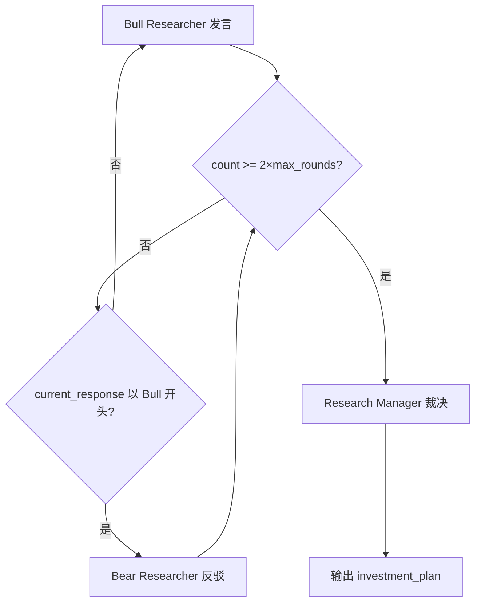
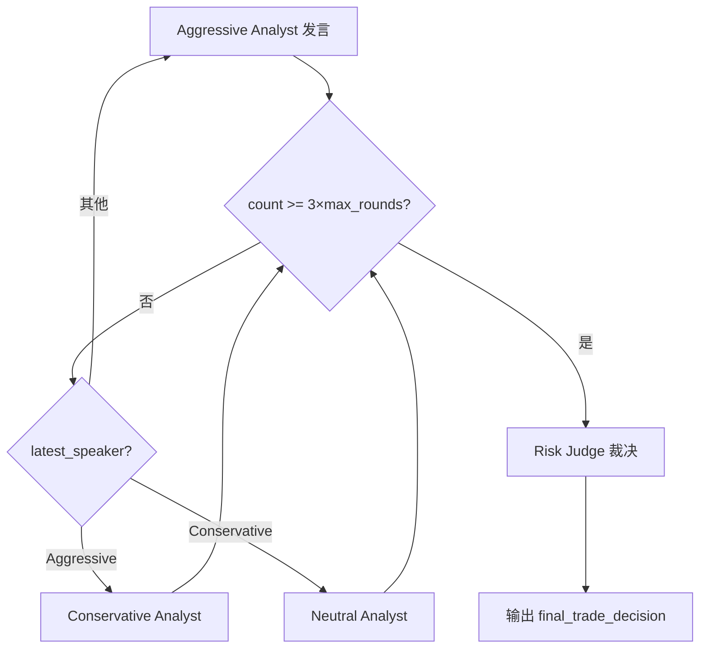

# PD-07.06 TradingAgents — 多阶段对抗辩论质量保障

> 文档编号：PD-07.06
> 来源：TradingAgents `tradingagents/graph/setup.py`, `tradingagents/graph/conditional_logic.py`
> GitHub：https://github.com/TauricResearch/TradingAgents.git
> 问题域：PD-07 质量检查 Quality Assurance
> 状态：可复用方案

---

## 第 1 章 问题与动机

### 1.1 核心问题

在 LLM 驱动的金融交易决策系统中，单一 Agent 的判断容易受到 prompt 偏差、幻觉和过度自信的影响。一个 Agent 同时扮演分析师和审查者时，自评效果极差——它倾向于确认自己的初始判断而非挑战它。

TradingAgents 面对的核心质量问题是：**如何确保 Buy/Sell/Hold 决策经过充分的多角度审查，而不是某个 Agent 的一面之词？** 这在金融场景中尤为关键，因为错误决策直接导致资金损失。

### 1.2 TradingAgents 的解法概述

TradingAgents 采用**双层对抗辩论 + 裁判裁决**的质量保障架构：

1. **投资辩论层**（Bull vs Bear）：Bull Researcher 和 Bear Researcher 围绕"是否投资"进行多轮对抗辩论，每轮直接回应对方论点（`tradingagents/agents/researchers/bull_researcher.py:25-42`）
2. **Research Manager 裁决**：辩论结束后，Research Manager 作为裁判评估双方论点，做出 Buy/Sell/Hold 决策并生成投资计划（`tradingagents/agents/managers/research_manager.py:22-38`）
3. **风险辩论层**（Aggressive vs Conservative vs Neutral）：Trader 的方案再经三方风险分析师辩论，形成三角对抗（`tradingagents/graph/setup.py:174-197`）
4. **Risk Judge 最终审批**：Risk Manager 综合三方辩论做出最终交易决策（`tradingagents/agents/managers/risk_manager.py:25-44`）
5. **事后反思学习**：交易结果出来后，Reflector 对每个参与者的表现进行反思，将教训写入 BM25 记忆库供未来检索（`tradingagents/graph/reflection.py:58-71`）

### 1.3 设计思想

| 设计原则 | 具体实现 | 理由 | 替代方案 |
|----------|----------|------|----------|
| 对抗性辩论优于自评 | Bull/Bear 双方必须直接回应对方论点 | 同一 Agent 自评会确认偏差，对抗迫使暴露弱点 | 单 Agent 多次采样投票 |
| 双层审查递进深化 | 投资辩论→裁决→交易方案→风险辩论→最终审批 | 第一层审查投资方向，第二层审查执行风险，关注点不同 | 单层辩论一次裁决 |
| 三角对抗优于二元对立 | 风险层用 Aggressive/Conservative/Neutral 三方 | 二元对立容易陷入僵局，中立方打破平衡 | 仅 Bull/Bear 二元 |
| 可配置辩论深度 | `max_debate_rounds` 和 `max_risk_discuss_rounds` 参数化 | 不同场景需要不同审查深度，高风险交易需更多轮次 | 固定轮次 |
| 记忆驱动的持续改进 | BM25 检索历史相似情境的反思教训 | 避免重复犯同样的错误，每次决策都站在历史经验上 | 无记忆的无状态辩论 |

---

## 第 2 章 源码实现分析

### 2.1 架构概览

TradingAgents 的质量保障架构是一个 LangGraph StateGraph，包含两个辩论环和两个裁判节点：

```
┌─────────────────────────────────────────────────────────────────┐
│                    TradingAgents 质量保障流水线                    │
├─────────────────────────────────────────────────────────────────┤
│                                                                 │
│  ┌──────────┐    ┌──────────┐                                   │
│  │  Market   │    │  Social  │    4 个数据分析师并行采集           │
│  │ Analyst   │───→│ Analyst  │───→ News ───→ Fundamentals        │
│  └──────────┘    └──────────┘                    │               │
│                                                  ▼               │
│  ┌─────────────────────────────────────────────────┐            │
│  │          投资辩论层 (Investment Debate)           │            │
│  │  ┌──────┐  ←── N 轮对抗 ──→  ┌──────┐           │            │
│  │  │ Bull │                     │ Bear │           │            │
│  │  └──────┘                     └──────┘           │            │
│  │              count >= 2×max_rounds               │            │
│  │                      ▼                           │            │
│  │            ┌──────────────────┐                  │            │
│  │            │ Research Manager │ ← 裁判裁决        │            │
│  │            │  (judge_decision)│                  │            │
│  │            └────────┬─────────┘                  │            │
│  └─────────────────────┼───────────────────────────┘            │
│                        ▼                                        │
│              ┌──────────────────┐                                │
│              │     Trader       │ ← 制定交易方案                  │
│              └────────┬─────────┘                                │
│                       ▼                                         │
│  ┌─────────────────────────────────────────────────┐            │
│  │           风险辩论层 (Risk Debate)                │            │
│  │  ┌────────────┐  ┌──────────────┐  ┌─────────┐  │            │
│  │  │ Aggressive │→ │ Conservative │→ │ Neutral │  │            │
│  │  └────────────┘  └──────────────┘  └─────────┘  │            │
│  │       ↑              循环 N 轮                ↓   │            │
│  │       └──────────────────────────────────────┘   │            │
│  │              count >= 3×max_rounds               │            │
│  │                      ▼                           │            │
│  │            ┌──────────────────┐                  │            │
│  │            │   Risk Judge     │ ← 最终审批        │            │
│  │            │(final_decision)  │                  │            │
│  │            └──────────────────┘                  │            │
│  └─────────────────────────────────────────────────┘            │
│                        ▼                                        │
│              ┌──────────────────┐                                │
│              │    Reflector     │ ← 事后反思（交易结果出来后）      │
│              │  (5 个角色反思)   │                                │
│              └──────────────────┘                                │
└─────────────────────────────────────────────────────────────────┘
```

### 2.2 核心实现

#### 2.2.1 投资辩论的轮次控制



对应源码 `tradingagents/graph/conditional_logic.py:46-55`：

```python
def should_continue_debate(self, state: AgentState) -> str:
    """Determine if debate should continue."""
    if (
        state["investment_debate_state"]["count"] >= 2 * self.max_debate_rounds
    ):  # 3 rounds of back-and-forth between 2 agents
        return "Research Manager"
    if state["investment_debate_state"]["current_response"].startswith("Bull"):
        return "Bear Researcher"
    return "Bull Researcher"
```

轮次计数机制：每个辩论者发言时 `count += 1`（`bull_researcher.py:54`），Bull 和 Bear 各发言一次算 2 次计数，所以 `max_debate_rounds=1` 意味着 Bull 和 Bear 各发言 1 次。

#### 2.2.2 三方风险辩论的循环调度



对应源码 `tradingagents/graph/conditional_logic.py:57-67`：

```python
def should_continue_risk_analysis(self, state: AgentState) -> str:
    """Determine if risk analysis should continue."""
    if (
        state["risk_debate_state"]["count"] >= 3 * self.max_risk_discuss_rounds
    ):  # 3 rounds of back-and-forth between 3 agents
        return "Risk Judge"
    if state["risk_debate_state"]["latest_speaker"].startswith("Aggressive"):
        return "Conservative Analyst"
    if state["risk_debate_state"]["latest_speaker"].startswith("Conservative"):
        return "Neutral Analyst"
    return "Aggressive Analyst"
```

三方循环调度：Aggressive → Conservative → Neutral → Aggressive...，每人发言一次 count 加 1，`max_risk_discuss_rounds=1` 意味着三人各发言 1 次。

#### 2.2.3 辩论者的对抗性 Prompt 设计

每个辩论者的 prompt 都包含**对方最新论点**，强制其直接回应而非自说自话。以 Aggressive Debator 为例（`aggressive_debator.py:21-33`）：

```python
prompt = f"""As the Aggressive Risk Analyst, your role is to actively champion
high-reward, high-risk opportunities...
Here is the current conversation history: {history}
Here are the last arguments from the conservative analyst: {current_conservative_response}
Here are the last arguments from the neutral analyst: {current_neutral_response}.
If there are no responses from the other viewpoints, do not hallucinate
and just present your point.
Engage actively by addressing any specific concerns raised, refuting the
weaknesses in their logic..."""
```

关键设计：
- 注入对方最新回复（`current_conservative_response`, `current_neutral_response`）
- 明确要求"respond directly to each point"而非泛泛而谈
- 防幻觉保护："If there are no responses...do not hallucinate"

### 2.3 实现细节

#### 状态管理：双层 TypedDict

辩论状态通过两个独立的 TypedDict 管理（`agent_states.py:11-47`）：

- `InvestDebateState`：追踪 bull_history、bear_history、judge_decision、count
- `RiskDebateState`：追踪 aggressive/conservative/neutral_history、latest_speaker、judge_decision、count

每个辩论者更新自己的 history 字段和全局 history，同时保留其他辩论者的 history 不变。这种设计让裁判可以看到完整辩论历史，也可以单独查看某一方的论证链。

#### LLM 分层：深度思考 vs 快速思考

```
deep_thinking_llm (gpt-5.2)  → Research Manager, Risk Judge（裁判需要深度推理）
quick_thinking_llm (gpt-5-mini) → Bull/Bear, Aggressive/Conservative/Neutral（辩论者用快速模型）
```

裁判使用更强的模型（`setup.py:95-96, 104-105`），辩论者使用更快的模型（`setup.py:89-93, 101-103`）。这是成本与质量的平衡——辩论者产出观点，裁判做最终判断。

#### 事后反思与记忆更新

交易结果出来后，`reflect_and_remember()` 对 5 个角色分别反思（`trading_graph.py:263-279`）：

```python
def reflect_and_remember(self, returns_losses):
    self.reflector.reflect_bull_researcher(self.curr_state, returns_losses, self.bull_memory)
    self.reflector.reflect_bear_researcher(self.curr_state, returns_losses, self.bear_memory)
    self.reflector.reflect_trader(self.curr_state, returns_losses, self.trader_memory)
    self.reflector.reflect_invest_judge(self.curr_state, returns_losses, self.invest_judge_memory)
    self.reflector.reflect_risk_manager(self.curr_state, returns_losses, self.risk_manager_memory)
```

Reflector 的反思 prompt 要求（`reflection.py:17-46`）：
1. 判断决策正确/错误（收益增加=正确，反之=错误）
2. 分析每个因素的权重贡献
3. 对错误决策提出修正建议
4. 总结教训并提取 ≤1000 token 的精华查询

反思结果通过 `memory.add_situations()` 写入 BM25 索引（`reflection.py:81`），未来相似情境时自动检索。

---

## 第 3 章 迁移指南

### 3.1 迁移清单

**阶段 1：核心辩论框架**
- [ ] 定义辩论状态 TypedDict（正方/反方 history、count、judge_decision）
- [ ] 实现辩论者节点工厂函数（注入对方最新论点的 prompt 模板）
- [ ] 实现裁判节点（综合辩论历史做出裁决）
- [ ] 实现轮次控制条件函数（count 计数 + 最大轮次限制）

**阶段 2：多层辩论**
- [ ] 在第一层辩论后增加中间处理节点（如 Trader）
- [ ] 实现第二层辩论（可选三方对抗）
- [ ] 连接两层辩论的状态传递

**阶段 3：反思学习**
- [ ] 实现 Reflector 类（对每个角色生成反思）
- [ ] 集成 BM25 记忆系统（存储情境-教训对）
- [ ] 在辩论者 prompt 中注入历史教训

### 3.2 适配代码模板

以下是一个可直接复用的双方辩论 + 裁判框架：

```python
from typing import TypedDict, Annotated
from langgraph.graph import StateGraph, END

class DebateState(TypedDict):
    pro_history: Annotated[str, "正方辩论历史"]
    con_history: Annotated[str, "反方辩论历史"]
    full_history: Annotated[str, "完整辩论历史"]
    current_response: Annotated[str, "最新发言"]
    judge_decision: Annotated[str, "裁判裁决"]
    count: Annotated[int, "发言计数"]

class AppState(TypedDict):
    input_context: str
    debate_state: DebateState
    final_decision: str

def create_debator(llm, role: str, opponent_role: str):
    """通用辩论者工厂函数"""
    def debator_node(state: AppState) -> dict:
        debate = state["debate_state"]
        history = debate.get("full_history", "")
        opponent_last = debate.get("current_response", "")

        prompt = f"""你是{role}，请针对以下议题进行辩论。
你必须直接回应对方（{opponent_role}）的最新论点，而非自说自话。

背景信息：{state['input_context']}
辩论历史：{history}
对方最新论点：{opponent_last}

如果对方尚未发言，请先陈述你的立场。"""

        response = llm.invoke(prompt)
        argument = f"{role}: {response.content}"
        my_key = "pro_history" if "正方" in role else "con_history"

        return {
            "debate_state": {
                **debate,
                "full_history": history + "\n" + argument,
                my_key: debate.get(my_key, "") + "\n" + argument,
                "current_response": argument,
                "count": debate["count"] + 1,
            }
        }
    return debator_node

def create_judge(llm):
    """裁判工厂函数"""
    def judge_node(state: AppState) -> dict:
        debate = state["debate_state"]
        prompt = f"""作为裁判，请评估以下辩论并做出明确裁决。
不要因为双方都有道理就选择折中，请选择论据更强的一方。

辩论历史：{debate['full_history']}"""

        response = llm.invoke(prompt)
        return {
            "debate_state": {**debate, "judge_decision": response.content},
            "final_decision": response.content,
        }
    return judge_node

def should_continue(state: AppState, max_rounds: int = 2) -> str:
    """轮次控制"""
    if state["debate_state"]["count"] >= 2 * max_rounds:
        return "judge"
    if state["debate_state"]["current_response"].startswith("正方"):
        return "con"
    return "pro"

# 组装图
def build_debate_graph(llm_fast, llm_deep, max_rounds=2):
    workflow = StateGraph(AppState)
    workflow.add_node("pro", create_debator(llm_fast, "正方", "反方"))
    workflow.add_node("con", create_debator(llm_fast, "反方", "正方"))
    workflow.add_node("judge", create_judge(llm_deep))

    workflow.set_entry_point("pro")
    workflow.add_conditional_edges("pro", lambda s: should_continue(s, max_rounds),
                                   {"con": "con", "judge": "judge"})
    workflow.add_conditional_edges("con", lambda s: should_continue(s, max_rounds),
                                   {"pro": "pro", "judge": "judge"})
    workflow.add_edge("judge", END)
    return workflow.compile()
```

### 3.3 适用场景

| 场景 | 适用度 | 说明 |
|------|--------|------|
| 金融交易决策 | ⭐⭐⭐ | 原生场景，Bull/Bear 对抗天然适配 |
| 内容审核/事实核查 | ⭐⭐⭐ | 正方生成内容，反方挑错，裁判定稿 |
| 代码审查 | ⭐⭐ | 开发者提交代码，Critic 挑问题，Reviewer 裁决 |
| 方案选型 | ⭐⭐⭐ | 多个方案各有代言人辩论，决策者裁决 |
| 风险评估 | ⭐⭐⭐ | 三方（激进/保守/中立）天然适配风险评估 |
| 简单 QA 任务 | ⭐ | 过度设计，单 Agent 足够 |

---

## 第 4 章 测试用例

```python
import pytest
from unittest.mock import MagicMock, patch
from tradingagents.graph.conditional_logic import ConditionalLogic


class TestDebateRoundControl:
    """测试辩论轮次控制逻辑"""

    def setup_method(self):
        self.logic = ConditionalLogic(max_debate_rounds=2, max_risk_discuss_rounds=1)

    def test_investment_debate_continues_when_under_limit(self):
        """Bull 发言后应轮到 Bear"""
        state = {
            "investment_debate_state": {
                "count": 1,
                "current_response": "Bull Analyst: I believe..."
            }
        }
        assert self.logic.should_continue_debate(state) == "Bear Researcher"

    def test_investment_debate_ends_at_limit(self):
        """达到最大轮次后应交给 Research Manager"""
        state = {
            "investment_debate_state": {
                "count": 4,  # 2 * max_debate_rounds(2) = 4
                "current_response": "Bear Analyst: ..."
            }
        }
        assert self.logic.should_continue_debate(state) == "Research Manager"

    def test_risk_debate_rotation_aggressive_to_conservative(self):
        """Aggressive 发言后应轮到 Conservative"""
        state = {
            "risk_debate_state": {
                "count": 1,
                "latest_speaker": "Aggressive"
            }
        }
        assert self.logic.should_continue_risk_analysis(state) == "Conservative Analyst"

    def test_risk_debate_rotation_conservative_to_neutral(self):
        """Conservative 发言后应轮到 Neutral"""
        state = {
            "risk_debate_state": {
                "count": 2,
                "latest_speaker": "Conservative"
            }
        }
        assert self.logic.should_continue_risk_analysis(state) == "Neutral Analyst"

    def test_risk_debate_ends_at_limit(self):
        """三方各发言一轮后应交给 Risk Judge"""
        state = {
            "risk_debate_state": {
                "count": 3,  # 3 * max_risk_discuss_rounds(1) = 3
                "latest_speaker": "Neutral"
            }
        }
        assert self.logic.should_continue_risk_analysis(state) == "Risk Judge"


class TestDebatorPromptInjection:
    """测试辩论者是否正确注入对方论点"""

    def test_aggressive_receives_opponent_arguments(self):
        """Aggressive 应收到 Conservative 和 Neutral 的最新论点"""
        mock_llm = MagicMock()
        mock_llm.invoke.return_value = MagicMock(content="I argue for high risk...")

        from tradingagents.agents.risk_mgmt.aggressive_debator import create_aggressive_debator
        node = create_aggressive_debator(mock_llm)

        state = {
            "risk_debate_state": {
                "history": "",
                "aggressive_history": "",
                "conservative_history": "",
                "neutral_history": "",
                "current_conservative_response": "Conservative says: too risky",
                "current_neutral_response": "Neutral says: balance needed",
                "count": 0,
            },
            "market_report": "market data",
            "sentiment_report": "sentiment data",
            "news_report": "news data",
            "fundamentals_report": "fundamentals data",
            "trader_investment_plan": "BUY plan",
        }

        result = node(state)
        # 验证 LLM 被调用且 prompt 包含对方论点
        call_args = mock_llm.invoke.call_args[0][0]
        assert "Conservative says: too risky" in call_args
        assert "Neutral says: balance needed" in call_args
        # 验证 count 递增
        assert result["risk_debate_state"]["count"] == 1


class TestReflectionLoop:
    """测试事后反思机制"""

    def test_reflector_updates_all_memories(self):
        """反思应更新所有 5 个角色的记忆"""
        from tradingagents.graph.reflection import Reflector

        mock_llm = MagicMock()
        mock_llm.invoke.return_value = MagicMock(content="Lesson: should have sold earlier")
        reflector = Reflector(mock_llm)

        mock_memory = MagicMock()
        state = {
            "market_report": "report",
            "sentiment_report": "sentiment",
            "news_report": "news",
            "fundamentals_report": "fundamentals",
            "investment_debate_state": {
                "bull_history": "bull argued...",
                "bear_history": "bear argued...",
                "judge_decision": "BUY",
            },
            "trader_investment_plan": "BUY AAPL",
            "risk_debate_state": {"judge_decision": "BUY with caution"},
        }

        reflector.reflect_bull_researcher(state, "-5%", mock_memory)
        mock_memory.add_situations.assert_called_once()
```

---

## 第 5 章 跨域关联

| 关联域 | 关系类型 | 说明 |
|--------|----------|------|
| PD-01 上下文管理 | 依赖 | 多轮辩论历史不断累积，需要上下文窗口管理。TradingAgents 通过 `history` 字符串拼接传递全部辩论历史，高轮次时可能超出 token 限制 |
| PD-02 多 Agent 编排 | 协同 | 辩论机制本质是一种特殊的多 Agent 编排模式——LangGraph StateGraph 的条件边实现了辩论者之间的轮转调度 |
| PD-06 记忆持久化 | 协同 | Reflector 的反思结果通过 BM25 记忆系统持久化，辩论者在下次决策时检索历史教训。记忆质量直接影响辩论质量 |
| PD-11 可观测性 | 依赖 | `_log_state()` 将完整辩论历史和裁决结果写入 JSON 日志，支持事后审计和回溯分析 |
| PD-12 推理增强 | 协同 | 裁判节点使用 `deep_thinking_llm`（更强模型）做最终裁决，辩论者使用 `quick_thinking_llm`，这是推理增强的分层策略 |

---

## 第 6 章 来源文件索引

| 文件 | 行范围 | 关键实现 |
|------|--------|----------|
| `tradingagents/graph/setup.py` | L14-L202 | GraphSetup 类：节点创建与边连接，双层辩论图的完整布线 |
| `tradingagents/graph/conditional_logic.py` | L6-L67 | ConditionalLogic 类：辩论轮次控制与三方循环调度 |
| `tradingagents/agents/managers/research_manager.py` | L5-L55 | Research Manager：投资辩论裁判，生成 investment_plan |
| `tradingagents/agents/managers/risk_manager.py` | L5-L66 | Risk Manager：风险辩论裁判，生成 final_trade_decision |
| `tradingagents/agents/researchers/bull_researcher.py` | L6-L59 | Bull Researcher：看多方辩论者，含记忆检索 |
| `tradingagents/agents/researchers/bear_researcher.py` | L6-L59 | Bear Researcher：看空方辩论者，含记忆检索 |
| `tradingagents/agents/risk_mgmt/aggressive_debator.py` | L5-L55 | Aggressive Analyst：激进风险分析师 |
| `tradingagents/agents/risk_mgmt/conservative_debator.py` | L6-L58 | Conservative Analyst：保守风险分析师 |
| `tradingagents/agents/risk_mgmt/neutral_debator.py` | L5-L55 | Neutral Analyst：中立风险分析师 |
| `tradingagents/agents/utils/agent_states.py` | L11-L77 | InvestDebateState + RiskDebateState + AgentState 定义 |
| `tradingagents/agents/trader/trader.py` | L6-L46 | Trader 节点：接收投资计划，制定交易方案 |
| `tradingagents/graph/reflection.py` | L7-L121 | Reflector 类：5 角色事后反思与记忆更新 |
| `tradingagents/agents/utils/memory.py` | L12-L98 | FinancialSituationMemory：BM25 相似情境检索 |
| `tradingagents/graph/trading_graph.py` | L43-L283 | TradingAgentsGraph：主编排类，含 reflect_and_remember |
| `tradingagents/default_config.py` | L18-L20 | 辩论轮次默认配置：max_debate_rounds=1, max_risk_discuss_rounds=1 |

---

## 第 7 章 横向对比维度

```json comparison_data
{
  "project": "TradingAgents",
  "dimensions": {
    "检查方式": "双层对抗辩论：Bull/Bear 投资辩论 + Aggressive/Conservative/Neutral 风险辩论",
    "评估维度": "投资方向（Buy/Sell/Hold）+ 风险水平（激进/保守/中立三角评估）",
    "评估粒度": "决策级：每次交易决策经过两轮辩论审查",
    "迭代机制": "可配置轮次的多轮辩论，count 计数器控制终止",
    "反馈机制": "辩论者 prompt 注入对方最新论点，强制直接回应",
    "自动修复": "无自动修复，裁判做最终裁决而非要求辩论者修改",
    "覆盖范围": "交易决策全流程：数据采集→投资辩论→交易方案→风险辩论→最终审批",
    "并发策略": "辩论层串行轮转，数据分析师层可并行",
    "降级路径": "无显式降级，辩论轮次可配置为 0 跳过辩论",
    "人机协作": "无人工介入点，全自动辩论裁决",
    "错误归因": "事后反思机制：Reflector 分析每个角色的决策正确性并归因",
    "安全防护": "防幻觉指令：无对方论点时不要编造",
    "记忆驱动改进": "BM25 检索历史相似情境教训，注入辩论者和裁判 prompt"
  }
}
```

### 域元数据补充

```json domain_metadata
{
  "solution_summary": "TradingAgents 用 Bull/Bear 投资辩论 + Aggressive/Conservative/Neutral 三方风险辩论的双层对抗架构，配合 LangGraph 条件边轮转调度和 BM25 记忆驱动的事后反思，实现交易决策的多角度质量保障",
  "description": "对抗辩论作为质量检查手段：通过角色对立的多 Agent 辩论替代传统的检查清单式审查",
  "sub_problems": [
    "辩论收敛性：多轮辩论可能陷入重复论点而非深化分析，需要检测论点新颖度",
    "裁判偏见：裁判 LLM 可能系统性偏向某一方（如总是偏保守），需要校准机制",
    "辩论历史膨胀：多轮辩论的 history 字符串线性增长，高轮次时可能超出上下文窗口"
  ],
  "best_practices": [
    "三角对抗打破僵局：二元对立容易陷入拉锯，引入第三方中立视角可打破平衡",
    "裁判用强模型、辩论者用快模型：质量关键点投入更多推理资源，辩论产出用轻量模型控制成本",
    "事后反思闭环：交易结果出来后对每个角色独立反思，教训写入记忆供未来检索，形成持续改进循环"
  ]
}
```
