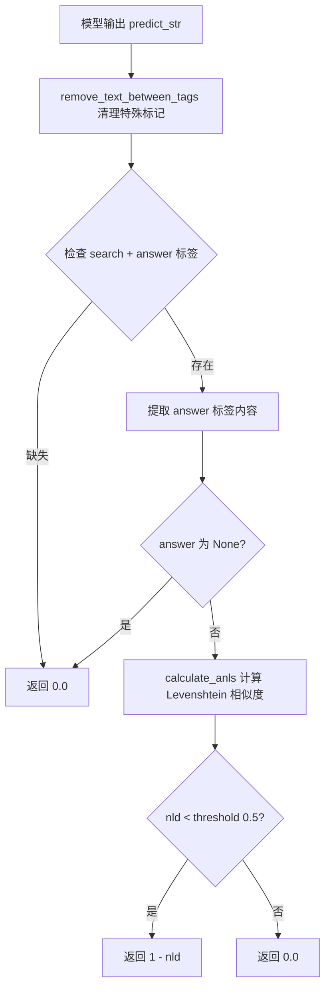
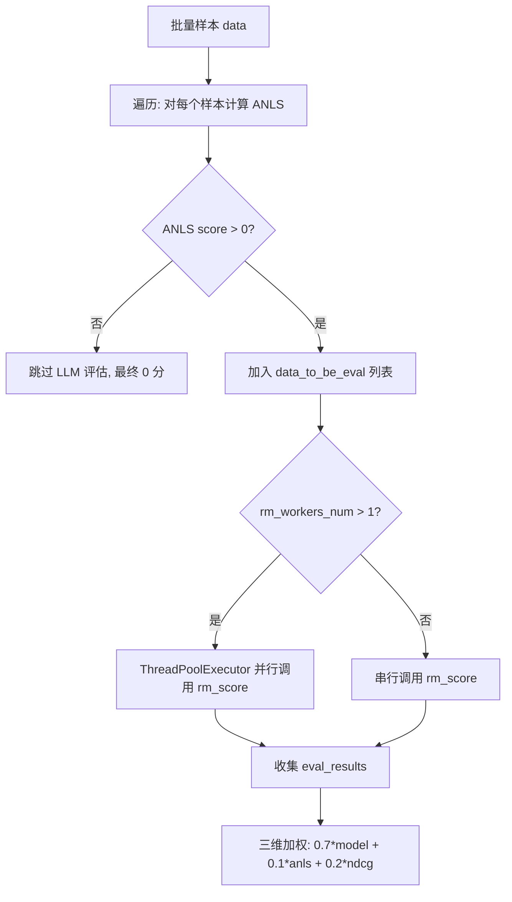
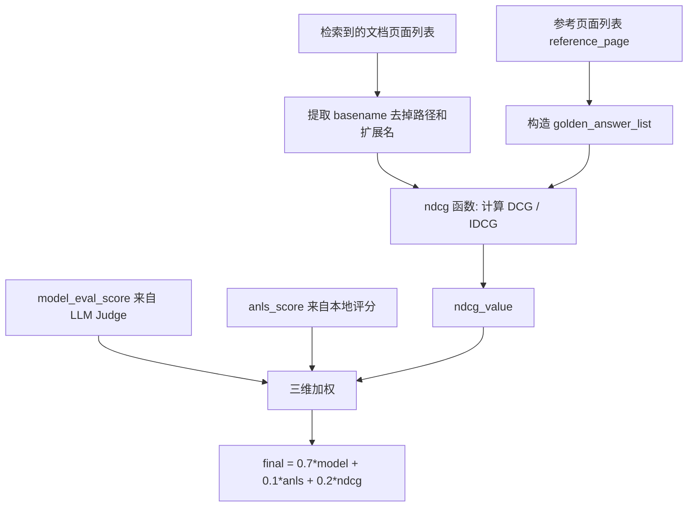

# PD-07.15 VRAG — LLM-as-Judge 三维加权奖励评估

> 文档编号：PD-07.15
> 来源：VRAG `VRAG-RL/verl/workers/reward_manager/rm.py`
> GitHub：https://github.com/Alibaba-NLP/VRAG.git
> 问题域：PD-07 质量检查 Quality Assurance
> 状态：可复用方案

---

## 第 1 章 问题与动机

### 1.1 核心问题

视觉 RAG（Retrieval-Augmented Generation）系统在 RL 训练中需要一个可靠的奖励信号来衡量生成质量。传统做法要么只用规则匹配（精确但脆弱），要么只用 LLM 判断（灵活但昂贵且不稳定）。VRAG 面临的核心挑战是：

1. **答案正确性判断不能靠精确匹配**：视觉文档问答的答案表述多样，"2024年1月" 和 "January 2024" 语义等价但字符串不同
2. **检索质量需要独立评估**：即使最终答案正确，如果检索到的文档页面不对，模型可能只是"猜对了"，RL 不应奖励这种行为
3. **格式合规是前置门控**：模型输出必须包含 `<search>` 和 `<answer>` 标签，否则后续评估无意义
4. **评估开销需要控制**：每个样本都调用 LLM Judge 成本高，应该只对"有希望"的样本做深度评估

### 1.2 VRAG 的解法概述

VRAG 实现了一个三维加权奖励系统，核心设计：

1. **格式门控前置过滤**：`compute_format_reward_only()` 检查 `<search>` + `<answer>` 标签存在性，不合格直接 0 分（`vrag.py:67-73`）
2. **ANLS 文本相似度评分**：基于 Levenshtein 距离的归一化相似度，带阈值截断（`vrag.py:31-47`）
3. **LLM-as-Judge 语义正确性**：用 qwen-max 模型判断生成答案与参考答案的语义一致性（`rm.py:27-51, 137-172`）
4. **NDCG 检索质量评分**：对检索到的文档页面计算归一化折扣累积增益（`rm.py:71-105`）
5. **三维加权融合**：`0.7 * model_eval + 0.1 * anls + 0.2 * ndcg` 组合最终奖励（`rm.py:334`）

### 1.3 设计思想

| 设计原则 | 具体实现 | 理由 | 替代方案 |
|----------|----------|------|----------|
| 格式门控前置 | `compute_format_reward_only` 检查标签后才进入评分 | 避免对格式错误的输出浪费 LLM 调用 | 后置检查（浪费 API 调用） |
| 多维度加权 | 0.7 model + 0.1 anls + 0.2 ndcg | 语义正确性为主，检索质量为辅，文本相似度兜底 | 单一分数（无法区分"猜对"和"真懂"） |
| 评估模型隔离 | 用 qwen-max（DashScope API）做 Judge，与训练模型完全分离 | 避免自评偏差，Judge 模型能力需强于被评模型 | 同模型自评（效果差） |
| 条件触发 LLM 评估 | 只有 ANLS > 0 的样本才送 LLM Judge | 明显错误的答案不值得花钱评估 | 全量评估（成本高 10x） |
| 多线程并发 | ThreadPoolExecutor(max_workers=10) 并行调用 Judge API | 批量样本串行调用太慢 | 异步 IO（更复杂） |

---

## 第 2 章 源码实现分析

### 2.1 架构概览

VRAG 的奖励评估系统分为三层：格式检查层、本地评分层、远程 Judge 层。

```
┌─────────────────────────────────────────────────────────────┐
│                    RMManager.__call__()                       │
│                                                              │
│  ┌──────────────┐    ┌──────────────┐    ┌───────────────┐  │
│  │ 格式门控      │───→│ ANLS 本地评分 │───→│ LLM Judge     │  │
│  │ <search>+     │    │ Levenshtein  │    │ qwen-max API  │  │
│  │ <answer>检查  │    │ 距离 ≥ 0.5   │    │ True/False    │  │
│  └──────┬───────┘    └──────┬───────┘    └──────┬────────┘  │
│         │ 0分              │ anls_score         │ 0.0/1.0   │
│         ↓                  ↓                    ↓            │
│  ┌──────────────────────────────────────────────────────┐   │
│  │         NDCG 检索质量评分                              │   │
│  │  sorted_docs vs golden_answer_list → ndcg_value       │   │
│  └──────────────────────────────────┬───────────────────┘   │
│                                     ↓                        │
│  ┌──────────────────────────────────────────────────────┐   │
│  │  最终奖励 = 0.7*model + 0.1*anls + 0.2*ndcg          │   │
│  └──────────────────────────────────────────────────────┘   │
└─────────────────────────────────────────────────────────────┘
```

关键组件关系：
- `RMManager`（`rm.py:123`）是奖励管理器入口，持有 tokenizer、Judge API 配置
- `compute_score`（`vrag.py:48`）负责格式检查 + ANLS 本地评分
- `rm_score`（`rm.py:137`）负责单条样本的 LLM Judge 调用
- `ndcg`（`rm.py:82`）负责检索质量评分
- `_default_compute_score`（`__init__.py:17`）是数据源路由器，按 data_source 分发到不同评分函数

### 2.2 核心实现

#### 2.2.1 格式门控 + ANLS 本地评分



对应源码 `VRAG-RL/verl/utils/reward_score/vrag.py:31-73`：

```python
def calculate_anls(gold_labels, prediction, threshold=0.7):
    max_scores = []
    for gold_label in gold_labels:
        ld = levenshtein_distance(prediction, gold_label)
        max_len = max(len(prediction), len(gold_label))
        if max_len == 0:
            nld = 0.0
        else:
            nld = ld / max_len
        if nld < threshold:
            score = 1 - nld
        else:
            score = 0.0
        max_scores.append(score)
    return max(max_scores)

def compute_score(predict_str: str, ground_truth: str, extra_info) -> float:
    predict_str = remove_text_between_tags(predict_str)
    format_reward_value = compute_format_reward_only(predict_str)
    if format_reward_value == 1.0:
        answer = get_answer_from_predict_str(predict_str)
        if answer is None:
            return 0.0
        anls_score = calculate_anls([ground_truth], answer, 0.5)
        return anls_score
    else:
        return 0.0
```

注意 `compute_score` 中 ANLS 阈值被设为 0.5（而非函数默认的 0.7），这是因为视觉文档问答的答案变体更多，需要更宽松的匹配。

#### 2.2.2 LLM-as-Judge 评估与多线程并发



对应源码 `VRAG-RL/verl/workers/reward_manager/rm.py:137-172`（LLM Judge 调用）：

```python
def rm_score(self, data_eval_item):
    pay_load = {
        "model": self.rm_model_name,
        "messages": [{
            "role": "user",
            "content": DEFAULT_SYSTEM_TEMPLATE
                .replace("{query}", data_eval_item["query"])
                .replace("{reference_answer}", data_eval_item["reference_answer"])
                .replace("{generated_answer}", data_eval_item["generated_answer"])
        }]
    }
    max_retry = 20
    while True:
        if max_retry <= 0:
            return 0.0
        try:
            response = requests.post(
                self.rm_url,
                headers={"Content-Type": "application/json",
                         "X-Auth-Key": self.rm_key},
                json=pay_load
            )
            response.raise_for_status()
            result = response.json()
            judge_str = parse_judge_response(result['output']['content'])
            if judge_str is not None:
                return 1.0 if judge_str else 0.0
        except Exception as e:
            continue
```

关键设计点：
- **20 次重试上限**：`max_retry = 20`，超过后返回 0.0 作为保守降级（`rm.py:150-153`）
- **XML 标签解析**：Judge 输出用 `<judge>True/False</judge>` 格式，`parse_judge_response` 做大小写兼容解析（`rm.py:53-68`）
- **条件触发**：只有 `score > 0.0`（即 ANLS 通过）的样本才进入 LLM 评估队列（`rm.py:271-272`）

#### 2.2.3 NDCG 检索质量评分与三维融合



对应源码 `VRAG-RL/verl/workers/reward_manager/rm.py:324-334`：

```python
if score > 0.0:
    if self.eval_mode:
        score = eval_results.pop(0)
    else:
        retrievaled_images_basename_list = [
            os.path.basename(item.rstrip('/')).split(".jpg")[0]
            for item in data_item.non_tensor_batch['retrievaled_images']
        ]
        reference_images_basename_list = [
            f'{extra_info["file_name"].split(".pdf")[0]}_{page}'
            for page in extra_info["reference_page"].tolist()
        ]
        ndcg_value = ndcg(retrievaled_images_basename_list,
                          reference_images_basename_list)
        model_eval_score = eval_results.pop(0)
        score = 0.7 * model_eval_score + 0.1 * score + 0.2 * ndcg_value
```

注意 `eval_mode` 分支：验证时只用 LLM Judge 分数（纯正确性），训练时用三维加权（鼓励检索质量提升）。

### 2.3 实现细节

**数据源路由机制**（`__init__.py:17-49`）：`_default_compute_score` 按 `data_source` 字段分发到不同评分函数。VRAG 相关的数据源（`rag`, `slidevqa_test`, `mmlongdoc`, `vidoseek`）统一走 `vrag.compute_format_reward_only`，只做格式检查，ANLS 和 LLM Judge 在 `RMManager.__call__` 中完成。

**训练/验证双模式**（`main_ppo.py:184-185`）：
- 训练模式 `eval_mode=False`：三维加权，NDCG 参与计算
- 验证模式 `eval_mode=True`：纯 LLM Judge 分数，用于评估真实正确率

**配置驱动**（`ppo_trainer.yaml:161-165`）：所有 Judge 参数（URL、API Key、模型名、并发数）均可通过 YAML 配置覆盖，支持切换到本地部署的评估模型。

---

## 第 3 章 迁移指南

### 3.1 迁移清单

**阶段 1：基础评分框架**
- [ ] 实现格式检查函数（根据你的输出格式定义标签）
- [ ] 实现 ANLS 或其他文本相似度评分（安装 `python-Levenshtein`）
- [ ] 定义 Judge Prompt 模板（根据你的任务类型调整）

**阶段 2：LLM Judge 集成**
- [ ] 选择 Judge 模型（推荐能力强于被评模型的 API 模型）
- [ ] 实现 HTTP 调用 + 重试逻辑
- [ ] 实现 Judge 输出解析（处理格式变体）

**阶段 3：多维融合**
- [ ] 确定各维度权重（根据任务特点调整 0.7/0.1/0.2）
- [ ] 实现条件触发逻辑（低分样本跳过 LLM 评估）
- [ ] 添加多线程并发支持

### 3.2 适配代码模板

```python
"""可直接复用的三维加权奖励管理器模板"""
import re
import requests
from concurrent.futures import ThreadPoolExecutor
from typing import List, Dict, Optional, Callable

JUDGE_PROMPT = """You are an expert evaluation system.
Given a query, a generated answer, and a reference answer,
judge if the generated answer is correct.

## Query
{query}

## Reference Answer
{reference_answer}

## Generated Answer
{generated_answer}

Respond with: <judge>True or False</judge>
"""

def parse_judge_response(response: str) -> Optional[bool]:
    """解析 LLM Judge 的 XML 标签输出"""
    match = re.search(r'<judge>(.*?)</judge>', response, re.DOTALL)
    if not match:
        return None
    content = match.group(1).strip().lower()
    if 'true' in content:
        return True
    elif 'false' in content:
        return False
    return None

class WeightedRewardManager:
    def __init__(
        self,
        judge_url: str,
        judge_api_key: str,
        judge_model: str = "gpt-4o-mini",
        max_workers: int = 10,
        max_retry: int = 20,
        weights: Dict[str, float] = None,
        format_checker: Optional[Callable] = None,
        local_scorer: Optional[Callable] = None,
        retrieval_scorer: Optional[Callable] = None,
    ):
        self.judge_url = judge_url
        self.judge_api_key = judge_api_key
        self.judge_model = judge_model
        self.max_workers = max_workers
        self.max_retry = max_retry
        self.weights = weights or {"judge": 0.7, "local": 0.1, "retrieval": 0.2}
        self.format_checker = format_checker
        self.local_scorer = local_scorer
        self.retrieval_scorer = retrieval_scorer

    def judge_single(self, item: Dict) -> float:
        """调用 LLM Judge 评估单条样本"""
        payload = {
            "model": self.judge_model,
            "messages": [{"role": "user", "content": JUDGE_PROMPT.format(**item)}]
        }
        for _ in range(self.max_retry):
            try:
                resp = requests.post(
                    self.judge_url,
                    headers={"Authorization": f"Bearer {self.judge_api_key}"},
                    json=payload, timeout=30
                )
                resp.raise_for_status()
                result = parse_judge_response(
                    resp.json()["choices"][0]["message"]["content"]
                )
                if result is not None:
                    return 1.0 if result else 0.0
            except Exception:
                continue
        return 0.0  # 重试耗尽，保守返回 0

    def score_batch(self, items: List[Dict]) -> List[float]:
        """批量评估，条件触发 + 多线程并发"""
        # Step 1: 格式门控
        format_passed = []
        for i, item in enumerate(items):
            if self.format_checker and not self.format_checker(item["output"]):
                format_passed.append(False)
            else:
                format_passed.append(True)

        # Step 2: 本地评分（只对格式通过的）
        local_scores = []
        for i, item in enumerate(items):
            if format_passed[i] and self.local_scorer:
                local_scores.append(self.local_scorer(item))
            else:
                local_scores.append(0.0)

        # Step 3: LLM Judge（只对本地评分 > 0 的）
        to_judge = [(i, item) for i, item in enumerate(items)
                    if format_passed[i] and local_scores[i] > 0]
        judge_scores = [0.0] * len(items)
        if to_judge:
            with ThreadPoolExecutor(max_workers=self.max_workers) as pool:
                results = list(pool.map(
                    self.judge_single, [item for _, item in to_judge]
                ))
            for (idx, _), score in zip(to_judge, results):
                judge_scores[idx] = score

        # Step 4: 检索质量评分
        retrieval_scores = []
        for item in items:
            if self.retrieval_scorer:
                retrieval_scores.append(self.retrieval_scorer(item))
            else:
                retrieval_scores.append(0.0)

        # Step 5: 三维加权融合
        final_scores = []
        for i in range(len(items)):
            if not format_passed[i]:
                final_scores.append(0.0)
            else:
                score = (self.weights["judge"] * judge_scores[i]
                       + self.weights["local"] * local_scores[i]
                       + self.weights["retrieval"] * retrieval_scores[i])
                final_scores.append(score)
        return final_scores
```

### 3.3 适用场景

| 场景 | 适用度 | 说明 |
|------|--------|------|
| RL 训练奖励信号 | ⭐⭐⭐ | 核心场景，三维加权提供比单一指标更稳定的梯度信号 |
| RAG 系统离线评估 | ⭐⭐⭐ | NDCG + 答案正确性组合评估检索+生成全链路 |
| 文档问答质量监控 | ⭐⭐ | 可用于生产环境采样评估，但 LLM 调用成本需控制 |
| 代码生成评估 | ⭐ | 代码需要执行验证，LLM Judge 不够可靠 |
| 多模态生成评估 | ⭐⭐ | NDCG 部分可复用，但 Judge Prompt 需要适配视觉内容 |


---

## 第 4 章 测试用例

```python
"""基于 VRAG 真实函数签名的测试用例"""
import pytest
from unittest.mock import patch, MagicMock

# ---- 格式检查测试 ----

def test_compute_format_reward_only_both_tags():
    """同时包含 search 和 answer 标签时返回 1.0"""
    from verl.utils.reward_score.vrag import compute_format_reward_only
    text = "<search>query</search> some text <answer>42</answer>"
    assert compute_format_reward_only(text, "", None) == 1.0

def test_compute_format_reward_only_missing_search():
    """缺少 search 标签时返回 0.0"""
    from verl.utils.reward_score.vrag import compute_format_reward_only
    text = "<answer>42</answer>"
    assert compute_format_reward_only(text, "", None) == 0.0

def test_compute_format_reward_only_missing_answer():
    """缺少 answer 标签时返回 0.0"""
    from verl.utils.reward_score.vrag import compute_format_reward_only
    text = "<search>query</search>"
    assert compute_format_reward_only(text, "", None) == 0.0

# ---- ANLS 评分测试 ----

def test_calculate_anls_exact_match():
    """完全匹配时 ANLS = 1.0"""
    from verl.utils.reward_score.vrag import calculate_anls
    assert calculate_anls(["hello world"], "hello world") == 1.0

def test_calculate_anls_similar():
    """相似文本的 ANLS 在 0-1 之间"""
    from verl.utils.reward_score.vrag import calculate_anls
    score = calculate_anls(["January 2024"], "Jan 2024", threshold=0.5)
    assert 0.0 < score < 1.0

def test_calculate_anls_completely_different():
    """完全不同的文本 ANLS = 0.0（超过阈值）"""
    from verl.utils.reward_score.vrag import calculate_anls
    score = calculate_anls(["abcdef"], "xyz", threshold=0.5)
    assert score == 0.0

def test_calculate_anls_multiple_gold_labels():
    """多个参考答案取最高分"""
    from verl.utils.reward_score.vrag import calculate_anls
    score = calculate_anls(["abc", "abcdef"], "abcdef")
    assert score == 1.0

# ---- NDCG 评分测试 ----

def test_ndcg_perfect_ranking():
    """完美排序时 NDCG = 1.0"""
    from verl.workers.reward_manager.rm import ndcg
    sorted_docs = ["doc1", "doc2", "doc3"]
    golden = ["doc1", "doc2"]
    assert ndcg(sorted_docs, golden) == 1.0

def test_ndcg_worst_ranking():
    """相关文档全部排在最后"""
    from verl.workers.reward_manager.rm import ndcg
    sorted_docs = ["doc3", "doc4", "doc1", "doc2"]
    golden = ["doc1", "doc2"]
    score = ndcg(sorted_docs, golden)
    assert 0.0 < score < 1.0

def test_ndcg_no_relevant_docs():
    """没有相关文档时 NDCG = 0.0"""
    from verl.workers.reward_manager.rm import ndcg
    sorted_docs = ["doc3", "doc4"]
    golden = ["doc1", "doc2"]
    assert ndcg(sorted_docs, golden) == 0.0

def test_ndcg_empty_golden():
    """空参考列表时 NDCG = 0.0（防除零）"""
    from verl.workers.reward_manager.rm import ndcg
    assert ndcg(["doc1"], []) == 0.0

# ---- Judge 解析测试 ----

def test_parse_judge_response_true():
    from verl.workers.reward_manager.rm import parse_judge_response
    assert parse_judge_response("<judge>True</judge>") == True

def test_parse_judge_response_false():
    from verl.workers.reward_manager.rm import parse_judge_response
    assert parse_judge_response("<judge>False</judge>") == False

def test_parse_judge_response_case_insensitive():
    from verl.workers.reward_manager.rm import parse_judge_response
    assert parse_judge_response("<judge>true</judge>") == True

def test_parse_judge_response_no_tag():
    from verl.workers.reward_manager.rm import parse_judge_response
    assert parse_judge_response("The answer is correct") is None

# ---- 答案提取测试 ----

def test_get_answer_normal():
    from verl.workers.reward_manager.rm import get_answer_from_predict_str
    text = "thinking...<answer>42</answer>"
    assert get_answer_from_predict_str(text) == "42"

def test_get_answer_no_tag():
    from verl.workers.reward_manager.rm import get_answer_from_predict_str
    assert get_answer_from_predict_str("no tags here") is None

def test_get_answer_nested():
    """多个 answer 标签取最后一对"""
    from verl.workers.reward_manager.rm import get_answer_from_predict_str
    text = "<answer>wrong</answer> rethink <answer>correct</answer>"
    assert get_answer_from_predict_str(text) == "correct"

# ---- 降级行为测试 ----

def test_rm_score_retry_exhaustion():
    """重试耗尽后返回 0.0"""
    from verl.workers.reward_manager.rm import RMManager
    manager = RMManager(
        tokenizer=MagicMock(), num_examine=0,
        rm_url="http://invalid:9999/v1/chat/completions",
        rm_key="test", rm_model_name="test"
    )
    # 用不可达的 URL，20 次重试后应返回 0.0
    with patch('requests.post', side_effect=Exception("connection error")):
        score = manager.rm_score({
            "query": "test", "reference_answer": "ref",
            "generated_answer": "gen"
        })
    assert score == 0.0

# ---- 三维加权测试 ----

def test_weighted_score_calculation():
    """验证 0.7*model + 0.1*anls + 0.2*ndcg 加权公式"""
    model_score = 1.0
    anls_score = 0.8
    ndcg_score = 0.5
    expected = 0.7 * model_score + 0.1 * anls_score + 0.2 * ndcg_score
    assert abs(expected - 0.88) < 1e-6

def test_format_fail_zero_score():
    """格式检查失败时最终分数为 0，不触发 LLM 评估"""
    # 格式不通过 → compute_score 返回 0.0 → 不进入 data_to_be_eval
    from verl.utils.reward_score.vrag import compute_score
    score = compute_score("no tags at all", "reference", {})
    assert score == 0.0
```

---

## 第 5 章 跨域关联

| 关联域 | 关系类型 | 说明 |
|--------|----------|------|
| PD-01 上下文管理 | 协同 | Judge Prompt 模板需要控制 token 长度，长答案需截断后再送评估 |
| PD-02 多 Agent 编排 | 协同 | RMManager 在 PPO 训练循环中作为 reward_fn 被 RayPPOTrainer 调用，是编排链的一环 |
| PD-03 容错与重试 | 依赖 | rm_score 的 20 次重试机制是容错设计的直接体现，重试耗尽降级为 0 分 |
| PD-04 工具系统 | 协同 | 格式检查中的 `<search>` 标签对应模型的检索工具调用，工具输出格式决定了质量检查的前置条件 |
| PD-08 搜索与检索 | 强依赖 | NDCG 评分直接评估检索质量，`retrievaled_images` 来自检索系统的输出 |
| PD-11 可观测性 | 协同 | `num_examine` 控制打印样本数量用于调试，`already_print_data_sources` 按数据源限制日志量 |

---

## 第 6 章 来源文件索引

| 文件 | 行范围 | 关键实现 |
|------|--------|----------|
| `VRAG-RL/verl/workers/reward_manager/rm.py` | L27-51 | Judge Prompt 模板 DEFAULT_SYSTEM_TEMPLATE |
| `VRAG-RL/verl/workers/reward_manager/rm.py` | L53-68 | parse_judge_response XML 标签解析 |
| `VRAG-RL/verl/workers/reward_manager/rm.py` | L71-105 | DCG/NDCG 检索质量评分实现 |
| `VRAG-RL/verl/workers/reward_manager/rm.py` | L107-120 | get_answer_from_predict_str 答案提取 |
| `VRAG-RL/verl/workers/reward_manager/rm.py` | L123-135 | RMManager 类定义与构造函数 |
| `VRAG-RL/verl/workers/reward_manager/rm.py` | L137-172 | rm_score LLM Judge 调用 + 重试 |
| `VRAG-RL/verl/workers/reward_manager/rm.py` | L210-348 | __call__ 主评估流程 + 三维加权 |
| `VRAG-RL/verl/workers/reward_manager/rm.py` | L274-280 | ThreadPoolExecutor 多线程并发评估 |
| `VRAG-RL/verl/workers/reward_manager/rm.py` | L324-334 | NDCG 计算 + 0.7/0.1/0.2 加权融合 |
| `VRAG-RL/verl/utils/reward_score/vrag.py` | L31-47 | calculate_anls Levenshtein 相似度 |
| `VRAG-RL/verl/utils/reward_score/vrag.py` | L48-59 | compute_score 格式门控 + ANLS |
| `VRAG-RL/verl/utils/reward_score/vrag.py` | L67-73 | compute_format_reward_only 标签检查 |
| `VRAG-RL/verl/utils/reward_score/__init__.py` | L17-49 | _default_compute_score 数据源路由 |
| `VRAG-RL/verl/trainer/main_ppo.py` | L140-185 | RMManager 实例化与配置注入 |
| `VRAG-RL/verl/trainer/config/ppo_trainer.yaml` | L142-170 | reward_model 配置块 |


---

## 第 7 章 横向对比维度

```json comparison_data
{
  "project": "VRAG",
  "dimensions": {
    "检查方式": "三阶段：格式标签门控 → ANLS 文本相似度 → LLM-as-Judge 语义判断",
    "评估维度": "三维加权：语义正确性(0.7) + 文本相似度(0.1) + 检索质量NDCG(0.2)",
    "评估粒度": "单样本级，按 data_source 路由到不同评分函数",
    "迭代机制": "无迭代，单次评估直接出分（RL 训练循环本身是迭代）",
    "反馈机制": "二值 Judge（True/False），无结构化改进建议",
    "并发策略": "ThreadPoolExecutor 10 线程并行调用 Judge API",
    "降级路径": "格式不通过→0分跳过；ANLS=0→跳过LLM；重试20次耗尽→0分",
    "评估模型隔离": "qwen-max（DashScope API）做 Judge，与训练模型完全分离",
    "配置驱动": "YAML 配置 Judge URL/Key/模型名/并发数，支持切换本地模型",
    "基准集成": "支持 slidevqa_test/mmlongdoc/vidoseek 等多基准数据源路由",
    "检索质量评估": "NDCG 独立评估检索文档排序质量，区分'猜对'和'真懂'"
  }
}
```

### 域元数据补充

```json domain_metadata
{
  "solution_summary": "VRAG 用 qwen-max LLM-as-Judge + ANLS 文本相似度 + NDCG 检索质量三维加权(0.7/0.1/0.2)计算 RL 训练奖励，格式门控前置过滤 + 10 线程并发评估",
  "description": "RL 训练场景下奖励信号的多维度组合设计与条件触发评估",
  "sub_problems": [
    "检索质量独立评估：答案正确但检索文档错误时需要区分'猜对'和'真懂'",
    "RL 奖励信号稳定性：单一指标的奖励信号噪声大，多维加权提供更平滑的梯度",
    "条件触发评估成本控制：低质量样本跳过昂贵的 LLM 评估减少 API 开销",
    "训练/验证评估模式分离：训练用加权奖励鼓励检索改进，验证用纯正确率衡量真实能力"
  ],
  "best_practices": [
    "格式门控前置于语义评估：先检查输出格式合规再做昂贵的 LLM 调用，不合格直接零分",
    "检索质量纳入奖励信号：NDCG 独立评估检索排序，防止模型学会绕过检索直接猜答案",
    "条件触发 LLM 评估：本地评分为零的样本跳过远程 Judge，节省 70%+ API 调用",
    "训练与验证用不同评估策略：训练用多维加权引导行为，验证用纯正确率衡量效果"
  ]
}
```
