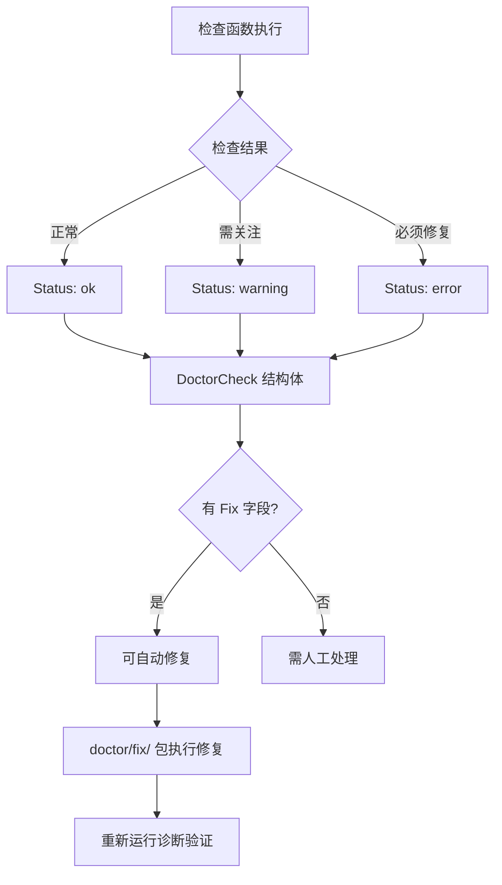
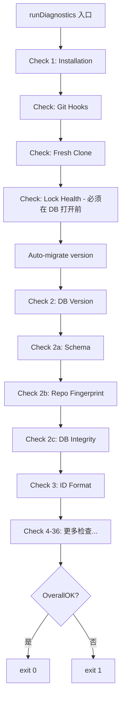
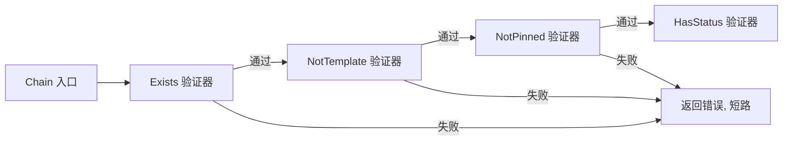

# PD-07.06 beads — Doctor 全面数据完整性检查

> 文档编号：PD-07.06
> 来源：beads `cmd/bd/doctor/`
> GitHub：https://github.com/steveyegge/beads.git
> 问题域：PD-07 质量检查 Quality Assurance
> 状态：可复用方案

---

## 第 1 章 问题与动机

### 1.1 核心问题

数据驱动的 CLI 工具在长期使用中会积累各种数据完整性问题：数据库版本漂移、Schema 不兼容、孤儿依赖、循环依赖、重复数据、测试污染、Git 冲突残留、迁移状态断裂等。这些问题如果不及时发现和修复，会导致数据丢失、功能异常甚至系统崩溃。

beads 面临的挑战尤其复杂：它支持 SQLite 和 Dolt 双后端、支持联邦多节点同步、支持 worktree 重定向、支持 gastown 多工作区模式。每种模式都有独特的数据完整性风险。

### 1.2 beads 的解法概述

beads 通过 `bd doctor` 子系统实现了一套分层、分类、可扩展的全面健康检查框架：

1. **三级检查深度**：轻量 check-health（Git hooks 触发）→ 标准 doctor（36+ 项检查）→ 深度 deep validation（图完整性验证），按场景选择检查粒度（`cmd/bd/doctor_health.go:20`）
2. **9 大检查分类**：Core System / Data & Config / Git Integration / Runtime / Performance / Integrations / Federation / Metadata / Maintenance，每类独立管理（`cmd/bd/doctor/types.go:11-21`）
3. **检查-修复分离架构**：检查逻辑在 `doctor/` 包，修复逻辑在 `doctor/fix/` 子包，职责清晰（`cmd/bd/doctor/fix/common.go:56`）
4. **多模式修复**：`--fix`（自动修复）/ `--fix -i`（逐项确认）/ `--dry-run`（预览）/ `--fix --yes`（无确认），覆盖全人工到全自动的完整光谱（`cmd/bd/doctor.go:274-278`）
5. **修复后验证闭环**：`--fix` 执行后自动重新运行诊断，确认修复生效（`cmd/bd/doctor.go:237-241`）

### 1.3 设计思想

| 设计原则 | 具体实现 | 理由 | 替代方案 |
|----------|----------|------|----------|
| 分层检查深度 | check-health / doctor / deep 三级 | 不同场景需要不同的检查成本 | 单一全量检查（太慢或太浅） |
| 检查-修复分离 | doctor/ 和 doctor/fix/ 两个包 | 检查是只读的，修复是写操作，权限模型不同 | 检查和修复混在一起 |
| 分类聚合展示 | 9 个 Category 常量 + CategoryOrder | 36+ 项检查需要结构化展示，否则信息过载 | 平铺列表 |
| 三态结果模型 | ok / warning / error 三级状态 | warning 不阻塞但需关注，error 必须修复 | 二态 pass/fail |
| 修复后验证 | fix 后自动 re-run diagnostics | 确保修复真正生效，防止假修复 | 信任修复结果 |
| 安全优先修复 | validateBeadsWorkspace + safeWorkspacePath | 防止路径遍历攻击和误操作 | 直接操作文件系统 |

---

## 第 2 章 源码实现分析

### 2.1 架构概览

beads doctor 的整体架构是一个三层检查系统，从轻量到深度逐级递进：

```
┌─────────────────────────────────────────────────────────────────┐
│                     bd doctor CLI 入口                          │
│                  cmd/bd/doctor.go:159-270                       │
├─────────────┬──────────────┬──────────────┬────────────────────┤
│ check-health│   standard   │    deep      │   server/migration │
│ (Git hooks) │  (36+ checks)│ (graph walk) │   (Dolt specific)  │
│ doctor_     │  doctor.go   │  deep.go     │  server.go /       │
│ health.go   │  :319-724    │  :32-130     │  migration*.go     │
├─────────────┴──────────────┴──────────────┴────────────────────┤
│              doctor/ 包：检查实现（只读）                         │
│  types.go | validation.go | integrity.go | deep.go | ...       │
├────────────────────────────────────────────────────────────────┤
│              doctor/fix/ 包：修复实现（写操作）                    │
│  common.go | validation.go | hooks.go | maintenance.go | ...   │
├────────────────────────────────────────────────────────────────┤
│              internal/validation/ 包：业务验证器                  │
│  issue.go — Chain 组合式验证器                                   │
└────────────────────────────────────────────────────────────────┘
```

### 2.2 核心实现

#### 2.2.1 DoctorCheck 统一结果模型



对应源码 `cmd/bd/doctor/types.go:37-44`：

```go
// DoctorCheck represents a single diagnostic check result
type DoctorCheck struct {
	Name     string `json:"name"`
	Status   string `json:"status"` // StatusOK, StatusWarning, or StatusError
	Message  string `json:"message"`
	Detail   string `json:"detail,omitempty"`
	Fix      string `json:"fix,omitempty"`
	Category string `json:"category,omitempty"` // category for grouping in output
}
```

这个结构体是整个 doctor 系统的核心数据模型。每个检查函数返回一个 `DoctorCheck`，包含名称、状态、消息、详情、修复建议和分类。`Fix` 字段既是给用户的修复提示，也是 fix 包判断是否可自动修复的依据。

#### 2.2.2 标准诊断流水线（36+ 项检查）



对应源码 `cmd/bd/doctor.go:319-724`，核心模式是每个检查独立执行，结果追加到 `result.Checks` 切片：

```go
func runDiagnostics(path string) doctorResult {
	result := doctorResult{
		Path:       path,
		CLIVersion: Version,
		OverallOK:  true,
	}

	// Check 1: Installation (.beads/ directory)
	installCheck := convertWithCategory(doctor.CheckInstallation(path), doctor.CategoryCore)
	result.Checks = append(result.Checks, installCheck)
	if installCheck.Status != statusOK {
		result.OverallOK = false
	}

	// GH#1981: Run lock health check BEFORE any checks that open embedded
	// Dolt databases. Earlier checks create noms LOCK files via flock();
	// if CheckLockHealth runs after them, it detects those same-process
	// locks as "held by another process" (false positive).
	earlyLockCheck := doctor.CheckLockHealth(path)

	// ... 36+ more checks following same pattern ...
}
```

关键设计：Lock Health 检查必须在任何数据库打开操作之前执行（`cmd/bd/doctor.go:366-370`），否则会产生假阳性。这是一个通过 GH#1981 issue 发现的顺序依赖 bug。

#### 2.2.3 Chain 组合式验证器



对应源码 `internal/validation/issue.go:15-24`：

```go
// IssueValidator validates an issue and returns an error if validation fails.
// Validators can be composed using Chain() for complex validation logic.
type IssueValidator func(id string, issue *types.Issue) error

// Chain composes multiple validators into a single validator.
// Validators are executed in order and the first error stops the chain.
func Chain(validators ...IssueValidator) IssueValidator {
	return func(id string, issue *types.Issue) error {
		for _, v := range validators {
			if err := v(id, issue); err != nil {
				return err
			}
		}
		return nil
	}
}
```

预定义的组合验证器（`internal/validation/issue.go:122-156`）：
- `forUpdate()` = Chain(Exists, NotTemplate)
- `forClose(force)` = Chain(Exists, NotTemplate, NotPinned)
- `forDelete()` = Chain(Exists, NotTemplate)
- `forReopen()` = Chain(Exists, NotTemplate, HasStatus(Closed))

### 2.3 实现细节

#### 深度验证（Graph Walk）

深度验证模式（`cmd/bd/doctor/deep.go:32-130`）对整个 issue 图进行完整性遍历，包含 6 项子检查：

1. **Parent Consistency** — 所有 parent-child 依赖指向存在的 issue
2. **Dependency Integrity** — 所有依赖引用有效 issue
3. **Epic Completeness** — 发现可关闭的 epic（所有子项已关闭）
4. **Agent Bead Integrity** — Agent bead 的 state 值合法
5. **Mail Thread Integrity** — thread_id 引用存在的 issue
6. **Molecule Integrity** — Molecule 的 parent-child 结构完整

每项检查使用 SQL 查询直接在数据库层面验证，避免将全量数据加载到内存。例如重复检测（`cmd/bd/doctor/validation.go:219-228`）使用 `GROUP BY ... HAVING COUNT(*) > 1` 在 SQL 层聚合，而非 O(n²) 的内存比较。

#### 修复安全机制

fix 包的安全设计（`cmd/bd/doctor/fix/common.go:56-96`）：
- `validateBeadsWorkspace()` — 确认目标是合法的 beads 工作区
- `safeWorkspacePath()` — 防止路径遍历攻击（`..` 逃逸）
- `getBdBinary()` — 优先使用当前可执行文件，防止命令注入；检测测试二进制防止 fork bomb
- 修复操作使用显式事务（`tx.Begin() / tx.Commit()`），确保原子性

---

## 第 3 章 迁移指南

### 3.1 迁移清单

#### 阶段 1：核心架构搭建（1-2 天）

- [ ] 定义 `DoctorCheck` 结果模型（Name / Status / Message / Detail / Fix / Category）
- [ ] 定义检查分类常量（Core / Data / Git / Runtime / Performance / Integration / Metadata / Maintenance）
- [ ] 实现 `runDiagnostics()` 主流程框架
- [ ] 实现结果聚合和分类展示逻辑

#### 阶段 2：基础检查实现（3-5 天）

- [ ] 实现 5-10 个核心检查（安装、版本、Schema、权限、配置）
- [ ] 为每个检查编写单元测试
- [ ] 实现 JSON 输出模式（`--json`）
- [ ] 实现 verbose 模式（`--verbose`）

#### 阶段 3：修复能力（3-5 天）

- [ ] 创建 `fix/` 子包，实现安全基础设施（validateWorkspace / safeWorkspacePath）
- [ ] 为可自动修复的检查实现修复函数
- [ ] 实现修复模式：`--fix` / `--fix -i` / `--dry-run` / `--fix --yes`
- [ ] 实现修复后验证闭环

#### 阶段 4：高级检查（5-7 天）

- [ ] 实现图完整性检查（循环依赖、孤儿依赖、重复检测）
- [ ] 实现深度验证模式（`--deep`）
- [ ] 实现特定检查模式（`--check=<name>`）
- [ ] 实现性能诊断模式（`--perf`）

#### 阶段 5：集成与优化（2-3 天）

- [ ] 集成到 Git hooks（pre-commit / post-merge 触发轻量检查）
- [ ] 实现检查顺序优化（Lock Health 必须在 DB 打开前）
- [ ] 实现检查并发执行（独立检查可并行）
- [ ] 添加 `--output` 导出诊断报告

### 3.2 适配代码模板

#### 模板 1：定义检查函数

```go
package doctor

import (
	"database/sql"
	"fmt"
)

// CheckYourFeature checks if your feature is healthy
func CheckYourFeature(path string) DoctorCheck {
	// 1. 获取必要的上下文（backend, beadsDir, db 等）
	backend, beadsDir := getBackendAndBeadsDir(path)
	
	// 2. 快速失败路径（不适用的场景）
	if backend != configfile.BackendDolt {
		return DoctorCheck{
			Name:    "Your Feature",
			Status:  StatusOK,
			Message: "N/A (SQLite backend)",
		}
	}
	
	// 3. 打开数据库连接
	db, store, err := openStoreDB(beadsDir)
	if err != nil {
		return DoctorCheck{
			Name:    "Your Feature",
			Status:  StatusWarning,
			Message: "Unable to open database",
			Detail:  err.Error(),
		}
	}
	defer store.Close()
	
	// 4. 执行检查逻辑（SQL 查询或文件系统检查）
	var count int
	err = db.QueryRow("SELECT COUNT(*) FROM your_table WHERE condition").Scan(&count)
	if err != nil {
		return DoctorCheck{
			Name:    "Your Feature",
			Status:  StatusWarning,
			Message: "Unable to query",
			Detail:  err.Error(),
		}
	}
	
	// 5. 根据结果返回 DoctorCheck
	if count == 0 {
		return DoctorCheck{
			Name:     "Your Feature",
			Status:   StatusOK,
			Message:  "All checks passed",
			Category: CategoryCore,
		}
	}
	
	return DoctorCheck{
		Name:     "Your Feature",
		Status:   StatusError,
		Message:  fmt.Sprintf("Found %d issues", count),
		Detail:   "Additional context here",
		Fix:      "Run 'your-tool fix' to repair",
		Category: CategoryCore,
	}
}
```

#### 模板 2：实现修复函数

```go
package fix

import (
	"database/sql"
	"fmt"
)

// YourFeature fixes issues detected by CheckYourFeature
func YourFeature(path string, verbose bool) error {
	// 1. 验证工作区
	if err := validateBeadsWorkspace(path); err != nil {
		return err
	}
	
	beadsDir := resolveBeadsDir(filepath.Join(path, ".beads"))
	
	// 2. 打开数据库
	db, err := openDoltDB(beadsDir)
	if err != nil {
		fmt.Printf("  Fix skipped (%v)\n", err)
		return nil
	}
	defer db.Close()
	
	// 3. 查询需要修复的数据
	query := `SELECT id, field FROM your_table WHERE needs_fix`
	rows, err := db.Query(query)
	if err != nil {
		return fmt.Errorf("failed to query: %w", err)
	}
	defer rows.Close()
	
	var items []string
	for rows.Next() {
		var id, field string
		if err := rows.Scan(&id, &field); err == nil {
			items = append(items, id)
		}
	}
	
	if len(items) == 0 {
		fmt.Println("  Nothing to fix")
		return nil
	}
	
	// 4. 执行修复（使用事务）
	tx, err := db.Begin()
	if err != nil {
		return fmt.Errorf("failed to begin transaction: %w", err)
	}
	
	var fixed int
	for _, id := range items {
		_, err := tx.Exec("UPDATE your_table SET field = ? WHERE id = ?", "fixed_value", id)
		if err != nil {
			fmt.Printf("  Warning: failed to fix %s: %v\n", id, err)
		} else {
			fixed++
			if verbose {
				fmt.Printf("  Fixed: %s\n", id)
			}
		}
	}
	
	if err := tx.Commit(); err != nil {
		return fmt.Errorf("failed to commit: %w", err)
	}
	
	// 5. Dolt commit（如果适用）
	_, _ = db.Exec("CALL DOLT_COMMIT('-Am', 'doctor: fix your feature')")
	
	fmt.Printf("  Fixed %d item(s)\n", fixed)
	return nil
}
```

#### 模板 3：Chain 组合验证器

```go
package validation

import "fmt"

// YourValidator validates your specific condition
func YourValidator(allowedValues []string) IssueValidator {
	return func(id string, issue *types.Issue) error {
		if issue == nil {
			return nil // Let Exists() handle nil check
		}
		
		for _, allowed := range allowedValues {
			if issue.YourField == allowed {
				return nil
			}
		}
		
		return fmt.Errorf("issue %s has invalid value: %s", id, issue.YourField)
	}
}

// forYourOperation returns a validator chain for your operation
func forYourOperation() IssueValidator {
	return Chain(
		Exists(),
		NotTemplate(),
		YourValidator([]string{"valid1", "valid2"}),
	)
}
```

### 3.3 适用场景

| 场景 | 适用度 | 说明 |
|------|--------|------|
| CLI 工具数据完整性检查 | ⭐⭐⭐ | 完美适配，beads 本身就是 CLI 工具 |
| Web 服务健康检查 | ⭐⭐ | 架构可复用，但需要适配 HTTP API 输出 |
| 数据库迁移验证 | ⭐⭐⭐ | 深度验证模式直接适用 |
| 多后端系统诊断 | ⭐⭐⭐ | beads 支持 SQLite/Dolt 双后端的经验可直接迁移 |
| 分布式系统健康检查 | ⭐⭐ | 联邦检查（Federation checks）可作为参考 |
| 单体应用自检 | ⭐⭐ | 过度设计，简化版即可 |

---

## 第 4 章 测试用例

```go
package doctor_test

import (
	"testing"
	"github.com/steveyegge/beads/cmd/bd/doctor"
)

// TestCheckOrphanedDependencies tests orphaned dependency detection
func TestCheckOrphanedDependencies(t *testing.T) {
	// Setup: create test database with orphaned dependency
	db := setupTestDB(t)
	defer db.Close()
	
	// Insert issue and orphaned dependency
	_, err := db.Exec("INSERT INTO issues (id, title) VALUES ('bd-1', 'Test Issue')")
	if err != nil {
		t.Fatal(err)
	}
	_, err = db.Exec("INSERT INTO dependencies (issue_id, depends_on_id, type) VALUES ('bd-1', 'bd-999', 'blocks')")
	if err != nil {
		t.Fatal(err)
	}
	
	// Test: run check
	check := doctor.CheckOrphanedDependencies(testPath)
	
	// Assert: should detect orphaned dependency
	if check.Status != doctor.StatusWarning {
		t.Errorf("expected warning, got %s", check.Status)
	}
	if !strings.Contains(check.Message, "orphaned") {
		t.Errorf("expected 'orphaned' in message, got: %s", check.Message)
	}
}

// TestCheckDuplicateIssues tests duplicate detection
func TestCheckDuplicateIssues(t *testing.T) {
	db := setupTestDB(t)
	defer db.Close()
	
	// Insert duplicate issues
	for i := 1; i <= 2; i++ {
		_, err := db.Exec(`
			INSERT INTO issues (id, title, description, status)
			VALUES (?, 'Duplicate Title', 'Same description', 'open')
		`, fmt.Sprintf("bd-%d", i))
		if err != nil {
			t.Fatal(err)
		}
	}
	
	// Test: run check
	check := doctor.CheckDuplicateIssues(testPath, false, 0)
	
	// Assert: should detect duplicates
	if check.Status != doctor.StatusWarning {
		t.Errorf("expected warning, got %s", check.Status)
	}
	if !strings.Contains(check.Message, "duplicate") {
		t.Errorf("expected 'duplicate' in message, got: %s", check.Message)
	}
}

// TestChainValidator tests validator composition
func TestChainValidator(t *testing.T) {
	tests := []struct {
		name      string
		issue     *types.Issue
		validator validation.IssueValidator
		wantErr   bool
	}{
		{
			name:      "nil issue fails Exists",
			issue:     nil,
			validator: validation.Chain(validation.Exists()),
			wantErr:   true,
		},
		{
			name: "template fails NotTemplate",
			issue: &types.Issue{
				ID:         "bd-1",
				IsTemplate: true,
			},
			validator: validation.Chain(validation.Exists(), validation.NotTemplate()),
			wantErr:   true,
		},
		{
			name: "valid issue passes all",
			issue: &types.Issue{
				ID:         "bd-1",
				IsTemplate: false,
				Status:     types.StatusOpen,
			},
			validator: validation.Chain(
				validation.Exists(),
				validation.NotTemplate(),
				validation.HasStatus(types.StatusOpen),
			),
			wantErr: false,
		},
	}
	
	for _, tt := range tests {
		t.Run(tt.name, func(t *testing.T) {
			err := tt.validator("bd-1", tt.issue)
			if (err != nil) != tt.wantErr {
				t.Errorf("validator() error = %v, wantErr %v", err, tt.wantErr)
			}
		})
	}
}

// TestFixOrphanedDependencies tests fix logic
func TestFixOrphanedDependencies(t *testing.T) {
	db := setupTestDB(t)
	defer db.Close()
	
	// Setup: create orphaned dependency
	_, _ = db.Exec("INSERT INTO issues (id, title) VALUES ('bd-1', 'Test')")
	_, _ = db.Exec("INSERT INTO dependencies (issue_id, depends_on_id, type) VALUES ('bd-1', 'bd-999', 'blocks')")
	
	// Test: run fix
	err := fix.OrphanedDependencies(testPath, false)
	if err != nil {
		t.Fatal(err)
	}
	
	// Assert: orphaned dependency should be removed
	var count int
	err = db.QueryRow("SELECT COUNT(*) FROM dependencies WHERE depends_on_id = 'bd-999'").Scan(&count)
	if err != nil {
		t.Fatal(err)
	}
	if count != 0 {
		t.Errorf("expected 0 orphaned dependencies, got %d", count)
	}
}
```

---

## 第 5 章 跨域关联

| 关联域 | 关系类型 | 说明 |
|--------|----------|------|
| PD-03 容错与重试 | 协同 | doctor 的 Lock Health 检查依赖超时保护机制，防止检查本身卡死 |
| PD-05 沙箱隔离 | 协同 | fix 包的 safeWorkspacePath 防止路径遍历，类似沙箱的边界保护 |
| PD-06 记忆持久化 | 依赖 | doctor 检查 metadata 表的 bd_version 字段，依赖持久化机制 |
| PD-08 搜索与检索 | 协同 | 深度验证的 SQL 查询优化（GROUP BY 聚合）与搜索去重策略相似 |
| PD-11 可观测性 | 协同 | `--output` 导出诊断报告，与成本追踪的日志导出模式一致 |

---

## 第 6 章 来源文件索引

| 文件 | 行范围 | 关键实现 |
|------|--------|----------|
| `cmd/bd/doctor.go` | L159-L270 | doctor 命令入口，参数解析，模式路由 |
| `cmd/bd/doctor.go` | L319-L724 | runDiagnostics 主流程，36+ 项检查编排 |
| `cmd/bd/doctor_health.go` | L20-L78 | runCheckHealth 轻量检查（Git hooks 触发） |
| `cmd/bd/doctor/types.go` | L37-L44 | DoctorCheck 结果模型定义 |
| `cmd/bd/doctor/types.go` | L11-L34 | 检查分类常量和展示顺序 |
| `cmd/bd/doctor/deep.go` | L32-L130 | RunDeepValidation 深度图完整性验证 |
| `cmd/bd/doctor/deep.go` | L133-L178 | checkParentConsistency parent-child 依赖检查 |
| `cmd/bd/doctor/validation.go` | L130-L193 | CheckOrphanedDependencies 孤儿依赖检测 |
| `cmd/bd/doctor/validation.go` | L198-L276 | CheckDuplicateIssues 重复检测（SQL 聚合） |
| `cmd/bd/doctor/integrity.go` | L94-L190 | CheckDependencyCycles 循环依赖检测（CTE 递归） |
| `cmd/bd/doctor/fix/common.go` | L56-L96 | validateBeadsWorkspace / safeWorkspacePath 安全机制 |
| `cmd/bd/doctor/fix/validation.go` | L104-L180 | OrphanedDependencies 修复实现（事务 + Dolt commit） |
| `cmd/bd/doctor/quick.go` | L15-L74 | CheckHooksQuick 快速 hooks 版本检查 |
| `internal/validation/issue.go` | L15-L24 | Chain 组合式验证器核心实现 |
| `internal/validation/issue.go` | L27-L156 | Exists / NotTemplate / NotPinned 等原子验证器 |

---

## 第 7 章 横向对比维度

```json comparison_data
{
  "project": "beads",
  "dimensions": {
    "检查方式": "三级深度：check-health（轻量）→ doctor（标准36+项）→ deep（图遍历）",
    "评估维度": "9 大分类：Core/Data/Git/Runtime/Performance/Integration/Federation/Metadata/Maintenance",
    "评估粒度": "单项检查粒度，每项独立返回 DoctorCheck 结构体",
    "迭代机制": "修复后自动重新运行诊断，验证修复生效",
    "反馈机制": "三态结果（ok/warning/error）+ Detail + Fix 字段",
    "自动修复": "四种模式：--fix（自动）/ -i（逐项确认）/ --dry-run（预览）/ --yes（无确认）",
    "覆盖范围": "36+ 项检查，覆盖安装/版本/Schema/依赖/重复/污染/Git/联邦/性能",
    "并发策略": "独立检查可并行，但 Lock Health 必须在 DB 打开前执行（顺序依赖）",
    "降级路径": "检查失败不阻塞后续检查，最终聚合 OverallOK 状态",
    "人机协作": "检查只读，修复需确认（除非 --yes），修复后自动验证",
    "错误归因": "每个 DoctorCheck 包含 Detail 字段，精确定位问题（如 bd-1→bd-999 孤儿依赖）",
    "安全防护": "fix 包的 validateWorkspace + safeWorkspacePath 防止路径遍历和误操作",
    "多后端支持": "SQLite/Dolt 双后端检查，部分检查仅适用于 Dolt（如深度验证）"
  }
}
```

### 域元数据补充

```json domain_metadata
{
  "solution_summary": "beads 用三级检查深度（轻量/标准/深度）+ 9 大分类 + 检查-修复分离架构 + 修复后验证闭环实现全面数据完整性检查",
  "description": "支持多后端（SQLite/Dolt）、多模式（联邦/worktree/gastown）的分层健康检查框架",
  "sub_problems": [
    "多后端检查适配：同一检查在 SQLite 和 Dolt 后端的不同实现策略",
    "检查顺序依赖：Lock Health 必须在 DB 打开前执行，否则产生假阳性",
    "修复安全防护：validateWorkspace + safeWorkspacePath 防止路径遍历攻击",
    "修复后验证闭环：--fix 执行后自动重新运行诊断，确认修复生效"
  ],
  "best_practices": [
    "检查-修复分离：检查是只读的（doctor/ 包），修复是写操作（doctor/fix/ 包），权限模型清晰",
    "三态结果模型：ok/warning/error 三级状态，warning 不阻塞但需关注，error 必须修复",
    "分类聚合展示：36+ 项检查按 9 大分类展示，避免信息过载",
    "SQL 层聚合优化：重复检测用 GROUP BY HAVING COUNT(*) > 1 在 SQL 层聚合，避免 O(n²) 内存比较",
    "修复事务原子性：fix 函数使用显式事务（tx.Begin/Commit），确保修复操作原子性"
  ]
}
```
