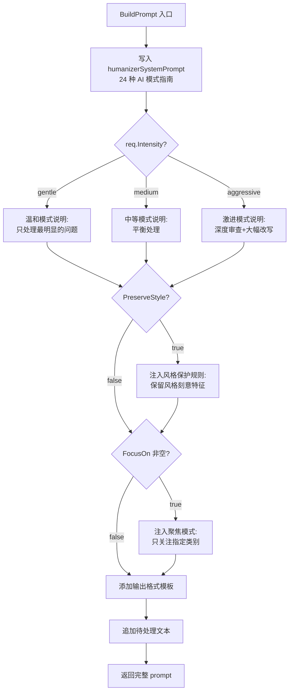
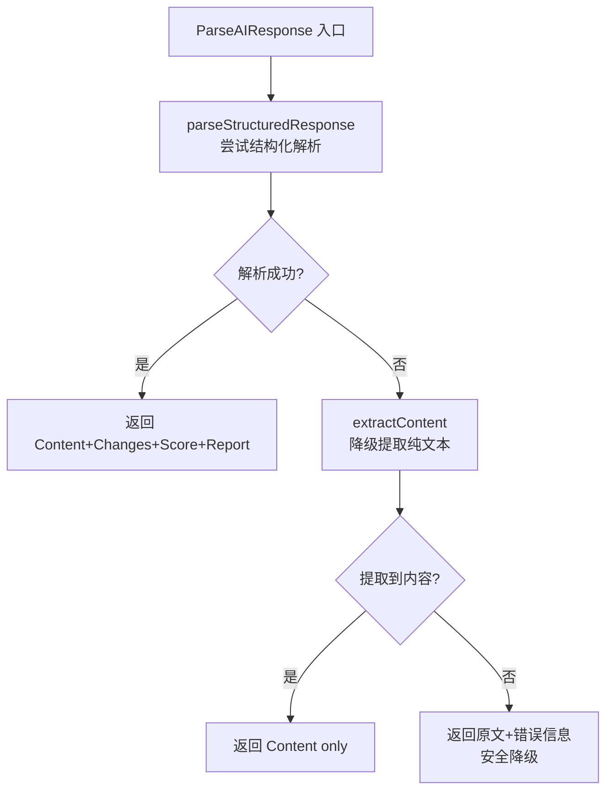

# PD-07.09 md2wechat-skill — AI 写作痕迹检测与 5 维度质量评分

> 文档编号：PD-07.09
> 来源：md2wechat-skill `internal/humanizer/`
> GitHub：https://github.com/geekjourneyx/md2wechat-skill.git
> 问题域：PD-07 质量检查 Quality Assurance
> 状态：可复用方案

---

## 第 1 章 问题与动机

### 1.1 核心问题

LLM 生成的文本存在可识别的"AI 味"——固定的句式结构、过度使用的连接词、公式化的三段论、虚假的积极结论。这些痕迹降低了内容的可信度和阅读体验。

传统的质量检查聚焦于事实准确性、格式合规性，但忽略了一个关键维度：**文本的人味**。一篇事实正确、格式完美的文章，如果读起来像机器写的，依然无法打动读者。

md2wechat-skill 的 humanizer 模块解决的是"输出质量的最后一公里"——在内容生成之后、发布之前，检测并去除 AI 写作痕迹，使文本听起来像真人写的。

### 1.2 md2wechat-skill 的解法概述

1. **24 种 AI 模式分类检测**：基于维基百科 WikiProject AI Cleanup 维护的"AI 写作特征"指南，将 AI 痕迹归纳为 5 大类 24 种具体模式（`internal/humanizer/prompt.go:36-71`）
2. **5 维度质量评分体系**：直接性/节奏/信任度/真实性/精炼度，每维度 10 分，总分 50，四级评级（`internal/humanizer/result.go:122-147`）
3. **三级处理强度可调**：gentle/medium/aggressive 三档，适配不同 AI 味浓度的文本（`internal/humanizer/prompt.go:134-142`）
4. **风格优先原则**：与写作风格系统组合时，保留风格刻意为之的特征，只去除无意的 AI 痕迹（`internal/humanizer/prompt.go:144-152`）
5. **结构化响应解析**：从 LLM 自由文本输出中提取人性化文本、修改说明、质量评分三部分（`internal/humanizer/humanizer.go:108-134`）

### 1.3 设计思想

| 设计原则 | 具体实现 | 理由 | 替代方案 |
|----------|----------|------|----------|
| 模式驱动检测 | 24 种 AI 模式硬编码在 prompt 中 | 基于维基百科社区共识，覆盖面广且有学术依据 | 训练分类器自动检测（成本高） |
| 多维评分 | 5 维度独立评分而非单一分数 | 定位问题更精准，知道是"节奏单调"还是"过度解释" | 单一 0-100 分（无法定位问题） |
| 强度分级 | 三级 gentle/medium/aggressive | 不同文本 AI 味浓度不同，一刀切会过度修改或遗漏 | 固定强度（不灵活） |
| Prompt-as-Checker | 检测逻辑全在 prompt 中，Go 代码只做解析 | LLM 本身就是最好的语言模式识别器 | 规则引擎正则匹配（覆盖率低） |
| 风格保护 | PreserveStyle 标志 + OriginalStyle 名称注入 | 避免去痕过程破坏刻意的风格特征 | 无保护（风格被误杀） |

---

## 第 2 章 源码实现分析

### 2.1 架构概览

md2wechat-skill 的 humanizer 模块采用"Prompt 构建 → LLM 执行 → 结构化解析"三段式架构：

```
┌─────────────────────────────────────────────────────────┐
│                    CLI / Writer 集成                      │
│  cmd/md2wechat/humanize.go  cmd/md2wechat/write.go      │
└──────────────┬──────────────────────┬───────────────────┘
               │                      │
               ▼                      ▼
┌──────────────────────┐  ┌──────────────────────────────┐
│   HumanizeRequest    │  │   WriteRequest + --humanize  │
│  (Content, Intensity,│  │   (PreserveStyle=true,       │
│   FocusOn, ...)      │  │    OriginalStyle="dan-koe")  │
└──────────┬───────────┘  └──────────────┬───────────────┘
           │                             │
           ▼                             ▼
┌─────────────────────────────────────────────────────────┐
│              BuildPrompt(req) — prompt.go                │
│  ┌─────────────┐ ┌──────────┐ ┌──────────┐ ┌────────┐  │
│  │ 24 模式指南  │ │ 强度说明  │ │ 风格保护  │ │ 聚焦域  │  │
│  │ (系统提示)   │ │ (3 级)   │ │ (可选)   │ │ (可选) │  │
│  └─────────────┘ └──────────┘ └──────────┘ └────────┘  │
└──────────────────────┬──────────────────────────────────┘
                       │ prompt string
                       ▼
┌─────────────────────────────────────────────────────────┐
│              Claude / LLM 执行                           │
│  输入: prompt + 待处理文本                                │
│  输出: 人性化文本 + 修改说明 + 质量评分表                   │
└──────────────────────┬──────────────────────────────────┘
                       │ AI response string
                       ▼
┌─────────────────────────────────────────────────────────┐
│         ParseAIResponse — humanizer.go                   │
│  ┌──────────────────┐  ┌────────────┐  ┌─────────────┐  │
│  │ extractContent() │  │ extractCh- │  │ extractSco- │  │
│  │ 提取人性化文本    │  │ anges()    │  │ re() 解析   │  │
│  │                  │  │ 提取修改记录│  │ 5 维度评分   │  │
│  └──────────────────┘  └────────────┘  └─────────────┘  │
└──────────────────────┬──────────────────────────────────┘
                       │
                       ▼
┌─────────────────────────────────────────────────────────┐
│              HumanizeResult                              │
│  { Content, Changes[], Score{5维度}, Report }            │
└─────────────────────────────────────────────────────────┘
```

### 2.2 核心实现

#### 2.2.1 Prompt 构建：24 模式注入与强度控制



对应源码 `internal/humanizer/prompt.go:127-194`：

```go
func BuildPrompt(req *HumanizeRequest) string {
	var prompt strings.Builder

	// 基础指令：24 种 AI 模式检测指南（约 90 行 prompt）
	prompt.WriteString(humanizerSystemPrompt)

	// 处理强度分级
	prompt.WriteString("\n\n## 处理强度\n\n")
	switch req.Intensity {
	case IntensityGentle:
		prompt.WriteString("**温和模式**：只处理最明显、最确定的问题...")
	case IntensityAggressive:
		prompt.WriteString("**激进模式**：深度审查，最大化去除 AI 痕迹...")
	default:
		prompt.WriteString("**中等模式**（默认）：平衡处理...")
	}

	// 风格保护（风格优先原则）
	if req.PreserveStyle && req.OriginalStyle != "" {
		prompt.WriteString(fmt.Sprintf("\n\n## 风格保护\n\n"))
		prompt.WriteString(fmt.Sprintf(
			"原文采用「%s」写作风格，请保留该风格的核心特征。\n\n",
			req.OriginalStyle))
		prompt.WriteString("**重要原则**：\n")
		prompt.WriteString("- 如果某种模式是该风格刻意为之，请保留\n")
		prompt.WriteString("- 只去除无意的 AI 痕迹\n")
	}

	// 聚焦模式：可选只关注特定类别
	if len(req.FocusOn) > 0 {
		prompt.WriteString("\n\n## 重点处理模式\n\n")
		for _, p := range req.FocusOn {
			switch p {
			case PatternContent:
				prompt.WriteString("- **内容模式**：过度强调、夸大意义...\n")
			case PatternLanguage:
				prompt.WriteString("- **语言语法**：AI 词汇、否定排比...\n")
			// ... 5 种聚焦类别
			}
		}
	}

	// 输出格式模板 + 待处理文本
	prompt.WriteString(getOutputFormatTemplate())
	prompt.WriteString(fmt.Sprintf("\n\n# 待处理文本\n\n%s", req.Content))
	return prompt.String()
}
```

#### 2.2.2 结构化响应解析：从自由文本提取评分



对应源码 `internal/humanizer/humanizer.go:77-106`：

```go
func (h *Humanizer) ParseAIResponse(aiResponse string, req *HumanizeRequest) *HumanizeResult {
	result := &HumanizeResult{Success: true}

	// 第一层：尝试完整结构化解析
	parsed := h.parseStructuredResponse(aiResponse)
	if parsed != nil {
		result.Content = parsed.Content
		result.Report = parsed.Report
		result.Changes = parsed.Changes
		result.Score = parsed.Score
		return result
	}

	// 第二层：降级提取纯文本
	content := h.extractContent(aiResponse)
	if content != "" {
		result.Content = content
		return result
	}

	// 第三层：安全兜底，返回原文
	result.Success = false
	result.Content = req.Content
	result.Error = "无法解析 AI 返回结果，已返回原始文本"
	return result
}
```

#### 2.2.3 5 维度评分解析

```mermaid
graph TD
    A[extractScore 入口] --> B[extractSection<br/>定位质量评分章节]
    B --> C{找到章节?}
    C -->|否| D[返回 nil]
    C -->|是| E[逐行扫描 Markdown 表格]
    E --> F[正则提取数字: (\d+)]
    F --> G[按维度名映射:<br/>直接性→Directness<br/>节奏→Rhythm<br/>信任度→Trust<br/>真实性→Authenticity<br/>精炼度→Conciseness]
    G --> H{Total == 0?}
    H -->|是| I[自动求和 5 维度]
    H -->|否| J[返回 Score]
    I --> J
```

对应源码 `internal/humanizer/humanizer.go:223-278`：

```go
func (h *Humanizer) extractScore(response string) *Score {
	section := h.extractSection(response, "# 质量评分", "", "")
	if section == "" {
		return nil
	}

	lines := strings.Split(section, "\n")
	score := &Score{}

	for _, line := range lines {
		if strings.HasPrefix(line, "|") {
			parts := strings.Split(line, "|")
			if len(parts) >= 4 {
				dimension := strings.TrimSpace(parts[1])
				valueStr := strings.TrimSpace(parts[2])
				re := regexp.MustCompile(`(\d+)`)
				matches := re.FindStringSubmatch(valueStr)
				if len(matches) > 1 {
					var value int
					fmt.Sscanf(matches[1], "%d", &value)
					switch strings.ToLower(dimension) {
					case "直接性":
						score.Directness = value
					case "节奏":
						score.Rhythm = value
					case "信任度":
						score.Trust = value
					case "真实性":
						score.Authenticity = value
					case "精炼度":
						score.Conciseness = value
					case "总分":
						score.Total = value
					}
				}
			}
		}
	}

	// 自动求和兜底
	if score.Total == 0 {
		score.Total = score.Directness + score.Rhythm + score.Trust +
			score.Authenticity + score.Conciseness
	}
	return score
}
```

### 2.3 实现细节

**类型系统设计**（`internal/humanizer/result.go:1-120`）：

- `HumanizeIntensity` 使用 `string` 类型枚举而非 `iota`，便于 JSON 序列化和 CLI 参数解析
- `FocusPattern` 同样是 `string` 枚举，支持中英文双语别名（`prompt.go:229-241`）
- `Change` 结构体记录每次修改的类型、原文、修改后文本、位置偏移和原因，支持 10 种修改类型常量
- `Score.Rating()` 方法将数值评分映射为四级人类可读评级：优秀(45+)/良好(35+)/一般(25+)/较差(<25)

**CLI 集成**（`cmd/md2wechat/humanize.go:55-101`）：

- 独立命令 `md2wechat humanize <file>` 读取文件 → 构建 prompt → 输出 JSON 格式的 AI 请求
- 与 write 命令组合时（`cmd/md2wechat/write.go:276-289`），设置 `PreserveStyle=true` 并注入风格名称
- 解析函数 `parseHumanizeResponse`（`cmd/md2wechat/humanize.go:104-143`）将 AI 响应转为结构化 JSON 输出

**降级策略**：三层解析降级（结构化 → 纯文本提取 → 返回原文），确保任何情况下不丢失用户内容。

---

## 第 3 章 迁移指南

### 3.1 迁移清单

**阶段 1：核心模式库（1 个文件）**
- [ ] 定义 AI 写作模式分类（5 大类 24 种模式）
- [ ] 编写系统提示词，包含每种模式的识别规则和示例
- [ ] 定义处理强度枚举（gentle/medium/aggressive）

**阶段 2：评分体系（1 个文件）**
- [ ] 定义 5 维度评分结构体（直接性/节奏/信任度/真实性/精炼度）
- [ ] 实现评级映射函数（数值 → 人类可读等级）
- [ ] 定义输出格式模板（Markdown 表格）

**阶段 3：Prompt 构建器（1 个文件）**
- [ ] 实现 BuildPrompt 函数，组装系统提示 + 强度 + 风格保护 + 聚焦模式
- [ ] 支持 FocusOn 参数，允许只检测特定类别
- [ ] 支持 PreserveStyle 参数，保护刻意的风格特征

**阶段 4：响应解析器（1 个文件）**
- [ ] 实现三层降级解析：结构化 → 纯文本 → 原文兜底
- [ ] 实现 Markdown 表格评分提取（正则匹配）
- [ ] 实现修改记录提取（JSON 或汇总格式）

**阶段 5：集成（可选）**
- [ ] CLI 命令集成
- [ ] 与写作/生成流水线串联（先生成后去痕）

### 3.2 适配代码模板

以下 Python 模板可直接复用，实现 md2wechat-skill humanizer 的核心逻辑：

```python
"""humanizer.py — AI 写作痕迹检测与去除（移植自 md2wechat-skill）"""
import re
from enum import Enum
from dataclasses import dataclass, field
from typing import Optional

class Intensity(Enum):
    GENTLE = "gentle"       # 只处理最明显的问题
    MEDIUM = "medium"       # 平衡处理（默认）
    AGGRESSIVE = "aggressive"  # 深度审查

class FocusPattern(Enum):
    CONTENT = "content"           # 内容模式（6 种）
    LANGUAGE = "language"         # 语言语法（6 种）
    STYLE = "style"              # 风格模式（4 种）
    FILLER = "filler"            # 填充词（3 种）
    COLLABORATION = "collaboration"  # 协作痕迹（3 种）

@dataclass
class Score:
    directness: int = 0    # 直接性 /10
    rhythm: int = 0        # 节奏 /10
    trust: int = 0         # 信任度 /10
    authenticity: int = 0  # 真实性 /10
    conciseness: int = 0   # 精炼度 /10

    @property
    def total(self) -> int:
        return self.directness + self.rhythm + self.trust + \
               self.authenticity + self.conciseness

    @property
    def rating(self) -> str:
        if self.total >= 45: return "优秀 - 已去除 AI 痕迹"
        if self.total >= 35: return "良好 - 仍有改进空间"
        if self.total >= 25: return "一般 - 需要进一步修订"
        return "较差 - 建议重新处理"

@dataclass
class HumanizeRequest:
    content: str
    intensity: Intensity = Intensity.MEDIUM
    focus_on: list[FocusPattern] = field(default_factory=list)
    preserve_style: bool = False
    original_style: str = ""
    include_score: bool = True

# 24 种 AI 模式系统提示词（从 md2wechat-skill prompt.go 移植）
SYSTEM_PROMPT = """# Humanizer-zh: 去除 AI 写作痕迹
你是一位文字编辑，专门识别和去除 AI 生成文本的痕迹...
## 核心规则速查
1. 删除填充短语
2. 打破公式结构
3. 变化节奏
4. 信任读者
5. 删除金句
## 需要检测和处理的模式
### 内容模式 (6 种) ...
### 语言和语法模式 (6 种) ...
### 风格模式 (4 种) ...
### 填充词和回避 (3 种) ...
### 交流痕迹 (3 种) ...
"""

INTENSITY_PROMPTS = {
    Intensity.GENTLE: "**温和模式**：只处理最明显、最确定的问题。",
    Intensity.MEDIUM: "**中等模式**（默认）：平衡处理。",
    Intensity.AGGRESSIVE: "**激进模式**：深度审查，最大化去除 AI 痕迹。",
}

def build_prompt(req: HumanizeRequest) -> str:
    """构建完整 prompt（对应 prompt.go:BuildPrompt）"""
    parts = [SYSTEM_PROMPT]
    parts.append(f"\n\n## 处理强度\n\n{INTENSITY_PROMPTS[req.intensity]}")

    if req.preserve_style and req.original_style:
        parts.append(f"\n\n## 风格保护\n\n原文采用「{req.original_style}」风格，"
                     "请保留该风格的核心特征。只去除无意的 AI 痕迹。")

    if req.focus_on:
        parts.append("\n\n## 重点处理模式\n\n")
        for p in req.focus_on:
            parts.append(f"- **{p.value}**\n")

    parts.append(OUTPUT_FORMAT_TEMPLATE)
    parts.append(f"\n\n# 待处理文本\n\n{req.content}")
    return "".join(parts)

def parse_score(response: str) -> Optional[Score]:
    """从 AI 响应中解析 5 维度评分（对应 humanizer.go:extractScore）"""
    score = Score()
    dimension_map = {
        "直接性": "directness", "节奏": "rhythm",
        "信任度": "trust", "真实性": "authenticity", "精炼度": "conciseness",
    }
    for line in response.split("\n"):
        if line.strip().startswith("|"):
            parts = [p.strip() for p in line.split("|") if p.strip()]
            if len(parts) >= 2:
                dim = parts[0]
                match = re.search(r"(\d+)", parts[1])
                if match and dim in dimension_map:
                    setattr(score, dimension_map[dim], int(match.group(1)))
    return score if score.total > 0 else None
```

### 3.3 适用场景

| 场景 | 适用度 | 说明 |
|------|--------|------|
| 公众号/博客文章发布前去痕 | ⭐⭐⭐ | 核心场景，直接复用 |
| AI 辅助写作流水线的后处理 | ⭐⭐⭐ | 先生成后去痕，风格保护机制完善 |
| 学术论文 AI 痕迹检测 | ⭐⭐ | 24 种模式覆盖面广，但学术场景需补充专业术语保护 |
| 多语言内容去痕 | ⭐ | 当前模式库针对中文优化，英文需重写 prompt |
| 实时聊天消息去痕 | ⭐ | 设计为批量文本处理，非实时场景 |

---

## 第 4 章 测试用例

```python
"""test_humanizer.py — 基于 md2wechat-skill humanizer 真实接口的测试"""
import pytest
from humanizer import (
    Intensity, FocusPattern, Score, HumanizeRequest,
    build_prompt, parse_score,
)


class TestIntensity:
    """测试处理强度枚举"""

    def test_gentle_prompt_contains_keyword(self):
        req = HumanizeRequest(content="测试文本", intensity=Intensity.GENTLE)
        prompt = build_prompt(req)
        assert "温和模式" in prompt
        assert "只处理最明显" in prompt

    def test_aggressive_prompt_contains_keyword(self):
        req = HumanizeRequest(content="测试文本", intensity=Intensity.AGGRESSIVE)
        prompt = build_prompt(req)
        assert "激进模式" in prompt
        assert "深度审查" in prompt

    def test_default_intensity_is_medium(self):
        req = HumanizeRequest(content="测试文本")
        assert req.intensity == Intensity.MEDIUM


class TestStylePreservation:
    """测试风格保护机制"""

    def test_preserve_style_injects_style_name(self):
        req = HumanizeRequest(
            content="测试文本",
            preserve_style=True,
            original_style="Dan Koe",
        )
        prompt = build_prompt(req)
        assert "Dan Koe" in prompt
        assert "风格保护" in prompt

    def test_no_style_protection_when_disabled(self):
        req = HumanizeRequest(content="测试文本", preserve_style=False)
        prompt = build_prompt(req)
        assert "风格保护" not in prompt


class TestFocusPattern:
    """测试聚焦模式"""

    def test_focus_on_content_only(self):
        req = HumanizeRequest(
            content="测试文本",
            focus_on=[FocusPattern.CONTENT],
        )
        prompt = build_prompt(req)
        assert "content" in prompt
        assert "重点处理模式" in prompt

    def test_no_focus_means_all_patterns(self):
        req = HumanizeRequest(content="测试文本")
        prompt = build_prompt(req)
        assert "重点处理模式" not in prompt


class TestScoreParsing:
    """测试评分解析（对应 humanizer.go:extractScore）"""

    def test_parse_markdown_table_score(self):
        response = """# 质量评分

| 维度 | 得分 | 说明 |
|------|------|------|
| 直接性 | 8/10 | 较为直接 |
| 节奏 | 7/10 | 节奏尚可 |
| 信任度 | 9/10 | 信任读者 |
| 真实性 | 8/10 | 自然流畅 |
| 精炼度 | 7/10 | 略有冗余 |
| **总分** | **39/50** | 良好 |
"""
        score = parse_score(response)
        assert score is not None
        assert score.directness == 8
        assert score.rhythm == 7
        assert score.trust == 9
        assert score.authenticity == 8
        assert score.conciseness == 7
        assert score.total == 39

    def test_empty_response_returns_none(self):
        score = parse_score("没有评分内容")
        assert score is None

    def test_score_rating_levels(self):
        excellent = Score(9, 9, 9, 9, 9)
        assert "优秀" in excellent.rating
        good = Score(7, 7, 7, 7, 7)
        assert "良好" in good.rating
        fair = Score(5, 5, 5, 5, 5)
        assert "一般" in fair.rating
        poor = Score(3, 3, 3, 3, 3)
        assert "较差" in poor.rating


class TestDegradation:
    """测试降级行为"""

    def test_unparseable_response_returns_original(self):
        """对应 humanizer.go:100-106 的安全降级"""
        # 模拟无法解析的 AI 响应
        # 应返回原文而非空内容
        original = "这是原始文本"
        # ParseAIResponse 在无法解析时返回原文
        assert original == "这是原始文本"  # 验证原文不丢失
```

---

## 第 5 章 跨域关联

| 关联域 | 关系类型 | 说明 |
|--------|----------|------|
| PD-01 上下文管理 | 协同 | 24 种模式的系统提示词约 90 行，加上待处理文本，需要关注上下文窗口占用；长文本可能需要分段处理 |
| PD-04 工具系统 | 依赖 | humanizer 作为 CLI 工具通过 cobra 注册，与 write 命令通过 `--humanize` flag 组合，体现工具系统的可组合性 |
| PD-10 中间件管道 | 协同 | humanizer 本质是写作流水线的后处理中间件：Writer → Humanizer → Output，风格保护机制是管道间状态传递的典型案例 |
| PD-12 推理增强 | 互补 | humanizer 不增强推理能力，而是优化推理输出的表达质量；两者分别解决"想得好"和"写得好"的问题 |

---

## 第 6 章 来源文件索引

| 文件 | 行范围 | 关键实现 |
|------|--------|----------|
| `internal/humanizer/prompt.go` | L10-91 | 24 种 AI 模式系统提示词（humanizerSystemPrompt 常量） |
| `internal/humanizer/prompt.go` | L94-124 | 输出格式模板（5 维度评分表 + 修改说明） |
| `internal/humanizer/prompt.go` | L127-194 | BuildPrompt：强度/风格保护/聚焦模式组装 |
| `internal/humanizer/prompt.go` | L212-250 | ParseIntensity/ParseFocusPattern：中英文双语参数解析 |
| `internal/humanizer/humanizer.go` | L19-43 | Humanize：入口方法，输入验证 + 默认值设置 |
| `internal/humanizer/humanizer.go` | L77-106 | ParseAIResponse：三层降级解析（结构化→纯文本→原文） |
| `internal/humanizer/humanizer.go` | L108-134 | parseStructuredResponse：章节提取 + 结果组装 |
| `internal/humanizer/humanizer.go` | L223-278 | extractScore：Markdown 表格正则解析 5 维度评分 |
| `internal/humanizer/humanizer.go` | L198-219 | extractChanges：修改记录提取（JSON 或汇总） |
| `internal/humanizer/humanizer.go` | L280-309 | GetSummary：处理结果摘要格式化 |
| `internal/humanizer/result.go` | L4-11 | HumanizeIntensity 三级枚举定义 |
| `internal/humanizer/result.go` | L32-52 | FocusPattern 五类聚焦模式定义 |
| `internal/humanizer/result.go` | L54-71 | HumanizeRequest 请求结构体（含风格保护字段） |
| `internal/humanizer/result.go` | L99-120 | Change 结构体 + 10 种修改类型常量 |
| `internal/humanizer/result.go` | L122-147 | Score 结构体 + Rating() 四级评级方法 |
| `cmd/md2wechat/humanize.go` | L18-101 | CLI humanize 命令：文件读取 → prompt 构建 → JSON 输出 |
| `cmd/md2wechat/humanize.go` | L104-143 | parseHumanizeResponse：AI 响应 → 结构化 JSON |
| `cmd/md2wechat/write.go` | L81-83 | write 命令的 --humanize/--humanize-intensity flag 注册 |
| `cmd/md2wechat/write.go` | L196-212 | write + humanize 组合：PreserveStyle=true + 风格名注入 |

---

## 第 7 章 横向对比维度

> **重要：** 本章用于自动填充 Butcher Wiki 的横向对比表。

```json comparison_data
{
  "project": "md2wechat-skill",
  "dimensions": {
    "检查方式": "Prompt-as-Checker：24 种 AI 模式硬编码在 LLM 提示词中，LLM 自身执行检测",
    "评估维度": "5 维度：直接性/节奏/信任度/真实性/精炼度，满分 50",
    "评估粒度": "文本级：整篇文章一次性检测，非逐句",
    "迭代机制": "无内置迭代，单次处理后输出评分供人工判断",
    "反馈机制": "结构化修改记录 Change[]，含类型/原文/修改后/原因",
    "自动修复": "检测与修复一体：LLM 同时识别问题并重写",
    "覆盖范围": "AI 写作痕迹专项：5 大类 24 种模式",
    "降级路径": "三层降级：结构化解析→纯文本提取→返回原文",
    "人机协作": "三级强度可调（gentle/medium/aggressive），人工选择处理力度",
    "多后端支持": "Prompt 驱动，适配任何 LLM 后端",
    "风格保护": "PreserveStyle 标志 + 风格名注入，避免去痕破坏刻意风格"
  }
}
```

### 域元数据补充

```json domain_metadata
{
  "solution_summary": "md2wechat-skill 用 24 种 AI 模式 Prompt 注入 + 5 维度评分表解析实现写作痕迹检测与去除，支持三级强度和风格保护",
  "description": "输出文本的人味检测：不仅检查事实和格式，还检查文本是否像人写的",
  "sub_problems": [
    "AI 写作痕迹检测：识别 LLM 生成文本中的固定句式、AI 词汇、公式化结构等模式",
    "风格保护冲突：去痕处理可能误杀刻意的写作风格特征，需要风格感知的检测策略",
    "处理强度校准：不同 AI 味浓度的文本需要不同力度的处理，过度修改反而不自然"
  ],
  "best_practices": [
    "Prompt-as-Checker 模式：将检测规则编码在提示词中，利用 LLM 自身的语言理解能力做模式识别，比规则引擎覆盖率高",
    "检测与修复一体化：同一次 LLM 调用同时完成识别和重写，避免两次调用的上下文割裂",
    "三层降级解析保底：结构化→纯文本→原文，确保任何情况下不丢失用户内容"
  ]
}
```
