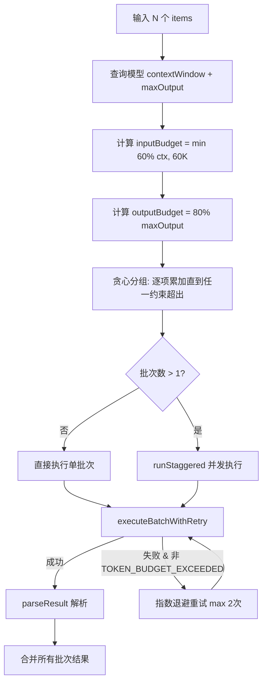
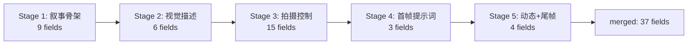
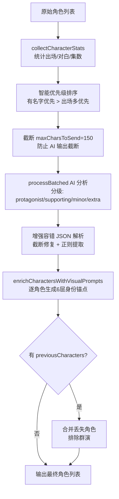

# PD-07.06 moyin-creator — 四级校准器与 JSON 清洗管线

> 文档编号：PD-07.06
> 来源：moyin-creator `src/lib/utils/json-cleaner.ts`, `src/lib/script/scene-calibrator.ts`, `src/lib/script/character-calibrator.ts`, `src/lib/script/shot-calibration-stages.ts`, `src/components/panels/sclass/sclass-calibrator.ts`
> GitHub：https://github.com/MemeCalculate/moyin-creator.git
> 问题域：PD-07 质量检查 Quality Assurance
> 状态：可复用方案

---

## 第 1 章 问题与动机

### 1.1 核心问题

AI 影视剧本创作工具面临一个根本性的质量挑战：LLM 生成的结构化数据（角色列表、场景描述、分镜参数）天然不可靠。具体表现为：

1. **JSON 格式不规范** — AI 返回的 JSON 常包含 markdown 代码围栏、多余文本、截断的结构体，直接 `JSON.parse()` 必然失败
2. **ID 类型漂移** — AI 倾向于返回数值型 ID（`1, 2, 3`），而前端系统需要字符串型 ID（`"char_1"`），类型不一致导致关联断裂
3. **语义重复与遗漏** — 角色提取时"王总"和"投资人王总"被识别为两个人，场景提取时"张家客厅"和"张明家客厅"被当作不同地点
4. **多字段 AI 输出截断** — 分镜校准需要 30+ 字段，单次 AI 调用的 output token 不够用，导致 JSON 被截断
5. **批量数据超出上下文窗口** — 一部 60 集剧本可能有 150+ 角色、100+ 场景，一次性发给 AI 必然超出 token 限制

moyin-creator 的解法是构建一套**四级校准器 + JSON 清洗管线**，在 AI 输出和业务逻辑之间建立一道质量防线。

### 1.2 moyin-creator 的解法概述

1. **JSON 清洗层**（`json-cleaner.ts:13-98`）— 剥离 markdown 围栏、定位 JSON 边界、类型归一化，为所有校准器提供可靠的解析基础
2. **角色校准器**（`character-calibrator.ts:262-655`）— 统计出场数据 → AI 分级过滤 → 视觉提示词生成 → 历史合并防丢失，四步流水线
3. **场景校准器**（`scene-calibrator.ts:254-507`）— 轻量级模式只补充美术设计不改变场景列表，通过 `processBatched` 自动分批处理
4. **分镜五阶段校准**（`shot-calibration-stages.ts:65-326`）— 将 30+ 字段拆分为 5 个独立 AI 调用（叙事骨架→视觉描述→拍摄控制→首帧提示词→动态尾帧），每阶段结果累积合并
5. **自适应批处理器**（`batch-processor.ts:105-233`）— 双重约束（input + output token）贪心分组 + 60K Hard Cap + 指数退避重试 + 容错隔离

### 1.3 设计思想

| 设计原则 | 具体实现 | 理由 | 替代方案 |
|----------|----------|------|----------|
| 防御性解析 | `cleanJsonString` 先剥围栏再定位 `{}` 边界 | AI 输出格式不可控，必须容错 | 用 JSON Schema 强制约束（依赖模型支持） |
| 类型归一化 | `normalizeIds` 将所有 ID 强制转 string | AI 返回数值 ID 导致 `===` 比较失败 | 前端全部用 `==` 宽松比较（不安全） |
| 阶段拆分 | 5-stage 分镜校准，每阶段独立 AI 调用 | 30+ 字段单次输出必截断 | 一次性输出所有字段（token 不够） |
| 双重 token 约束 | input budget + output budget 同时限制 | 只限 input 会导致 output 截断 | 只限 input（output 截断无法检测） |
| 容错隔离 | 单批次失败不影响其他批次 | 150 角色分 5 批，1 批失败不应丢弃全部 | 全部重试（浪费 token） |
| 历史合并 | `previousCharacters` 参数防止角色丢失 | 重新校准时 AI 可能遗漏上次识别的角色 | 不合并（角色列表不稳定） |

---

## 第 2 章 源码实现分析

### 2.1 架构概览

moyin-creator 的质量检查体系是一个四层管线架构：

```
┌─────────────────────────────────────────────────────────────────┐
│                    AI Feature Router (feature-router.ts)         │
│              多模型轮询 + API Key 轮转 + 配置自动获取              │
└──────────────────────────┬──────────────────────────────────────┘
                           │
┌──────────────────────────▼──────────────────────────────────────┐
│              Adaptive Batch Processor (batch-processor.ts)       │
│     双重 token 约束分批 + 60K Hard Cap + 指数退避重试 + 容错隔离   │
└──────────────────────────┬──────────────────────────────────────┘
                           │
┌──────────┬───────────────┼───────────────┬──────────────────────┐
│ Character│    Scene      │     Shot      │   S-Class Group      │
│Calibrator│  Calibrator   │  5-Stage Cal. │   Calibrator         │
│ 角色校准  │  场景校准      │  分镜五阶段    │   组级叙事校准        │
└──────────┴───────────────┴───────────────┴──────────────────────┘
                           │
┌──────────────────────────▼──────────────────────────────────────┐
│                JSON Cleaner (json-cleaner.ts)                    │
│         围栏剥离 + 边界定位 + 类型归一化 + 部分解析降级             │
└─────────────────────────────────────────────────────────────────┘
```

### 2.2 核心实现

#### 2.2.1 JSON 清洗层 — 防御性解析

```mermaid
graph TD
    A[AI 原始输出] --> B[剥离 markdown 围栏]
    B --> C[trim 空白]
    C --> D{定位 JSON 边界}
    D -->|找到 '{' 和 '}'| E[提取对象]
    D -->|找到 '[' 和 ']'| F[提取数组]
    D -->|都没找到| G[返回原文]
    E --> H[JSON.parse]
    F --> H
    H -->|成功| I[normalizeIds 类型归一化]
    H -->|失败| J[返回 fallback]
```

对应源码 `src/lib/utils/json-cleaner.ts:13-67`：

```typescript
export function cleanJsonString(str: string): string {
  if (!str) return "{}";
  let cleaned = str;
  // 剥离 markdown 代码围栏
  cleaned = cleaned.replace(/```json\s*/gi, "");
  cleaned = cleaned.replace(/```\s*/g, "");
  cleaned = cleaned.trim();
  // 定位 JSON 对象或数组边界
  const firstBrace = cleaned.indexOf("{");
  const firstBracket = cleaned.indexOf("[");
  const lastBrace = cleaned.lastIndexOf("}");
  const lastBracket = cleaned.lastIndexOf("]");
  if (firstBrace !== -1 && lastBrace !== -1 && firstBrace < lastBrace) {
    if (firstBracket === -1 || firstBrace < firstBracket) {
      cleaned = cleaned.slice(firstBrace, lastBrace + 1);
    }
  } else if (firstBracket !== -1 && lastBracket !== -1 && firstBracket < lastBracket) {
    cleaned = cleaned.slice(firstBracket, lastBracket + 1);
  }
  return cleaned;
}

export function normalizeIds<T extends { id?: string | number }>(
  items: T[]
): (T & { id: string })[] {
  return items.map((item) => ({
    ...item,
    id: String(item.id || ""),
  }));
}
```

#### 2.2.2 自适应批处理器 — 双重 token 约束



对应源码 `src/lib/ai/batch-processor.ts:246-285`：

```typescript
function createBatches<TItem>(
  items: TItem[],
  getItemTokens: (item: TItem) => number,
  getItemOutputTokens: (item: TItem) => number,
  inputBudget: number,
  outputBudget: number,
  systemPromptTokens: number,
): TItem[][] {
  const batches: TItem[][] = [];
  let currentBatch: TItem[] = [];
  let currentInputTokens = systemPromptTokens;
  let currentOutputTokens = 0;
  for (const item of items) {
    const itemInput = getItemTokens(item);
    const itemOutput = getItemOutputTokens(item);
    const wouldExceedInput = currentInputTokens + itemInput > inputBudget;
    const wouldExceedOutput = currentOutputTokens + itemOutput > outputBudget;
    if (currentBatch.length > 0 && (wouldExceedInput || wouldExceedOutput)) {
      batches.push(currentBatch);
      currentBatch = [];
      currentInputTokens = systemPromptTokens;
      currentOutputTokens = 0;
    }
    currentBatch.push(item);
    currentInputTokens += itemInput;
    currentOutputTokens += itemOutput;
  }
  if (currentBatch.length > 0) batches.push(currentBatch);
  return batches;
}
```


#### 2.2.3 分镜五阶段校准 — 字段拆分防截断



对应源码 `src/lib/script/shot-calibration-stages.ts:65-139`：

```typescript
export async function calibrateShotsMultiStage(
  shots: ShotInputData[],
  options: CalibrationOptions,
  globalContext: GlobalContext,
  onStageProgress?: (stage: number, totalStages: number, stageName: string) => void
): Promise<Record<string, any>> {
  // 初始化合并结果容器
  const merged: Record<string, any> = {};
  for (const shot of shots) {
    merged[shot.shotId] = {};
  }
  // 通用 Stage 执行器：使用 processBatched 自动分批
  async function runStage(
    stageName: string,
    buildPrompts: (batch: ShotInputData[]) => { system: string; user: string },
    outputTokensPerItem: number,
    maxTokens: number,
  ): Promise<void> {
    const { results, failedBatches } = await processBatched<ShotInputData, Record<string, any>>({
      items: shots,
      feature: 'script_analysis',
      buildPrompts,
      parseResult: (raw, batch) => {
        const shotsResult = parseStageJSON(raw);
        const result = new Map<string, Record<string, any>>();
        for (const item of batch) {
          if (shotsResult[item.shotId]) {
            result.set(item.shotId, shotsResult[item.shotId]);
          }
        }
        return result;
      },
      estimateItemOutputTokens: () => outputTokensPerItem,
      apiOptions: { maxTokens },
    });
    // 累积合并到 merged
    for (const shot of shots) {
      const stageResult = results.get(shot.shotId);
      if (stageResult) Object.assign(merged[shot.shotId], stageResult);
    }
  }
  // 依次执行 5 个阶段，每阶段可读取前序阶段的 merged 结果
  // Stage 1: 叙事骨架 → Stage 2: 视觉描述 → ... → Stage 5: 动态+尾帧
}
```

关键设计：每个 Stage 的 `buildPrompts` 闭包可以读取 `merged` 中前序阶段的结果，实现**阶段间信息传递**。例如 Stage 2 的 prompt 中包含 Stage 1 输出的 `shotSize` 和 `narrativeFunction`（`shot-calibration-stages.ts:199-203`）。

#### 2.2.4 角色校准器 — 四步流水线



对应源码 `src/lib/script/character-calibrator.ts:481-517`，增强容错的 JSON 解析：

```typescript
parseResult: (raw) => {
  let cleaned = raw.replace(/```json\n?/g, '').replace(/```\n?/g, '').trim();
  const jsonStart = cleaned.indexOf('{');
  const jsonEnd = cleaned.lastIndexOf('}');
  if (jsonStart !== -1 && jsonEnd !== -1) {
    cleaned = cleaned.slice(jsonStart, jsonEnd + 1);
  }
  let batchParsed: any;
  try {
    batchParsed = JSON.parse(cleaned);
  } catch (jsonErr) {
    // 截断修复：找到最后一个完整的 JSON 对象
    const lastCompleteChar = cleaned.lastIndexOf('},');
    if (lastCompleteChar > 0) {
      const truncated = cleaned.slice(0, lastCompleteChar + 1);
      const fixedJson = truncated + '],"filteredWords":[],"mergeRecords":[],"analysisNotes":"部分结果"}';
      batchParsed = JSON.parse(fixedJson);
    }
  }
  // ...
}
```

### 2.3 实现细节

**Error-Driven Discovery（模型限制自学习）**

`model-registry.ts:178-229` 实现了从 API 400 错误中自动解析模型限制的机制。当 AI 调用因 `max_tokens` 超限失败时，系统从错误消息中提取真实限制值并缓存到 localStorage，下次自动使用正确的限制。这是一种"失败即学习"的自适应策略。

**60K Hard Cap 设计**（`batch-processor.ts:27`）

无论模型声称支持多大上下文（如 Gemini 的 1M tokens），每批 input 最多 60K token。原因：超长上下文会导致 TTFT（Time To First Token）过高，且存在 "Lost in the Middle" 问题——模型对中间位置的信息关注度下降。

**场景校准的轻量级模式**（`scene-calibrator.ts:246-253`）

场景校准器明确声明"只补充美术设计信息，不改变场景列表"。这是一个重要的设计约束：校准器不应该改变数据的结构（增删合并），只应该丰富数据的属性。这避免了校准操作破坏上下游的 ID 关联。

**API Key 轮转与多模型轮询**（`feature-router.ts:173-179`）

`featureRoundRobinIndex` Map 记录每个功能的当前模型索引，每次调用自动切换到下一个模型。配合 `ApiKeyManager` 的 key 轮转，实现了负载均衡和配额分散。

---

## 第 3 章 迁移指南

### 3.1 迁移清单

**阶段 1：JSON 清洗层（1 个文件）**
- [ ] 复制 `json-cleaner.ts` 的 5 个函数到项目中
- [ ] 所有 AI 返回的 JSON 统一经过 `cleanJsonString` → `JSON.parse` → `normalizeIds` 管线

**阶段 2：批处理器（2 个文件）**
- [ ] 实现 `model-registry.ts` 的模型限制查表（可简化为只支持你用的模型）
- [ ] 实现 `batch-processor.ts` 的双重约束分批逻辑
- [ ] 关键参数：`HARD_CAP_TOKENS = 60000`，`MAX_BATCH_RETRIES = 2`

**阶段 3：校准器模式（按需）**
- [ ] 参考 `character-calibrator.ts` 的四步流水线模式：统计 → AI 分析 → 增强 → 合并
- [ ] 参考 `shot-calibration-stages.ts` 的多阶段拆分模式：字段分组 → 逐阶段执行 → 累积合并

### 3.2 适配代码模板

以下是一个可直接复用的批处理 + JSON 清洗模板（TypeScript）：

```typescript
// === 1. JSON 清洗工具 ===
function cleanJsonString(str: string): string {
  if (!str) return "{}";
  let cleaned = str.replace(/```json\s*/gi, "").replace(/```\s*/g, "").trim();
  const firstBrace = cleaned.indexOf("{");
  const lastBrace = cleaned.lastIndexOf("}");
  if (firstBrace !== -1 && lastBrace !== -1 && firstBrace < lastBrace) {
    cleaned = cleaned.slice(firstBrace, lastBrace + 1);
  }
  return cleaned;
}

// === 2. 双重约束分批 ===
interface BatchConfig {
  inputBudget: number;   // 如 60000
  outputBudget: number;  // 如 模型 maxOutput * 0.8
  systemPromptTokens: number;
}

function createBatches<T>(
  items: T[],
  getInputTokens: (item: T) => number,
  getOutputTokens: (item: T) => number,
  config: BatchConfig
): T[][] {
  const { inputBudget, outputBudget, systemPromptTokens } = config;
  const batches: T[][] = [];
  let batch: T[] = [], inputSum = systemPromptTokens, outputSum = 0;

  for (const item of items) {
    const inp = getInputTokens(item), out = getOutputTokens(item);
    if (batch.length > 0 && (inputSum + inp > inputBudget || outputSum + out > outputBudget)) {
      batches.push(batch);
      batch = []; inputSum = systemPromptTokens; outputSum = 0;
    }
    batch.push(item); inputSum += inp; outputSum += out;
  }
  if (batch.length > 0) batches.push(batch);
  return batches;
}

// === 3. 带重试的批次执行 ===
async function executeBatchWithRetry<T, R>(
  batch: T[],
  callAI: (batch: T[]) => Promise<string>,
  parse: (raw: string) => Map<string, R>,
  maxRetries = 2
): Promise<Map<string, R>> {
  for (let attempt = 0; attempt <= maxRetries; attempt++) {
    try {
      const raw = await callAI(batch);
      const cleaned = cleanJsonString(raw);
      return parse(cleaned);
    } catch (err) {
      if (attempt < maxRetries) {
        await new Promise(r => setTimeout(r, 3000 * Math.pow(2, attempt)));
      } else throw err;
    }
  }
  throw new Error('unreachable');
}
```

### 3.3 适用场景

| 场景 | 适用度 | 说明 |
|------|--------|------|
| AI 生成结构化数据（JSON/YAML） | ⭐⭐⭐ | JSON 清洗 + 类型归一化是通用需求 |
| 大批量数据需要 AI 处理 | ⭐⭐⭐ | 双重 token 约束分批 + 容错隔离 |
| 多字段 AI 输出（>15 字段） | ⭐⭐⭐ | 五阶段拆分模式避免截断 |
| 需要保持数据稳定性的校准 | ⭐⭐⭐ | 轻量级模式 + 历史合并防丢失 |
| 单次 AI 调用的简单场景 | ⭐ | 过度工程，直接 try/catch 即可 |


---

## 第 4 章 测试用例

```typescript
import { describe, it, expect, vi } from 'vitest';

// === JSON 清洗测试 ===
describe('cleanJsonString', () => {
  it('应剥离 markdown 代码围栏', () => {
    const input = '```json\n{"name": "test"}\n```';
    expect(cleanJsonString(input)).toBe('{"name": "test"}');
  });

  it('应从混合文本中提取 JSON 对象', () => {
    const input = 'Here is the result:\n{"id": 1, "name": "张明"}\nDone.';
    expect(cleanJsonString(input)).toBe('{"id": 1, "name": "张明"}');
  });

  it('应从混合文本中提取 JSON 数组', () => {
    const input = 'Results: [{"id": 1}, {"id": 2}] end';
    expect(cleanJsonString(input)).toBe('[{"id": 1}, {"id": 2}]');
  });

  it('空输入应返回 "{}"', () => {
    expect(cleanJsonString('')).toBe('{}');
  });
});

describe('normalizeIds', () => {
  it('应将数值 ID 转为字符串', () => {
    const items = [{ id: 1, name: 'a' }, { id: 2, name: 'b' }];
    const result = normalizeIds(items);
    expect(result[0].id).toBe('1');
    expect(typeof result[0].id).toBe('string');
  });

  it('应处理缺失的 ID', () => {
    const items = [{ name: 'no-id' }];
    const result = normalizeIds(items as any);
    expect(result[0].id).toBe('');
  });
});

// === 双重约束分批测试 ===
describe('createBatches', () => {
  const getInput = (item: { tokens: number }) => item.tokens;
  const getOutput = () => 300;

  it('应在 input 约束超出时分批', () => {
    const items = [
      { tokens: 5000 }, { tokens: 5000 }, { tokens: 5000 },
      { tokens: 5000 }, { tokens: 5000 },
    ];
    const batches = createBatches(items, getInput, getOutput, {
      inputBudget: 12000, outputBudget: 10000, systemPromptTokens: 1000,
    });
    // 1000 + 5000 + 5000 = 11000 < 12000, 第三个 16000 > 12000 → 分批
    expect(batches.length).toBe(3);
  });

  it('应在 output 约束超出时分批', () => {
    const items = Array(10).fill({ tokens: 100 });
    const batches = createBatches(items, getInput, () => 500, {
      inputBudget: 60000, outputBudget: 2000, systemPromptTokens: 100,
    });
    // 每批最多 4 个 (4 * 500 = 2000)
    expect(batches.length).toBe(3); // 4 + 4 + 2
  });

  it('单个超大 item 应独立成批', () => {
    const items = [{ tokens: 100000 }];
    const batches = createBatches(items, getInput, getOutput, {
      inputBudget: 60000, outputBudget: 10000, systemPromptTokens: 1000,
    });
    expect(batches.length).toBe(1);
    expect(batches[0].length).toBe(1);
  });
});

// === 截断修复测试 ===
describe('truncated JSON recovery', () => {
  it('应从截断的 JSON 中恢复部分结果', () => {
    const truncated = '{"characters":[{"name":"张明","importance":"protagonist"},{"name":"李强","importance":"supp';
    // 找到最后一个完整对象
    const lastComplete = truncated.lastIndexOf('},');
    expect(lastComplete).toBeGreaterThan(0);
    const fixed = truncated.slice(0, lastComplete + 1) + '],"filteredWords":[],"mergeRecords":[],"analysisNotes":"部分结果"}';
    const parsed = JSON.parse(fixed);
    expect(parsed.characters).toHaveLength(1);
    expect(parsed.characters[0].name).toBe('张明');
  });
});

// === 场景校准轻量级模式测试 ===
describe('calibrateScenes lightweight mode', () => {
  it('空场景列表应返回空结果', async () => {
    const result = await calibrateScenes([], {} as any, []);
    expect(result.scenes).toHaveLength(0);
    expect(result.analysisNotes).toBe('场景列表为空');
  });
});
```

---

## 第 5 章 跨域关联

| 关联域 | 关系类型 | 说明 |
|--------|----------|------|
| PD-01 上下文管理 | 依赖 | `safeTruncate` 智能截断 + 60K Hard Cap 防止上下文溢出；`estimateTokens` 用 字符数/1.5 保守估算 |
| PD-03 容错与重试 | 协同 | `executeBatchWithRetry` 指数退避重试 + `TOKEN_BUDGET_EXCEEDED` 不重试；单批次失败容错隔离 |
| PD-04 工具系统 | 依赖 | `callFeatureAPI` 统一 AI 调用入口，`feature-router` 自动路由到正确的模型和 API Key |
| PD-10 中间件管道 | 协同 | 五阶段分镜校准本质上是一个管道模式，每阶段的输出是下一阶段的输入 |
| PD-11 可观测性 | 协同 | `batch-processor` 提供 `onProgress` 回调 + 详细的 console.log 日志，支持进度追踪 |

---

## 第 6 章 来源文件索引

| 文件 | 行范围 | 关键实现 |
|------|--------|----------|
| `src/lib/utils/json-cleaner.ts` | L13-L98 | JSON 清洗 5 函数：cleanJsonString, safeParseJson, normalizeIds, cleanArray, extractJson |
| `src/lib/script/character-calibrator.ts` | L162-L250 | collectCharacterStats 出场统计 |
| `src/lib/script/character-calibrator.ts` | L262-L576 | calibrateCharacters 四步流水线主函数 |
| `src/lib/script/character-calibrator.ts` | L481-L517 | 增强容错 JSON 解析（截断修复 + 正则提取） |
| `src/lib/script/character-calibrator.ts` | L753-L994 | enrichCharactersWithVisualPrompts 6 层身份锚点生成 |
| `src/lib/script/scene-calibrator.ts` | L105-L192 | collectSceneStats 场景出场统计 |
| `src/lib/script/scene-calibrator.ts` | L254-L507 | calibrateScenes 轻量级校准主函数 |
| `src/lib/script/scene-calibrator.ts` | L386-L431 | parseResult 增强容错解析（正则逐对象提取） |
| `src/lib/script/shot-calibration-stages.ts` | L65-L326 | calibrateShotsMultiStage 五阶段分镜校准 |
| `src/lib/ai/batch-processor.ts` | L105-L233 | processBatched 自适应批处理主函数 |
| `src/lib/ai/batch-processor.ts` | L246-L285 | createBatches 双重约束贪心分组 |
| `src/lib/ai/batch-processor.ts` | L292-L326 | executeBatchWithRetry 指数退避重试 |
| `src/lib/ai/model-registry.ts` | L50-L89 | STATIC_REGISTRY 模型限制静态注册表 |
| `src/lib/ai/model-registry.ts` | L125-L162 | getModelLimits 三层查找（缓存→静态→默认） |
| `src/lib/ai/model-registry.ts` | L178-L229 | parseModelLimitsFromError 错误驱动发现 |
| `src/lib/ai/model-registry.ts` | L260-L303 | estimateTokens + safeTruncate 工具函数 |
| `src/lib/ai/feature-router.ts` | L133-L182 | getFeatureConfig 多模型轮询调度 |
| `src/lib/ai/feature-router.ts` | L238-L279 | callFeatureAPI 统一 AI 调用入口 |
| `src/components/panels/sclass/sclass-calibrator.ts` | L77-L168 | calibrateGroup 组级叙事校准 |
| `src/components/panels/sclass/sclass-calibrator.ts` | L177-L225 | runCalibration 状态管理 + 错误处理 |

---

## 第 7 章 横向对比维度

```json comparison_data
{
  "project": "moyin-creator",
  "dimensions": {
    "检查方式": "四级校准器管线：JSON清洗→角色/场景/分镜/组级校准",
    "评估维度": "角色分级(4级) + 场景重要性(3级) + 分镜37字段",
    "评估粒度": "单角色/单场景/单分镜粒度，逐项校准",
    "迭代机制": "无 Generator-Critic 循环，单次校准+容错降级",
    "反馈机制": "无结构化反馈，校准失败返回统计降级结果",
    "自动修复": "JSON截断自动修复 + ID类型归一化 + transitions长度修正",
    "覆盖范围": "角色+场景+分镜+组级叙事，全链路校准",
    "并发策略": "runStaggered并发+用户可配置concurrency",
    "降级路径": "AI失败→统计降级(角色按出场分级/场景按频次排序)",
    "配置驱动": "feature-router按功能类型路由模型+model-registry查表",
    "多后端支持": "多模型轮询+API Key轮转+Error-Driven Discovery自学习",
    "阶段拆分防截断": "30+字段拆为5阶段独立AI调用，累积合并",
    "双重token约束": "input budget + output budget同时限制，60K Hard Cap",
    "历史合并防丢失": "previousCharacters参数合并上次校准丢失的角色"
  }
}
```

### 域元数据补充

```json domain_metadata
{
  "solution_summary": "moyin-creator 用四级校准器管线(角色/场景/分镜/组级) + JSON清洗层 + 双重token约束批处理器，对AI生成的剧本数据进行全链路质量校准",
  "description": "AI生成结构化数据的格式清洗、类型归一化与多阶段校准验证",
  "sub_problems": [
    "JSON截断自动修复：AI输出被token限制截断后的部分恢复与结构补全",
    "ID类型漂移：AI返回数值型ID与系统字符串型ID的自动归一化",
    "多字段输出拆分：单次AI调用无法输出30+字段时的阶段拆分与累积合并",
    "校准稳定性：重复校准时防止已识别数据丢失的历史合并机制",
    "模型限制自学习：从API错误中自动解析真实token限制并缓存"
  ],
  "best_practices": [
    "校准器只丰富属性不改变结构：补充美术设计但不增删合并场景，保护上下游ID关联",
    "双重token约束分批：同时限制input和output budget，防止output截断这一隐蔽问题",
    "60K Hard Cap防Lost-in-the-Middle：无论模型声称多大上下文，单批不超60K token",
    "截断JSON部分恢复：找到最后一个完整对象边界，补全结构后解析部分结果"
  ]
}
```
