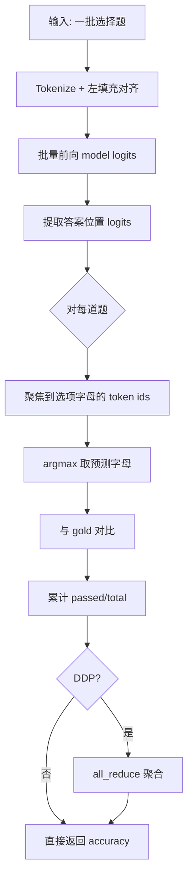
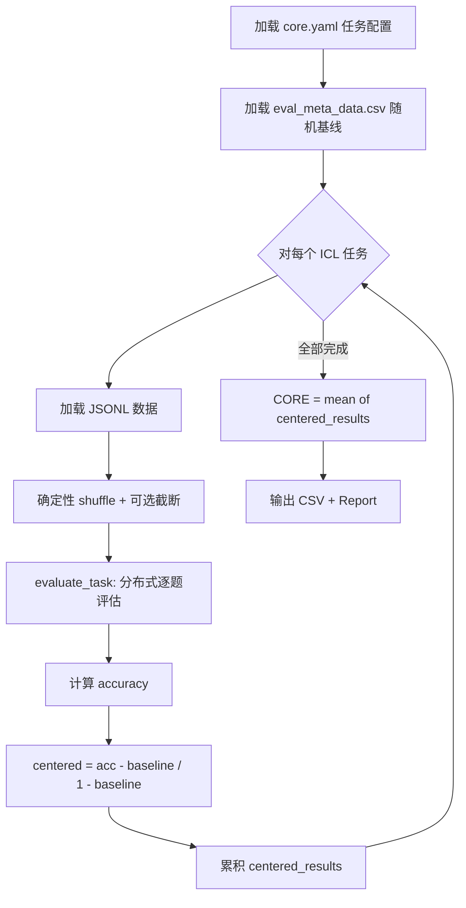

# PD-07.20 nanochat — 多维度模型质量评估体系

> 文档编号：PD-07.20
> 来源：nanochat `scripts/chat_eval.py` `nanochat/core_eval.py` `scripts/base_eval.py`
> GitHub：https://github.com/karpathy/nanochat.git
> 问题域：PD-07 质量检查 Quality Assurance
> 状态：可复用方案

---

## 第 1 章 问题与动机

### 1.1 核心问题

训练一个 LLM 后，如何系统性地评估其质量？这不是一个单一指标能回答的问题。Base 模型需要评估语言建模能力（BPB）和 in-context learning 能力（CORE），Chat 模型需要评估多任务能力（ARC/MMLU/GSM8K/HumanEval/SpellingBee）。不同任务的评估方式截然不同——选择题可以批量并行用 logits 判断，开放式生成题必须逐题采样再验证。更关键的是，不同基准的随机基线不同（选择题 25%，开放题 0%），直接平均 accuracy 会被选择题"稀释"，需要一个归一化指标来公平对比。

nanochat 的评估体系直面这些问题：用 DCLM CORE 评估 base 模型，用 ChatCORE 评估 chat 模型，两者都基于 centered accuracy 归一化，消除随机基线差异。

### 1.2 nanochat 的解法概述

1. **双轨评估入口**：`base_eval.py` 评估 base 模型（CORE + BPB + 采样），`chat_eval.py` 评估 chat 模型（6 任务 + ChatCORE）—— `scripts/base_eval.py:180`, `scripts/chat_eval.py:159`
2. **双模式评估循环**：categorical 模式批量前向取 logits argmax，generative 模式逐题采样生成 —— `scripts/chat_eval.py:90`, `scripts/chat_eval.py:31`
3. **统一 Task 抽象**：所有基准继承 `Task` 基类，通过 `eval_type` 属性声明评估模式 —— `tasks/common.py:10`
4. **Centered Accuracy 归一化**：`(acc - baseline) / (1 - baseline)` 消除随机基线差异，CORE/ChatCORE 均基于此 —— `scripts/chat_eval.py:247`, `scripts/base_eval.py:164`
5. **分布式聚合**：`torch.distributed.all_reduce` 跨 GPU 汇总结果，支持 `torchrun` 多卡并行评估 —— `nanochat/core_eval.py:257`

### 1.3 设计思想

| 设计原则 | 具体实现 | 理由 | 替代方案 |
|----------|----------|------|----------|
| 评估模式二分法 | categorical vs generative 两种循环 | 选择题可批量并行（效率高），生成题必须逐题采样（准确性） | 统一用生成模式（慢且不必要） |
| 随机基线归一化 | centered accuracy = (acc - baseline) / (1 - baseline) | 4 选 1 的 25% 基线和开放题 0% 基线不可直接平均 | 直接平均 accuracy（不公平） |
| Task 多态 | 基类定义 eval_type/evaluate 接口，子类实现 | 新增基准只需实现一个类 | 硬编码 if-else 分支 |
| 沙箱执行 | multiprocessing + reliability_guard 隔离 HumanEval 代码 | LLM 生成代码可能有破坏性行为 | 直接 exec（危险） |
| 分布式透明 | 评估循环内 stride 分配 + all_reduce 聚合 | 单卡和多卡代码路径一致 | 手动分片 + 文件汇总 |

---

## 第 2 章 源码实现分析

### 2.1 架构概览

nanochat 的评估系统分为三层：入口脚本层、评估循环层、任务实现层。

```
┌─────────────────────────────────────────────────────────────┐
│                     入口脚本层                                │
│  base_eval.py          chat_eval.py                         │
│  (CORE + BPB + Sample)  (6 Tasks + ChatCORE)                │
├─────────────────────────────────────────────────────────────┤
│                     评估循环层                                │
│  run_categorical_eval()    run_generative_eval()            │
│  (批量 logits argmax)       (逐题采样 + evaluate)            │
│                                                             │
│  evaluate_task()           evaluate_bpb()                   │
│  (CORE ICL 评估)           (Bits-per-Byte)                  │
├─────────────────────────────────────────────────────────────┤
│                     任务实现层                                │
│  Task (基类)                                                 │
│  ├── ARC        (categorical, 选择题)                        │
│  ├── MMLU       (categorical, 选择题)                        │
│  ├── GSM8K      (generative, 数学推理)                       │
│  ├── HumanEval  (generative, 代码生成)                       │
│  └── SpellingBee(generative, 字母计数)                       │
├─────────────────────────────────────────────────────────────┤
│                     基础设施层                                │
│  Engine (生成引擎)  execution.py (沙箱)  report.py (报告)     │
│  torch.distributed (分布式聚合)                              │
└─────────────────────────────────────────────────────────────┘
```

### 2.2 核心实现

#### 2.2.1 Categorical 评估循环（批量 logits 判断）



对应源码 `scripts/chat_eval.py:90-155`：

```python
def run_categorical_eval(task_object, tokenizer, model, batch_size, max_problems=None):
    ddp, ddp_rank, ddp_local_rank, ddp_world_size = get_dist_info()
    device = model.get_device()
    bos = tokenizer.get_bos_token_id()

    num_problems = len(task_object) if max_problems is None else min(len(task_object), max_problems)
    num_batches = -(-num_problems // batch_size)  # ceil_div

    letter_to_id_cache = {}  # 缓存字母→token id 映射
    num_passed, total = 0, 0
    for i in range(ddp_rank, num_batches, ddp_world_size):  # stride 分配
        i0, i1 = i * batch_size, min((i + 1) * batch_size, num_problems)
        conversations = [task_object[ii] for ii in range(i0, i1)]
        prompt_ids = [tokenizer.render_for_completion(c) for c in conversations]
        # 左填充对齐 + 批量前向
        max_length = max(len(ids) for ids in prompt_ids)
        padded_prompt_ids = [ids + [bos] * (max_length - len(ids)) for ids in prompt_ids]
        prompt_ids = torch.tensor(padded_prompt_ids, dtype=torch.long, device=device)
        with torch.no_grad():
            logits = model(prompt_ids)  # (B, T, V)
        # 聚焦到选项字母的 logits
        for idx, conversation in enumerate(conversations):
            letters = conversation['letters']
            letter_ids = [letter_to_id_cache.setdefault(l, tokenizer.encode(l)[0]) for l in letters]
            answer_pos = len(prompt_ids[idx]) - 1 - (max_length - len(conversations))
            focus_logits = logits[idx, answer_pos, letter_ids]
            predicted_letter = letters[focus_logits.argmax(dim=-1).item()]
            outcome = task_object.evaluate(conversation, predicted_letter)
            num_passed += int(outcome)
            total += 1
    # 分布式聚合
    if ddp:
        num_passed_tensor = torch.tensor([num_passed], dtype=torch.long, device=device)
        total_tensor = torch.tensor([total], dtype=torch.long, device=device)
        dist.all_reduce(num_passed_tensor, op=dist.ReduceOp.SUM)
        dist.all_reduce(total_tensor, op=dist.ReduceOp.SUM)
        num_passed, total = num_passed_tensor.item(), total_tensor.item()
    return num_passed / total
```

关键设计点：
- **字母 token 缓存** (`letter_to_id_cache`)：避免重复 tokenize 相同字母，`scripts/chat_eval.py:102`
- **logits 聚焦**：不是让模型自由生成，而是只看选项字母对应的 logits，大幅降低评估难度 —— `scripts/chat_eval.py:135`
- **stride 分配**：`range(ddp_rank, num_batches, ddp_world_size)` 实现零通信的任务分配 —— `scripts/chat_eval.py:104`

#### 2.2.2 CORE 评估（ICL 多任务 + Centered Accuracy）



对应源码 `scripts/base_eval.py:109-175`：

```python
def evaluate_core(model, tokenizer, device, max_per_task=-1):
    # 加载 YAML 配置和随机基线
    config_path = os.path.join(eval_bundle_dir, "core.yaml")
    with open(config_path, 'r', encoding='utf-8') as f:
        config = yaml.safe_load(f)
    tasks = config['icl_tasks']

    random_baselines = {}
    with open(eval_meta_data, 'r', encoding='utf-8') as f:
        reader = csv.DictReader(f)
        for row in reader:
            random_baselines[row['Eval Task']] = float(row['Random baseline'])

    results, centered_results = {}, {}
    for task in tasks:
        label = task['label']
        task_meta = {
            'task_type': task['icl_task_type'],
            'dataset_uri': task['dataset_uri'],
            'num_fewshot': task['num_fewshot'][0],
            'continuation_delimiter': task.get('continuation_delimiter', ' ')
        }
        # 确定性 shuffle 保证可复现
        shuffle_rng = random.Random(1337)
        shuffle_rng.shuffle(data)
        accuracy = evaluate_task(model, tokenizer, data, device, task_meta)
        # Centered accuracy 归一化
        random_baseline = random_baselines[label]
        centered_result = (accuracy - 0.01 * random_baseline) / (1.0 - 0.01 * random_baseline)
        centered_results[label] = centered_result

    core_metric = sum(centered_results.values()) / len(centered_results)
    return {"results": results, "centered_results": centered_results, "core_metric": core_metric}
```

### 2.3 实现细节

#### 2.3.1 三种 ICL 任务类型的 Prompt 渲染

`nanochat/core_eval.py` 支持三种 ICL 任务类型，每种有不同的 prompt 构造和正确性判断逻辑：

| 任务类型 | Prompt 结构 | 正确性判断 | 代表基准 |
|----------|------------|-----------|---------|
| `multiple_choice` | 共同前缀 + 不同选项后缀 | 哪个选项的 continuation loss 最低 | ARC, MMLU |
| `schema` | 不同上下文前缀 + 共同后缀 | 哪个上下文的 continuation loss 最低 | Winograd |
| `language_modeling` | 完整 prompt vs 截断 prompt | argmax 预测是否完全匹配 continuation | HellaSwag |

关键技巧在 `find_common_length()` (`nanochat/core_eval.py:86-101`)：通过检测 token 序列的公共前缀/后缀长度，精确定位 continuation 的起止位置，避免手动计算偏移。

#### 2.3.2 HumanEval 沙箱执行

HumanEval 评估需要执行 LLM 生成的 Python 代码。nanochat 通过 `execution.py` 提供进程级沙箱：

- **进程隔离**：`multiprocessing.Process` 独立进程执行，崩溃不影响主进程 —— `nanochat/execution.py:313`
- **超时保护**：`signal.ITIMER_REAL` + 进程级 `join(timeout)` 双重超时 —— `nanochat/execution.py:69`, `nanochat/execution.py:318`
- **内存限制**：`resource.setrlimit` 限制 256MB —— `nanochat/execution.py:150`
- **危险函数禁用**：`os.kill`, `os.system`, `shutil.rmtree`, `subprocess.Popen` 等全部置 None —— `nanochat/execution.py:165-201`

#### 2.3.3 ChatCORE 综合指标

`scripts/chat_eval.py:240-250` 实现了 ChatCORE 指标，与 DCLM CORE 思路一致：

```python
baseline_accuracies = {
    'ARC-Easy': 0.25, 'ARC-Challenge': 0.25, 'MMLU': 0.25,
    'GSM8K': 0.0, 'HumanEval': 0.0, 'SpellingBee': 0.0,
}
# centered accuracy 消除随机基线差异
for task_name, acc in results.items():
    baseline_acc = baseline_accuracies.get(task_name, 0.0)
    centered_acc = (acc - baseline_acc) / (1.0 - baseline_acc)
    centered_mean += centered_acc
chatcore_metric = centered_mean / len(results)
```

这样 ChatCORE 范围是 0（随机水平）到 1（完美），不同类型任务的贡献权重公平。

#### 2.3.4 BPB（Bits per Byte）评估

`nanochat/loss_eval.py:9-65` 实现了 tokenizer 无关的语言建模质量指标：

- 不用 perplexity（依赖 vocab size），而用 bits per byte（依赖 UTF-8 字节数）
- 每个 token 的 loss 按其 UTF-8 字节长度加权：`total_nats / (log(2) * total_bytes)`
- 特殊 token（BOS 等）的 byte 长度为 0，自动排除
- 支持 `ignore_index=-1` 的 masked token 处理

---

## 第 3 章 迁移指南

### 3.1 迁移清单

**阶段 1：Task 抽象层**
- [ ] 定义 `Task` 基类，包含 `eval_type`、`__len__`、`__getitem__`、`evaluate` 接口
- [ ] 实现 `TaskMixture` 和 `TaskSequence` 用于训练数据组合
- [ ] 为每个评估基准实现具体 Task 子类

**阶段 2：双模式评估循环**
- [ ] 实现 `run_categorical_eval`：批量前向 + logits 聚焦 + argmax
- [ ] 实现 `run_generative_eval`：逐题采样 + evaluate 回调
- [ ] 添加分布式支持：stride 分配 + all_reduce 聚合

**阶段 3：综合指标**
- [ ] 定义每个基准的随机基线
- [ ] 实现 centered accuracy 归一化
- [ ] 计算 CORE/ChatCORE 综合指标

**阶段 4：报告系统**
- [ ] 实现 Report 类，支持分段日志 + 最终汇总
- [ ] 集成环境信息（Git、GPU、系统）
- [ ] 输出 CSV + Markdown 报告

### 3.2 适配代码模板

以下是一个可直接复用的 Task 基类和 centered accuracy 计算模板：

```python
"""可复用的评估框架模板，基于 nanochat 的设计。"""
import random
from abc import ABC, abstractmethod
from typing import Literal
import torch
import torch.distributed as dist


class EvalTask(ABC):
    """评估任务基类。"""

    def __init__(self, start=0, stop=None, step=1):
        self.start, self.stop, self.step = start, stop, step

    @property
    @abstractmethod
    def eval_type(self) -> Literal['generative', 'categorical']:
        ...

    @abstractmethod
    def num_examples(self) -> int:
        ...

    @abstractmethod
    def get_example(self, index: int) -> dict:
        ...

    @abstractmethod
    def evaluate(self, conversation: dict, response) -> bool:
        ...

    def __len__(self):
        stop = self.num_examples() if self.stop is None else self.stop
        return -( -(stop - self.start) // self.step )

    def __getitem__(self, index: int):
        return self.get_example(self.start + index * self.step)


def centered_accuracy(accuracies: dict[str, float], baselines: dict[str, float]) -> float:
    """
    计算 centered accuracy 综合指标。
    消除不同基准的随机基线差异，使 0=随机水平，1=完美。

    Args:
        accuracies: {"task_name": accuracy} 各任务原始准确率
        baselines: {"task_name": baseline} 各任务随机基线
    Returns:
        综合 centered accuracy 指标
    """
    centered_sum = 0.0
    for task, acc in accuracies.items():
        base = baselines.get(task, 0.0)
        centered_sum += (acc - base) / (1.0 - base)
    return centered_sum / len(accuracies)


def distributed_eval_loop(task: EvalTask, eval_fn, device):
    """
    分布式评估循环模板。
    自动处理 stride 分配和 all_reduce 聚合。
    """
    rank = dist.get_rank() if dist.is_initialized() else 0
    world_size = dist.get_world_size() if dist.is_initialized() else 1

    num_passed, total = 0, 0
    for i in range(rank, len(task), world_size):
        outcome = eval_fn(task[i])
        num_passed += int(outcome)
        total += 1

    if world_size > 1:
        t_passed = torch.tensor([num_passed], dtype=torch.long, device=device)
        t_total = torch.tensor([total], dtype=torch.long, device=device)
        dist.all_reduce(t_passed, op=dist.ReduceOp.SUM)
        dist.all_reduce(t_total, op=dist.ReduceOp.SUM)
        num_passed, total = t_passed.item(), t_total.item()

    return num_passed / total if total > 0 else 0.0
```

### 3.3 适用场景

| 场景 | 适用度 | 说明 |
|------|--------|------|
| 小模型训练评估 | ⭐⭐⭐ | nanochat 专为小模型设计，评估体系轻量高效 |
| 多基准综合评分 | ⭐⭐⭐ | centered accuracy 是跨基准公平对比的标准做法 |
| 分布式多卡评估 | ⭐⭐⭐ | stride + all_reduce 模式简洁可靠 |
| 代码生成评估 | ⭐⭐ | 沙箱执行可用但非生产级安全 |
| 大规模评估集群 | ⭐ | 无调度器，适合单机多卡而非多机 |

---

## 第 4 章 测试用例

```python
"""基于 nanochat 真实函数签名的测试用例。"""
import pytest
import torch
import random


class TestCenteredAccuracy:
    """测试 centered accuracy 归一化逻辑。"""

    def test_random_baseline_gives_zero(self):
        """随机水平的 accuracy 应该归一化为 0。"""
        accuracies = {'ARC-Easy': 0.25, 'MMLU': 0.25, 'GSM8K': 0.0}
        baselines = {'ARC-Easy': 0.25, 'MMLU': 0.25, 'GSM8K': 0.0}
        result = centered_accuracy(accuracies, baselines)
        assert abs(result) < 1e-6

    def test_perfect_gives_one(self):
        """完美 accuracy 应该归一化为 1。"""
        accuracies = {'ARC-Easy': 1.0, 'MMLU': 1.0, 'GSM8K': 1.0}
        baselines = {'ARC-Easy': 0.25, 'MMLU': 0.25, 'GSM8K': 0.0}
        result = centered_accuracy(accuracies, baselines)
        assert abs(result - 1.0) < 1e-6

    def test_mixed_performance(self):
        """混合表现应该在 0-1 之间。"""
        accuracies = {'ARC-Easy': 0.625, 'GSM8K': 0.5}
        baselines = {'ARC-Easy': 0.25, 'GSM8K': 0.0}
        # ARC: (0.625 - 0.25) / 0.75 = 0.5
        # GSM8K: (0.5 - 0.0) / 1.0 = 0.5
        result = centered_accuracy(accuracies, baselines)
        assert abs(result - 0.5) < 1e-6


class TestTaskAbstraction:
    """测试 Task 基类的切片和索引行为。"""

    def test_task_length(self):
        """Task 长度应正确计算。"""
        from tasks.common import Task
        class DummyTask(Task):
            eval_type = 'categorical'
            def num_examples(self): return 100
            def get_example(self, idx): return {"idx": idx}
        task = DummyTask(start=10, stop=50, step=2)
        assert len(task) == 20  # (50-10) / 2

    def test_task_getitem_maps_to_physical(self):
        """__getitem__ 应正确映射到物理索引。"""
        from tasks.common import Task
        class DummyTask(Task):
            eval_type = 'categorical'
            def num_examples(self): return 100
            def get_example(self, idx): return {"idx": idx}
        task = DummyTask(start=10, stop=50, step=2)
        assert task[0] == {"idx": 10}
        assert task[5] == {"idx": 20}


class TestFindCommonLength:
    """测试 token 序列公共前缀/后缀检测。"""

    def test_common_prefix(self):
        from nanochat.core_eval import find_common_length
        seqs = [[1, 2, 3, 4], [1, 2, 3, 5], [1, 2, 3, 6]]
        assert find_common_length(seqs, direction='left') == 3

    def test_common_suffix(self):
        from nanochat.core_eval import find_common_length
        seqs = [[10, 2, 3], [20, 2, 3], [30, 2, 3]]
        assert find_common_length(seqs, direction='right') == 2

    def test_no_common(self):
        from nanochat.core_eval import find_common_length
        seqs = [[1, 2], [3, 4]]
        assert find_common_length(seqs, direction='left') == 0


class TestGSM8KAnswerExtraction:
    """测试 GSM8K 答案提取正则。"""

    def test_extract_integer(self):
        from tasks.gsm8k import extract_answer
        assert extract_answer("The answer is #### 42") == "42"

    def test_extract_with_commas(self):
        from tasks.gsm8k import extract_answer
        assert extract_answer("#### 1,234") == "1234"

    def test_no_answer_marker(self):
        from tasks.gsm8k import extract_answer
        assert extract_answer("The answer is 42") is None

    def test_negative_number(self):
        from tasks.gsm8k import extract_answer
        assert extract_answer("#### -5") == "-5"


class TestHumanEvalCodeExtraction:
    """测试 HumanEval 代码提取。"""

    def test_extract_from_markdown_block(self):
        from tasks.humaneval import extract_program
        code = '```python\ndef foo():\n    return 42\n```'
        assert extract_program(code) == "def foo():\n    return 42"

    def test_extract_plain_code(self):
        from tasks.humaneval import extract_program
        code = "def foo():\n    return 42"
        assert extract_program(code) == "def foo():\n    return 42"
```

---

## 第 5 章 跨域关联

| 关联域 | 关系类型 | 说明 |
|--------|----------|------|
| PD-05 沙箱隔离 | 依赖 | HumanEval 评估依赖 `execution.py` 的进程级沙箱执行 LLM 生成代码 |
| PD-11 可观测性 | 协同 | `report.py` 将评估结果写入结构化报告，含环境信息、GPU 成本估算 |
| PD-12 推理增强 | 协同 | SpellingBee 任务设计了"手动计数 + Python 验证"双路推理模式，评估模型的工具使用能力 |
| PD-01 上下文管理 | 关联 | CORE 评估中 `max_seq_len` 截断处理 (`core_eval.py:198-213`) 涉及上下文窗口限制 |

---

## 第 6 章 来源文件索引

| 文件 | 行范围 | 关键实现 |
|------|--------|----------|
| `scripts/chat_eval.py` | L31-83 | `run_generative_eval` 生成式评估循环 |
| `scripts/chat_eval.py` | L90-155 | `run_categorical_eval` 分类式评估循环 |
| `scripts/chat_eval.py` | L159-179 | `run_chat_eval` 统一入口 + 任务路由 |
| `scripts/chat_eval.py` | L210-255 | ChatCORE 指标计算 + Report 日志 |
| `scripts/base_eval.py` | L109-175 | `evaluate_core` DCLM CORE 评估 |
| `scripts/base_eval.py` | L267-283 | BPB 评估调用 |
| `nanochat/core_eval.py` | L17-83 | 三种 ICL 任务的 Prompt 渲染（MC/Schema/LM） |
| `nanochat/core_eval.py` | L86-141 | `find_common_length` + `batch_sequences_*` 序列对齐 |
| `nanochat/core_eval.py` | L144-164 | `forward_model` 批量前向 + loss 计算 |
| `nanochat/core_eval.py` | L167-241 | `evaluate_example` 单题评估（三种任务类型） |
| `nanochat/core_eval.py` | L244-262 | `evaluate_task` 分布式任务评估 |
| `nanochat/loss_eval.py` | L9-65 | `evaluate_bpb` Bits-per-Byte 评估 |
| `nanochat/execution.py` | L134-209 | `reliability_guard` 沙箱安全防护 |
| `nanochat/execution.py` | L286-348 | `execute_code` 进程隔离执行入口 |
| `tasks/common.py` | L10-51 | `Task` 基类定义 |
| `tasks/common.py` | L54-86 | `TaskMixture` 混合数据集 |
| `tasks/common.py` | L112-131 | `render_mc` 选择题渲染（字母后置设计） |
| `tasks/humaneval.py` | L47-97 | HumanEval 任务 + 沙箱评估 |
| `tasks/gsm8k.py` | L37-117 | GSM8K 任务 + 工具调用解析 + reward 函数 |
| `tasks/spellingbee.py` | L115-230 | SpellingBee 任务 + 多语言模板 + 双路验证 |
| `tasks/mmlu.py` | L9-60 | MMLU 任务 + 57 学科分组 |
| `tasks/arc.py` | L9-48 | ARC 任务 + 动态选项数 |
| `nanochat/report.py` | L244-277 | `Report.log` 分段日志写入 |
| `nanochat/report.py` | L279-368 | `Report.generate` 最终报告汇总 |

---

## 第 7 章 横向对比维度

```json comparison_data
{
  "project": "nanochat",
  "dimensions": {
    "检查方式": "双模式评估循环：categorical 批量 logits + generative 逐题采样",
    "评估维度": "6 任务 + BPB + CORE/ChatCORE 综合指标",
    "评估粒度": "单题级评估 + 任务级 accuracy + 全局 centered mean",
    "迭代机制": "无迭代，单次评估出结果",
    "基准集成": "DCLM CORE + ARC/MMLU/GSM8K/HumanEval/SpellingBee",
    "并发策略": "torchrun stride 分配 + all_reduce 聚合",
    "安全防护": "进程隔离 + reliability_guard 禁用危险函数",
    "评估模型隔离": "无隔离，评估用同一模型",
    "决策归一化": "centered accuracy 消除随机基线差异",
    "配置驱动": "YAML 任务配置 + CSV 随机基线 + CLI 参数",
    "多后端支持": "HuggingFace + nanochat 原生双模型加载",
    "反馈机制": "Report 分段日志 + CSV 输出 + 最终 Markdown 汇总"
  }
}
```

### 域元数据补充

```json domain_metadata
{
  "solution_summary": "nanochat 用 categorical/generative 双模式评估循环 + centered accuracy 归一化实现 CORE/ChatCORE 多基准综合质量评分",
  "description": "模型训练全流程的多基准综合评估与归一化指标设计",
  "sub_problems": [
    "随机基线归一化：不同基准的随机猜测准确率不同，直接平均不公平",
    "Tokenizer 无关评估：BPB 按 UTF-8 字节归一化，消除 vocab size 对 perplexity 的影响",
    "选择题 logits 聚焦：只看选项字母对应的 logits 而非自由生成，降低评估噪声",
    "ICL Prompt 对齐：多选/Schema/LM 三种任务类型的 token 序列对齐与 continuation 定位",
    "RL 奖励复用：evaluate 函数同时服务评估和 RL 训练的 reward 信号"
  ],
  "best_practices": [
    "Centered accuracy 归一化后再平均：消除选择题高基线对综合指标的稀释",
    "评估模式由 Task 声明而非外部指定：eval_type 属性让评估循环自动路由",
    "字母 token 缓存避免重复 tokenize：高频操作的微优化在大规模评估中显著",
    "确定性 shuffle 保证可复现：固定种子 Random(1337) 确保子采样结果一致"
  ]
}
```
