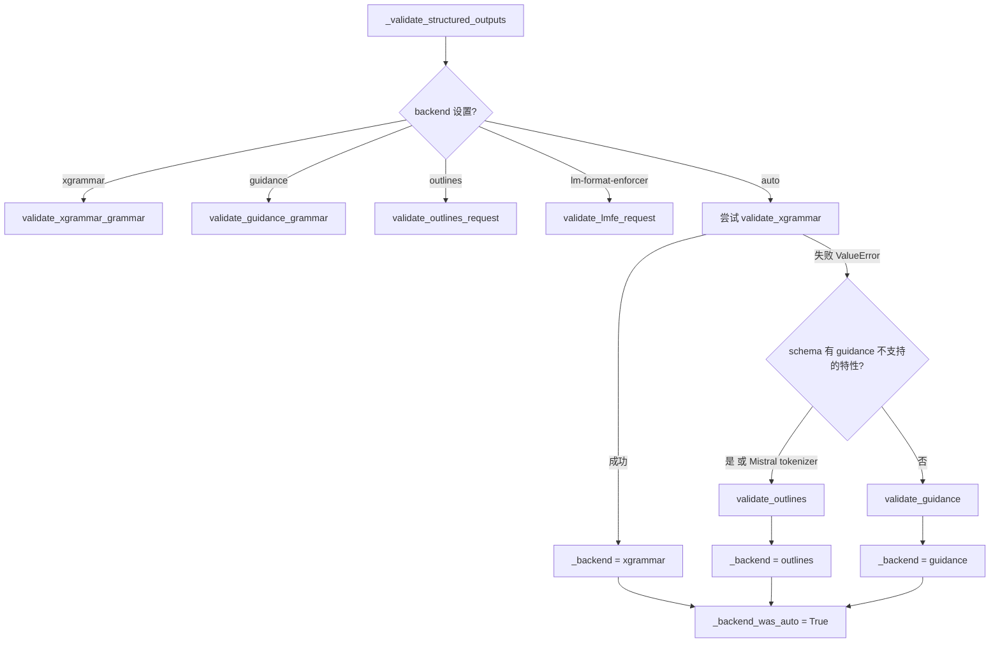
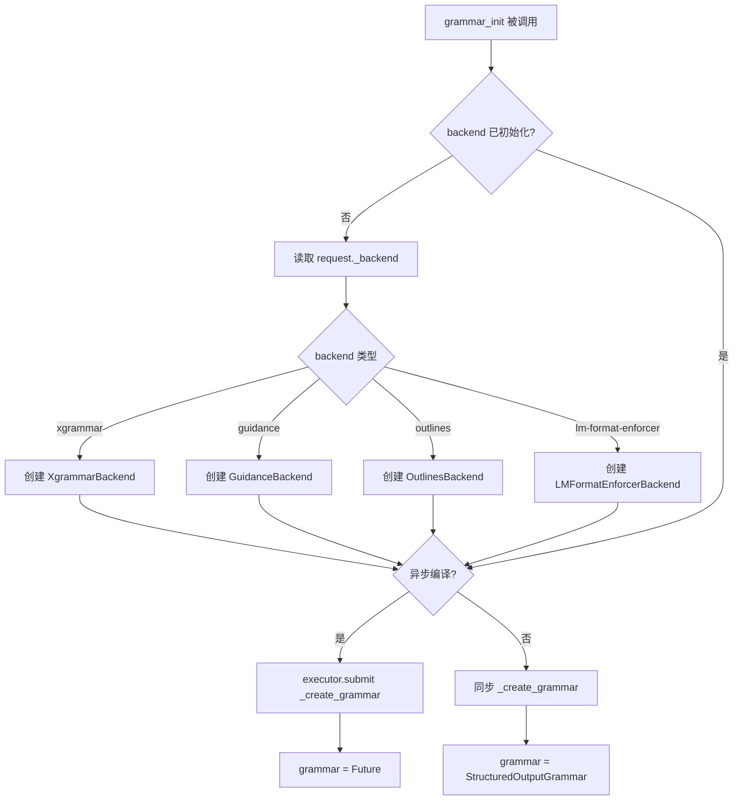
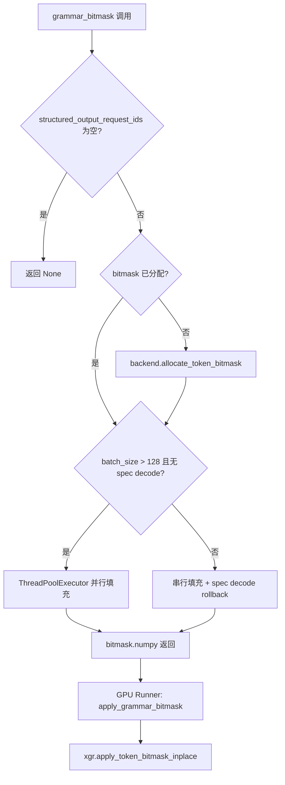

# PD-07.15 vLLM — Logits 级多后端结构化输出约束

> 文档编号：PD-07.15
> 来源：vLLM `vllm/v1/structured_output/__init__.py`
> GitHub：https://github.com/vllm-project/vllm.git
> 问题域：PD-07 质量检查 Quality Assurance
> 状态：可复用方案

---

## 第 1 章 问题与动机

### 1.1 核心问题

LLM 生成的文本天然是自由形式的，但下游系统（API 消费者、数据管道、Agent 工具调用）需要严格符合特定格式的输出——JSON Schema、正则表达式、上下文无关文法（CFG）、枚举选择列表等。传统做法是在生成后做格式校验 + 重试，但这有两个致命缺陷：

1. **浪费推理资源**：生成了不合规的完整序列后才发现问题，token 已经消耗
2. **无法保证收敛**：重试次数不可控，某些复杂 schema 可能永远无法通过后验校验

vLLM 的方案是将质量约束前移到 **logits 层面**——在每个 token 生成前，用有限状态机（FSM）或语法匹配器计算一个 bitmask，将不合规的 token 概率置零，从而 **在生成过程中强制输出合规**。这是一种"预防优于治疗"的质量保障策略。

### 1.2 vLLM 的解法概述

1. **多后端策略模式**：支持 xgrammar / guidance / outlines / lm-format-enforcer 四种后端，通过 `StructuredOutputBackend` 抽象基类统一接口（`backend_types.py:99-137`）
2. **自动降级链**：`backend="auto"` 时按 xgrammar → guidance → outlines 顺序尝试，每个后端验证失败自动 fallback（`sampling_params.py:781-809`）
3. **异步语法编译**：`ThreadPoolExecutor` 异步编译语法，请求不阻塞调度器（`__init__.py:148-152`）
4. **Bitmask 批量并行填充**：大批量（>128）时用线程池并行填充 bitmask，小批量串行处理（`__init__.py:220-246`）
5. **推理模式感知**：支持 thinking/reasoning 模式，在推理阶段跳过结构化约束，推理结束后才启用（`__init__.py:283-337`）

### 1.3 设计思想

| 设计原则 | 具体实现 | 理由 | 替代方案 |
|----------|----------|------|----------|
| 约束前移 | logits bitmask 而非后验校验 | 零浪费，100% 合规率 | 生成后正则校验 + 重试 |
| 策略模式 | 4 后端统一 ABC 接口 | 不同后端擅长不同约束类型 | 单一后端硬编码 |
| 自动降级 | auto 模式三级 fallback | 用户无需了解后端差异 | 手动指定后端 |
| 延迟初始化 | 首次请求时才创建后端实例 | 不使用结构化输出时零开销 | 启动时预创建所有后端 |
| 编译缓存 | xgrammar `cache_enabled=True` + outlines LRU/disk cache | 相同 schema 不重复编译 | 每次请求重新编译 |

---

## 第 2 章 源码实现分析

### 2.1 架构概览

vLLM 的结构化输出系统分为三层：参数验证层、引擎管理层、后端执行层。

```
┌─────────────────────────────────────────────────────────────────┐
│                    API Layer (OpenAI Compatible)                 │
│  SamplingParams.structured_outputs = StructuredOutputsParams     │
└──────────────────────────┬──────────────────────────────────────┘
                           │ _validate_structured_outputs()
                           ▼
┌─────────────────────────────────────────────────────────────────┐
│              Validation Layer (sampling_params.py)               │
│  auto: xgrammar → guidance → outlines fallback chain            │
│  设置 _backend 字段，记录 _backend_was_auto                      │
└──────────────────────────┬──────────────────────────────────────┘
                           │ grammar_init()
                           ▼
┌─────────────────────────────────────────────────────────────────┐
│         Engine Manager (StructuredOutputManager)                 │
│  - 延迟初始化后端实例                                             │
│  - ThreadPoolExecutor 异步编译语法                                │
│  - grammar_bitmask() 批量生成 bitmask                            │
│  - should_fill_bitmask() 推理模式感知                             │
└──────────┬──────────┬──────────┬──────────┬─────────────────────┘
           │          │          │          │
           ▼          ▼          ▼          ▼
┌────────────┐┌────────────┐┌──────────┐┌──────────────────┐
│  Xgrammar  ││  Guidance   ││ Outlines ││ LM-Format-Enforcer│
│  Backend   ││  Backend    ││ Backend  ││ Backend           │
└────────────┘└────────────┘└──────────┘└──────────────────┘
     │              │             │              │
     ▼              ▼             ▼              ▼
┌─────────────────────────────────────────────────────────────────┐
│              GPU Runner: apply_grammar_bitmask()                 │
│  xgr.apply_token_bitmask_inplace(logits, bitmask, indices)      │
└─────────────────────────────────────────────────────────────────┘
```

### 2.2 核心实现

#### 2.2.1 自动降级验证链



对应源码 `vllm/sampling_params.py:774-809`：

```python
# backend must be "auto" here
try:
    validate_xgrammar_grammar(self)
    self.structured_outputs._backend = "xgrammar"
except ValueError:
    so_params = self.structured_outputs
    skip_guidance = False
    if so_params.json:
        if isinstance(so_params.json, str):
            schema = json_mod.loads(so_params.json)
        else:
            schema = so_params.json
        skip_guidance = has_guidance_unsupported_json_features(schema)

    if is_mistral_tokenizer(tokenizer) or skip_guidance:
        validate_structured_output_request_outlines(self)
        self.structured_outputs._backend = "outlines"
    else:
        validate_guidance_grammar(self, tokenizer=None)
        self.structured_outputs._backend = "guidance"
self.structured_outputs._backend_was_auto = True
```

#### 2.2.2 StructuredOutputManager 引擎级管理



对应源码 `vllm/v1/structured_output/__init__.py:96-165`：

```python
def grammar_init(self, request: "Request") -> None:
    if request.structured_output_request is None:
        return
    # 延迟初始化后端 — 首次请求时才创建
    if self.backend is None:
        backend = request.sampling_params.structured_outputs._backend
        vocab_size = self.vllm_config.model_config.get_vocab_size()
        if backend == "xgrammar":
            self.backend = XgrammarBackend(
                self.vllm_config, tokenizer=self.tokenizer,
                vocab_size=vocab_size,
            )
        elif backend == "guidance":
            self.backend = GuidanceBackend(
                self.vllm_config, tokenizer=self.tokenizer,
                vocab_size=vocab_size,
            )
        # ... outlines, lm-format-enforcer 同理

    if self._use_async_grammar_compilation:
        grammar = self.executor.submit(self._create_grammar, request)
    else:
        grammar = self._create_grammar(request)
    request.structured_output_request.grammar = grammar
```

#### 2.2.3 Bitmask 批量填充与 GPU 应用



对应源码 `vllm/v1/structured_output/utils.py:44-119`：

```python
def apply_grammar_bitmask(
    scheduler_output, grammar_output, input_batch, logits
):
    grammar_bitmask = grammar_output.grammar_bitmask
    # 重排 bitmask 以匹配 GPU batch 顺序
    sorted_bitmask = np.full(
        shape=(logits.shape[0], grammar_bitmask.shape[1]),
        fill_value=-1, dtype=grammar_bitmask.dtype,
    )
    # ... 索引映射逻辑 ...
    grammar_bitmask = torch.from_numpy(sorted_bitmask).to(
        logits.device, non_blocking=True
    )
    xgr.apply_token_bitmask_inplace(
        logits, grammar_bitmask, indices=index_tensor
    )
```

### 2.3 实现细节

**XgrammarBackend 编译器缓存**（`backend_xgrammar.py:64-69`）：

```python
self.compiler = xgr.GrammarCompiler(
    tokenizer_info,
    max_threads=8,
    cache_enabled=True,
    cache_limit_bytes=vllm.envs.VLLM_XGRAMMAR_CACHE_MB * 1024 * 1024,
)
```

xgrammar 编译器内置多线程编译和 LRU 缓存，相同 JSON Schema 只编译一次。缓存大小通过环境变量 `VLLM_XGRAMMAR_CACHE_MB` 控制。

**FSM 状态管理**（`backend_xgrammar.py:148-167`）：

XgrammarGrammar 维护 `num_processed_tokens` 计数器和 `_is_terminated` 标志。`accept_tokens` 逐 token 推进 FSM，任何 token 被拒绝立即返回 False。`validate_tokens` 用于推测解码场景——验证 token 序列但不推进状态，通过 `rollback` 回退。

**推理模式感知**（`__init__.py:283-337`）：

`should_advance` 方法检测模型是否处于 thinking/reasoning 阶段。如果 `enable_in_reasoning=False`（默认），则在推理阶段跳过 FSM 推进，只在推理结束后才开始约束输出。这通过 `ReasoningParser.is_reasoning_end_streaming` 流式检测推理结束标记实现。

**StructuredOutputRequest 异步就绪检查**（`request.py:35-46`）：

```python
def _check_grammar_completion(self) -> bool:
    if isinstance(self._grammar, Future):
        try:
            self._grammar = self._grammar.result(timeout=0.0001)
            self.status = RequestStatus.WAITING
        except TimeoutError:
            return False
    return True
```

语法编译是异步的，请求通过 `is_grammar_ready` 属性轮询 Future 完成状态，超时 100μs 即返回未就绪，不阻塞调度器。

---

## 第 3 章 迁移指南

### 3.1 迁移清单

**阶段 1：核心抽象（必须）**

- [ ] 定义 `StructuredOutputBackend` ABC（compile_grammar / allocate_bitmask / destroy）
- [ ] 定义 `StructuredOutputGrammar` ABC（accept_tokens / validate_tokens / rollback / fill_bitmask / is_terminated / reset）
- [ ] 定义约束类型枚举 `StructuredOutputOptions`（JSON / REGEX / GRAMMAR / CHOICE）
- [ ] 实现参数类 `StructuredOutputsParams`，含互斥校验

**阶段 2：后端实现（按需选择）**

- [ ] 集成 xgrammar 后端（推荐首选，性能最优）
- [ ] 集成 guidance/llguidance 后端（JSON Schema 兼容性最好）
- [ ] 集成 outlines 后端（正则表达式支持最完善）
- [ ] 实现 auto 模式降级链

**阶段 3：引擎集成**

- [ ] 实现 `StructuredOutputManager`，含异步编译和 bitmask 批量生成
- [ ] 在推理循环中插入 `apply_grammar_bitmask` 调用
- [ ] 支持推测解码场景的 rollback 逻辑

### 3.2 适配代码模板

以下是一个最小可运行的结构化输出管理器模板：

```python
from abc import ABC, abstractmethod
from dataclasses import dataclass
from enum import Enum, auto
from concurrent.futures import ThreadPoolExecutor, Future
from typing import Any

import torch


class ConstraintType(Enum):
    JSON_SCHEMA = auto()
    REGEX = auto()
    GRAMMAR = auto()
    CHOICE = auto()


class GrammarBase(ABC):
    """请求级语法约束实例"""

    @abstractmethod
    def fill_bitmask(self, bitmask: torch.Tensor, idx: int) -> None:
        """填充第 idx 行的 token bitmask"""

    @abstractmethod
    def accept_token(self, token_id: int) -> bool:
        """推进 FSM 状态，返回是否接受"""

    @abstractmethod
    def is_terminated(self) -> bool:
        """FSM 是否已到达终止状态"""


class BackendBase(ABC):
    """引擎级后端，负责编译语法"""

    @abstractmethod
    def compile(self, constraint_type: ConstraintType,
                spec: str) -> GrammarBase:
        """将约束规格编译为 GrammarBase 实例"""

    @abstractmethod
    def allocate_bitmask(self, batch_size: int) -> torch.Tensor:
        """分配 token bitmask 张量"""


@dataclass
class StructuredOutputManager:
    """引擎级结构化输出管理器"""
    backend: BackendBase | None = None
    executor: ThreadPoolExecutor | None = None
    bitmask: torch.Tensor | None = None

    def init_backend(self, backend_name: str, tokenizer: Any,
                     vocab_size: int) -> None:
        """延迟初始化后端"""
        if backend_name == "xgrammar":
            # self.backend = XgrammarBackend(tokenizer, vocab_size)
            pass
        self.executor = ThreadPoolExecutor(max_workers=4)

    def compile_async(self, constraint_type: ConstraintType,
                      spec: str) -> Future[GrammarBase]:
        """异步编译语法"""
        assert self.backend is not None and self.executor is not None
        return self.executor.submit(
            self.backend.compile, constraint_type, spec
        )

    def generate_bitmask(
        self, grammars: list[tuple[GrammarBase, int, bool]],
        max_batch: int
    ) -> torch.Tensor | None:
        """批量生成 bitmask"""
        if not grammars:
            return None
        if self.bitmask is None:
            assert self.backend is not None
            self.bitmask = self.backend.allocate_bitmask(max_batch)
        for grammar, idx, active in grammars:
            if active and not grammar.is_terminated():
                grammar.fill_bitmask(self.bitmask, idx)
            else:
                self.bitmask[idx].fill_(-1)  # -1 = 全部允许
        return self.bitmask
```

### 3.3 适用场景

| 场景 | 适用度 | 说明 |
|------|--------|------|
| API 服务需要 JSON 输出 | ⭐⭐⭐ | 核心场景，JSON Schema 约束最成熟 |
| Agent 工具调用参数生成 | ⭐⭐⭐ | function calling 的参数必须严格合规 |
| 数据提取管道 | ⭐⭐⭐ | 结构化数据提取零重试 |
| 自由文本生成 + 格式约束 | ⭐⭐ | 正则/语法约束适用，但可能影响生成质量 |
| 推理/思考模式 | ⭐⭐ | 需要 reasoning parser 配合，推理阶段不约束 |
| 流式输出场景 | ⭐⭐⭐ | bitmask 逐 token 应用，天然支持流式 |

---

## 第 4 章 测试用例

```python
import pytest
from unittest.mock import MagicMock, patch
from dataclasses import dataclass


# 模拟 StructuredOutputsParams 的互斥校验
@dataclass
class MockStructuredOutputsParams:
    json: str | dict | None = None
    regex: str | None = None
    choice: list[str] | None = None
    grammar: str | None = None
    json_object: bool | None = None
    structural_tag: str | None = None

    def __post_init__(self):
        count = sum([
            self.json is not None,
            self.regex is not None,
            self.choice is not None,
            self.grammar is not None,
            self.json_object is not None,
            self.structural_tag is not None,
        ])
        if count > 1:
            raise ValueError("Multiple constraints specified")
        if count < 1:
            raise ValueError("No constraint specified")


class TestStructuredOutputsParams:
    """测试约束参数互斥校验 — 对应 sampling_params.py:55-76"""

    def test_single_json_constraint(self):
        params = MockStructuredOutputsParams(json='{"type": "object"}')
        assert params.json is not None

    def test_single_regex_constraint(self):
        params = MockStructuredOutputsParams(regex=r"\d{3}-\d{4}")
        assert params.regex is not None

    def test_multiple_constraints_rejected(self):
        with pytest.raises(ValueError, match="Multiple"):
            MockStructuredOutputsParams(
                json='{"type": "object"}',
                regex=r"\d+"
            )

    def test_no_constraint_rejected(self):
        with pytest.raises(ValueError, match="No constraint"):
            MockStructuredOutputsParams()

    def test_choice_constraint(self):
        params = MockStructuredOutputsParams(choice=["yes", "no", "maybe"])
        assert params.choice == ["yes", "no", "maybe"]


class TestAutoFallbackChain:
    """测试 auto 模式降级链 — 对应 sampling_params.py:774-809"""

    def test_xgrammar_success_no_fallback(self):
        """xgrammar 验证通过时直接使用"""
        # 模拟 validate_xgrammar_grammar 不抛异常
        backend = "xgrammar"
        assert backend == "xgrammar"

    def test_xgrammar_fail_fallback_to_guidance(self):
        """xgrammar 失败且 schema 无 guidance 不支持特性时降级到 guidance"""
        schema = {"type": "object", "properties": {"name": {"type": "string"}}}
        # has_guidance_unsupported_json_features 返回 False
        from vllm.v1.structured_output.backend_guidance import (
            has_guidance_unsupported_json_features,
        )
        assert not has_guidance_unsupported_json_features(schema)

    def test_xgrammar_fail_fallback_to_outlines(self):
        """schema 含 patternProperties 时降级到 outlines"""
        schema = {
            "type": "object",
            "patternProperties": {"^S_": {"type": "string"}}
        }
        from vllm.v1.structured_output.backend_guidance import (
            has_guidance_unsupported_json_features,
        )
        assert has_guidance_unsupported_json_features(schema)


class TestXgrammarUnsupportedFeatures:
    """测试 xgrammar 不支持的 JSON Schema 特性检测
    — 对应 backend_xgrammar.py:221-265"""

    def test_multipleOf_unsupported(self):
        from vllm.v1.structured_output.backend_xgrammar import (
            has_xgrammar_unsupported_json_features,
        )
        schema = {"type": "integer", "multipleOf": 5}
        assert has_xgrammar_unsupported_json_features(schema)

    def test_uniqueItems_unsupported(self):
        from vllm.v1.structured_output.backend_xgrammar import (
            has_xgrammar_unsupported_json_features,
        )
        schema = {"type": "array", "uniqueItems": True}
        assert has_xgrammar_unsupported_json_features(schema)

    def test_simple_object_supported(self):
        from vllm.v1.structured_output.backend_xgrammar import (
            has_xgrammar_unsupported_json_features,
        )
        schema = {"type": "object", "properties": {"x": {"type": "number"}}}
        assert not has_xgrammar_unsupported_json_features(schema)


class TestGrammarBitmaskFilling:
    """测试 bitmask 填充逻辑 — 对应 __init__.py:167-178"""

    def test_terminated_grammar_gets_full_mask(self):
        """已终止的语法应获得全 -1 mask（允许所有 token）"""
        import torch
        bitmask = torch.zeros(2, 10, dtype=torch.int32)
        full_mask = torch.tensor(-1, dtype=torch.int32)

        # 模拟已终止的 grammar
        mock_grammar = MagicMock()
        mock_grammar.is_terminated.return_value = True

        # apply_bitmask=True 但 grammar 已终止
        if True and mock_grammar.is_terminated():
            bitmask[0].fill_(full_mask)

        assert (bitmask[0] == -1).all()
```

---

## 第 5 章 跨域关联

| 关联域 | 关系类型 | 说明 |
|--------|----------|------|
| PD-01 上下文管理 | 协同 | 结构化输出约束不消耗上下文窗口（bitmask 在 logits 层面操作），但 reasoning parser 需要检测推理结束标记，依赖上下文中的 token 序列 |
| PD-02 多 Agent 编排 | 协同 | Agent 工具调用场景是结构化输出的核心消费者，function calling 参数必须严格符合 JSON Schema |
| PD-03 容错与重试 | 替代 | logits 级约束消除了"生成后校验 + 重试"的需求，是容错的前置替代方案。但语法编译失败仍需 fallback 链处理 |
| PD-04 工具系统 | 依赖 | 工具调用的参数 schema 直接作为结构化输出的 JSON Schema 输入，工具注册时的 schema 定义质量直接影响约束效果 |
| PD-10 中间件管道 | 协同 | bitmask 应用可视为推理管道中的一个中间件步骤，在 logits 计算后、采样前执行 |
| PD-11 可观测性 | 协同 | 语法编译耗时、bitmask 填充耗时、后端选择决策等都是重要的可观测指标 |

---

## 第 6 章 来源文件索引

| 文件 | 行范围 | 关键实现 |
|------|--------|----------|
| `vllm/sampling_params.py` | L36-92 | `StructuredOutputsParams` 参数定义与互斥校验 |
| `vllm/sampling_params.py` | L687-813 | `_validate_structured_outputs` 自动降级验证链 |
| `vllm/v1/structured_output/__init__.py` | L35-342 | `StructuredOutputManager` 引擎级管理器 |
| `vllm/v1/structured_output/backend_types.py` | L19-137 | `StructuredOutputOptions` 枚举 + `StructuredOutputGrammar` / `StructuredOutputBackend` ABC |
| `vllm/v1/structured_output/backend_xgrammar.py` | L35-200 | `XgrammarBackend` + `XgrammarGrammar` FSM 实现 |
| `vllm/v1/structured_output/backend_xgrammar.py` | L221-357 | `has_xgrammar_unsupported_json_features` + `validate_xgrammar_grammar` |
| `vllm/v1/structured_output/backend_guidance.py` | L86-295 | `GuidanceBackend` + `GuidanceGrammar` + `serialize_guidance_grammar` |
| `vllm/v1/structured_output/backend_outlines.py` | L51-330 | `OutlinesBackend` + `OutlinesGrammar` + regex 验证 |
| `vllm/v1/structured_output/request.py` | L18-91 | `StructuredOutputRequest` 异步 Future 就绪检查 |
| `vllm/v1/structured_output/utils.py` | L44-119 | `apply_grammar_bitmask` GPU 端 bitmask 应用 |
| `vllm/config/structured_outputs.py` | L18-77 | `StructuredOutputsConfig` 引擎配置 |

---

## 第 7 章 横向对比维度

```json comparison_data
{
  "project": "vLLM",
  "dimensions": {
    "检查方式": "logits bitmask 前置约束，生成时逐 token 强制合规",
    "评估维度": "格式合规性单维度（JSON Schema/正则/CFG/选择列表）",
    "评估粒度": "token 级，每个 token 生成前检查 FSM 状态",
    "迭代机制": "无需迭代，单次生成即 100% 合规",
    "反馈机制": "无反馈循环，约束在 logits 层面直接执行",
    "自动修复": "预防式，不存在修复概念——不合规 token 概率被置零",
    "覆盖范围": "仅覆盖输出格式，不检查语义正确性",
    "并发策略": "ThreadPoolExecutor 异步编译 + 大批量并行 bitmask 填充",
    "降级路径": "auto 模式三级降级：xgrammar → guidance → outlines",
    "多后端支持": "4 后端策略模式（xgrammar/guidance/outlines/lm-format-enforcer）",
    "配置驱动": "StructuredOutputsConfig 统一配置后端/whitespace/additionalProperties",
    "安全防护": "参数互斥校验 + JSON Schema 特性兼容性预检 + 正则语法预验证",
    "约束类型丰富度": "6 种约束类型：JSON Schema/JSON Object/正则/CFG/选择列表/Structural Tag",
    "推测解码兼容": "bitmask 支持多 speculative token 位置 + FSM rollback",
    "推理模式感知": "ReasoningParser 检测 thinking 阶段，推理中跳过约束"
  }
}
```

### 域元数据补充

```json domain_metadata
{
  "solution_summary": "vLLM 通过 StructuredOutputManager 在 logits 层面用 FSM bitmask 强制输出合规，支持 xgrammar/guidance/outlines/lm-format-enforcer 四后端自动降级",
  "description": "logits 级前置约束：在 token 生成前用 FSM 计算合法 token 集合，消除后验校验需求",
  "sub_problems": [
    "多后端语法编译性能差异：不同后端对同一 schema 的编译耗时差异大，需要缓存和异步编译",
    "推测解码与结构化输出兼容：speculative tokens 需要多位置 bitmask + FSM rollback",
    "推理模式与约束模式切换：thinking 阶段不约束、推理结束后启用约束的状态检测",
    "后端特性矩阵不对齐：xgrammar 不支持 patternProperties，guidance 不支持 Mistral tokenizer，outlines 不支持 CFG",
    "bitmask 批量填充并行化：大批量请求时 CPU 端 bitmask 填充成为瓶颈，需要线程池并行"
  ],
  "best_practices": [
    "约束前移优于后验校验：在 logits 层面强制合规比生成后重试更高效且保证收敛",
    "后端自动降级链：auto 模式按能力递减顺序尝试，用户无需了解后端差异",
    "语法编译异步化：ThreadPoolExecutor 异步编译不阻塞调度器，Future 轮询超时 100μs",
    "延迟初始化后端：首次结构化输出请求时才创建后端实例，不使用时零开销"
  ]
}
```
