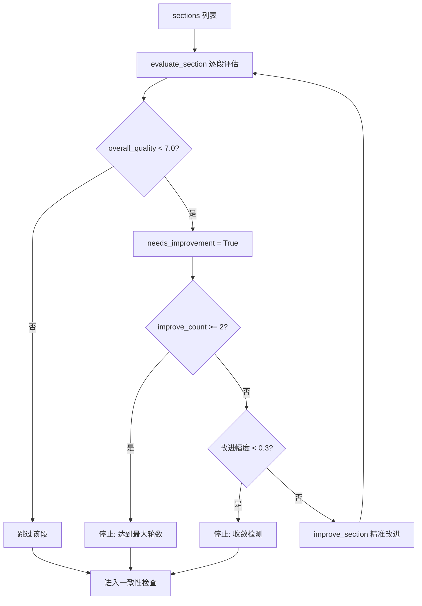
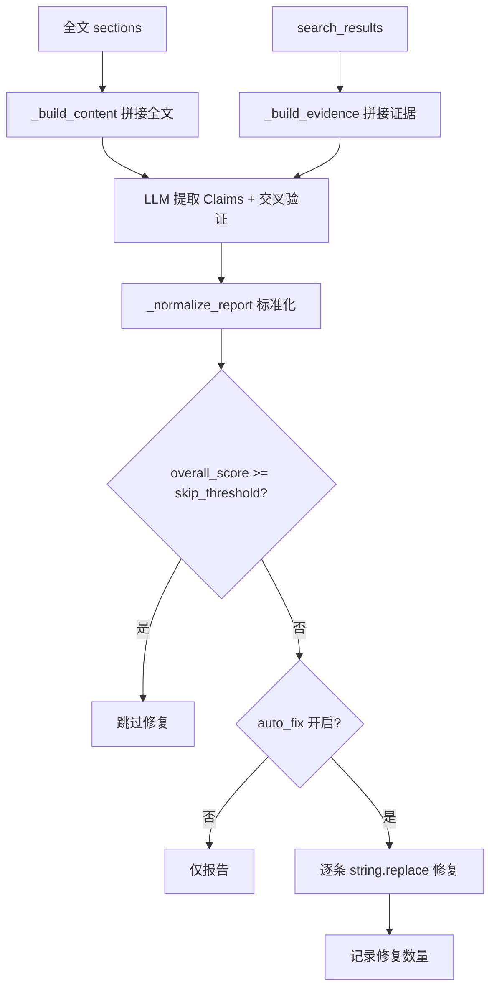

# PD-07.07 vibe-blog — 多层质量保障与 Generator-Critic 循环

> 文档编号：PD-07.07
> 来源：vibe-blog `backend/services/blog_generator/agents/reviewer.py`, `factcheck.py`, `questioner.py`, `humanizer.py`
> GitHub：https://github.com/datawhalechina/vibe-blog.git
> 问题域：PD-07 质量检查 Quality Assurance
> 状态：可复用方案

---

## 第 1 章 问题与动机

### 1.1 核心问题

LLM 生成的长文博客面临多维质量风险：结构不完整（大纲要点遗漏）、事实错误（与搜索证据矛盾）、深度不足（泛泛而谈）、语气不一致（多章节拼接后人称/正式度漂移）、AI 写作痕迹明显（固定句式、AI 词汇）。单一 Reviewer 无法覆盖所有维度，且"自评"效果差——同一个 LLM 既生成又审核，容易自我确认偏差。

vibe-blog 的核心洞察是：**质量保障必须分层、分角色、分阶段**，每层专注一个维度，形成纵深防御。

### 1.2 vibe-blog 的解法概述

vibe-blog 实现了 **6 层质量保障管线**，按执行顺序：

1. **段落级 Generator-Critic Loop**（`questioner.evaluate_section` → `writer.improve_section`）：4 维度评分，< 7 分的段落精准改进，收敛检测防止无限循环 — `generator.py:600-711`
2. **叙事一致性检查**（`ThreadCheckerAgent`）：跨章节承诺兑现、术语一致、过渡自然度 — `thread_checker.py:46-129`
3. **语气统一检查**（`VoiceCheckerAgent`）：人称、正式度、自称、句式多样性 — `voice_checker.py:47-113`
4. **结构审核**（`ReviewerAgent`）：骨架模式审核结构完整性 + Verbatim 数据 + 学习目标覆盖 — `reviewer.py:41-224`
5. **事实核查**（`FactCheckAgent`）：全文 Claim 提取 → 搜索证据交叉验证 → 自动修复 — `factcheck.py:105-194`
6. **AI 痕迹去除**（`HumanizerAgent`）：先评分后改写，占位符完整性验证，重试闭环 — `humanizer.py:70-349`

### 1.3 设计思想

| 设计原则 | 具体实现 | 理由 | 替代方案 |
|----------|----------|------|----------|
| 角色分离 | 6 个独立 Agent 各司其职 | 避免单一 LLM 自评偏差，每个 Agent 有专属 prompt | 单一 Reviewer 全覆盖（效果差） |
| 分层纵深 | 段落级→跨章节→全文→事实→风格，逐层收窄 | 先修内容再修形式，避免修了格式又改内容 | 所有检查并行（修复冲突） |
| StyleProfile 驱动 | 所有检查的开关/轮数/策略由 StyleProfile 统一配置 | mini 模式 1 轮 correct_only，long 模式 5 轮 full_revise | 硬编码 if/else（44 处散落） |
| 环境变量双开关 | `_is_enabled(env_flag, style_flag)` 两者 AND | 运维可全局关闭，产品可按套餐关闭 | 只用环境变量（不够灵活） |
| 降级优先 | 每个 Agent 异常时返回默认通过，不阻塞管线 | 增强节点失败不应阻塞核心流程 | 异常中断整个生成 |

---

## 第 2 章 源码实现分析

### 2.1 架构概览

vibe-blog 的质量保障管线嵌入在 LangGraph DAG 中，形成两个循环和一条直线管线：

```
┌─────────────────────────────────────────────────────────────────────┐
│                    vibe-blog 质量保障管线                             │
│                                                                     │
│  ┌──────────┐    ┌──────────┐    ┌──────────┐                      │
│  │ Questioner│───→│ Evaluate │───→│ Improve  │──┐                  │
│  │(深度检查) │    │ (Critic) │    │(Generator)│  │ Loop 1:          │
│  └──────────┘    └──────────┘    └──────────┘  │ 段落级            │
│       ↑               │              │          │ (max 2 轮)        │
│       │               │ 收敛/达标     │          │                   │
│       └───────────────┘──────────────┘──────────┘                   │
│                        ↓                                            │
│  ┌──────────────────────────────────────────┐                      │
│  │ Consistency Check (并行)                  │                      │
│  │  ├─ ThreadChecker (叙事一致性)            │                      │
│  │  └─ VoiceChecker  (语气统一)              │                      │
│  └──────────────────────────────────────────┘                      │
│                        ↓                                            │
│  ┌──────────┐    ┌──────────┐                                      │
│  │ Reviewer  │───→│ Revision │──┐  Loop 2:                         │
│  │(结构审核) │    │ (修订)   │  │  审核-修订                        │
│  └──────────┘    └──────────┘  │  (max 1~5 轮)                     │
│       ↑               │        │                                    │
│       └───────────────┘────────┘                                    │
│                        ↓                                            │
│  ┌──────────┐  ┌──────────┐  ┌──────────┐                         │
│  │ FactCheck│─→│TextCleanup│─→│Humanizer │  直线管线               │
│  │(事实核查)│  │(正则清理) │  │(去AI味)  │  (各自独立)             │
│  └──────────┘  └──────────┘  └──────────┘                         │
└─────────────────────────────────────────────────────────────────────┘
```

### 2.2 核心实现

#### 2.2.1 段落级 Generator-Critic Loop



对应源码 `backend/services/blog_generator/questioner.py:122-200` — Critic 角色的 4 维度评估：

```python
class QuestionerAgent:
    def evaluate_section(
        self,
        section_content: str,
        section_title: str = "",
        prev_summary: str = "",
        next_preview: str = "",
        **kwargs
    ) -> Dict[str, Any]:
        """多维度段落评估（Generator-Critic Loop 的 Critic 角色）"""
        # 4 维度：信息密度、逻辑连贯、专业深度、表达质量
        default_result = {
            "scores": {
                "information_density": 7,
                "logical_coherence": 7,
                "professional_depth": 7,
                "expression_quality": 7,
            },
            "overall_quality": 7.0,
            "specific_issues": [],
            "improvement_suggestions": [],
        }
        # ... LLM 调用 + JSON 解析 + 异常降级
        scores = result.get("scores", default_result["scores"])
        score_values = [v for v in scores.values() if isinstance(v, (int, float))]
        overall = result.get(
            "overall_quality",
            round(sum(score_values) / max(len(score_values), 1), 1),
        )
```

收敛检测逻辑 `generator.py:653-674`：

```python
def _should_improve_sections(self, state: SharedState) -> str:
    improve_count = state.get("section_improve_count", 0)
    if improve_count >= 2:
        return "continue"  # 最大 2 轮
    # 收敛检测：改进幅度 < 0.3 则停止
    curr_avg = sum(e["overall_quality"] for e in evaluations) / max(len(evaluations), 1)
    prev_avg = state.get("prev_section_avg_score", 0)
    if prev_avg > 0 and (curr_avg - prev_avg) < 0.3:
        return "continue"  # 收敛
    return "improve"
```

#### 2.2.2 事实核查与自动修复



对应源码 `backend/services/blog_generator/agents/factcheck.py:134-194`：

```python
class FactCheckAgent:
    def run(self, state: Dict[str, Any]) -> Dict[str, Any]:
        all_content = _build_content(sections)
        all_evidence = _build_evidence(search_results)
        report = self.check(all_content, all_evidence)
        state['factcheck_report'] = report

        if overall_score >= self.skip_threshold:  # 默认 4/5
            return state  # 跳过修复

        # 自动修复：逐条替换矛盾内容
        section_map = {s.get('id', ''): s for s in sections}
        for fix in report.get('fix_instructions', []):
            sid = fix.get('section_id', '')
            section = section_map.get(sid)
            original = fix.get('original', '')
            if original and original in section.get('content', ''):
                section['content'] = section['content'].replace(
                    original, fix.get('replacement', '')
                )
```

### 2.3 实现细节

#### Reviewer 骨架模式审核

ReviewerAgent 不传全文给 LLM（太长），而是构建"结构骨架"：提取每章的子标题列表 + 字数统计，让 LLM 判断结构完整性。同时在 Python 侧预检 Verbatim 数据——已在全文中出现的项直接跳过，避免 LLM 因看不到全文而误报。

关键代码 `reviewer.py:126-183`：骨架构建 + Verbatim 预检。

#### Humanizer 两步流程 + 占位符保护

HumanizerAgent 先轻量评分（0-50），超过阈值（默认 40）跳过改写。改写采用 diff 替换模式（old→new），应用后验证 `{source_NNN}` 占位符完整性——如果改写丢失了引用占位符，立即回退到原始内容。改写后重新评分，< 35 分则重试。

关键代码 `humanizer.py:153-282`：完整的 score→rewrite→apply→validate→rescore→retry 流程。

#### 一致性检查并行执行

ThreadChecker 和 VoiceChecker 通过 `ParallelTaskExecutor` 并行执行，结果合并到 `review_issues`，与 Reviewer 的 issues 格式兼容（统一的 `section_id + issue_type + severity + description + suggestion` 结构）。

关键代码 `generator.py:940-981`。

---

## 第 3 章 迁移指南

### 3.1 迁移清单

**阶段 1：核心 Generator-Critic Loop（必选）**
- [ ] 实现 `evaluate_section()` — 4 维度评分 + 结构化反馈
- [ ] 实现 `improve_section()` — 基于 critique 的精准改进
- [ ] 实现收敛检测（改进幅度 < 阈值 OR 轮次上限）
- [ ] 在管线中串联 evaluate → should_improve → improve 循环

**阶段 2：结构审核 + 修订（推荐）**
- [ ] 实现 ReviewerAgent — 骨架模式审核 + Verbatim 预检
- [ ] 实现双策略修订（correct_only / full_revise）
- [ ] 实现 `_should_revise()` 路由逻辑

**阶段 3：增强检查（可选）**
- [ ] FactCheckAgent — Claim 提取 + 证据交叉验证 + 自动修复
- [ ] ThreadChecker + VoiceChecker — 一致性并行检查
- [ ] HumanizerAgent — AI 痕迹评分 + diff 改写 + 占位符保护

**阶段 4：配置化（推荐）**
- [ ] StyleProfile 统一管理所有检查的开关/轮数/策略
- [ ] 环境变量双开关机制

### 3.2 适配代码模板

Generator-Critic Loop 的最小可运行实现：

```python
from dataclasses import dataclass
from typing import Dict, Any, List

@dataclass
class EvaluationResult:
    scores: Dict[str, float]
    overall_quality: float
    specific_issues: List[str]
    improvement_suggestions: List[str]

class SectionCritic:
    """段落评估器（Critic 角色）"""
    def __init__(self, llm_client):
        self.llm = llm_client

    def evaluate(self, content: str, title: str = "") -> EvaluationResult:
        prompt = f"""评估以下章节内容，输出 JSON：
标题: {title}
内容: {content}

评分维度（1-10）：information_density, logical_coherence, professional_depth, expression_quality
输出: {{"scores": {{}}, "overall_quality": float, "specific_issues": [], "improvement_suggestions": []}}"""
        response = self.llm.chat(
            messages=[{"role": "user", "content": prompt}],
            response_format={"type": "json_object"},
        )
        result = json.loads(response)
        scores = result.get("scores", {})
        score_values = [v for v in scores.values() if isinstance(v, (int, float))]
        overall = round(sum(score_values) / max(len(score_values), 1), 1)
        return EvaluationResult(
            scores=scores,
            overall_quality=result.get("overall_quality", overall),
            specific_issues=result.get("specific_issues", []),
            improvement_suggestions=result.get("improvement_suggestions", []),
        )

class SectionImprover:
    """段落改进器（Generator 角色）"""
    def __init__(self, llm_client):
        self.llm = llm_client

    def improve(self, content: str, critique: EvaluationResult, title: str = "") -> str:
        issues_text = "\n".join(f"- {i}" for i in critique.specific_issues)
        suggestions_text = "\n".join(f"- {s}" for s in critique.improvement_suggestions)
        prompt = f"""改进以下章节，只修改有问题的部分，保持其余不变。
标题: {title}
原文: {content}
问题: {issues_text}
建议: {suggestions_text}
直接输出改进后的完整章节内容。"""
        return self.llm.chat(messages=[{"role": "user", "content": prompt}])

def generator_critic_loop(
    sections: List[Dict[str, Any]],
    critic: SectionCritic,
    improver: SectionImprover,
    quality_threshold: float = 7.0,
    max_rounds: int = 2,
    convergence_delta: float = 0.3,
) -> List[Dict[str, Any]]:
    """段落级 Generator-Critic 循环"""
    prev_avg = 0.0
    for round_num in range(max_rounds):
        evaluations = []
        needs_improvement = False
        for section in sections:
            eval_result = critic.evaluate(section["content"], section.get("title", ""))
            evaluations.append(eval_result)
            if eval_result.overall_quality < quality_threshold:
                needs_improvement = True

        if not needs_improvement:
            break

        curr_avg = sum(e.overall_quality for e in evaluations) / max(len(evaluations), 1)
        if prev_avg > 0 and (curr_avg - prev_avg) < convergence_delta:
            break  # 收敛检测
        prev_avg = curr_avg

        for section, evaluation in zip(sections, evaluations):
            if evaluation.overall_quality < quality_threshold:
                section["content"] = improver.improve(
                    section["content"], evaluation, section.get("title", "")
                )
    return sections
```

### 3.3 适用场景

| 场景 | 适用度 | 说明 |
|------|--------|------|
| 长文博客/报告生成 | ⭐⭐⭐ | 多章节内容最需要分层质量保障 |
| 教育内容生成 | ⭐⭐⭐ | Verbatim 数据 + 学习目标覆盖检查特别有用 |
| 新闻/资讯生成 | ⭐⭐⭐ | FactCheck 事实核查是核心需求 |
| 短文/摘要生成 | ⭐⭐ | mini 模式 1 轮 correct_only 即可 |
| 代码生成 | ⭐ | 需要替换为 AST 级别的检查，LLM 评分不适用 |

---

## 第 4 章 测试用例

```python
import json
import pytest
from unittest.mock import MagicMock, patch

# === FactCheckAgent 测试 ===

class TestFactCheckAgent:
    def setup_method(self):
        self.llm = MagicMock()
        from backend.services.blog_generator.agents.factcheck import FactCheckAgent
        self.agent = FactCheckAgent(self.llm)

    def test_supported_claim_no_fix(self):
        """全部 SUPPORTED 时不触发修复"""
        self.llm.chat.return_value = json.dumps({
            "score": 5,
            "claims": [{"id": 1, "text": "Python 是解释型语言", "sid": "s1", "v": "S"}],
            "fixes": []
        })
        state = {
            "sections": [{"id": "s1", "title": "简介", "content": "Python 是解释型语言"}],
            "search_results": [{"title": "Python Wiki", "content": "Python is interpreted"}]
        }
        result = self.agent.run(state)
        assert result["factcheck_report"]["supported"] == 1
        assert result["factcheck_report"]["contradicted"] == 0

    def test_contradicted_claim_auto_fix(self):
        """CONTRADICTED 时自动替换"""
        self.llm.chat.return_value = json.dumps({
            "score": 2,
            "claims": [{"id": 1, "text": "地球是平的", "sid": "s1", "v": "C"}],
            "fixes": [{"sid": "s1", "old": "地球是平的", "new": "地球是球形的"}]
        })
        state = {
            "sections": [{"id": "s1", "title": "地理", "content": "地球是平的，这是常识"}],
            "search_results": [{"title": "NASA", "content": "Earth is a sphere"}]
        }
        result = self.agent.run(state)
        assert "地球是球形的" in result["sections"][0]["content"]

    def test_high_score_skip_fix(self):
        """评分 >= skip_threshold 时跳过修复"""
        self.agent.skip_threshold = 4
        self.llm.chat.return_value = json.dumps({
            "score": 4, "claims": [], "fixes": [{"sid": "s1", "old": "a", "new": "b"}]
        })
        state = {"sections": [{"id": "s1", "content": "a"}], "search_results": []}
        result = self.agent.run(state)
        assert result["sections"][0]["content"] == "a"  # 未修复

# === QuestionerAgent 评估测试 ===

class TestQuestionerEvaluate:
    def setup_method(self):
        self.llm = MagicMock()
        from backend.services.blog_generator.agents.questioner import QuestionerAgent
        self.agent = QuestionerAgent(self.llm)

    def test_low_score_triggers_improvement(self):
        """低分段落标记为需改进"""
        self.llm.chat.return_value = json.dumps({
            "scores": {"information_density": 5, "logical_coherence": 6,
                       "professional_depth": 4, "expression_quality": 6},
            "overall_quality": 5.25,
            "specific_issues": ["缺少具体数据支撑"],
            "improvement_suggestions": ["添加统计数据"]
        })
        result = self.agent.evaluate_section("泛泛而谈的内容", "测试章节")
        assert result["overall_quality"] < 7.0
        assert len(result["specific_issues"]) > 0

    def test_empty_response_defaults_pass(self):
        """空响应降级为默认通过"""
        self.llm.chat.return_value = ""
        result = self.agent.evaluate_section("任意内容")
        assert result["overall_quality"] == 7.0

# === 收敛检测测试 ===

class TestConvergenceDetection:
    def test_convergence_stops_loop(self):
        """改进幅度 < 0.3 时停止循环"""
        prev_avg = 6.8
        curr_avg = 7.0  # 改进 0.2 < 0.3
        assert (curr_avg - prev_avg) < 0.3

    def test_max_rounds_stops_loop(self):
        """达到最大轮数时停止"""
        improve_count = 2
        max_rounds = 2
        assert improve_count >= max_rounds
```


---

## 第 5 章 跨域关联

| 关联域 | 关系类型 | 说明 |
|--------|----------|------|
| PD-01 上下文管理 | 协同 | Reviewer 骨架模式通过压缩全文为结构骨架来节省 token；Humanizer 的 diff 替换模式也避免传输全文 |
| PD-02 多 Agent 编排 | 依赖 | 6 层质量管线的执行顺序由 LangGraph DAG 编排，一致性检查通过 ParallelTaskExecutor 并行 |
| PD-03 容错与重试 | 协同 | 每个 Agent 异常时降级为默认通过（不阻塞管线）；Humanizer 有 max_retries 重试机制 |
| PD-06 记忆持久化 | 协同 | 69.05 特性记录段落评估分数和改进快照到 tracker，支持跨会话的质量趋势分析 |
| PD-08 搜索与检索 | 依赖 | FactCheck 依赖 Researcher 的 search_results 作为证据源进行交叉验证 |
| PD-10 中间件管道 | 协同 | TextCleanup 是纯正则中间件（零 LLM），与 LLM 驱动的 Agent 形成互补 |
| PD-11 可观测性 | 协同 | Langfuse observe 装饰器追踪每个 Agent 的调用；tracker 记录评分/修复统计 |

---

## 第 6 章 来源文件索引

| 文件 | 行范围 | 关键实现 |
|------|--------|----------|
| `backend/services/blog_generator/agents/questioner.py` | L44-L351 | QuestionerAgent：深度检查 + 4 维度段落评估（Critic 角色） |
| `backend/services/blog_generator/agents/reviewer.py` | L41-L224 | ReviewerAgent：骨架模式审核 + Verbatim 预检 + 自定义审核标准注入 |
| `backend/services/blog_generator/agents/factcheck.py` | L105-L194 | FactCheckAgent：Claim 提取 + 证据交叉验证 + 自动修复 |
| `backend/services/blog_generator/agents/humanizer.py` | L70-L349 | HumanizerAgent：AI 痕迹评分 + diff 改写 + 占位符保护 + 重试 |
| `backend/services/blog_generator/agents/thread_checker.py` | L46-L129 | ThreadCheckerAgent：叙事一致性 6 维度检查 |
| `backend/services/blog_generator/agents/voice_checker.py` | L47-L113 | VoiceCheckerAgent：语气统一 6 维度检查 |
| `backend/services/blog_generator/generator.py` | L600-L711 | 段落级 Generator-Critic Loop（evaluate → should_improve → improve） |
| `backend/services/blog_generator/generator.py` | L812-L922 | 修订节点：correct_only / full_revise 双策略 |
| `backend/services/blog_generator/generator.py` | L940-L981 | 一致性检查并行执行（ThreadChecker + VoiceChecker） |
| `backend/services/blog_generator/generator.py` | L1010-L1061 | FactCheck + TextCleanup + Humanizer 直线管线 |
| `backend/services/blog_generator/generator.py` | L1115-L1142 | _should_revise 路由逻辑（StyleProfile 驱动） |
| `backend/services/blog_generator/style_profile.py` | L13-L193 | StyleProfile：统一配置所有检查的开关/轮数/策略/预设套餐 |

---

## 第 7 章 横向对比维度

```json comparison_data
{
  "project": "vibe-blog",
  "dimensions": {
    "检查方式": "6 层分角色管线：段落评估→一致性→结构审核→事实核查→正则清理→AI去痕",
    "评估维度": "4 维段落评分 + 6 维叙事一致 + 6 维语气统一 + 结构/Verbatim/学习目标",
    "评估粒度": "段落级（evaluate_section）+ 跨章节级（ThreadChecker）+ 全文级（FactCheck）",
    "迭代机制": "双循环：段落 Critic Loop(max 2轮+收敛检测) + 审核-修订 Loop(max 1~5轮)",
    "反馈机制": "结构化 JSON：specific_issues + improvement_suggestions + severity 分级",
    "自动修复": "FactCheck string.replace 修复矛盾 Claim + Humanizer diff 替换 AI 痕迹",
    "覆盖范围": "结构完整性+Verbatim+学习目标+事实+叙事一致+语气统一+AI痕迹+正则格式",
    "并发策略": "ThreadChecker+VoiceChecker 并行；Humanizer 多线程并行处理各章节",
    "降级路径": "每个 Agent 异常返回默认通过，增强节点失败不阻塞核心流程",
    "人机协作": "自定义审核标准注入(guidelines)；StyleProfile 预设套餐按需选择",
    "风格保护": "Humanizer 占位符完整性验证 + 字数变化 ±10% 告警 + 改写后重评分重试",
    "配置驱动": "StyleProfile 统一管理 + 环境变量双开关，mini/short/medium/long 4 档预设"
  }
}
```

### 域元数据补充

```json domain_metadata
{
  "solution_summary": "vibe-blog 用 6 层分角色管线实现纵深质量保障：段落级 4 维 Critic Loop + ThreadChecker/VoiceChecker 并行一致性检查 + 骨架模式 Reviewer + FactCheck 自动修复 + Humanizer 占位符保护改写，全部由 StyleProfile 统一配置",
  "description": "质量保障的分层纵深：先修内容再修形式，每层专注一个维度形成互补",
  "sub_problems": [
    "骨架模式审核：全文过长时提取结构骨架供 LLM 判断，避免 token 浪费和误判",
    "Verbatim 预检：Python 侧预过滤已存在的数据项，减少 LLM 误报",
    "占位符完整性：改写过程中引用占位符丢失的检测与回退保护",
    "改写后重评分：Humanizer 改写后重新评分，未达标则重试改写",
    "配置驱动质量等级：StyleProfile 预设套餐统一控制所有检查的开关和参数"
  ],
  "best_practices": [
    "骨架模式审核节省 token：提取子标题+字数而非全文传给 Reviewer LLM",
    "Python 侧预检减少 LLM 误报：Verbatim 数据先在代码层过滤已存在项",
    "diff 替换优于全文重写：Humanizer 输出 old→new 替换列表而非重写全文，保持上下文稳定",
    "占位符完整性验证：改写后检查 {source_NNN} 是否丢失，丢失则回退原文",
    "环境变量 AND StyleProfile 双开关：运维全局控制 + 产品按套餐控制，两者 AND 才启用"
  ]
}
```
