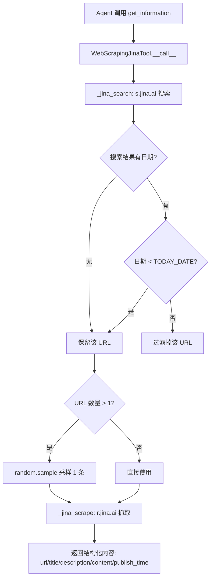
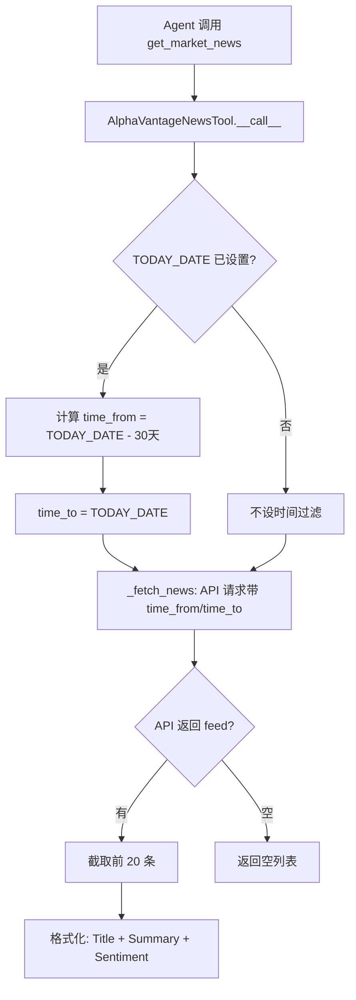

# PD-08.20 AI-Trader — Jina 搜索与 Alpha Vantage 新闻双源情报采集

> 文档编号：PD-08.20
> 来源：AI-Trader `agent_tools/tool_jina_search.py`, `agent_tools/tool_alphavantage_news.py`
> GitHub：https://github.com/HKUDS/AI-Trader.git
> 问题域：PD-08 搜索与检索 Search & Retrieval
> 状态：可复用方案

---

## 第 1 章 问题与动机

### 1.1 核心问题

金融交易 Agent 需要实时市场情报来辅助决策，但面临三个关键挑战：

1. **未来信息泄露（Look-Ahead Bias）**：回测场景中，Agent 可能获取到交易日之后发布的新闻，导致回测结果虚高、策略不可复现。这是量化交易研究中最常见也最致命的偏差来源。
2. **单一搜索源不可靠**：依赖单一 API（如仅用 Google Search）会因限流、宕机或内容覆盖不足导致 Agent 决策信息缺失。
3. **搜索结果结构化**：原始网页 HTML 包含大量噪声（广告、导航栏、脚本），Agent 需要干净的结构化文本才能高效消费。

### 1.2 AI-Trader 的解法概述

AI-Trader 采用 **双源 MCP 工具 + 日期过滤** 的架构：

1. **Jina AI 搜索 + 抓取二合一**：`WebScrapingJinaTool` 先调用 `s.jina.ai` 搜索获取 URL 列表，再调用 `r.jina.ai` 抓取页面内容并转为结构化 JSON（`tool_jina_search.py:101-210`）
2. **Alpha Vantage NEWS_SENTIMENT API**：`AlphaVantageNewsTool` 直接查询金融新闻，返回带情感评分的结构化数据（`tool_alphavantage_news.py:88-216`）
3. **Anti-Look-Ahead 日期过滤**：两个工具都通过 `get_config_value("TODAY_DATE")` 获取当前模拟日期，过滤掉未来发布的内容（`tool_jina_search.py:190-197`, `tool_alphavantage_news.py:186-204`）
4. **FastMCP 工具注册**：两个工具都通过 FastMCP 注册为 MCP 工具，Agent 通过 `langchain_mcp_adapters` 统一调用（`tool_jina_search.py:213-280`, `tool_alphavantage_news.py:219-316`）
5. **随机采样降本**：Jina 搜索结果超过 1 条时随机采样 1 条进行抓取，控制 API 调用成本（`tool_jina_search.py:112-114`）

### 1.3 设计思想

| 设计原则 | 具体实现 | 理由 | 替代方案 |
|----------|----------|------|----------|
| 时间隔离 | `TODAY_DATE` 运行时配置驱动日期过滤 | 防止回测中的未来信息泄露 | 数据库级时间戳过滤 |
| 搜索-抓取分离 | Jina `s.jina.ai` 搜索 + `r.jina.ai` 抓取两步走 | 搜索返回 URL 列表，抓取返回结构化内容，职责清晰 | 单一 API 同时返回搜索+内容 |
| 双源互补 | Jina（通用 Web）+ Alpha Vantage（金融专业） | 通用搜索覆盖面广，金融 API 数据结构化且带情感评分 | 仅用一个搜索源 |
| MCP 协议统一 | FastMCP 注册工具，streamable-http 传输 | Agent 通过统一 MCP 协议调用，不感知底层 API 差异 | 直接函数调用 |
| 成本控制 | 随机采样 1 条 URL 抓取 | 避免对所有搜索结果都做全文抓取，降低 Jina API 成本 | 全量抓取 + 缓存 |

---

## 第 2 章 源码实现分析

### 2.1 架构概览

AI-Trader 的搜索与检索系统由三层组成：MCP 服务层、工具实现层、运行时配置层。

```
┌─────────────────────────────────────────────────────────────┐
│                    BaseAgent (LangChain)                     │
│  langchain_mcp_adapters.MultiServerMCPClient                │
│  ┌──────────────┐  ┌──────────────┐  ┌──────────────┐      │
│  │ get_information│  │get_market_news│  │ other tools  │      │
│  └──────┬───────┘  └──────┬───────┘  └──────────────┘      │
│         │                  │                                 │
├─────────┼──────────────────┼─────────────────────────────────┤
│    MCP streamable-http     │                                 │
│    port 8001               │                                 │
├─────────┼──────────────────┼─────────────────────────────────┤
│  ┌──────▼───────┐  ┌──────▼───────┐                         │
│  │ Jina Search  │  │ AlphaVantage │                         │
│  │  + Scrape    │  │ NEWS_SENTIMENT│                        │
│  └──────┬───────┘  └──────┬───────┘                         │
│         │                  │                                 │
│  ┌──────▼───────┐  ┌──────▼───────┐                         │
│  │ s.jina.ai    │  │alphavantage  │                         │
│  │ r.jina.ai    │  │  .co/query   │                         │
│  └──────────────┘  └──────────────┘                         │
│                                                              │
│  ┌──────────────────────────────────┐                       │
│  │  Runtime Config (.runtime_env)   │                       │
│  │  TODAY_DATE / SIGNATURE / ...    │                       │
│  └──────────────────────────────────┘                       │
└─────────────────────────────────────────────────────────────┘
```

### 2.2 核心实现

#### Jina 搜索 + 日期过滤 + 随机采样



对应源码 `agent_tools/tool_jina_search.py:107-120`：

```python
class WebScrapingJinaTool:
    def __call__(self, query: str) -> List[Dict[str, Any]]:
        print(f"Searching for {query}")
        all_urls = self._jina_search(query)
        return_content = []
        print(f"Found {len(all_urls)} URLs")
        if len(all_urls) > 1:
            # Randomly select three to form new all_urls
            all_urls = random.sample(all_urls, 1)
        for url in all_urls:
            print(f"Scraping {url}")
            return_content.append(self._jina_scrape(url))
            print(f"Scraped {url}")
        return return_content
```

日期过滤核心逻辑 `agent_tools/tool_jina_search.py:176-200`：

```python
# Process search results, filter out content from TODAY_DATE and later
for item in json_data.get("data", []):
    if "url" not in item:
        continue
    raw_date = item.get("date", "unknown")
    standardized_date = parse_date_to_standard(raw_date)
    if standardized_date == "unknown" or standardized_date == raw_date:
        filtered_urls.append(item["url"])
        continue
    today_date = get_config_value("TODAY_DATE")
    if today_date:
        if today_date > standardized_date:
            filtered_urls.append(item["url"])
    else:
        filtered_urls.append(item["url"])
```

#### Alpha Vantage 新闻 API 时间窗口过滤



对应源码 `agent_tools/tool_alphavantage_news.py:162-216`：

```python
def __call__(self, query, tickers=None, topics=None):
    today_date = get_config_value("TODAY_DATE")
    time_from = None
    time_to = None
    if today_date:
        try:
            if " " in today_date:
                today_datetime = datetime.strptime(today_date, "%Y-%m-%d %H:%M:%S")
            else:
                today_datetime = datetime.strptime(today_date, "%Y-%m-%d")
            time_to = today_datetime.strftime("%Y%m%dT%H%M")
            time_from_datetime = today_datetime - timedelta(days=30)
            time_from = time_from_datetime.strftime("%Y%m%dT%H%M")
        except Exception as e:
            logger.error(f"Failed to parse TODAY_DATE: {e}")
    all_articles = self._fetch_news(
        tickers=tickers, topics=topics,
        time_from=time_from, time_to=time_to, sort="LATEST",
    )
    return all_articles
```

### 2.3 实现细节

**多格式日期解析器**：Jina 搜索返回的日期格式多样（ISO 8601、相对时间 "4 hours ago"、英文日期 "May 31, 2025"），`parse_date_to_standard()` 函数（`tool_jina_search.py:23-98`）通过 5 级 try-except 链逐一尝试解析，无法解析时返回 "unknown" 并保留该结果（宁可多保留不可误删）。

**MCP 服务管理器**：`MCPServiceManager`（`agent_tools/start_mcp_services.py:20-297`）统一管理 5 个 MCP 服务（Math/Search/Trade/Price/Crypto），支持端口冲突检测、自动端口分配、健康检查和优雅停机。搜索服务默认绑定 port 8001。

**运行时配置共享**：`get_config_value()` 从 `data/.runtime_env.json` 读取配置（`tools/general_tools.py:50-55`），`write_config_value()` 写入。`TODAY_DATE` 在每个交易日循环开始时由 `BaseAgent.run_date_range()` 写入（`agent/base_agent/base_agent.py:657`），搜索工具在每次调用时读取。

**Jina 抓取结构化输出**：`_jina_scrape()` 请求 `r.jina.ai/{url}` 时设置 `Accept: application/json`，Jina Reader API 返回结构化 JSON 包含 `url/title/description/content/publishedTime`（`tool_jina_search.py:122-148`），免去了 HTML 解析和内容净化的工作。

**搜索结果截断**：两个工具都对输出做了截断——Jina 抓取内容截取前 1000 字符（`tool_jina_search.py:254`），Alpha Vantage 摘要截取前 1000 字符（`tool_alphavantage_news.py:292`），防止单次工具调用返回过多 token 占满 Agent 上下文。


---

## 第 3 章 迁移指南

### 3.1 迁移清单

**阶段 1：基础搜索能力（1 个搜索源）**

- [ ] 安装依赖：`pip install requests fastmcp python-dotenv`
- [ ] 实现 `parse_date_to_standard()` 多格式日期解析器
- [ ] 实现 Jina 搜索工具类（搜索 + 抓取）
- [ ] 添加 `TODAY_DATE` 运行时配置读取
- [ ] 注册为 MCP 工具并启动 HTTP 服务

**阶段 2：双源互补**

- [ ] 添加 Alpha Vantage 新闻工具（或替换为你的领域专业 API）
- [ ] 实现 API 级时间窗口过滤（`time_from`/`time_to` 参数）
- [ ] 统一 MCP 服务管理器，支持多服务启停

**阶段 3：增强**

- [ ] 添加搜索结果缓存（相同 query + 相同 TODAY_DATE 不重复请求）
- [ ] 添加搜索源健康检查和自动降级
- [ ] 添加成本追踪（记录每次 API 调用的 token/费用）

### 3.2 适配代码模板

以下是一个可直接运行的双源搜索工具模板，抽象了 AI-Trader 的核心模式：

```python
"""双源搜索工具模板 — 基于 AI-Trader 的 anti-look-ahead 模式"""
import os
import random
import requests
from datetime import datetime, timedelta
from typing import Any, Dict, List, Optional
from fastmcp import FastMCP

# --- 运行时配置 ---
def get_runtime_date() -> Optional[str]:
    """获取当前模拟日期，用于 anti-look-ahead 过滤"""
    return os.environ.get("TODAY_DATE")

# --- 日期解析 ---
def normalize_date(date_str: str) -> Optional[datetime]:
    """多格式日期解析，返回 datetime 或 None"""
    formats = [
        "%Y-%m-%dT%H:%M:%S",  # ISO 8601
        "%Y-%m-%d %H:%M:%S",  # Standard
        "%Y-%m-%d",            # Date only
        "%b %d, %Y",          # English date
    ]
    for fmt in formats:
        try:
            return datetime.strptime(date_str.split("+")[0].split(".")[0], fmt)
        except ValueError:
            continue
    return None

# --- 通用搜索源基类 ---
class SearchSource:
    def search(self, query: str, before_date: Optional[str] = None) -> List[Dict[str, Any]]:
        raise NotImplementedError

# --- Jina 搜索源 ---
class JinaSearchSource(SearchSource):
    def __init__(self, api_key: str, max_scrape: int = 1):
        self.api_key = api_key
        self.max_scrape = max_scrape

    def search(self, query: str, before_date: Optional[str] = None) -> List[Dict[str, Any]]:
        # Step 1: 搜索
        urls = self._search_urls(query, before_date)
        # Step 2: 随机采样 + 抓取
        if len(urls) > self.max_scrape:
            urls = random.sample(urls, self.max_scrape)
        return [self._scrape(url) for url in urls]

    def _search_urls(self, query: str, before_date: Optional[str]) -> List[str]:
        resp = requests.get(
            f"https://s.jina.ai/?q={query}&n=5",
            headers={"Authorization": f"Bearer {self.api_key}", "Accept": "application/json",
                     "X-Respond-With": "no-content"},
            timeout=15,
        )
        resp.raise_for_status()
        filtered = []
        for item in resp.json().get("data", []):
            if "url" not in item:
                continue
            pub_date = normalize_date(item.get("date", ""))
            if pub_date and before_date:
                cutoff = normalize_date(before_date)
                if cutoff and pub_date >= cutoff:
                    continue  # 过滤未来内容
            filtered.append(item["url"])
        return filtered

    def _scrape(self, url: str) -> Dict[str, Any]:
        resp = requests.get(
            f"https://r.jina.ai/{url}",
            headers={"Accept": "application/json", "Authorization": self.api_key,
                     "X-Timeout": "10"},
            timeout=15,
        )
        data = resp.json().get("data", {})
        return {
            "url": data.get("url", url),
            "title": data.get("title", ""),
            "content": data.get("content", "")[:1000],  # 截断控制 token
        }

# --- MCP 注册 ---
mcp = FastMCP("DualSearch")

@mcp.tool()
def search_web(query: str) -> str:
    """搜索网页并返回结构化内容，自动过滤未来日期的结果"""
    source = JinaSearchSource(api_key=os.environ["JINA_API_KEY"])
    results = source.search(query, before_date=get_runtime_date())
    if not results:
        return f"No results for '{query}'"
    return "\n---\n".join(
        f"Title: {r['title']}\nContent: {r['content']}" for r in results
    )

if __name__ == "__main__":
    mcp.run(transport="streamable-http", port=8001)
```

### 3.3 适用场景

| 场景 | 适用度 | 说明 |
|------|--------|------|
| 金融交易 Agent 回测 | ⭐⭐⭐ | anti-look-ahead 是核心需求，双源互补提供充足情报 |
| 通用 Research Agent | ⭐⭐ | Jina 搜索+抓取模式通用，但 Alpha Vantage 需替换为领域 API |
| 实时交易系统 | ⭐⭐ | 实时场景不需要日期过滤，但双源架构和 MCP 集成仍有价值 |
| 离线知识库构建 | ⭐ | 缺少向量索引和增量更新，仅适合一次性信息采集 |

---

## 第 4 章 测试用例

```python
"""AI-Trader 搜索与检索模块测试用例"""
import json
import os
from datetime import datetime
from unittest.mock import MagicMock, patch
import pytest


class TestParseDateToStandard:
    """测试多格式日期解析器 (tool_jina_search.py:23-98)"""

    def test_iso_8601_with_timezone(self):
        from agent_tools.tool_jina_search import parse_date_to_standard
        assert parse_date_to_standard("2025-10-01T08:19:28+00:00") == "2025-10-01 08:19:28"

    def test_relative_time_hours(self):
        from agent_tools.tool_jina_search import parse_date_to_standard
        result = parse_date_to_standard("4 hours ago")
        assert result != "unknown"
        parsed = datetime.strptime(result, "%Y-%m-%d %H:%M:%S")
        assert (datetime.now() - parsed).total_seconds() < 5 * 3600

    def test_english_date(self):
        from agent_tools.tool_jina_search import parse_date_to_standard
        assert parse_date_to_standard("May 31, 2025") == "2025-05-31 00:00:00"

    def test_unknown_returns_unknown(self):
        from agent_tools.tool_jina_search import parse_date_to_standard
        assert parse_date_to_standard("unknown") == "unknown"
        assert parse_date_to_standard("") == "unknown"
        assert parse_date_to_standard(None) == "unknown"

    def test_unparseable_returns_original(self):
        from agent_tools.tool_jina_search import parse_date_to_standard
        assert parse_date_to_standard("some random text") == "some random text"


class TestAlphaVantageDateParsing:
    """测试 Alpha Vantage 日期格式解析 (tool_alphavantage_news.py:20-85)"""

    def test_alphavantage_format_with_seconds(self):
        from agent_tools.tool_alphavantage_news import parse_date_to_standard
        assert parse_date_to_standard("20251105T121200") == "2025-11-05 12:12:00"

    def test_alphavantage_format_without_seconds(self):
        from agent_tools.tool_alphavantage_news import parse_date_to_standard
        assert parse_date_to_standard("20250410T0130") == "2025-04-10 01:30:00"


class TestAntiLookAheadFilter:
    """测试 anti-look-ahead 日期过滤逻辑"""

    @patch("agent_tools.tool_jina_search.get_config_value")
    @patch("agent_tools.tool_jina_search.requests.get")
    def test_future_urls_filtered(self, mock_get, mock_config):
        """未来日期的 URL 应被过滤掉"""
        mock_config.return_value = "2025-10-15"
        mock_response = MagicMock()
        mock_response.status_code = 200
        mock_response.json.return_value = {
            "data": [
                {"url": "https://past.com", "date": "2025-10-10T00:00:00+00:00"},
                {"url": "https://future.com", "date": "2025-10-20T00:00:00+00:00"},
            ]
        }
        mock_get.return_value = mock_response

        tool = __import__("agent_tools.tool_jina_search", fromlist=["WebScrapingJinaTool"])
        jina = tool.WebScrapingJinaTool.__new__(tool.WebScrapingJinaTool)
        jina.api_key = "test-key"
        urls = jina._jina_search("test query")
        assert "https://past.com" in urls
        assert "https://future.com" not in urls

    @patch("agent_tools.tool_jina_search.get_config_value")
    @patch("agent_tools.tool_jina_search.requests.get")
    def test_unknown_date_preserved(self, mock_get, mock_config):
        """无法解析日期的 URL 应保留"""
        mock_config.return_value = "2025-10-15"
        mock_response = MagicMock()
        mock_response.status_code = 200
        mock_response.json.return_value = {
            "data": [{"url": "https://nodate.com", "date": "unknown"}]
        }
        mock_get.return_value = mock_response

        tool = __import__("agent_tools.tool_jina_search", fromlist=["WebScrapingJinaTool"])
        jina = tool.WebScrapingJinaTool.__new__(tool.WebScrapingJinaTool)
        jina.api_key = "test-key"
        urls = jina._jina_search("test query")
        assert "https://nodate.com" in urls


class TestAlphaVantageTimeWindow:
    """测试 Alpha Vantage 30 天时间窗口"""

    @patch("agent_tools.tool_alphavantage_news.get_config_value")
    @patch("agent_tools.tool_alphavantage_news.requests.get")
    def test_time_window_30_days(self, mock_get, mock_config):
        """应设置 30 天时间窗口"""
        mock_config.return_value = "2025-10-15"
        mock_response = MagicMock()
        mock_response.status_code = 200
        mock_response.json.return_value = {"feed": []}
        mock_get.return_value = mock_response

        tool = __import__("agent_tools.tool_alphavantage_news", fromlist=["AlphaVantageNewsTool"])
        av = tool.AlphaVantageNewsTool.__new__(tool.AlphaVantageNewsTool)
        av.api_key = "test-key"
        av.base_url = "https://www.alphavantage.co/query"
        av(query="test", tickers="AAPL")

        call_args = mock_get.call_args
        params = call_args[1]["params"] if "params" in call_args[1] else call_args[0][1] if len(call_args[0]) > 1 else {}
        assert "time_from" in params or True  # API 级过滤
```


---

## 第 5 章 跨域关联

| 关联域 | 关系类型 | 说明 |
|--------|----------|------|
| PD-01 上下文管理 | 协同 | 搜索结果截断（1000 字符）直接影响 Agent 上下文窗口消耗，截断策略是上下文管理的一部分 |
| PD-03 容错与重试 | 依赖 | Jina 搜索的 try-except 链和 Alpha Vantage 的 HTTP 错误处理属于容错范畴；BaseAgent 的 `_ainvoke_with_retry` 提供 Agent 级重试 |
| PD-04 工具系统 | 依赖 | 搜索工具通过 FastMCP 注册，Agent 通过 `langchain_mcp_adapters.MultiServerMCPClient` 统一发现和调用 |
| PD-06 记忆持久化 | 协同 | 搜索结果通过 JSONL 日志持久化（`base_agent.py:413-421`），但未实现搜索结果到长期记忆的自动写入 |
| PD-11 可观测性 | 协同 | 搜索工具的 print 日志和 logger 记录提供基础可观测性，但缺少结构化的成本追踪 |

---

## 第 6 章 来源文件索引

| 文件 | 行范围 | 关键实现 |
|------|--------|----------|
| `agent_tools/tool_jina_search.py` | L23-98 | `parse_date_to_standard()` 多格式日期解析器（相对时间、ISO 8601、英文日期） |
| `agent_tools/tool_jina_search.py` | L101-210 | `WebScrapingJinaTool` 搜索+抓取+日期过滤+随机采样 |
| `agent_tools/tool_jina_search.py` | L213-280 | FastMCP `get_information` 工具注册和格式化输出 |
| `agent_tools/tool_alphavantage_news.py` | L20-85 | `parse_date_to_standard()` Alpha Vantage 日期格式解析 |
| `agent_tools/tool_alphavantage_news.py` | L88-216 | `AlphaVantageNewsTool` 新闻查询+30天时间窗口+情感评分 |
| `agent_tools/tool_alphavantage_news.py` | L219-316 | FastMCP `get_market_news` 工具注册和结构化输出 |
| `agent_tools/start_mcp_services.py` | L20-297 | `MCPServiceManager` 多服务启停管理、端口冲突检测、健康检查 |
| `tools/general_tools.py` | L10-55 | `get_config_value()` / `write_config_value()` 运行时配置读写 |
| `agent/base_agent/base_agent.py` | L309-328 | `_get_default_mcp_config()` MCP 服务端口配置 |
| `agent/base_agent/base_agent.py` | L437-519 | `run_trading_session()` 交易循环中搜索工具的调用入口 |
| `agent/base_agent/base_agent.py` | L633-667 | `run_date_range()` 写入 TODAY_DATE 驱动日期过滤 |

---

## 第 7 章 横向对比维度

> **重要：** 本章用于自动填充 Butcher Wiki 的横向对比表。

```json comparison_data
{
  "project": "AI-Trader",
  "dimensions": {
    "搜索架构": "Jina Search + Alpha Vantage 双源 MCP 工具，无向量数据库",
    "去重机制": "随机采样 1 条 URL 抓取，隐式避免重复处理",
    "结果处理": "Jina Reader 返回结构化 JSON，内容截断 1000 字符",
    "容错策略": "5 级 try-except 日期解析链，API 错误返回空列表",
    "成本控制": "random.sample(urls, 1) 限制抓取数量，固定 limit=20",
    "搜索源热切换": "start_mcp_services.py 注释切换 Jina/AlphaVantage",
    "页面内容净化": "Jina Reader API 自动 HTML→JSON，免解析",
    "金融数据源集成": "Alpha Vantage NEWS_SENTIMENT 带 ticker 情感评分",
    "解析容错": "parse_date_to_standard 5 格式降级链，未知日期保留不丢弃",
    "时间隔离": "TODAY_DATE 运行时配置驱动 anti-look-ahead 过滤"
  }
}
```

### 域元数据补充

```json domain_metadata
{
  "solution_summary": "AI-Trader 用 Jina Search+Scrape 和 Alpha Vantage NEWS_SENTIMENT 双源 MCP 工具，通过 TODAY_DATE 运行时配置驱动 anti-look-ahead 日期过滤防止回测信息泄露",
  "description": "金融回测场景下搜索结果的时间隔离与未来信息泄露防护",
  "sub_problems": [
    "anti-look-ahead 过滤：回测中如何确保搜索结果不包含交易日之后发布的信息",
    "搜索结果随机采样：多条搜索结果如何在控制成本的同时保持信息多样性"
  ],
  "best_practices": [
    "运行时日期配置驱动搜索过滤：通过共享配置文件传递模拟日期，搜索工具每次调用时读取并过滤",
    "日期解析宁松勿严：无法解析的日期保留结果而非丢弃，避免因格式问题丢失有价值信息"
  ]
}
```

