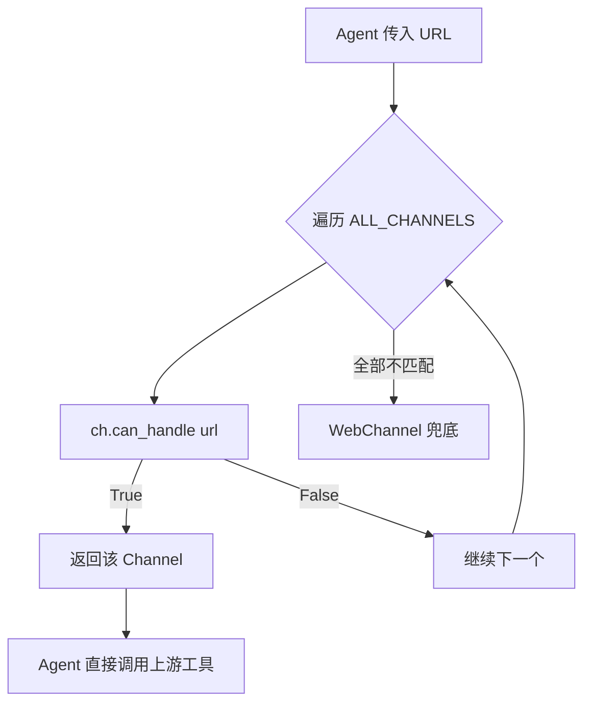
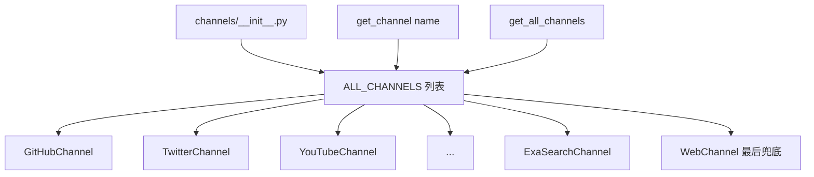
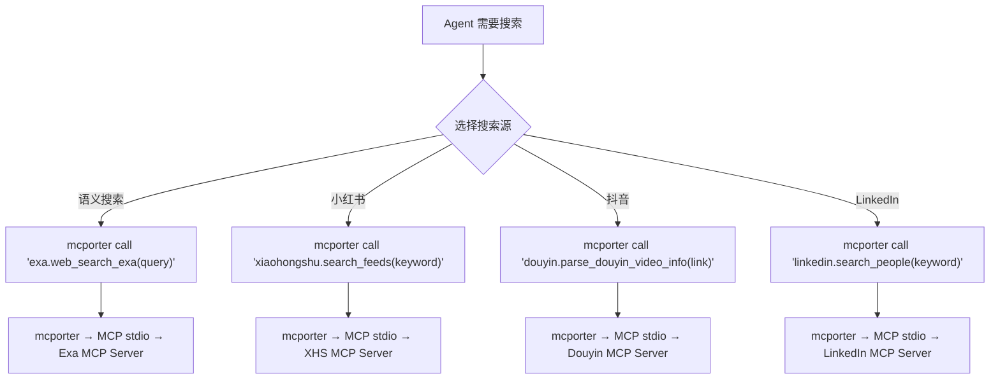

# PD-08.14 Agent-Reach — 多源 Channel 注册与 MCP 统一搜索方案

> 文档编号：PD-08.14
> 来源：Agent-Reach `agent_reach/channels/base.py` `agent_reach/channels/__init__.py` `agent_reach/doctor.py`
> GitHub：https://github.com/Panniantong/Agent-Reach.git
> 问题域：PD-08 搜索与检索 Search & Retrieval
> 状态：可复用方案

---

## 第 1 章 问题与动机

### 1.1 核心问题

AI Agent 需要从互联网获取信息，但不同平台（Twitter、Reddit、GitHub、小红书、B站等）的访问方式差异巨大：有的用 REST API，有的用 CLI 工具，有的需要 MCP 协议，有的需要 Cookie 认证。传统做法是为每个平台写一个 wrapper 层，但这导致：

1. **维护成本高**：每个平台的 API 变化都需要更新 wrapper
2. **能力受限**：wrapper 只暴露了上游工具的部分功能
3. **认证复杂**：不同平台的认证方式（API Key、Cookie、OAuth）需要统一管理
4. **可用性不确定**：Agent 不知道哪些平台当前可用，哪些需要配置

Agent Reach 的核心洞察是：**不做 wrapper，只做 installer + doctor**。让 Agent 直接调用上游工具（bird CLI、gh CLI、mcporter、yt-dlp 等），Agent Reach 只负责安装、配置检查和健康诊断。

### 1.2 Agent-Reach 的解法概述

1. **Channel 抽象层**：每个平台是一个 Channel 子类，只负责 URL 匹配和可用性检查，不负责实际读写（`agent_reach/channels/base.py:18-37`）
2. **三级 Tier 分层**：tier=0 零配置即用、tier=1 需免费 Key、tier=2 需手动配置，渐进式解锁（`agent_reach/channels/base.py:24`）
3. **mcporter 统一 MCP 调用**：Exa 语义搜索、小红书、抖音、LinkedIn、Boss直聘等平台通过 mcporter CLI 统一调用 MCP 服务（`agent_reach/channels/exa_search.py:26-30`）
4. **Doctor 健康诊断**：遍历所有 Channel 的 check() 方法，输出 ok/warn/off 三态报告，告诉 Agent 和用户当前哪些可用、哪些需要修复（`agent_reach/doctor.py:12-24`）
5. **Jina Reader 兜底**：WebChannel 的 `can_handle()` 返回 True 匹配任意 URL，作为所有平台的最终 fallback（`agent_reach/channels/web.py:14`）

### 1.3 设计思想

| 设计原则 | 具体实现 | 理由 | 替代方案 |
|----------|----------|------|----------|
| 零 wrapper 哲学 | Channel 只做 check()，不做 read()/search() | 上游工具功能完整且持续更新，wrapper 是负担 | 全量封装每个平台 API |
| 渐进式解锁 | tier 0/1/2 三级，从零配置到需手动配置 | 降低首次使用门槛，Agent 可立即获得基础能力 | 全部平台统一配置流程 |
| MCP 协议统一 | mcporter 作为 MCP 网关，统一调用 Exa/小红书/抖音等 | 一个 CLI 工具管理多个 MCP 服务端 | 每个 MCP 服务单独管理 |
| 健康诊断优先 | doctor 命令输出三态报告 + 修复建议 | Agent 可自主判断可用性并尝试修复 | 静默失败或抛异常 |
| URL 路由 + 兜底 | can_handle() 链式匹配，WebChannel 兜底 | 任何 URL 都有处理方案，不会无响应 | 不支持的 URL 直接报错 |

---

## 第 2 章 源码实现分析

### 2.1 架构概览

Agent Reach 的搜索架构是一个"安装器 + 诊断器"模式，不同于传统的搜索聚合框架：

```
┌─────────────────────────────────────────────────────────────┐
│                    Agent (Claude Code / Cursor)              │
│                                                              │
│  直接调用上游工具：                                            │
│  bird search "query"          ← Twitter 搜索                │
│  gh search repos "query"      ← GitHub 搜索                 │
│  mcporter call 'exa.web_search_exa(query: "q")'  ← Exa     │
│  curl "https://r.jina.ai/URL" ← 任意网页                    │
│  curl "https://s.jina.ai/q"   ← Web 搜索                   │
│  mcporter call 'xiaohongshu.search_feeds(...)'    ← 小红书   │
└──────────────────────┬──────────────────────────────────────┘
                       │ 安装 + 诊断
┌──────────────────────▼──────────────────────────────────────┐
│              Agent Reach (installer + doctor)                │
│                                                              │
│  ┌──────────┐  ┌──────────┐  ┌──────────┐  ┌──────────┐    │
│  │ GitHub   │  │ Twitter  │  │ YouTube  │  │ Reddit   │    │
│  │ Channel  │  │ Channel  │  │ Channel  │  │ Channel  │    │
│  │ tier=0   │  │ tier=1   │  │ tier=0   │  │ tier=1   │    │
│  │ gh CLI   │  │ bird CLI │  │ yt-dlp   │  │ JSON API │    │
│  └──────────┘  └──────────┘  └──────────┘  └──────────┘    │
│  ┌──────────┐  ┌──────────┐  ┌──────────┐  ┌──────────┐    │
│  │ Exa      │  │ XHS      │  │ Douyin   │  │ LinkedIn │    │
│  │ Channel  │  │ Channel  │  │ Channel  │  │ Channel  │    │
│  │ tier=0   │  │ tier=2   │  │ tier=2   │  │ tier=2   │    │
│  │ mcporter │  │ mcporter │  │ mcporter │  │ mcporter │    │
│  └──────────┘  └──────────┘  └──────────┘  └──────────┘    │
│  ┌──────────┐  ┌──────────┐  ┌──────────┐                  │
│  │ Bilibili │  │ RSS      │  │ Web      │ ← 兜底           │
│  │ Channel  │  │ Channel  │  │ Channel  │                  │
│  │ tier=1   │  │ tier=0   │  │ tier=0   │                  │
│  │ yt-dlp   │  │feedparser│  │Jina Rdr  │                  │
│  └──────────┘  └──────────┘  └──────────┘                  │
│                                                              │
│  Channel.check() → (status, message)                        │
│  doctor.check_all() → 遍历所有 Channel → 三态报告            │
└─────────────────────────────────────────────────────────────┘
```

### 2.2 核心实现

#### Channel 基类：只做 URL 匹配 + 可用性检查



对应源码 `agent_reach/channels/base.py:18-37`：

```python
class Channel(ABC):
    """Base class for all channels."""

    name: str = ""                    # e.g. "youtube"
    description: str = ""             # e.g. "YouTube 视频和字幕"
    backends: List[str] = []          # e.g. ["yt-dlp"] — what upstream tool is used
    tier: int = 0                     # 0=zero-config, 1=needs free key, 2=needs setup

    @abstractmethod
    def can_handle(self, url: str) -> bool:
        """Check if this channel can handle this URL."""
        ...

    def check(self, config=None) -> Tuple[str, str]:
        """
        Check if this channel's upstream tool is available.
        Returns (status, message) where status is 'ok'/'warn'/'off'/'error'.
        """
        return "ok", f"{'、'.join(self.backends) if self.backends else '内置'}"
```

关键设计：Channel 没有 `read()` 或 `search()` 方法。它只回答两个问题：(1) 这个 URL 归我管吗？(2) 我的上游工具装好了吗？

#### Channel 注册表：静态列表 + 查询函数



对应源码 `agent_reach/channels/__init__.py:25-38`：

```python
ALL_CHANNELS: List[Channel] = [
    GitHubChannel(),
    TwitterChannel(),
    YouTubeChannel(),
    RedditChannel(),
    BilibiliChannel(),
    XiaoHongShuChannel(),
    DouyinChannel(),
    LinkedInChannel(),
    BossZhipinChannel(),
    RSSChannel(),
    ExaSearchChannel(),
    WebChannel(),       # 最后一个 — 兜底
]
```

WebChannel 放在列表末尾，其 `can_handle()` 返回 `True`（`agent_reach/channels/web.py:14`），确保任何 URL 都有归属。

#### MCP 统一调用：mcporter 作为 MCP 网关



对应源码 `agent_reach/channels/exa_search.py:18-36`：

```python
def check(self, config=None):
    if not shutil.which("mcporter"):
        return "off", (
            "需要 mcporter + Exa MCP。安装：\n"
            "  npm install -g mcporter\n"
            "  mcporter config add exa https://mcp.exa.ai/mcp"
        )
    try:
        r = subprocess.run(
            ["mcporter", "list"], capture_output=True, text=True, timeout=10
        )
        if "exa" in r.stdout.lower():
            return "ok", "全网语义搜索可用（免费，无需 API Key）"
        return "off", (
            "mcporter 已装但 Exa 未配置。运行：\n"
            "  mcporter config add exa https://mcp.exa.ai/mcp"
        )
    except Exception:
        return "off", "mcporter 连接异常"
```

mcporter 的配置存储在 `config/mcporter.json`（`config/mcporter.json:1-11`），声明式注册 MCP 服务端点：

```json
{
  "mcpServers": {
    "exa": { "baseUrl": "https://mcp.exa.ai/mcp" },
    "xiaohongshu": { "baseUrl": "http://localhost:18060/mcp" }
  }
}
```

### 2.3 实现细节

#### Doctor 健康诊断系统

Doctor 是 Agent Reach 的核心价值——它让 Agent 能自主判断搜索能力边界。

`agent_reach/doctor.py:12-24` 遍历所有 Channel，收集三态状态：

```python
def check_all(config: Config) -> Dict[str, dict]:
    results = {}
    for ch in get_all_channels():
        status, message = ch.check(config)
        results[ch.name] = {
            "status": status,        # ok / warn / off / error
            "name": ch.description,
            "message": message,      # 包含修复建议
            "tier": ch.tier,
            "backends": ch.backends,
        }
    return results
```

`format_report()` 按 tier 分组输出（`agent_reach/doctor.py:27-91`），tier=0 的"装好即用"排最前，tier=2 的"配置后可用"排最后。还包含安全检查：如果 config.yaml 权限过宽（其他用户可读），会发出警告（`agent_reach/doctor.py:78-88`）。

#### 配置系统：YAML + 环境变量双源

`agent_reach/config.py:61-70` 实现了配置查找链：先查 YAML 文件，再查环境变量（大写）：

```python
def get(self, key: str, default: Any = None) -> Any:
    if key in self.data:
        return self.data[key]
    env_val = os.environ.get(key.upper())
    if env_val:
        return env_val
    return default
```

敏感配置（含 key/token/password/proxy 的字段）在 `to_dict()` 中自动脱敏（`agent_reach/config.py:96-102`），保存时自动设置 `0o600` 权限（`agent_reach/config.py:55-59`）。

#### 降级策略：每个 Channel 内置 fallback 建议

Twitter Channel 在 bird CLI 不可用时建议用 Exa 替代（`agent_reach/channels/twitter.py:23-25`）：
```
"bird CLI 未安装。搜索可通过 Exa 替代。"
```

Reddit Channel 在无代理时建议搜索走 Exa（`agent_reach/channels/reddit.py:22`）：
```
"无代理。服务器 IP 可能被 Reddit 封锁。"
```

LinkedIn 和 Boss直聘在 MCP 不可用时建议用 Jina Reader 兜底（`agent_reach/channels/linkedin.py:22`、`agent_reach/channels/bosszhipin.py:22`）。


---

## 第 3 章 迁移指南

### 3.1 迁移清单

**阶段 1：Channel 抽象层（1 个文件）**
- [ ] 创建 `channels/base.py`，定义 Channel ABC（name, description, backends, tier, can_handle, check）
- [ ] 确定你的平台列表和每个平台的上游工具

**阶段 2：实现各 Channel（每平台 1 个文件）**
- [ ] 为每个平台实现 Channel 子类，重点实现 `can_handle()` 和 `check()`
- [ ] 确保有一个 fallback Channel（如 WebChannel），`can_handle()` 返回 True

**阶段 3：注册表 + Doctor（2 个文件）**
- [ ] 创建 `channels/__init__.py`，注册所有 Channel 到 ALL_CHANNELS 列表
- [ ] 创建 `doctor.py`，遍历 Channel 输出健康报告

**阶段 4：配置系统（1 个文件）**
- [ ] 创建 Config 类，支持 YAML 文件 + 环境变量双源查找
- [ ] 敏感字段自动脱敏，配置文件自动设置 0o600 权限

**阶段 5：MCP 集成（可选）**
- [ ] 安装 mcporter，配置需要的 MCP 服务端
- [ ] 在对应 Channel 的 check() 中验证 mcporter + MCP 服务可用性

### 3.2 适配代码模板

以下是一个可直接运行的最小 Channel 系统实现：

```python
"""channels/base.py — Channel 抽象基类"""
from abc import ABC, abstractmethod
from typing import List, Tuple, Optional
import shutil
import subprocess


class Channel(ABC):
    name: str = ""
    description: str = ""
    backends: List[str] = []
    tier: int = 0  # 0=零配置, 1=需免费Key, 2=需手动配置

    @abstractmethod
    def can_handle(self, url: str) -> bool:
        ...

    def check(self, config=None) -> Tuple[str, str]:
        """返回 (status, message)，status: ok/warn/off/error"""
        return "ok", f"{'、'.join(self.backends) if self.backends else '内置'}"


class WebFallbackChannel(Channel):
    """兜底 Channel — 通过 Jina Reader 读取任意 URL"""
    name = "web"
    description = "任意网页"
    backends = ["Jina Reader"]
    tier = 0

    def can_handle(self, url: str) -> bool:
        return True  # 匹配一切

    def check(self, config=None):
        return "ok", "curl https://r.jina.ai/<URL> 读取任意网页"


class MCPChannel(Channel):
    """通过 mcporter 调用 MCP 服务的 Channel 模板"""
    mcp_service: str = ""  # mcporter 中注册的服务名

    def check(self, config=None):
        if not shutil.which("mcporter"):
            return "off", f"需要 mcporter。安装：npm install -g mcporter"
        try:
            r = subprocess.run(
                ["mcporter", "list"],
                capture_output=True, text=True, timeout=10
            )
            if self.mcp_service in r.stdout.lower():
                return "ok", f"{self.description}可用"
            return "off", f"mcporter 已装但 {self.mcp_service} 未配置"
        except Exception:
            return "off", "mcporter 连接异常"
```

```python
"""doctor.py — 健康诊断"""
from typing import Dict


def check_all(channels, config=None) -> Dict[str, dict]:
    results = {}
    for ch in channels:
        status, message = ch.check(config)
        results[ch.name] = {
            "status": status,
            "name": ch.description,
            "message": message,
            "tier": ch.tier,
            "backends": ch.backends,
        }
    return results


def format_report(results: Dict[str, dict]) -> str:
    lines = ["Channel 状态报告", "=" * 40]
    for tier_label, tier_val in [("零配置", 0), ("需配置", 1), ("高级", 2)]:
        tier_items = {k: v for k, v in results.items() if v["tier"] == tier_val}
        if tier_items:
            lines.append(f"\n{tier_label}：")
            for key, r in tier_items.items():
                icon = {"ok": "✅", "warn": "⚠️", "off": "⬜"}.get(r["status"], "❌")
                lines.append(f"  {icon} {r['name']} — {r['message']}")
    ok = sum(1 for r in results.values() if r["status"] == "ok")
    lines.append(f"\n{ok}/{len(results)} 个渠道可用")
    return "\n".join(lines)
```

### 3.3 适用场景

| 场景 | 适用度 | 说明 |
|------|--------|------|
| Agent 需要多平台搜索能力 | ⭐⭐⭐ | 核心场景：12+ 平台统一管理 |
| 需要 Agent 自主诊断和修复搜索能力 | ⭐⭐⭐ | doctor 模式让 Agent 知道自己能做什么 |
| 需要渐进式解锁平台能力 | ⭐⭐⭐ | tier 分层让用户按需配置 |
| 需要深度搜索/RAG/向量检索 | ⭐ | Agent Reach 不做检索，只做安装和诊断 |
| 需要搜索结果聚合和去重 | ⭐ | 聚合逻辑由 Agent 自行实现，不在 Agent Reach 内 |
| 需要 MCP 协议统一多个搜索后端 | ⭐⭐⭐ | mcporter 是现成的 MCP 网关方案 |

---

## 第 4 章 测试用例

基于 Agent Reach 的真实测试模式（`tests/test_channels.py`、`tests/test_core.py`），以下测试覆盖 Channel 系统的核心行为：

```python
"""test_channel_system.py — Channel 注册与诊断系统测试"""
import pytest
from unittest.mock import patch, MagicMock
from channels.base import Channel, WebFallbackChannel, MCPChannel


class MockGitHubChannel(Channel):
    name = "github"
    description = "GitHub"
    backends = ["gh CLI"]
    tier = 0

    def can_handle(self, url: str) -> bool:
        return "github.com" in url


class TestChannelRouting:
    """测试 URL 路由到正确的 Channel"""

    def setup_method(self):
        self.channels = [
            MockGitHubChannel(),
            WebFallbackChannel(),  # 兜底
        ]

    def _route(self, url):
        for ch in self.channels:
            if ch.can_handle(url):
                return ch
        return None

    def test_github_url_routes_to_github(self):
        ch = self._route("https://github.com/openai/gpt-4")
        assert ch.name == "github"

    def test_unknown_url_falls_back_to_web(self):
        ch = self._route("https://example.com/some-page")
        assert ch.name == "web"

    def test_all_urls_have_handler(self):
        """任何 URL 都不会返回 None"""
        urls = [
            "https://random-site.xyz",
            "ftp://files.example.com",
            "https://news.ycombinator.com",
        ]
        for url in urls:
            ch = self._route(url)
            assert ch is not None, f"No handler for {url}"


class TestChannelCheck:
    """测试 Channel 可用性检查"""

    def test_web_channel_always_ok(self):
        ch = WebFallbackChannel()
        status, msg = ch.check()
        assert status == "ok"

    @patch("shutil.which", return_value=None)
    def test_mcp_channel_off_without_mcporter(self, mock_which):
        class TestMCP(MCPChannel):
            name = "test_mcp"
            description = "Test"
            mcp_service = "test"
            def can_handle(self, url): return False

        ch = TestMCP()
        status, msg = ch.check()
        assert status == "off"
        assert "mcporter" in msg

    @patch("shutil.which", return_value="/usr/bin/mcporter")
    @patch("subprocess.run")
    def test_mcp_channel_ok_when_service_registered(self, mock_run, mock_which):
        mock_run.return_value = MagicMock(stdout="exa\ntest\n", returncode=0)

        class TestMCP(MCPChannel):
            name = "test_mcp"
            description = "Test"
            mcp_service = "test"
            def can_handle(self, url): return False

        ch = TestMCP()
        status, msg = ch.check()
        assert status == "ok"


class TestDoctor:
    """测试健康诊断报告"""

    def test_report_includes_all_channels(self):
        from doctor import check_all, format_report
        channels = [MockGitHubChannel(), WebFallbackChannel()]
        results = check_all(channels)
        assert "github" in results
        assert "web" in results

    def test_report_counts_ok(self):
        from doctor import check_all
        channels = [WebFallbackChannel()]
        results = check_all(channels)
        ok_count = sum(1 for r in results.values() if r["status"] == "ok")
        assert ok_count == 1


class TestTierDegradation:
    """测试 tier 分层降级"""

    def test_tier0_always_available(self):
        """tier=0 的 Channel 应该零配置可用"""
        ch = WebFallbackChannel()
        assert ch.tier == 0
        status, _ = ch.check()
        assert status == "ok"

    def test_tier2_needs_setup(self):
        """tier=2 的 Channel 在未配置时应该 off"""
        class NeedsSetup(MCPChannel):
            name = "needs_setup"
            description = "Needs Setup"
            mcp_service = "nonexistent"
            tier = 2
            def can_handle(self, url): return False

        with patch("shutil.which", return_value=None):
            ch = NeedsSetup()
            status, _ = ch.check()
            assert status == "off"
```


---

## 第 5 章 跨域关联

| 关联域 | 关系类型 | 说明 |
|--------|----------|------|
| PD-04 工具系统 | 强依赖 | Agent Reach 本质是一个工具安装和管理系统。Channel 注册表等价于工具注册表，doctor 等价于工具健康检查。mcporter 作为 MCP 网关是 PD-04 MCP 协议集成的具体实践 |
| PD-03 容错与重试 | 协同 | 每个 Channel 的 check() 内置了 try/except + timeout 保护（如 `exa_search.py:26` 的 `timeout=10`），doctor 报告中的 warn/off 状态为上层容错决策提供依据 |
| PD-09 Human-in-the-Loop | 协同 | tier=2 的 Channel（小红书、抖音等）需要人工介入（扫码登录、粘贴 Cookie），doctor 输出的修复建议就是 Human-in-the-Loop 的触发点 |
| PD-11 可观测性 | 协同 | doctor 命令和 watch 命令提供了搜索能力的可观测性，watch 命令专为定时任务设计（`cli.py:849-913`），只在有问题时输出 |
| PD-06 记忆持久化 | 弱关联 | Config 类将认证信息持久化到 `~/.agent-reach/config.yaml`，是一种轻量级的凭证记忆系统 |

---

## 第 6 章 来源文件索引

| 文件 | 行范围 | 关键实现 |
|------|--------|----------|
| `agent_reach/channels/base.py` | L18-L37 | Channel 抽象基类：name/description/backends/tier + can_handle() + check() |
| `agent_reach/channels/__init__.py` | L25-L38 | ALL_CHANNELS 注册表，12 个 Channel 实例，WebChannel 兜底 |
| `agent_reach/channels/exa_search.py` | L9-L37 | ExaSearchChannel：mcporter + Exa MCP 可用性检查 |
| `agent_reach/channels/web.py` | L7-L17 | WebChannel：Jina Reader 兜底，can_handle() 返回 True |
| `agent_reach/channels/twitter.py` | L9-L38 | TwitterChannel：bird CLI 检查 + Exa 降级建议 |
| `agent_reach/channels/reddit.py` | L8-L27 | RedditChannel：代理检查 + JSON API + Exa 搜索 |
| `agent_reach/channels/xiaohongshu.py` | L9-L50 | XiaoHongShuChannel：mcporter + Docker MCP 服务 + 登录状态检查 |
| `agent_reach/channels/github.py` | L9-L29 | GitHubChannel：gh CLI + auth 状态检查 |
| `agent_reach/channels/douyin.py` | L9-L52 | DouyinChannel：mcporter + douyin-mcp-server |
| `agent_reach/channels/linkedin.py` | L9-L39 | LinkedInChannel：mcporter + Jina Reader 降级 |
| `agent_reach/channels/bosszhipin.py` | L9-L41 | BossZhipinChannel：mcporter + Jina Reader 降级 |
| `agent_reach/channels/bilibili.py` | L9-L26 | BilibiliChannel：yt-dlp + 代理检查 |
| `agent_reach/channels/youtube.py` | L8-L22 | YouTubeChannel：yt-dlp 检查 |
| `agent_reach/channels/rss.py` | L7-L21 | RSSChannel：feedparser import 检查 |
| `agent_reach/doctor.py` | L12-L91 | check_all() 遍历 + format_report() 三态分层报告 + 安全检查 |
| `agent_reach/config.py` | L15-L102 | Config 类：YAML + 环境变量双源、敏感字段脱敏、0o600 权限 |
| `agent_reach/core.py` | L23-L42 | AgentReach 主类：doctor() + doctor_report() |
| `agent_reach/cli.py` | L36-L917 | CLI 入口：install/doctor/configure/setup/watch 命令 |
| `agent_reach/integrations/mcp_server.py` | L27-L67 | MCP Server 集成：暴露 get_status 工具 |
| `agent_reach/cookie_extract.py` | L38-L166 | 浏览器 Cookie 自动提取：Chrome/Firefox/Edge 多浏览器支持 |
| `config/mcporter.json` | L1-L11 | mcporter MCP 服务端点声明 |
| `agent_reach/skill/SKILL.md` | L1-L259 | Agent 技能文档：12 平台的直接调用命令参考 |

---

## 第 7 章 横向对比维度

```json comparison_data
{
  "project": "Agent-Reach",
  "dimensions": {
    "搜索架构": "零 wrapper 模式：Channel 只做 URL 路由和可用性检查，Agent 直接调用上游工具",
    "去重机制": "无内置去重，由调用方 Agent 自行处理多源结果合并",
    "结果处理": "不处理结果，Agent 直接消费上游工具的原始输出",
    "容错策略": "三态诊断(ok/warn/off) + 每个 Channel 内置降级建议 + Jina Reader 全局兜底",
    "成本控制": "tier 分层渐进解锁，tier=0 全免费，Exa MCP 免费无需 API Key",
    "检索方式": "多后端并存：CLI 工具(bird/gh/yt-dlp) + MCP 协议(mcporter) + HTTP API(Jina/Reddit JSON)",
    "扩展性": "新增平台只需实现 Channel 子类(can_handle+check)，注册到 ALL_CHANNELS 列表",
    "搜索源热切换": "mcporter config add/remove 动态注册 MCP 服务，Channel check() 实时检测可用性",
    "页面内容净化": "Jina Reader(r.jina.ai) 自动将 HTML 转为 Markdown，零代码实现"
  }
}
```

### 域元数据补充

```json domain_metadata
{
  "solution_summary": "Agent Reach 用 Channel 注册表 + mcporter MCP 网关 + doctor 三态诊断实现 12 平台零 wrapper 搜索能力管理，Agent 直接调用上游工具",
  "description": "搜索能力的安装管理与健康诊断，而非搜索本身的执行",
  "sub_problems": [
    "搜索能力自诊断：Agent 如何在运行时判断自己能访问哪些搜索源并获取修复建议",
    "凭证安全管理：多平台 Cookie/Token/API Key 的统一存储、权限保护与自动脱敏",
    "跨平台 Cookie 提取：如何从 Chrome/Firefox 等浏览器自动提取多平台登录凭证"
  ],
  "best_practices": [
    "零 wrapper 优于全量封装：只做安装和诊断，让 Agent 直接调用上游工具保留完整能力",
    "tier 分层渐进解锁：tier=0 零配置即用降低门槛，tier=2 按需配置避免一次性配置负担",
    "mcporter 统一 MCP 网关：一个 CLI 管理多个 MCP 服务端，避免每个服务单独管理连接"
  ]
}
```

